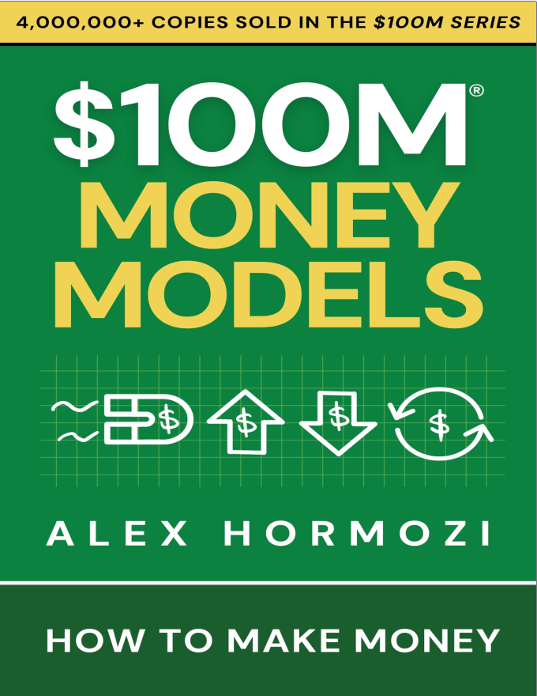
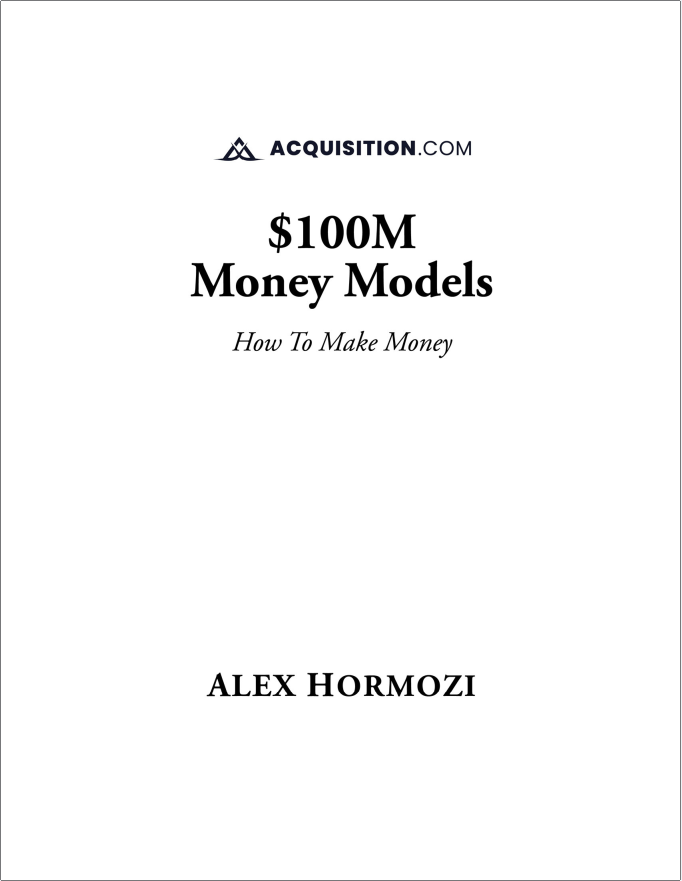

## Mọi người nói gì về Alex Hormozi

“Alex là chồng tôi.” - Leila Hormozi

“Tôi quen biết rất nhiều người, và Alex là một trong số đó.” - Những người bạn của Alex

“Alex làm những việc mà tôi đã tận mắt chứng kiến.” - Cha của Alex

“Alex giỏi một vài thứ này hơn những thứ khác.” - Mẹ của Alex

“Alex đã viết một cuốn sách. Tôi thì đã đọc rất nhiều sách rồi.” - Một nhà phê bình tạp chí

## Miễn trừ trách nhiệm

Thông tin trong cuốn sách này chỉ dành cho mục đích giáo dục và cung cấp thông tin. Tác giả, nhà xuất bản và nhà phân phối được cấp phép đã nỗ lực hết sức để đảm bảo thông tin chính xác tại thời điểm xuất bản. Tuy nhiên, tác giả, nhà xuất bản và nhà phân phối không đưa ra bất kỳ tuyên bố hay bảo đảm nào về khả năng thương mại, sự phù hợp cho một mục đích cụ thể, tính cập nhật, tính chính xác liên tục hoặc sự đầy đủ và tin cậy của nội dung cuốn sách này.

Các chiến lược, mẹo và công cụ được thảo luận trong sách là quan điểm cá nhân của tác giả và được cung cấp theo nguyên trạng (as-is). Chúng được biên soạn nhằm cung cấp tài liệu hữu ích và thông tin về các chủ đề được đề cập. Thành công trong bất kỳ nỗ lực marketing và kinh doanh nào đều phụ thuộc vào rất nhiều yếu tố riêng biệt của từng cá nhân hoặc doanh nghiệp.

Luật pháp có thể thay đổi và khác nhau tùy theo địa phương và quyền tài phán. Với tư cách là người đọc, bạn nên tham vấn ý kiến của các chuyên gia khi cần thiết và xem xét các luật địa phương hiện hành trước khi thực hiện bất kỳ chiến lược hoặc chiến dịch marketing nào.

Các số liệu về thu nhập và lợi nhuận mà tác giả đưa ra chỉ là những tuyên bố mang tính kỳ vọng về tiềm năng thu nhập của bạn. Sự thành công của tác giả và những người khác được đề cập ở đây, các cảm nhận khách hàng (testimonials) và các ví dụ khác được sử dụng đều là những kết quả đặc biệt, không điển hình và không nhằm mục đích đảm bảo rằng bạn hoặc những người khác sẽ đạt được kết quả tương tự. Kết quả cá nhân sẽ luôn khác biệt và kết quả của bạn sẽ phụ thuộc hoàn toàn vào năng lực cá nhân, đạo đức nghề nghiệp, kỹ năng kinh doanh và kinh nghiệm, mức độ động lực, sự siêng năng trong việc áp dụng các chiến lược, tình hình kinh tế, các rủi ro kinh doanh thông thường và bất ngờ, cũng như các yếu tố khác nằm trong hoặc ngoài tầm kiểm soát của bạn.

Không có sự đảm bảo nào về việc bạn sẽ đạt được bất kỳ kết quả nào từ những ý tưởng trong cuốn sách này. Tác giả, nhà xuất bản và nhà phân phối được cấp phép từ chối mọi tuyên bố hoặc bảo đảm (dù diễn đạt rõ ràng hay ngụ ý), bao gồm nhưng không giới hạn ở các bảo đảm về khả năng thương mại, sự phù hợp cho bất kỳ mục đích cụ thể nào, tính cập nhật, tính chính xác liên tục hoặc sự đầy đủ và tin cậy. Việc tin tưởng vào thông tin được cung cấp hoàn toàn là rủi ro của riêng bạn. Như đã mô tả ở đây, tác giả, nhà xuất bản và nhà phân phối được cấp phép trong bất kỳ trường hợp nào sẽ không chịu trách nhiệm với bạn hoặc bất kỳ bên nào về bất kỳ thiệt hại trực tiếp, gián tiếp, mang tính trừng phạt, đặc biệt, ngẫu nhiên, suy đoán hoặc hệ quả nào phát sinh trực tiếp hoặc gián tiếp từ việc sử dụng và/hoặc lạm dụng cuốn sách này, vốn được cung cấp theo nguyên trạng và không có bảo hành.

Như mọi khi, bạn nên tìm kiếm và nhận lời khuyên từ các chuyên gia có thẩm quyền về pháp lý, thuế, kế toán, tài chính hoặc các lĩnh vực chuyên môn khác.

Bất kỳ tuyên bố nào thể hiện hoặc có liên quan đến các cuộc thảo luận về dự đoán, mục tiêu, kỳ vọng, niềm tin, kế hoạch, dự án, mục tiêu, giả định hoặc các sự kiện hay hiệu quả hoạt động trong tương lai đều không phải là tuyên bố về sự thật lịch sử và có thể là "các tuyên bố mang tính dự báo" (forward looking statements). Các tuyên bố này dựa trên những kỳ vọng, ước tính và dự báo tại thời điểm đưa ra tuyên bố, bao gồm một số rủi ro và yếu tố không chắc chắn có thể khiến kết quả hoặc sự kiện thực tế khác biệt đáng kể so với những gì được dự kiến hiện tại.

Vận hành một doanh nghiệp luôn đi kèm rủi ro thua lỗ cũng như khả năng sinh lời. Tất cả các doanh nghiệp đều có rủi ro, và mọi quyết định kinh doanh vẫn là trách nhiệm của mỗi cá nhân. Tác giả, Bumble IP, LLC, Acquisition.com, LLC và các công ty liên kết (sau đây gọi chung là "Công ty") không đưa ra bất kỳ đảm bảo nào rằng các chiến lược nêu trong cuốn sách này sẽ mang lại lợi nhuận hoặc lợi ích cho bạn hoặc doanh nghiệp của bạn, và Công ty không chịu trách nhiệm cho bất kỳ tổn thất kinh doanh tiềm ẩn nào liên quan đến các chiến lược này.

Đại diện của Công ty là những chuyên gia, và kết quả của họ không phải là kết quả điển hình cho một cá nhân bình thường. Nền tảng kiến thức, giáo dục, nỗ lực và sự tận tâm của mỗi cá nhân và chủ doanh nghiệp sẽ ảnh hưởng đến trải nghiệm tổng thể của họ. Bất kỳ ví dụ nào được chia sẻ trong sách này chỉ mang tính chất minh họa và không phải là sự đảm bảo về lợi nhuận kinh doanh hoặc kết quả khác. Kết quả của mỗi người đọc có thể khác nhau. Công ty không đảm bảo hiệu quả hoạt động, tính hữu dụng hoặc khả năng áp dụng của bất kỳ trang web nào được liệt kê hoặc liên kết trong cuốn sách này. Tất cả các liên kết chỉ nhằm mục đích cung cấp thông tin và không được đảm bảo về nội dung, độ chính xác hoặc bất kỳ mục đích ngụ ý hay rõ ràng nào khác. Tất cả thông tin trong cuốn sách này liên quan đến việc vận hành doanh nghiệp và chiến lược kinh doanh chỉ mang tính chất giáo dục và không phải là sự đảm bảo cụ thể về thành công. Mặc dù các biện pháp phòng ngừa hợp lý đã được thực hiện trong quá trình biên soạn cuốn sách này, Công ty không chịu bất kỳ trách nhiệm nào đối với các sai sót và/hoặc thiếu sót. Cuốn sách này được xuất bản mà không có bất kỳ hình thức bảo hành hay đảm bảo nào, dù diễn đạt rõ ràng hay ngụ ý. Công ty không chịu trách nhiệm cho bất kỳ thiệt hại nào, bất kể phát sinh trực tiếp hay gián tiếp từ việc sử dụng và/hoặc lạm dụng cuốn sách này. Độc giả đồng ý miễn trừ và giữ cho Công ty cùng các thành viên, nhân viên, đại lý, đại diện, công ty liên kết, công ty con, người kế thừa và người được ủy quyền (gọi chung là "Đại lý") không bị tổn hại bởi bất kỳ và tất cả các khiếu nại, trách nhiệm pháp lý, tổn thất, nguyên nhân hành động, chi phí, lợi nhuận bị mất, cơ hội bị mất, các thiệt hại gián tiếp, đặc biệt, ngẫu nhiên, hệ quả, trừng phạt hoặc bất kỳ thiệt hại nào khác và chi phí (bao gồm, không giới hạn, chi phí tòa án và phí luật sư) (gọi chung là "Tổn thất") chống lại, phát sinh từ, áp đặt lên hoặc gánh chịu bởi bất kỳ Đại lý nào do kết quả của, hoặc phát sinh từ việc người đọc sử dụng và/hoặc lạm dụng cuốn sách này. Cuốn sách này chỉ dành cho mục đích cung cấp thông tin và giáo dục.

**KẾT QUẢ THỰC HIỆN GIẢ ĐỊNH CÓ NHIỀU HẠN CHẾ VỐN CÓ, MỘT SỐ TRONG ĐÓ ĐƯỢC MÔ TẢ DƯỚI ĐÂY. KHÔNG CÓ TUYÊN BỐ NÀO ĐƯỢC ĐƯA RA RẰNG BẤT KỲ DOANH NGHIỆP NÀO SẼ HOẶC CÓ KHẢ NĂNG ĐẠT ĐƯỢC LỢI NHUẬN HOẶC THUA LỖ TƯƠNG TỰ NHƯ NHỮNG GÌ ĐÃ ĐƯỢC TRÌNH BÀY HOẶC MÔ TẢ. TRÊN THỰC TẾ, THƯỜNG CÓ NHỮNG SỰ KHÁC BIỆT LỚN GIỮA KẾT QUẢ THỰC HIỆN GIẢ ĐỊNH VÀ KẾT QUẢ THỰC TẾ MÀ BẤT KỲ DOANH NGHIỆP CỤ THỂ NÀO ĐẠT ĐƯỢC SAU ĐÓ. MỘT TRONG NHỮNG HẠN CHẾ CỦA KẾT QUẢ THỰC HIỆN GIẢ ĐỊNH LÀ CHÚNG THƯỜNG ĐƯỢC CHUẨN BỊ VỚI LỢI THẾ CỦA VIỆC NHÌN LẠI QUÁ KHỨ (HINDSIGHT). NGOÀI RA, KINH DOANH GIẢ ĐỊNH KHÔNG BAO GỒM RỦI RO TÀI CHÍNH, VÀ KHÔNG CÓ HỒ SƠ KINH DOANH GIẢ ĐỊNH NÀO CÓ THỂ GIẢI THÍCH ĐẦY ĐỦ TÁC ĐỘNG CỦA RỦI RO TÀI CHÍNH VÀ CÁC RỦI RO KHÁC TRONG KINH DOANH THỰC TẾ. VÍ DỤ, KHẢ NĂNG CHỊU ĐỰNG THUA LỖ HOẶC KIÊN TRÌ VỚI MỘT CHIẾN LƯỢC KINH DOANH CỤ THỂ BẤT CHẤP THUA LỖ LÀ NHỮNG ĐIỂM QUAN TRỌNG CŨNG CÓ THỂ ẢNH HƯỞNG XẤU ĐẾN KẾT QUẢ KINH DOANH THỰC TẾ. CÒN CÓ RẤT NHIỀU YẾU TỐ KHÁC LIÊN QUAN ĐẾN THỊ TRƯỜNG NÓI CHUNG HOẶC VIỆC TRIỂN KHAI BẤT KỲ CHƯƠNG TRÌNH KINH DOANH CỤ THỂ NÀO MÀ KHÔNG THỂ ĐƯỢC TÍNH ĐẾN ĐẦY ĐỦ TRONG VIỆC CHUẨN BỊ HIỆU QUẢ HOẠT ĐỘNG GIẢ ĐỊNH.** Khi được sử dụng ở đây, "cuốn sách này" có nghĩa là cuốn sách, nội dung bên trong, và tất cả thông tin cũng như ý tưởng chứa đựng trong đó.

Bản quyền © 2025 bởi Bumble IP, LLC và được phân phối thông qua giấy phép bởi Acquisition.com, LLC.

Việc sao chép hoặc dịch bất kỳ phần nào của tác phẩm này vượt quá phạm vi được cho phép bởi Mục 107 hoặc 108 của Luật Bản quyền Hoa Kỳ năm 1976 mà không có sự cho phép của chủ sở hữu bản quyền là bất hợp pháp. Acquisition.com®, logo của nó và $100M® đều là các nhãn hiệu đã đăng ký của Bumble IP, LLC và được sử dụng thông qua giấy phép có giới hạn bởi Acquisition.com, LLC. Mọi quyền được bảo lưu, bao gồm quyền khai thác văn bản và dữ liệu (text and data mining) cũng như đào tạo các công nghệ trí tuệ nhân tạo hoặc các công nghệ tương tự.

## Nguyên tắc dẫn lối

“Rủi ro đến từ việc bạn không biết mình đang làm gì.” - Warren Buffett

“Quan trọng hơn cả ý chí chiến thắng là ý chí chuẩn bị.” - Charlie Munger

## Đôi lời ngắn gọn

**GỬI LEILA:**
Tôi đã viết lời đề tặng này bảy năm trước trong cuốn sách đầu tiên của mình...
*Tôi muốn cảm ơn người bạn đồng hành, người tri kỷ "vào sinh ra tử" của tôi, Leila. Em đã tìm thấy tôi vào lúc tôi tồi tệ nhất, và kể từ đó, em đã luôn sát cánh chiến đấu cùng tôi. Em từng nói rằng em sẵn sàng ngủ dưới chân cầu cùng tôi nếu đời đẩy đưa đến mức đó, và tôi chưa bao giờ quên điều ấy. Em đã đứng vững khi mọi thứ quanh tôi sụp đổ. Tôi sẵn sàng xông pha trận mạc cùng em. Tôi sẵn sàng hy sinh vì em. Nếu thế giới này là một cơn cuồng phong, thì được đứng bên em giống như đang ở trong tâm bão, bình thản quan sát cơn bão đang gào thét xung quanh. Chẳng có ai khác mà tôi muốn ở bên cạnh để cùng chiến đấu trong những trận chiến sắp tới hơn em. Ở bên em khiến những vì sao dường như cũng nằm trong tầm tay. Chúc cho một cuộc đời tràn đầy những điều bất khả thi.*
Và bảy năm sau... chẳng có gì thay đổi cả.

**GỬI TREVOR: Sắt mài nhọn sắt, cũng như người này mài giũa người kia.**
**Châm ngôn 27:17**
Thật hiếm có và tuyệt vời khi được người đàn ông thông minh nhất mà bạn từng gặp gọi là bạn. Nếu sự thiếu hiểu biết là cái ác thực sự duy nhất, và tri thức là cái thiện thực sự duy nhất, thì người anh em ạ, cậu chính là một sức mạnh của cái thiện. Thế giới này tốt đẹp hơn khi có cậu ở trong đó. Và tôi sẽ chiến đấu để giữ cho thế giới luôn như vậy. Cuộc sống của tôi sẽ không còn như thế nếu thiếu cậu. Tôi cũng sẽ không được như bây giờ nếu không có cậu. Tôi nghi ngờ rằng mình sẽ không bao giờ có thể trả hết ơn huệ mà cậu đã dành cho tôi khi xuất hiện trong cuộc đời mình. Nhưng tôi sẽ sống và cố gắng làm điều đó. Cảm ơn cậu vì đã tặng tôi một món quà mà ngay cả một đoạn văn ở đầu cuốn sách cũng không bao giờ đền đáp hết được. Chúng ta sẽ cùng nhau đặt viên gạch của mình lên bức tường chung. Chúc cho một tình bạn hiếm có trong đời. Philia.

## Mục lục

**Bắt đầu tại đây**

**Phần I: Money Model là gì?**
* Bốn loại Chào hàng tạo nên Money Model

**Phần II: Chào hàng Thu hút (Attraction Offers)**
* Hoàn tiền khi đạt mục tiêu (Win Your Money Back)
* Quà tặng miễn phí (Giveaways)
* Chào hàng "Chim mồi" (Decoy Offer)
* Mua X Tặng Y (Buy X Get Y Free)
* Trả ít bây giờ hoặc Trả nhiều sau này (Pay Less Now or Pay More Later)
* Chào hàng "Tạo thiện cảm" miễn phí (Free Goodwill Offer)
* Kết luận về Chào hàng Thu hút

**Phần III: Upsell Offers**
* Classic Upsell
* Menu Upsell
* Anchor Upsell
* Rollover Upsell
* Kết luận về Upsell Offers

**Phần IV: Downsell Offers**
* Bán giảm bằng trả góp (Payment Plan Downsells)
* Dùng thử có điều kiện (Trial With Penalty)
* Bán giảm bằng cách bớt tính năng (Feature Downsells)
* Kết luận về Downsell Offers

**Phần V: Lời đề nghị Duy trì (Continuity Offers)**
* Lời đề nghị Thưởng duy trì (Continuity Bonus Offers)
* Lời đề nghị Giảm giá duy trì (Continuity Discount Offers)
* Lời đề nghị Miễn phí khởi tạo (Waived Fee Offer)
* Kết luận về Chào hàng Duy trì

**Phần VI: Xây dựng Money Model của bạn**
* Mười năm gói gọn trong mười phút (Ten Years In Ten Minutes)
* Lời kết (Final Thoughts)
* Quà tặng miễn phí (Free Goodies)