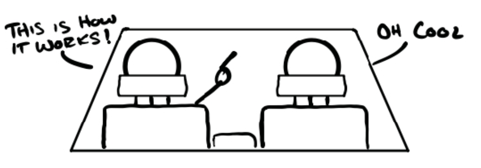
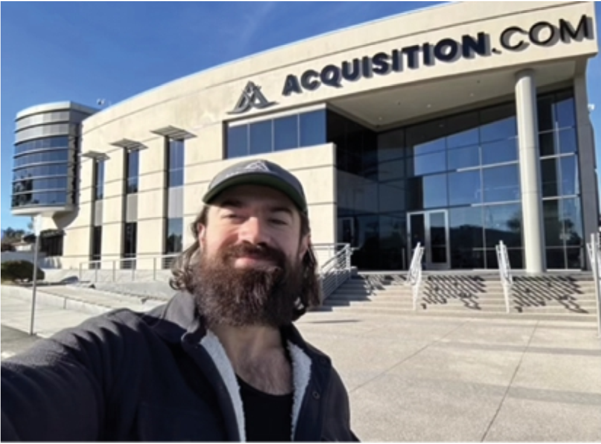

# START HERE

>"Thế giới này đánh gục tất cả mọi người, và sau đó, nhiều người trở nên mạnh mẽ hơn chính tại những nơi họ từng tan vỡ." - Ernest Hemingway

>Where I slept at my first gym: my \"concrete bedroom.\"

Tôi nằm bất động, nhìn chằm chằm lên trần nhà trong bóng tối, cô độc. Tôi chẳng còn ai để bấu víu. Nghe thì có vẻ ngầu khi kể lại câu chuyện này về sau, nhưng lúc đó thì chẳng thấy thế chút nào. Tôi đã thực sự cảm thấy sợ hãi.

Tôi đã đi ngược lại mong muốn của cha mình. Tôi bỏ ngang trường kinh doanh. Tôi dồn hết số tiền tiết kiệm ít ỏi của mình vào đó. Tất cả những người tôi yêu quý đều khuyên tôi đừng làm vậy. Trong mắt họ, tôi là kẻ ngốc đã từ bỏ một sự nghiệp đầy hứa hẹn.

Tôi từng nghĩ mình sẽ mong chờ những thử thách này. Nhưng rồi, thực tế ập đến... nhanh khủng khiếp. 

Đám trẻ tụ tập tiệc tùng thâu đêm suốt sáng ở bãi đậu xe ngay phía trên tôi. Chúng đua xe qua những tấm chắn bằng thép. Tiếng động vang vọng vào cái phòng ngủ bằng bê tông của tôi nghe chẳng khác nào tiếng súng. Và ngay khi tôi vừa chợp mắt được một chút, tôi lại bị dựng ngược dậy bởi những tiếng "bang-bang bang-bang" chát chúa.

Cuối cùng, tôi bỏ cuộc, không cố ngủ ban đêm nữa. Tôi chấp nhận những giấc ngủ trưa chớp nhoáng trong cái kho chứa đồ chật hẹp. Thế rồi, giữa đêm khuya thanh vắng, tôi lao vào làm việc. Tôi buộc phải kiếm được tiền.

Phòng gym của tôi nằm ngay đối diện một cơ sở kinh doanh cho thuê kho bãi lớn. Ông chủ ở đó trở thành một trong số ít những hội viên của tôi… chắc cũng chỉ vì tiện đường. Vài tuần sau khi tham gia, ông ấy kéo tôi ra một góc sau buổi tập. “Chú có làm mấy phép tính nhẩm,” ông nói tiếp, “Có vẻ như cháu đang đuối sức đấy.” Tôi cố giấu sự xấu hổ của mình nhưng không thành. “Được rồi chàng trai. Sáng mai đi ăn sáng với chú.” Tôi ngập ngừng, nghĩ về số dư trong tài khoản ngân hàng của mình. Chưa kịp trả lời, ông đã bồi thêm: “...đừng lo. Chú bao.” Thật nhẹ nhõm.

Sáng hôm sau, chúng tôi gặp nhau tại một quán ăn địa phương vào khoảng 5 giờ sáng. Khi cô phục vụ mang cà phê ra, ông hỏi: “Cháu còn sống được bao lâu nữa?”

“Dạ?” 

“Cháu còn bao nhiêu tiền mặt tích trữ?” 

“Dạ, khoảng năm ngàn đô.” 

“Chỗ đó cầm cự được bao lâu trước khi sạch túi?” 

Tôi suy nghĩ một chút. “Khoảng một tháng ạ.” 

“Căng đấy. Thế cháu tìm khách bằng cách nào?” 

“Cháu có gói khuyến mãi 39 đô cho sáu tuần trên một trang web giảm giá.” 

“Được bao nhiêu khách rồi?” 

“Dạ, bốn người.” 

“Có vẻ cháu đang gặp vấn đề lớn… và cần giải quyết nó… thật nhanh.” Ông để mặc câu nói đó thấm dần vào đầu tôi. Rồi tôi thấy một nụ cười nở trên khuôn mặt ông. “Để chú hỏi cháu câu này… Một tháng thuê kho miễn phí thì tốn bao nhiêu tiền?” 

Tôi nhún vai… “Ơ, không tốn gì ạ?”

Nhận ra sự bối rối của tôi, ông nói: “Được rồi, đi một chuyến với chú. Chú sẽ giải thích ngay tại cơ sở của chú.”

Ngay khi chúng tôi bước vào, cô gái ở quầy lễ tân chào đón: “Chào buổi sáng, các quý ông!”

“Chào Judy. Một tháng thuê kho miễn phí giá bao nhiêu?” 

“127 đô thưa sếp,” cô ấy vui vẻ trả lời.

Ông mỉm cười rồi quay sang tôi. “Muốn biết tại sao không?” Tôi gật đầu. Ông dẫn tôi đi xuyên qua văn phòng và xuống một dãy các kho hàng vừa mới sơn xong.

“Thế này nhé, chú quảng cáo tháng đầu tiên miễn phí, và đúng là nó miễn phí thật. Nhưng thứ đầu tiên cháu cần sau khi thuê một cái kho là gì?”

“Cháu không biết ạ.”

“Chính xác. Chẳng ai thực sự biết cả. Nhưng chú thì biết—và chú giúp họ. Để chú gợi ý cho cháu nhé…” Ông chỉ tay vào cái ổ khóa trên cửa.

“Đúng rồi… một cái khóa!” 

“Phải, và không phải loại khóa lỏng lẻo mà bọn trẻ con hay dùng cho tủ đồ đâu. Loại đó chẳng vừa đâu. Chưa kể, mấy tay trộm cầm kìm trợ lực là cắt được trong một nốt nhạc… nhưng không thể làm gì được với ‘gã khổng lồ’ này đâu.” Ông gõ nhẹ vào cái khóa để nhấn mạnh. 

“Chà, nhìn chắc chắn thật đấy. Mà lấy loại này ở đâu được hả chú?” 

“Hỏi hay lắm. Chú có nguyên một kho đầy loại này. Cháu có thể sở hữu một cái ngay hôm nay chỉ với 47 đô thôi.” 

“À, ra là vậy… họ đến vì tháng miễn phí nhưng thuê kho mà không khóa lại được thì thuê làm gì?” 

“Chuẩn luôn,” ông nói. 

“Cháu hiểu rồi, vậy còn 80 đô nữa ở đâu ra ạ?” 

“Trí nhớ tốt đấy. Thế cháu sẽ cần gì nữa nào?”

Tôi nhún vai. 

“Này, nếu cháu có đồ để cất, cháu sẽ cần hộp để đựng chúng chứ! Nhưng đừng lo. Chú có đủ loại thùng với đủ kích cỡ và hình dáng để đáp ứng mọi nhu cầu. Chú cũng có sẵn băng keo, nhãn dán, và bút lông loại xịn để đảm bảo cháu biết chính xác cái gì ở trong hộp nào và đặt ở đâu. Cực kỳ tiện lợi.” 

“Ồ, đúng rồi. Nghe hợp lý quá ạ.” 

“Cháu còn cần gì nữa nào?” 

“Cháu không biết… thuê người chuyển đồ giúp ạ?” 

“Đúng! Thực ra bên chú không tự làm dịch vụ chuyển nhà. Nhưng chú có liên kết với một đơn vị vận chuyển địa phương và nhận hoa hồng từ họ. Còn nếu cháu muốn tự mình làm việc đó thì cũng được thôi. Chú có sẵn xe đẩy, xe kéo tay, dây buộc và đủ thứ công cụ hữu ích khác… có tính phí nhé. Suy cho cùng, mua cả đống thứ chỉ dùng một lần làm gì cho phí tiền?” 

“Ồ phải, cháu không nghĩ tới cái đó.” 

“Cháu còn cần gì nữa nào?” 

“Ơ, cháu thực sự không biết nữa.” 

“Chà, đồ cháu cất đi là đồ có giá trị, đúng không? Ít nhất là có giá trị với cháu. Chứ không thì cháu đã tống ra bãi rác rồi! Thế nên… cháu sẽ muốn mua bảo hiểm phòng trường hợp có chuyện không hay xảy ra. Hiện tại, chú đã tặng sẵn 500 đô bảo hiểm miễn phí cho mọi khách hàng. Nhưng nếu cháu dùng loại khóa đặc biệt mà chỉ chú mới có, chú sẽ nâng mức bảo hiểm lên 100.000 đô, chỉ với 10 đô cộng thêm mỗi tháng.” Ông tự hào ưỡn ngực. 

“Kinh thật. Và tất cả cộng lại là 127 đô ạ?” 

“Ừ. Nhưng chưa hết đâu. Cháu biết chuyện gì luôn luôn xảy ra không?” 

Đã hiểu được cuộc chơi, tôi tung hứng theo: “Cháu chịu, chuyện gì ạ?” 

“Ai cũng có nhiều đồ hơn họ tưởng. Và họ luôn thuê cái kho quá nhỏ! Thực tế, chuyện này xảy ra thường xuyên đến nỗi chú luôn mời họ dùng cỡ lớn hơn một nấc. Họ có không gian họ cần, còn chú kiếm thêm được vài đồng. Ai cũng có lợi cả.” 

“Woa. Tuyệt thật đấy. Cháu chưa bao giờ biết mấy thứ này.” 

“Dĩ nhiên rồi. Cháu biết sao được?” 

“Cũng đúng ạ. Nhưng cháu có thể áp dụng cái này để phát triển phòng gym của mình thế nào đây?” 

“Ừ. Chú đã chơi trò này lâu bằng đúng số tuổi của cháu rồi đấy. Và khi cháu tìm ra cách kiếm tiền trong một ngành kinh doanh, ý chú là thực sự hiểu thấu nó, cháu sẽ thấy cách kiếm tiền trong bất kỳ ngành nào khác. Và có một điều chắc chắn: Càng chơi lâu, cháu càng học được nhiều.” 

“Oa, vậy là chú đã sở hữu chỗ này 23 năm rồi ạ?” 

“Chỗ này á, không. Đây là một trong những cơ sở mới của chú thôi.” 

“Chú có nhiều hơn một cơ sở ạ?” 

“Chú có 27 cái.” 

“Ôi… trời đất.” Tôi cảm thấy mình bé nhỏ vô cùng. 

“Thôi, chú phải làm việc đây. Cháu biết đường ra chứ?” 

“Dạ,” tôi cười nhẹ. “Cháu nghĩ mình có thể đi bộ qua đường được ạ.”

2 năm rưỡi sau . . .

Giờ tôi đã có sáu phòng gym. Tôi đã nâng cấp bản thân lên một tầm cao mới. Và tôi lại muốn tiến xa hơn nữa. Thế là tôi chi hẳn 25.000 đô chỉ để đổi lấy một giờ đồng hồ nói chuyện với một chuyên gia marketing lừng danh. Tôi chưa bao giờ nói chuyện với ông ấy trước đó, nhưng tôi thuộc lòng mọi kiến thức của ông ấy như lòng bàn tay. Tôi chỉ có một mục tiêu duy nhất cho cuộc gọi này—nhờ ông ấy giúp tôi mở rộng quy mô chuỗi phòng gym của mình.

Sau màn chào hỏi ngắn gọn, chúng tôi bắt tay ngay vào việc.

“...vậy đó, đó là cách tôi lấp đầy các phòng gym ngay ngày đầu khai trương. Tôi đặt cọc 3.000 đô tiền thuê mặt bằng và chạy quảng cáo trong vài ngày. Tôi chốt khách ngay trong một phòng gym còn trống rỗng. Sau đó, tiền từ những người đăng ký đó sẽ được dùng để chạy thêm quảng cáo, mua thiết bị, sơn sửa, làm sàn, nội thất, bảng hiệu và bất cứ thứ gì khác mà cơ sở đó cần. Làm theo cách này, cứ sáu tháng tôi lại mở một cơ sở mới mà không hề mắc nợ.”

“Oa—tuyệt thật đấy! Giải thích chi tiết hơn cho tôi nghe chút được không?”

Việc kinh doanh của ông ấy đang kiếm được cả triệu đô mỗi tháng. Những con số đó làm tôi choáng ngợp. Vậy mà ông ấy lại muốn nghe cách tôi làm quảng cáo sao? Tôi không khỏi tự hào.

“Tôi chạy quảng cáo cho chương trình 'Thử thách 6 tuần miễn phí' cho đến khi nhận được khoảng 20 khách hàng tiềm năng mỗi ngày,” tôi nói.

“Hiểu rồi, nói tiếp đi,” ông ấy đáp.

“Khoảng một nửa số khách đó sẽ đến lịch hẹn. Tôi bán được cho một nửa số người đến cuộc hẹn một chương trình 600 đô. Vậy là khoảng 25% số khách tiềm năng trở thành khách hàng trả tiền. Tôi còn kiếm thêm được 80 đô lợi nhuận trên mỗi khách từ việc bán thực phẩm chức năng. Cũng không tệ lắm.”

“Đồng ý,” ông ấy ậm ừ. “Vậy là cậu kiếm được khoảng 680 đô trên mỗi khách hàng trước khi cả khi mở cửa. Khá là ngon đấy… nhưng cậu bỏ sót điều gì đó rồi.”

“Tôi bỏ sót gì ạ?”

“Cậu trả bao nhiêu tiền cho một khách hàng tiềm năng?”

“Hừm… 5 đô.” Nếu có khoảnh khắc nào đó mà không gian xung quanh tôi tĩnh lặng đến nghẹt thở—thì chính là lúc này.

Ông ấy lắp bắp một chút: “Nghĩa là cậu bỏ ra một đô… và thu về 34 đô… trong vòng 48 giờ?” 

“Đúng vậy? Như vậy là tốt ạ?” 

“Nó quá kinh khủng,” ông ấy nói. “Thế cậu có làm gì ở giai đoạn sau không?”

Tôi cười đến tận mang tai. “Có chứ! Vài tuần sau, tôi bảo họ là họ có thể nhận lại 600 đô đó dưới dạng tiền trừ vào phí nếu họ chọn đăng ký gói một năm. Hai phần ba số người đăng ký đã chuyển đổi sang thẻ thành viên năm. Kết quả là tôi có một phòng gym kín chỗ và thu về 20.000 đô phí thành viên hàng tháng… chỉ với 3.000 đô tiền vốn ban đầu. Sau đó tôi cứ thế mà lặp lại quy trình thôi.”

“Đợi chút, cậu làm tất cả đống này chỉ trong ba mươi ngày?”

“Đúng vậy. Tuyệt đúng không?”

Ông ấy dụi mắt. “Cậu không nên đi điều hành phòng gym làm gì.”

Trời đất ơi. Tôi cứ tưởng ông ấy định khen tôi—vậy mà ông ấy lại bảo tôi nên bỏ cuộc sao? Đầu óc tôi quay cuồng…

“Alex,” ông ấy nói, kéo tôi về thực tại, “Cậu đang sở hữu kỹ năng cấp độ 10 trong một cơ hội chỉ ở cấp độ 2.”

Ít nhất thì ông ấy cũng không nghĩ là tôi tệ. “Vâng, vậy tôi nên làm gì?”

“Cậu không nên đi điều hành phòng gym. Cậu nên đi chỉ cho các chủ phòng gym khác cách làm những gì cậu vừa cho tôi thấy.”

Tôi ghét cái ý tưởng phải từ bỏ những gì mình đã mất nhiều năm để gây dựng. Nhưng… ông ấy kiếm được nhiều hơn tôi rất nhiều. Tôi tự nhủ, nếu mình lờ đi lời khuyên này thì chẳng khác nào đem tiền đi đốt. Vậy là tôi nghe theo ông ấy.

************

Trong chín tháng tiếp theo, tôi đóng cửa phòng gym mới nhất và bán năm cơ sở còn lại. Việc đó giúp tôi có thời gian để dồn toàn lực vào công ty mới: Gym Launch. Trong hai năm sau đó, tôi bay khắp đất nước để vực dậy các phòng gym đang thua lỗ. Sau khi đã trực tiếp giải cứu hơn 30 phòng gym, tôi chuyển sang mô hình nhượng quyền bản quyền (licensing). Tôi không còn phải đích thân bay đi nữa. Thay vào đó, tôi giúp họ làm theo mô hình đã được chứng minh của mình để lấp đầy phòng gym và tăng lợi nhuận. Đó là một thị trường nhỏ, chắc chắn rồi, nhưng họ đang rất "đói"—một vài người còn theo đúng nghĩa đen. Nhưng một khi họ lấp đầy phòng gym trong ba mươi ngày, họ kể với bạn bè mình. Gym Launch phất lên như diều gặp gió. Thật điên rồ.

Trong năm năm tiếp theo, tôi đã thu về hơn 43.000.000 đô lợi nhuận cho các chủ sở hữu. Sau đó, tôi bán 66% cổ phần công ty với giá 46.200.000 đô trong một thương vụ thanh toán hoàn toàn bằng tiền mặt. Với thương vụ đó, tôi đã vượt mốc tài sản ròng 100 triệu đô ở tuổi 31. Và nói thẳng ra, không ai ngạc nhiên hơn chính bản thân tôi.

Từ đó, vợ chồng tôi thành lập văn phòng gia đình Acquisition.com để đầu tư vào những doanh nghiệp mà chúng tôi biết cách thúc đẩy tăng trưởng. Danh mục đầu tư của chúng tôi tại thời điểm viết cuốn sách này mang lại doanh thu hàng năm hơn 200.000.000 đô. Nó bao gồm các chuỗi cửa hàng vật lý, phần mềm, dịch vụ và thương mại điện tử. Mặc dù chúng tôi hoạt động trong nhiều ngành nghề khác nhau, nhưng các công ty của chúng tôi đều tăng trưởng dựa trên cùng những nguyên tắc mà tôi chia sẻ trong cuốn sách này.

## BẠN SẼ NHẬN ĐƯỢC GÌ?

Trong vài trang vừa qua, tôi đã đưa bạn từ chỗ phải ngủ dưới sàn nhà đến khi vượt mốc tài sản ròng 100 triệu đô. Câu hỏi tự nhiên nảy sinh là… làm thế nào? Câu trả lời: bằng cách kiếm được nhiều tiền từ khách hàng hơn là chi phí để có được họ. Và đó chính là nội dung của cuốn sách $100M Money Models (Các Mô Hình Kiếm Tiền Trăm Triệu Đô) này.

Từ khi tôi bắt đầu kinh doanh, bối cảnh đã thay đổi nhiều lần. Và nó sẽ còn tiếp tục thay đổi. Tin tốt là, các nguyên tắc cốt lõi sẽ giúp bạn "in tiền" dù trong hoàn cảnh nào đi nữa. Tôi đã học được rất nhiều Mô hình Kiếm tiền. Tôi sẽ trình bày những mô hình tâm đắc nhất của mình ở đây.

Cuốn sách này giới thiệu những lời chào hàng đã được chứng minh hiệu quả mà bạn có thể áp dụng ngay hôm nay, kèm theo hướng dẫn để biến chúng thành hiện thực. Hãy coi cuốn sách này như một tệp vé số đã trúng thưởng—việc của bạn chỉ là đi lĩnh thưởng thôi.

Ngoài ra, tôi muốn nói rõ một điều, đây là những ghi chép cá nhân của tôi. Nếu nó xuất hiện ở đây, nghĩa là tôi đã kiếm được tiền nhờ nó. Những chương này chứa đựng những quan sát và kinh nghiệm của tôi với nhiều loại hình kinh doanh khác nhau. Từ chuỗi cửa hàng địa phương, đến sản phẩm vật lý, dịch vụ, giáo dục, phần mềm, v.v. Tất cả vốn nằm rải rác khắp nơi suốt nhiều năm qua. Cho đến bây giờ.

## Cấu trúc của cuốn sách

Cuốn sách này dạy bạn một điều cực kỳ lợi hại: cách xây dựng một Mô hình Kiếm tiền Trăm triệu đô. Với mô hình này, bạn kiếm được nhiều tiền đến mức trong 30 ngày đầu tiên, chi phí để có thêm khách hàng mới sẽ không bao giờ là vấn đề nữa. Với lượng khách hàng khổng lồ, bạn sẽ bị buộc phải cải thiện mọi thứ khác trong doanh nghiệp của mình chỉ để kịp đáp ứng! Đó là vấn đề để một cuốn sách khác giải quyết sau (nháy mắt).

### Dàn ý cuốn sách:

Bắt đầu tại đây: Bạn vừa đọc xong phần này.

Phần I: Mô hình Kiếm tiền là gì? Sắp tới đây…

Phần II: Lời chào hàng Thu hút (Attraction Offers)

Phần III: Lời chào hàng Bán thêm (Upsell Offers)

Phần IV: Lời chào hàng Bán giảm (Downsell Offers)

Phần V: Lời chào hàng Duy trì (Continuity Offers)

Phần VI: Xây dựng Mô hình Kiếm tiền của bạn

Chỉ vậy thôi. Rất đơn giản. Bắt đầu thôi nào.

>### Mẹo nhỏ: Học nhanh và sâu hơn bằng cách vừa đọc vừa nghe cùng lúc
>
>Đây là một "mẹo hack đời" mà tôi tình cờ phát hiện ra vài năm trước. Nếu bạn vừa nghe sách nói vừa đọc bản giấy hoặc ebook cùng lúc, bạn sẽ đọc nhanh hơn và nhớ lâu hơn. Bạn lưu trữ nội dung ở nhiều vị trí hơn trong não bộ. Rất thú vị. Đây là cách tôi đọc những cuốn sách đáng đọc.
>
>Tôi làm cả hai vì tôi vốn khó tập trung. Nghe âm thanh trong khi đọc giúp tôi tránh bị "lơ đễnh". Tôi mất hai ngày để thu âm cuốn sách này. Tôi làm vậy để nếu bạn cũng gặp khó khăn như tôi, bạn sẽ không còn phải chịu đựng nữa.
>
>Nếu bạn muốn thử, hãy lấy phiên bản sách nói và tự mình trải nghiệm. Tôi đã để giá sách của mình rẻ nhất có thể trên các nền tảng, vì vậy đây không phải là chiêu trò để kiếm thêm vài đồng lẻ đâu—tôi hứa đấy. Hy vọng bạn thấy nó giá trị như tôi đã thấy.
>
>Tôi quyết định đưa "mẹo" này vào ngay từ đầu. Như vậy bạn sẽ có cơ hội áp dụng nếu thấy chương đầu tiên đủ giá trị để bạn dành sự quan tâm.

>### Mẹo nhỏ: Bí kíp để đọc xong một cuốn sách
>
>Tôi rất dễ bị xao nhãng. Vì vậy tôi cần những mẹo nhỏ để giữ sự chú ý của mình. Cái này giúp ích cho tôi rất nhiều: Hãy đọc hết chương. Đừng dừng lại ở giữa chừng. Việc hoàn thành một chương mang lại cho bạn sự khích lệ tích cực, giúp bạn có động lực đi tiếp. Vì vậy, nếu gặp một chương khó nhằn, hãy cố đọc cho hết để có thể bắt đầu một khởi đầu mới ở chương tiếp theo.