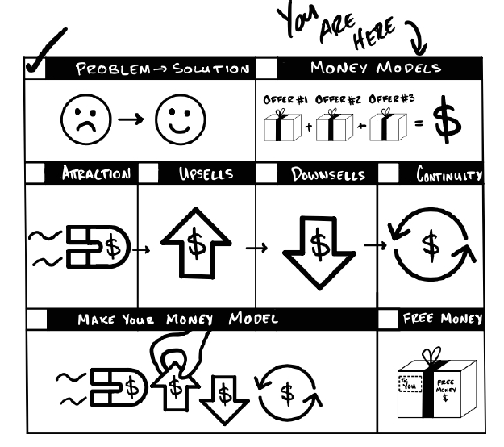
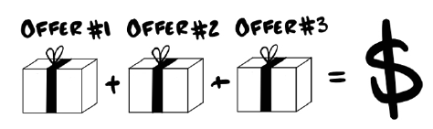
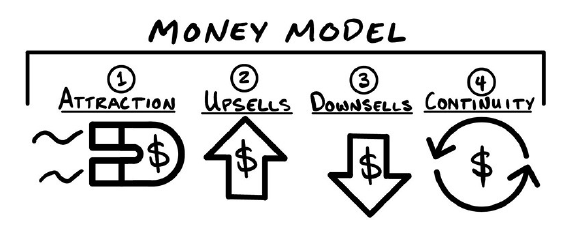

# PHẦN I: MONEY MODEL LÀ GÌ?

>“Hormozi có tỷ suất lợi nhuận trên quảng cáo cao nhất trong số các doanh nghiệp sử dụng nền tảng theo dõi của chúng tôi... bỏ xa mọi đối thủ. Anh ấy có khoảng cách lớn nhất mà chúng tôi từng thấy giữa số tiền chi ra và số tiền thu về. Và chúng tôi chỉ làm việc với những doanh nghiệp chi ít nhất 250.000 đô mỗi năm cho marketing, vì vậy đây đều là những tay làm marketing hàng đầu, và con số của anh ấy nằm ở một đẳng cấp hoàn toàn khác khi so sánh.” - Alex Becker, CEO, Hyros.com

Tháng 12 năm 2019.

“Chào ông, cho tôi mượn giấy tờ tùy thân để kiểm tra thông tin đặt chỗ nhé?” nhân viên cho thuê xe mỉm cười nói. Tôi đã chuẩn bị sẵn và đẩy nó qua quầy.

“Hừm. Có vẻ như chúng tôi không còn loại xe ông đã đặt. Tuy nhiên chúng tôi có một chiếc tương đương… nhưng ông trông khá cao lớn đấy. Ông có muốn đổi sang một chiếc xe bán tải rộng rãi hơn không?”

“Vâng, nghe hay đấy,” tôi đáp.

“Tôi thấy ông đặt xe trong ba ngày.” Cô ấy hơi nghiêng đầu một chút. “Ông có muốn chọn gói trả xe muộn để có thể trả xe bất cứ lúc nào trong ngày mà không phải lo về phí phạt trả chậm không?”

Tôi mở lịch trình trên điện thoại lên. “Được thôi, chúng tôi có chuyến bay buổi tối. Nghe hợp lý đấy.”

“Tuyệt quá. Đợi tôi một giây… tôi đang nhập thông tin. Thế ông có muốn mua gói bảo hiểm tốt hơn để bao trả cho các vết trầy xước hay móp méo trên xe không? Nó sẽ chi trả cho mọi hư hại của xe trong suốt thời gian ông sử dụng.”

“Không, tôi ổn. Tôi không định đi đua xe ở đây đâu,” tôi đùa.

“Vậy chỉ dùng gói bảo hiểm tối thiểu thôi đúng không ạ?”

“Đúng rồi. Chỉ cần thế thôi.”

“Được rồi, tôi sẽ đưa chìa khóa cho ông ngay đây. Ông có muốn chúng tôi lo phần xăng xe để ông không phải bận tâm về việc đổ đầy bình trước khi trả không? Ông có thể trả xe khi bình cạn sạch mà không lo về phí phạt. Chúng tôi tính giá 3,75 đô/gallon.”

“Giá xăng quanh đây bao nhiêu?” tôi hỏi.

“Khoảng 3,50 đô/gallon,” cô ấy vui vẻ trả lời.

“Chắc chắn rồi, tại sao không nhỉ. Tôi ghét nhất là phải đi tìm chỗ đổ xăng khi đang vội ra sân bay.”

“Xong rồi ạ! Đây là hóa đơn của ông. Cứ đi vòng qua góc kia, chiếc xe bán tải của ông nằm ở khoảng giữa dãy bên trái. Chúc ông có một chuyến đi vui vẻ!”

Khi bước đi, tôi liếc nhìn hóa đơn và khựng lại. Tôi chỉ biết tự cười nhạo chính mình. Tôi đến để thuê một chiếc xe giá 19 đô/ngày và khi rời đi, tôi đang trả 100 đô/ngày. Gấp 5 lần! Và đó chính là sức mạnh của một Money Model được thiết kế tốt. Họ biết chính xác mọi thứ tôi muốn (và cả những thứ tôi còn chưa biết là mình sẽ muốn). Và khi họ chào mời chúng cho tôi, tôi đã vui vẻ rút ví.

## Một Mô Hình Kiếm Tiền vừa diễn ra

Một Mô Hình Kiếm Tiền thực chất là một chuỗi các lời chào hàng nối tiếp nhau. Về cốt lõi, chúng ta tìm kiếm mọi cơ hội để giải quyết vấn đề của khách hàng… và sau đó đưa ra lời đề nghị giải quyết nó. Vì lý do đó, các Mô Hình Kiếm Tiền thường có rất nhiều lời chào hàng theo một thứ tự cụ thể. Nếu bạn chào hàng đúng thứ ngay khi khách hàng nhận ra họ cần nó, bạn có thể đưa ra bao nhiêu lời chào hàng tùy thích.

Đây là Mô Hình Kiếm Tiền của công ty cho thuê xe được phát biểu một cách bình dân:
* Offer #1: Nâng cấp loại xe
* Offer #2: Trả xe muộn
* Offer #3: Bảo hiểm cao cấp
* Offer #4: Bán giảm (Downsell) xuống gói bảo hiểm tối thiểu
* Offer #5: Trả trước tiền xăng

Đúng vậy, tôi đã trả nhiều tiền hơn, nhưng nó cũng giải quyết được nhiều vấn đề hơn. Hãy thử mổ xẻ những vấn đề mà cô ấy đã giải quyết giúp tôi:
* Cô ấy giải quyết vấn đề "người to con ngồi xe nhỏ" bằng cách gợi ý một chiếc xe rộng rãi hơn.
* Cô ấy giải quyết vấn đề "giờ giấc gò bó" bằng cách cho phép tôi linh hoạt giữ xe lâu hơn.
* Cô ấy giải quyết "nỗi lo xảy ra va chạm" bằng cách đưa ra gói bảo hiểm bảo vệ tôi.
* Cô ấy giải quyết nguy cơ "trễ chuyến bay" bằng cách cho phép trả trước tiền xăng để tôi không phải tốn công đi đổ xăng lúc quay về.

…Và tất cả những thứ đó đều tốn tiền mà tôi lại rất vui vẻ chi trả.

Công ty cho thuê xe đã tính toán đến từng chi tiết nhỏ nhất. Họ chỉ ra vấn đề cho tôi thấy, sau đó cung cấp giải pháp ngay lập tức. Họ đưa ra các giải pháp cho những khoản phí cao hơn và những rắc rối mà tôi có thể gặp phải sau này bằng những khoản phí nhỏ hơn ngay tại thời điểm này.

Kết quả là, khoản thuê xe 19 đô của tôi đã trở thành 100 đô. Tôi đã trả nhiều tiền hơn một cách nhanh chóng. Và giờ đây, chúng ta có thể thấy tại sao ngành kinh doanh cho thuê xe tại Hoa Kỳ lại có lợi nhuận đến thế. Một Mô Hình Kiếm Tiền thành công.

### Cẩn trọng: Những Mô Hình Kiếm Tiền tồi sẽ giết chết doanh nghiệp

Nhiều doanh nghiệp tốn nhiều chi phí để khiến ai đó mua một món hàng hơn là số lợi nhuận họ thu được từ món hàng đó. Nói cách khác, họ đang lỗ tiền để có được khách hàng mới—đó là một vấn đề lớn.

Và đây là những gì sẽ xảy ra…
* Họ chi tiền để có khách hàng.
* Cuối tháng, họ nhận ra mình đã chi nhiều hơn số tiền kiếm được.
* Họ cắt giảm quảng cáo.
* Có ít khách hàng hơn mức họ có thể phục vụ vì họ không đủ khả năng chi trả để có thêm khách.
* Sau đó, cắt bỏ quảng cáo hoàn toàn.
* Duy trì doanh nghiệp bằng tiền túi cá nhân, các khoản vay, tín dụng, và rồi… cầu nguyện cho có lợi nhuận.
* Bán đi cổ phần doanh nghiệp chỉ để duy trì hoạt động.
* Chờ đợi hàng tháng (hoặc hàng năm!) để thu hồi vốn… nếu có thể.
* Càng lúc càng tụt hậu cho đến khi…
* Cuối cùng, họ mất trắng tất cả.

Nhưng mọi chuyện không nhất thiết phải như vậy. Tiền ngoài kia có rất nhiều. Bạn chỉ việc đi lấy nó thôi.

Trong kinh doanh truyền thống, những dòng lợi nhuận nhỏ giọt từ rất nhiều khách hàng cuối cùng mới đủ để chi trả cho chi phí có được một khách hàng duy nhất. Sự "nhỏ giọt" này làm doanh nghiệp bị thiếu hụt tiền mặt. Điều đó có nghĩa là họ chỉ có thể có nhiều khách hàng thông qua quảng cáo… Nếu họ đã có sẵn rất nhiều khách hàng rồi! Các công ty lớn (hoặc công ty nhỏ có nhà đầu tư) có thể làm điều này vì họ có tiền để đốt.

Hãy thử nghĩ theo cách này. Nếu bạn chi 100 đô quảng cáo để có một khách hàng và kiếm được 500 đô lợi nhuận từ họ, đó là một thương vụ tuyệt vời. Bạn nên làm điều đó suốt cả ngày. Nhưng nếu bạn mất tới hai năm để thu hồi lại số tiền mặt đó thì sao? Đó là một doanh nghiệp tốt…nếu bạn đã có sẵn hàng tấn tiền mặt trong ngân hàng. Nếu không, bạn sẽ hết sạch tiền. Điều đó để lại cho bạn hai lựa chọn:
* Lựa chọn #1: Đợi hai năm để được trả tiền và cầu nguyện rằng bạn không bị hết tiền.
* Lựa chọn #2: Được trả tiền thật nhanh và phát triển bao nhiêu tùy thích.

Một Mô Hình Kiếm Tiền tốt chính là lựa chọn số 2.

>### Ghi chú của tác giả: Hãy kiếm đủ lợi nhuận để bù đắp chi phí trong vòng 30 ngày hoặc ít hơn
>
>Tôi thích việc thu hồi chi phí để có được một khách hàng trong vòng 30 ngày. Lý do chính: bất kỳ doanh nghiệp nào cũng có thể vay tiền không lãi suất trong 30 ngày dưới dạng thẻ tín dụng. Nếu bạn thanh toán hết số dư trước cuối tháng, nó hoạt động y hệt như tiền mặt thông thường. Vì vậy, bạn có thể dùng tín dụng để kiếm khách hàng, trả lại tiền đó, rồi lại dùng nó để kiếm khách hàng tiếp theo. Và nếu bạn có thể trả hết nợ trước 30 ngày, bạn có thể lặp lại quy trình đó liên tục. Cứ thế mà làm tới thôi.

### Những Mô Hình Kiếm Tiền tốt tạo ra triệu phú

Nếu bạn đưa ra nhiều lời chào hàng hơn và mọi người mua chúng, bạn sẽ kiếm được nhiều tiền hơn. Nếu bạn kiếm được nhiều tiền hơn, bạn có thể dùng số tiền đó để có thêm nhiều khách hàng hơn. Nếu khách hàng trả tiền cho bạn càng nhanh, bạn càng có thể thu hút khách hàng nhanh hơn mà vẫn giữ được lợi nhuận.

Nhưng chuyện gì sẽ xảy ra nếu bạn làm cho giá trị của khách hàng tăng gấp đôi, thu hút được số lượng khách gấp đôi, và có được những khách hàng đó với tốc độ nhanh gấp đôi?… doanh nghiệp của bạn sẽ tăng trưởng nhanh gấp 8 lần. Và nếu bạn làm gấp ba những con số đó… doanh nghiệp của bạn sẽ tăng trưởng nhanh gấp 27 lần. Bạn thấy ý tôi muốn nói ở đây chứ? Bạn có thể trở nên cực kỳ lớn mạnh, cực kỳ lợi nhuận và cực kỳ nhanh chóng… chỉ với vài sự thay đổi nhỏ. Và đó chính xác là những gì tôi sẽ chỉ cho bạn cách thực hiện.

### Tiếp theo

Mô Hình Kiếm Tiền là một chuỗi các lời chào hàng. Những lời chào hàng khác nhau sẽ giải quyết những vấn đề khác nhau. Vì vậy, nếu bạn muốn giành chiến thắng, bạn phải tìm ra thứ gì nên chào mời tiếp theo. Để tìm ra điều đó, bạn cần phải hiểu về Bốn Loại Lời Chào Hàng (The Four Offer Types)...

## Bốn Loại Lời Chào Hàng Tạo Nên Các Mô Hình Kiếm Tiền

>Hãy ngừng nghèo khó. - Paris Hilton
>
>Giới hạn đó không tồn tại. - Lindsay Lohan, vai Cady Heron trong Mean Girls

Việc đưa ra một lời chào hàng vẫn tốt hơn là không có gì. Và việc đưa ra nhiều lời chào hàng tốt hơn là chỉ có một. Kết hợp các lời chào hàng theo một trình tự tạo nên một Mô Hình Kiếm Tiền. Các Mô Hình Kiếm Tiền của tôi kết hợp bốn loại lời chào hàng khác nhau.

### Bốn Loại Lời Chào Hàng

Có bốn loại lời chào hàng: Lời Chào Hàng Thu Hút, Lời Chào Hàng Bán Thêm, Lời Chào Hàng Bán Giảm và Lời Chào Hàng Duy Trì. Tất cả đều cải thiện Mô Hình Kiếm Tiền của chúng ta, nhưng theo những cách khác nhau. Chúng hoạt động tuyệt vời khi đứng riêng lẻ, nhưng khi kết hợp lại, chúng làm cho doanh nghiệp của bạn trở nên không thể bị ngăn cản.
1. Lời Chào Hàng Thu Hút (Attraction Offers): Biến người lạ thành khách hàng.
2. Lời Chào Hàng Bán Thêm (Upsell Offers): Khiến mọi người chi nhiều tiền mặt hơn.
3. Lời Chào Hàng Bán Giảm (Downsell Offers): Khiến mọi người nói "có" khi họ lẽ ra đã nói "không".
4. Lời Chào Hàng Duy Trì (Continuity Offers): Giữ chân mọi người tiếp tục mua hàng.

Nếu bạn nhìn vào những doanh nghiệp vĩ đại, bạn sẽ thấy các phiên bản khác nhau của những lời chào hàng này như là những thành phần cốt lõi trong bộ máy kiếm tiền của họ. Bạn có thể sử dụng một, hai, nhiều cái của một loại, hoặc cả bốn loại cùng nhau. Bạn có thể kết hợp chúng theo bất kỳ cách nào bạn muốn. Tuy nhiên, khi nhìn vào những doanh nghiệp lợi nhuận nhất của mình, tôi đã sử dụng cả bốn loại. Và đây là lý do tại sao:

Nếu bạn không có một lời chào hàng để thu hút khách hàng, bạn sẽ không có nhiều khách. Nhưng giả sử bạn có. Nếu bạn chỉ có duy nhất một thứ đó để chào mời, bạn sẽ không kiếm được gần như số tiền bạn có thể kiếm được. Vì vậy, nếu bạn có thứ gì đó để chào mời tiếp theo, một lời bán thêm (upsell), cuối cùng bạn sẽ có thêm tiền mặt. Nhưng, bạn vẫn sẽ không kiếm được nhiều như mức có thể vì rất nhiều người vẫn sẽ nói "không". Do đó, chúng ta biến những lời "không" đó thành "có" bằng những lời bán giảm (downsells). Và điều đó hoạt động tốt. Nhưng sẽ còn tốt hơn nữa nếu bạn có thêm khoản tiền mặt được đảm bảo sẽ đổ về tháng này qua tháng khác. Vì vậy, bạn đưa ra một lời chào hàng duy trì để hoàn thiện nó. Đó là cách tôi thích làm.

### Cách Tôi Cấu Trúc Các Phần

Tôi bắt đầu với Lời Chào Hàng Thu Hút, bởi vì nếu bạn không có khách hàng, bạn cần một trong số chúng trước tiên. Sau đó, chúng ta sẽ đề cập đến Lời Chào Hàng Bán Thêm, tiếp theo là Lời Chào Hàng Bán Giảm. Sau đó, để hoàn thành bốn loại, tôi sẽ chỉ cho bạn những Lời Chào Hàng Duy Trì yêu thích của mình chính xác theo cách tôi đã học được chúng.

### Cách Tôi Cấu Trúc Mỗi Chương

Mỗi chương có sáu yếu tố:
1. Hình vẽ (Doodle): Trực tiếp từ ghi chú của tôi. Chính xác như cách tôi đã vẽ nó. Nó giúp tôi ghi nhớ, vì vậy nó cũng sẽ giúp bạn ghi nhớ.
2. Câu chuyện: Cách tôi lần đầu học được Mô Hình Kiếm Tiền này.
3. Mô tả: Cách thức hoạt động của Mô Hình Kiếm Tiền.
4. Ví dụ: Một vài ví dụ về cách Mô Hình Kiếm Tiền này hoạt động trong các ngành khác nhau. Hãy nghĩ cách bạn có thể sử dụng Mô Hình Kiếm Tiền này trong doanh nghiệp của mình.
5. Lưu ý và chiến thuật quan trọng: Những mẩu tin này giúp bạn thực hiện nước đi này—như thể đây là lần thứ một trăm bạn làm nó—ngay trong lần thử đầu tiên.
6. Tóm tắt: Tất cả các điểm quan trọng về Mô Hình Kiếm Tiền. Thêm vào đó là một số ý tưởng bổ sung được rắc thêm về cách làm cho Mô Hình Kiếm Tiền trở nên lợi nhuận hơn.

### Các Lưu Ý Quan Trọng:

Được rồi. Trước khi tôi tung ra đống vàng ròng này, tôi cần làm rõ một vài điều:
1. Tất Cả Các Doanh Nghiệp Đều Có Mô Hình Kiếm Tiền. Đó là thứ tạo nên một doanh nghiệp. Hãy chuyển câu thần chú của người nghèo “cái này không hiệu quả với doanh nghiệp của tôi” thành câu thần chú của người giàu “làm thế nào để tôi làm cho cái này hiệu quả với doanh nghiệp của mình?” Tất cả chúng đều hiệu quả. Hãy sáng tạo.
2. Một Số Mô Hình Kiếm Tiền Hiệu Quả Trong Một Số Doanh Nghiệp Hơn Các Doanh Nghiệp Khác. Chúng chỉ là những cách khác nhau để chào mời sản phẩm. Nếu bạn chỉ cố gắng sao chép những gì “họ” làm, bạn sẽ thất vọng. Để làm cho nó hiệu quả với doanh nghiệp của mình, bạn phải tự thiết kế mô hình của riêng mình (nhưng đừng lo, tôi sẽ chỉ cho bạn cách thực hiện).
3. Nếu Một Khách Hàng Yêu Cầu Hoàn Tiền—Hãy Trả Lại. Tránh gây đau đầu. Và nếu bạn phạm sai lầm—hãy sửa sai. Đừng ngớ ngẩn. Hãy đối xử tốt với khách hàng. Lần tới, hãy dành thời gian và nguồn lực để có được những khách hàng tốt hơn.
4. Bán Hàng một cách Cứng Nhắc Chỉ Dành Cho Sản Phẩm Yếu. Nếu ai đó không muốn thứ gì đó, điều đó không sao cả. Đừng thuyết phục ai đó trái với ý muốn của họ. Hãy đưa ra các lời chào hàng vào thời điểm khách hàng của bạn gặp vấn đề và bạn sẽ vượt lên trên đối thủ cạnh tranh. Nếu họ không muốn, đừng bận tâm. Hãy tìm người nào muốn. Đó là trò chơi của những con số.
5. Tuân Thủ Pháp Luật. Tôi đã học được những nước đi này trong các tình huống khác nhau từ những người khác nhau sử dụng các nền tảng khác nhau, vào những thời điểm khác nhau, ở những nơi khác nhau, tuân theo các quy tắc khác nhau. Luật quảng cáo thay đổi liên tục. Và chúng thường chỉ trở nên thắt chặt hơn—đặc biệt là khi nói đến từ “miễn phí”. Hãy thảo luận với luật sư để xem lời chào hàng bạn muốn đưa ra có hợp pháp hay không. Cuốn sách này nhằm mục đích truyền cảm hứng cho Mô Hình Kiếm Tiền. Hãy sử dụng nó theo cách đó.
6. Hãy Minh Bạch. Nêu rõ các sự thật. Và nếu các sự thật không thuyết phục, hãy thay đổi thực tế để làm cho chúng thuyết phục hoặc học cách trình bày chúng theo cách thuyết phục hơn. Đừng nói dối. Bạn sẽ tự làm hại mình trong dài hạn. Và không giống như nợ thẻ tín dụng, bạn không thể nộp đơn phá sản để xóa bỏ một danh tiếng xấu. Một khi bạn đã có danh tiếng xấu, nó sẽ đeo bám bạn suốt đời.
7. Bất Kỳ Lời Chào Hàng Nào Cũng Có Thể Được Sử Dụng Độc Lập, Tại Bất Kỳ Thời Điểm Nào, Theo Bất Kỳ Thứ Tự Nào. Một doanh nghiệp hoạt động miễn là nó tạo ra lợi nhuận. Hầu hết các lời chào hàng trong cuốn sách này có thể tự mình đáp ứng yêu cầu tối thiểu đó. Khi được sử dụng theo đúng trình tự và đúng thời điểm, chúng tạo nên một Mô Hình Kiếm Tiền 100 triệu đô. Tôi có những giấc mơ lớn, và tôi cá là bạn cũng vậy. Vì vậy, chúng ta sẽ sử dụng tất cả chúng.

Nói xong rồi, hãy cùng bắt đầu chuyến hành trình này nào.

### Đầu Tiên: Lời Chào Hàng Thu Hút

Hầu hết các doanh nghiệp chi quá nhiều để có được khách hàng và kiếm được quá ít từ họ. Họ bị hạn chế về tiền mặt. Nhưng bạn sử dụng tiền mặt để có thêm khách hàng. Và tôi thì thích có thêm khách hàng. Vì vậy, tôi luôn giải quyết vấn đề này đầu tiên bằng một Lời Chào Hàng Thu Hút.

>#### QUÀ TẶNG MIỄN PHÍ: Video Hướng Dẫn Bổ Sung Về Bốn Loại Lời Chào Hàng
>Nếu bạn muốn tìm hiểu sâu hơn về cách chúng tôi tư duy trong việc xếp lớp các lời chào hàng khác nhau, hãy truy cập acquisition.com/training/money.
>
>Nó miễn phí và công khai. Mục tiêu của tôi là giành được sự tin tưởng của bạn. Và sự tin tưởng được xây dựng từng viên gạch một. Hãy coi khóa đào tạo này là viên gạch đầu tiên trong số nhiều viên gạch. Tận hưởng nhé. Bạn cũng có thể quét mã QR nếu bạn ngại gõ chữ.