# PHẦN II: LỜI CHÀO HÀNG THU HÚT

*Làm thế nào để biến sự chú ý thành tiền.*

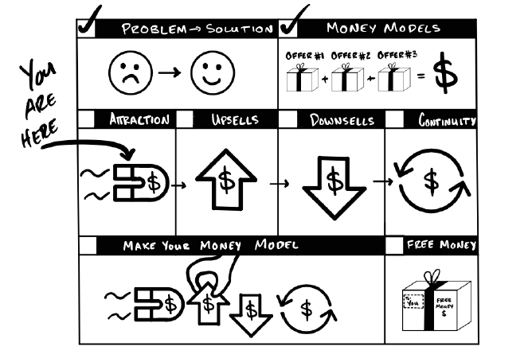

Lời Chào Hàng Thu Hút tạo ra khách hàng tiềm năng và chuyển đổi họ thành khách mua hàng. Chúng biến quảng cáo thành tiền bằng cách đưa ra thứ gì đó miễn phí hoặc giảm giá. Chúng ta làm điều này vì mọi người đều muốn một thỏa thuận tốt—nơi mà giá trị khách hàng nhận được lớn hơn nhiều so với mức giá họ phải trả. Người lạ chưa biết giá trị bạn mang lại, nhưng họ chắc chắn hiểu về giá cả. Vì lý do đó, việc giảm giá khiến bất kỳ thứ gì cũng có thể trở thành một món hời đối với bất kỳ ai. Giảm giá càng sâu, thỏa thuận càng tốt. Và mức giảm giá cao nhất chính là miễn phí.

Lưu ý: Bất cứ khi nào tôi nói "miễn phí", bạn cũng có thể dùng "giảm giá" hoặc "1 đô". Bất cứ khi nào tôi sử dụng "giảm giá", bạn cũng có thể dùng "miễn phí" hoặc "1 đô". Chúng được hiểu theo cách giống nhau vì tất cả đều là chiết khấu cho sản phẩm ở một mức độ nào đó — ngay cả khi bạn chiết khấu tới 100%!

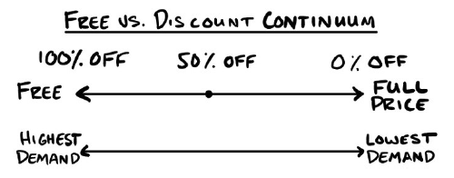

Nếu bạn có thể tưởng tượng ra một cách để sử dụng giảm giá hoặc ưu đãi miễn phí... thì bạn có thể thực hiện nó. Sau đó, hãy dùng tư duy của bạn để linh hoạt thay đổi chúng sao cho phù hợp.

## Làm Thế Nào Để Kiếm Tiền Bằng Cách Tặng Đồ Miễn Phí?

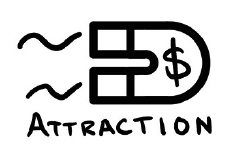

Hãy suy nghĩ theo cách này — mọi người thường tìm kiếm một thứ và rồi tình cờ mua một thứ khác. Lời Chào Hàng Thu Hút giúp họ làm điều đó một cách có chủ đích. Nhưng điều gì tuyệt vời hơn một thứ miễn phí? Đó là nhiều hơn một thứ miễn phí. Một thứ miễn phí là tuyệt vời, nhưng hai thứ miễn phí còn tuyệt vời hơn—và có thể để nhận được hai thứ đó, họ phải mua một thứ khác. <u>Đó là cách chúng ta kiếm tiền từ đồ miễn phí.</u>

Trong phần này, tôi sẽ trình bày năm cách yêu thích của tôi để kiếm tiền bằng cách tặng đồ miễn phí:
1. Lấy lại tiền của bạn.
2. Quà tặng.
3. Lời chào hàng chim mồi.
4. Mua X tặng Y.
5. Trả ít hơn ngay bây giờ hoặc trả nhiều hơn sau này.

Hãy cùng đi kiếm tiền nào.

>### QUÀ TẶNG MIỄN PHÍ: Video hướng dẫn bổ sung về Lời Chào Hàng Thu Hút
>
>Tôi đã thực hiện một video miễn phí về cách hoạt động của các lời chào hàng thu hút. Nếu bạn muốn hiểu sâu hơn, hãy truy cập acquisition.com/training/money hoặc quét mã QR bên dưới.

## LẤY LẠI TIỀN CỦA BẠN (Win Your Money Back)

*Nếu bạn làm được X trong khoảng thời gian Y và tuân thủ các quy tắc Z, bạn sẽ được miễn phí.*

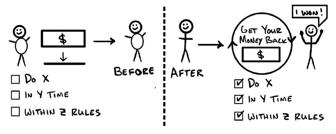

Tháng 6 năm 2013.

Tôi đang ở trong một căn phòng đầy những ông chủ phòng gym lão luyện, còn tôi chỉ là "lính mới". Mọi người thay phiên nhau kể về những thứ đang vận hành tốt. Đúng lúc đó, Danny lên tiếng.

“Ừ… thì như các bạn biết đấy, tôi từng trầy trật với khâu bán hàng… và tôi nghĩ mình vừa tìm ra giải pháp rồi. Tôi gặp một gã khách hàng cực kỳ khó nhằn, chẳng chịu mua gì cả. Gã biết mình cần tập luyện nhưng lại bảo là cần ai đó thúc đít nhiều hơn. Sau một hồi kỳ kèo, cuối cùng gã đưa ra ý tưởng này. Gã bảo: *‘Hay là thế này: Tôi đưa ông 500 đô. Ông huấn luyện tôi trong 8 tuần. Nếu tôi đạt được mục tiêu, tôi lấy lại tiền. Đổi lại, ông có thể dùng kết quả của tôi để quảng cáo. Chơi không?’*”

“Thế… rồi sao?” tôi hỏi.

Danny trả lời: “Tôi nghĩ bụng dù sao gã cũng chả định mua, nên tôi chốt luôn.”

“Ok, rồi gã đó thế nào?”

“Gã đạt mục tiêu.”

“Thế ông có trả lại tiền cho gã không?”

“Ông tưởng thế đúng không, nhưng cuối cùng gã lại dùng số tiền đó để mua thêm các gói tập khác!”

“Nghe cũng ổn đấy. Còn việc dùng kết quả của gã để làm marketing thì sao?”

“Trời ạ, mấy cái ảnh trước và sau khi tập của gã mang về cho tôi tận 13 khách mới từ lời giới thiệu đấy!”

“Thật điên rồ. Giờ mới đúng là kinh doanh này.”

“Phải, tôi biết mà. Giờ tôi mời chào gói này với tất cả mọi người. Kết quả tốt hơn hẳn và khách cũng khoái ưu đãi này. Chưa kể mấy cái quảng cáo miễn phí mà họ làm cho mình cũng kéo cả bạn bè, người thân họ tham gia. Tôi đang kiếm được nhiều tiền hơn bao giờ hết.”

****

Đó là lần đầu tiên tôi thấy một lời chào hàng (offer) kiểu này. Tôi đã nâng cấp nó theo thời gian, nhưng cốt lõi vẫn vậy: trả tiền trước, có cơ hội nhận lại tiền sau. Tôi đã áp dụng nó cho huấn luyện cá nhân, tập nhóm, tư vấn dinh dưỡng cá nhân và cả nhóm. Khi thấy nó hiệu quả với khách cũ, tôi bắt đầu đưa vào quảng cáo để tìm khách mới. Chi phí tìm kiếm khách hàng của tôi giảm mạnh, còn lượng khách tiềm năng thì bùng nổ!

### MÔ TẢ

Ưu đãi "Lấy Lại Tiền Của Bạn" hoạt động như sau: Bạn đặt ra một mục tiêu cho khách hàng và chỉ cho họ cách để đạt được. Nếu họ làm được, họ đủ điều kiện để lấy lại tiền mặt hoặc nhận lại dưới dạng thẻ mua hàng.

Ưu đãi này giúp các phòng gym của tôi phát triển mạnh hơn bất kỳ phương pháp nào khác. Đây cũng là "Lời chào hàng siêu đẳng" (Grand Slam Offer) đầu tiên mà Gym Launch dạy cho các chủ phòng gym. Nó cực kỳ linh hoạt. Vì vậy, nếu bạn muốn có thêm tiền mặt, thêm khách hàng và giúp họ đạt kết quả tốt hơn, không gì qua mặt được chiêu này.

Để "Lấy Lại Tiền Của Bạn", khách hàng có ba lựa chọn: Đạt kết quả, Thực hiện hành động, hoặc cả hai. Để chiêu này hiệu quả, bạn phải làm cho các kết quả và hành động đó thật dễ theo dõi.

* <u>Kết quả</u>: Ở đây, bất kể họ làm gì, miễn là đạt được kết quả thì họ thắng. Ví dụ: Kiếm được X đô/tháng, có thêm Y khách hàng, giảm Z kg, v.v. Về cơ bản, họ đang đặt cược vào khả năng đạt mục tiêu của chính mình.

* <u>Hành động</u>: Ở đây, bạn yêu cầu họ chịu trách nhiệm về việc thực hiện các hành động cụ thể thay vì kết quả. Bất kể kết quả ra sao, nếu khách làm đúng những gì bạn yêu cầu, họ sẽ lấy lại được tiền. Ví dụ: tham gia tất cả các buổi tập, các cuộc gọi, cuộc họp, ghi chép tiến trình, chụp ảnh, làm bài tập về nhà, v.v. Ở đây, họ đặt cược vào khả năng làm theo hướng dẫn của mình.

* <u>Cả Hành động và Kết quả</u>: Bạn yêu cầu khách vừa phải làm theo hướng dẫn, vừa phải có kết quả. Làm được cả hai mới được trả tiền. Thường thì những người muốn đạt mục tiêu lại thiếu kỹ năng. Dù họ có đặt cược vào bản thân, họ vẫn dễ thất bại. Bằng cách đặt ra một mục tiêu hợp lý và chỉ đường cho họ, họ sẽ có cơ hội chiến thắng. Ở đây, họ đặt cược vào khả năng làm theo hướng dẫn của mình và tin rằng hướng dẫn của bạn sẽ mang lại kết quả.

***Điểm cốt lõi***: Khách hàng xuống tiền. Nếu họ thực hiện đúng cam kết HOẶC đạt kết quả HOẶC cả hai — họ sẽ nhận lại tiền mặt hoặc thẻ mua hàng.

### VÍ DỤ

#### Ưu đãi B2C (Doanh nghiệp bán cho cá nhân): Lộ trình 28 ngày miễn phí
Đặt cọc X đô và nhận lại toàn bộ nếu bạn:
- Tham gia tất cả các cuộc gọi tư vấn.
- Đăng tiến độ vào nhóm mỗi tuần một lần.
- Ghi nhật ký hàng ngày trên ứng dụng của chúng tôi.
- Tham gia buổi phản hồi và buổi tổng kết thay đổi.

(Gợi ý: Các cuộc gọi và cuộc họp chính là cơ hội để bạn đưa ra thêm các lời chào hàng khác).

#### Ưu đãi B2B (Doanh nghiệp bán cho doanh nghiệp): Thử thách 5 khách hàng trong 5 ngày miễn phí
Đặt cọc X đô và nhận lại toàn bộ nếu bạn:
- Gửi 100 tin nhắn mỗi ngày.
- Báo cáo số liệu tin nhắn đã gửi.
- Tham gia đào tạo hàng ngày.
- Đăng bài tập đã hoàn thành vào nhóm.
- Tham gia cuộc gọi tư vấn ngày thứ 5.

(Gợi ý: Ở đây bạn có thể chào mời các sản phẩm/dịch vụ mới, tốt hơn hoặc nhiều hơn).

#### Ưu đãi sản phẩm vật lý: Chạy xe 1,000,000 dặm, tặng luôn chiếc xe
Được miễn phí xe nếu bạn:
- Mua xe mới từ chúng tôi.
- Chạy đủ 1.000.000 dặm.
- Mang xe đến trả.
- Chụp ảnh và xuất hiện trên thông cáo báo chí.
- Chúng tôi sẽ hoàn lại toàn bộ giá mua ban đầu để bạn mua chiếc xe tiếp theo.

(Đây là một ưu đãi có thật đấy).

### LƯU Ý QUAN TRỌNG

Ưu đãi này đã tạo ra doanh thu hơn 1 tỷ đô la trong toàn ngành. Nó thực sự hiệu quả. Tôi đã kiếm được rất nhiều tiền từ nó, và bạn cũng có thể làm được.

***Áp dụng được cho cả khách mới, khách cũ và khách đã rời bỏ***. Tôi thích dùng cho khách mới vì nó tạo ra mức chiết khấu cực khủng: 100%. Với khách cũ, nó giúp họ hòa nhập với nhóm khách mới. Và với khách đã nghỉ, ưu đãi lớn sẽ kéo họ quay lại.

***Cực hiệu quả với những thứ mà người ta hay... bỏ cuộc giữa chừng***. Như khởi nghiệp, học kỹ năng mới, giảm cân, tập gym, chăm sóc sắc đẹp, quản lý thời gian, tâm lý, v.v. Nó giữ lửa động lực trong giai đoạn khó khăn ban đầu. Đến tận bây giờ, tôi vẫn chưa thấy cách nào thiết lập chương trình đạt kết quả tốt hơn cách này — một kiểu đôi bên cùng có lợi thực thụ.

***Đừng lo, chiêu này vẫn ra tiền***. Nếu bạn trả lại toàn bộ tiền cho tất cả mọi người thì đúng là không có lãi — nhưng thực tế không phải vậy. Thứ nhất, nhiều người sẽ không đủ điều kiện (dù điều kiện rất thực tế). Thứ hai, những người đủ điều kiện thường sẽ ở lại làm khách hàng tiếp. Nhưng họ chỉ ở lại nếu bạn có thứ khác để bán cho họ. Vì vậy, hãy chuẩn bị sẵn một gói bán thêm (upsell) để họ dùng số tiền "thắng" được đó mà mua tiếp (Xem Phần III).

***Chỉ tung ra "Lấy Lại Tiền Của Bạn" nếu bạn sẵn lòng trả lại tiền!*** Hoàn tiền là một phần của kinh doanh. Tuy nhiên, khi được quảng cáo tốt, ưu đãi này sẽ mang về lượng khách khổng lồ. Và khi bạn đưa ra một lời đề nghị tiếp theo tuyệt vời cho những khách hàng đang hài lòng, bạn sẽ thu về bộn lợi nhuận. Điều này thừa sức bù đắp cho số tiền hoàn lại. Theo dữ liệu từ hàng ngàn phòng gym, chỉ khoảng 10% khách hàng sẽ đòi lại tiền. Nếu bạn không chịu nhiệt được mức này, thì đừng làm.

***Ưu tiên tặng thẻ mua hàng (Store Credit) thay vì tiền mặt***. Thử nghiệm của tôi cho thấy tặng thẻ mua hàng hay tiền mặt thì lượng khách kéo về cũng như nhau. Vậy nên tội gì không dùng thẻ mua hàng. Nhưng nếu bạn vẫn muốn quảng cáo là "miễn phí", hãy kết hợp nó với <u>một cam kết hài lòng vô điều kiện</u>. Việc thêm cam kết này không làm thay đổi đáng kể số người muốn lấy lại tiền đâu. (Hãy tham khảo thêm ý kiến pháp lý tại địa phương của bạn).

***Đừng lấy "tiền xương máu"***. Nếu ai đó không muốn tôi giữ tiền của họ, tôi còn chẳng muốn giữ nó hơn cả họ nữa. Quy tắc cá nhân của tôi là: nếu khách đòi hoàn tiền — dù đúng hay sai — tôi cứ trả luôn. Hãy tập trung vào việc tìm khách hàng tiếp theo.

***Cách tạo bộ tiêu chí "Lấy Lại Tiền Của Bạn".*** Bộ tiêu chí này quyết định sự thành bại của ưu đãi. Một bộ tiêu chí tốt cần 3 đặc điểm:

1. ***Dễ theo dõi.*** Hướng dẫn họ chính xác những gì cần làm (nếu không họ sẽ làm hỏng bét). Sẽ tốt hơn nếu họ vốn đã đang làm việc đó rồi. Ví dụ: Điện thoại đã tự đếm bước chân, phần mềm văn bản tự đếm từ, máy ảnh tự lưu ngày tháng trên ảnh.

2. ***Giúp khách hàng có kết quả.*** Hãy đặt ra các tiêu chí sao cho khi làm xong, họ chắc chắn sẽ đạt được kết quả mong muốn. Các tiêu chí thực tế là tốt nhất. Nếu bạn thấy tiêu chí có vẻ quá dễ, thì có lẽ nó đang ở mức thực tế đấy. Có thể phải thử vài lần mới chuẩn được, nhưng cái gì đáng giá mà chẳng phải thử sai. Ví dụ: đi họp, đi tập, xem video... Cứ xem những khách hàng giỏi nhất làm gì để có kết quả tốt nhất, rồi bắt mọi người làm theo (và họ cũng sẽ có kết quả tuyệt vời thôi).

3. ***Giúp quảng cáo cho doanh nghiệp.*** Hãy biến việc quảng cáo thành một phần của tiêu chí. Ví dụ: đăng bài về việc tham gia chương trình, tag tên trên mạng xã hội, giới thiệu khách mới, hoặc để lại đánh giá và cảm nhận.

***Cách Áp Dụng Thẻ Mua Hàng [QUAN TRỌNG].*** Khi khách thắng và nhận lại tiền, hãy đề nghị họ dùng số tiền đó để thanh toán cho một lộ trình dài hơn hoặc một gói mua sỉ. Chỉ cần đề nghị áp dụng nó vào thứ gì đó có giá trị cao hơn số tiền họ vừa thắng được. Theo kinh nghiệm của tôi, cách này giúp giữ chân khách hàng và giúp bạn kiếm được nhiều tiền hơn. Nó sẽ trông như thế này:

- Bạn có sản phẩm/dịch vụ giá 200 đô/tháng.
- Khách hàng thắng được 600 đô tiền thẻ mua hàng. Đừng cho họ dùng miễn phí 3 tháng đầu ngay lập tức.
- Thay vào đó, hãy chia 600 đô đó cho 12 tháng → (Giảm giá 50 đô mỗi tháng).
- Giờ họ chỉ phải trả: 200 đô - 50 đô giảm giá = 150 đô mỗi tháng.
- Nói cho rõ thì họ có quyền dùng thẻ đó theo cách họ muốn. Nhưng tôi khuyên bạn nên đưa ra phương án này trước. Nếu họ đòi dùng hết ngay từ đầu, bạn có thể chia sẻ kinh nghiệm của tôi: người ta thường bỏ cuộc nếu không phải trả một khoản phí nào đó. Giảm giá rải đều trong thời gian dài sẽ giúp họ gắn bó lâu dài. Vì vậy, việc khách hàng vẫn phải "bỏ vốn" một chút thực chất lại tốt cho chính lợi ích của họ.
- Chi tiết về gói Upsell này nằm ở chương Rollover Upsell trong Phần III.

***Mọi cuộc họp và cuộc gọi đều là cơ hội bán hàng.*** Hãy đưa các buổi họp kiểm tra vào bộ tiêu chí hoàn tiền bất cứ khi nào có thể. Và bắt buộc phải tham gia mới được nhận lại tiền. Ngoài việc giúp họ thành công, đây là cơ hội tốt nhất để bạn thực hiện các đợt bán thêm (upsell). Sau khi kiểm tra xong, hãy đưa ra đề nghị phù hợp dựa trên phản hồi của họ.
Hệ thống phòng gym của tôi thường có 3 cuộc hẹn:
- Định hướng dinh dưỡng → "Chụp ảnh trước" → Tôi mời mua thực phẩm bổ sung.
- Kiểm tra tiến độ → Tôi mời mua gói thành viên.
- Phản hồi sau thay đổi → "Chụp ảnh sau" → Tôi lại mời mua gói thành viên. 
    - *Nếu họ đã mua ở lần trước rồi, tôi sẽ đề nghị giảm giá nếu họ trả trước 1 năm.*

***Hãy để ai cũng là người chiến thắng.*** Hãy quảng bá và bán chương trình như thể họ chỉ được lấy lại tiền nếu đạt đủ tiêu chí. Nhưng khi đi được khoảng nửa chặng đường, hãy đưa ra lời đề nghị tiếp theo như thể họ đã thắng rồi. Điều này làm giảm nỗi lo thất bại của khách hàng và giúp bạn giữ chân họ lâu hơn. Họ cũng sẽ yêu quý bạn hơn nhiều. Đại loại là:

*Tôi biết bạn đang cố đạt mục tiêu ngắn hạn này, nhưng mục tiêu dài hạn của bạn là gì?... Ồ tuyệt vời. Bạn thấy đấy, vấn đề không phải là chương trình này mà là kết quả lâu dài của bạn. Thế này nhé, để chứng minh tôi rất muốn bạn đạt được mục tiêu dài hạn đó, tôi sẽ tính số tiền chương trình này vào gói tiếp theo luôn, bất kể bạn có đạt mục tiêu ngắn hạn hay không — bạn thấy sao?*

***Khi kết thúc, hãy để những người "thua cuộc" cũng thắng.*** Nếu ai đó từ chối lời mời upsell đầu tiên và thất bại trong thử thách, bạn vẫn có thể upsell họ lần nữa. Cách làm là: hãy đối xử như thể họ đã thắng. Tôi thường nói:

*Đừng lo lắng về chuyện đó. Bạn đã bắt đầu rồi, đó mới là chiến thắng lớn nhất. Và dù bạn chưa đạt mục tiêu ngắn hạn, nhưng bạn đã đạt được mục tiêu của chúng tôi — đó là hoàn thành những gì mình đã bắt đầu. Để cho thấy chúng tôi đồng hành cùng bạn về lâu dài, chúng tôi sẽ tính toàn bộ khoản đặt cọc của ông vào gói gắn bó lâu dài với chúng tôi. Như vậy bạn vừa lấy lại được tiền, mà chúng ta vẫn có thể đạt được mục tiêu của bạn. Bạn thấy thế nào?*

Bạn sẽ biến nỗi buồn thành niềm vui và họ sẽ cảm kích bạn vì điều đó. Hãy nhớ — <u>chúng ta không tìm khách hàng để bán hàng, chúng ta bán hàng để có được khách hàng.</u>

***Chương trình "Lấy Lại Tiền Của Bạn" Có Cấu Trúc Đơn Giản Với Nhiều Tính Linh Hoạt.*** Về cơ bản, bạn cung cấp một sản phẩm hoặc dịch vụ và một cách để khách hàng nhận lại tiền nếu họ thực sự sử dụng nó. Sau đó, nếu họ sử dụng nó theo cách bạn đề xuất, họ sẽ nhận được kết quả đủ tốt và sẵn sàng đón nhận thêm các ưu đãi và/hoặc cam kết dài hạn hơn.

### TỔNG KẾT

"Lấy Lại Tiền Của Bạn" là một công cụ kỳ diệu dành cho các doanh nghiệp yêu cầu khách hàng phải nỗ lực liên tục để đạt được kết quả mong muốn.

* Tại sao nó lợi hại:
    - Bạn thu được một lượng tiền mặt lớn ngay từ đầu.
    - Nhiều khách hàng đồng ý mua hơn vì rủi ro của họ thấp.
    - Khách hàng đạt kết quả rực rỡ.
    - Có thêm nhiều khách hàng trung thành lâu dài.
    - Họ tự quảng cáo để mang thêm khách về cho bạn.
* Việc đưa các buổi họp vào điều khoản tạo ra cơ hội tuyệt vời để chăm sóc khách và bán thêm các gói phù hợp.
* Mọi người thường nghĩ doanh nghiệp kiếm tiền từ những người thất bại. Không phải đâu. Tiền thực sự đến từ những người thành công và bạn có thứ khác để bán tiếp cho họ. Hãy tin tôi. Càng mang lại nhiều kết quả, bạn càng kiếm được nhiều tiền. Hãy nhìn xa trông rộng.
* Tiêu chí hoàn tiền phải: Dễ theo dõi, khớp với mục tiêu khách hàng, và có lợi cho kinh doanh.
* Chỉ dùng chiêu này nếu tỷ lệ hoàn tiền của bạn dưới 5%. Nếu cao hơn, hãy sửa sản phẩm trước đã. Nếu không bạn sẽ gặp rủi ro từ việc hoàn tiền quá nhiều.
* Dùng tiền hoàn lại để hướng khách vào một gói khác, thường là đắt tiền hơn. Bạn muốn họ tiếp tục là khách hàng… vậy nên hãy cho họ cơ hội. Đừng bao giờ muốn khách ngừng trả tiền cho bạn.
* Để bán được nhiều hơn và giữ khách lâu hơn, hãy biến mọi người thành người chiến thắng một cách riêng tư. Điều đó khiến khách hàng luôn bất ngờ và biết ơn khi bạn đưa ra lời mời mua hàng tiếp theo.

>#### QUÀ TẶNG MIỄN PHÍ: Video đào tạo về Ưu đãi Thắng để nhận lại tiền.
>
>Tôi đã kiếm được số tiền khổng lồ từ ưu đãi này và có nhiều chi tiết, câu chuyện mà tôi không thể đưa hết vào sách. Nếu bạn muốn xem, tôi đã làm một video miễn phí, không cần đăng ký. Chỉ cần truy cập: acquisition.com/training/money hoặc quét mã QR.

## QUÀ TẶNG (Giveaways)

*Nhiều người sẽ tham gia... và cũng sẽ có nhiều người thắng.*

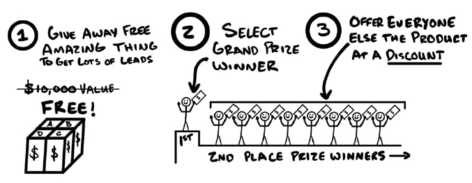

> <u>Miễn trừ trách nhiệm:</u> Các chương trình quay số và tặng quà bị kiểm soát rất chặt chẽ bởi pháp luật. Lý do chính là vì chúng cực kỳ quyền năng. Nếu làm sai, bạn có thể biến nó thành trò cờ bạc bất hợp pháp — điều mà không ai muốn cả. Đi tù thì chẳng vui vẻ gì đâu. Hãy đảm bảo bạn tuân thủ đúng luật quảng cáo tại địa phương. Đoạn mô tả này không đảm bảo tính hợp pháp về mặt pháp lý và tôi không chịu trách nhiệm cho những gì bạn làm. Phù, xong phần cảnh báo, giờ vào việc thôi!

Tháng 8 năm 2020.

Tôi gọi điện cho chủ một doanh nghiệp cấp chứng chỉ thể hình để trao đổi kinh nghiệm. Chỉ trong vài phút, anh ta đã tóm tắt cách họ cấp chứng chỉ cho những người yêu thích thể hình và giúp họ tìm kiếm khách hàng.

“Mô hình kinh doanh thú vị đấy,” tôi nói. “Thế các ông tìm khách tiềm năng kiểu gì?”

“Đơn giản lắm. Chúng tôi quảng cáo một suất học bổng toàn phần cho toàn bộ chương trình. Mọi người đăng ký bằng thông tin cá nhân và trả lời vài câu hỏi kiểu như ‘Tại sao chúng tôi nên chọn bạn cho suất học bổng này?’. Câu trả lời hay nhất sẽ thắng. Nhưng chúng tôi còn làm thêm một chiêu nữa...”

“Hay đấy, nói tiếp đi...” Tôi nói

“Chúng tôi tặng cả học bổng bán phần.”

“Ý ông là sao? Nó hoạt động thế nào?”

“Thì thường là chúng tôi sẽ có một người thắng giải nhất rõ ràng. Nhưng cũng có hàng tá người khác có câu chuyện rất truyền cảm hứng, và tôi muốn họ cũng nhận được học bổng. Tôi chỉ có thể tặng một suất toàn phần, nhưng có thể tặng bao nhiêu suất bán phần tùy thích.”

Và lúc đó tôi chợt nhận ra.

“À... Vậy là rất nhiều người đăng ký để tranh ‘giải đặc biệt’, nhưng chỉ một người có được nó. Còn những người khác thì lại đủ tiêu chuẩn cho các giải thưởng nhỏ hơn?”

“Đúng vậy. Tôi sẽ làm rầm rộ về người thắng giải nhất, nhưng sau đó tôi gọi điện cho tất cả những người còn lại để thông báo rằng họ đã nhận được học bổng bán phần. Khi nghe tin, họ sướng phát điên lên. Đa số họ chốt đơn tham gia chương trình ngay tại chỗ.”

“Nghĩa là họ không biết giá thực tế của chương trình khi bắt đầu cuộc gọi?”

“Không.”

“Nhưng họ biết giá trị của suất học bổng toàn phần, và khi ông đưa ra mức giá đã giảm nhờ học bổng bán phần, đó vẫn là một món hời cực lớn đối với họ.”

“Chính xác.”

“Vậy là ông không chỉ có được một đống khách hàng tiềm năng đang hào hứng, mà còn có thêm nhiều khách thực thụ nhờ cái ‘giảm giá bất ngờ’ đó? Thiên tài!”

“Nó hiệu quả cực kỳ. Thực tế là chúng tôi phải giới hạn số lượng để đảm bảo phục vụ tốt cho đợt khách mới này. Tin hay không tùy ông, chúng tôi dạy đúng chiêu này cho các huấn luyện viên mà chúng tôi cấp bằng. Nó giúp họ tìm khách tập gym hiệu quả không kém — thậm chí còn tốt hơn.”

“Quá đỉnh.”

****

Anh bạn đó đã trình bày chiêu này như một ưu đãi về giáo dục và thể hình. Nhưng nó còn rộng hơn thế nhiều. Tôi sẽ chỉ cho bạn cách áp dụng nó vào bất kỳ ngành kinh doanh nào. Quà tặng miễn phí tạo ra một lượng lớn khách tiềm năng quan tâm đến <u>*sản phẩm đắt tiền nhất của bạn*</u>. Còn gì tuyệt hơn thế nữa?

### MÔ TẢ

Ưu đãi Quà tặng hoạt động như sau: Bạn quảng cáo một cơ hội trúng giải thưởng lớn để đổi lấy thông tin liên lạc và bất kỳ thứ gì bạn muốn. Sau khi chọn được người thắng cuộc, bạn mời chào tất cả những người còn lại mua sản phẩm đó với một mức giá ưu đãi (giảm giá).

Chiến lược này còn có những tên gọi khác như "học bổng", "quay số may mắn", "bốc thăm trúng thưởng", v.v. Tất cả đều có chung ý nghĩa: "đăng ký để có cơ hội trúng thưởng". Để chạy một chương trình Quà tặng, bạn cần:
- Chọn một Giải Đặc biệt.
- Chọn Ưu đãi khuyến mãi (giải phụ).
- Thu thập thông tin liên lạc và các tiêu chí đủ điều kiện.
- Chọn các hành động mà người tham gia cần làm để được xét duyệt.
- Đặt ra hạn chót để tạo sự khan hiếm/cấp bách.
- Công bố người thắng giải và liên hệ với những người còn lại.

Hãy đi sâu vào từng bước:

***Chọn Giải Đặc biệt.*** Hãy lấy chính thứ mà bạn muốn mọi người mua để làm giải đặc biệt. Hãy gắn cho nó một giá trị bằng tiền cụ thể để làm "mỏ neo giá". Ví dụ, nếu sản phẩm trị giá 5.000 đô nhưng bạn bán 2.000 đô, hãy cứ quảng cáo giá trị của nó là 5.000 đô!

***Chọn Ưu đãi khuyến mãi.*** Đây chính là "học bổng bán phần" trong câu chuyện trên. Bạn tạo ra nó bằng cách thêm vào sản phẩm cốt lõi một khoản giảm giá, một phần thưởng tặng kèm, hoặc thay đổi nhẹ so với Giải Đặc biệt để có lý do giảm giá một cách hợp tình hợp lý. Giảm giá càng sâu, ưu đãi càng hấp dẫn. Giải Đặc biệt giá trị càng cao thì chiêu này càng hiệu quả!

Hãy nhớ: khách hàng đăng ký vì họ thích Giải Đặc biệt. Bạn đang có trong tay những khách tiềm năng "chuẩn không cần chỉnh" vì bạn đang bán thứ họ vốn đã thích với giá rẻ hơn. Bạn có thể gọi Ưu đãi khuyến mãi này là gì tùy thích: học bổng, thẻ quà tặng, voucher, tiền thưởng vào tài khoản, v.v.

***Thu thập thông tin liên lạc.*** Để đổi lấy cơ hội trúng thưởng, hãy yêu cầu họ cho phép bạn liên lạc qua bất kỳ kênh nào cho các chiến dịch sau này. Ngoài ra, tôi thường khảo sát xem họ có phù hợp không và yêu cầu họ thực hiện một vài hành động.

***Tính phù hợp.*** Tôi hỏi xem họ có phải khách hàng mục tiêu không. Ví dụ: "Bạn có sở hữu phòng khám thú y không?" hoặc các câu hỏi về nhu cầu: "Tại sao chúng tôi nên chọn bạn?".

***Hành động bắt buộc.*** Những việc họ phải làm để được xét giải. Tôi dùng cách này để họ giúp quảng bá chương trình hoặc thể hiện mức độ quan tâm cao. Ví dụ: tham gia một cuộc gọi, đăng một bài viết, vào một nhóm chung...

***Đặt hạn chót để tăng tính cấp bách.*** Đặt ngày cho lễ bốc thăm giải thưởng lớn. Hãy làm cho chương trình tặng quà của bạn trở nên khẩn cấp hơn bằng cách chỉ cho phép tham gia trong thời gian có hạn. Tôi thường cho thời gian từ ba đến bảy ngày kể từ ngày bắt đầu quảng bá. Ngay khi khách hàng tiềm năng tham gia chương trình, hãy cập nhật thông tin cho họ hàng ngày. Đầu tiên, hãy cho họ biết còn bao lâu nữa cho đến khi bạn công bố người thắng cuộc. Bạn có thể làm điều này qua email, tin nhắn trực tiếp, tin nhắn văn bản, bài đăng trên mạng xã hội, v.v. Hãy làm càng nhiều càng tốt. Một lần mỗi ngày trên tất cả các nền tảng là đủ. Thứ hai, hãy cung cấp giá trị cùng với thời gian đếm ngược. Cho mọi người thấy lợi ích của giải thưởng lớn, họ nên hào hứng như thế nào và dẫn dắt mọi người đến các bằng chứng xã hội. Hãy giữ cho sự hào hứng luôn hiện hữu!

>#### Mẹo chuyên gia: Whisper – Tease – Shout (Thì thầm – Thả thính – Hét lớn)
>
>Hãy coi giai đoạn đếm ngược như một đợt ra mắt sản phẩm mini để tạo hiệu ứng bùng nổ. Vì vậy, hãy xem chương Đối tác và Chi nhánh của cuốn sách $100M Leads để có cái nhìn chi tiết về các đợt ra mắt sản phẩm.

***Công bố người thắng cuộc và liên hệ những người còn lại.*** Công bố người thắng giải đặc biệt công khai, sau đó nhắn tin riêng cho tất cả những người còn lại. Cái hay ở đây là: tất cả mọi người đều thắng giải phụ. Thông báo họ bằng tin nhắn, email, và tin nhắn trực tiếp. Trong tin nhắn này, hãy yêu cầu họ lên lịch cho một cuộc gọi vì họ đủ tiêu chuẩn cho một thứ gì đó khác. Nếu bạn cần một lý do - hãy nhắn rằng vì câu chuyện của họ quá ấn tượng nên bạn quyết định tặng họ một "phần quà khuyến khích" (chính là Ưu đãi khuyến mãi). Hãy coi chương trình khuyến mãi của bạn như một "phần thưởng dành cho người tham gia".

Để đảm bảo họ sử dụng ưu đãi, hãy thêm một hạn chót khác. Đặt thời hạn sử dụng ưu đãi khuyến mãi của bạn (học bổng, thẻ quà tặng, giảm giá, tín dụng cửa hàng, phiếu giảm giá, v.v.) là 7 ngày. Thời gian đếm ngược thứ hai hoạt động tương tự như lần đầu: cho thấy lợi ích, bằng chứng xã hội rõ ràng hơn và những thông tin giá trị hơn về ưu đãi của bạn. Cung cấp cho họ cách để đặt lịch gọi điện để nhận ưu đãi khuyến mãi.

***Giải thích Giá trị so với Giá bán.*** Quy tắc của tôi là mức giảm giá nên nằm trong khoảng 10%–30% biên lợi nhuận gộp. Ví dụ, Giải Đặc biệt trị giá 5.000 đô, giá bán lẻ thường là 2.000 đô. Những người khác có thể nhận được nó với chỉ 1.800 đô (giảm 10% so với giá bán lẻ). Khi chúng ta cho họ biết giá trị của một thứ gì đó, chúng ta cần nhấn mạnh là họ đang nhận được giá trị 5.000 đo với mức giá chỉ 1.800 đo. Bằng cách so sánh giá trị với giá họ phải trả, 10% giảm giá trở thành 64%, một món hời cực lớn.

***Tóm lại:*** Hãy nhớ rằng, tất cả những người tham gia chương trình tặng quà đều thể hiện sự quan tâm đến sản phẩm của bạn. Và nếu ai đó thể hiện sự quan tâm đến sản phẩm bạn đang cung cấp — hãy bán nó cho họ.

### Ví dụ về Quà tặng miễn phí

#### Nha khoa: Quà tặng miễn phí nụ cười hoàn hảo 
* Giả đặc biệt: Tặng bộ niềng răng tàng hình - giá bán lẻ: 6.000 đô
* Giải phụ: Thẻ quà tặng 2.000 đô để làm răng.

#### Sản phẩm vật lý: Tặng 1 năm thức ăn chó hữu cơ 
* Giải đặc biệt: Miễn phí 1 năm thức ăn chó hữu cơ - giá bán lẻ: 1.000 đô
* Giải phụ: Thẻ quà tặng 300 đô áp dụng khi đăng ký gói 1 năm.

#### Dịch vụ: Miễn phí gói dịch vụ cao cấp
* Giải đặc biệt: Tặng gói dịch vụ 1 năm - giá bán lẻ: 5.000 đô. 
* Giải phụ: Voucher 2.000 đô cho hợp đồng 1 năm.

#### Tư vấn (Consulting): Tặng gói thay đổi doanh nghiệp 16 tuần 
* Giải đặc biệt: gói thay đổi doanh nghiệp 16 tuần - giá bán lẻ: 12.000 đô.
* Giải phụ: Học bổng bán phần trị giá 6.000 đô.

### Những lưu ý quan trọng
***Hãy tham khảo ý kiến ​​luật sư về cách tổ chức chương trình tặng quà của bạn.*** Tôi không phải là luật sư, nhưng tôi cho rằng đây là những điều hiển nhiên vì cách tôi làm kinh doanh: phải có người trúng giải thưởng lớn. Hãy nêu rõ giải thưởng lớn và điều kiện để trúng giải trong quy định. Hãy nêu rõ rằng nhiều hơn một người có thể trúng giải. Hãy hỏi ý kiến ​​luật sư về những vấn đề còn lại.

***Tiêu chí đủ điều kiện giúp thu hút nhiều khách hàng hơn mua sản phẩm/dịch vụ cốt lõi của bạn.*** Nhiều người sẽ chấp nhận sản phẩm/dịch vụ cốt lõi của bạn hơn nếu bạn có thể làm cho giá trị trở nên cụ thể đối với họ. Tôi thường đặt những câu hỏi như thế này để thu thập thông tin: Tại sao chúng tôi nên chọn bạn? Tại sao lại là chương trình này? Tại sao lại là bây giờ? Tại sao điều này lại quan trọng với bạn? Tại sao điều này lại có ý nghĩa với bạn? Mục tiêu của bạn là gì? vân vân. 

Tuy nhiên, càng nhiều bước để tham gia thì càng ít người tham gia, nhưng bạn sẽ có khách hàng chất lượng hơn - *vì vậy hãy tìm điểm cân bằng phù hợp.*

***Nếu Quà tặng không hiệu quả, tức là quà chưa đủ "oách".***

Một trong những công ty trong danh mục đầu tư của tôi đã tổ chức một chương trình tặng quà. Họ hầu như không nhận được sự quan tâm nào. Giải thưởng lớn của họ? Vé tham dự sự kiện của chính họ. Không hấp dẫn lắm. Tôi nói với họ rằng giải thưởng lớn chỉ hiệu quả khi nó thực sự lớn. Họ thử lại với gói thiết bị trị giá 50.000 đô la từ một nhà cung cấp nổi tiếng trong ngành, cộng với sản phẩm cốt lõi của họ trong một năm. Và lần này, nó đã thành công rực rỡ (không có gì ngạc nhiên).

Khi bạn có một món quà tuyệt vời để tặng và quảng cáo nó một cách hiệu quả, khách hàng tiềm năng sẽ đổ về ào ạt. Và chữ "Tặng quà" thì tự nó đã nói lên tất cả. Vì vậy, nếu không ai hưởng ứng, tôi khuyên bạn nên tặng một món quà tốt hơn. Hoặc ít nhất, tốt hơn cho đối tượng mục tiêu.

***Tặng hai giải thưởng để nhận được gấp đôi số lượng khách hàng tiềm năng.*** Nếu bạn chỉ tặng một giải thưởng, điều đó cũng ổn. Nhưng nếu bạn tặng hai giải thưởng lớn, bạn có thể nhận được gấp đôi số lượng khách hàng tiềm năng (hoặc hơn). Đây là cách làm. Chỉ cần nói với mọi người rằng nếu người mà họ giới thiệu trúng giải thưởng lớn, họ cũng sẽ nhận được một giải. Bằng cách đó, họ sẽ có vô số lượt tham gia cuộc thi bằng cách giới thiệu bạn bè của mình. Điều này giúp nhiều người giới thiệu hơn (và cùng nhau hợp tác). Điều này cũng mang lại một lợi ích bất ngờ. Người giới thiệu sẽ quan tâm đến sự thành công của những người mà họ giới thiệu. Điều này giúp duy trì chất lượng cao. Đây là một ví dụ tôi đã làm cho Skool.com, một nền tảng mà tôi đồng sở hữu, nơi mọi người có thể xây dựng và kiếm tiền từ cộng đồng.

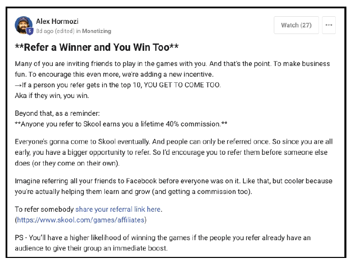

***Sự khan hiếm, khan hiếm, khan hiếm.*** Giới hạn chương trình tặng quà của bạn theo thời gian, số lượng người tham gia, hoặc cả hai. Bạn có thể tổ chức chương trình tặng quà trong một khoảng thời gian cụ thể (ví dụ: 7 ngày), một số lượng người tham gia cụ thể (ví dụ: 5.000 người tham gia), hoặc cả hai. Tôi thích cả hai. Tôi điều chỉnh số lượng người tham gia chương trình tặng quà sao cho phù hợp với số lượng người mà tôi có thời gian và nguồn lực để liên lạc trong vòng bảy ngày. Nhiều hơn sẽ là lãng phí.

***Khẩn cấp, khẩn cấp, khẩn cấp.*** Tôi nhấn mạnh sự khẩn cấp ở ba điểm - thời gian tham gia, thời gian nhận giải, thời gian sử dụng. Hãy nêu rõ thời gian tham gia trong quảng cáo. Sau khi công bố người thắng cuộc, hãy cho họ biết thời gian để nhận giải. Khi họ nhận giải, hãy lên lịch gọi điện cho họ cùng ngày hoặc ngày hôm sau (nếu có thể). Sau khi thông báo cho mọi người biết họ đã thắng gì, hãy cho họ biết thời gian để sử dụng giải thưởng. Tôi thường cho thời gian tính bằng giờ, nhưng đôi khi cũng có thể lên đến năm ngày. Tóm lại, luôn luôn phải có thời hạn.

***Hãy chuẩn bị sẵn các sản phẩm giảm giá.*** Một số người sẽ không hoặc không thể mua sản phẩm khuyến mãi của bạn, ngay cả khi đã được giảm giá hoặc tặng kèm. Và điều đó không sao cả. Đây là cách tôi tiếp cận: ngay từ đầu cuộc gọi, hãy cho họ biết họ đủ điều kiện nhận hai giải thưởng. Và bạn sẽ giúp họ tìm ra cách nào phù hợp nhất với họ. Sau đó, hãy giới thiệu sản phẩm khuyến mãi của bạn trước tiên — tức là mức giảm giá cho giải thưởng lớn. Nếu họ nhận, tuyệt vời. Nếu không, hãy đề nghị mức giảm giá tương tự theo phần trăm cho bất kỳ sản phẩm nào khác mà bạn có và phù hợp với họ.

***Nếu bạn có một doanh nghiệp có thu phí định kỳ.*** Hãy áp dụng mức chiết khấu của họ trong khoảng thời gian dài nhất mà họ đồng ý. Sau đó, thiết lập gói đăng ký hàng tháng của họ để tự động tính phí theo mức giá thông thường sau khi thời gian chiết khấu kết thúc.

### Tổng kết
* Cốt lõi của Quà tặng là mời mọi người đăng ký để nhận thứ giá trị cao miễn phí. Sẽ có nhiều người tham gia nhưng chỉ một người chiến thắng. Những người còn lại đều trở thành khách hàng tiềm năng được nhận ưu đãi.
* Chọn phần quà mọi người thực sự khao khát.
* Hãy tặng hai giải thưởng nếu bạn muốn có thêm người giới thiệu. Nói với họ rằng nếu người mà họ giới thiệu thắng giải, họ sẽ nhận được giải thưởng còn lại.
* Cung cấp cơ hội trúng giải thưởng lớn cho bất kỳ ai tham gia và đủ điều kiện.
* Bạn có thể thu thập được thông tin tuyệt vời từ mọi khách hàng tiềm năng vì bạn có thể biến nó thành một phần của quy trình tiếp cận. Thu thập thông tin cho thấy cách thức mà lời đề nghị của bạn sẽ mang lại giá trị cho họ. Điều này trở nên quan trọng khi đưa ra các lời đề nghị sau này.
* Quảng cáo chương trình tặng quà của bạn trong bảy ngày, hoặc cho đến khi số lượng khách hàng tiềm năng vượt quá số người bạn có thể gọi điện trong bảy ngày, tùy điều kiện nào đến trước.
* Đặt lịch hẹn với tất cả mọi người khác để nhận ưu đãi khuyến mãi của bạn. Hãy sử dụng bất kỳ “lý do” nào mà bạn cảm thấy phù hợp.
* Việc đặt ra thời hạn cho việc người chơi nhận giải thưởng sẽ khiến họ có nhiều khả năng nhận giải hơn.
* Nếu ai đó từ chối lời đề nghị chính của bạn, hãy đưa ra một sản phẩm hoặc dịch vụ khác để giảm giá. Điều đó có thể phù hợp hơn với khách hàng tiềm năng.

>#### QUÀ TẶNG MIỄN PHÍ: Video đào tạo về Quà tặng.
>
>Chiêu này mạnh đến mức nó cần được kiểm soát bằng luật pháp. Ai mà chẳng thích nhận được thứ gì đó miễn phí? Nếu bạn muốn đào sâu hơn, hãy xem video tại: acquisition.com/training/money hoặc quét mã QR.

## Ưu đãi mồi nhử (Decoy Offer)

*Theo bạn, cách nào sẽ mang lại kết quả tốt nhất?*

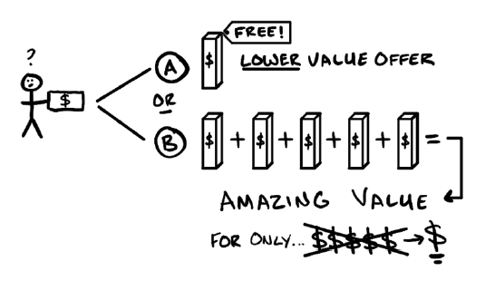

Tháng 6 năm 2014.

John – một trong những người thầy đầu tiên của tôi – đã nghỉ hưu sớm. Ông dành thời gian nghỉ hưu để nuôi dạy các con gái, chơi golf và tận hưởng cuộc sống ở ngôi nhà bên hồ của mình. Ông là một người đã sống trọn vẹn.

Thỉnh thoảng, ông mời tôi đến nhà bên hồ. Trên những chuyến đi dài, ông dạy tôi nhiều điều về cuộc sống và kinh doanh mà đến giờ tôi vẫn áp dụng: sự khác biệt giữa giá cả và giá trị, ưu nhược điểm của các gói giá rẻ, mô hình kinh doanh số lượng lớn – giá thấp, sự khác biệt giữa đăng ký định kỳ và giao dịch một lần, và nghệ thuật giữ mọi thứ đơn giản trong kinh doanh lẫn cuộc sống.

John là một người bạn đồng hành tuyệt vời. Tôi thường ước chuyến đi kéo dài mãi để có thể học thêm từ ông. Với ông, đó chỉ là những câu chuyện giết thời gian. Nhưng với tôi, đó là những bài học không bao giờ quên:

*Thẻ VIP Tắm nắng 5 ngày giá 5 đô.*

“Cái hay của thẻ 5 ngày là ai cũng nghĩ họ có thể rám nắng chỉ trong năm ngày. Và đúng là họ có thể. Nhưng màu da đó không bao giờ đậm như họ mong muốn. Nếu họ cố ‘đẩy nhanh tiến độ’… thì sẽ bị cháy nắng. Thế nên, khi ai đó dùng thẻ này, chúng tôi hỏi họ muốn rám nắng đến mức nào. Ngay khi họ nói muốn đậm hơn vài tông, chúng tôi đưa ra ‘bài học con gà tây’.”

“Bài học con gà tây là gì?” tôi hỏi.

John mỉm cười và tiếp tục: “Ví dụ, một con gà tây nướng mất ba tiếng. Ai cũng biết nếu tăng gấp đôi nhiệt độ để nướng nhanh hơn thì sẽ bị cháy. Phải mất ít nhất năm đến mười buổi nhuộm da mới có được màu nâu đẹp và bền mà không bị bong tróc. Vì phải nghỉ giữa các buổi, nên chắc chắn sẽ mất nhiều hơn năm ngày. Khi họ nhận ra điều đó, chúng tôi nói: *‘Hãy dùng thẻ VIP của bạn để tính vào tháng đầu tiên. Tại sao phải mua nhiều thẻ ngày giá 25 đô trong khi thành viên chỉ mất 19,99 đô mà được dùng thoải mái?’* Ngay lập tức họ thấy giá trị và đăng ký thành viên. Dễ như vậy thôi.”

*Năm năm sau…*

"Sếp ơi, có vấn đề rồi.”

“Có chuyện gì?” tôi hỏi.

“Chi phí tìm khách hàng cho phòng gym tăng quá cao. Những người bán giỏi thì vẫn xoay sở được, nhưng đa số chỉ hòa vốn.”

“Trời, cuối cùng ngày này cũng đến,” tôi thở dài. Tôi biết chuyện này sẽ xảy ra, và thật sự tôi đã lo sợ.

Tôi cố gắng nhiều tuần để “biến tấu” ưu đãi cũ, hy vọng có thêm thời gian. Nhưng các thử nghiệm đều thất bại.

“Anh còn chiêu nào không?” anh ấy hỏi.

Tôi nghĩ mãi rồi nhớ đến thẻ VIP Tắm nắng 5 đô. *Nó có thể áp dụng được*. “Sao mình không đưa ra một ưu đãi siêu rẻ để hút khách, rồi khi họ đến thì giới thiệu một gói cao cấp hơn, giá cao hơn nhưng tốt gấp trăm lần. Họ vẫn có thể chọn gói rẻ, nhưng mình sẽ giải thích rằng gói cao cấp có thêm hỗ trợ, dinh dưỡng, trách nhiệm kèm theo…”

“Ừ, tôi có thể chạy thử.”

*Vài tuần sau…*

“Alex, tôi nghĩ chúng ta đã giải quyết được vấn đề rồi.”

“Tuyệt, kể tôi nghe đi.”

“Chúng ta sẽ đưa ra hai lựa chọn. Lựa chọn đầu tiên miễn phí: một buổi mỗi tuần. Lựa chọn thứ hai là phiên bản ‘Cao cấp’ giá 399 đô. Bao gồm số buổi không giới hạn, huấn luyện 1–1, cá nhân hóa nhiều hơn, và cam kết nếu không có kết quả thì được học lại miễn phí…”

“Ôi, cái cam kết đó quá chắc. Tỷ lệ chọn thế nào?”

“Khoảng tám trên mười người chọn gói 399 đô. Chúng ta đang thắng lớn.”

“Tuyệt vời – mở rộng thôi!”

****

John là một người bán hàng xuất sắc và một người thầy kiên nhẫn. Triết lý của ông – cho khách hàng cái họ muốn ngay bây giờ, để sau đó cho họ cái họ thật sự cần – đã định hình cách tôi kinh doanh. Ông cũng là nguồn cảm hứng cho ưu đãi đã cứu phòng gym của tôi. Nhưng điều quý giá nhất tôi học được từ ông là: “Bạn phải hiểu rõ cái gì mang lại kết quả cho khách hàng hơn chính họ. Điều này khiến gói cao cấp trở thành giải pháp rõ ràng nhất.” Và làm cho gói cao cấp trở thành lựa chọn hiển nhiên chính là bản chất của Decoy Offers

### Mô tả

“Decoy Offers” (Ưu đãi mồi nhử) là cách quảng cáo một thứ gì đó miễn phí hoặc giảm giá. Sau đó, khi khách hàng tiềm năng muốn tìm hiểu thêm, bạn sẽ giới thiệu thêm một gói cao cấp có giá trị hơn. Gói cao cấp này mang lại nhiều tính năng, lợi ích, quà tặng, cam kết bảo đảm… Bằng cách đặt phiên bản mồi nhử bên cạnh phiên bản cao cấp, lựa chọn cao cấp bỗng nhiên trông có vẻ hợp lý hơn rất nhiều. Tôi thích “Decoy Offers” vì nó giúp có thêm nhiều khách hàng hơn. Họ sẽ chọn hoặc gói mồi nhử, hoặc gói cao cấp. Nếu họ chọn gói cao cấp thì tuyệt. Nếu họ chọn gói mồi nhử thì cũng tốt, vì bạn vẫn có thời gian để nâng cấp họ sau này thay vì mất khách. Dù thế nào thì bạn cũng có thể “chốt” được tất cả. Điều này khiến việc có thêm khách hàng mới vừa rẻ vừa sinh lời. Và bất kỳ doanh nghiệp nào cũng có thể áp dụng.

Đây là các bước để tạo một “Decoy Offer”:
1. Quảng cáo một phiên bản nhỏ hơn, đơn giản hơn của gói cao cấp như một ưu đãi mồi nhử.
2. Khi khách hàng quan tâm, hãy đưa ra cả hai lựa chọn, nhưng nhấn mạnh vào gói cao cấp.

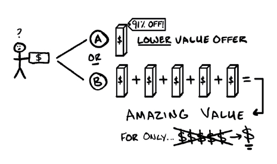

### Ví dụ

#### Ưu đãi cho quầy nước chanh (Sản phẩm vật lý)
- <u>Ưu đãi thu hút:</u> “Uống chanh miễn phí 1 tuần” hoặc “1 đô cho 1 tuần uống chanh.”
- <u>Gói mồi nhử:</u> “Bạn có thể chọn nước + bột chanh + siro ngô” hoặc…
- <u>Gói cao cấp:</u> “Chanh hữu cơ, hoàn toàn tự nhiên, thuần chay, không gluten, nhập khẩu từ Ý, được chế biến lạnh và giao tận nhà. Bạn sẽ không cần mất thời gian ra cửa hàng nữa. Nó sẽ khiến bạn cảm thấy như một chú chó Labrador con chạy tung tăng đuổi bướm cả ngày. Ngoài ra còn có nhiều hương vị khác, như nước chanh hoa hồng lấp lánh.”

#### Ưu đãi cho trung tâm bể nổi (Dịch vụ)
- <u>Ưu đãi thu hút:</u> “Giải tỏa căng thẳng miễn phí 6 tuần” hoặc “6 đô cho 6 tuần giải tỏa căng thẳng.”
- <u>Gói mồi nhử:</u> Một lần nổi mỗi tháng kèm theo các bài tập tự làm tại nhà để giảm stress.
- <u>Gói cao cấp:</u> Nổi hai lần mỗi tuần trong 6 tuần, huấn luyện 1–1, nhật ký, thói quen ngủ. Cam kết hài lòng.

#### Ưu đãi cho phòng gym (Doanh nghiệp địa phương)
- <u>Ưu đãi thu hút:</u> “Biến đổi cơ thể miễn phí 21 ngày” hoặc “21 đô cho 21 ngày biến đổi cơ thể.”
- <u>Gói mồi nhử:</u> Bài tập trong nhóm Skool.com mỗi ngày, một kế hoạch dinh dưỡng chung, có thể xem lại video, không hỗ trợ, không cam kết.
- <u>Gói cao cấp:</u> Tập luyện không giới hạn, kế hoạch dinh dưỡng cá nhân hóa, trách nhiệm 1–1, cam kết có kết quả (nếu không thì được thêm 21 ngày miễn phí).

### Ghi chú quan trọng

***Cách tạo ưu đãi mồi nhử (Decoy Offer).*** Hãy đưa ra phiên bản ít thành phần hơn, mẫu cũ hơn, hoặc ít cá nhân hóa hơn so với gói cao cấp. Đồng thời bỏ hết các cam kết bảo đảm. Ưu đãi thu hút chỉ cần khiến khách hàng tiềm năng quan tâm, không cần gì thêm.

***Quảng cáo lợi ích, không phải tính năng.*** Chúng ta muốn bán cho họ “giấc mơ” kết quả. Ví dụ, quảng cáo sự thay đổi trong 21 ngày, chứ không phải bài tập và thực đơn. Chi tiết sản phẩm cụ thể sẽ được trình bày trong buổi bán hàng, không phải trong quảng cáo! Máy bay riêng và thuyền chèo đều có thể đưa bạn đến đảo nhiệt đới, nhưng chắc chắn gói cao cấp sẽ thú vị hơn nhiều.

***Có 4 cách quảng cáo giảm giá.*** Giả sử bạn có gói 1 năm giá 100 đô/tháng. Nếu muốn cho khách trả 900 đô cho cả năm, bạn có thể nói:
1. Giảm theo phần trăm: Giảm 25%
2. Giảm số tiền cụ thể: Giảm 300 đô
3. Tặng miễn phí một phần: 3 tháng miễn phí
4. Gói trọn: 1 năm chỉ 900 đô (thay vì 1.200 đô)

Tất cả đều cùng ý nghĩa. Nên thử nghiệm để xem cách nào hiệu quả hơn với thị trường của bạn.

***Tạo sự đối lập thật lớn.*** Giá trị của gói cao cấp đến từ sự khác biệt rõ rệt với gói mồi nhử. Vì vậy hãy làm gói mồi nhử đơn giản nhất có thể, rồi làm gói cao cấp thật “xịn”. Sự đối lập càng lớn, khách hàng càng thấy gói cao cấp đáng giá.

***Ưu đãi giảm giá có tỷ lệ khách đến cao hơn ưu đãi miễn phí.*** Theo kinh nghiệm của tôi, nếu chạy ưu đãi miễn phí, bạn sẽ có nhiều khách tiềm năng hơn. Nhưng nếu chạy ưu đãi giảm giá, số lượng khách ít hơn, nhưng tỷ lệ họ thực sự đến lại cao hơn. Nếu bạn gặp tình trạng khách đặt hẹn nhưng không đến, hãy thử ưu đãi giảm giá. Điều này đặc biệt quan trọng với các ngành có chi phí cao khi khách không đến (như bác sĩ, luật sư, nha sĩ…).

***Nếu có thể, hãy giới thiệu gói cao cấp trước.*** Trong tình huống lý tưởng, khách sẽ chọn gói cao cấp ngay. Gói mồi nhử chỉ để dự phòng. Nếu họ hỏi thẳng về gói mồi nhử…

***Hãy xin phép để bán cho họ.*** Nếu họ muốn nghe về gói mồi nhử, bạn phải trình bày. Tôi thường hỏi: “Anh/chị đến đây để lấy đồ miễn phí hay để có kết quả lâu dài?” Ngay khi họ nói “kết quả”, hãy chuyển sang gói cao cấp. Nếu họ nói “đồ miễn phí”, hãy trình bày gói mồi nhử rồi ngay lập tức so sánh với gói cao cấp. Sau đó hỏi: “Theo anh/chị, cái nào giúp đạt mục tiêu nhanh hơn?” hoặc “Anh/chị thích XXX lợi ích ít giá trị hay YYY lợi ích giá trị hơn 1, 2, 3…?” Lúc này, họ sẽ phải chọn gói cao cấp. Và bạn có thể tiến hành bán hàng với sự đồng thuận rằng đó là lựa chọn tốt nhất cho họ.

***Khi giới thiệu gói cao cấp, hãy hào hứng.*** Trình bày nó vượt trội hơn gói mồi nhử, vì đúng là như vậy. Và giải thích nó phù hợp với khách hàng hơn. Sự hào hứng của bạn sẽ thúc đẩy họ chọn gói mang lại nhiều giá trị nhất. 

Về mặt bán hàng, hãy nói chuyện như thể bạn đã biết chắc họ sẽ đồng ý. Nhiều người bán gọi đây là “assumed close” – tức là coi việc chốt đơn là điều hiển nhiên. Bạn hành xử như: *Ai cũng chọn cái này thôi. Đây chỉ là thủ tục. Cho tôi xin ID và thẻ để anh/chị nhận giá trị.* Không cần phô trương, chỉ cần thân thiện, thậm chí hơi “nhàm chán” vì chuyện này xảy ra thường xuyên.

***Lợi ích bất ngờ (tùy chọn).*** Để nâng cấp thêm, nếu ai đó chọn gói mồi nhử, bạn có thể tặng kèm vài tính năng nhỏ hoặc miễn phí từ gói cao cấp. Chỉ cần nói: “Tôi sẽ tặng thêm cái này, dù nó thuộc gói cao cấp, vì tôi muốn anh/chị có kết quả tốt.” Điều này tạo thiện cảm, vượt mong đợi, và tăng khả năng họ sẽ mua thêm sau này. Nhớ rằng – họ vẫn là khách tiềm năng!

### Tóm tắt chính
- Ưu đãi mồi nhử quảng cáo một thứ miễn phí hoặc giảm giá. Sau đó, khi khách hàng tiềm năng muốn tìm hiểu thêm, bạn sẽ giới thiệu gói cao cấp có giá trị hơn.
- Làm cho gói cao cấp vượt trội hơn hẳn gói mồi nhử bằng cách thêm nhiều tính năng, lợi ích, quà tặng và cam kết bảo đảm.
- Hãy “lược bỏ” gói mồi nhử càng nhiều càng tốt.
- Khi khách hàng hỏi về gói mồi nhử, hãy đặt gói cao cấp ngay cạnh để so sánh.
- Hỏi: “Anh/chị đến đây để lấy đồ miễn phí hay để có kết quả lâu dài?” để có quyền giới thiệu gói cao cấp trước.
- Bạn vẫn có thể kiếm tiền từ những khách chọn gói mồi nhử. Quan trọng là tìm cách cung cấp sản phẩm mồi nhử hiệu quả và tối đa hóa việc bán thêm từ đó.
- Hãy kỳ vọng kiếm tiền nhanh. Nếu không, hãy làm cho sự đối lập giữa hai gói lớn hơn nữa.

>#### Quà tặng miễn phí [Không cần đăng ký]: Khóa huấn luyện về Decoy Offers
>
>Decoy Offers là một trong những ưu đãi thu hút linh hoạt nhất. Bạn chỉ cần hiểu vấn đề của khách hàng rõ hơn chính họ. Chúng cũng dễ đào tạo nhân viên bán hàng áp dụng. Tôi đã triển khai chúng trong nhiều ngành khác nhau. Nếu bạn muốn tìm hiểu sâu hơn, tôi đã làm một video phân tích đầy đủ. Bạn có thể xem tại acquisition.com/training/money. Như thường lệ, bạn cũng có thể quét mã QR nếu không thích gõ.

## Mua X – Tặng Y
*Mua một chú cún, tặng miễn phí hai chú cún khác!*

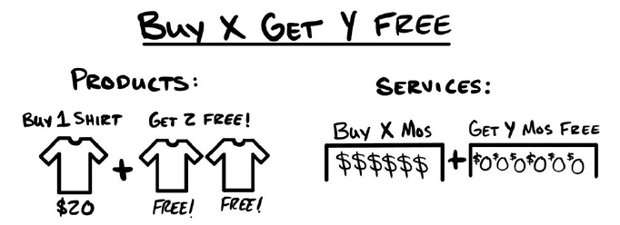

Trung tâm thành phố Nashville, năm 2020

Các quán bar và cửa hàng tại điểm du lịch nổi tiếng này liên tục đóng rồi lại mở — chuyện quá đỗi bình thường. Nhưng có một cửa hàng vẫn thống trị tuyệt đối: Boot Factory. Biển hiệu đèn neon của họ chém xuyên qua sự hỗn độn thị giác của cả con phố, sắc bén như dao cắt bơ. Một chiếc ủng cao bồi to hơn cả chiếc xe của tôi — rõ ràng đang hướng dẫn tôi tiến vào cửa trước. Không thể nào hiểu sai điều họ muốn tôi làm là gì. Thế nên, dĩ nhiên tôi bước vào trong. Và khi đến gần hơn, tôi đọc rõ được lời chào mời của họ:

<u>***MUA 1 ĐÔI – TẶNG 2 ĐÔI MIỄN PHÍ***</u>

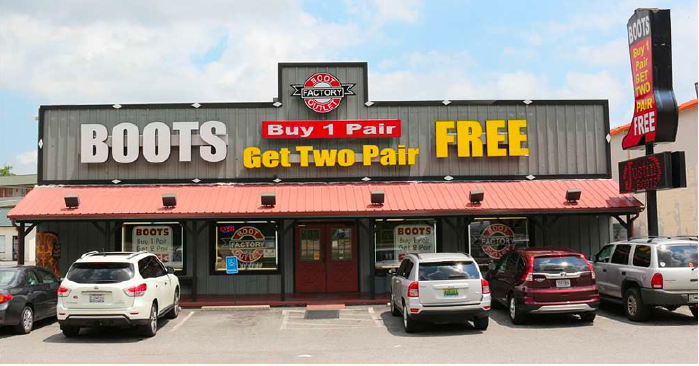

Đã mười năm trôi qua kể từ lần cuối tôi đến Nashville. Nhưng tôi vẫn nhớ như in tấm biển hiệu ấy, cùng chương trình “mua một, tặng hai” — cảm giác cứ như mới hôm qua. Hồi còn trẻ, trong những lần lê la các quán bar, tôi từng cho rằng chiêu khuyến mãi đó thật ngớ ngẩn. “Làm sao họ có thể cho không nhiều hàng như vậy mà vẫn sống được?” Thế nhưng giờ đây, khi bản thân đã có kha khá kinh nghiệm trong việc đưa ra các ưu đãi, tôi mới thực sự hiểu và trân trọng nó.

Tôi đi thẳng đến khu dành cho nam và cầm thử một đôi ủng. Thú vị là giá đã được giảm xuống hai lần, thành một “mức giá chốt” là 600 đô la cho một đôi. Nhưng trông đây hoàn toàn là những đôi ủng bình thường thì có gì đặc biệt? Phiên bản trẻ hơn của tôi hẳn đã cười khẩy. Còn con người của hiện tại thì nhận ra rằng mình đã bỏ sót một điều quan trọng. Cửa hàng này giờ lớn hơn rất nhiều so với lần cuối tôi nhìn thấy — rõ ràng là chương trình ưu đãi ấy đã phát huy tác dụng. Và rồi mọi thứ bỗng sáng tỏ.

Họ tính giá một đôi ủng cao gấp ba lần bình thường, bởi vì nó đi kèm thêm hai đôi nữa. Thay vì nói: “Hãy đến Boot Factory và mua ủng với mức giá hợp lý”, họ đã khéo léo biến nó thành một ưu đãi miễn phí. Ngay trong vài phút ngắn ngủi tôi đứng thanh toán, từng nhóm cô dâu sắp cưới liên tục kéo vào để mua những đôi ủng đồng bộ. Và vì Boot Factory nằm ngay giữa một con phố đầy rẫy các quán bar mang phong cách cao bồi, nên cảnh tượng đó diễn ra thường xuyên như cơm bữa. Thật sự là một nước đi xuất sắc.

### Mô tả

Trong các chương trình Mua X – Tặng Y, khi khách hàng mua một món gì đó, họ sẽ được tặng thêm sản phẩm khác miễn phí. Càng được tặng nhiều, và giá trị quà tặng càng cao, thì chương trình càng phát huy hiệu quả. Các ưu đãi tặng miễn phí luôn thu hút sự chú ý mạnh hơn rất nhiều so với ưu đãi giảm giá. Nhưng nếu bạn chỉ bán một sản phẩm duy nhất, rồi lại đem nó cho không, thì sớm muộn bạn cũng sẽ chết đói. Trong những tình huống như vậy, doanh nghiệp thường phải dựa vào giảm giá. Họ tổ chức các đợt “sale”, lấy cớ là ngày lễ, thay đổi mùa vụ hay bất kỳ lý do nào khác, để tạm thời hạ giá và thu hút thêm khách hàng.

Tuy nhiên, bằng cách bán nhiều hơn một sản phẩm cùng lúc, bạn có thể biến các chương trình giảm giá thành những ưu đãi tặng miễn phí còn mạnh mẽ hơn. Khi bạn có nhiều hơn một món hàng, bạn có thể tạo ra một mức giảm đủ lớn để bù đắp toàn bộ giá trị của các sản phẩm được tặng thêm. Ví dụ, tôi có thể bán ba chiếc áo thun với giá 10 đô la mỗi chiếc, tổng cộng là 30 đô la. Hoặc, tôi có thể bán một chiếc áo với giá 30 đô la, và tặng kèm hai chiếc miễn phí. <u>Giá tiền là như nhau — nhưng cảm giác “được cho không” thì nhiều hơn gấp bội!</u>

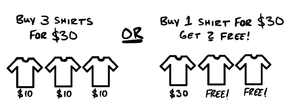

Và nếu tôi muốn thực sự đưa ra một mức giảm giá (thay vì chỉ đơn thuần là định khung lại mức giá), tôi hoàn toàn có thể làm như sau. Tôi có thể bán ba chiếc áo thun với giá 6,67 đô la mỗi chiếc, tổng cộng là 20 đô la (tức giảm giá 33%). Hoặc, với mức giảm giá y hệt, tôi có thể bán một chiếc áo thun với giá 20 đô la và tặng kèm hai chiếc miễn phí. <u>Giá tiền vẫn như nhau — nhưng một lần nữa, cảm giác “được cho không” thì nhiều hơn rất nhiều!</u>

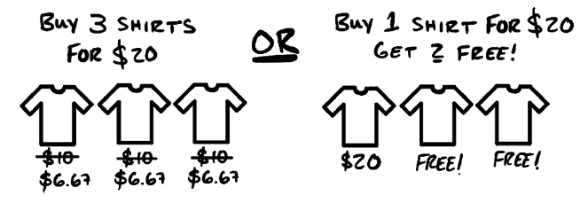

Boot Factory đã chọn phương án đầu tiên. Họ tăng giá một đôi ủng lên gấp ba lần, đồng thời gia tăng giá trị… bằng cách tặng thêm nhiều đôi ủng nữa. Và một đôi ủng có giá cao, nhưng đi kèm hai đôi tặng miễn phí, lại giúp Boot Factory thu hút nhiều khách hàng hơn hẳn so với việc chỉ bán một đôi với mức giá “hợp lý”. Hơn nữa, chỉ cần có chữ “miễn phí”, thì sức hút lại càng mạnh — và lượng khách hàng đổ về cũng nhiều hơn.

### Ví dụ
#### Ưu đãi sản phẩm vật lý: Mua 1 Tặng 2 (Ưu đãi của Boot Factory)
* Một đôi ủng: 200 đô la
* Ưu đãi Mua X – Tặng Y: Mua 1 đôi với giá 600 đô la, nhận thêm 2 đôi miễn phí
* Kết quả cuối cùng: Khách hàng vẫn mua ba đôi ủng, mỗi đôi trị giá 200 đô la, tổng cộng là 600 đô la

#### 3 Phiên bản: 18 tháng dịch vụ (Còn gọi là “3 đôi ủng”)
* Tốt: “Mua 12 tháng – Tặng 6 tháng miễn phí” — 1.800 đô la
* Tốt hơn: “Mua 9 tháng – Tặng 9 tháng miễn phí” — 1.800 đô la
* Tốt nhất: “Mua 6 tháng – Tặng 12 tháng miễn phí” — 1.800 đô la

Mọi người đều trả cùng một mức giá cho cùng một lượng dịch vụ. <u>Nhưng lựa chọn thứ ba là hấp dẫn nhất.</u> (Gợi ý: Nó có nhiều thứ miễn phí nhất!)

### Những Lưu Ý Quan Trọng

***Mua X – Tặng Y Khiến Mọi Người Mua Nhiều Hơn Và Mang Lại Giá Trị Lớn Hơn.*** Trước đây, một số doanh nghiệp dịch vụ của tôi phải mất cả một năm mới kiếm đủ tiền. Nhưng khi tôi đưa ra ưu đãi “Mua 6 tháng – Tặng 6 tháng miễn phí”, số lượng khách hàng tăng lên nhiều hơn hẳn so với mô hình trả tiền từng tháng ban đầu. Thậm chí còn tốt hơn: khách hàng trả tiền trước toàn bộ.

***Hãy Tăng Giá Trước Khi Tặng Thêm Để Bảo Toàn Lợi Nhuận.*** Nếu bạn dùng chiến lược này để thu hút khách hàng, nó sẽ hiệu quả. Và vì nó hiệu quả, nên bạn phải kiếm được tiền từ nó. Đừng tự lừa mình. Hãy thực sự tăng giá, rồi dùng mức giá mới đó để “gói” phần ưu đãi khuyến mãi vào. Vì tất cả khách hàng mới đều bước vào từ mức giá này, nên việc thay đổi giá — ít nhất là trong một giai đoạn — là hoàn toàn hợp lý. Thêm nữa, không ít người sẽ mua với giá tăng gấp đôi theo kiểu mua lẻ (à la carte), từ đó giúp bạn phá vỡ những niềm tin giới hạn về giá của chính mình. Không có gì phải cảm ơn đâu.

***Mua X – Tặng Y Hoạt Động Tốt Hơn Khi Phần “Tặng” Nhiều Hơn Phần “Bán”***

Hãy xem ví dụ thứ hai, “Mua 10 – Tặng 2” không mạnh bằng “Mua 2 – Tặng 10”. Điều này nghe có vẻ hiển nhiên, nhưng rất nhiều người không làm. Muốn nó hiệu quả hơn, hãy tặng nhiều hơn số bạn yêu cầu khách hàng mua. Cứ thử điều chỉnh giá cho đến khi hợp lý với bạn. Hãy nói “mua 1 tặng 2” thay vì “mua 2 tặng 1”.

***Quà Tặng Có Thể Khác Với Sản Phẩm Trả Tiền.***

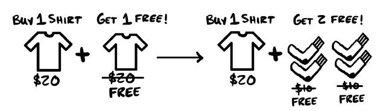

Khi mới bắt đầu áp dụng các ưu đãi kiểu này, đa số mọi người tặng đúng loại sản phẩm mà khách hàng mua. Nhưng thực tế, bạn có thể pha trộn tùy ý. Chỉ cần đảm bảo rằng giá trị của phần được tặng vẫn đủ hấp dẫn. Ví dụ: Một đôi tất có giá 10 đô la. Nếu khách hàng mua một chiếc áo 20 đô la và được tặng 20 đô la tiền tất, họ có thể cảm thấy đây là một thương vụ tốt hơn.

***Nhiều Món Rẻ Tặng Miễn Phí Có Thể Hiệu Quả Hơn Ít Món Đắt***

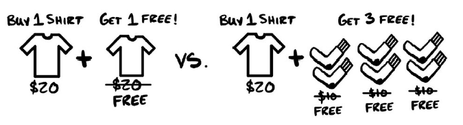

Quay lại ví dụ áo thun. Giả sử tôi chỉ đủ khả năng tặng 1 chiếc áo miễn phí, nhưng với cùng một chi phí đó, tôi có thể tặng 3 đôi vớ. Tôi rất có thể sẽ thử: “Mua 1 áo – Tặng 1 áo” so với “Mua 1 áo – Tặng 3 đôi vớ”, dù vớ rẻ hơn áo, nhưng trong mắt khách hàng, đây vẫn là: “mua một thứ – được thêm nhiều thứ miễn phí” Đôi khi, nhiều món rẻ lại hiệu quả hơn ít món đắt.

***Thay Vì Giảm Giá 33%, Hãy Thử Mua 1 – Tặng 2***

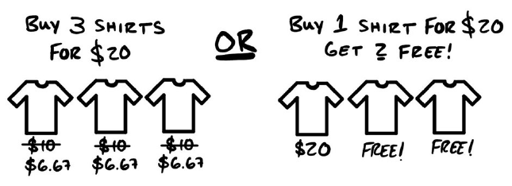

Dù về bản chất là giống nhau, nhưng “miễn phí” luôn tạo ra sự quan tâm lớn hơn so với giảm giá. Nhiều người biết giá trị của “miễn phí” rõ hơn giá trị của mức chiết khấu phần trăm. Do đó, bạn thường sẽ thu hút nhiều sự quan tâm hơn (và kiếm được nhiều tiền hơn) nếu nói: “Mua 1 áo 20 đô – Tặng 2 áo” Thay vì: “Áo giá 6,67 đô – Giảm 33%”. Hãy thử nghiệm.

***Đừng Đưa Ra Ưu Đãi Nếu Bạn Không Quản Lý Được Dòng Tiền.*** Các ưu đãi Mua X – Tặng Y có thể tạo ra dòng tiền khổng lồ, nhưng bạn phải có khả năng giao hàng / cung cấp dịch vụ. Nếu bạn thu được cả năm tiền phí chỉ trong một tháng, hãy chắc chắn rằng bạn có thể thực hiện trọn vẹn nghĩa vụ trong cả năm đó. Hãy lập ngân sách đúng mức cho chi phí phục vụ khách hàng trong suốt thời hạn cam kết. Đừng vung tiền mua nhà rồi phá vỡ cam kết với khách hàng. Bán một sản phẩm mà không thể cung cấp có thể vi phạm pháp luật và hủy hoại danh tiếng của bạn. Hãy luôn giữ đúng cam kết của bạn.

***Hãy Dùng Ưu Đãi Này Với Khách Hàng Hiện Tại Để Có Tiền Nhanh.*** Nếu bạn đã có mô hình kinh doanh định kỳ và cần tiền mặt nhanh, hãy đưa ưu đãi này cho khách hàng hiện tại. Nhiều người sẽ vui vẻ “mua 10 – nhận 2 miễn phí” ngay ở mức giá hiện tại. Chỉ cần giới hạn ưu đãi cho khoảng 10% khách hàng, bạn đã có một cú hích tiền mặt tốt mà vẫn giữ được dòng tiền ổn định.

***Đừng lo. Khách hàng trả trước vẫn tiếp tục mua hàng. Vì vậy, hãy cứ tiếp tục bán hàng cho họ.*** Rất nhiều người ngại đưa thêm ưu đãi cho khách hàng đã trả tiền trước. Đó là một sai lầm. Theo kinh nghiệm của tôi, chính những người chi nhiều tiền nhất lại tiếp tục mua nhiều nhất. Sau khi trả tiền trước vài tháng, ví tiền của họ đã được “làm mới” bằng dòng tiền mới — đừng cản họ chi tiêu.

***Nếu Khách Chỉ Mua Một Lần, Hãy Khiến Lần Mua Đó Thật Lớn.*** Trong câu chuyện vê Boots Factory của tôi, họ phục vụ cho khách du lịch muốn hòa nhập vào các quán bar cao bồi địa phương. Điều đó có nghĩa là đa số khách hàng chỉ mua đúng một lần. Chấm hết. Chính vì vậy, lần mua duy nhất đó phải càng lớn càng tốt. Chỉ cần bạn cung cấp đủ giá trị để “chống lưng” cho mức giá ấy. Nếu bạn chỉ có một cơ hội, thì tốt nhất hãy tận dụng nó tối đa.

### Các Điểm Tóm Tắt
- Trong các ưu đãi Mua X – Tặng Y, khi khách hàng mua một món hàng, họ sẽ được tặng thêm sản phẩm/dịch vụ khác miễn phí.
- Mô hình Mua X – Tặng Y hoạt động hiệu quả nhất với những sản phẩm/dịch vụ mà việc mua nhiều hơn hoặc sử dụng lâu hơn là hợp lý.
- Về bản chất, các ưu đãi Mua X – Tặng Y là cách tái định khung lại giá cả. Mua 1 – Tặng 2 có chi phí tương đương với việc mua 3 món, nhưng trong mắt khách hàng, ưu đãi “được tặng” giá trị hơn nhiều (ví dụ 18 tháng dịch vụ).
- Luôn cố gắng tặng nhiều thứ miễn phí hơn phần khách hàng phải trả tiền.
- Bạn có thể kết hợp các món quà tặng khác nhau với những sản phẩm/dịch vụ có thu phí.
- Một số ưu đãi Mua X – Tặng Y thực chất là giảm giá ngầm — trong đó, mua nhiều món cùng lúc sẽ có giá trung bình mỗi món thấp hơn so với mua từng món riêng lẻ.
- MuaX – Tặng Y có thể kéo dài thời gian khách hàng ở lại với bạn. Nếu thông thường khách chỉ ở lại 3 tháng, thì ưu đãi “Mua 2 – Tặng 2” có thể giữ họ trong 4 tháng (hoặc lâu hơn, tùy cách bạn thiết kế). Điều này mang lại cho bạn nhiều cơ hội hơn để bán thêm và tạo thêm giá trị.
- Nếu bạn dùng Mua X – Tặng Y để tạo ra lượng tiền mặt lớn trong thời gian ngắn, hãy đảm bảo rằng bạn quản lý tốt dòng tiền và thực hiện đúng cam kết.
- Nếu bạn cần tiền nhanh, hãy áp dụng ưu đãi này cho khách hàng trả phí định kỳ hiện tại. Chỉ cần hạn chế số lượng ưu đãi được bán để vẫn duy trì dòng tiền ổn định.
- Hãy tiếp tục bán cho những khách hàng trả tiền trước trong thời gian dài — đó chính là nhóm khách hàng có khả năng mua lại cao nhất.

>#### QUÀ TẶNG MIỄN PHÍ: Mua X Tặng Y Khóa Học Video Miễn Phí
>
>Mua X Tặng Y Miễn Phí giúp bạn kiếm được nhiều tiền và nhiều khách hàng. Bạn chỉ cần biết tính toán. Tôi đã làm một video miễn phí dành cho bạn, hướng dẫn một vài cách sáng tạo hơn để sử dụng nó. Bạn có thể xem video miễn phí tại acquisition.com/training/money. Quét mã QR nếu bạn ghét gõ chữ.