# PHẦN III: UPSELL OFFERS
*Bạn có muốn thêm khoai tây chiên không? - Chiêu trò bán thêm nổi tiếng của McDonald's*

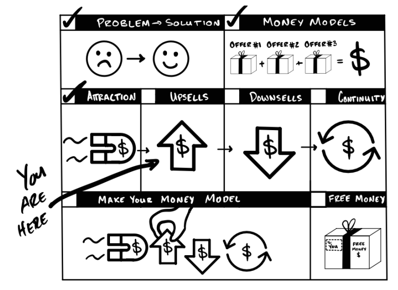

Với một Lời chào hàng Thu hút (Attraction Offer) đã sẵn sàng, bạn đã có khách hàng và tiền mặt. Nếu chúng ta làm tốt, chúng ta cũng đã tạo ra lợi nhuận. Tuyệt vời! Bây giờ chúng ta muốn tối đa hóa lợi nhuận trong 30 ngày. Vậy chúng ta làm gì? Câu trả lời là: kiếm thêm tiền. Để làm được điều đó, chúng ta tạo ra các Lời chào hàng Bán thêm (Upsell Offers). Và về bản chất, Upsell (Bán thêm) chỉ đơn giản là bất cứ thứ gì chúng ta chào mời tiếp theo.

## Cách thức hoạt động của Upsell

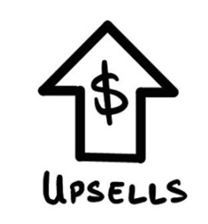

Khi một lời chào hàng giải quyết được một vấn đề, một vấn đề khác lại xuất hiện. Bạn bán thêm giải pháp cho vấn đề mà lời chào hàng trước đó của bạn vừa để lộ ra. Vì vậy, mỗi lời chào hàng đều mở ra cánh cửa cho một lần bán thêm… thậm chí là bán thêm của bán thêm! Thông thường, bán thêm chiếm phần lớn lợi nhuận. Chúng quyết định sự thành bại của một Mô hình Kiếm Tiền. Hãy để tôi cho bạn thấy mức độ của nó.

Giả sử một cửa hàng burger thu được 0,25 đô la lợi nhuận trên mỗi chiếc burger giá 2,00 đô la. Nếu đó là lời chào hàng duy nhất họ có, họ sẽ phải bán khoảng 10.000 chiếc burger mỗi ngày để trang trải chi phí và chỉ vừa đủ để "duy trì cuộc sống". Chúc may mắn nhé. Nhưng, họ có nhiều lời chào hàng hơn ngoài chiếc burger. Họ hỏi "Bạn có muốn dùng thêm khoai tây chiên không?" Nếu khách đồng ý, họ thu lời thêm 0,75 đô la và hỏi tiếp "Bạn có muốn đổi thành suất ăn combo không?" (có thêm đồ uống). Nếu ai đó đồng ý, họ lãi thêm 1,75 đô la nữa. Lợi nhuận của họ tăng từ 0,25 đô la lên 2,00 đô la — tăng gấp 8 lần. Và trên hết, họ đưa ra lời bán thêm thứ ba "Bạn có muốn nâng cấp suất ăn lên cỡ lớn chỉ với thêm 1 đô la không?" Điều này đưa lợi nhuận từ mức 0,25 đô la ít ỏi lên tới 3,00 đô la khổng lồ — tăng gấp 11,6 lần. Và giờ đây, cửa hàng burger nhỏ bé này thực sự có cơ hội thành công.

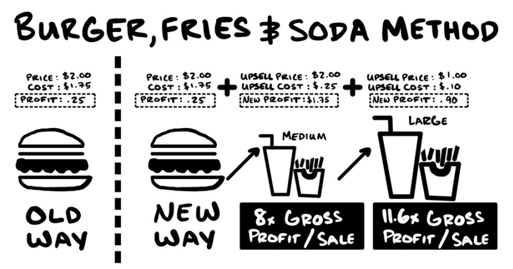

Tôi đưa ra ví dụ cơ bản (và phổ biến!) này để chỉ ra một điều — lời chào hàng đầu tiên không phải lúc nào cũng tạo ra lợi nhuận. Nói cách khác, thứ bạn bán được nhiều nhất không phải lúc nào cũng là thứ bạn kiếm được nhiều lợi nhuận nhất. Bạn kiếm tiền từ lời chào hàng thứ hai, thứ ba, và trong trường hợp của kinh doanh burger, là lời chào hàng thứ tư trở đi. Nếu McDonald’s không bán thêm khoai tây chiên và nước ngọt, McDonald’s sẽ không tồn tại. Nếu bạn muốn chiến thắng, bạn phải tìm ra phiên bản *"Bạn có muốn dùng thêm khoai tây chiên không?"* của riêng mình. Nếu bạn không làm, người khác sẽ làm.

Upsell thất bại khi:
* Bạn chào mời thứ họ không muốn (quá khác biệt hoặc không giải quyết được vấn đề của họ).
* Bạn chào mời sai thời điểm (trước khi họ thực sự trải nghiệm vấn đề đó).
* Bạn chào mời sai cách (họ không tin tưởng bạn).
* Hoặc kết hợp các lý do trên.

Tóm lại, Upsell thường cung cấp:
* Thêm về số lượng của thứ họ vừa nhận — Tại sao chỉ ăn một chiếc burger khi bạn có thể ăn hai?
* Phiên bản tốt hơn của nó (tăng chất lượng) — Tại sao phải ăn thịt xay không rõ nguồn gốc khi bạn có thể ăn thăn bò ngoại?
* Thứ mới hoặc bổ trợ (sự khác biệt) — Bạn có muốn dùng thêm khoai tây chiên và nước ngọt cùng với chiếc burger đó không?

***Tôi sử dụng bốn loại Lời chào hàng Bán thêm đơn giản và hiệu quả tàn khốc:***
* Upsell Truyền thống (The Classic Upsell)
* Upsell Thực đơn (Menu Upsells)
* Upsell Mỏ neo (Anchor Upsells)
* Upsell Chuyển tiếp (Rollover Upsells)

Và chỉ với một vài điều chỉnh, bạn có thể áp dụng chúng vào doanh nghiệp của mình ngay hôm nay.

***Cảnh báo:*** Phần này hiệu quả một cách tàn khốc và phải được sử dụng một cách có đạo đức. Nói xong rồi, giờ thì hãy cùng đi kiếm tiền thôi.

>#### QUÀ TẶNG MIỄN PHÍ: Lời chào hàng Bán thêm [Không cần đăng ký]
>
>Nếu bạn muốn kiếm thêm lợi nhuận trên mỗi khách hàng, bạn phải bán cho họ nhiều thứ hơn. Biết đúng thời điểm, đúng cách và đúng thứ để bán là chìa khóa. Tôi đã học được vô số bài học khi làm sai cách. Tôi hy vọng có thể giúp bạn tránh được những sai lầm đó và làm đúng ngay từ lần đầu tiên. Tôi đã chuẩn bị một buổi đào tạo bổ sung cho chương này mà bạn có thể xem miễn phí tại acquisition.com/training/money. Mã QR để truy cập nhanh chóng và dễ dàng.

## Upsell Cổ Điển

*Bạn Không Thể Có X Nếu Thiếu Y!*

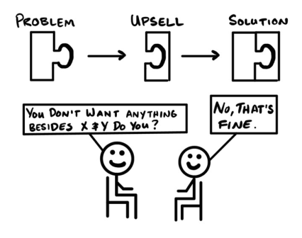

Mùa hè năm 2016.

Ông ấy là một nhà buôn áo khoác lông thú hàng đầu, một thiên tài kinh doanh đời thứ tư, và là người thầy thời thơ ấu của tôi. Chúng tôi ngồi xuống trò chuyện trong một nhà hàng sang trọng đối diện cửa hàng của ông ấy. Chỉ một phút sau khi gọi món, món cá hồi của chúng tôi đã được mang ra.

“Cậu nghĩ món cá hồi này tốn bao nhiêu tiền của nhà hàng nhỉ? Ba đô la? Có lẽ thêm vài xu cho phần trang trí? Và nhìn vào thực đơn kìa — họ đang tính giá ba mươi hai đô la! Không thể tin được…nhưng…chúng ta vẫn trả.” Ông ấy cắn miếng đầu tiên, cười thầm, rồi tiếp tục.

“Vậy là tôi nghe nói cậu đã tham gia vào lĩnh vực này rồi — tốt cho cậu đấy. Tôi không bao giờ đoán được khi cậu còn làm ở cửa hàng. Cậu khá vụng về.”

“Tôi biết nói gì đây? Chải bảy nghìn chiếc áo khoác lông thú liên tiếp đã làm tôi đau đầu rồi.” Tôi cười khúc khích, “Ông vẫn kiếm được bộn tiền từ việc đó chứ?”

Một nụ cười ngượng ngùng hiện lên. “Vâng. Và đó thậm chí còn chưa phải là phần hay nhất, con trai tôi đã nghĩ ra một ý tưởng thiên tài.” Con trai ông sẽ là người thừa kế đời thứ năm.

“Kể cho tôi nghe đi.” Tôi hỏi.

“Chúng tôi quảng cáo tặng bịt tai miễn phí khi khách hàng gửi áo khoác. Và nghe này. Khi khách hàng đến lấy bịt tai và gửi áo khoác, con trai tôi nói, *‘Tuyệt vời. Và chúng tôi cũng sẽ lưu trữ những thứ đó với giá 30 đô la. Bạn không muốn lưu trữ thêm gì nữa chứ?’* Và tất nhiên, họ sẽ nói không.”

“Khoan đã, vậy là các ông khiến họ trả tiền để gửi thêm cho chiếc bịt tai miễn phí bằng cách khiến họ nói không? Các ông đúng là huyền thoại.”

“Ồ chúng tôi ư? Không hề. Chúng tôi chỉ luôn sáng tạo… và nếu cái gì đó hiệu quả, chúng tôi sẽ tiếp tục sử dụng nó.”

*** 

Mỗi khi ông ấy nói chuyện kinh doanh, ông ấy lại rạng rỡ. Mặc dù có vẻ vụng về ở cửa hàng của ông ấy, tôi đã học được nhiều bài học quý giá từ ông. Tôi chia sẻ câu chuyện này để tưởng nhớ những bài học đó.

### Mô tả
Chiến lược bán thêm cổ điển (Classic Upsell) cung cấp giải pháp cho vấn đề tiếp theo của khách hàng ngay khi họ nhận ra vấn đề đó. Tôi giải thích về chiến lược bán thêm cổ điển trước tiên vì nó cực kỳ hiệu quả, dễ thực hiện và ai cũng có thể làm được. Lý do chính: khách hàng hiện tại luôn có khả năng mua sản phẩm của bạn cao hơn người lạ. Và, khi đúng thời điểm, khách hàng sẽ tự bán thêm cho chính mình.

Chiến lược bán thêm cổ điển dựa trên việc bạn hiểu rõ vấn đề của khách hàng hơn chính họ. Và bạn hoàn toàn nên biết điều đó - dù sao thì đó cũng là công việc kinh doanh của bạn. Ý tưởng rất đơn giản - sản phẩm/dịch vụ cốt lõi của bạn giải quyết một vấn đề và tạo ra một vấn đề khác. Sản phẩm/dịch vụ bán thêm của bạn ngay lập tức giải quyết vấn đề tiếp theo đó. Điều này tạo nên cấu trúc "Bạn không thể có X nếu không có Y" cho chiến lược bán thêm cổ điển. Giống như câu chuyện thuê xe. Bạn không thể có xe nếu không có bảo hiểm. Bạn không thể có xe nếu không có xăng. Bạn không thể có một chuyến đi tốt đẹp nếu không được trả xe muộn. Vân vân. Và tất cả những điều này trở nên rõ ràng ngay lập tức khi khách hàng thực hiện giao dịch mua đầu tiên. 

***Tóm lại:*** Nếu có vấn đề phát sinh và bạn có thể giải quyết ngay lập tức — đổi lấy tiền — hãy làm ngay!

### Ví dụ:
#### <u>Dịch vụ rửa xe địa phương</u>
* Mua hàng đầu tiên: Rửa xe
* Bán thêm: Chất phủ bảo vệ lốp

*Bạn sẽ không muốn rửa xe mà không dùng chất phủ bảo vệ. Bạn sẽ nhận được nhiều giá trị hơn với số tiền bỏ ra.*

#### <u>Sản phẩm vật lý</u>
* Mua hàng đầu tiên: Xe đạp
* Bán thêm #1: Mũ bảo hiểm
* Bán thêm #2: Đèn
* Bán thêm #3: Lốp chống thủng

*Bạn không thể đi xe đạp mà không có mũ bảo hiểm!*

#### <u>Sản phẩm kỹ thuật số</u>
* Mua hàng đầu tiên: Khóa học về tập thể dục
* Bán thêm: Khóa học dinh dưỡng

*Bạn không thể tập thể dục để bù đắp cho chế độ ăn uống tồi tệ…vì vậy bạn sẽ muốn tham gia khóa học về dinh dưỡng của chúng tôi.*

### Lưu ý quan trọng
***Hãy thực sự làm điều đó.*** Bạn sẽ ngạc nhiên khi biết có bao nhiêu doanh nghiệp đến gặp tôi và chỉ bán một thứ. Tôi thường chỉ nói với họ: “Các bạn hầu như không có một doanh nghiệp - các bạn chỉ có phần giao diện người dùng. Hãy tìm ra những gì các bạn sẽ cung cấp tiếp theo.” Vài tháng sau, tôi nghe nói họ đã tăng doanh thu gấp 5 lần vì họ thực sự đã cung cấp sản phẩm/dịch vụ để upsell.

***Hãy ưu tiên cung cấp các sản phẩm/dịch vụ bán thêm có lợi nhuận cao hơn trước.*** Nếu tôi cung cấp hai sản phẩm và một sản phẩm có lợi nhuận cao hơn sản phẩm kia, tôi sẽ cung cấp sản phẩm có lợi nhuận cao hơn trước.

***Hãy khiến họ “nói không để nói có”.*** Tôi luôn ngạc nhiên về việc người bán áo khoác lông thú thường thuyết phục được khách hàng mua hàng bằng cách nói “không”. Ông ta biết rằng mọi người đã được huấn luyện để nói “không” khi được hỏi “Bạn không muốn mua thêm gì nữa phải không?”. Nhưng điều này thực sự biến câu trả lời “không” thành “có”. Vì vậy, khi bán thêm sản phẩm/dịch vụ, câu hỏi sẽ được dịch là: Bạn không muốn mua thêm gì nữa [ngoài những gì tôi vừa cung cấp] phải không? Kỹ năng bán hàng thông minh. Vì vậy, hãy để những câu trả lời “không” (và “có”) đến.

***Gây bất ngờ và thích thú.*** Giả sử bạn có bốn phần thưởng dùng để thêm vào nhằm thuyết phục những người đang phân vân mua hàng. Hãy thêm từng phần một. Nếu họ nói có trước khi bạn thêm chúng, hãy vẫn tặng họ cả bốn phần thưởng. Điều đó sẽ làm họ ngạc nhiên và thích thú. Và, nó đảm bảo bạn vẫn bán cùng một thứ cho mọi người để không ai cảm thấy bị bỏ rơi sau này.

***Bán nhiều hơn khi họ mua nhiều hơn — Chu kỳ mua sắm siêu tốc.*** Hầu hết người mua bước vào chu kỳ “mua sắm siêu tốc” khi họ quyết định làm điều gì đó mới mẻ. Đó là một khoảng thời gian ngắn khi họ hào hứng nhất với điều mới mẻ mà họ sắp làm. Đây là lúc họ chi một khoản tiền lớn trong một khoảng thời gian ngắn. Hãy nghĩ đến đám cưới, bắt đầu sở thích mới, sinh con, chuyển đến nơi ở mới, v.v. Nếu bạn có một doanh nghiệp phục vụ cho những vấn đề này, đừng ngại các ưu đãi bán thêm. Hãy đón nhận nó...và tiếp tục đưa ra các ưu đãi.

***Sử dụng phần thưởng miễn phí để tạo ra các vấn đề mà ưu đãi bán thêm giải quyết.*** Các phần thưởng để giải quyết các vấn đề. Đó là điều làm cho chúng có giá trị. Và do vòng lặp vấn đề - giải pháp, chúng cũng có thể tạo ra thêm vấn đề. Bán thêm sản phẩm có thể giải quyết vấn đề mới đó. Ví dụ, bịt tai chống ồn tốn nguyên vật liệu và nhân công. Nhưng họ đã có thể "tặng miễn phí" bằng cách khiến khách hàng trả 30 đô la để lưu trữ thứ mà họ vừa nhận được miễn phí.

***Càng nhanh chóng tiếp cận được sản phẩm, người ta càng đánh giá cao nó.*** Một món đồ trị giá 10.000 đô la bạn nhận được sau này sẽ có giá trị thấp hơn một món đồ trị giá 10.000 đô la bạn nhận được ngay bây giờ. Càng mất nhiều thời gian để ai đó tiếp cận được thứ gì đó, giá trị của nó càng giảm tại thời điểm đó. Vì vậy, nếu bạn muốn tăng cơ hội họ chấp nhận bán thêm sản phẩm, hãy cung cấp nó càng sớm càng tốt. Thêm điểm cộng nếu bạn đưa nó vào tay họ trước khi họ nói đồng ý. Việc trả lại thứ gì đó khó hơn nhiều so với việc nói không.

***Nếu bạn kết hợp các sản phẩm bán thêm thành một gói, hãy đặt tên cho chúng.*** Bán cho ai đó một thứ dễ hơn bán cho ai đó chín thứ. Bằng cách đóng gói các mặt hàng lại với nhau, bạn có thể đưa ra một yêu cầu và nhận được chín đơn hàng. Tôi đặt tên các gói dựa trên loại khách hàng và/hoặc kết quả. Ví dụ: gói “Kết quả nhanh nhất”, gói “Chuyển đổi” hoặc “Gói tối thiểu”. Tất cả những điều này sẽ thúc đẩy doanh số bán thêm trên mỗi người. Cuối cùng, bạn có thể “tách” một số sản phẩm hoặc tính năng ra khỏi gói như một cách để bán ít hơn. Chi tiết hơn về điều đó trong Phần IV: Ưu đãi bán ít hơn.

***Tích hợp bán thêm vào các ưu đãi khác của bạn.*** Hãy biến những thứ bạn bán thêm thành một phần của cách bạn cung cấp các ưu đãi khác. Sau đó, nhiều khách hàng sẽ chấp nhận chúng. Kế hoạch bữa ăn của tôi bao gồm các gợi ý bổ sung tùy chọn. Vì vậy, khi tôi nói về dinh dưỡng, mọi người đã hỏi về thực phẩm bổ sung. Chương trình đào tạo bán hàng và tiếp thị của Gym Launch đã gợi ý các phần mềm tùy chọn. Điều này đã dẫn đến việc các chủ phòng tập mua chúng. Tích hợp thứ tiếp theo bạn muốn bán vào thứ đầu tiên họ mua.

***Hãy chắc chắn rằng bạn đặt lịch hẹn từ một lịch hẹn (BAMFAM).*** Càng bán thêm sản phẩm/dịch vụ nhiều lần, bạn càng bán thêm được cho nhiều người khác. Nếu bạn bán thêm cho nhiều người hơn, bạn sẽ kiếm được nhiều tiền hơn. Vì bạn muốn điều đó… hãy kết thúc mỗi cuộc hẹn bằng cách lên lịch cho cuộc hẹn tiếp theo. Đừng để họ rời đi mà không đặt lịch! Như người bạn CEO nổi tiếng của tôi, Sharran, nói: “Khách hàng nên biết lần tới họ gặp bạn là khi nào – và tại sao – trước khi họ rời đi.” Vì vậy, nếu bạn đồng ý gặp lại, hãy thống nhất lý do và thời gian ngay lúc đó.

***Bán thêm sản phẩm/dịch vụ nhiều lần nhất có thể.*** Công ty cho thuê xe đã bán thêm rất nhiều sản phẩm/dịch vụ. Quán burger cũng bán thêm rất nhiều. Phòng tập thể dục của tôi cũng bán thêm rất nhiều sản phẩm/dịch vụ. Gym Launch cũng bán thêm rất nhiều. Hãy đưa ra nhiều giải pháp như số lượng vấn đề bạn có thể giải quyết. Đừng ngại ngùng. Nếu bạn có thể giải quyết, hãy đề nghị. Điều tồi tệ thứ hai xảy ra là họ nói không. Điều tồi tệ nhất là họ có thể đã nói có nhưng bạn không bao giờ hỏi.

>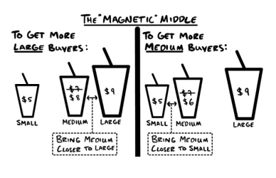
>
>***Cách bán thêm cùng một sản phẩm***
>
>Nếu bạn có hai sản phẩm và muốn bán một trong hai, hãy thêm lựa chọn thứ ba để khuyến khích họ mua sản phẩm bạn muốn. Các rạp chiếu phim làm điều này với nước ngọt và bỏng ngô. Đây là cách họ làm:
>
>Hệ thống giá Nhỏ - Vừa - Lớn của họ hoạt động như sau:
>* A - Nhỏ - 5 đô la
>* B - Vừa - 8 đô la (Thay vì mức giá hợp lý là 7 đô la)
>* C - Lớn - 9 đô la
>
><u>Kết quả:</u> Nhiều người chọn cỡ lớn hơn. Những người sẽ chọn cỡ nhỏ sẽ luôn chọn cỡ nhỏ. Những người chọn cỡ lớn sẽ luôn chọn cỡ lớn. *Nhưng những người thường chọn cỡ vừa giờ có thể sẽ chọn cỡ lớn.*
>
>Nếu bạn muốn nhiều người mua cỡ trung bình hơn, bạn sẽ định giá như sau:
>* Nhỏ - 6 đô la (Thay vì mức giá hợp lý là 5 đô la)
>* Trung bình - 7 đô la
>* Lớn - 9 đô la
>
><u>Kết quả:</u> Điều này giúp bán được cỡ trung bình cho nhiều người hơn vì giờ đây, hầu hết những người thường mua cỡ nhỏ sẽ mua cỡ trung bình.
>
>***Tóm lại:*** Nếu bạn có nhiều khách hàng mua cỡ nhỏ, bạn có thể khuyến khích họ mua cỡ trung bình. Nếu bạn có nhiều khách hàng mua cỡ trung bình, khuyến khích họ mua cỡ lớn. Nếu bạn có nhiều khách hàng mua cỡ lớn, hãy tăng giá tất cả các loại sản phẩm.

***Bán thêm các gói bảo hành, đảm bảo và bảo hiểm.*** Nhiều doanh nghiệp cung cấp đảm bảo sản phẩm. Nhiều doanh nghiệp cung cấp bảo hành sản phẩm. Nhiều doanh nghiệp cung cấp bảo hiểm sản phẩm. Bạn có thể bán thêm tất cả chúng. Vì vậy, thay vì làm miễn phí, chỉ cần thêm 5-50% vào giá để đổi lấy bảo đảm rằng sản phẩm của bạn hoạt động đúng như bạn đã nói. Ví dụ: Một xưởng vẽ tranh trước đây thay thế những bức chân dung bị hư hỏng miễn phí. Tôi bảo họ bắt đầu hỏi khách hàng xem họ có muốn trả thêm 10% không. Giờ đây, 30% khách hàng mua những thứ mà xưởng vẽ tranh trước đây cho miễn phí. Lợi nhuận thuần túy đấy.

### Tóm tắt
* Ưu đãi thu hút khách hàng của bạn chỉ ra một vấn đề. Bán thêm (bất cứ thứ gì bạn cung cấp tiếp theo) giải quyết vấn đề đó.
* Sử dụng chiến lược bán thêm cổ điển cho những vấn đề cấp bách được chỉ ra bởi ưu đãi trước đó của bạn.
* Hỏi “Bạn không muốn mua thêm gì nữa phải không?” sẽ khiến mọi người đồng ý bằng cách nói không. Cách này hiệu quả.
* Tăng khả năng khách hàng mua thêm bằng cách cho họ quyền truy cập càng sớm càng tốt.
* Tặng quà khuyến mãi tạo ra cơ hội bán thêm. Một cách tuyệt vời để kiếm thêm tiền.
* Để có nhiều cơ hội bán thêm cho khách hàng hơn, hãy biến BAMFAM thành lối sống.
* Bạn có thể có bao nhiêu ưu đãi bán thêm tùy thích miễn là bạn giải quyết được vấn đề. - Bạn sẽ không mất gì khi đề nghị giải quyết vấn đề của người khác.
* Nếu điều đó phù hợp với hoạt động kinh doanh của bạn, bạn có thể tính phí cho các cam kết, bảo hành hoặc bảo hiểm.

>#### QUÀ TẶNG MIỄN PHÍ: Xem Video Huấn Luyện Bán Hàng Gia Tăng Kinh Điển [Không Cần Đăng Ký]
>
>Kỹ thuật upsell đầu tiên mà mọi người nên học là upsell cổ điển. Có rất nhiều mẹo nhỏ có thể tạo nên sự khác biệt lớn. Tôi đã tạo một video huấn luyện để đảm bảo bạn không bỏ sót bất kỳ chi tiết nhỏ nào. Bạn có thể xem miễn phí tại acquisition.com/training/money. Mã QR để truy cập nhanh chóng và dễ dàng.

## Menu Upsell

*Bạn không cần cái đó... bạn cần cái này.*

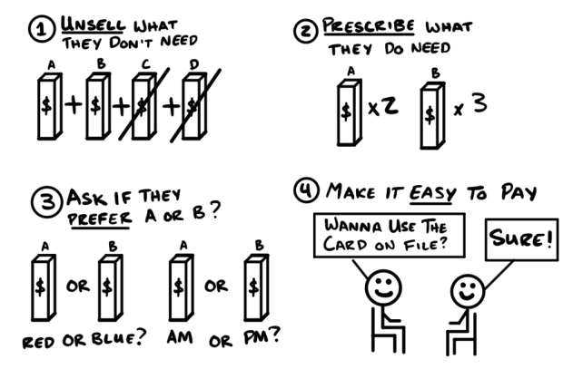

Tháng 12 năm 2013.

Mọi người vẫn đến phòng tập như bình thường, nhưng chẳng ai quan tâm đến thực phẩm chức năng của tôi cả. Tôi đọc ở đâu đó rằng việc bày đầy hàng sẽ thu hút nhiều người mua hơn. Thế là tôi sắp xếp các nhãn mác trên kệ thật gọn gàng. Nhưng không hiệu quả. Tôi cũng đọc được rằng nếu tôi kể cho mọi người nghe về những nghiên cứu khoa học thú vị thì họ sẽ mua. Cách đó cũng không hiệu quả. Tôi chỉ nhận được một vài đơn hàng miễn cưỡng từ những thành viên trung thành, nhưng rõ ràng là tôi đang làm sai điều gì đó. Sao tôi lại tệ đến vậy?

Vào một ngày đặc biệt tồi tệ, tôi đã có mười chín cuộc tư vấn dinh dưỡng, và không ai mua gì cả. Thật là khổ sở. Rồi, cuộc hẹn thứ hai mươi đến. Cô ấy có một chiếc túi xách đẹp và một chiếc nhẫn kim cương lớn trên tay. Nếu tôi không bán được cho cô ấy, thì tôi nên bỏ cuộc thôi. Nhưng rồi tôi nhớ ra... tôi có 5.000 đô la hàng tồn kho trên kệ đó - tôi phải tìm cách giải quyết chuyện này!

Chúng tôi bắt đầu buổi tư vấn dinh dưỡng cho cô ấy và tôi bắt đầu cảm thấy lo lắng. Tôi lo lắng đến nỗi quên cả kịch bản. Thay vì thao thao bất tuyệt về những kiến ​​thức khoa học, tôi chỉ hỏi "Cô có một ly sinh tố protein cho bữa sáng, cô thích vị sô cô la hay vani?"

"Cái nào là cái bạn thích nhất?" Cô ấy hỏi.

"Sôcôla."

"Tuyệt vời. Tôi sẽ lấy một cái."

Khoan đã, chuyện gì vừa xảy ra vậy? Tôi đâu có nói về lợi ích hay gì đâu. Tôi chỉ hỏi cô ấy muốn gì... và cô ấy đã nói cho tôi biết! Hiểu ý, tôi chuyển sang món tiếp theo.

"Bạn muốn uống nước chanh kiwi hay chanh dâu trước khi tập luyện?" rồi tôi nhớ lại câu hỏi cuối cùng của cô ấy - "...Tôi thích nước chanh dâu." (người bán hàng đang nói sở thích của mình - ý của người dịch)

Cô ấy mỉm cười và nói, "Tuyệt, tôi sẽ lấy cái đó."

Tôi có nhiều sản phẩm hơn, nhưng bán được hai sản phẩm đã là kỷ lục rồi và tôi không muốn làm cô ấy sợ. Tôi vẫn phải đòi tiền. Vì vậy, tôi lấy hợp đồng thành viên của cô ấy, trên đó đã có sẵn thông tin thẻ của cô ấy, và hỏi: "Bạn chỉ muốn dùng thẻ mà chúng tôi đã lưu trong hệ thống thôi đúng không?"

"Vâng, vậy cũng ổn."

Sau cuộc trò chuyện đó, tôi đã bán hàng cho hai mươi khách hàng tiếp theo liên tiếp. Cuối ngày, tôi nhìn chằm chằm vào kệ hàng trống không với vẻ không tin nổi. Tôi biết cách bán thực phẩm chức năng rồi.

***Bài học rút ra:*** Tôi đã tình cờ phát hiện ra hai chiến thuật thay đổi hoàn toàn cách bán thêm sản phẩm của mình. Thứ nhất, <u>A/B Upsell</u> - tôi hỏi khách hàng thích sản phẩm nào hơn thay vì hỏi họ có muốn mua sản phẩm đó hay không. Thứ hai, hỏi họ có muốn sử dụng thẻ đã lưu trong hệ thống thay vì yêu cầu họ lấy thẻ ra lần nữa. Tôi vẫn sử dụng cả hai chiến thuật này cho đến ngày nay.

Tháng 8 năm 2014.

Lúc đó, tôi chốt được hàng liên tục. Cứ thế mà tiến triển. Không phải là doanh thu khổng lồ, nhưng tôi bán hàng đều đặn. Mỗi tháng tôi lại bắt đầu một nhóm học viên mới. Và cứ như thường lệ, tôi lại bán thêm được lượng thực phẩm chức năng trị giá từ 5.000 đến 10.000 đô la. Không tồi chút nào cho một ngày làm việc!

Nhưng rồi một ngày, tôi gặp một bà khách cứ liên tục hỏi han. Bà ấy cứ muốn biết thêm thông tin. Cách tiêm. Bao nhiêu mũi. Khi nào. Giờ nào. Nếu bà ấy đang đi làm thì sao? Nếu bà ấy ở nhà thì sao? Nếu bà ấy ở phòng tập thể dục thì sao? Bà ấy cứ hỏi mãi. Tôi sắp trễ hẹn cho buổi tư vấn tiếp theo. Cuối cùng, tôi chỉ viết hướng dẫn từng bước lên mặt sau của một tờ giấy nháp. *Uống một viên này vào buổi tối. Uống hai viên viên này sau bữa trưa. Uống cái này sau khi tập luyện. Vân vân và vân vân.*

Tôi đã giải thích cho cô ấy hiểu những gì mình đã viết và hỏi: "Như vậy có hợp lý không?"

Gật đầu. "Cảm ơn!" Cô ấy cầm lấy tờ báo và rời đi.

Người mà tôi hẹn gặp tiếp theo đã nghe lén toàn bộ cuộc trò chuyện của chúng tôi. Ngay khi ngồi xuống, cô ấy hỏi: "Bạn có nghĩ rằng bạn có thể viết nó ra giống như bạn đã làm cho người phụ nữ kia không?" Tôi cố gắng không thở dài - nhưng không thành công. Tôi lại sắp trễ hẹn buổi tư vấn tiếp.

Nhưng tôi đã làm theo yêu cầu của cô ấy. Lần này, tôi viết hướng dẫn trực tiếp lên phiếu đặt hàng. Bên cạnh mỗi mặt hàng, tôi ghi rõ số lượng cần lấy và thời gian lấy. Và vì không muốn lùi lịch hẹn thêm mười lăm phút nữa, tôi quyết định bán thêm sản phẩm.

"Tôi đã đưa tất cả hướng dẫn cho bạn rồi, bạn có muốn sử dụng thẻ đã lưu trong hệ thống không?" tôi hỏi.

"Vâng, được thôi."

Trời ơi, tuyệt quá! Cô ấy tự mua hết đống sản phẩm đó... mà mình còn chẳng cần hỏi gì cả. Mình chỉ bảo thôi, và cô ấy làm ngay. Như có phép thuật vậy.

Từ ngày đó trở đi, tôi đã làm như vậy, và lợi nhuận trong 30 ngày của tôi tăng vọt.

***Bài học rút ra:*** Tôi nhận thấy rằng hướng dẫn chi tiết và cá nhân hóa sẽ giúp bán được nhiều sản phẩm hơn so với những gợi ý chung chung và mơ hồ. Tôi gọi đây là phương pháp <u>prescription upselling.</u>

Tháng 11 năm 2016.

Lúc đó, tôi đang rong ruổi khắp nơi để khai trương các phòng tập thể hình cho người khác. Và việc đó bao gồm cả bán thực phẩm chức năng. Tôi bán cho hàng nghìn người. Mỗi ngày tôi gặp từ 40 đến 50 người. Cứ 30 phút lại gặp một người. Liên tục 12 tiếng đồng hồ. Chỉ riêng những đợt bán thực phẩm chức năng này đã đủ trả tiền vé máy bay, khách sạn và chi phí quảng cáo của tôi. Tôi giỏi đến nỗi hết hàng để bán. Hôm nay là một trong những ngày như vậy.

Tôi vừa bán cho một khách hàng sản phẩm cuối cùng trong số bốn sản phẩm khác nhau. Trong những trường hợp như thế này, tôi sẽ bán bất kỳ cái gì tôi còn trên kệ hàng cho khách hàng tiếp theo. Nhưng trước khi tôi kịp giới thiệu, bà ấy đã buột miệng hỏi: "Tôi có thể mua loại mà bà ấy vừa mua không?". Ôi trời.

Tôi nói: "Xin lỗi, tôi hết rồi. Nhưng thành thật mà nói, cô có thể mua một loại tương tự ở cửa hàng dưới phố với giá rẻ hơn khoảng 20 đô la. Nó không tốt bằng, nhưng cũng tạm ổn cho tháng đầu tiên. Được chứ?"

"Cảm ơn cậu rất nhiều vì đã giúp đỡ tôi." Cô ấy tỏ ra rất biết ơn. Điều đó khiến tôi cảm thấy dễ chịu. Vì vậy, tôi tiếp tục từ chối bán hàng.

"Cái này cũng vậy. Không tốt bằng, nhưng nó sẽ giúp cô vượt qua tháng đầu tiên." Cô ấy trông có vẻ rất vui. Tôi không thể kìm lòng được nữa. Tôi bắt đầu hủy bỏ những món hàng mà dù sao tôi cũng không định bán cho cô ấy.

"Cô không định tăng cân chứ?" Tôi nói đùa.

"Ôi trời ơi! không!" cô ấy cười.

"Tuyệt vời. Cô sẽ không cần cái này đâu," - Tôi nói, đồng thời gạch bỏ lọ sữa tăng cân. "À, và cô cũng không định tăng testosterone đúng không?"

"Không, haha. Tôi không muốn vậy đâu," cô ấy nói.

"Tuyệt vời. Cô cũng sẽ không cần cái này đâu." Tôi gạch bỏ nó. Sau đó, tôi bắt đầu đưa ra những gợi ý từ những thứ còn lại. "Được rồi. Vậy cô sẽ cần hai cái này... ba cái này..." và tôi tiếp tục. Cô ấy rất thích và mua ngay không chút do dự.

***Bài học rút ra:*** Tôi đã cố gắng hết sức để gạch bỏ những thứ cô ấy không cần. Và điều này đã tạo dựng đủ thiện cảm để tôi bán thêm những thứ cô ấy cần. Sau đó, tôi giữ lại một số sản phẩm chỉ để gạch bỏ chúng! Tôi gọi quá trình này là <u>Unselling</u>.

### Mô tả

Trong chiến lược Menu Upsell, bạn cho khách hàng biết những lựa chọn nào họ không cần. Sau đó, hãy cho họ biết những gì họ thực sự cần, sở thích của họ và cách để họ nhận được giá trị từ sản phẩm đó. Menu Upsell kết hợp bốn chiến thuật: Unselling (không bán hàng), Prescription Upselling (Bán theo đơn), A/B Upselling và Thông Tin Thể Đã Lưu.

Đầu tiên, tôi loại bỏ những thứ mà khách hàng không cần.

Thứ hai, tôi kê đơn những gì họ thực sự cần.

Thứ ba, tôi hỏi họ thích phương án A hay B hơn.

Cuối cùng, tôi tạo điều kiện thuận lợi cho việc mua hàng bằng cách hỏi họ có muốn sử dụng thẻ đã lưu trong hệ thống hay không.

*Unselling*. Bạn "không bán hàng" bằng cách nói cho khách hàng biết những gì họ không cần để bạn có thể nhấn mạnh những gì họ cần. Ở đây, thay vì hỏi họ có muốn mua hay không, bạn giải thích những gì họ không cần như một cách để khiến họ hào hứng với những gì họ đang có. Chiến thuật "không bán hàng" sẽ khác nhau tùy thuộc vào nhu cầu của khách hàng. Khi một số lựa chọn hiệu quả nhất, bạn có thể loại bỏ những lựa chọn còn lại. Sau khi nói cho họ biết những gì họ không cần...

*Prescription Upselling*. Chúng ta cho họ biết những gì họ thực sự cần. Việc bán thêm sản phẩm theo đơn rất hiệu quả khi việc đưa ra nhiều lựa chọn gây bất tiện và bạn chỉ có một giải pháp duy nhất cho vấn đề đó. Bán thêm sản phẩm theo đơn có hai thành phần quan trọng. Thứ nhất, bạn phải giải thích cách nó tích hợp với các ưu đãi mà họ đã mua. Thứ hai, bạn cá nhân hóa và mô tả chi tiết cách tối đa hóa giá trị của nó. Ở đây, thay vì hỏi họ có muốn mua hay không, bạn giải thích cách sử dụng nó như thể họ đã sở hữu nó. Một lần nữa, chúng ta loại bỏ tùy chọn không mua để giảm thiểu khả năng họ không mua. Và một khi tôi đã nói rõ cho họ chính xác cách họ sẽ sử dụng mọi thứ...

*A/B Upselling*. Chúng ta hỏi khách hàng về sở thích của họ. A/B Upselling hiệu quả với nhiều sản phẩm cùng giải quyết một vấn đề. Bạn thực hiện A/B Upselling bằng cách hỏi khách hàng về sở thích của họ. Thay vì hỏi khách hàng có muốn mua sản phẩm hay không, chúng ta hỏi họ thích sản phẩm nào hơn: A hay B. Cả hai lựa chọn đều dẫn đến việc bán thêm sản phẩm. Về cơ bản, khi bạn cho mọi người lựa chọn không mua, một số người sẽ không mua. Vì vậy, tôi cho họ lựa chọn mua hai sản phẩm tương tự nhau. Khi họ biết mình đang mua gì và sẽ sử dụng nó như thế nào, tôi đề xuất cách thanh toán dễ dàng nhất cho họ...

*Thanh toán bằng thẻ đã lưu.* Một điểm nhấn tuyệt vời cho tất cả những ưu điểm bán hàng gia tăng này. Tôi thường hỏi thẳng, "Bạn có muốn sử dụng thẻ đã lưu không?". Ở đây, thay vì hỏi họ có muốn thanh toán hay không, bạn đề cập đến những cách họ đã từng sử dụng. Điều này giúp nhiều người mua hơn vì nó giảm thiểu "chi phí ẩn" khi mua hàng. Việc phải chọn thẻ nào để sử dụng. Việc phải lấy thẻ ra. Việc phải nhớ lại những quyết định mua hàng tồi tệ trong quá khứ. Thậm chí cả sự phiền phức khi mua sắm vội vàng... và còn bao nhiêu nữa. Chỉ cần biết rằng nếu bạn tạo điều kiện dễ dàng cho mọi người mua hàng, sẽ có nhiều người mua hơn.

### Ví dụ
#### Chuyên gia trị liệu mát-xa
* Unsell: Chúng tôi có dịch vụ massage bạch huyết, nhưng bạn không mang thai hoặc vừa mới phẫu thuật xong phải không? Vậy nên chúng ta có thể loại bỏ dịch vụ đó.
* Prescribe: Vì vai của bạn bị đau, trước tiên chúng ta sẽ làm nóng cơ thể, sau đó ấn vào các điểm đau, và sau đó là một số bài tập giãn cơ năng động.
* A/B: Vậy bạn thích thực hiện trước khi đi làm hay trên đường về nhà hơn?
* Thẻ đã lưu: Bạn muốn sử dụng thẻ đã lưu không?

#### Thức ăn cho chó
* Unsell: Bạn sẽ không cần cái túi nhỏ này hay mấy thứ đồ dùng cho chó con đâu – chó của bạn to lắm rồi! Bạn cũng không cần mấy loại vitamin này vì thức ăn đã có sẵn rồi.
* Prescribe: Bạn cũng nên cho chó ăn một viên nhai hỗ trợ khớp này trong mỗi bữa ăn. Và cứ 90 ngày, hãy cho chúng uống một viên thuốc trị giun tim này. Ngoài ra, hãy nhớ đưa chúng trở lại vào tháng sau. Đặt lịch ngay bây giờ nhé.
* A/B: Vậy chó của bạn thích vị thịt bò hay thịt gà hơn?
* Thẻ đã lưu: Bạn muốn sử dụng thẻ đã lưu không?

#### Sản phẩm kỹ thuật số
* Unsell: Bạn chưa cần cả tám khóa học đâu. Bạn chỉ cần giải quyết các bài toán X, Y và Z thôi. Tôi sẽ gửi cho bạn một số tài liệu miễn phí giúp giải quyết các bài toán X và Y. Sau đó, bạn chỉ cần một khóa học để giải quyết bài toán còn lại.
* Prescribe: Nhưng để giải quyết vấn đề Z, bạn chắc chắn sẽ muốn học theo cách này. Bạn có thể dành một giờ mỗi ngày cho nó không? Được rồi - tuyệt vời. Điều này sẽ ngăn ngừa bất kỳ vấn đề Z nào khác phát sinh sau này.
* A/B: Bạn muốn được hỗ trợ qua tin nhắn trực tiếp hay qua điện thoại? Tuyệt vời. Và bạn muốn bắt đầu hôm nay hay thứ Hai?
* Thẻ đã lưu: Tuyệt vời. Bạn muốn sử dụng thông tin thẻ đã lưu không?

>***Mẹo hay:*** Để "Lưu thông tin thẻ" cho lần mua hàng đầu tiên, hãy hỏi — "Bạn muốn sử dụng thẻ nào?"

### Lưu ý quan trọng:

***Biến mọi thứ thành sản phẩm bán hàng A/B.*** Bạn có thể biến bất cứ thứ gì thành một ưu đãi A/B. Dưới đây là một vài ý tưởng... Số lượng (bạn muốn một chai hay hai chai?), ngày bắt đầu (bắt đầu ngày mai hay thứ Hai?), phương thức thanh toán (tiền mặt hay thẻ?), hương vị (sô cô la hay vani?), khung giờ (sáng hay chiều?), phương tiện (đọc hay nghe?), tốc độ giao hàng (tiêu chuẩn hay giao hàng nhanh?), kích cỡ (nhỏ hay vừa?), màu sắc (đen hay trắng?), chất liệu (giấy hay nhựa?), nhân viên (John hay Sara?), phương thức liên lạc (gọi điện hay nhắn tin?). Với một chút sáng tạo, bạn có thể biến bất cứ thứ gì thành một sản phẩm bán thêm theo hình thức A/B.

***Nếu bạn đưa ra ưu đãi A/B, hãy thêm một chút gợi ý.*** Nếu khách hàng của bạn có ít kinh nghiệm với sản phẩm hoặc dịch vụ của bạn, hãy gợi ý cho họ. "Đây là sản phẩm tôi thích nhất" hoặc "X thường là lựa chọn an toàn" hoặc "rất nhiều người thích sản phẩm này" hoặc "Các buổi học vào thứ Ba thường ít người tham gia hơn nếu bạn thích" hoặc "Amy rất giỏi trong việc hướng dẫn học sinh trung học." Những câu nói ngắn gọn này thực sự giúp thúc đẩy doanh số bán hàng. (Gợi ý: Nếu bạn muốn bán một sản phẩm cụ thể nhanh hơn, hãy gợi ý sản phẩm đó nhiều hơn.)

***Nếu bạn đã bán hết hàng, hãy nhận thanh toans và giao hàng sau.*** Sau này tôi mới biết mình chỉ cần bán hàng cho khách, đặt hàng và ấn định thời gian giao hàng. Điều này cho phép tôi bán được nhiều mặt hàng hơn vì không cần phải dự trữ hàng. Nếu hết hàng, hãy cân nhắc việc chỉ cần thu tiền và thay đổi thời gian giao hàng dự kiến. Bạn sẽ ngạc nhiên về hiệu quả của cách này. 

***Nhân viên thích "bán hàng ngược".*** Nhân viên thường thích giúp khách hàng "lách luật". Hãy để họ làm điều đó. Khuyến khích nhân viên giúp khách hàng "lách luật" một cách có chủ đích. Nhân viên của bạn có thông tin nội bộ, vì vậy hãy cho phép họ chỉ cho khách hàng cách tận dụng tối đa giá trị từ những gì bạn cung cấp. Ai cũng có lợi.

***Xem phần “Vở kịch ‘Nhà kinh tế’” bên dưới để hiểu rõ hơn bằng hình ảnh.***

>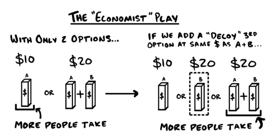
>
>#### Nếu bạn có hai lựa chọn và muốn mọi người mua cả hai
>Vào cuối những năm 1990, tạp chí The Economist bắt đầu cung cấp dịch vụ đăng ký kỹ thuật số vì ngày càng nhiều người đọc tin tức trực tuyến. Nhưng họ cũng muốn duy trì lượng người đăng ký bản in sinh lời. Vì vậy, nghĩ rằng mọi người sẽ mua cả hai, The Economist đã đưa ra những ưu đãi sau:
>
>A - Gói đăng ký kỹ thuật số: 59 đô la/năm
>
>B - Gói đăng ký bản điện tử + bản in: 125 đô la/năm
>
>Kết quả: Doanh số bán sách in giảm mạnh khi khách hàng đổ xô mua phiên bản kỹ thuật số rẻ hơn. Thật đáng tiếc.
>
>Để khắc phục điều đó, họ đã thêm một tùy chọn "mồi nhử" với giá tương đương gói sản phẩm:
>
>A - Gói đăng ký kỹ thuật số: 59 đô la/năm
>
>B - Đăng ký báo in: 125 đô la/năm
>
>C - Gói đăng ký bản điện tử + bản in: 125 đô la/năm
>
>Kết quả: Khách hàng hiện đã chọn gói C - Kỹ thuật số + In ấn với giá 125 đô la/năm.
>
>***Tóm lại:*** Đưa ra ba lựa chọn. Lựa chọn A, Lựa chọn B và Lựa chọn C (cả hai)... nhưng bạn đặt giá của (C) bằng với lựa chọn đắt hơn (B). Miễn là bạn định giá các lựa chọn để duy trì lợi nhuận, bạn sẽ giúp khách hàng dễ dàng lựa chọn và bán được cả hai.

### Tổng kết
* Menu Upsells hiệu quả nhất khi bạn có nhiều ưu đãi khác nhau.
* Menu Upsells kết hợp tối đa bốn chiến thuật:
    * Unselling: Bạn nói với khách hàng những thứ họ không cần.
    * Prescribing: Hãy cho họ biết những gì họ thực sự cần.
    * A/B Offer: Hãy hỏi họ thích phương án nào hơn.
    * Cuối cùng, tôi tạo điều kiện thuận lợi cho việc mua hàng bằng cách hỏi họ có muốn sử dụng thẻ đã lưu trong hệ thống hay không.
* Loại bỏ những sản phẩm có lợi nhuận thấp khi thích hợp sẽ khuyến khích việc bán thêm các sản phẩm có lợi nhuận cao hơn.
* Khuyến khích nhân viên từ chối bán hàng và cố tình "lách luật".
* Hãy định hướng khách hàng mới đến những điều phù hợp với họ.

>#### QUÀ TẶNG MIỄN PHÍ: Khóa đào tạo Menu Upsell
>
>Tôi hiếm khi ra lệnh. Cứ làm đi. Cứ xem. Tôi có thể dạy cả một lớp học chuyên sâu về cách bán thêm sản phẩm này. Nó đã giúp tôi kiếm được hàng triệu đô la. Chỉ vậy thôi. Cứ vào acquisition.com/training/money. Đúng vậy, nó miễn phí. Không, bạn sẽ không hối hận đâu. Mã QR để truy cập nhanh chóng và dễ dàng.

## Anchor Upsell (upsell neo tâm lý)

*Điều tồi tệ hơn cả việc đưa ra lời đề nghị 1.000 đô la cho người chỉ có ngân sách 100 đô la... là đưa ra lời đề nghị 100 đô la cho người có ngân sách 1.000 đô la.*

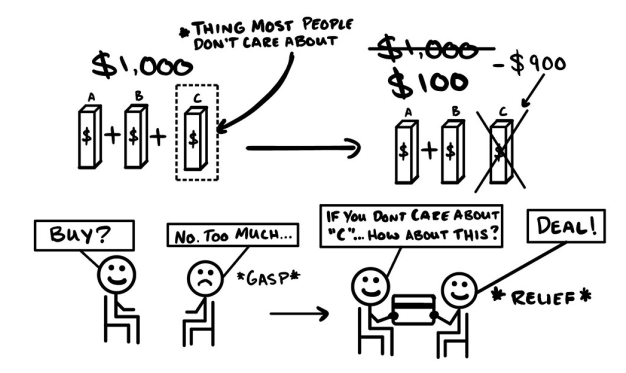

2016. Sau khi bắt đầu Gym Launch, nhưng trước khi kiếm được tiền.

Năm năm qua, tôi hầu như không tắm rửa, chỉ mặc đồ thể thao và áo ba lỗ. Nhưng giờ tôi đã có Gym Launch, và một người bạn có gu thời trang nói rằng tôi nên ăn mặc chuyên nghiệp. "Doanh nhân không mặc áo ba lỗ đâu Alex. Tớ quen chủ một cửa hàng vest ở địa phương. Tớ sẽ báo với ông ấy là cậu sẽ đến." Tôi nghe lời khuyên của anh ấy và đến đó.

Vậy là tôi đã dự trù 500 đô la cho một bộ vest – một khoản mua sắm lớn vào thời điểm đó. Tôi bước vào cửa hàng vest và bắt chuyện. Chủ cửa hàng biết tôi sẽ đến. Tuyệt vời! Tôi nói với ông ấy rằng tôi vừa mới bắt đầu một công việc kinh doanh mới và muốn một bộ vest "kiểu sếp". Ông ấy lấy số đo của tôi, rồi lấy hai bộ vest từ trên giá xuống. Tôi mặc thử bộ đầu tiên.

"Trông thế nào? Bạn cảm thấy thế nào?"

Tôi mỉm cười. Tôi cảm thấy thật ngầu. Giống như một người giàu có. Nó trông thật tuyệt. Anh ta nói về một vài phụ kiện nhưng tôi không nghe nhiều. Lúc này tôi "quá ngầu" để nghe (ha!). Chắc chắn sẽ rất tuyệt. Anh ta quay sang nói chuyện với một nhân viên. Tôi lật nhãn giá lại để xem...

...16.000 đô la. Mặt tôi đỏ bừng. Tất cả những gì tôi nghĩ lúc đó là bạn tôi đã nhờ chủ quán dành thời gian cho tôi, trong khi tôi thậm chí không đủ tiền mua bất cứ thứ gì ở đây. Tôi cảm thấy kinh hoàng. Tôi cúi đầu xuống để cố gắng che giấu sự sốc của mình. Tôi hít một hơi thật sâu và ngẩng lên. Tôi đã thất bại. Ông ấy đã thấy tôi đỏ mặt.

Tiến đến giúp tôi, anh ấy hỏi: "Bạn có quan tâm nhiều đến nhà thiết kế không?"

"Hoàn toàn không."

Gần như ngay khi tôi kịp trả lời, chủ cửa hàng đã quay người lại và khoác bộ vest tiếp theo lên vai tôi. "Thử mặc bộ này xem có vừa không," ông ta nói.

Tôi soi gương. Trông ổn đấy.

Rồi tôi nhìn xuống nhãn giá... 2.200 đô la.

Không phải 500 đô la. Nhưng cũng không phải 16.000 đô la. Thở phào nhẹ nhõm.

"Ừ. Cái này được đấy. Tôi lấy cái này."

Anh ta nháy mắt và gật đầu. "Được rồi, sếp."

Ông chủ bán cho tôi vài đôi tất, một chiếc khăn tay và một chiếc áo sơ mi để mặc cùng. Tổng cộng thêm khoảng 300 đô la nữa. Nhưng sau khi nhìn thấy giá 16.000 đô la của bộ vest đầu tiên, mọi thứ dường như đều rẻ mạt.

****

Nhìn lại thì, đây không phải là lần đầu tiên chủ cửa hàng này làm việc này. Ông ấy là một người chuyên nghiệp thực thụ. Tôi đã chi gấp năm lần số tiền dự kiến ​​và cảm thấy ổn về điều đó. Mãi sau này tôi mới nhận ra ông ấy đã sử dụng công cụ định giá neo (Price Anchor).

### Mô tả

Với Anchor Upsells, bạn ưu tiên cung cấp các sản phẩm cao cấp trước. Nếu khách hàng tỏ ra ngạc nhiên, bạn có thể cung cấp một lựa chọn thay thế rẻ hơn nhưng vẫn chấp nhận được.

Về cơ bản, nếu bạn giới thiệu sản phẩm chính, một số người sẽ mua. Điều đó quá hiển nhiên. Nhưng nếu bạn giới thiệu phiên bản cao cấp với giá gấp 5-10 lần trước, nhiều người sẽ từ chối. Sau đó, khi bạn giới thiệu sản phẩm chính, nó trông có vẻ hấp dẫn hơn nhiều. Vì vậy, nhiều người sẽ mua hơn. À! Đó chính là sức mạnh của Anchor Upsell.

Anchor Upsell hiệu quả nhất khi sản phẩm giá thấp hơn có cùng chức năng cốt lõi với sản phẩm cao cấp. Ví dụ, tôi không quá quan tâm đến nhà thiết kế. Tôi chỉ cần một bộ vest. Vì vậy, so với bộ vest giá 16.000 đô la, bộ vest giá 2.200 đô la là một lựa chọn tốt hơn nhiều.

Anchor Upsells cũng mang lại hai lợi ích tuyệt vời. Thứ nhất, khách hàng hiện tại chi tiêu nhiều hơn bình thường. Thứ hai, một số khách hàng vẫn mua những sản phẩm siêu đắt tiền.

Dưới đây là các bước:
1. Trình bày phần neo - thứ thực sự đắt tiền.
2. Gây "sốc" - hãy chuẩn bị tinh thần đón nhận phản ứng kinh ngạc của khách hàng về giá cả.
3. Hãy ra tay giúp đỡ - hỏi xem họ có quan tâm đến những yếu tố làm nên sự cao cấp của sản phẩm hay không.
4. Trình bày ưu đãi chính của bạn - hãy kỳ vọng khách hàng sẽ cảm thấy hài lòng và nhận thấy đây là một giao dịch tốt hơn.
5. Hỏi họ muốn thanh toán bằng cách nào - Họ thích dùng loại thẻ nào hơn?

>#### Lời khuyên hữu ích: Điều duy nhất tệ hơn việc đưa ra lời đề nghị 1.000 đô la cho một người chỉ có ngân sách 100 đô la... là đưa ra lời đề nghị 100 đô la cho một người chỉ có ngân sách 1.000 đô la.
>
>Trong trường hợp đầu tiên, bạn mất 100 đô la. Trong trường hợp thứ hai, bạn mất 900 đô la. Tôi đã mất rất nhiều khách hàng và một khoản tiền khổng lồ chỉ vì khách hàng muốn nhiều hơn những gì tôi có thể cung cấp. Thật đáng tiếc. Vì vậy, bây giờ tôi luôn chuẩn bị sẵn các sản phẩm cao cấp để bán thêm. Chỉ một số ít khách hàng mua chúng, nhưng số ít khách hàng đó mang lại lợi nhuận lớn. Vì vậy, hãy luôn có các ưu đãi cao cấp ngay cả khi hầu hết mọi người không mua. Hãy nhớ rằng, bạn sẽ không mất khách hàng nếu chỉ cung cấp các sản phẩm cao cấp trước, nhưng bạn SẼ mất tiền nếu không làm vậy.

### Ví dụ
#### Dịch vụ địa phương: Chăm sóc cỏ
* Premium Anchor: Số điện thoại di động của tôi, lớp phủ đất cao cấp, diệt trừ sâu bệnh tự nhiên, bảo dưỡng sân vườn hai tuần một lần - 1.000 đô la mỗi tuần.
* Sản phẩm chính: Nhận số điện thoại của đội tôi, mùn cưa thông thường, diệt trừ sâu bệnh định kỳ, bảo dưỡng sân vườn hai tuần một lần - 200 đô la mỗi tuần.

#### Sản phẩm vật chất: Một bức tranh
* Gói Neo Cao Cấp: Bao bì siêu bảo vệ + bảo hiểm 20 năm + quà tặng được đóng gói = 1.000 đô la
* Sản phẩm chính: Bao bì tiêu chuẩn + bảo hiểm 1 năm + tem dán = 200 đô la

#### Sản phẩm kỹ thuật số: Bản tin
* Premium Anchor: Tất cả các số báo cũ + số báo mới + nhận sớm hơn 24 giờ = $199/tháng
* Sản phẩm chính: Chỉ áp dụng cho các ấn phẩm mới + giao đúng hạn = 19$/tháng

### Lưu ý quan trọng

***Nếu bạn đối xử với sản phẩm neo như một thứ giả mạo, khách hàng cũng sẽ như vậy.*** Mọi người thường nghe nói về kỹ thuật này. Hãy thử xem. Lướt qua lời đề nghị cao cấp. Và sau đó nói rằng nó không hiệu quả. Nhưng nếu bạn làm vậy, thì người đó thực sự chưa bao giờ xem xét nó vì bạn chưa bao giờ thực sự đưa ra lời đề nghị. Bạn chỉ làm cho có lệ. Để kỹ thuật này hiệu quả, bạn cần phải thực sự bán được sản phẩm và họ phải thực sự cân nhắc nó. Chỉ sau khi họ dừng lại, do dự hoặc yêu cầu một thứ khác, bạn mới chuyển sang bước tiếp theo.

***Hãy đưa ra Đề Nghị Cao Cấp theo cách mà bạn thực sự muốn mọi người mua.*** Một người bạn của tôi đã rất vất vả để làm cho nó hoạt động. Tôi chỉ cần nghe một cuộc gọi là đã hiểu ra vấn đề. Anh ta bịa ra vài thứ vớ vẩn mà thực ra anh ta không muốn họ mua. Vì vậy, chúng tôi đã điều chỉnh lại lời đề nghị thành thứ mà anh ta thực sự cảm thấy vui vẻ để trao đi nếu ai đó trả tiền... và họ đã thực sự trả tiền. Lợi nhuận của anh ta tăng gấp ba lần. Hãy thực sự trình bày lời đề nghị cao cấp của bạn như thể bạn muốn mọi người chấp nhận nó. Và khi bạn làm vậy, một số người sẽ chấp nhận. Và nếu họ không chấp nhận, bạn vẫn giữ chân được họ.

***Một mỏ neo thích hợp sẽ khiến khách hàng "ngạc nhiên".*** Khi bạn thực Anchor Upsell đúng cách, khách hàng sẽ trải qua những cơn hoảng loạn nhỏ. Tôi gọi đó là "Cú thở hổn hển". Trước đây, những cú thở hổn hển này thực sự khiến tôi căng thẳng. Nhưng rồi tôi nhận ra một điều vô cùng quan trọng. Cú thở hổn hển càng lớn, họ càng mua nhiều.

Khi bắt gặp "Cú thở hổn hển" - hãy đến giải cứu. Trong câu chuyện, tôi đã bộc lộ "Tiếng thở hổn hển." Sau đó, nhân viên bán hàng đã cứu vãn lòng tự trọng của tôi bằng cách hỏi tôi có quan tâm đến nhà thiết kế không. Khi tôi nói không, anh ấy đã giới thiệu bộ vest tiếp theo. Điểm mấu chốt: anh ấy đã lấy sẵn bộ vest giảm 1/8 giá trước khi tôi phản ứng. Anh ấy biết tôi có thể sẽ thở hổn hển. Và nếu khách hàng của bạn không thở hổn hển, thì có lẽ họ thấy lời đề nghị cao cấp của bạn là hợp lý... Vậy nên cứ hỏi họ xem họ có muốn dùng thẻ đã lưu trong hệ thống không (ha! Cứ mạnh dạn hỏi đi!). Chỉ cần đừng tỏ ra quá ngạc nhiên khi họ đồng ý là được. Không có gì. Lát nữa bạn có thể mời tôi một cốc bia nhé.

***Để thu hút nhiều người mua sản phẩm chính của bạn hơn, hãy đưa ra mức giá hấp dẫn hơn.*** Chỉ cần điều chỉnh một vài tính năng từ sản phẩm cao cấp của bạn để tạo ra sản phẩm chính. Mỗi sản phẩm đều có các tính năng. Một số tính năng quan trọng hơn những tính năng khác. Bạn muốn giữ nguyên các tính năng chính. Ít người quan tâm đến các tính năng phụ, vì vậy hãy thay đổi chúng. Điều này cho phép khách hàng nhận được các tính năng chính tương tự và một mức giá tốt hơn nhiều. Hầu hết mọi người chỉ muốn một bộ vest. Một số ít người muốn một bộ vest sang trọng. Bộ vest là tính năng chính. Chất liệu, nhà thiết kế, v.v. là tính năng phụ. Sau khi xác định giá trị cốt lõi, việc cung cấp các tính năng chính với giá chỉ bằng một phần năm sẽ làm cho gói chính trở nên rất hấp dẫn.

### Tổng kết
* Nếu bạn đưa ra một lời đề nghị đắt hơn trước một lời đề nghị rẻ hơn, sẽ có nhiều người mua lời đề nghị rẻ hơn so với trường hợp bạn chỉ đưa ra lời đề nghị rẻ hơn mà không có lời đề nghị nào khác.
* Đưa ra sản phẩm cao cấp. Khiến khác hàng thở hổn hển. Đến giải cứu. Đưa ra đề nghị chính. Yêu cầu thanh toán.
* Để đạt hiệu quả neo tốt nhất, hãy định giá sản phẩm cao cấp của bạn cao hơn gấp 5-10 lần.
* Khách hàng bị neo thường chi tiêu nhiều hơn một chút so với dự định.
* Đừng đối xử sản phẩm neo như một kẻ giả mạo, nếu không khách hàng cũng sẽ nghĩ như vậy. Bạn sẽ mất lòng tin và lãng phí thời gian.
* Lưu ý quan trọng: Một số khách hàng sẽ mua sản phẩm cao cấp.
* Các sản phẩm cao cấp đắt tiền mang lại lợi nhuận khổng lồ với số lượng bán hàng ít hơn.
* Sản phẩm chính và sản phẩm cao cấp nên có các tính năng chính giống nhau.
* Sản phẩm cao cấp có các tính năng phụ khác biệt - hay còn gọi là các tính năng "cao cấp".
* Sau giai đoạn định giá ban đầu, việc cung cấp các tính năng chính với giá chỉ bằng một phần năm khiến ưu đãi chính trở nên rất hấp dẫn. Nó mang đến cho họ "về cơ bản là cùng một thứ" với giá rẻ hơn nhiều.

>#### QUÀ TẶNG MIỄN PHÍ: Khóa đào tạo bán hàng gia tăng Anchor
>
>Công cụ này có thể giúp bạn kiếm được lợi nhuận khổng lồ chỉ sau một đêm. Thực sự thay đổi cuộc sống. Tôi đã làm thêm một video hướng dẫn về nó cho bạn. Đừng lo, hoàn toàn miễn phí. Hãy xem tại acquisition.com/training/money. Tôi đã thêm mã QR để bạn dễ dàng truy cập nhanh chóng.

## Rollover Upsell (Chuyển đổi để Bán thêm)

*Muốn chuyển tiếp nó không?*

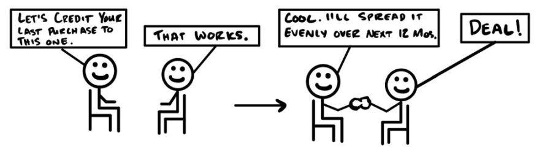

Tháng 6 năm 2014.

Suốt một năm qua, tôi đã triển khai chương trình "Ưu đãi Hoàn tiền" (Ưu đãi Thu hút số 1) tại phòng gym của mình. Đó là một gói tập thể hình trị giá $600, nơi các hội viên có thể nhận lại toàn bộ tiền - nếu họ đạt được mục tiêu đề ra. Chương trình này cực kỳ thành công. Tôi đã bán được rất nhiều gói như vậy.

Nhưng có một vấn đề nảy sinh. Những phòng gym hoạt động tốt thường có nguồn doanh thu định kỳ dồi dào. *Còn tôi thì không có gì cả*. Hầu hết những người thắng cuộc đều dùng $600 đó để đổi lấy ba tháng thẻ hội viên. Nghe thì có vẻ ổn. Nhưng rồi họ rời đi ngay trước khi phải tự bỏ tiền túi ra đóng kỳ tiếp theo. Vậy nên, về cơ bản là tôi đã bán gói "mua sáu tuần, tặng ba tháng miễn phí". Và sau đó, họ rời đi. Điều này thì không ổn chút nào.

Khoản $600 đó là nguồn thu nhập duy nhất của tôi. Vì vậy, mặc dù lôi kéo được rất nhiều người đến phòng tập, doanh thu của tôi vẫn bắt đầu từ con số không mỗi tháng. Thật sự rất áp lực. Tôi phải tìm ra cách tốt hơn để thúc đẩy lợi nhuận.

Đúng lúc đó, Justin, một người bạn của tôi, đăng tin về việc anh ấy vừa có thêm cả trăm hội viên mới vào nguồn doanh thu định kỳ của mình. Anh ấy cũng thu hút khách hàng bằng chương trình "Ưu đãi Hoàn tiền". Nhưng có một điểm khác biệt: khách hàng của tôi thì bỏ đi, còn khách của anh ấy thì tiếp tục chi tiền. Thế là tôi tự đề nghị đến "do thám" anh ấy. Justin hoàn toàn thoải mái với việc đó. Tôi đã ở đó hai ngày. Anh ấy và tôi có vài cách vận hành khác nhau, nhưng chẳng có gì giải thích được tại sao anh ấy lại làm tốt hơn tôi nhiều đến thế.

"Có nhiều người thắng được tiền lắm không?"

"Có chứ," anh ấy trả lời.

"Vậy ông giải quyết thế nào với toàn bộ khoảng thời gian miễn phí mà ông phải tặng cho họ?"

"Thời gian miễn phí á? Ha! Tôi chỉ việc chuyển số tiền thắng cuộc đó vào gói hội viên dài hạn một năm luôn."

"Cái gì cơ?"

"Đúng vậy—chúng tôi phải làm thế để có thể dàn trải số tiền đó ra."

"Dàn trải tiền? Ông đang nói cái gì thế?"

"Thật luôn hả? Chẳng lẽ...ông trả hết sạch ngay từ đầu à?" Anh ấy chẳng đợi tôi trả lời. "Chúng tôi chỉ giảm cho họ 50 đô mỗi tháng trong vòng một năm thôi."

"Vậy là dù họ thắng và được hoàn tiền, họ vẫn bắt đầu trả phí ngay lập tức?"

"Dĩ nhiên rồi. Tôi đâu có muốn mọi người không trả tiền. Kiểu kinh doanh gì mà lại không có khách hàng trả phí chứ??" Anh ấy cười lớn. "Họ vẫn nhận lại được tiền của mình mà...chỉ là mất một năm thôi."

Bùm. Chính là nó. Mắt xích còn thiếu trong Mô hình Kiếm tiền của tôi.

****

Chỉ một điều này thôi, chiến thuật "Chuyển đổi để Bán thêm" (Rollover Upsell), đã thay đổi cuộc đời tôi, cuộc đời của hàng ngàn chủ phòng gym, và cả cuộc sống của khách hàng chúng tôi nữa. Rollover Upsell đã thay đổi mọi thứ.

Giờ đây, thay vì cứ *hy vọng* khách hàng sẽ chi tiền lần nữa, tôi chuyển chi phí của món đồ họ vừa mua *sang món đồ tiếp theo*. Và khi kết hợp với những lời đề nghị đắt tiền hơn, lợi nhuận trong 30 ngày sẽ tăng vọt.

Và mặc dù tôi học được chiêu Rollover Upsell này thông qua chương trình thu hút Hoàn tiền, bạn không nhất thiết phải cần đến chương trình đó mới dùng được nó. <u>Bạn có thể dùng Rollover Upsell với bất kỳ ai, cho bất kỳ thứ gì.</u> (Thậm chí là cả những thứ người ta đã mua ở những doanh nghiệp khác... ha ha ha).

### Mô tả

Rollover Upsell là việc ghi nhận một phần hoặc toàn bộ số tiền khách hàng đã mua trước đó vào lời đề nghị tiếp theo của bạn. Và theo kinh nghiệm của tôi - điều này giúp tỷ lệ khách hàng đồng ý *cao hơn rất nhiều*. Vậy nên, một khi đã biết nên tặng bao nhiêu tín dụng (credit), tôi sẽ xác định tiếp ba thứ: *ai* là người để bán thêm, bán thêm *cái gì*, và chuyển đổi khoản tín dụng đó *như thế nào*.

<u>Về đối tượng</u>, tôi sử dụng Rollover Upsell trong bốn tình huống:
* Thứ nhất, để kết nối lại với những khách hàng đã rời đi từ lâu.
* Thứ hai, để "giải cứu" những khách hàng đang khó chịu như một phương án thay thế tốt hơn cho việc hoàn tiền.
* Thứ ba, để "giải cứu" những khách hàng đang khó chịu của *người khác*.
* Thứ tư, để bán thêm cho những khách hàng thường xuyên.

<u>Về sản phẩm (the what)</u>, hãy nhớ rằng bạn có thể bán thêm chính thứ họ vừa mua với số lượng nhiều hơn, hoặc một thứ gì đó tốt hơn, hoặc một thứ mới mẻ và khác biệt. Để kiếm được tiền: Hãy chuyển số tiền tích lũy của họ sang một thứ gì đó đắt tiền hơn.

<u>Về cách thức (the how)</u>, bạn có thể áp dụng toàn bộ hoặc một phần khoản giảm giá ngay lập tức, hoặc dàn trải nó theo thời gian.

### Các ví dụ về Rollover Upsell

**Bác sĩ chỉnh hình:** Kết nối lại với bệnh nhân cũ bằng chiến dịch "Winback" (Tìm lại khách hàng) 
<u>Đối tượng:</u> Những khách hàng đã không mua hàng trong vòng sáu tháng. 
<u>Sản phẩm:</u> Liệu trình mới. 
<u>Cách thức:</u> Giảm trừ ngay lập tức. 
Hãy liên hệ với các bệnh nhân cũ. Xem lại lịch sử mua hàng của họ. Đề nghị áp dụng một phần hoặc toàn bộ số tiền họ đã trả trong quá khứ vào một dịch vụ đắt tiền hơn thứ họ từng mua. 
Ví dụ: *"Chào bà Banks, tôi muốn hoàn lại tiền cho bà, bà có rảnh một chút không? Tuyệt quá. Tôi muốn hỏi thăm tình hình đau lưng của bà dạo này thế nào rồi? Ồ, thật tiếc khi nghe vậy. Thôi thì, tôi có một tin vui đây. Thay cho lời cảm ơn, tôi muốn tặng lại bà 500 đô từ số tiền bà đã đóng trước đây để sử dụng cho liệu trình giúp bà hết đau vĩnh viễn. Bà có quan tâm không? Tuyệt vời... để tôi xếp lịch cho bà nhé..."*

**Nha sĩ:** Giải cứu khách hàng đang khó chịu của chính mình bằng Rollover Upsell 
<u>Đối tượng:</u> Khách hàng đang khó chịu. 
<u>Sản phẩm:</u> Tẩy trắng răng. 
<u>Cách thức:</u> Tặng ngay 200 đô vào tài khoản tích lũy. 
Khách hàng trả 200 đô để lấy cao răng nhưng cảm thấy răng mình chẳng trắng hơn tí nào. Chúng ta giải thích rằng họ cần làm nhiều bước hơn để đạt kết quả và mời họ nâng cấp lên gói tẩy trắng răng chuyên sâu (bao gồm nhiều buổi điều trị, bộ dụng cụ tại nhà và nhiều lần vệ sinh sâu). Bạn đề nghị lấy 200 đô họ đã trả cho việc lấy cao răng để trừ thẳng vào gói tẩy trắng này.

**Phần mềm:** Giải cứu (*Khụ khụ* Cướp) khách hàng đang khó chịu của đối thủ 
<u>Đối tượng:</u> Khách hàng của đối thủ cạnh tranh. 
<u>Sản phẩm:</u> Hợp đồng dịch vụ. 
<u>Cách thức:</u> Ghi nhận chi phí phá vỡ hợp đồng cũ. 
Bạn tìm những khách hàng đang không hài lòng với đối thủ và ghi nhận các khoản họ đã mua bên đó thành tiền tích lũy cho một đơn hàng mới bên bạn. Hãy chuyển số tiền họ đang nợ bên kia thành khoản ưu đãi để họ ký một hợp đồng dài hạn hơn với bạn.

Ví dụ: *"Chào John, tôi có thấy đánh giá không tốt của anh về sản phẩm của bên họ và tôi thực sự lấy làm tiếc. Để bù đắp cho anh, tôi sẽ ghi nhận bất kỳ khoản thanh toán nào anh còn lại bên đó để anh chuyển sang dùng sản phẩm của chúng tôi. Bằng cách này, anh không mất một đồng nào mà lại được hưởng lợi ích ngay từ bây giờ. Anh thấy thế nào, công bằng chứ?"*

**Thẻ hội viên:** Dàn trải lần mua đầu tiên cho một kỳ hạn 
<u>Đối tượng:</u> Khách hàng hiện tại. 
<u>Sản phẩm:</u> Thẻ hội viên 12 tháng. 
<u>Cách thức:</u> Dàn trải khoản thanh toán đầu tiên. 
Một người mua một gói dịch vụ nhỏ hoặc thẻ hội viên ngắn hạn. Ngay khi họ vừa mua, bạn có thể đề nghị áp dụng toàn bộ số tiền đó cho một khoảng thời gian dài hơn—ví dụ như 12 tháng. Tôi có thể thực hiện Rollover Upsell bất cứ lúc nào, nhưng tôi thích làm ngay thời điểm đó hơn. Khi thực hiện, bạn lấy chi phí của lần mua đầu tiên và áp dụng nó như một khoản giảm giá cho hợp đồng dài hạn hơn. Ví dụ: khoản mua đầu tiên trị giá $600 sẽ tương đương với việc giảm giá $50 mỗi tháng trong vòng 12 tháng.

### Các lưu ý quan trọng

**Sử dụng Ưu đãi Rollover để thu hút khách hàng mới.** Ví dụ, bạn chuyển đổi một phần hoặc toàn bộ số tiền khách hàng đã trả cho người khác sang sản phẩm của bạn. Bạn có thể tìm kiếm khách hàng tiềm năng cho việc này bằng cách thu thập thông tin liên hệ từ các đánh giá tiêu cực về sản phẩm (nếu có). Và thế là xong—bạn có ngay một danh sách khách hàng tiềm năng "nóng hổi", những người đang cần thứ bạn có. Thêm một mẹo nữa: Hãy tạo ra một nơi để mọi người có thể phàn nàn về các sản phẩm trong ngành của bạn (bất kỳ nền tảng mạng xã hội nào cho phép để lại bình luận). Sau đó, dùng Rollover Upsell với tất cả bọn họ. Thật là một chiêu " hiểm hóc".

**Thực hiện Rollover Upsell trước khi hoàn tiền.** Điều này đã giúp tôi giữ chân được rất nhiều khách hàng và tiết kiệm được hàng đống tiền. Nếu bạn làm không tốt (này, chuyện đó vẫn xảy ra mà), hãy dùng Rollover cho một lần "làm lại". Và nếu họ muốn một thứ gì đó khác, hãy chuyển đổi khoản mua của họ sang thứ đó.

**Khách hàng cũ vẫn là khách hàng. Hãy bán thêm cho họ.** Hãy tiếp cận những khách hàng cũ (đã hơn 6 tháng kể từ lần mua cuối). Hãy xem họ đã trả bao nhiêu trước đây. Quyết định xem bạn sẵn sàng chuyển đổi bao nhiêu. Và hãy đưa ra lời đề nghị. Hãy thực sự làm điều này. Tôi gọi đây là các "chiến dịch giành lại khách hàng". Tôi đã làm các video cá nhân hóa gửi cho 200 khách hàng cũ, tặng họ khoản tích lũy trị giá $4,000 để họ quay lại. Kết quả là khoảng 20% đã chấp nhận lời đề nghị. Chỉ một ngày quay video đã mang lại cho chúng tôi thêm khoảng $1,900,000 doanh thu hàng năm. Rất xứng đáng.

**Thêm tính cấp bách cho Rollover Upsell. Chỉ áp dụng một lần duy nhất.** Nếu bạn muốn quyết liệt hơn, hãy biến thời điểm bạn đưa ra lời đề nghị thành thời điểm duy nhất để khách hàng nắm bắt. Một lời đề nghị "chỉ có một lần duy nhất trong đời khách hàng". Họ không có cơ hội để "về suy nghĩ thêm". Và đúng vậy, tôi biết họ có thể không ngờ tới điều này. Đó chính là mục đích! Bạn muốn tạo ra sự bất ngờ và thú vị. Vì vậy, nếu họ muốn nhận khoản tích lũy đó, họ phải đồng ý *ngay bây giờ*. Nếu không, cũng chẳng sao cả. Họ vẫn có thể trả đúng giá gốc sau này.

**Cách định giá cho Rollover Upsell.** Để kiếm được tiền từ một lời đề nghị có chiết khấu, bạn phải đảm bảo vẫn còn lợi nhuận sau khi đã giảm giá. Vì tôi ưu tiên việc tạo ra lợi nhuận, tôi thường cố gắng đưa ra lời đề nghị bán thêm với giá trị cao gấp ít nhất bốn lần khoản tích lũy rollover của họ. Như vậy, ngay cả khi tôi áp dụng toàn bộ số tiền của lần mua đầu tiên, mức chiết khấu tối đa cũng chỉ là 25%. Hãy nhớ rằng, quy luật giảm giá luôn hiện hữu: Giảm giá càng sâu thì lợi nhuận trên mỗi đơn hàng càng thấp, nhưng bạn sẽ bán được nhiều đơn hàng hơn.

**Bạn không cần phải tích lũy toàn bộ số tiền của lần mua đầu tiên.** Bạn có thể chọn rollover bao nhiêu tùy ý, dù nhiều hay ít. Tôi thường rollover bất kỳ con số nào mà tôi nghĩ là đủ để khuyến khích họ mua món đồ tiếp theo. Hãy thử nghiệm để tìm ra "điểm chạm" hoàn hảo nhất.

>### Chiến thuật Thẻ Quà Tặng (Gift Card Play) 
>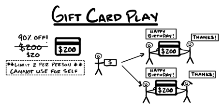 
>**Chiến thuật Thẻ Quà Tặng "Nổi tiếng" của tôi.** Bạn có thể sử dụng Rollover Upsell như một Ưu đãi Thu hút cho cả khách hàng mới *và* khách hàng hiện tại bằng cách quảng cáo thẻ quà tặng giảm giá hơn 90%. Ví dụ: Thẻ Quà tặng trị giá $200 nhưng chỉ bán với giá $20. Giới hạn mỗi khách hàng chỉ được mua hai thẻ và quy định rằng họ *chỉ được dùng để tặng người khác*. Họ mua chúng để làm quà và tặng cho bạn bè của mình. Điều này tạo nên một lời đề nghị tuyệt vời cho các dịp lễ. 
>Khi khách hàng mua thẻ quà tặng, hãy hỏi xem họ muốn tặng cho ai và liệu họ có thể giới thiệu người đó với bạn không. Sau đó, khi người được tặng đến, hãy áp dụng chiến thuật "chuyển đổi" thẻ quà tặng của họ. Hãy đặt giá trị của thẻ quà tặng bằng 20% mức giá của bất kỳ sản phẩm nào bạn muốn bán tiếp theo. Trong ví dụ của chúng ta, chúng ta bán một thẻ quà tặng trị giá $200 với giá $20. Sau đó, hãy áp dụng giá trị $200 đó vào một lời đề nghị có mức giá ít nhất là $1,000. Mọi người đang trả tiền cho bạn để được giới thiệu bạn bè của họ. Điều này thật tuyệt vời. Thêm vào đó, bạn còn có thêm một khoản thu nhập nhỏ từ những thẻ quà tặng không được sử dụng.

### Các điểm tóm tắt

* **Rollover Upsells** (Bán thêm bằng cách chuyển đổi) là việc ghi nhận một phần hoặc toàn bộ số tiền khách hàng đã mua trước đó vào lời đề nghị tiếp theo của bạn.
* Để thực hiện Rollover Upsells, hãy xác định: *ai* là người để bán thêm, bán thêm *cái gì*, và *cách thức* chuyển đổi khoản tích lũy đó như thế nào.
* **Đối tượng bán thêm:** Khách hàng cũ, khách hàng đang khó chịu, khách hàng đang khó chịu của người khác, khách hàng hiện tại.
* **Sản phẩm bán thêm:** Thêm số lượng của một thứ gì đó, một thứ tốt hơn, hoặc một thứ mới mẻ và khác biệt. Chỉ cần đảm bảo bạn vẫn có lợi nhuận sau khi đã áp dụng khoản tích lũy.
* **Cách thức chuyển đổi:** Toàn bộ hoặc một phần giá mua ban đầu. Áp dụng ngay lập tức hoặc dàn trải theo thời gian.
* Định giá lời đề nghị tiếp theo của bạn **cao hơn ít nhất 4 lần** so với khoản tích lũy. Điều này tạo ra mức chiết khấu 25%.
* Để có nhiều người chấp nhận hơn, hãy thêm tính cấp bách. Biến Rollover Upsell của bạn thành một lời đề nghị chỉ xuất hiện một lần duy nhất.

>**QUÀ TẶNG MIỄN PHÍ: Đào tạo về Rollover Upsell** 
>Đây là phương thức bán thêm mà tôi sử dụng thường xuyên nhất. Nó được xây dựng dựa trên sự kết hợp hoàn hảo giữa tính cấp bách đầy tinh tế và thiện chí đối với khách hàng. Tôi đã thực hiện một video hướng dẫn chi tiết về một số kịch bản mẫu để bạn có thể tận mắt chứng kiến cách tôi thực hiện. Nó hoàn toàn miễn phí và không yêu cầu đăng ký thông tin. Hãy xem tại địa chỉ [acquisition.com/training/money](https://acquisition.com/training/money). Tôi có đính kèm mã QR để bạn có thể truy cập nhanh chóng và dễ dàng.

## **Kết luận về Chào hàng Bán thêm (Upsell)**

*Hãy giải quyết vấn đề của người giàu, họ chi trả tốt hơn.*

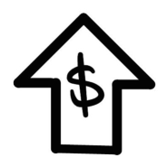

Bất cứ khi nào bạn đưa ra một lựa chọn *tiếp theo*, đó chính là bán thêm (upsell). Bán thêm đóng vai trò then chốt trong các Mô hình Kiếm tiền bằng cách giúp bạn thu về nhiều tiền mặt từ khách hàng *nhanh hơn* so với thông thường. Và nếu "Chào hàng Thu hút" (Attraction Offer) của bạn đã đủ để chi trả cho chi phí tìm kiếm khách hàng và vận hành — thì có thêm nhiều tiền hơn nữa cũng chẳng hại gì.

Tôi đã giới thiệu cho bạn bốn hình thức Bán thêm mạnh mẽ nhất mà tôi thường dùng: Bán thêm Kiểu cổ điển (Classic Upsell), Bán thêm theo Thực đơn (Menu Upsells), Bán thêm Kiểu mỏ neo (Anchor Upsells), và Bán thêm Chuyển tiếp (Rollover Upsells). Chúng là cốt lõi cho thành công trong kinh doanh của tôi. Bán thêm thay đổi mọi thứ. Nhiều doanh nghiệp đã chuyển mình từ tình trạng "đốt tiền" sang "in tiền" — chỉ sau một đêm.

Nhưng, như bạn biết đấy, kinh doanh không phải lúc nào cũng chỉ có màu hồng. Đôi khi, *người ta sẽ nói không*. Điều này dẫn chúng ta đến thành phần tiếp theo của một Mô hình Kiếm tiền 100 triệu đô — Chào hàng Bán thấp (Downsell Offers): *phải làm gì khi họ từ chối...*