# Phần IV: DOWNSELL OFFERS

*Chúng ta sẽ chào hàng cái gì nếu khách hàng nói không*

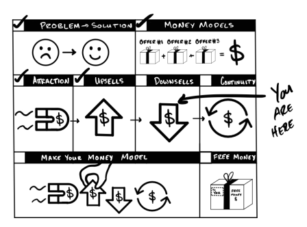

Trong phần trước, chúng ta đã sử dụng các lời Chào hàng Bán thêm (Upsell) để khiến khách hàng mua nhiều thứ hơn. Nếu làm tốt, chúng ta cũng đã thu được lợi nhuận. Thêm một bước tiến nữa! Tuyệt vời... nhưng chuyện gì sẽ xảy ra nếu họ nói không? $\rightarrow$ *Chúng ta sẽ bán thấp (downsell) cho họ.*

Bán thấp là việc tinh chỉnh lời đề nghị ban đầu để tìm ra giải pháp có giá trị cao nhất phù hợp với ngân sách của khách hàng. Vì vậy, bất kỳ lời đề nghị nào bạn đưa ra sau khi ai đó nói "không" đều được coi là bán thấp.

Tôi thực hiện bán thấp theo hai cách: Tôi thay đổi <u>cách họ trả tiền</u> hoặc <u>thứ họ nhận được</u>. Đối với cách họ trả tiền, tôi cân đối giữa số tiền họ trả ngay bây giờ với số tiền họ trả dần theo thời gian. Đối với thứ họ nhận được, tôi thay đổi số lượng, chất lượng hoặc đề xuất một thứ gì đó khác biệt.

Trước tiên, chúng ta sẽ đi qua các quy tắc bán thấp của tôi — *chúng áp dụng cho tất cả các quy trình bán thấp mà tôi thực hiện.* Sau đó, khi đi sâu vào từng kiểu chào hàng cụ thể, bạn có thể bắt tay vào làm ngay và bán thấp chuyên nghiệp như một chuyên gia.

>**Cách KHÔNG Nên Làm Khi Bán Thấp — Câu Chuyện Có Thật Từ Một Người Bạn.**
>
>"Tôi đang đi mua một chiếc xe hơi và anh nhân viên bán hàng cố gắng chào mời gói bảo hiểm xe. Mức giá bảo hiểm ban đầu anh ta đưa ra là 5.000 USD. Tôi từ chối. Ngay sau đó, anh ta hạ giá xuống. Tôi vẫn nói không. Anh ta cứ liên tục hạ giá cho đến khi **chính gói bảo hiểm mà lúc đầu chào giá 5.000 USD** giờ chỉ còn 400 USD! Tôi vẫn nhất quyết từ chối. Lúc đầu tôi nói không vì nó quá đắt, nhưng đến cuối cùng tôi từ chối vì tôi không còn tin gã đó nữa. Toàn bộ trải nghiệm đó mang lại cảm giác thật tệ. Rồi tôi tự hỏi, liệu anh ta có đang 'chặt chém' mình cả tiền mua xe luôn không? Và thế là, tôi cũng chẳng muốn mua xe của anh ta nữa!"
>
>Mọi người thường hạ giá để chốt được đơn hàng. Nhưng ngay cả khi bạn chốt được đơn này, khách hàng sẽ nghi ngờ mọi mức giá bạn đưa ra từ đó về sau... và cả những người mà họ kể lại câu chuyện này cũng vậy. Bạn đang đánh đổi niềm tin lấy một vài đồng bạc. Không đáng đâu.
>
>**Lưu ý:** Bạn có thể chào mời một thứ khác biệt với giá thấp hơn. Bạn chỉ không được phép chào mời **cùng một thứ đó** với giá thấp hơn. Nếu anh ta mời một *gói bảo hiểm khác* với giá rẻ hơn, thay vì mời *cùng một gói đó* với giá thấp hơn, có lẽ anh ta đã giữ được lòng tin của cô ấy và chốt được đơn hàng.

## **Các Quy tắc Bán thấp (Downselling)**

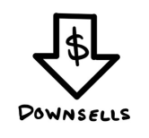

**Hãy nhớ rằng, họ nói Không với Lời đề nghị NÀY, chứ không phải TẤT CẢ các Lời đề nghị.** Đôi khi (thực tế là rất nhiều lần) mọi người sẽ nói không... và điều đó hoàn toàn ổn. Việc họ từ chối *lời đề nghị này* không có nghĩa là họ từ chối *bạn*. Cảm giác bị ai đó khước từ thật chẳng dễ chịu gì, tôi hiểu điều đó. Nhưng hãy nhìn nhận nó đúng như bản chất vốn có — một cơ hội để tìm hiểu xem họ thực sự cần, và kiếm lời từ đó. Thay vì trốn tránh, hãy giữ vững lập trường và đưa ra một lời đề nghị khác. "Không" có nghĩa là không với thứ này, chứ không phải không với mọi thứ.

**Bán thấp là một sự trao đổi.** Khi bán thấp, hãy làm việc với khách hàng để tìm ra sự kết hợp giữa "cho đi" và "nhận lại" cho đến khi cả hai bên cùng khớp ý. *Nếu bạn định cho đi thứ gì đó, hãy nhận lại một thứ gì đó.*

**Cá nhân hóa, đừng gây áp lực.** Hãy tìm hiểu xem họ thích gì và không thích gì. Sau đó, cung cấp nhiều hơn những thứ họ thích và ít đi những thứ họ không thích — với một mức giá tương xứng. Bạn đang cá nhân hóa ở đây. Nếu ai đó từ chối lời mời mua ly soda lớn của tôi, tôi có thể đưa ra các lựa chọn thay thế. Tôi có thể hỏi xem họ muốn một ly nhỏ, một ly nước ép hay một ly cà phê. Tôi có đang gây khó chịu khi hỏi vậy không? Chắc chắn là không. Thực tế, nếu tôi có thể phục vụ họ tốt hơn, thì việc *không* hỏi mới là gây khó chịu.

**Cung cấp cùng một thứ theo những cách mới.** Trong một thế giới lý tưởng, bạn có hàng tấn thứ khác nhau để bán để ai cũng mua một thứ gì đó. Trong thế giới thực, bạn giới hạn việc bán thấp trong những gì bạn đang có. Nếu không, bạn sẽ tạo ra lượng sản phẩm (và rắc rối) tương đương với cả trăm doanh nghiệp. Đó là một lựa chọn ngớ ngẩn. Vì vậy, hãy coi bán thấp giống như trăm cách khác nhau để mời chào những thứ bạn đã có sẵn.

**Đừng hạ giá chỉ để lôi kéo ai đó mua hàng.** Trước hết, hạ giá không thực sự là bán thấp, đó là giảm giá. Nếu ai đó muốn thứ bạn có, nhưng chỉ là không muốn trả mức giá đó — thì thôi vậy. Mặt khác, bạn *có thể* đề nghị họ trả ít hơn *ngay bây giờ* và trả nhiều tiền hơn theo thời gian — một kế hoạch trả góp. Nhưng, dù bạn làm gì, đừng thay đổi giá chỉ để lôi kéo ai đó mua vì...

**Khách hàng hay bàn tán về giá cả.** Bằng mọi giá, hãy thử nghiệm các mức giá. Hãy lên kế hoạch chào bán sản phẩm của bạn ở một mức giá cụ thể, cho một số lượng người cụ thể, *từ trước*. Điều đó khác xa với việc thu tiền ai đó ít đi ngay tại thời điểm đó chỉ vì bạn cảm thấy sợ mất đi đơn hàng ngay lúc đó. Khách hàng có trao đổi với nhau. Nếu họ phát hiện ra ai đó mua cùng một thứ với giá thấp hơn "chỉ vì thích thế" — bạn sẽ làm mọi người tức giận. Và điều đó cũng trở thành một vấn đề đạo đức, ít nhất là đối với tôi. Hãy tránh nó.

## **Tiếp theo...**

Tôi sử dụng ba quy trình bán thấp đơn giản và hiệu quả đến tàn nhẫn:

* Bán thấp bằng Kế hoạch Trả góp (*cách họ thanh toán*)
* Dùng thử có trả phí (Trial With Penalty) (*cách họ thanh toán*)
* Bán thấp bằng Tính năng (Feature Downsells) (*thứ họ nhận được*)

Các quy trình bán thấp này giúp gia tăng lợi nhuận trong 30 ngày lên cao hơn nữa. Chúng thực hiện điều đó bằng cách tạo ra thêm nhiều đơn hàng ngay cả khi khách hàng định nói "không". Và tôi cực kỳ yêu thích chúng bởi vì chỉ với một vài tinh chỉnh nhỏ, bạn có thể áp dụng chúng vào doanh nghiệp của mình và gặt hái thành quả ngay hôm nay.

> **QUÀ TẶNG MIỄN PHÍ: Video Đào tạo về Chào hàng Bán thấp (Downsell)**
>
> Mọi người thường nói không. Đừng bối rối. Hãy tập trung. Bạn cần biết mình sẽ chào mời điều gì tiếp theo. Tôi đã thực hiện một video để trình bày chi tiết chương này cho bạn. Hãy thưởng thức nó miễn phí tại **[acquisition.com/training/money](https://acquisition.com/training/money)**. Tôi có đính kèm một mã QR để bạn truy cập nhanh chóng và dễ dàng.

## **Bán thấp bằng Kế hoạch Trả góp**

*Hôm nay bạn có thể thanh toán trước bao nhiêu?*

---

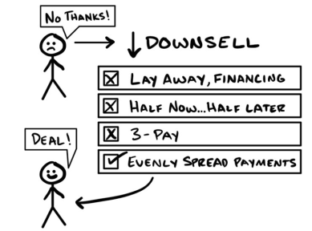

* Khách hàng: "Không, cảm ơn!" $\rightarrow$ **BÁN THẤP (DOWNSELL)**
* Các lựa chọn:
    * [x] Trả góp, Hỗ trợ tài chính
    * [x] Một nửa bây giờ... một nửa sau
    * [x] Chia làm 3 lần thanh toán
    * [x] [v] Chia đều các khoản thanh toán
* Khách hàng: "Chốt!" (Deal!)

---

*Tháng 8 năm 2013.*

Đó là tháng kinh doanh thực sự đầu tiên của tôi. Số tiền tiết kiệm đứng tên tôi chỉ còn đúng bằng một tháng tiền thuê nhà... và tôi chưa bao giờ khiến một người lạ nào chịu đưa tiền cho mình. Giờ đây, tôi phải làm sao để hàng chục người lạ đưa tiền cho mình trong vài tuần tới — chỉ để duy trì cuộc sống cơ bản.

Tuần đầu tiên tôi chỉ có được vài đơn hàng. Nếu cứ tiếp tục như vậy, tôi sẽ sớm bị bỏ đói. Tôi đã gặp ác mộng về việc phải trở về nhà như một kẻ thất bại. Ý nghĩ đó thật không thể chịu đựng nổi. Tôi trở nên tuyệt vọng.

Sáng hôm sau, một khách hàng tiềm năng bước vào và tôi thực hiện bài chào hàng như thường lệ. Cô ấy nói: "Tôi không đủ khả năng chi trả." Bình thường, tôi sẽ bỏ cuộc ngay. Nhưng, tôi thực sự đang rất cần tiền. Vì vậy, trong cơn tuyệt vọng, tôi đã buột miệng hỏi: "Được rồi, vậy khi nào cô nhận lương?"

"Ngày đầu tiên của tháng."

"Được thôi, vậy chỉ cần trả trước một nửa bây giờ, và một nửa khi cô nhận lương."

"Tôi cũng không trả nổi mức đó."

"Được rồi — cô có thực sự muốn tham gia chương trình này không?"

"Có, tôi muốn."

"Vậy nếu cô chia làm ba lần thanh toán và chỉ cần trả trước một phần ba ngay hôm nay thì sao?"

"Tôi vẫn không thể làm được."

"Hừm... Vậy cô *có thể* làm gì?"

"Thú thật là không gì cả. Nhưng tôi có thể thanh toán toàn bộ vào ngày mùng 1."

Tiền thuê nhà của tôi đến hạn vào ngày mùng 5. *Trúng phóc.* "Nghe ổn đấy. Cô cứ đưa thẻ cho tôi, tôi sẽ quẹt vào ngày mùng 2. Như vậy được chứ?"

"Vâng—tuyệt quá!"

Hai tuần sau. Tôi quẹt thẻ. *Và nó đã thành công.* Kế hoạch trả góp đầu tiên trong đời tôi — một thắng lợi rực rỡ. Hallelujah.

***

Bán thấp bằng Kế hoạch trả góp luôn hiệu quả bất kể mức giá có bao nhiêu chữ số không đi chăng nữa. Tôi đã kiếm được hàng chục triệu đô la nhờ chúng và vẫn sử dụng chúng cho đến tận ngày nay. Tuy nhiên, các kế hoạch trả góp cũng giống như một canh bạc. Vì vậy, bạn phải biết cách sử dụng chúng. Tôi biết *cách* dùng và sẽ chỉ cho bạn chính xác phải làm như thế nào.

Các kế hoạch trả góp là một canh bạc vì chúng có thể giúp bạn kiếm tiền theo một cách, nhưng lại có thể khiến bạn mất tiền theo hai cách khác. Chúng giúp bạn kiếm được nhiều tiền hơn khi bạn có thêm nhiều khách hàng và những khách hàng đó hoàn tất việc thanh toán. Chúng khiến bạn kiếm được ít tiền hơn khi mọi người hủy ngang trước khi bạn kịp thu lời. Và bạn sẽ lỗ nặng nhất khi những người vốn dĩ định trả hết một lần lại chọn trả góp — rồi sau đó hủy sớm.

Chương này sẽ giúp tối đa hóa số tiền bạn kiếm được từ các kế hoạch trả góp và tối thiểu hóa số tiền bạn bị mất. Tôi chỉ đặt cược khi biết mình sẽ thắng. Với cuốn cẩm nang này, bạn cũng có thể làm được như vậy.

### **Mô tả**

Khi nhắc đến "bán thấp" (downsell), hầu hết mọi người đều nghĩ đến một số tiền thấp hơn, chất lượng thấp hơn, rẻ hơn, v.v. Cũng hợp lý thôi. Nhưng tôi lại thích bán thấp bằng cách mời chào lại **chính sản phẩm đó** một lần nữa. Tôi biết nghe có vẻ điên rồ, nhưng hãy nghe tôi giải thích đã. Thay vì đưa ra một thứ khác biệt, tôi chia nhỏ chi phí bằng cách thu một phần trước và phần còn lại sẽ thanh toán theo định kỳ. Tôi gọi đây là Bán thấp bằng Kế hoạch Trả góp. Hãy cùng tìm hiểu xem chúng hoạt động như thế nào.

Rất nhiều người từ chối các lời đề nghị vì chúng "quá đắt". Đôi khi đúng là như vậy. Nhưng để đối phó với điều này, các chủ doanh nghiệp và những chuyên gia bán hàng khác thường ngay lập tức giảm giá hoặc bán những thứ rẻ tiền hơn chỉ để khiến khách hàng nói "đồng ý". Tuy nhiên, phần lớn thời gian thì câu "quá đắt" thực sự có nghĩa là **"phải trả trước quá nhiều tiền"**. Nói cách khác, mọi người nghĩ rằng giảm giá có hiệu quả vì khách hàng trả ít tiền hơn cho sản phẩm. Nhưng khi bạn bóc tách vấn đề sâu hơn, lý do thực sự là vì họ phải trả ít hơn **tại thời điểm đó**. Vì vậy, Kế hoạch Trả góp mang lại lợi ích kép: Bạn có thêm nhiều người mua vì khách hàng chi trả ít hơn ngay lúc mua, nhưng chúng cũng thúc đẩy lợi nhuận của bạn vì khách hàng vẫn sẽ trả đủ giá theo thời gian.

Quy trình Bán thấp bằng Kế hoạch Trả góp của tôi gồm tối đa bảy bước. Quy trình này chuyển dịch từ việc nhận được nhiều tiền hơn ở giai đoạn đầu sang nhận được nhiều hơn theo thời gian. Tôi sẽ dừng lại ngay khi họ đồng ý mua. Dưới đây là các bước:

1. Thưởng cho việc thanh toán hết một lần thay vì phạt vì trả góp theo thời gian.
2. Đề xuất hỗ trợ tài chính từ bên thứ ba, thẻ tín dụng, hoặc các lựa chọn trả dần.
3. Đề xuất trả một nửa bây giờ, một nửa sau.
4. Kiểm tra xem liệu họ có còn thực sự muốn món đồ đó không.
5. Đề xuất chia làm ba lần thanh toán.
6. Đề xuất chia đều các khoản thanh toán.
7. Đề xuất dùng thử miễn phí.

Hãy cùng đi sâu vào từng bước theo đúng thứ tự.

### **Ví dụ về Quy trình Bán thấp bằng Kế hoạch Trả góp**

**Bước 1) Thưởng cho việc thanh toán hết thay vì phạt vì trả góp.** Nếu tôi chấp nhận rủi ro từ một kế hoạch trả góp, tôi sẽ tăng giá bán. Các doanh nghiệp thông thường làm điều này bằng cách tính lãi suất. Nhưng tôi thực hiện bằng cách đưa ra một mức **chiết khấu** nếu họ thanh toán toàn bộ ngay lập tức.

Hãy nghĩ về cách các doanh nghiệp thường tính lãi suất — về cơ bản họ sẽ nói... "Giá là 10$ nếu bạn lấy ngay bây giờ, nhưng sẽ là 15$ nếu bạn trả dần vì chúng tôi tính 5$ tiền lãi." Nghe chẳng thú vị chút nào.

Thay vào đó, tôi nói: "Giá là 15$... nhưng chỉ còn 10$ nếu bạn thanh toán trước. Bạn tiết kiệm được 5$... và đó là cách mà hầu hết mọi người thường chọn." Để làm được điều này, tôi trình bày mức giá đã bao gồm lãi suất. Sau đó, tôi đưa ra lựa chọn thanh toán trước như một cách để nhận chiết khấu. Bằng cách này, lời đề nghị trở nên thân thiện hơn và tận dụng được hiệu ứng "mỏ neo giá". Cùng một phép tính, nhưng cảm giác mang lại thì tốt hơn nhiều.

Nếu họ nói không, tôi bắt đầu quá trình bán thấp. Tuy nhiên, tôi vẫn cố gắng để được thanh toán trước qua...

**Bước 2) Đề xuất Hỗ trợ tài chính bên thứ ba, Thẻ tín dụng và Trả góp tích lũy (Layaway).**

* **Hỗ trợ tài chính bên thứ ba:** Điều này có nghĩa là một công ty khác trả tiền cho tôi ngay bây giờ và khách hàng sẽ có một kế hoạch trả góp *với công ty đó*. Các đại lý xe hơi luôn làm điều này. Đại lý nhận được tiền từ công ty tài chính hôm nay, và khách hàng sẽ trả cho công ty đó sau.
    * *Lưu ý:* Cần chút công sức để thiết lập hệ thống tài chính bên thứ ba này, nhưng hoàn toàn xứng đáng.
* **Thẻ tín dụng:** Chỉ cần hỏi: "Bạn muốn tôi quyết định điều khoản thanh toán hay bạn tự quyết định?". Họ sẽ nói họ muốn tự quyết định. Khi đó, tôi bảo họ hãy dùng thẻ tín dụng. Bằng cách đó, tôi nhận được tiền ngay hôm nay và họ có thể trả dần cho công ty thẻ tín dụng. Thật kỳ lạ là cách thay đổi góc nhìn này lại hiệu quả, nhưng đúng là nó có tác dụng. Tôi không phán xét, tôi chỉ thực hiện thôi.
* **Trả góp tích lũy (Layaway):** Có nghĩa là thanh toán hết sản phẩm *trước khi* nhận hàng. Khách hàng có thể trả bao nhiêu đợt tùy thích, trong bất kỳ khoảng thời gian hợp lý nào. Tuy nhiên, họ chỉ nhận được sản phẩm *sau khi* đã thanh toán đủ. Đây là cách linh hoạt nhất cho họ và ít rủi ro nhất cho chúng ta.

Nếu họ nói không với những lựa chọn này, tôi chuyển sang bước 3.

**Bước 3) Đề xuất 'Một nửa bây giờ, Một nửa sau'.** Tôi bắt đầu bằng cách hỏi "Khi nào là kỳ lương tiếp theo của bạn?". Sau đó, tôi hỏi "Bạn có muốn trả trước một nửa hôm nay và phần còn lại khi nhận lương không?". Nếu họ không làm được, tôi hỏi "Số tiền tối đa bạn có thể trả trước hôm nay là bao nhiêu?". Khi họ đưa ra một con số, hãy nói: "Tuyệt vời. Chúng ta sẽ thu số đó hôm nay và phần còn lại khi bạn nhận lương. Như vậy được chứ?". Tôi thích sắp xếp các khoản thanh toán theo kỳ lương vì hầu hết mọi người nhận lương hai tuần một lần. Điều này thúc đẩy lợi nhuận trong 30 ngày tốt hơn nhiều so với thanh toán hàng tháng.

Nếu họ vẫn không thể thực hiện... tôi tạm dừng để đảm bảo họ thực sự muốn món đồ đó.

**Bước 4) Kiểm tra xem họ có còn thực sự muốn món đồ đó không.** Không kế hoạch trả góp nào có thể làm hài lòng một khách hàng không muốn mua sản phẩm. Vì vậy, hãy chắc chắn rằng người đó thực sự muốn món đồ của bạn trước khi dồn thêm công sức bán hàng. Tôi có thể nói kiểu: "Tôi hiểu rồi. Vậy là hiện tại tài chính đang hơi eo hẹp. Nhanh thôi, tôi muốn xác nhận chắc chắn: Trên thang điểm từ 1 đến 10, bạn khao khát thực hiện điều này đến mức nào?". Nếu họ nói từ 8 trở lên, hãy tiếp tục đưa ra các kế hoạch trả góp và nói: "Tuyệt quá. Đừng lo. Chúng ta sẽ tìm cách để điều này diễn ra." Nếu họ nói từ 7 trở xuống, hãy hỏi "Tại sao không phải là 10?" và sau đó nói gì đó đại loại như: "Bạn nói đúng. Tôi nghĩ chúng tôi có thể có một lựa chọn khác phù hợp hơn với bạn." Sau đó, bạn bán cho họ một thứ gì đó khác (Bán thấp bằng tính năng — sẽ trình bày sau).

**Bước 5) Đề xuất chia làm ba lần thanh toán.** Nếu họ trả lời từ 8-10 điểm trên thang đo, tôi bán thấp từ mức trả trước một nửa xuống còn một phần ba. Tôi đưa ra lựa chọn trả làm ba lần: 1/3 ngay bây giờ và 1/3 vào hai kỳ lương tiếp theo — hoặc — 1/3 bây giờ và 1/3 trong hai tháng tới.

**Bước 6) Đề xuất chia đều các khoản thanh toán.** Nếu họ vẫn không xoay xở được, tôi chia đều các khoản thanh toán trong suốt thời gian họ sử dụng dịch vụ. Ví dụ, chương trình Gym Launch kéo dài 16 tuần, nên tôi thu phí họ mỗi tuần (tổng cộng 16 lần). Nếu điều đó vẫn gây khó khăn, tôi chuyển sang bước 7.

**Bước 7) Đề xuất Dùng thử miễn phí.** Tôi cung cấp các bản dùng thử miễn phí theo một cách đặc biệt. Vì vậy, tôi đã dành riêng chương tiếp theo cho nội dung này. Nhưng, quá trình bán hàng kết thúc tại đây. Ít nhất là cho đến lúc này.

Quy trình Bán thấp bằng Kế hoạch Trả góp này có thể tạo ra tới chín lời chào hàng. Và nếu bạn nghĩ điều đó nghe thật điên rồ, thì có lẽ bạn đang kiếm được ít tiền hơn và phục vụ ít khách hàng hơn mức bạn có thể đấy.

### **Những Lưu Ý Quan Trọng**

**Bán thấp kiểu "Bập bênh" (Seesaw Downselling).** Nếu bạn muốn quy trình ít bước hơn, hoặc nhân viên bán hàng của bạn chưa có nhiều kinh nghiệm, bạn có thể áp dụng cách này. Thay vì hỏi xin toàn bộ số tiền, hãy hỏi: *"Bạn muốn thanh toán những khoản hàng tháng khổng lồ hay những khoản nhỏ xíu?"*. Họ sẽ chọn nhỏ xíu. Lúc đó bạn hãy nói: *"Bình thường nó có giá là XXX. Nhưng nếu bạn trả trước toàn bộ hôm nay, bạn sẽ được giảm giá cực sâu và không phải lo trả tiền hàng tháng nữa. Thấy sao?"*. Cách này biến kế hoạch trả góp thành một thứ gì đó tiêu cực và làm nổi bật lợi ích của việc thanh toán trước.

Sau đó, nếu họ nói vẫn không đủ khả năng chi trả, hãy nói rằng họ trả trước càng nhiều thì tiền trả góp hàng tháng càng thấp. *"Nếu bạn không thể thanh toán hết ngay lúc này, tôi hoàn toàn hiểu. Chúng ta sẽ điều chỉnh khoản trả trước cho đến khi đạt được mức trả hàng tháng mà bạn thấy thoải mái."*. Điều này vẫn khuyến khích khách hàng trả trước nhiều hơn để giảm nợ hàng tháng. Nếu họ vẫn nói không, hãy hỏi xem họ có còn muốn sản phẩm không. Nếu có, hãy kéo ghế sang phía họ và cùng họ xem xét các lựa chọn. Cuộc bán hàng lúc này trở thành một nỗ lực của cả một đội ngũ. Rất thẳng thắn và minh bạch.

**Kế hoạch Trả góp có sẵn tính năng Bán thêm:** Hãy định kỳ đưa ra đề nghị hưởng mức chiết khấu "thanh toán hết một lần" ban đầu ngay trong quá trình họ đang trả góp. Nếu họ tất toán số dư còn lại, họ vẫn có thể nhận được mức 'chiết khấu trả trước' đó. Cách này hoạt động cực kỳ hiệu quả. Khách hàng thường quên rằng họ có lựa chọn này. Vì vậy, khi chúng ta gợi nhắc, một số người sẽ nắm bắt ngay cơ hội. Ngoài ra, hãy dành cho nhân viên bán hàng của bạn mức thưởng tương tự khi họ giúp khách tất toán số dư để khuyến khích việc chăm sóc khách hàng. Và hãy nhớ, nếu bạn cho mọi người lựa chọn trả chậm, họ sẽ trả chậm. Nếu bạn khuyến khích họ trả nhanh, họ sẽ trả nhanh. Vì vậy, nếu muốn họ trả nhanh hơn, hãy cho họ một lý do chính đáng.

**Giảm thiểu tỷ lệ thanh toán bị từ chối.** Hãy khớp lịch thanh toán với lịch nhận lương của khách hàng. Nếu bạn thu tiền vào đúng ngày họ có lương, khả năng họ thanh toán thành công sẽ cao hơn. Ngoài ra, tiền lương của mỗi người được chuyển vào những thời điểm khác nhau, nên nếu lần đầu bị từ chối, hãy thử quét lại vài lần trong ngày hôm đó. Tôi đã học được chiến thuật này từ John (người cố vấn đầu tiên của tôi). Tôi thường thu hồi được 1/3 số khoản thanh toán bị từ chối nhờ thêm vào quy trình nhỏ này.

**Cách để đảm bảo Kế hoạch Trả góp mang lại tiền cho bạn.** Sau khi triển khai trả góp, tỷ lệ chốt đơn của bạn chắc chắn phải tăng lên. Nhưng, nếu số lượng người thanh toán hết một lần (paid-in-full) giảm xuống, bạn đang gặp vấn đề đấy. Bạn vừa đẩy những người vốn định trả hết sang kiểu trả góp! Vì vậy, mục tiêu của bạn là **chốt được nhiều cuộc hẹn hơn tính trên tổng số, nhưng vẫn giữ nguyên tỷ lệ phần trăm những cuộc hẹn thanh toán hết một lần.**

* **Ví dụ:** Nếu tôi nói chuyện với 10 khách hàng tiềm năng, tôi có thể bán được cho 3 người. Nếu tôi có thêm bước bán thấp, tôi có thể bán thêm cho 3 người nữa (tổng cộng là 6). Như vậy, trong kịch bản thứ hai, tôi vừa có tiền mặt trả trước từ 3 người đầu tiên, vừa có các khoản thanh toán dần từ 3 người sau. Điều này đảm bảo việc bán thấp thực sự làm tăng lợi nhuận trong 30 ngày của bạn.

**Một lý do khác để bắt đầu với mức giá Cao trước khi giảm dần.** ProfitWell (một công ty quản lý thuê bao) đã báo cáo dữ liệu về tỷ lệ khách hàng rời bỏ (churn) từ 14.000 doanh nghiệp. Họ đã phát hiện ra một viên ngọc quý: Ở tất cả các loại hình kinh doanh, nhịp độ thanh toán đều ảnh hưởng đến tỷ lệ rời bỏ hàng tháng.

* **Thanh toán Hàng tháng** (12 lần/năm): Tỷ lệ hủy là **10,7%** mỗi tháng.
* **Thanh toán Hàng quý** (4 lần/năm): Tỷ lệ hủy là **5%** mỗi tháng.
* **Thanh toán Hàng năm** (1 lần/năm): Tỷ lệ hủy chỉ còn **2%** mỗi tháng.

Tôi đã trình bày giá cả theo thứ tự từ nhiều tiền mặt trả trước nhất đến ít nhất. Hóa ra cách này cũng khiến khách hàng trở nên giá trị hơn trong dài hạn. Vì vậy, hãy **bắt đầu cao** (ít đợt thanh toán nhưng số tiền mỗi đợt lớn hơn) rồi mới **giảm dần xuống.**

**Cốt lõi là:** Thay đổi cách khách hàng thanh toán có thể tạo ra sự khác biệt cực lớn trong việc họ sẽ gắn bó với bạn bao lâu. Chúng ta sẽ đi sâu hơn về tính bền vững và tỷ lệ rời bỏ trong Phần V: Chào hàng duy trì (Continuity Offers).

### **Các Điểm Tóm Tắt**

* **Bán thấp bằng Kế hoạch Trả góp** giúp chia nhỏ chi phí sản phẩm bằng cách thu một phần trước và phần còn lại thanh toán theo các đợt định kỳ.
* **Kế hoạch Trả góp** thu hút thêm nhiều người mua giống như hình thức giảm giá, nhưng cũng có thể thúc đẩy lợi nhuận vì khách hàng đồng ý trả đủ giá theo thời gian.
* Kế hoạch Trả góp chỉ giúp doanh nghiệp phát triển nếu bạn có thêm nhiều khách hàng và những khách hàng đó thực sự thực hiện việc thanh toán.
* **Bước 1)** Trình bày mức giá đầy đủ, sau đó đưa ra mức chiết khấu nếu họ thanh toán hết một lần.
* **Bước 2)** Đề xuất hỗ trợ tài chính bên thứ ba, sau đó đến lựa chọn dùng thẻ tín dụng, và cuối cùng là trả góp tích lũy (layaway).
* **Bước 3)** Chia khoản thanh toán làm hai. Lên lịch vào đúng ngày họ nhận lương.
* **Bước 4)** Hỏi xem họ có còn muốn sản phẩm không trên thang điểm từ 1–10. Bạn cần mức điểm từ 8 trở lên.
* **Bước 5)** Chia khoản thanh toán làm ba. Lên lịch theo ngày nhận lương hoặc theo tháng.
* **Bước 6)** Lên lịch các khoản thanh toán bằng nhau trong một khoảng thời gian nhất định.
* **Bước 7)** Đề xuất dùng thử miễn phí để đổi lấy việc khách hàng để lại thông tin thẻ. Nội dung này sẽ được trình bày ở chương tiếp theo.
* **Bán thấp kiểu "Bập bênh"** chuyển dịch dần dần từ thanh toán toàn bộ sang các khoản thanh toán bằng nhau.
* **Bán thêm trong kế hoạch trả góp:** khách hàng sẽ nhận được mức giá chiết khấu ban đầu nếu họ tất toán số dư ngay hôm nay.
* **Khớp lịch thanh toán với lịch nhận lương** để giảm thiểu tỷ lệ các khoản thanh toán bị từ chối.

Sau tất cả những bước này, nếu ai đó *vẫn* từ chối thanh toán bất kỳ khoản nào, thì chúng ta sẽ đề xuất cho họ một bản Dùng thử Miễn phí để đổi lấy thông tin thẻ của họ. Nhưng đó không phải là một bản Dùng thử Miễn phí thông thường. Tôi thực hiện nó theo một cách rất đặc biệt mà tôi đã mất nhiều năm để hoàn thiện. Đó là nội dung tiếp theo của chúng ta. Bạn sẽ thích nó cho xem.

---

> **QUÀ TẶNG MIỄN PHÍ: Video Đào tạo về Chào hàng Bán thấp (Downsell)**
>
> Các kế hoạch trả góp được thiết kế đúng cách hầu như luôn giúp bạn có nhiều đơn hàng và nhiều tiền hơn. Tôi đã tự ghi hình lại cảnh mình thực hiện các bước giảm dần này để bạn có thể mô phỏng theo cho bất cứ thứ gì bạn đang bán. Đối với những bạn thích học qua nhiều định dạng khác nhau (điều mà tôi rất khuyến khích), bạn có thể xem video tại **[acquisition.com/training/money](https://acquisition.com/training/money)**. Tôi có đính kèm một mã QR để bạn truy cập nhanh chóng và dễ dàng.

## **Dùng thử có điều kiện (Trial With Penalty)**

*Nếu bạn làm X, Y, Z, tôi sẽ để bạn bắt đầu miễn phí.*

---

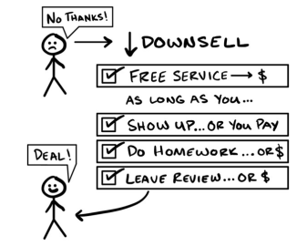
* **Người từ chối:** "Không, cảm ơn!"
* **Mũi tên xuống:** ↓ **BÁN THẤP HƠN (DOWNSELL)**
* **Hộp nội dung:**
    * ☑ DỊCH VỤ MIỄN PHÍ $\rightarrow$ $
    * **MIỄN LÀ BẠN...**
    * ☑ CÓ MẶT... HOẶC BẠN PHẢI TRẢ TIỀN
    * ☑ LÀM BÀI TẬP... HOẶC TRẢ TIỀN $    
    * ☑ ĐỂ LẠI ĐÁNH GIÁ... HOẶC TRẢ TIỀN$
* **Người đồng ý:** "Chốt đơn!" (DEAL!)

---

*Mùa xuân 2018.*

Gym Launch đang mở rộng quy mô một cách chóng mặt. Với quân số đã lên tới 100 nhân viên và còn tiếp tục tăng, Leila (bạn gái của alex - chú thích của người dịch) cần một giải pháp nhân sự (HR) tốt hơn để quản lý tất cả. Sau nhiều tháng liên hệ với những công ty HR tiềm năng, cô ấy đã tìm thấy một bên mình ưng ý. Và trước sự ngạc nhiên của tôi, công ty đó chẳng có gì quá đặc biệt — trông họ cũng giống hệt bao bên khác thôi.

"Ừ thì phần mềm của họ cũng phức tạp thật," cô ấy nói. "Nhưng họ thuyết phục được em."

"Thật sao? Họ làm cách nào hay vậy?"

"Họ đưa ra một lời đề nghị dùng thử với một cách tiếp cận khá lạ. Cực kỳ thông minh luôn."

"Họ đề nghị gì thế?"

"Họ nói rằng nếu em tham gia buổi đào tạo của họ, em sẽ được miễn phí toàn bộ chi phí triển khai ban đầu. Nhưng nếu em bỏ lỡ buổi đào tạo, em sẽ phải trả tiền cho nó!"

"Vậy em đã làm gì?"

"Dĩ nhiên là em đi đào tạo rồi."

"Nghĩa là họ giữ thông tin thẻ tín dụng của em, em đi đào tạo — và thế là em không phải trả phí triển khai?"

"Chính xác!" cô ấy mỉm cười đắc ý. "Và giờ tôi còn thực sự biết cách sử dụng cái phần mềm phức tạp đó nữa chứ."

*Khoảnh khắc bừng tỉnh.*

"Khoan đã... ý em là em đã từ chối. Sau đó, họ đã đưa ra một lựa chọn *bán thấp hơn (downsell)* là dùng thử miễn phí, với điều kiện là họ có thể *phạt* em nếu em *không* sử dụng nó?"

"Cơ bản là vậy. Ý em là, điều đó rất hợp lý. Nó buộc em phải học cách dùng, và giờ em chẳng muốn tốn công học mấy cái phần mềm phức tạp của bên nào khác nữa... thế nên chúng em quyết định gắn bó với họ luôn!"

"Em nói đúng. Cách đó thông minh thật sự."

***

Công ty phần mềm đó đã sử dụng chiến lược *Dùng thử có phạt (Trial With Penalty)* như một *Lời chào mời thu hút (Attraction offer)* — nhưng tôi thì thích dùng nó để *downsell* sau khi khách dùng thử hơn. Nghĩa là, tôi chỉ bán thấp xuống mức dùng thử này nếu họ nói "không" với lời đề nghị đầu tiên của tôi. Và nếu bạn làm theo cách tôi sắp chỉ cho bạn, nó chỉ thay đổi số tiền họ phải trả *hôm nay* — chứ không thay đổi tổng số tiền họ phải trả.

### **Mô tả**
Trong lời đề nghị *Dùng thử có phạt*, khách hàng có thể dùng thử sản phẩm hoặc dịch vụ của bạn miễn phí *miễn là họ đáp ứng các điều khoản của bạn*. Để so sánh, các lời đề nghị *Hoàn tiền khi đạt mục tiêu* (Lời chào mời thu hút số 1) cho khách hàng cơ hội nhận lại tiền *nếu* họ đáp ứng các điều khoản. Còn trong *Dùng thử có phạt*, khách hàng chỉ phải trả tiền nếu họ *không* đáp ứng các điều khoản.

Lý tưởng nhất, các điều khoản này nên là những hành động giúp tạo ra một khách hàng tuyệt vời. Vì vậy, chúng sẽ phản chiếu những hành động và kết quả mà bạn sử dụng trong lời đề nghị *Hoàn tiền khi đạt mục tiêu*. Nhưng lần này, chúng ta sử dụng tâm lý *tránh bị mất phí* (thay vì được nhận lại tiền) để khuyến khích họ tuân thủ.

Vì vậy, *Dùng thử có phạt* không phải là kiểu "đây là sản phẩm của tôi—cứ xem thử bạn có thích không." Mà nó là: "đây là sản phẩm của tôi, bạn sẽ được dùng miễn phí *miễn là bạn thực hiện những việc này*... điều giúp bạn trở thành một người cực kỳ phù hợp cho lời đề nghị tiếp theo của tôi. Và nếu bạn không làm, thì lúc đó bạn phải trả tiền cho nó."

Để thực hiện bước *downsell* bằng hình thức *Dùng thử có phạt*, bạn phải cân nhắc xem họ cần làm gì để tránh bị mất phí và bạn sẽ tính phí họ như thế nào. Thông thường, bạn sẽ có một nhóm khách hàng chốt ngay lời đề nghị chính. Vậy nên, hãy đưa ra lời đề nghị đó trước. Với những người còn lại, bạn sẽ thu hút họ bằng bước *downsell* này. Giả sử bình thường bạn chốt được 3 trên 10 người cho *Lời chào mời thu hút*. Và giờ bạn bán thêm cho 4 người nữa thông qua *Dùng thử có phạt*. Sau đó, khi giai đoạn dùng thử kết thúc, bạn bán thêm (upsell) được cho 3 người trong số đó. Bạn đã đi từ 3 đơn hàng lên thành 6 đơn hàng—gấp đôi lượng khách hàng của mình! Nếu bạn chỉ có duy nhất một lời đề nghị, bạn sẽ mất tất cả những người nói "không". Việc bán thấp hơn (downsell) bằng hình thức dùng thử có điều kiện phạt cho mọi người thêm một cơ hội nữa để đồng ý.

Tôi vẫn thấy tiếc cho *hàng ngàn* khách hàng mà mình đã đánh mất qua các chương trình dùng thử miễn phí trong suốt nhiều năm trước khi học được điều này. Nhưng giờ đây chúng ta có thể giữ chân họ! Chiến lược "Dùng thử có phạt" sẽ giúp bạn làm được điều đó.

### **Các ví dụ**

**Lời đề nghị dành cho khách hàng cá nhân (B2C): Lộ trình 28 ngày loại bỏ thói quen xấu**

* Để được dùng thử miễn phí (và tránh bị phạt phí), bạn phải...
* Tham gia đầy đủ tất cả các cuộc gọi tư vấn.
* Đăng tiến độ của bạn vào nhóm mỗi tuần một lần.
* Viết nhật ký hàng ngày trên ứng dụng của chúng tôi.
* Tham gia các buổi phản hồi và các buổi chuyển đổi (đây chính là—cơ hội để bán thêm/upsell).

**Lời đề nghị dành cho khách hàng doanh nghiệp (B2B): Thử thách 5 ngày tìm kiếm 5 khách hàng đầu tiên**

* Để được dùng thử miễn phí (và tránh bị phạt phí) bạn phải...
* Gửi 100 tin nhắn tiếp cận khách hàng mỗi ngày.
* Báo cáo các chỉ số về số tin nhắn đã gửi.
* Tham gia buổi đào tạo hàng ngày.
* Đăng bài vào nhóm hàng ngày sau khi đã hoàn thành bài tập.
* Tham gia lễ tốt nghiệp của bạn (cơ hội để bán thêm/upsell).

**Phần mềm: Miễn phí toàn bộ chi phí triển khai hệ thống ban đầu trị giá $500 cho phần mềm nhân sự, sau đó là $99 mỗi tháng**

* Dùng thử có phạt: Bạn không phải trả trước $500, nhưng bạn phải...
* Tham gia quá trình triển khai (Onboarding), bao gồm ba cuộc gọi qua Zoom kéo dài 60 phút (cơ hội để bán thêm/upsell).
* Làm bài tập về nhà.
* Kích hoạt hồ sơ nhà tuyển dụng của bạn.
* Hoàn tất thiết lập cho nhân viên của bạn trước khi kết thúc cuộc gọi thứ ba.

*Nếu không, bạn sẽ phải trả khoản phí đó.*

### **Các lưu ý quan trọng**

**Những gì họ được nhận miễn phí và những gì họ phải làm để tránh bị mất phí.** Bạn sẽ cần biết các điều khoản dịch vụ của mình là gì. Những phần có giá trị sẽ là lời đề nghị cơ bản của bạn (giống như Lời đề nghị mồi nhử - Decoy Offer) hoặc lời đề nghị "Hoàn tiền khi đạt mục tiêu" của bạn. Cả hai đều hiệu quả. Tôi khuyên bạn nên cho đi nhiều hơn là bỏ bớ đi — nếu bạn có khả năng chi trả. Các tiêu chí đưa ra nên giúp kích hoạt và giữ chân khách hàng. Bạn có thể sao chép trực tiếp các tiêu chí này từ chiến lược "Hoàn tiền khi đạt mục tiêu" — Lời chào mời thu hút số 1.

**Chia nhỏ phí so với Thu một khoản phí trọn gói.** Giả sử bạn có một sản phẩm trị giá $500 với mười việc cần làm. Tôi thà thu phí $50 cho mỗi lần họ vi phạm, còn hơn là thu một khoản phí $500 ngay lần mắc lỗi đầu tiên. Mặt khác, nếu việc vi phạm một lần thực sự gây ảnh hưởng lớn đến thành công của họ, bạn sẽ muốn mức phí phản ánh đúng điều đó. Tôi đã thấy cả hai cách đều hiệu quả.

---

**Cách thức bán thấp hơn (Downsell) chương trình dùng thử.** Dưới đây là sơ đồ minh họa cách tôi thực hiện downsell chiến lược "Dùng thử có phạt" qua năm bước.

**(1) SỬ DỤNG DÙNG THỬ MIỄN PHÍ NHƯ MỘT BƯỚC DOWNSELL**

>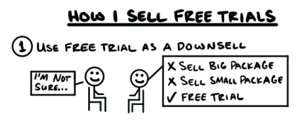
>
>* **Khách hàng:** "Tôi không chắc lắm..."
>* **Người bán:** 
>    * ~~BÁN GÓI LỚN~~
>    * ~~BÁN GÓI NHỎ~~
>    * **✓ DÙNG THỬ MIỄN PHÍ**

**Đưa ra lời đề nghị dùng thử cuối cùng.** Nếu ai đó nói rõ rằng họ không muốn lời đề nghị đầu tiên của bạn, hãy downsell xuống mức "Dùng thử có phạt". Câu nói nghe sẽ kiểu như: *"Hừm... đúng là một tình huống khó xử. Tôi bảo này. Hay là chúng ta cứ để bạn bắt đầu miễn phí nhé, bạn thấy sao? Chúng tôi sẽ giúp bạn một tay, và nếu bạn thích, bạn có thể ở lại. Cho tôi mượn giấy tờ tùy thân của bạn để chúng ta bắt đầu quy trình — như vậy công bằng chứ?"*

**(2) LUÔN LUÔN YÊU CẦU THẺ TÍN DỤNG**

>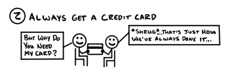
>
>* **Khách hàng:** "Nhưng tại sao anh lại cần thẻ của tôi?"
>* **Người bán:** *(Nhún vai)* "Đó chỉ là cách mà chúng tôi vẫn luôn làm từ trước đến nay thôi..."

**Luôn luôn yêu cầu thẻ tín dụng.** Ghi lại thông tin của họ, giữ giấy tờ tùy thân và ra hiệu yêu cầu thẻ tín dụng của họ trong khi nói: *"Bạn muốn sử dụng thẻ nào?"* <u>Họ bắt buộc phải để lại thông tin thẻ.</u> Nếu họ lưỡng lự, chỉ cần nói: *"Đó là quy trình xưa nay của chúng tôi rồi."* Nếu họ vẫn từ chối, hãy chúc họ một ngày tốt lành và tiễn khách.

> **Mẹo chuyên gia:** Nếu ai đó không đồng ý để lại thẻ *và* không cam kết làm việc, tôi sẽ không bán cho họ. Những người đó thường phàn nàn nhiều hơn và tỷ lệ chuyển đổi thấp hơn. Không đáng để chuốc lấy rắc rối.

**(3) THIẾT LẬP KỲ VỌNG VỀ VIỆC GẮN BÓ & TRẢ PHÍ**

>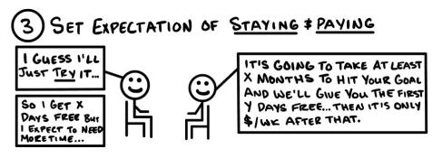
>
>* **Khách hàng:** "Tôi đoán là tôi sẽ chỉ **thử** thôi..."
>* **Người bán:** "Sẽ mất ít nhất X tháng để đạt được mục tiêu của bạn và chúng tôi sẽ tặng bạn Y ngày đầu miễn phí... sau đó phí sẽ chỉ là $/tuần."
>* **Khách hàng:** "Vậy là tôi được dùng X ngày miễn phí nhưng tôi nghĩ mình sẽ cần thêm thời gian..."

**Luôn bán sự gắn bó và trả phí.** Hỏi trực tiếp: *"Nếu chương trình này mang lại kết quả cho bạn, bạn sẽ gắn bó lâu dài chứ?"* Bạn muốn họ đồng ý ở lại lâu dài nếu bạn mang lại kết quả cho họ. Nếu họ nói không, chẳng việc gì phải cho họ dùng thử.

Sau đó, chúng ta dẫn dắt cuộc hội thoại như thể họ sẽ ở lại lâu dài, ngay cả khi chúng ta chưa bắt đầu thu tiền. Vì vậy, nếu họ nói 'không' nhưng muốn được giải thích thêm, hãy nói điều gì đó như: *"Tôi không muốn bạn chỉ thử cho biết. Tôi muốn bạn đạt được kết quả. Và để trung thực, tôi muốn thiết lập các mục tiêu thực tế. Bạn sẽ không thể đạt được các mục tiêu dài hạn chỉ trong đợt dùng thử này đâu. Nhưng bạn sẽ hình thành được những thói quen giúp bạn đạt được điều đó. Và chúng tôi sẽ giúp bạn làm việc đó miễn phí. Nhưng nếu bạn muốn đạt được kết quả dài hạn, bạn sẽ phải tiếp tục ở lại sau đó. Tôi chỉ muốn đảm bảo rằng bạn không tìm kiếm một giải pháp hời hợt — bởi vì về mặt đạo đức, tôi không thể hứa với bạn điều đó."*

Khi họ đồng ý, hãy chuyển sang bước tiếp theo.

**(4) GIẢI THÍCH PHÍ PHẠT ĐÓNG VAI TRÒ ĐỘNG LỰC NHƯ THẾ NÀO**

>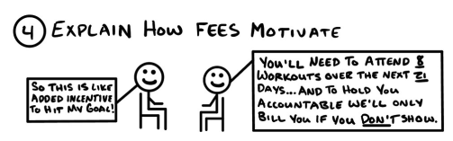
>
>* **Người bán:** "Bạn cần tham gia 8 buổi tập trong 21 ngày tới... và để giúp bạn có trách nhiệm với bản thân, chúng tôi sẽ chỉ tính phí nếu bạn *không* có mặt."
>* **Khách hàng:** "Vậy cái này giống như một động lực bổ sung để tôi đạt được mục tiêu!"

**Giải thích về các khoản phí sau khi đã cầm thẻ của họ.** Tôi thường nói đại loại như: *"Chúng tôi sẽ làm phần việc của mình miễn là bạn làm phần việc của bạn. Công bằng đúng không? Vậy nên bây giờ tôi chỉ yêu cầu bạn đặt cược vào chính mình—nếu bạn bỏ lỡ hoặc bỏ qua bất kỳ việc gì, kết quả của bạn sẽ bị ảnh hưởng. Chúng tôi thu phí để giúp bạn đi đúng hướng. Nếu bạn lỡ một lần, cũng không sao cả. Bạn sẽ bị trừ một khoản phí nhỏ nhưng nó sẽ giúp bạn quay lại đúng lộ trình. Nếu bạn tuân thủ đến cùng, bạn sẽ nhận được tất cả những điều này miễn phí. Đây là cách tốt nhất để chúng tôi giúp bạn có kết quả tuyệt vời mà vẫn giữ mức phí miễn phí cho bạn. Đôi bên cùng có lợi."*

**Lưu ý:** Nếu bạn giải thích về phí phạt *trước khi* cầm thẻ, bạn sẽ gặp nhiều sự phản kháng hơn. Vì vậy, hãy giải thích *sau đó* với thái độ "đây là quy trình bình thường". Khách hàng vẫn phải đồng ý với các khoản phí, nhưng bạn sẽ đạt được tỷ lệ chấp thuận cao hơn khi làm theo cách này. Tôi luôn yêu cầu khách hàng ký nháy riêng biệt bên cạnh các điều khoản về phí để buộc nhân viên bán hàng của tôi phải giải thích rõ chúng.

**(5) BIẾN CÁC CUỘC HẸN BÁN HÀNG THÀNH MỘT PHẦN CỦA QUÁ TRÌNH DÙNG THỬ**

>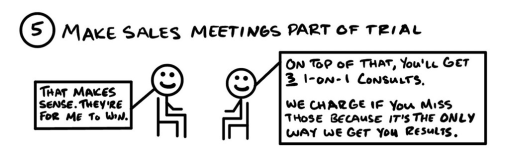
>
>* **Người bán:** "Ngoài ra, bạn sẽ có 3 buổi tư vấn 1-kèm-1. Chúng tôi sẽ thu phí nếu bạn bỏ lỡ vì đó là cách duy nhất để chúng tôi đảm bảo kết quả cho bạn."
>* **Khách hàng:** "Nghe hợp lý đấy. Những buổi đó là để giúp tôi thành công mà."

**Yêu cầu bắt buộc phải tham gia các buổi kiểm tra (Check-in).** Đầu tiên, chúng ta giải thích tất cả các tiêu chí để họ hiểu rõ chi phí và lợi ích của việc tuân thủ. Sau đó, chúng ta hướng sự chú ý vào các buổi check-in (đây chính là cơ hội upsell của chúng ta): *"Đúng vậy, và bạn đồng ý tham gia mỗi buổi trong số ba buổi check-in nhé. Buổi đầu tiên chúng ta làm X để bạn có thể [lợi ích 1], buổi thứ hai chúng ta làm Y để bạn có thể [lợi ích 2]..., buổi thứ ba chúng ta làm Z để bạn có thể [lợi ích 3]... Hiển nhiên là chúng tôi sẽ thu phí nếu bạn bỏ lỡ những buổi này vì đó là cách duy nhất để chúng tôi giúp bạn đạt được kết quả."*

---

**Cách tôi bán thêm (Upsell) từ chương trình dùng thử.** Khi có người tham gia dùng thử, một trong ba trường hợp sau sẽ xảy ra: họ thích nó, họ ghét nó, hoặc họ không thèm dùng. Dưới đây là cách tôi bán thêm cho họ trong từng kịch bản.

1.  **Nếu họ thích:** Đây là trường hợp dễ nhất. Bạn đã cài đặt chế độ tự động thanh toán cho họ rồi. Tuyệt! Nhưng dù vậy, hãy cứ gặp họ. Bạn vẫn có thể đề nghị một gói dịch vụ dài hạn hơn hoặc có giá trị cao hơn (hoặc cả hai). Những khách hàng thành công thường có xu hướng muốn nhận được nhiều giá trị hơn nữa từ những sản phẩm tốt hơn (và mang lại lợi nhuận cao hơn) của bạn.
2.  **Nếu họ ghét:** Hãy xoay chuyển tình thế. Hỏi họ xem họ muốn điều gì khác đi. Hãy nói với họ rằng họ hoàn toàn đúng, và bạn đang rất tự trách bản thân vì đã để thiếu sót điều này. *Đừng đổ lỗi cho họ.* Chỉ nên có một người được quyền tức giận—và đó phải là bạn. Hãy hỏi xem liệu họ có thể cho bạn một cơ hội để bù đắp không, vì bạn đang cảm thấy rất tệ về trải nghiệm của họ. Và giờ đây, vì bạn đã hiểu rõ hơn nhu cầu của họ, hãy cho họ thấy họ cực kỳ phù hợp với một gói dịch vụ ở cấp độ cao hơn. Sau đó, hãy chào mời họ gói đó. Đúng vậy—đây chính là bán hàng. Tôi có thể chốt đơn được với khoảng một nửa số người thuộc nhóm này.
3.  **Nếu họ không dùng:** Hãy liên hệ với họ nhiều lần *trước khi* mọi chuyện đi đến bước này. Giải thích rằng bạn cần gặp họ. Đề nghị miễn phí phạt nếu họ đồng ý gặp. Lúc này, bạn có thể cố gắng giúp họ quay lại đúng lộ trình hoặc đưa ra một lời đề nghị khác tốt hơn cho họ. Tôi không thích thu tiền của những người còn chưa bắt đầu sử dụng. Một khoản phí nhỏ không đáng để đổi lấy một đánh giá 1 sao. Nhưng dù sao, đó cũng là lựa chọn của bạn.

**Tinh chỉnh chương trình dùng thử để thu hút nhiều khách hàng nhất.** Nếu không ai tham gia dùng thử, hãy hạ thấp các yêu cầu hoặc phí phạt xuống. Nếu mọi người tham gia nhưng không thực hiện cam kết, hãy nhấn mạnh vào việc giải thích các khoản phí sẽ giúp ích cho họ như thế nào, và đảm bảo bạn đưa các buổi gặp bán hàng vào danh mục bắt buộc. Nếu mọi người không ở lại sau giai đoạn đầu, hãy nhấn mạnh hơn nữa vào giá trị của việc gắn bó và trả phí, cải thiện chất lượng dịch vụ, và đảm bảo những gì bạn bán ở giai đoạn sau phải logic và khớp với những gì bạn đã bán ở giai đoạn đầu. Nếu bạn bắt đầu "in ra tiền" thì đừng dừng lại.

**Để khách hàng có cơ hội sửa sai.** Mọi người thường nản lòng sau khi bị tính phí. Nhưng bạn có thể đưa ra một cơ hội để họ "chuộc lỗi". Cách này rất hiệu quả trong việc đưa mọi người quay lại lộ trình và chuyển đổi họ thành khách hàng chính thức. Tuy nhiên, nếu họ vẫn bỏ lỡ cơ hội đó, thì việc bạn thu phí của họ là hoàn toàn chính đáng.

**Cứ gọi đó là Dùng thử (Free Trial).** Mặc dù chiến lược "Dùng thử có phạt" có một số "tính năng đặc biệt", bạn nên gọi nó đơn giản là Dùng thử miễn phí. Nếu không, mọi người có thể thấy sợ hãi và bối rối. Chẳng ai muốn bị phạt cả. Và nếu họ thắc mắc tại sao bạn lại làm chương trình dùng thử theo cách này, chỉ cần trả lời: *"Đó là cách xưa nay chúng tôi vẫn làm"* hoặc *"Làm theo cách này khách hàng sẽ đạt được kết quả tốt nhất."*

**So sánh "Thanh toán ít hơn ngay bây giờ hoặc trả nhiều sau này" với "Dùng thử có phạt".** Tôi sử dụng chiến lược "Thanh toán ít hơn ngay bây giờ hoặc trả nhiều sau này" (Pay Less Now or Pay More Later) như một bước downsell cho các sản phẩm vật lý hoặc dịch vụ một lần. Và tôi dùng "Dùng thử có phạt" như một bước downsell cho các sản phẩm hoặc dịch vụ gia hạn định kỳ (recurring). Ngoài ra, tôi chỉ thấy cách này hiệu quả trong các mô hình kinh doanh mà khách hàng phải thực sự bắt tay vào làm thì mới có kết quả. Nếu bạn thấy nó hiệu quả với các loại hình kinh doanh khác... hãy cho tôi biết nhé!

**Giảm giá để lấy được thông tin thẻ.** Một số người thấy kỳ lạ khi bạn tặng đồ miễn phí mà lại yêu cầu thẻ. Nếu bạn đưa ra một mức giá cực thấp, điều đó sẽ biện minh cho việc yêu cầu thẻ. Mức giá nhỏ đó giúp đảm bảo thẻ vẫn sẽ hoạt động khi quy trình thanh toán tự động bắt đầu. Thay vì một tháng miễn phí, bạn có thể đề nghị "tháng đầu tiên giá $1", sau đó là $X mỗi tháng khi đến kỳ gia hạn.

### **Các điểm tóm tắt**

* Trong lời đề nghị **Dùng thử có phạt**, khách hàng có thể dùng thử sản phẩm hoặc dịch vụ của bạn miễn phí *miễn là họ đáp ứng các điều khoản của bạn*.
* Bước **Downsell Dùng thử có phạt** giúp bạn nhận được cái gật đầu từ cả những người đã từng từ chối.
* Để thực hiện: hãy lấy thông tin thẻ, yêu cầu sự cam kết, giải thích những việc họ cần làm để đạt kết quả cũng như các buổi hẹn bắt buộc phải tham gia, và điều gì sẽ xảy ra nếu họ không tuân thủ.
* **Dùng thử có phạt** giúp tạo ra nhiều khách hàng trả phí hơn so với dùng thử miễn phí thông thường, vì khách hàng sẽ sử dụng sản phẩm của bạn nhiều hơn và thực sự nhận được giá trị từ nó.
* Sử dụng chính các tiêu chí "hoàn tiền" từ chiến lược **Hoàn tiền khi đạt mục tiêu** (Lời chào mời thu hút số 1) để tạo ra các điều khoản cho **Dùng thử có phạt**. Bằng cách này, khi kết thúc đợt dùng thử, họ đã thực hiện xong những việc giúp họ trở thành những khách hàng trung thành tuyệt vời (và quảng cáo miễn phí cho doanh nghiệp của bạn).
* Bạn có thể chia nhỏ phí phạt theo từng tiêu chí hoặc thu một khoản phí trọn gói. Tôi ưu tiên việc chia nhỏ chúng ra.
* Bạn kiếm tiền bằng việc giúp khách hàng đạt kết quả và biến họ thành người mua hàng, chứ không phải bằng việc "chặt chém" họ qua các khoản phí phạt lặt vặt.
* Sử dụng các buổi kiểm tra (check-in) giữa đợt dùng thử để đưa ra các lời đề nghị mới. Nếu họ yêu thích sản phẩm, hãy cho họ thêm những gì họ muốn. Nếu họ gặp vấn đề, hãy thay đổi phương án phù hợp. Nếu họ không sử dụng, hãy cho họ cơ hội "chuộc lỗi" để tránh bị mất phí.

> **QUÀ TẶNG MIỄN PHÍ: Đào tạo về Dùng thử miễn phí**
>
> Không phải mô hình kinh doanh nào cũng có thể áp dụng dùng thử miễn phí. Nhưng nếu bạn làm được, đó sẽ là một bước downsell cực kỳ lợi hại. Hiển nhiên là có cách làm đúng, cách làm sai, và cũng có những ngành nghề phù hợp hoặc không. Tôi đã thực hiện một video miễn phí chia sẻ về chương trình này với tất cả những chi tiết cụ thể nhất mà tôi có thể cung cấp. Bạn có thể xem tại: *[acquisition.com/training/money](https://acquisition.com/training/money)*. Tôi cũng đã đặt mã QR ở đây để bạn truy cập nhanh chóng và dễ dàng.

## **Bán thấp hơn bằng cách lược bỏ tính năng (Feature Downsells)**

*Tại sao chúng ta không thử phương án này thay thế nhỉ?*

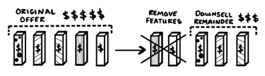

Tôi không nhớ rõ chính xác là thời điểm nào trong năm 2019.

"Kỹ thuật downsell mới này đã giúp tôi tăng gấp ba tỷ lệ chốt đơn, từ 25% lên 75% trong quý vừa qua. Và điều điên rồ hơn là, thậm chí có nhiều người chọn mua sản phẩm chính hơn trước," anh ấy vừa nói vừa tranh thủ ăn.

"Anh bắt đầu đưa ra gói trả góp hay giảm giá à?"

"Không cái nào cả. Trả góp thì mất quá nhiều thời gian để thu hồi vốn. Còn giảm giá thì làm hạ thấp giá trị sản phẩm của tôi."

Hửm... "Chúng ta đang nói về một sản phẩm giá trị cao (high-ticket), đúng không?"

"Đúng vậy."

"Trời ạ. Vậy anh đã làm gì?"

"Tôi hạ giá xuống, nhưng tôi giải thích lý do hạ giá là vì đã lược bỏ một tính năng. Bằng cách đó, tôi không hề mang tiếng là đang giảm giá."

"Vậy anh đã cắt bỏ tính năng nào?"

"Chính sách cam kết hoàn tiền 100% của tôi."

"Tôi chưa bao giờ nghĩ chính sách cam kết lại là một tính năng đấy, nghe cực kỳ thú vị — khoan đã... anh bán thấp xuống (downsell) bằng cách **loại bỏ** cam kết hoàn tiền á?"

"Đúng thế. Hiệu quả cực kỳ. Khi chúng tôi gặp sự phản đối về giá, chúng tôi sẽ hỏi: *'Nếu bạn không muốn lựa chọn được hoàn lại tiền, bạn có thể trả ít hơn. Hoặc, bạn có thể giữ chính sách cam kết hoàn tiền đó — bạn ưu tiên phương án nào hơn?'* Một khi họ hiểu mình sẽ phải từ bỏ điều gì, họ thường nói: *'Dẹp đi, tôi thà giữ cái cam kết đó để được hoàn tiền còn hơn.'*"

"À... vậy là họ chỉ thấy được giá trị của chính sách cam kết sau khi anh định bỏ nó đi. Và điều đó cũng giải thích tại sao có nhiều người chọn mua gói chính hơn. Thông minh thật." Tôi tiếp tục hỏi, "...vậy các con số cụ thể thay đổi như thế nào?"

"Trước đây, tôi chỉ có một lựa chọn duy nhất là giá full. Nếu 100 người gọi đến, có 25 người mua. Bây giờ, 35 người mua gói chính và 40 người chốt đơn qua gói downsell."

"Vậy là nó vừa tăng lượng người mua giá full, tăng tổng tỷ lệ chốt đơn, và tăng cả lượng tiền mặt thu về ngay lập tức. Tuyệt quá!"

"Đúng vậy, nó đã thay đổi cuộc đời tôi," anh ấy nói.

***

Hai chương trước đã đề cập đến **Downsell bằng Gói trả góp** và **Dùng thử có phạt**. Chúng ta thực hiện downsell bằng cách giữ nguyên tổng giá trị, chỉ thay đổi *thời điểm* và *cách thức* họ thanh toán.

Trong chương này, chúng ta sẽ tìm hiểu về **Downsell bằng cách lược bỏ tính năng**. Với chiến lược này, chúng ta sẽ downsell bằng cách hạ giá xuống. Nhưng thay vì giảm giá khơi khơi (điều làm cho mọi thứ trở nên rẻ rúng), chúng ta hạ giá bằng cách **thay đổi những gì họ sẽ nhận được**.

Dưới đây là bản dịch chi tiết cho nội dung về **Feature Downsells (Bán thấp hơn bằng cách lược bỏ tính năng)** từ các hình ảnh bạn đã cung cấp:

### **Mô tả**

**Feature Downsells** thực hiện việc hạ giá bằng cách thay đổi những gì khách hàng sẽ nhận được. Tôi thực hiện điều này bằng cách cung cấp số lượng ít hơn, chất lượng thấp hơn, các lựa chọn thay thế có giá rẻ hơn, hoặc cắt bỏ các thành phần bổ trợ không bắt buộc.

Tất cả các tính năng đều có một mức giá và một giá trị nhất định. Khi bạn loại bỏ thứ gì đó, giá sẽ giảm xuống, nhưng giá trị cũng giảm theo. Việc bạn loại bỏ tính năng nào và hạ giá bao nhiêu sẽ ảnh hưởng đến việc khách hàng cảm thấy đó là một món hời đến mức nào. Sự thay đổi trong tỷ lệ giữa **Giá cả và Giá trị** (price-to-value) sẽ tác động đến cách mọi người mua hàng, vì ai cũng muốn nhận được thỏa thuận tốt nhất cho bản thân mình.

Ví dụ:
* Nếu bạn loại bỏ thứ họ ghét và hạ giá thật nhiều, họ sẽ có một **thỏa thuận tốt hơn** (better deal).
* Nếu bạn loại bỏ thứ họ yêu thích nhưng chỉ hạ giá một chút, họ sẽ có một **thỏa thuận tệ hơn** (worse deal).

Cả hai cách đều thúc đẩy mọi người mua hàng. Trong câu chuyện kể trên, khách hàng rất thích chính sách cam kết hoàn tiền. Chính sách này có giá trị thực tế cao hơn nhiều so với mức giá của nó. Vì vậy, ngay cả khi họ đã nói "không" lúc đầu, việc loại bỏ cam kết này ngay lập tức cho thấy giá trị của nó. Khách hàng nhận ra lời đề nghị có mức giá cao hơn thực chất lại là một **thỏa thuận tốt hơn**, do đó họ đã quay lại mua gói sản phẩm đầu tiên.

Mọi người thường chỉ thấy được giá trị của thứ bị loại bỏ *sau khi* họ thấy sự chênh lệch về giá. Nói cách khác, họ sẽ cân nhắc số tiền mình tiết kiệm được so với giá trị mình bị mất đi. Do đó, một chiến lược **Feature Downselling** thông minh sẽ khiến khách hàng tự mình "tái nâng cấp" (re-upsell) lên các gói đắt tiền hơn. Điều này có nghĩa là bạn nên loại bỏ các tính năng theo thứ tự từ giá trị cao nhất đến thấp nhất. Vì khách hàng luôn muốn nhận được nhiều giá trị nhất cho số tiền họ bỏ ra, điều này sẽ thúc đẩy họ thực hiện giao dịch mua hàng có **giá trị cao nhất** đối với họ.

**Feature Downsells** có một công thức đơn giản: loại bỏ một thứ gì đó, hạ giá xuống, và hỏi *"Thế còn bây giờ thì sao?"* theo nhiều cách khác nhau.

### Các ví dụ về Downsell tính năng (Feature Downsell)

**Downsell tính năng theo Số lượng Sản phẩm và Dịch vụ.** Đối với dịch vụ, điều này có nghĩa là giảm khối lượng công việc, ít buổi hơn, ít thời gian hơn hoặc thời gian thực hiện ngắn hơn. Đối với sản phẩm, đơn giản là giảm số lượng món đồ.
* <u>Downsell số lượng sản phẩm:</u> Thay vì lấy gói dùng trong 3 tháng, hay là mình bắt đầu trước với 1 tháng thôi nhỉ?
* <u>Downsell số lượng dịch vụ:</u> Thay vì 4 buổi mỗi tháng, tại sao chúng ta không bắt đầu thử với 2 buổi trước?

**Downsell tính năng theo Chất lượng Sản phẩm.** Hãy nghĩ đến các phiên bản cũ hơn, vật liệu kém bền hơn, hoặc các vật liệu có giá trị định vị xã hội thấp hơn, v.v.
* <u>Downsell chất lượng sản phẩm:</u> Thay vì ghế da, chúng ta có thể chuyển sang chất liệu vinyl, bạn thấy sao?

**Downsell tính năng theo Chất lượng Dịch vụ.** Điều này bao gồm rất nhiều thứ. Tôi sẽ đưa ra một vài cách để thay đổi chất lượng dịch vụ. *Gợi ý: Cách này cũng có thể dùng để tăng chất lượng dịch vụ (Upsell).*
* <u>Downsell chất lượng dịch vụ:</u> Thay vì cam kết phản hồi trong 5 phút, hay là mình bắt đầu với gói phản hồi qua đêm nhé? Bạn sẽ tiết kiệm được một khoản mà vẫn nhận được câu trả lời—chỉ là chậm hơn một chút thôi.

<u>Các tính năng chất lượng dịch vụ khác:</u>
* <u>Thời gian đáp ứng (Time Availability):</u> Đến vào khung giờ cố định thay vì bất cứ lúc nào bạn muốn.
    * Ngày trong tuần: Thứ 2/4/6 thay vì tất cả các ngày.
    * Giờ trong ngày: Giờ hành chính (9h-17h) thay vì 24/7.
    * Thời lượng: Các cuộc gọi hỗ trợ 15 phút thay vì 60 phút.
* <u>Địa điểm đáp ứng (Location Availability):</u> Chỉ tại một địa điểm cố định thay vì tất cả các chi nhánh chúng tôi có.
* <u>Hủy lịch (Cancellations):</u> Có phí khi đổi lịch thay vì miễn phí.
* <u>Tốc độ phản hồi (Speed of Response):</u> Phản hồi sau vài phút so với vài giờ hoặc vài ngày, v.v.
* <u>Tốc độ giao hàng (Speed of Delivery):</u> Chờ xếp hàng so với được ưu tiên, giao ngay trong ngày/ngày mai so với tuần sau, v.v.
* <u>Tỉ lệ phục vụ (Service Ratio):</u> 1 kèm 1 so với 1 kèm nhiều người, hoặc nhiều người kèm 1, v.v.
* <u>Phương thức liên lạc (Communication Method):</u> Hỗ trợ qua tin nhắn văn bản so với chat trực tuyến hoặc gọi video, v.v.
* <u>Trình độ người thực hiện (Provider Qualifications):</u> Chủ doanh nghiệp so với nhân viên lâu năm hoặc nhân viên mới, v.v.
* <u>Trực tiếp so với Ghi hình (Live vs. Recorded):</u> Xem trực tiếp ngay lúc diễn ra so với xem lại bản ghi sau đó.
* <u>Trực tiếp so với Từ xa (In-person vs. Remote):</u> Xem tại chỗ so với xem qua màn hình từ nơi khác.
* <u>Tự làm, Làm cùng, Làm hộ (DIY, DWY, DFY):</u> Tự bạn làm (Do It Yourself) so với Chúng tôi làm cùng bạn (Done With You) hoặc Chúng tôi làm hết cho bạn (Done For You).
* <u>Thời hạn (Expirations):</u> Có giá trị vĩnh viễn so với có giá trị trong một khoảng thời gian X hoặc vào những thời điểm cụ thể.
* <u>Tính cá nhân hóa (Personalization):</u> Gói đại trà so với gói thiết kế riêng cho bạn.
* <u>Bảo hiểm/Cam kết (Insurance/Guarantee):</u>
    * Thời hạn: Trong 1 năm so với trọn đời.
    * Phạm vi: Chỉ bảo hành lỗi cụ thể so với bất kỳ lỗi nào xảy ra.
    * Điều khoản: Vô điều kiện so với chỉ được bảo hành nếu bạn thực hiện đúng các bước XYZ.

**Downsell bằng cách Loại bỏ hoàn toàn tính năng.** Thay vì giảm số lượng hay chất lượng, bạn bỏ hẳn tính năng đó đi. Trong câu chuyện ví dụ, anh ấy đã loại bỏ phần cam kết bảo hành.
* <u>Downsell loại bỏ tính năng:</u> Thay vì gói hỗ trợ ưu tiên qua chat, email và gọi điện, tại sao chúng ta không giữ lại chat và email thôi còn bỏ phần gọi điện để tiết kiệm chi phí nhỉ? Bạn vẫn sẽ được giải đáp thắc mắc, chúng tôi lại tiết kiệm được thời gian và có thể dành phần tiết kiệm đó cho bạn.

**Downsell tính năng từ "Làm hộ" (Done-For-You) sang "Tự làm" (Do-It-Yourself).** Nếu khách hàng từ chối mọi đề nghị hạ cấp dịch vụ, bạn có thể downsell sang một sản phẩm khác giúp họ giải quyết cùng vấn đề đó nhưng họ phải tự thực hiện.
* <u>Downsell sản phẩm từ Làm hộ sang Tự làm:</u>
    * **Bác sĩ chỉnh hình:** Thay vì đến để tôi nắn chỉnh, hay là mình bắt đầu với một vài dụng cụ để bạn có thể tự tập tại nhà? Sau đó, bạn bán cho họ các dụng cụ massage tại nhà, con lăn foam roller, thảm tập, v.v.
    * **Thợ sơn:** Nếu bạn không đủ ngân sách để thuê tôi sơn nhà, hay là tôi để lại sơn cho bạn và cho bạn thuê máy phun sơn của chúng tôi theo ngày với giá ưu đãi nhé?
    * **Alex Hormozi:** Thay vì tôi và đội ngũ của mình mua lại công ty và trực tiếp phát triển doanh nghiệp của bạn, tại sao bạn không tham gia một buổi workshop nhỉ? (*Khụ khụ* Truy cập vào acquisition.com nhé).

### Các lưu ý quan trọng

**Hãy nhớ, đừng bao giờ thương lượng về giá.** Những người đòi trả ít tiền hơn cho cùng một giá trị nhận lại chính là những "kẻ khủng bố" trong kinh doanh. Và tôi thì không thương lượng với khủng bố. Nếu họ muốn trả ít hơn ngay lúc này—hãy đưa ra một kế hoạch trả góp. Nếu họ muốn tổng chi phí rẻ hơn—hãy thực hiện downsell tính năng (giảm bớt tính năng). Nhưng đừng để bất kỳ ai trả ít tiền hơn *chỉ vì họ thích thế*.

**Luôn giữ vị thế của một "Người hướng dẫn tận tâm".** Hãy nhớ rằng, Downsell tính năng nghĩa là nỗ lực tìm ra *gói giao dịch tốt nhất cho họ*. Điều này giữ cho cuộc hội thoại mang tính hợp tác thay vì đối đầu. Nếu bạn tỏ ra thúc ép, các lời đề nghị của bạn sẽ khiến khách hàng mệt mỏi rất nhanh. Nếu bạn đóng vai người hướng dẫn, bạn có thể thực hiện downsell bao nhiêu lần tùy ý mà không làm khách hàng kiệt sức.

**Tinh chỉnh quy trình Downsell tính năng của bạn.** Nhiệm vụ của chúng ta là làm cho sản phẩm có giá trị cao nhất so với chi phí *trong mắt khách hàng*. Nhưng lúc đầu, bạn sẽ không biết nhiều về sở thích của họ. Vì vậy, khi bạn giải quyết cùng một vấn đề cho cùng một nhóm khách hàng, bạn sẽ học được họ thấy điều gì là giá trị nhất. Khi đã nắm rõ, bạn có thể chuẩn hóa quy trình Downsell của mình. Downsell tính năng sẽ chốt được nhiều đơn hơn khi bạn biết trước nên đưa ra những tổ hợp tính năng nào.

**Cách tôi chuẩn hóa quy trình Downsell của mình.** Đầu tiên, tôi cắt bỏ một thứ gì đó có giá trị và giảm giá xuống *một chút*. Tôi làm vậy để họ cân nhắc lại lời đề nghị/mức giá ban đầu. Nếu không thành công, tôi tiếp tục loại bỏ các tính năng và hạ giá cho đến khi họ mua. Tôi thà để mọi người nhận được *thứ gì đó* còn hơn là không có gì.

**Đặt tên cho các tổ hợp tính năng.** Hãy đặt tên cho gói đắt nhất theo một vị thế mà khách hàng mong muốn đạt tới, chẳng hạn như "Gói Cá Voi" (The Whale Package), "Biến đổi toàn diện" (The Total Transformation), "Tay chơi hạng sang" (High Roller), v.v. Hãy nhìn vào các hãng hàng không. Hãy tạo ra phiên bản riêng của bạn cho: Hạng Nhất → Hạng Thương gia → Hạng Phổ thông.

**Tôi đặt tên cho gói rẻ nhất là "Gói tối thiểu" (The Minimum).** Tôi thích cái tên này vì nó ngụ ý rằng họ *ít nhất* phải có được thứ đó. Nếu ai đó từ chối tất cả các gói khác, tôi chỉ cần nói: "Vậy là không lấy gì thêm ngoài gói tối thiểu sao?" để khiến họ nói "không" nhằm mục đích đồng ý (giống như kỹ thuật Classic Upsell).

**Kiểm tra "nhiệt độ" sau hai lần Downsell (Giống như với kế hoạch trả góp).** Nếu bạn đã thay đổi hai lần liên tiếp mà họ vẫn từ chối, hãy đảm bảo rằng họ thực sự muốn món đồ đó. Tôi sẽ nói đại loại như: "Tôi hiểu rồi. Nhanh thôi, tôi muốn xác nhận chắc chắn một chút. Trên thang điểm từ 1–10, bạn khao khát có được thứ này đến mức nào?"

**Nếu họ nói từ 8 điểm trở lên, hãy bắt đầu Downsell sang kế hoạch trả góp.** "Tuyệt vời. Đừng lo. Chúng ta sẽ tìm cách để bạn sở hữu nó." Nếu họ nói từ 7 trở xuống, hãy hỏi: "Vậy một mức 10 điểm sẽ trông như thế nào?" và sau đó, tổ hợp lại các tính năng để cố gắng đáp ứng mức "10 điểm" đó của họ. Lưu ý: điều này có nghĩa là bạn có thể linh hoạt luân chuyển giữa kế hoạch trả góp và downsell tính năng. Khi bạn sử dụng cả hai, khách hàng sẽ rất khó để từ chối.

**Sau mỗi lần Downsell, hãy hỏi "Chốt nhé?" (Deal?) hoặc "Công bằng chứ?" (Fair Enough?).** Cách này hiệu quả một cách kinh ngạc. Rất ít người thấy bạn thay đổi lời đề nghị vì họ rồi lại nói "Không, thế không công bằng". Hãy nghe cách tôi trình bày Downsell tính năng trong Tập 202 của podcast *The Game*, "Cách chốt đơn với mọi đối tượng: downselling như một chuyên gia."

**Các buổi định hướng miễn phí giúp thúc đẩy Downsell tính năng "Tự làm" (DIY).** Khi ai đó từ chối tất cả các gói "Làm hộ" (Done For You), tôi sẽ hỏi: "Dù chúng ta sẽ không hợp tác với nhau ở dự án X, tôi vẫn muốn giúp bạn. Hay là ngày mai bạn cứ đến dự buổi định hướng miễn phí về X nhé?" Cuối buổi định hướng, tôi sẽ chào mời một sản phẩm DIY (tự làm) giúp giải quyết cùng vấn đề với dịch vụ DFY (làm hộ). Ví dụ: Tôi tặng buổi định hướng miễn phí cho những người từ chối gói tập gym của tôi. Trong số những người đến dự (khoảng một nửa), gần như tất cả họ đều mua thực phẩm chức năng. Điều đó giúp tôi kiếm tiền từ những người mà lẽ ra đã nói "không". Có thêm tiền mà không phải tốn thêm nhiều công sức.

**Downsell các cam kết bảo hành của bạn.** Nếu bạn đã có sẵn cam kết bảo hành, hãy đưa việc loại bỏ nó vào quy trình Downsell tính năng. Mọi người đều coi trọng sự an tâm, nên việc loại bỏ cam kết sẽ khiến nhiều người nhận ra giá trị của nó. Điều này thường xoay chuyển một câu trả lời "không" ban đầu thành "có".

**Downsell cho khách hàng hiện tại.** Những khách hàng sử dụng tất cả tính năng mà họ đang trả tiền sẽ duy trì dịch vụ lâu hơn những người không dùng hết. Vì vậy, một khi bạn thấy khách hàng không sử dụng một tính năng nào đó, hãy đề nghị một mức giá thấp hơn—chỉ trả tiền cho những tính năng họ thực sự dùng. Họ sẽ nói với bạn rằng họ muốn giữ lại và có thể bắt đầu dùng lại tính năng đó—hoặc—họ sẽ vui vẻ vì bạn đã cho họ một thỏa thuận tốt hơn. Việc này tốn công sức, nhưng vẫn tốt hơn là việc họ hủy dịch vụ. **Sự thật thú vị:** Những khách hàng mà chúng tôi downsell xuống gói thấp hơn dành riêng cho họ có giá trị cao thứ hai trong số tất cả khách hàng của tôi. Khi mọi người có một sản phẩm họ thích với mức giá họ thấy công bằng, họ sẽ tiếp tục trả tiền.

**Trao đổi bằng Đánh giá, Cảm nhận và Giới thiệu.** Trao đổi là hình thức giao thương lâu đời nhất. Hòn đá sắc nhọn của tôi đổi lấy da thỏ của bạn. Và tôi yêu việc trao đổi. Nếu tôi gặp sự phản đối về giá, đôi khi tôi đề nghị giảm giá để đổi lấy việc quảng cáo. Ví dụ: "Tôi sẽ bớt cho bạn $100 nếu bạn: 1) Để lại đánh giá trên tất cả các trang review; 2) Quay một video cảm nhận; 3) Đăng bài công khai trên mạng xã hội vào lúc bắt đầu, giữa và cuối lộ trình để cho thấy sự tiến bộ của bạn; 4) Giới thiệu tôi với hai người bạn cũng muốn tham gia. Chốt chứ?" Với tôi, việc quảng cáo đó đáng giá hơn $100. Với họ, $100 có giá trị hơn việc quảng cáo đó. Đôi bên cùng có lợi (Win-win).

### Các điểm tóm tắt

* **Downsell tính năng** giúp giảm giá thành bằng cách loại bỏ các thành phần bổ trợ.
* Bạn lược bỏ một thứ gì đó, giảm giá xuống và hỏi: **"Thế còn mức này thì sao?"**
* Các hình thức Downsell tính năng điển hình thường là: Giảm số lượng, hạ cấp chất lượng, đưa ra các lựa chọn thay thế giá rẻ hơn, hoặc lược bỏ hoàn toàn các tính năng.
* Mọi người có xu hướng nhận ra giá trị của thứ bạn vừa loại bỏ *sau khi* họ nhìn thấy sự chênh lệch về giá. Điều này có thể thúc đẩy nhiều người quay lại chọn lời đề nghị đắt tiền hơn.
* Nếu bạn loại bỏ những thứ họ ghét và giảm giá mạnh, nhiều người sẽ chấp nhận gói downsell.
* Nếu bạn loại bỏ những thứ họ thích và chỉ giảm giá một chút, nhiều người sẽ chọn lời đề nghị ban đầu.
* Lần downsell đầu tiên khiến họ cân nhắc lại lời đề nghị ban đầu của tôi. Những lần downsell tiếp theo giúp họ cân nhắc đâu là gói giao dịch tốt nhất dành cho mình.
* Nếu một khách hàng tiềm năng từ chối nhiều lần downsell, hãy kiểm tra xem họ còn thực sự muốn sản phẩm của bạn hay không trước khi tiếp tục.
* Nếu khách hàng thích tổ hợp các tính năng đó nhưng vẫn chưa ưng mức giá, hãy bắt đầu downsell sang kế hoạch trả góp. Cách này cực kỳ hiệu quả.
* Thực hiện downsell cho khách hàng hiện tại *trước khi* họ có ý định hủy dịch vụ.
* Bạn có thể giảm giá cho khách hàng để đổi lấy việc họ quảng bá cho doanh nghiệp của bạn.

>**QUÀ TẶNG MIỄN PHÍ: Khóa đào tạo Downsell tính năng [Không cần đăng ký]**
>
>Việc hiểu rõ các tính năng trong sản phẩm và dịch vụ mang lại cho bạn một lợi thế khổng lồ. Nó giúp sản phẩm của bạn đạt lợi nhuận cực cao mà vẫn giữ được sức hấp dẫn trong mắt khách hàng. Đây là một trong những chủ đề yêu thích của tôi và tôi đã chuẩn bị một khóa đào tạo bổ sung về nội dung này. Bạn có thể xem tại [acquisition.com/training/money](https://acquisition.com/training/money) như thường lệ. Tôi có đính kèm mã QR để bạn truy cập nhanh chóng và dễ dàng.

## Tổng kết về Downsell Offers

*Ai cũng mua thứ gì đó.*

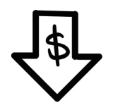

Downsell mang lại cho bạn cơ hội thứ hai để có được khách hàng bằng cách biến những cái "không" thành "có". Vì lý do đó, mục tiêu không nằm ở việc có hàng trăm sản phẩm khác nhau cho cùng một lời đề nghị, mà là có **hàng trăm lời đề nghị khác nhau cho cùng một sản phẩm**. Tuy nhiên, dù thế nào đi nữa, lời đề nghị mới không bao giờ là "cùng một thứ đó với giá rẻ hơn". Chúng ta chỉ liên tục tinh chỉnh lời đề nghị cho đến khi nó trở thành gói giao dịch tốt nhất dành cho họ. Khoản tiền thu thêm này sẽ làm bùng nổ lợi nhuận trong 30 ngày và giúp chúng ta vượt xa các mục tiêu đã đề ra.

Như vậy, chúng ta đã sử dụng các lời đề nghị thu hút (attraction offers) để khách hàng mua lần đầu. Chúng ta đã sử dụng upsell để họ mua món đồ tiếp theo. Và giờ đây, tôi đã giới thiệu cho bạn ba quy trình downsell mạnh mẽ nhất trong trường hợp họ nói không: **Downsell bằng Kế hoạch trả góp (Payment Plan)**, **Dùng thử có điều kiện (Trial With Penalty)**, và **Downsell tính năng (Feature Downsell)**.

Tiếp theo, chúng ta sẽ đến với giai đoạn cuối cùng của Mô hình Tiền tệ 100 triệu đô—**Lời đề nghị duy trì (Continuity Offers)**: *cách để giữ chân họ mua hàng mãi mãi.*