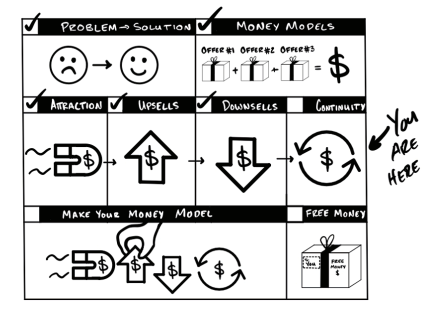

## PHẦN V: LỜI ĐỀ NGHỊ DUY TRÌ (CONTINUITY OFFERS)

>*"Bạn có thể xén lông một con cừu cả đời, nhưng bạn chỉ có thể lột da nó một lần duy nhất."* – John, một người thầy thời kỳ đầu của tôi.

Cả sự nghiệp của tôi luôn gắn liền với mô hình doanh thu định kỳ: từ huấn luyện cá nhân, đến mở phòng gym, rồi nhượng quyền phòng gym, thực phẩm chức năng, phần mềm, và bây giờ là với Acquisition.com... rất nhiều thứ. Không cần phải nói, tôi là một "fan cuồng" của mô hình này. Lý do chính là: khi bạn thực hiện mô hình duy trì đúng cách, bạn sẽ có **nhiều khách hàng hơn** và **kiếm được nhiều tiền hơn** từ họ. 

Các **Lời đề nghị duy trì** cung cấp giá trị liên tục mà khách hàng sẽ trả phí định kỳ cho đến khi họ hủy bỏ. Chúng thúc đẩy lợi nhuận từ mỗi khách hàng và mang lại cho bạn một thứ cuối cùng để bán. Lời đề nghị duy trì thực sự tuyệt vời vì bạn chỉ cần **bán một lần, nhưng được thanh toán mãi mãi.**

Để tôi giải thích rõ hơn:

Giả sử bạn chào bán một thứ giá $1.000 cho 100 người và có 10 người mua — bạn kiếm được **$10.000** ($1.000 x 10).

Bây giờ, giả sử bạn nói chuyện với cùng 100 người đó nhưng thay món đồ $1.000 kia bằng giá... **$50 mỗi tháng**. Với mức giá 50 đô, chúng ta có thể chốt được 40 người mua trong số 100 người đó. Và, nếu bạn giữ chân được những người này trong 20 tháng, **bạn vẫn kiếm được $1.000 từ mỗi khách hàng**. 

Lúc này, bạn đi từ việc kiếm được $10.000 ngay lập tức (và sau đó là $0) sang việc kiếm được $2.000 ngay bây giờ và **$40.000 theo thời gian**.

Một điểm cộng thêm là, ở ví dụ đầu tiên, bạn chỉ có 10 khách hàng để thực hiện Upsell sau này. Nhưng nếu bạn dùng Lời đề nghị duy trì và có 40 khách hàng, bạn sẽ có **lượng khách hàng tiềm năng để Upsell gấp 4 lần**. Một sự khác biệt khổng lồ!

Ví dụ này minh họa cho những ưu và nhược điểm của mô hình duy trì. Bạn có thể thu hút nhiều khách hàng hơn so với một thứ gì đó đắt đỏ, nhưng bạn lại kiếm được **ít tiền hơn vào lúc này**. Điều đó khiến việc sử dụng mô hình duy trì như một Lời đề nghị thu hút (Attraction Offer) *độc lập* trở nên khó khăn. Ngay cả khi bạn có tiềm năng kiếm nhiều tiền hơn trong tương lai, các Lời đề nghị thu hút theo kiểu duy trì vẫn khiến bạn bị kẹt tiền mặt (thiếu vốn lưu động) ở hiện tại.

Bằng cách đặt Lời đề nghị duy trì ở **sau cùng**, chúng ta có được thứ tốt nhất từ cả hai thế giới:
1. Có tiền mặt ngay hôm nay từ các Lời đề nghị thu hút, Upsell và Downsell.
2. Có một ít tiền mặt hôm nay và **cực kỳ nhiều tiền mặt trong tương lai** từ các Lời đề nghị duy trì.

Nói cho rõ — bạn có thể tạo ra Lời đề nghị duy trì ở bất cứ đâu và bằng bất cứ cách nào bạn muốn. Chúng có thể thu hút khách hàng mới, dùng để Upsell hoặc Downsell khách hàng hiện tại, hoặc để kết nối lại với khách hàng cũ.

Tuy nhiên, chỉ có một số thứ nhất định là phù hợp để làm Lời đề nghị duy trì. Thật ngớ ngẩn nếu bắt ai đó trả tiền cho một buổi workshop diễn ra trong một ngày... mãi mãi. Sẽ hợp lý hơn nếu họ trả tiền cho đến khi đủ chi phí — và đó gọi là kế hoạch trả góp. Đồng thời, bạn có thể sẽ mắc sai lầm nếu đưa ra một mức giá duy nhất (dù là giá cao) để cung cấp một dịch vụ mãi mãi. Nếu khách hàng nhận được giá trị liên tục, thì việc họ trả phí liên tục là hoàn toàn hợp lý.

**Ba loại Lời đề nghị duy trì**

Mọi lời đề nghị đều phụ thuộc vào việc khiến khách hàng xuống tiền mua. Tuy nhiên, các Lời đề nghị duy trì lại phụ thuộc vào việc khiến khách hàng **tiếp tục** mua. Tôi giúp họ thực hiện cả hai việc đó bằng cách kết hợp các khoản thưởng, giảm giá và phí.

* **Duy trì: Lời đề nghị tặng thưởng (Bonus Offers)**
* **Duy trì: Lời đề nghị giảm giá (Discount Offers)**
* **Lời đề nghị miễn phí tham gia (Waived Fee Offer)**

Vậy là chúng ta đã nắm được những ý chính. Bạn không thể giữ chân khách hàng gắn bó với lời đề nghị duy trì trừ khi họ đã thực sự bắt đầu... vì vậy, hãy bắt đầu từ đó.

>**QUÀ TẶNG MIỄN PHÍ: Khóa đào tạo về Duy trì và Lời đề nghị duy trì**
>
>Hầu như mọi doanh nghiệp tôi từng xây dựng đều được thúc đẩy bởi mô hình duy trì. Nó giống như một quả cầu tuyết cứ lăn và lớn dần lên. Tôi đã làm một video tóm tắt khóa đào tạo chuyên sâu hơn về chủ đề này. Bạn có thể xem miễn phí (không cần để lại email) tại [acquisition.com/training/money](https://acquisition.com/training/money). Hãy quét mã QR nhé.