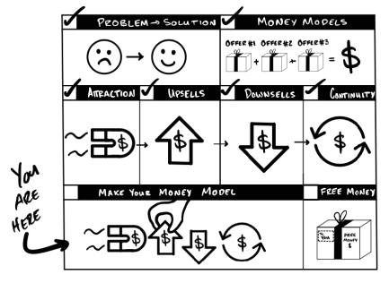
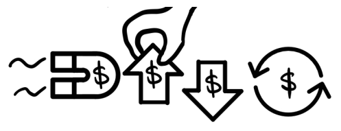

# PHẦN VI: THIẾT KẾ MONEY MODEL CỦA BẠN

*Làm thế nào để thâu tóm toàn bộ thị trường của bạn*

*Nhìn lại sự phát triển của "Money Model $100M" của Gym Launch đến nay.*

Tôi tình cờ khám phá ra Mô hình Kiếm tiền từ việc cấp quyền kinh doanh của Gym Launch. Từ việc phải bay đi khắp nơi để giúp các phòng gym lấp đầy khách hàng, tôi chuyển sang cấp quyền sử dụng những thứ tôi đã dùng khi làm việc đó. Bằng cách này, các chủ phòng gym có thể tự mình thực hiện.

Nhìn lại, mọi thứ bắt đầu với một **Lời chào hàng "Chim mồi" (Decoy Offer)**. Tôi thu hút khách hàng mới bằng rất nhiều khóa học, sách, video đào tạo, huấn luyện trực tiếp miễn phí, và nhiều thứ khác. Tất cả đều xoay quanh việc phát triển một phòng gym. Mỗi sản phẩm miễn phí đều đi kèm với một cuộc gọi miễn phí để giúp các chủ phòng gym sử dụng nó. Trong cuộc gọi đó, tôi sẽ đưa ra:

<u>Chào hàng "Chim mồi":</u> Giờ bạn đã có kế hoạch rồi, bạn có thể tự mình thực hiện nó miễn phí.

Hoặc...

<u>Chào hàng Cao cấp (Premium Offer):</u> Chúng tôi có thể giúp bạn triển khai tất cả những thứ này với giá 16.000 USD trong vòng 16 tuần.

Nếu họ chọn phương án cao cấp, họ sẽ nhận được một kho tàng các chiến thuật kiếm tiền — những chiến thuật mà tôi đã mất nhiều năm để tìm ra. Mọi người mua tới tấp. *Và vèo một cái, Chào hàng "Chim mồi" đã đưa tôi lên mức doanh thu 476.000 USD mỗi tháng chỉ trong vòng ba tháng.* Không hề viết nhầm đâu nhé.

Nhưng tôi lại gặp một vấn đề. Vì tôi chỉ có một thứ duy nhất để bán, tôi biết doanh thu của mình sẽ sớm chạm ngưỡng bão hòa. Tôi cần một đợt "Bán thêm" (upsell) để gia tăng lợi nhuận, nếu không Gym Launch sẽ dậm chân tại chỗ. Vì vậy, tôi đã tạo ra một upsell dành cho những chủ phòng gym ở trình độ nâng cao hơn. Tôi gọi đó là "Gym Lords" và đặt giá 42.000 USD mỗi năm. Tôi đã sử dụng **Bán thêm kiểu truyền thống (Classic Upsell)** để cung cấp các bộ quy trình và dịch vụ nâng cao, cùng với một cộng đồng để chia sẻ những phương pháp hay nhất như một khoản **phần thưởng duy trì (Continuity Bonus)**. Tôi bắt đầu bằng việc giảm giá mạnh tới 6.000 USD cho bất kỳ ai trả trước. Nhiều chủ phòng gym đã trả trước bằng chính số tiền mà tôi vừa giúp họ kiếm được. Với những người không làm vậy, tôi đưa ra phương án **Bán giảm bằng trả góp (Payment Plan Downsell)**.

Nếu họ nói không, tôi đề nghị trả trước 10.000 USD và chia nhỏ phần còn lại theo thời gian. Nếu họ vẫn nói không, tôi sẽ đề nghị mức giá khoảng 800 USD mỗi tuần trong 52 tuần. Nếu họ tiếp tục từ chối, tôi nói họ có thể bắt đầu miễn phí. Tôi sử dụng **Giảm giá duy trì (Continuity Discount)** để đẩy thời gian miễn phí lên trước cho đến khi họ trả xong đợt chào hàng đầu tiên. Sau đó, họ sẽ chuyển thẳng sang gói Bán thêm duy trì của tôi. Bằng cách này, các khoản thanh toán của họ luôn được duy trì liên tục. *Và vút... sự kết hợp giữa Bán thêm truyền thống + Thưởng duy trì + Bán giảm bằng trả góp + Giảm giá duy trì đã đưa tôi lên mức doanh thu khoảng 1.500.000 USD mỗi tháng.*

Tôi lại có thêm thứ khác để bán. Tuyệt vời! Và nó đã đẩy Mô hình Kiếm tiền của Gym Launch lên một tầm cao mới. Nhưng tôi vẫn còn việc phải làm. Dù quy trình bán thêm và bán giảm hoạt động rất tốt, một số chủ phòng gym vẫn tiếp tục từ chối. Tôi lại quay trở lại bàn tính toán.

Tôi nghĩ ra một kiểu **Bán thêm theo thực đơn (Menu Upsell)** mang tính cá nhân hóa hơn với các cấp độ dịch vụ khác nhau. Tôi cung cấp dịch vụ quảng cáo trọn gói (done-for-you), đào tạo đội ngũ bán hàng, các chiến dịch "chìa khóa trao tay" để kiếm tiền nhanh chóng. Và cuối cùng, tôi cung cấp một gói tối thiểu — quyền truy cập liên tục vào các tài liệu gốc của Gym Launch cùng với hỗ trợ kỹ thuật với mức phí hàng tháng ưu đãi. Nếu họ không muốn toàn bộ gói dịch vụ, tôi sử dụng **Bán giảm bằng cách bớt tính năng (Feature Downsells)** để tìm ra lựa chọn tốt nhất cho họ. Gần như tất cả mọi người đều ở lại để sử dụng một thứ gì đó.

*Và bùm... Bán thêm theo thực đơn + Bán giảm bằng cách bớt tính năng đã đưa tôi đến mức 2.300.000 USD mỗi tháng.* Tất cả chỉ trong vòng 14 tháng.

Sau đó, chúng tôi thành lập Prestige Labs và tích hợp nó với Gym Launch. Một doanh nghiệp hoàn toàn khác với Mô hình Kiếm tiền riêng của nó. Đến tháng thứ 20, chúng tôi đã thu về 4.400.000 USD mỗi tháng. Nó đã thay đổi cả cuộc đời tôi. Và tất cả những gì cần thiết *chỉ* là một vài sản phẩm thực sự tốt và một Mô hình Kiếm tiền trị giá 100 triệu đô để thực hiện điều đó.

***

**Ghi chú của tác giả:** Khi mới bắt đầu, tôi chẳng biết gì về những thứ liên quan đến Mô hình Kiếm tiền này cả. Mọi thứ trông có vẻ mạch lạc khi nhìn lại thôi. Nhưng tôi hy vọng điều này sẽ giúp mọi thứ trở nên đơn giản hơn để bạn mất ít thời gian hơn tôi đã từng.

## Mô tả

**Mô hình Kiếm tiền (Money Model)** là một *chuỗi các lời chào hàng được tính toán kỹ lưỡng*. Đó là việc bạn chào bán cái gì, khi nào bán và bán như thế nào để kiếm được nhiều tiền nhất trong thời gian nhanh nhất có thể. Lý tưởng nhất là kiếm đủ tiền từ một khách hàng để có thể tiếp cận và phục vụ *ít nhất* hai khách hàng nữa trong vòng chưa ít hơn 30 ngày. Thực tế thì quy trình này hiếm khi diễn ra một cách trơn tru, nhưng tôi chia các "Mô hình Kiếm tiền 100 triệu đô" thành ba giai đoạn:

* **Giai đoạn I: Thu tiền mặt — Chào hàng Thu hút (Attraction Offers)** giúp có thêm nhiều khách hàng hơn với chi phí thấp hơn.
* **Giai đoạn II: Thu thêm tiền mặt — Chào hàng Bán thêm (Upsell) & Bán giảm (Downsell)** giúp kiếm được nhiều tiền hơn từ khách hàng nhanh hơn.
* **Giai đoạn III: Thu nhiều tiền mặt nhất — Chào hàng Duy trì (Continuity Offers)** tối đa hóa tổng số tiền khách hàng chi trả.

Tôi chia nhỏ "Mô hình Kiếm tiền 100 triệu đô" của mình thành các giai đoạn này vì sự phát triển của mô hình kiếm tiền luôn song hành cùng sự phát triển của doanh nghiệp. Nói cách khác, nếu bạn cố gắng bắt đầu một doanh nghiệp tự thân (bootstrapped), từ con số không, với một Mô hình Kiếm tiền đã "hoàn thiện"... nó sẽ sụp đổ ngay trên đầu bạn. Thực tế là không có doanh nghiệp nào của tôi bắt đầu với một Mô hình Kiếm tiền được rèn giũa hoàn chỉnh ngay từ đầu. Tất cả đều bắt đầu từ Giai đoạn I. Ngay cả Acquisition.com cũng vậy! Theo kinh nghiệm của tôi, các Mô hình Kiếm tiền sẽ tiến hóa như sau:

* Đầu tiên, tôi có được khách hàng một cách ổn định, *sau đó*
* Tôi đảm bảo họ trả tiền cho chính họ một cách ổn định, *sau đó*
* Tôi đảm bảo họ trả tiền để có thêm các khách hàng khác một cách ổn định, *sau đó*
* Tôi bắt đầu tối đa hóa giá trị lâu dài của mỗi khách hàng, *sau đó*
* Tôi chi càng nhiều tiền quảng cáo càng tốt để "in" ra nhiều tiền nhất có thể.

Các Mô hình Kiếm tiền của tôi phát triển theo cách này vì tôi muốn đảm bảo *mỗi giai đoạn đều chi trả được cho giai đoạn tiếp theo*. Chúng tôi liên tục cải thiện từng giai đoạn cho đến khi nó trở nên ổn định. Ngoài ra, điều này cũng đồng nghĩa với sự ổn định về cả tài chính *lẫn* vận hành. Vì vậy, tôi có một lời cảnh báo công bằng: khi Mô hình Kiếm tiền của bạn bắt đầu hoạt động hiệu quả, doanh nghiệp của bạn sẽ bắt đầu "quá tải" (breaking). Đó là một phần của cuộc chơi. Thế nên tôi khuyên bạn nên tìm một người có thể xây dựng và dẫn dắt đội ngũ để biến tầm nhìn của bạn thành hiện thực. Khi tôi tìm thấy người đó, tôi đã kết hôn với cô ấy. Tôi hy vọng may mắn tương tự cũng sẽ đến với bạn.

>**Ghi chú của tác giả:** Tôi muốn làm rõ một điều. Có rất nhiều Mô hình Kiếm tiền 100 triệu đô đang tồn tại. Tôi dám chắc rằng mỗi doanh nghiệp 100 triệu đô đều có một Mô hình Kiếm tiền trị giá tương ứng! Hãy nhớ rằng, có rất nhiều doanh nghiệp kiếm được hàng đống tiền theo nhiều cách khác nhau. Tôi chỉ đang trình bày những cách mà tôi đã thực sự thực hiện thành công.

## Ví dụ về các Mô hình Kiếm tiền

### Phân tích Mô hình Kiếm tiền của Gym Launch (Dịch vụ)
* **Giai đoạn I - Chào hàng Thu hút:** Chào hàng "Chim mồi" (Decoy Offer)
    * *Sự lựa chọn giữa:* Tự làm miễn phí (Decoy) và Được hướng dẫn làm cùng gói Cao cấp giá 16.000 USD.
* **Giai đoạn II - Chào hàng Bán thêm (Upsell):** Bán thêm kiểu truyền thống (Classic Upsell)
    * *Nguyên tắc:* Một khi bạn biết cách thu hút khách hàng, bạn phải biết cách giữ chân họ.
    * Mức phí 42.000 USD/năm (36.000 USD nếu trả trước) cho các dịch vụ kinh doanh nâng cao.
* **Giai đoạn II - Chào hàng Bán giảm (Downsell):** Bán giảm bằng trả góp (Payment Plan Downsell)
    * *Bán giảm kiểu bập bênh:* Bắt đầu với 10.000 USD trả trước, phần còn lại chia đều trong 52 tuần.
    * *Chào hàng trả góp cuối cùng:* 800 USD mỗi tuần trong vòng 52 tuần.
* **Giai đoạn III - Chào hàng Duy trì (Continuity):** Chốt đơn theo chào hàng thực đơn + Bán giảm bằng cách bớt tính năng
    * Gói đầy đủ: 800 USD mỗi tuần.
    * Tính năng Quảng cáo trọn gói: 300 USD mỗi tuần.
    * Tính năng Đào tạo bán hàng hàng ngày cho phòng Gym: 200 USD mỗi tuần.
    * Tính năng Các bản phát hành mới hàng tháng: 500 USD mỗi tuần.
    * Tính năng Tài liệu cấp quyền gốc kèm hỗ trợ kỹ thuật: 100 USD mỗi tuần.
    * Gói tối thiểu: 100 USD mỗi tuần.

### Phân tích Mô hình Kiếm tiền cho Phòng Gym siêu nhỏ (Kinh doanh địa phương)
* **Giai đoạn I - Chào hàng Thu hút:** Hoàn tiền khi đạt mục tiêu (Win Your Money Back)
    * Thử thách thể hình có thu phí đầu vào. Hoàn lại tiền nếu khách hàng đạt được mục tiêu đề ra.
* **Giai đoạn I - Chào hàng Bán giảm:** Bán giảm bằng trả góp
    * Chia nhỏ thanh toán → Thanh toán 3 đợt → Dùng thử có điều kiện.
* **Giai đoạn II - Chào hàng Bán thêm:** Bán thêm theo thực đơn
    * "Bạn sẽ không đạt được kết quả *tốt nhất* nếu thiếu các loại thực phẩm bổ sung phù hợp."
    * Các gói thực phẩm bổ sung: Gói lớn được cá nhân hóa theo mục tiêu.
* **Giai đoạn II - Chào hàng Bán giảm:** Bán giảm bằng cách bớt tính năng
    * Thực phẩm bổ sung: Gói lớn → Gói nhỏ → Đăng ký mua hàng tháng.
* **Giai đoạn III - Chào hàng Duy trì:** Bán thêm kiểu chuyển tiếp + Giảm giá trọn đời
    * Giảm 50 USD mỗi tháng trọn đời nếu cam kết sử dụng trong 12 tháng.

### Bản tin (Sản phẩm số)
* **Giai đoạn I - Chào hàng Thu hút:** Dùng thử miễn phí
    * 0 USD sau đó là 399 USD mỗi tháng sau 30 ngày.
* **Giai đoạn II & III - Bán thêm + Duy trì:** Trả ít bây giờ/Trả nhiều sau này + Giảm giá trọn đời
    * Trả ngay 297 USD và giữ mức giá đó trọn đời.

>**Ghi chú của tác giả:** Tôi cực kỳ thích lời chào hàng này. Nó rất "quái chiêu". Nó kết hợp dùng thử miễn phí, trả ít bây giờ/trả nhiều sau này, giảm giá trọn đời, và đồng thời vừa là chào hàng thu hút, vừa là bán thêm, vừa là duy trì. Một con quái vật kiếm tiền sáu đầu. Đây chỉ là một "mẫu thử" về việc bạn có thể sáng tạo thế nào khi kết hợp các yếu tố này lại với nhau.

### Thức ăn cho chó (Sản phẩm vật lý)
* **Giai đoạn I - Chào hàng Thu hút:** Mua X Tặng Y
    * Mua thức ăn trong 4 tháng, tặng thêm 2 tháng miễn phí.
* **Giai đoạn II - Chào hàng Bán thêm:** Bán thêm kiểu truyền thống (giống như câu chuyện thuê xe)
    * Bạn có muốn thêm đồ chơi cho chó hàng tháng? → Thêm vitamin cho chó?
* **Giai đoạn II - Chào hàng Bán giảm:** Bán giảm bằng cách bớt tính năng
    * Chỉ lấy thức ăn cao cấp thôi sao? Bạn không muốn thêm gì khác thật à?
* **Giai đoạn III - Chào hàng Duy trì:** Tự động gia hạn sau lần mua số lượng lớn đầu tiên.
    * Sau sáu tháng đầu tiên, việc mua hàng sẽ tiếp tục theo từng tháng. Có thể hủy bất cứ lúc nào!

## Xây dựng mô hình kiếm tiền của riêng bạn

**Bước 1) Bắt đầu với một Lời chào hàng Thu hút (Attraction Offer).** Mục tiêu là biến những người lạ thành khách hàng và trang trải được các chi phí ban đầu của chúng ta. Vì vậy, hãy xác định xem bạn định bán cái gì. Sau đó, tìm ra cách tốt nhất để trình bày nó. Phần "Lời chào hàng Thu hút" có những hình thức yêu thích nhất của tôi như: Hoàn tiền khi đạt mục tiêu (Win Your Money Back), Quà tặng (Giveaways), Chào hàng Chim mồi (Decoy Offers), Mua X Tặng Y, Trả ít hơn bây giờ hoặc Trả nhiều hơn sau này. Sau đó, hãy *quảng cáo* nó. Nếu bạn có được những khách hàng tiềm năng rồi chuyển đổi họ thành người mua hàng, bạn đang đi đúng hướng rồi đấy. Việc tìm ra phương án hiệu quả nhất có thể mất đến một năm. Nếu bạn muốn tìm hiểu thêm về quảng cáo, hãy nhớ đón đọc cuốn sách thứ hai của tôi: *$100M Leads*.

**Bước 2) Chọn một Lời chào hàng Bán thêm (Upsell Offer).** Mục tiêu là đạt được lợi nhuận trong vòng 30 ngày *cao hơn hẳn* chi phí tìm kiếm khách hàng mới và chi phí cung cấp sản phẩm/dịch vụ cho họ. Hãy nhớ rằng, một khi bạn giải quyết xong một vấn đề, một vấn đề khác sẽ xuất hiện. Những vấn đề đó cũng cần giải pháp. Bạn giải quyết những vấn đề phát sinh từ "Lời chào hàng Thu hút" bằng các "Lời chào hàng Bán thêm". Vì vậy, hãy chọn Lời chào hàng Bán thêm phù hợp nhất với vấn đề bạn đang giải quyết và cách thức bạn giải quyết nó. Phần "Lời chào hàng Bán thêm" đưa ra bốn hình thức yêu thích của tôi: Bán thêm Kiểu cổ điển, Bán thêm kiểu Thực đơn, Bán thêm kiểu Mỏ neo, Bán thêm kiểu Cộng dồn. Sau đó, hãy đưa ra lời chào hàng vào đúng thời điểm họ cần nhất.

**Bước 3) Chọn một Lời chào hàng Bán giảm (Downsell Offer).** Mục tiêu là khiến những khách hàng đã nói "không" với lời chào hàng trước đó sẽ nói "có" với một lời chào hàng khác. Bằng cách này, bạn sẽ bán được cho *nhiều người hơn hẳn* so với thông thường — vì vậy bạn thu được tổng số tiền mặt nhiều hơn từ cùng một lượng khách hàng tiềm năng. Phần "Lời chào hàng Bán giảm" cho bạn thấy ba hình thức yêu thích của tôi. Nếu bạn muốn giữ nguyên mức giá, hãy *thay đổi cách họ thanh toán* bằng hình thức Trả góp hoặc Dùng thử. Nếu bạn muốn tính phí thấp hơn, hãy thay đổi *những gì họ nhận được* bằng hình thức Giảm bớt Tính năng (Feature Downsells). Và tuyệt vời nhất là, bạn có thể luân chuyển giữa các hình thức này trong cùng một phiên bán hàng. Các gói chào hàng của bạn càng linh hoạt, khách hàng sẽ mua càng nhiều.

**Bước 4) Chọn một Lời chào hàng Duy trì (Continuity Offer).** Mục tiêu ở đây là thực hiện một đơn hàng cuối cùng trong khung thời gian 30 ngày và tích lũy dòng tiền định kỳ. Vì vậy, tôi luôn cố gắng đưa yếu tố duy trì vào công việc kinh doanh *về lâu dài*. Ba hình thức Lời chào hàng Duy trì yêu thích của tôi là: Thưởng Duy trì, Chiết khấu Duy trì và Ưu đãi Miễn phí quản lý. Đôi khi, thời điểm tốt nhất cho các Lời chào hàng Duy trì lại diễn ra *sau* ba mươi ngày đầu tiên, và điều đó hoàn toàn ổn. Thà đưa ra lời chào hàng đúng lúc còn hơn là cố gắng ép buộc vào sai thời điểm.

> **Ghi chú của Tác giả: Các doanh nghiệp tự thân (Bootstrapped Businesses) phải có được khách hàng có lợi nhuận.**
>
> Trừ khi bạn có các nhà đầu tư bên ngoài... bắt đầu với một gia tài kếch xù... hoặc có nguồn khách hàng miễn phí vô tận... việc đạt được một *Mô hình Tiền tệ (Money Model)* là cách duy nhất để bạn có thể mở rộng quy mô một cách có lãi. Nếu không, bạn sẽ cạn tiền và phá sản trước khi kịp có lấy một cơ hội.

## Các Lưu Ý Quan Trọng

**Hoàn thiện từng lời chào hàng một.** Việc muốn triển khai toàn bộ "Mô hình Tiền tệ" (Money Model) ngay lập tức là một cám dỗ rất lớn. Đừng làm vậy. Hãy bám sát giai đoạn của bạn. Chọn một lời chào hàng. Thử nghiệm nó. Tiếp tục thực hiện cho đến khi nó hoạt động ổn định. Sau đó, khi nó đã ổn định, hãy làm nó thật nhiều lần cho đến khi mọi thứ trở nên tự động. *Sau đó mới* chuyển sang giai đoạn tiếp theo.

Kiên nhẫn vẫn là con đường nhanh nhất để đạt được mục tiêu của bạn. Vì vậy, bạn sẽ cần đo lường kết quả theo quý, chứ không phải theo tuần. Hoặc là bạn xây dựng nó đúng ngay từ đầu, hoặc là bạn phải xây dựng lại. Lần nữa. Và lần nữa. Và lần nữa. Việc xây dựng lại — dù nhanh đến mức nào — vẫn tốn thời gian hơn việc xây dựng đúng ngay từ lần đầu tiên.

**Tăng giá theo từng giai đoạn.** Ban đầu, hãy để các lời chào hàng mới ở mức giá rẻ. Sau đó, khi bắt đầu nhận được những cái gật đầu (đồng ý mua), hãy tăng giá lên. Nhiều sự đồng ý sớm giúp bạn có được phản hồi của khách hàng và làm cho sản phẩm tốt hơn. Sau đó, khi lời chào hàng đã ổn định, hãy bắt đầu tăng giá. Và cứ tiếp tục tăng giá cho đến khi số tiền dư ra từ những người đồng ý không còn bù đắp nổi cho những người nói không. Nói cách khác, hãy cứ tăng giá cho đến khi bạn bắt đầu kiếm được ít tiền hơn.

**Đơn giản thì dễ mở rộng. Cầu kỳ thì dễ thất bại.** Hãy khai thác tối đa những gì bạn đang có. Hãy nhớ rằng, vấn đề không phải là có 100 sản phẩm để chào bán, mà là có 100 cách để chào bán sản phẩm của bạn. Hãy nghĩ ra nhiều cách hơn để bán cùng một thứ, chứ không phải tìm thêm nhiều thứ để bán. Nếu tôi cung cấp dịch vụ đào tạo cá nhân, tôi có thể chào mời các gói 1, 2, 3 hoặc 4 buổi mỗi tuần. *Điều này biến một sản phẩm thành nhiều lời chào hàng khác nhau.*

***QUAN TRỌNG*** **Sản phẩm Tiếp thị liên kết (Affiliate) có thể lấp đầy các khoảng trống trong Mô hình Tiền tệ.** Mối quan hệ tiếp thị liên kết chỉ đơn giản là bạn bán đồ của người khác để hưởng hoa hồng. Nếu bạn không có gì để bán và muốn bắt đầu kinh doanh, bạn có thể bán đồ của người khác. Nếu bạn chỉ có một lời chào hàng duy nhất và muốn thêm nhiều ưu đãi hơn vào Mô hình Tiền tệ của mình, bạn có thể bán đồ của người khác. Nếu bạn có một doanh nghiệp trị giá 100 triệu đô la và muốn kiếm thêm tiền mà không phải đau đầu về vận hành, bạn có thể bán đồ của người khác. Tóm lại, bạn luôn có thể đưa sản phẩm của người khác vào Mô hình Tiền tệ của mình. Dưới đây là một vài ví dụ:

* **Dịch vụ:** Một đại lý nha khoa giới thiệu khách hàng của họ tới một nhà sản xuất niềng răng. Nhà sản xuất gửi hoa hồng cho mỗi khách hàng nha sĩ mà họ gửi tới. Thêm tiền. Không thêm việc. Thế là xong (Voila).
* **Doanh nghiệp địa phương:** Một chuyên viên trị liệu massage bán cho khách hàng của mình các dụng cụ massage tại nhà, dây kháng lực, bóng tập v.v. của một bên khác. Khách hàng thanh toán qua chuyên viên trị liệu, và công ty kia sẽ giao hàng trực tiếp cho khách hàng. Thêm vài lời giới thiệu. Có thêm rất nhiều tiền. Không cần cung cấp thêm dịch vụ.
* **Sản phẩm số:** Một chuyên gia giáo dục bảo học viên của mình sử dụng một phần mềm chăm sóc khách hàng cụ thể. Công ty phần mềm sẽ gửi cho vị cố vấn đó một khoản hoa hồng cho mỗi lượt đăng ký.

**Biến Lời chào hàng Thu hút thành Lời chào hàng Duy trì với tính năng Tự động gia hạn.** Điều này giúp bạn đạt được "mua một được hai". Ví dụ: nếu bạn chạy chương trình "Mua 6 tháng tặng 6 tháng miễn phí", họ có thể tự động chuyển sang gói đăng ký hàng tháng sau khi kết thúc 12 tháng đó. Điều này giúp tận dụng lợi ích của cả Lời chào hàng Thu hút và Lời chào hàng Duy trì. Một mẹo nhỏ nhưng có *ý nghĩa lớn*.

**Bạn có thể phối hợp các lời chào hàng theo bất cứ cách nào bạn muốn.** Tôi trình bày các lời chào hàng theo cách này vì đó là cách tôi sử dụng chúng. Nhưng nếu bạn nhớ lại, tôi đã học được nhiều hình thức trong số này từ những người sử dụng chúng hoàn toàn khác với tôi! Bạn có thể sử dụng nhiều lời chào hàng này ở *bất cứ đâu*. Bạn có thể sử dụng các chiến thuật Bán thêm (Upsell) ngay trong Lời chào hàng Thu hút (Attraction Offer) của mình.

Bạn có thể thiết lập quy trình Bán giảm (Downsell) cho *mọi* lời chào hàng. Bạn có thể dùng một Lời chào hàng Duy trì để thu hút khách hàng mới. Không có quy tắc cố định nào cả. Bạn có thể làm bất cứ điều gì bạn muốn. Tôi chỉ cho bạn mọi thứ theo một cách, *nhưng tôi hoàn toàn mong đợi bạn sẽ sử dụng chúng theo cách khác.* Vì vậy, hãy bắt đầu theo cách tôi gợi ý. Sau đó, khi bạn đã thành thạo hơn, hãy thử nghiệm. Đó là cách tôi đã học được những điều này. Và đó cũng là cách bạn sẽ học được chúng.

## Tóm tắt

* **Mô hình Tiền tệ (Money Model)** là một chuỗi các lời chào hàng được sắp xếp có chủ đích.
* Các Mô hình Tiền tệ có ba giai đoạn: Thu dòng tiền (Lời chào hàng Thu hút), Thu thêm dòng tiền (Bán thêm & Bán giảm), Thu tối đa dòng tiền (Lời chào hàng Duy trì).
* Để tạo ra Mô hình Tiền tệ của riêng bạn, hãy bắt đầu với một Lời chào hàng Thu hút. Một khi nó mang lại khách hàng và tiền mặt, hãy thêm một Lời chào hàng Bán thêm. Từ đó, thêm các Lời chào hàng Bán giảm để thu hút thêm nhiều người mua hơn nữa. Cuối cùng, mới đưa thêm Lời chào hàng Duy trì vào.
* Đừng cố gắng triển khai toàn bộ Mô hình Tiền tệ cùng một lúc. Nó sẽ làm hỏng việc kinh doanh của bạn.
* Đừng mở thêm nhiều doanh nghiệp chỉ để đưa ra nhiều lời chào hàng hơn. Vấn đề không phải là có 100 sản phẩm để bán, mà là có 100 cách để chào bán sản phẩm của bạn.
* Để bán được nhiều thứ hơn mà không phải mở 100 doanh nghiệp, hãy chào bán sản phẩm từ các doanh nghiệp khác và để họ lo phần giao hàng/thực hiện.
* Các Mối quan hệ Tiếp thị liên kết (Affiliate) có thể lấp đầy các khoảng trống trong Mô hình Tiền tệ mà không khiến bạn phải đau đầu về khâu vận chuyển.
* Đặt mức giá cho các lời chào hàng mới đủ thấp để bạn nhận được thật nhiều sự đồng ý. Sử dụng phản hồi của khách hàng để cải thiện sản phẩm. Sau đó, bắt đầu tăng giá cho đến khi bạn không còn kiếm thêm được tiền nữa.
* Một **Mô hình Tiền tệ 100 triệu đô la** sẽ loại bỏ rào cản về tiền mặt đối với sự tăng trưởng. Nhiệm vụ hoàn tất.

> **QUÀ TẶNG MIỄN PHÍ: Khóa đào tạo từng bước tự tạo Mô hình Tiền tệ của riêng bạn**
>
> Phù. Có rất nhiều nội dung trong chương này. Đây cũng có thể coi là chương quan trọng nhất trong cuốn sách. Vì vậy, để đảm bảo bạn không bị khựng lại, tôi đã làm một video hướng dẫn quy trình này từng bước một. Như thường lệ, bạn có thể xem miễn phí (không cần đăng ký email) tại: **[acquisition.com/training/money](https://acquisition.com/training/money)**. Hoặc, bạn có thể quét mã QR.