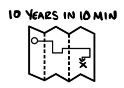

# Mười Năm Trong Mười Phút

>*Điều tốt đẹp nhất mà một con người có thể làm là giúp đồng loại của mình hiểu biết nhiều hơn.* - Charlie Munger

## Vị trí của các Mô hình Tiền tệ trong Bức tranh Tổng thể

Cuốn sách đầu tiên của tôi, *$100M Offers*, đã trả lời cho câu hỏi: *Tôi nên bán cái gì?* Câu trả lời là: một lời chào hàng tốt đến mức người ta cảm thấy ngu ngốc nếu nói không. Cuốn sách thứ hai, *$100M Leads*, đã trả lời cho câu hỏi tự nhiên tiếp theo: *Làm thế nào để tôi tìm thấy những người này?* Câu trả lời là: Bạn quảng cáo. Cuốn sách này, *$100M Money Models*, trả lời cho câu hỏi logic kế tiếp: *Làm thế nào để tôi khiến họ mua nó?* Câu trả lời chính là: Một Mô hình Tiền tệ.

## Những nội dung đã học

Chúng ta đã đi qua rất nhiều kiến thức. Tôi nghĩ việc hệ thống lại những gì đã học vào một nơi sẽ giúp bạn ghi nhớ sâu hơn. Vì vậy, tôi đã lập danh sách "ghi chép nhanh" này về những gì chúng ta đã thảo luận và lý do tại sao.

1.  **Mô hình Tiền tệ (Money Model)** là một chuỗi các lời chào hàng được thiết kế để tăng lượng khách hàng bạn có, số tiền họ trả và tốc độ họ thanh toán.
2.  **Một Mô hình Tiền tệ tốt** tạo ra nhiều lợi nhuận từ một khách hàng hơn là chi phí để tìm kiếm và phục vụ họ trong 30 ngày đầu tiên. Đó là mức tối thiểu cần đạt được.
3.  **Một Mô hình Tiền tệ 100 triệu đô la** tạo ra nhiều lợi nhuận từ *một* khách hàng hơn là chi phí để tìm kiếm và phục vụ *nhiều* khách hàng trong 30 ngày đầu tiên, điều này giúp loại bỏ rào cản về tiền mặt khi mở rộng quy mô kinh doanh.
4.  Các Mô hình Tiền tệ có **bốn loại lời chào hàng**: Lời chào hàng Thu hút, Lời chào hàng Bán thêm, Lời chào hàng Bán giảm và Lời chào hàng Duy trì.
5.  **Lời chào hàng Thu hút (Attraction Offers)** có thêm khách hàng bằng cách tặng thứ gì đó miễn phí hoặc giảm giá. Thông thường, chúng cũng kiếm được tiền bằng cách đưa ra một *thỏa thuận tốt hơn* ở mức giá cao hơn. Chúng ta đã tìm hiểu năm loại:
    * a. **Hoàn tiền khi thắng giải (Win Your Money Back):** Bạn đặt ra một mục tiêu cho khách hàng và chỉ cho họ cách đạt được nó. Nếu họ đạt được, họ đủ điều kiện để nhận lại tiền mặt hoặc nhận lại dưới dạng điểm tín dụng mua hàng.
    * b. **Quà tặng (Giveaways):** Bạn quảng cáo một cơ hội trúng giải thưởng lớn để đổi lấy thông tin liên lạc hoặc bất cứ thứ gì bạn muốn. Sau khi chọn người thắng cuộc, bạn mời chào những người còn lại mua giải thưởng đó với mức giá ưu đãi.
    * c. **Chào hàng Chim mồi (Decoy Offers):** Bạn quảng cáo một ưu đãi miễn phí hoặc giảm giá. Khi khách hàng tiềm năng muốn tìm hiểu thêm, bạn *cũng* giới thiệu một gói cao cấp có giá trị hơn. Gói cao cấp này bao gồm nhiều tính năng, lợi ích, quà tặng, cam kết bảo hành hơn, v.v.
    * d. **Mua X Tặng Y (Buy X Get Y Free):** Bạn tặng khách hàng những thứ miễn phí nếu họ mua những thứ khác bằng tiền. Thứ miễn phí càng nhiều và giá trị càng cao thì càng có nhiều người mua.
    * e. **Trả ít hơn bây giờ hoặc Trả nhiều hơn sau này:** Bạn cho mọi người lựa chọn trả đúng giá sau này HOẶC trả mức giá ưu đãi ngay bây giờ và nhận thêm các quà tặng kèm theo.
6.  **Lời chào hàng Bán thêm (Upsell Offers)** là bất cứ thứ gì bạn mời chào tiếp theo. Thông thường là các phiên bản nhiều hơn, tốt hơn hoặc mới hơn của thứ họ vừa mua. Những thứ này giúp bạn thu tiền mặt nhanh hơn. Chúng ta đã tìm hiểu bốn loại:
    * a. **Bán thêm Kiểu cổ điển (The Classic Upsell):** Bạn đưa ra giải pháp cho vấn đề tiếp theo của khách hàng ngay khoảnh khắc họ nhận thức được vấn đề đó. *Bạn không thể có X nếu thiếu Y!*
    * b. **Bán thêm kiểu Thực đơn (Menu Upsells):** Bạn nói cho khách hàng biết họ không cần những lựa chọn nào. Sau đó, nói cho họ biết những gì họ thực sự cần và cách khai thác giá trị từ đó. *Bạn không cần cái đó... bạn cần cái này.*
    * c. **Bán thêm kiểu Mỏ neo (Anchor Upsells):** Bạn đưa ra thứ đắt nhất trước tiên. Nếu khách hàng lưỡng lự, bạn đưa ra một lựa chọn thay thế rẻ hơn nhiều nhưng vẫn có thể chấp nhận được. *Đừng lo. Nếu bạn không bận tâm về X, cái này có thể phù hợp với bạn hơn.*
    * d. **Bán thêm kiểu Cộng dồn (Rollover Upsells):** Bạn ghi nhận một phần hoặc toàn bộ số tiền khách hàng đã mua trước đó vào lời chào hàng tiếp theo. *Vì bạn đã chi 500 đô la, tôi sẽ cộng dồn số tiền đó để bạn có thể ở lại trọn vẹn một năm.*
7.  **Lời chào hàng Bán giảm (Downsell Offers)** là bất cứ thứ gì bạn mời chào sau khi ai đó nói "không". Và bằng cách biến những cái lắc đầu thành những cái gật đầu, bạn kiếm được nhiều tiền hơn. Chúng ta đã tìm hiểu ba loại:
    * a. **Bán giảm bằng Gói trả góp (Payment Plan Downsells):** Bạn cung cấp cùng một sản phẩm với cùng một mức giá, nhưng họ trả trước một ít và phần còn lại trả dần theo thời gian. *Khi nào bạn có thể thanh toán? Hãy trả một nửa bây giờ và một nửa sau nhé?*
    * b. **Dùng thử có điều kiện (Trial With Penalty):** Bạn cho khách hàng dùng thử sản phẩm hoặc dịch vụ miễn phí miễn là họ đáp ứng các điều khoản của bạn. Nếu họ làm vậy, họ có cơ hội cao hơn để trở thành khách hàng trả tiền. Nếu không, họ sẽ phải trả phí. *Nếu bạn làm X, Y, Z, tôi sẽ cho bạn bắt đầu miễn phí.*
    * c. **Bán giảm bằng việc Giảm bớt tính năng (Feature Downsells):** Bạn hạ giá bằng cách thay đổi những gì khách hàng nhận được. Tôi cung cấp số lượng ít hơn, chất lượng thấp hơn, các lựa chọn thay thế rẻ hơn, hoặc cắt bỏ hoàn toàn các thành phần không bắt buộc. *Nếu bạn chấp nhận không có bảo hành, tôi có thể giảm ngay 400 đô la.*
8.  **Lời chào hàng Duy trì (Continuity Offers)** cung cấp giá trị liên tục mà khách hàng phải thanh toán định kỳ cho đến khi họ hủy. Những lời chào hàng này giúp tăng lợi nhuận từ mỗi khách hàng và mang lại cho bạn một thứ cuối cùng để bán. Chúng ta đã tìm hiểu ba loại:
    * a. **Thưởng Duy trì (Continuity Bonus Offers):** Bạn tặng khách hàng một thứ tuyệt vời nếu họ đăng ký ngay hôm nay. Thông thường, bản thân quà tặng này có giá trị lớn hơn khoản thanh toán duy trì đầu tiên. *Nếu bạn đăng ký hôm nay, bạn cũng sẽ nhận được món đồ giá trị XYZ.*
    * b. **Chiết khấu Duy trì (Continuity Discount Offers):** Bạn tặng khách hàng thời gian sử dụng miễn phí, ngay bây giờ hoặc sau này, nếu họ đăng ký ngay hôm nay.
    * c. **Ưu đãi Miễn phí quản lý (Waived Fee Offers):** Đầu tiên, bạn yêu cầu khách hàng trả một khoản phí khởi tạo như một phần của việc tham gia chương trình hàng tháng. Sau đó, bạn đề nghị giảm giá toàn bộ khoản phí đó nếu họ cam kết sử dụng lâu dài hơn. Nếu họ hủy trong thời hạn cam kết, họ sẽ phải trả khoản phí đó.
9.  **Bạn xây dựng Mô hình Tiền tệ theo từng giai đoạn một.**
    * a. Một khi tôi có lượng khách hàng ổn định -> sau đó tôi đảm bảo họ tự trang trải được chi phí một cách ổn định -> sau đó tôi đảm bảo họ chi trả được cho các khách hàng khác một cách ổn định -> sau đó tôi bắt đầu tối đa hóa giá trị lâu dài của mỗi khách hàng. Sau đó, tôi "in tiền" nhiều nhất có thể.

**Điểm mấu chốt:** Những kiến thức nằm trong các gạch đầu dòng này đã mang lại cho tôi lượng khách hàng miễn phí và mang lại lợi nhuận nhiều đến mức tôi không biết phải làm gì cho hết. Nếu được thực thi đúng cách, chúng cũng sẽ mang lại kết quả tương tự cho bạn. Và khi đó, tiền mặt sẽ không còn là rào cản cho công việc kinh doanh của bạn nữa. Tôi hy vọng cuốn sách này sẽ giúp bạn nuôi dưỡng ước mơ của mình lớn đến mức nào tùy thích.

Ngoài ra, vì bạn là một trong số ít những người thực sự hoàn thành những gì mình đã bắt đầu, tôi muốn gửi tặng bạn một món quà chia tay: một vài lời nhắn nhủ cuối cùng đã giúp tôi vượt qua những khoảng thời gian khó khăn.