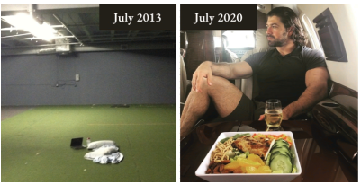
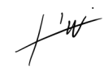

# Những suy nghĩ cuối cùng

*Bạn không có được sự tự tin bằng cách hét lên những lời khẳng định trước gương: Bạn trở nên tự tin bằng cách tích lũy cho mình một chồng bằng chứng không thể chối cãi rằng bạn chính là người mà bạn nói. Hãy để sự nỗ lực làm việc lấn át đi sự tự hoài nghi bản thân.*

>
>
>*Một bài đăng thực tế tôi đã viết vào ngày 25 tháng 7 năm 2020. Trước khi tôi công khai cuộc sống của mình.*

*Leila đã chụp tấm hình này khi tôi không để ý và tôi kiểu: "CHÀ... trông mình có vẻ đang suy tư quá nhỉ" 😂*

*Dù sao thì, đây là lần thứ hai chúng tôi đi chuyên cơ riêng. Và... nó thật tuyệt.*

*Người ta nói rằng nếu bạn đi xuống cùng con tàu, thì thắt lưng an toàn cũng chẳng cứu được bạn đâu. Bất kể điều đó—gửi tới mọi doanh nhân đang làm cha mẹ, vợ, chồng, bạn bè, những người bạn giả tạo và tất cả những ai nghi ngờ bạn phải thất vọng.*

*#1 TÔI LÀ NGƯỜI HÂM MỘ LỚN NHẤT CỦA BẠN.*

*#2 Mọi thứ sắp trở nên thực tế rồi, nên hãy bản lĩnh lên thật nhanh nhé.*

*#3 Bạn không thể thua nếu bạn không bỏ cuộc. Tôi đã từng lặp đi lặp lại điều đó với bản thân mình hết lần này đến lần khác khi tôi không còn muốn tiếp tục nữa.*

*Nếu bạn cảm thấy vô vọng... chào mừng bạn đến với giới khởi nghiệp. Nếu bạn cảm thấy mình sẽ không bao giờ làm được... bạn đang đi đúng hướng rồi đấy. Nếu bạn cảm thấy mình là một nỗi thất vọng đối với tất cả những người bạn biết... Hãy. Tiếp tục. Tiến về. Phía trước.*

*Bởi vì ở cuối cầu vồng không phải là một hũ vàng đâu.*

*Mà chính là bạn.*

*Con người thực sự của bạn.*

*Người đã luôn ở bên dưới và thì thầm vào tai bạn—chỉ một bước nữa thôi... một cuộc gọi nữa thôi... một đơn hàng nữa thôi.*

*Khi tôi nói tôi là người hâm mộ lớn nhất của bạn, đó là vì tôi đã từng ở đó. Và tôi hiểu bạn vì tôi biết CHÍNH XÁC CẢM GIÁC đó là như thế nào. Có cả 100% sự tự tin và 1.000% sự hoài nghi. Cùng một lúc. Đây là tất cả những gì bạn cần làm:*

*Hãy tiếp tục tiến bước.*

*Hãy tiếp tục chiến đấu.*

*Hãy tiếp tục cải thiện.*

*Thời của bạn sẽ đến.*

*Thành công là sự trả thù duy nhất.*

***

Vì vậy, ngay bây giờ bạn có thể đang ở vị trí của tôi khi tôi mới bắt đầu. Làm việc trong một chiếc "quan tài bê tông", dưới ánh đèn huỳnh quang chói mắt, muốn trốn thoát. Bạn có thể bị choáng ngợp bởi tất cả những thứ bạn phải làm để thành công. Nhưng giữa sự bất định đó, hãy biết rằng mọi doanh nhân, dù là trong quá khứ hay hiện tại, đều đang gánh vác gánh nặng đó cùng bạn. Tôi đã từng ở đó. Họ đã từng ở đó. Bạn không đơn độc. Tôi chia sẻ những câu chuyện này như chính những gì tôi đã trải qua để bạn có thể hưởng lợi từ chúng như tôi đã từng.

Vì vậy, đây là lời hứa của tôi: hãy làm theo các bài học, tiền sẽ đến.

Hãy là một trong số không (Be one of zero).

**Alex Hormozi, Nhà sáng lập, Acquisition.com**

**Tái bút:** Tôi có một vài món quà miễn phí dành cho bạn vì đã hoàn thành những gì bạn bắt đầu.