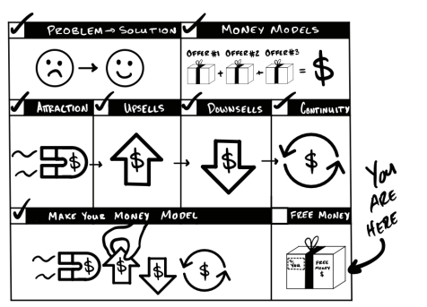

# Quà tặng miễn phí (Free Gifts)

Giống như những đoạn giới thiệu ngắn sau khi phim kết thúc, nếu bạn vẫn còn theo dõi đến đây, tôi muốn dành tặng bạn một vài món quà thú vị.

1.  **Nếu bạn đang loay hoay không biết nên bán hàng cho ai**, tôi đã phát hành một chương có tên là "Hình mẫu khách hàng đầu tiên của bạn" (Your First Avatar). Bạn có thể nhận miễn phí tại **[Acquisition.com/avatar](https://Acquisition.com/avatar)**. Chỉ cần nhập email và chúng tôi sẽ gửi tài liệu qua cho bạn.
2.  **Nếu bạn đang gặp khó khăn trong việc xác định nên bán cái gì**, bạn có thể lên Amazon hoặc bất cứ nơi nào bạn hay mua sách và tìm từ khóa "Alex Hormozi" cùng với cuốn "$100M Offers". Nó sẽ giúp bạn đi đúng hướng.
3.  **Nếu bạn đang chật vật để khiến mọi người quan tâm đến thứ bạn bán**, hãy lên Amazon hoặc các trang bán sách và tìm "Alex Hormozi" cùng cuốn "$100M Leads". Đây sẽ là kim chỉ nam cho bạn.
4.  **Nếu công ty của bạn có lợi nhuận (EBITDA) trên 1 triệu đô**, chúng tôi rất sẵn lòng giúp bạn mở rộng quy mô. Tôi thực sự hạnh phúc khi thấy nhiều doanh nghiệp lớn mạnh nhanh hơn cả công ty của tôi *bởi vì* họ tránh được những sai lầm mà tôi từng mắc phải. Nếu bạn muốn chúng tôi trực tiếp kiểm tra "bộ máy" vận hành và hỗ trợ, hãy truy cập **Acquisition.com**.
5.  **Nếu bạn muốn làm việc tại Acquisition.com hoặc tại một trong các công ty con của chúng tôi**—chúng tôi rất thích tuyển dụng những người thuộc cộng đồng #mozination. Khoản đầu tư mang lại lợi nhuận tốt nhất của chúng tôi chính là đầu tư vào những con người tuyệt vời. Hãy truy cập **[Acquisition.com/careers/open-jobs](https://Acquisition.com/careers/open-jobs)** để xem tất cả các vị trí đang tuyển dụng.
6.  **Để tải sách miễn phí và xem các video đào tạo** đi kèm với cuốn sách này, hãy truy cập **[Acquisition.com/training/money](https://Acquisition.com/training/money)**.
7.  **Nếu bạn thích nghe podcast và muốn nghe nhiều hơn**, tại thời điểm tôi viết những dòng này, podcast của tôi đang nằm trong top 5 về khởi nghiệp và top 15 về kinh doanh tại Mỹ. Bạn có thể tìm tên "Alex Hormozi" trên bất kỳ nền tảng podcast nào, hoặc truy cập **[Acquisition.com/podcast](https://Acquisition.com/podcast)**. Tôi thường chia sẻ những câu chuyện hữu ích, các bài học giá trị và những mô hình tư duy cốt lõi mà tôi áp dụng mỗi ngày.
8.  **Nếu bạn thích xem video**, chúng tôi đã đầu tư rất nhiều nguồn lực vào các chương trình đào tạo miễn phí dành cho tất cả mọi người. Mục tiêu của chúng tôi là làm cho chúng tốt hơn bất kỳ nội dung trả phí nào ngoài kia, và tôi để bạn tự đánh giá xem mình có thành công hay không. Bạn có thể tìm thấy video của chúng tôi trên YouTube hoặc các nền tảng video khác bằng cách tìm kiếm "Alex Hormozi".
9.  **Và nếu bạn thích các video ngắn**, hãy xem các nội dung súc tích mà chúng tôi đăng tải hàng ngày tại **[Acquisition.com/media](https://Acquisition.com/media)**. Bạn sẽ thấy tất cả các kênh chúng tôi có mặt và có thể chọn kênh mình thích nhất.

Và lời cuối cùng, xin cảm ơn bạn một lần nữa. Hãy trở thành một người hào sảng và **chia sẻ điều này với các doanh nhân khác bằng cách để lại một đánh giá**. Điều đó có ý nghĩa cực kỳ lớn đối với tôi. Tôi đang gửi tới bạn những "năng lượng xây dựng doanh nghiệp" từ bàn làm việc của mình. Tôi dành rất nhiều thời gian ở đây, nên năng lượng này cực kỳ dồi dào đấy. Chúc cho khát vọng của bạn luôn lớn hơn mọi trở ngại.