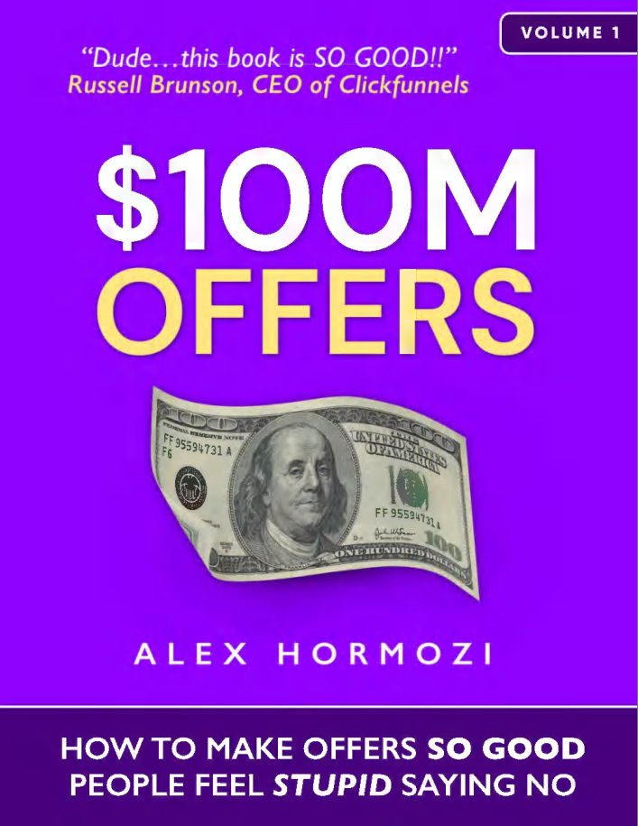

**ACQUISITION.COM TẬP I: $100M OFFERS**

LÀM THẾ NÀO ĐỂ ĐƯA RA NHỮNG LỜI ĐỀ NGHỊ HẤP DẪN ĐẾN MỨC KHÁCH HÀNG SẼ CẢM THẤY THẬT NGỐC NGHẾCH NẾU TỪ CHỐI?

ALEX HORMOZI

**Bản quyền © 2021 thuộc về Alex Hormozi**

Bản quyền được bảo lưu. Không một phần nào của ấn phẩm này được phép sao chép, phân phối hoặc truyền tải dưới bất kỳ hình thức nào hoặc bằng bất kỳ phương tiện nào, bao gồm photocopy, ghi âm hoặc các phương pháp điện tử hoặc cơ khí khác, mà không có sự cho phép bằng văn bản trước của nhà xuất bản, ngoại trừ trường hợp các câu hỏi ngắn gọn được nêu trong các bài phê bình và một số mục đích sử dụng phi thương mại khác được luật bản quyền cho phép. Để yêu cầu cấp phép, vui lòng viết thư cho nhà xuất bản theo địa chỉ bên dưới.

Mã ISBN sách điện tử: 978-1-7374757-0-5

Acquisition.com, LLC

3610-2 N Josey Lane #223

Carrollton, TX 75007-3150

Thiết kế bìa bởi Charlotte Chan Mikkelsen

Ảnh chụp, tranh minh họa và thiết kế bố cục do bởi Alex Hormozi.

# **TUYÊN BỐ MIỄN TRỪ TRÁCH NHIỆM**

Nội dung được cung cấp trong cuốn sách này nhằm mục đích cung cấp thông tin hữu ích về các chủ đề được thảo luận. Cuốn sách này không nhằm mục đích sử dụng, và cũng không nên được sử dụng, để chẩn đoán hoặc điều trị bất kỳ tình trạng y tế nào. Các số liệu trong cuốn sách này chỉ mang tính lý thuyết và được sử dụng cho mục đích minh họa. Nhà xuất bản và tác giả không chịu trách nhiệm về bất kỳ hành động nào bạn thực hiện hoặc không thực hiện do đọc cuốn sách này, và không chịu trách nhiệm pháp lý đối với bất kỳ thiệt hại hoặc hậu quả tiêu cực nào từ hành động hoặc sự không hành động đối với bất kỳ người nào đọc hoặc làm theo thông tin trong cuốn sách này. Các tài liệu tham khảo chỉ được cung cấp cho mục đích thông tin và không cấu thành sự chứng thực bất kỳ trang web hoặc nguồn nào khác. Người đọc cũng nên lưu ý rằng các trang web được liệt kê trong cuốn sách này có thể thay đổi hoặc trở nên lỗi thời.

# NHỮNG CHIA SẺ TỪ NGƯỜI KHÁC

>“Sau khi dành ra một ngày làm việc cùng Alex, chúng tôi đã tăng thêm **5 TRIỆU ĐÔ LA LỢI NHUẬN MỖI NĂM** mà không cần thêm bất kỳ dịch vụ mới nào. Khi Alex nói về acquisition, bạn nên lắng nghe (miễn là bạn không ghét tiền).”
>
>--BROOKE CASTILLO, CEO, LIFE COACH SCHOOL

>“Sự nghiệp của tôi có thể chia làm hai chương: chương đầu tiên là 15 năm ròng rã 'đâm đầu vào tường' để tìm hiểu lý do tại sao tôi không phát huy được hết tiềm năng của mình. Chương thứ hai bắt đầu khi tôi đọc cuốn '$100M Offers' của Alex Hormozi. Chính lúc đó, tôi đã có đủ tự tin để biết chính xác làm thế nào để đạt được thành công mà tôi biết mình có khả năng làm được. Nếu bạn là một chủ doanh nghiệp đã chán việc phải hài lòng với những gì thấp hơn tiềm năng của mình, cuốn sách này sẽ nhanh chóng cho bạn thấy đó không phải lỗi của bạn; chỉ là chưa có ai dạy bạn cách tạo ra những lời chào hàng không thể cưỡng lại. Cuốn sách này sẽ thay đổi điều đó chỉ trong vài chương đầu. Hãy coi cuốn sách này là chương thứ hai của cuộc đời bạn. Nó thực sự là một bước ngoặt thay đổi hoàn toàn cuộc chơi.”
>
>--RYAN DANIEL MORAN, NGƯỜI SÁNG LẬP, CAPITALISM.COM

>“Chúng tôi biết đến Alex và lập tức mua cuốn sách của anh ấy. Đó là cuốn sách kinh doanh hay nhất mà tôi từng đọc. Có lẽ điều lớn nhất tôi học được từ anh ấy là trong kinh doanh, đã rất nhiều lần bạn muốn thu phí khách hàng cao hơn nhưng lại cảm thấy tội lỗi kiểu ‘Ôi trời, mình có thực sự làm được thế này không?’. Nhưng tôi nghĩ không ai giỏi hơn Alex trong việc đóng gói sản phẩm và định giá để bạn không chỉ có thể tăng lợi nhuận cho doanh nghiệp của mình, mà đồng thời còn gia tăng giá trị cho khách hàng. Kể từ khi chúng tôi bắt đầu làm việc với anh ấy... chỉ trong vòng hai tháng... doanh thu của chúng tôi đã đạt mức 10 triệu đô/năm... **TĂNG GẤP ĐÔI NGAY LẬP TỨC**. Và chỉ mới hai tháng kể từ khi liên lạc với anh ấy, doanh nghiệp của chúng tôi hiện đang trên đà đạt mức doanh thu 23 triệu đô/năm. Tất cả chỉ nhờ việc thay đổi cách định giá, đóng gói sản phẩm, đồng thời mang lại kết quả và đầu ra tốt hơn cho những khách hàng mà chúng tôi hợp tác.”
>
>--ANDREW ARGUE, NGƯỜI SÁNG LẬP, CEO ACCOUNTINGTAX.COM

# **NGUYÊN TẮC HƯỚNG DẪN**

**Không có quy tắc nào cả.**

# **Lời Cảm Ơn**

>**Gửi Leila:**
>
>Em là người "vào sinh ra tử" cùng anh: 
>*một thuật ngữ dùng để mô tả một người (thường là phụ nữ) sẵn lòng làm bất cứ điều gì cho bạn đời, bạn bè hoặc gia đình của họ, ngay cả khi phải đối mặt với nguy hiểm.* 
>Anh không thể làm được điều này nếu thiếu em... và anh cũng chẳng muốn làm nó mà không có em. 
>Em khiến việc thức dậy mỗi ngày đều trở nên xứng đáng. 
>Cảm ơn em vì đã luôn là chính mình một cách trọn vẹn nhất. 
>Em quả là một người đồng hành chất lừ.

>**Gửi Trevor:**
>
>Cậu là người bạn tốt nhất mà một gã có thể mong đợi. 
>Cảm ơn cậu vì đã dành hàng giờ đồng hồ để cùng tớ "mổ xẻ" những ý tưởng để rồi chúng trở thành cuốn sách này. 
>Nó sẽ chẳng thể tốt bằng một nửa hiện tại nếu thiếu đi nỗ lực không ngừng nghỉ của cậu trong việc đơn giản hóa và làm rõ mọi thứ. 
>Mãi biết ơn tình bạn của chúng ta. 
>Cậu khiến tớ cảm thấy bớt cô độc hơn trong thế giới này. 
>Nâng ly chúc mừng cho việc chúng ta sẽ cùng già đi và trở nên khó tính nhé.

# MỤC LỤC

**Bắt đầu tại đây**

**Phần I: Mọi chuyện bắt đầu như thế nào** 
&emsp;1\. Mọi chuyện bắt đầu như thế nào 
&emsp;2. Những lời chào hàng Grand Slam

**Phần II: Định giá** 
&emsp;3. Định giá: Vấn đề về hàng hóa phổ thông 
&emsp;4. Định giá: Tìm kiếm thị trường phù hợp -- Một đám đông đang khao khát 
&emsp;5. Định giá: Hãy thu phí xứng đáng với giá trị mang lại

**Phần III: Giá trị - Tạo lập lời chào hàng của bạn** 
&emsp;6. Lời chào hàng giá trị: Phương trình giá trị 
&emsp;7. Thiện chí miễn phí 
&emsp;8. Lời chào hàng giá trị: Quy trình tư duy 
&emsp;9. Lời chào hàng giá trị: Tạo lập lời chào hàng Grand Slam Phần I: Vấn đề & Giải pháp 
&emsp;10. Lời chào hàng giá trị: Tạo lập lời chào hàng Grand Slam Phần II: Cắt tỉa & Chồng lớp 

**Phần IV: Nâng cấp lời chào hàng của bạn** 
&emsp;11. Nâng cấp lời chào hàng: Sự khan hiếm, Tính cấp bách, Tiền thưởng, Cam kết, và Đặt tên 
&emsp;12. Nâng cấp lời chào hàng: Sự khan hiếm 
&emsp;13. Nâng cấp lời chào hàng: Tính cấp bách 
&emsp;14. Nâng cấp lời chào hàng: Tiền thưởng 
&emsp;15. Nâng cấp lời chào hàng: Cam kết 
&emsp;16. Nâng cấp lời chào hàng: Đặt tên

**Phần V: Thực thi** 
&emsp;100.000 đô la đầu tiên của bạn 
 

# **BẮT ĐẦU Ở ĐÂY**

>"Những khoản lợi nhuận khổng lồ thường đến từ việc đặt cược ngược lại với những quan niệm thông thường, dù những quan niệm đó thường đúng. Nếu có 10% cơ hội nhận được mức lợi nhuận gấp 100 lần, bạn nên đặt cược vào đó mọi lúc. Nhưng bạn vẫn sẽ sai chín trên mười lần... Tất cả chúng ta đều biết rằng nếu bạn vung chày hết sức để đưa bóng ra khỏi sân (swing for the fences), bạn sẽ bị loại (strike out) rất nhiều, nhưng bạn cũng sẽ ghi được vài cú home run. Tuy nhiên, sự khác biệt giữa bóng chày và kinh doanh là bóng chày có sự phân bổ kết quả bị giới hạn. Khi bạn vung chày, bất kể bạn đánh bóng tốt đến đâu, số điểm tối đa bạn có thể nhận được là bốn. Trong kinh doanh, thỉnh thoảng khi bạn bước lên vị trí đánh bóng, bạn có thể ghi được 1.000 điểm. Sự phân bổ lợi nhuận theo mô hình đuôi dài này là lý do tại sao sự táo bạo lại quan trọng đến vậy. Những thắng lợi lớn sẽ bù đắp cho rất nhiều thử nghiệm thất bại."
>
>-- **JEFF BEZOS**

Là những doanh nhân, chúng ta đặt cược mỗi ngày. Chúng ta là những con bạc — đặt cược những đồng tiền xương máu của mình vào nhân công, hàng tồn kho, tiền thuê mặt bằng, marketing, v.v., tất cả đều với hy vọng nhận được một khoản chi trả cao hơn. Thường thì chúng ta thua. Nhưng đôi khi, chúng ta thắng và thắng LỚN.

Tuy nhiên, có một sự khác biệt giữa cờ bạc trong kinh doanh và cờ bạc trong sòng bạc. Ở sòng bạc, các tỷ lệ cược luôn chống lại bạn. Với kỹ năng, bạn có thể cải thiện chúng, nhưng không bao giờ đánh bại được nhà cái. Ngược lại, trong kinh doanh, bạn có thể cải thiện kỹ năng của mình để chuyển dịch tỷ lệ cược có lợi cho mình. Nói một cách đơn giản, với đủ kỹ năng, bạn có thể trở thành "nhà cái".

Sau khi bắt đầu thực hiện một loạt sách về thâu tóm khách hàng (acquisition), một điều trở nên rõ ràng là tôi không thể nói về bất kỳ chủ đề nào khác mà không giải quyết vấn đề về **lời chào hàng (the offer)** trước tiên: điểm khởi đầu của bất kỳ cuộc trò chuyện nào để bắt đầu một giao dịch với khách hàng. Đó chính xác là những gì bạn cung cấp cho họ để đổi lấy tiền của họ. Đó là nơi mọi thứ bắt đầu.

Cuốn sách này nói về cách tạo ra những lời chào hàng mang lại lợi nhuận. Cụ thể là làm thế nào để biến những đồng tiền quảng cáo thành lợi nhuận (khổng lồ) một cách bền vững bằng cách kết hợp các chiến lược định giá, giá trị, cam kết và đặt tên. Tôi gọi sự kết hợp đúng đắn của các thành phần này là: **Lời chào hàng Grand Slam (A Grand Slam Offer)**.

Tôi chọn thuật ngữ này một phần để bày tỏ sự trân trọng đối với câu trích dẫn phía trên của người sáng lập Amazon, Jeff Bezos, và vì giống như một cú "grand slam" trong bóng chày, một Lời chào hàng Grand Slam vừa rất tốt vừa rất hiếm. Ngoài ra, để mở rộng phép ẩn dụ về bóng chày, việc tạo ra một Lời chào hàng Grand Slam không tốn nhiều công sức hơn là một lần bị loại (strike out). Sự khác biệt được quyết định bởi kỹ năng của nhà marketing và mức độ kết nối hiệu quả giữa lời chào hàng của anh ta với mong muốn của khán giả. Trong kinh doanh, bạn có thể có những lời chào hàng ở mức bình thường: những cú "đánh đơn" (singles) và "đánh đôi" (doubles) giúp duy trì cuộc chơi, thanh toán các hóa đơn và duy trì hoạt động. Nhưng không giống như bóng chày, nơi một cú grand slam ghi được tối đa bốn điểm, một Lời chào hàng Grand Slam trong thế giới kinh doanh có thể giúp bạn ghi được lợi nhuận gấp ngàn lần và dẫn đến một thế giới nơi bạn không bao giờ cần phải làm việc nữa. Nó giống như việc đánh bóng tốt đến mức trong một lần đứng ở vị trí đánh bóng duy nhất, bạn nghiễm nhiên giành chiến thắng trong mọi giải World Series trong một trăm năm tới.

Phải mất nhiều năm luyện tập để biến một việc phức tạp như đánh một quả bóng nhanh ở giải đấu lớn lên hàng ghế khán giả trông như thể không tốn sức. Tư thế, tầm nhìn, sự dự đoán, tốc độ bóng, tốc độ chày và vị trí hông của bạn đều phải hoàn hảo. Trong marketing và thâu tóm khách hàng (quá trình tìm kiếm khách hàng mới), cũng có rất nhiều biến số tương tự phải được căn chỉnh đồng bộ để thực sự "đánh bóng ra khỏi sân". Nhưng với sự luyện tập và kỹ năng đủ lớn, bạn có thể biến thế giới thâu tóm khách hàng đầy hoang dã — nơi sẽ ném những quả bóng xoáy vào bạn mỗi ngày — thành một cuộc thi đấu home run, đánh hết lời chào hàng này đến lời chào hàng khác ra khỏi sân vận động. Đối với những người khác, thành công của bạn trông sẽ thật khó tin. Nhưng với bạn, nó sẽ giống như "chỉ là một ngày làm việc bình thường". Những người đánh bóng vĩ đại nhất mọi thời đại cũng có nhiều lần bị loại, cũng giống như có nhiều lời chào hàng thất bại trong hồ sơ của các nhà marketing lớn. Chúng ta học kỹ năng thông qua thất bại và thực hành. Chúng ta thực hiện điều này khi biết rằng chín trên mười lần chúng ta sẽ sai. Chúng ta vẫn hành động táo bạo, hy vọng vào một lời chào hàng mà chúng ta kết nối tốt đến mức nó mang lại một khoản lợi nhuận lớn.

Tin tốt là trong kinh doanh, bạn chỉ cần đánh trúng **một** Lời chào hàng Grand Slam là có thể nghỉ hưu mãi mãi. Tôi đã làm điều này bốn hoặc năm lần trong đời. Về hồ sơ thành tích, tôi có mức lợi nhuận trọn đời là 36:1 trên số tiền quảng cáo trong suốt sự nghiệp kinh doanh của mình. Nếu muốn, hãy coi đây là "trung bình đánh bóng" trọn đời của tôi. Điều đó có nghĩa là cứ mỗi 1 đô la tôi chi cho quảng cáo, tôi nhận lại được 36 đô la, tức là mức lợi nhuận 3600%. Đó là mức **trung bình** của tôi trong tám năm. Và tôi vẫn tiếp tục cải thiện.

Cuốn sách này là nỗ lực của tôi nhằm chia sẻ kỹ năng đó với bạn, tập trung cụ thể vào việc xây dựng các Lời chào hàng Grand Slam, để bạn có thể trải nghiệm những cấp độ thành công tương tự. Đây cũng là cuốn đầu tiên trong chuỗi sách nhằm giúp các doanh nhân đạt được tự do tài chính, nói một cách bình dân "sống không cần tiền". Các cuốn sách tiếp theo trong loạt bài này sẽ đi sâu hơn vào việc tìm kiếm thêm khách hàng, chuyển đổi thêm nhiều khách hàng tiềm năng thành khách hàng thực tế, làm cho những khách hàng đó có giá trị cao hơn, và những bài học khác mà tôi ước mình đã học được sớm hơn khi mở rộng quy mô các doanh nghiệp của mình.

>**Mẹo chuyên gia: Học nhanh hơn, sâu hơn bằng cách vừa đọc vừa nghe đồng thời**
>
>Đây là một "mẹo nhỏ" cuộc sống mà tôi đã khám phá ra từ lâu.... Nếu bạn nghe sách nói trong khi đọc ebook hoặc sách giấy, bạn sẽ tăng tốc độ đọc và ghi nhớ được nhiều thông tin hơn. Các nội dung đang được lưu trữ ở nhiều nơi hơn trong não bộ của bạn. Đây là cách tôi đọc hầu hết những thứ đáng đọc. Tôi đã định giá các sản phẩm của mình rẻ nhất có thể theo quy định của các nền tảng, vì vậy đây không phải là một mánh khóe để kiếm thêm 99 xu lẻ — tôi hứa đấy. Nếu bạn muốn thử, hãy cứ tải phiên bản âm thanh và tự mình kiểm chứng. Bạn có thể thấy nó giá trị như tôi đã thấy (với tư cách là một người gặp khó khăn trong việc giữ tập trung). Tôi đã mất hai ngày để đọc to cuốn sách này và ghi âm lại. Tôi nghĩ mình nên đưa "mẹo" này vào đầu cuốn sách để bạn có cơ hội thực hiện nếu bạn thấy chương đầu tiên này đủ giá trị để bạn dành sự quan tâm.