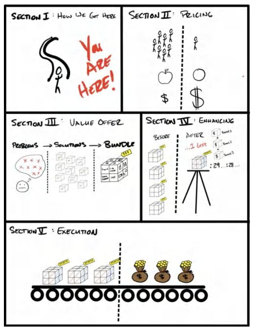
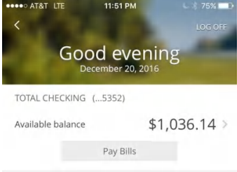
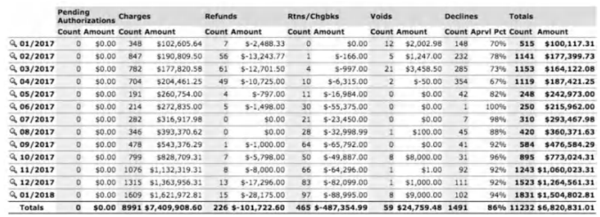
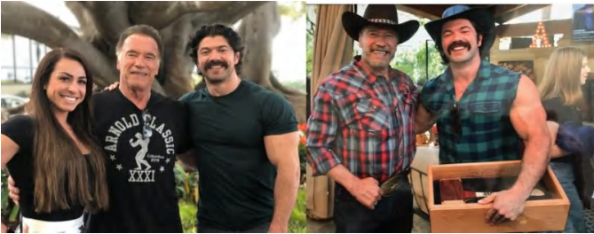
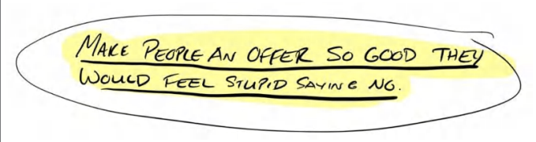

# **PHẦN I: MỌI CHUYỆN BẮT ĐẦU NHƯ THẾ NÀO?** *SỰ THẬT PHŨ PHÀNG*

>*"Phép màu sẽ tìm đến những người có trái tim thuần khiết, ngay cả khi mọi thứ tưởng chừng như đã mất."* - MORGAN RHODES

## **1. Mọi chuyện bắt đầu như thế nào**

**Ngày 24 tháng 12 năm 2016. Đêm Giáng sinh.**

Căn phòng tối đen như mực. Giày của tôi dính chặt xuống sàn nhà đầy vết nước ngọt khô khốc và những mẩu kẹo vụn. Mũi tôi nồng nặc mùi bắp rang bơ ỉu. Chúng tôi đến rạp quá muộn để có được chỗ ngồi tốt, nên đành phải ép mình ngồi sát hàng đầu. Chỉ cách tôi vài hàng ghế, luồng sáng rực rỡ từ máy chiếu chiếm trọn tầm mắt. Trong ánh sáng phản chiếu ấy, tôi có thể thấy rõ đường nét khuôn mặt gia đình Leila. Trông họ như thể đang bị thôi miên vậy.

Tôi ghen tị với họ. Họ ngồi đó, say sưa tận hưởng kỳ nghỉ lễ Giáng sinh được trả lương. *Chắc là thích lắm.*

Bất kỳ ai khác cũng sẽ không nhận ra, nhưng Leila – bạn gái tôi lúc đó – hiểu tôi quá rõ. Người ngoài sẽ nghĩ tôi đang xem phim, nhưng Leila biết tôi đang nhìn chằm chằm vào màn hình một cách vô định, mắt không hề dõi theo diễn biến phim. Mặt tôi tái mét. Gò má và xương hàm hốc hác hẳn đi. Những tuần căng thẳng kéo dài đã giết chết cảm giác thèm ăn của tôi.

"Anh sao vậy?" cô ấy hỏi.

Tôi không trả lời.

Cô ấy đặt tay lên tay tôi để gây sự chú ý. Tôi vẫn không phản ứng. Chỉ vài giây sau, ngón tay cô ấy siết chặt lấy cổ tay tôi, cô ấy nhìn tôi, ánh mắt tìm kiếm sự kết nối. "Tim anh đập nhanh quá," cô ấy thì thầm, đầy lo lắng.

Chẳng cần hỏi han, cô ấy tự đo mạch cho tôi.

100 nhịp mỗi phút. Gần gấp đôi mức bình thường của một người đàn ông 27 tuổi khỏe mạnh đang "nghỉ ngơi" trong một căn phòng mát mẻ và tối.

"Có chuyện gì đang xảy ra thế?" cô ấy hỏi gắt hơn, nhưng vẫn chỉ là thì thầm.

Sự thật là, tôi đang kinh hoàng.

*Vài giờ trước đó...*

Tôi trông chẳng khác gì một gã khổng lồ. Tôi ngồi co rùm trên chiếc ghế chơi game mini của trẻ con. Đầu gối gần như chạm ngực, dù bàn chân đã đặt vững trên sàn nhà trải thảm màu be cũ kỹ. Chiếc laptop đặt trên hai đầu gối co gập cảm giác nóng ran. Búp bê và đồ chơi vứt vất vưởng xung quanh. Chúng nhìn chằm chằm vào tôi với đôi mắt to tròn và nụ cười hở răng, bất động. Tôi đã là nguồn giải trí của chúng suốt vài tuần qua.

Tôi đang ở nhà bố mẹ Leila. Họ vừa lên chức ông bà và dùng phòng ngủ phụ này làm phòng chơi mỗi khi các cháu đến chơi. Tôi không có chỗ ở, nên họ để tôi và Leila ở lại đó "bao lâu tùy thích". Họ cho phép tôi dùng phòng chơi của trẻ con làm văn phòng cho "công việc kinh doanh" của mình – thứ mà vào thời điểm đó cảm giác cũng ảo chẳng kém gì những câu chuyện họ kể cho đám cháu nghe trong căn phòng này.

Tôi thực sự cảm thấy mình như đang chơi trò đóng vai. Ngoại trừ việc rủi ro là có thật. Và đây chính là cuộc đời tôi.

Tai tôi nóng bừng và đỏ ửng vì bị điện thoại áp chặt suốt nhiều giờ đồng hồ. Tôi liên tục đổi tay vì cánh tay đã mỏi nhừ do cầm điện thoại quá lâu.

"Tôi xin lỗi anh Hormozi," giọng nói ở đầu dây bên kia vang lên, "chúng tôi phải giữ lại số tiền này trong sáu tháng tới. Chúng tôi phát hiện một vài hoạt động bất thường, nên đây là biện pháp phòng ngừa."

"Anh đùa tôi đấy à, 120 ngàn đô cơ mà," tôi nói. "Một biện pháp 'phòng ngừa' ư!?"

"Tôi rất tiếc thưa ông, đội ngũ thẩm định của chúng tôi—"

"Rồi, tôi nghe rồi," tôi ngắt lời ông ta. "Tôi không chấp nhận chuyện đó."

"Thưa ông, đây không phải quyền của tôi, đó chỉ là chính sá—"

"Thế tôi phải nói gì với nhân viên bán hàng của tôi, người đang có một đứa con và một đứa nữa sắp chào đời? Anh định bảo với anh ta rằng anh ta sẽ không thể mua đồ ăn cho người vợ đang mang thai và đứa con mới lọt lòng à? Anh định trả tiền trả góp nhà cho anh ta thay tôi chắc?"

Tôi đang sục sôi giận dữ.

"Thưa ông—" ông ta bắt đầu lại bằng một giọng thờ ơ lạnh lùng, chỉ cố gắng truyền đạt xong tin tức.

"Đó không phải tiền của các người." Sự hung hăng của tôi nhanh chóng chuyển thành tuyệt vọng. "Chết tiệt, ít nhất hãy gửi cho tôi một nửa để tôi có thể trả lương cho nhân viên," tôi cầu xin. "Hôm nay là đêm Giáng sinh, vì chúa."

"Thưa ông, chúng tôi sẽ giữ toàn bộ số tiền của ông trong sáu tháng tới theo thỏa thuận..." Giọng nói đó nhỏ dần rồi mất hút.

*Khốn kiếp.*

Tôi cúp máy và kiểm tra tài khoản của mình. *$23,036.*

Tôi nợ nhân viên bán hàng của mình khoản hoa hồng $22,000 cho doanh số $120,000 mà tôi không bao giờ nhận được tiền.

Chẳng muốn để bản thân có cơ hội suy nghĩ thêm, tôi chuyển khoản cho anh ta.

*- Thanh toán $22,000 thành công.*

*Số dư $1,036.*

*Khốn kiếp.*

>
>
>*Tôi đã chụp ảnh màn hình tài khoản ngân hàng của mình vì tôi biết rằng một ngày nào đó tôi sẽ kể câu chuyện này.*

Ánh nắng mặt trời làm tôi chói mắt khi chúng tôi bước ra khỏi buổi chiếu phim ban ngày. Những gia đình khác đang hối hả qua lại nơi cửa xoay, tạo nên những kỷ niệm hạnh phúc cho riêng họ. Tôi thì đang thẫn thờ. Leila dắt tôi ra xe, bàn tay cô ấy nắm chặt lấy tay tôi.

"Có chuyện gì vậy anh? Đã xảy ra chuyện gì thế?" cô ấy hỏi.

"Tiền không về nữa rồi."

"Ý anh là sao?" cô ấy hỏi lại. "Nó bị trì hoãn à?"

Tôi thở hắt ra trong sự thất bại. "Họ giữ lại hết rồi."

"Họ có thể làm thế sao!?"

"Có vẻ là vậy," tôi nói một cách cam chịu, cố gắng giữ bình tĩnh trước mặt bố mẹ cô ấy.

"Thế còn tiền hoa hồng anh định tính sao?"

"Anh đã trả cho cậu ấy rồi. Toàn bộ." Tôi nói mà không nhìn cô ấy.

Sự lo lắng của Leila chuyển sang thành nỗi khiếp sợ.

Chúng tôi ngồi im lặng suốt quãng đường về nhà. Tôi nhìn chằm chằm ra ngoài cửa sổ. Cô ấy nắm lấy tay tôi. Điều đó an ủi tôi nhiều hơn tôi tưởng. *Chúng ta sẽ vượt qua chuyện này thôi.*

*30 ngày trước đó...*

Tôi đã quyết định dồn toàn lực vào công việc kinh doanh mới mang tên "Gym Launch". Ý tưởng là thế này: Tôi sẽ bay khắp đất nước đến các phòng gym và giúp họ lấp đầy công suất bằng phương pháp mới dựa trên một gói ưu đãi mà tôi đã hoàn thiện khi còn sở hữu chuỗi phòng gym của riêng mình.

Trước thời điểm đó, tôi đã bán năm trong số sáu phòng gym của mình. Số tiền bán được — thành quả cả đời tôi — đã được nộp vào một tài khoản chung với một đối tác mới. Số tiền này đáng lẽ là vốn mồi cho công ty mới của chúng tôi.

*Cuối cùng thì tôi cũng sắp chạm tay vào thành công.*

Chuông báo thức reo. Tôi uể oải quờ tay qua bàn cạnh giường một cách vô định. Tôi tắt báo thức, trong khi Leila vẫn ngủ say bất chấp tiếng động.

Tôi nằm đó im lặng, mở tài khoản ngân hàng lên xem — một thói quen hàng ngày. Số dư báo: $300.

Đợi đã. Không thể nào. Hôm qua vẫn còn $46,000 trong này mà.

Tim tôi đập loạn xạ. Nhìn kỹ hơn, tôi thấy dòng chữ: *“-$45,700 Thanh toán Thành công.”* Tôi phát điên lên.

Số tiền bán tất cả các phòng gym đã không còn. Tôi kiểm tra xem tiền đã đi đâu. Đến chỗ gã “đối tác” của tôi. Hắn đã rút sạch tiền.

*Khốn kiếp.*

Bốn năm cuộc đời tôi đã tan biến nhanh như thế đấy. Tôi chính thức không còn gì cả, thậm chí là âm nặng. Không phòng gym. Không thiết bị. Không nhân viên. Không còn gì hết.

Tôi cảm thấy tâm hồn mình như đã chết.

Họa vô đơn chí, cũng trong khoảng 30 ngày đó, mẹ tôi rơi vào tình trạng nguy kịch vì một vụ tai nạn suýt chết (vẫn đang phải giám sát 24/24), còn tôi thì làm nát bấy chiếc xe của mình trong một vụ va chạm trực diện ở tốc độ 60 dặm/giờ và nhận được một biên bản phạt vì lái xe khi có nồng độ cồn như một "phần thưởng an ủi".

Tất cả những chuyện đó như giọt nước tràn ly. Điểm sáng duy nhất của tôi lúc này là đang bán một gói "thử thách" mới tại một phòng gym và thu toàn bộ tiền mặt trả trước dưới dạng "phí" xoay chuyển tình thế kinh doanh cho họ.

Vì vậy, tôi đã làm việc duy nhất mà mình biết. Tôi *bán hàng*. Nhân viên bán hàng của tôi đã đạt doanh số $120,000 trong một tháng duy nhất, và tôi nợ cậu ấy $22,000 tiền hoa hồng.

Vấn đề là khoản $120,000 đó không bao giờ tới.

"Chúng ta cần nói chuyện," tôi nói khi tôi và Leila đi vào phòng khác. Tôi lấy hết can đảm để nói nhưng mắt lại dán chặt xuống sàn nhà vì xấu hổ.

"Anh không còn gì cả," tôi nói với cô ấy. "Anh là một con tàu đang đắm, và em không nhất thiết phải ở lại với anh."

Cô ấy nắm lấy cằm tôi và kéo mặt tôi hướng về phía cô ấy để nhìn thẳng vào mắt tôi: "Em có thể ngủ cùng anh dưới gầm cầu nếu chuyện đó xảy ra." Đáng lẽ tôi đã khóc vì hạnh phúc, nhưng tôi quá kiệt quệ về cảm xúc nên phản ứng của tôi trông có vẻ thờ ơ.

*Nếu là tôi, tôi sẽ không ở lại với mình.*

"Chúng ta vẫn sẽ tiến hành các đợt triển khai bắt đầu từ ngày mai chứ?" cô ấy hỏi. "Tất cả bạn bè của em đều đã nghỉ việc để làm việc này." Cô ấy nói thẳng vào vấn đề, nhưng nó vẫn làm tôi nhói lòng. Tôi cảm thấy bại trận. "Nghe này, chuyện này có thể sẽ thất bại thảm hại đấy."

"Em tin anh. Chúng ta sẽ tìm ra cách."

Lúc đó tôi còn lại hai thứ: một gói ưu đãi "Grand Slam" và một chiếc thẻ tín dụng doanh nghiệp cũ với hạn mức $100,000 từ thời tôi còn mở phòng gym.

Vào ngày sau Giáng sinh (hai ngày sau cuộc điện thoại đau đớn với bên xử lý thanh toán), chúng tôi theo lịch trình sẽ triển khai sáu phòng gym mới... cùng một lúc. Tính cả tiền vé máy bay, khách sạn, thuê xe, xăng cộ và chi phí quảng cáo (tất cả đều nhân sáu), tôi sẽ phải chi $3,300 mỗi *ngày* bằng số tiền mà tôi không có. Đồng đô la cuối cùng của tôi đã dùng để trả lương cho nhân viên bán hàng. Tôi vẫn nhớ tay mình đã run rẩy như thế nào khi các quảng cáo bắt đầu chạy: *Tắt → BẬT*.

Cứ như vậy, tôi mắc nợ với tốc độ $412 mỗi giờ làm việc. Cứ như vậy, $3,300 mỗi ngày bắt đầu bị trừ dần khỏi tài khoản của tôi.

*-$3,300... Giờ tôi chính thức không có gì cả.*
*-$3,300... Giờ tôi chính thức còn tệ hơn cả mức không có gì.*
*-$3,300... Tôi đang âm $10,000 so với mức không có gì.*
*-$3,300... Quyết định này sẽ hủy hoại tương lai của tôi mãi mãi.*

Nhưng mọi thứ bắt đầu khởi sắc. Đây là những gì đã xảy ra trong tháng đó (tháng 1 năm 2017), theo các hồ sơ xử lý cũ mà tôi tìm lại được. Bạn có thể thấy cột bên trái là tháng và cột bên phải là doanh thu thu được trong tháng đó.

Chúng tôi đã kiếm được $100,117! Số tiền đó vừa đủ để trang trải cho khoản chi $3,300 mỗi ngày từ thẻ tín dụng. Nó thực sự hiệu quả. Tôi gần như không thể tin vào mắt mình. Tôi đã tung một cú ném quyết định đầy may rủi, và vũ trụ đã đón lấy nó. Từ chỗ phải tìm kiếm luật sư phá sản, tôi chuyển sang việc tính toán xem phải làm gì với khoản lợi nhuận $3,000,000 tích lũy được chỉ trong mười hai tháng đầu tiên. Cảm giác thật khó tin. Và ngay cả bây giờ nhìn lại, nó vẫn có chút gì đó siêu thực.

Đến cuối năm đó, chúng tôi đã đạt doanh thu hơn $1,500,000 mỗi tháng. Mười hai tháng sau đó, con số là $4,400,000 mỗi tháng. *Mỗi tháng.* Hai mươi tư tháng sau nữa, chúng tôi vượt mốc $120,000,000 doanh số, quyên góp $2,000,000 để hỗ trợ quỹ bình đẳng cơ hội tại các khu vực có thu nhập thấp. Chúng tôi đã gặp gỡ và kết bạn với Arnold Schwarzenegger (thần tượng cả đời của tôi) và được mời làm thành viên hội đồng quản trị cho tổ chức từ thiện *After School All Stars* của ông.

>
>
>Tôi và Leila đã gặp gỡ Arnold Schwarzenegger tại nhà riêng của ông ấy. Hiện chúng tôi đang là thành viên ban điều hành quốc gia của tổ chức từ thiện After School All Stars của ông ấy. Việc tạo ra Grand Slam Offers đã giúp chúng tôi tiếp cận được những người mà trước đây chúng tôi chỉ dám mơ ước.

Mười hai tháng sau đó, hiện tại chúng tôi đã sở hữu một danh mục gồm bảy công ty có doanh thu tám chữ số và đa-tám chữ số trong nhiều lĩnh vực khác nhau (nhiếp ảnh, xuất bản, thể dục thẩm mỹ, tư vấn kinh doanh, làm đẹp) và các loại hình kinh doanh (chuỗi cửa hàng vật lý, phần mềm, dịch vụ, thương mại điện tử, đào tạo & giáo dục). Các công ty trong danh mục đầu tư của chúng tôi hiện đạt doanh thu khoảng 1.600.000 USD mỗi tuần (và vẫn đang tiếp tục tăng trưởng).

Tôi nói điều này bởi vì thành thực mà nói, chính tôi cũng không thể tin được. Tất cả những điều này có được là nhờ một người cô gái đã tin tưởng vào tôi, một chiếc thẻ tín dụng, và một Lời chào hàng Grand Slam (Grand Slam Offer).

Tôi biết tôi vừa đưa bạn đi một bước nhảy vọt từ tay trắng đến giàu sang. Và câu hỏi tự nhiên sẽ là: làm thế nào? Đó chính là điều mà tôi sẽ dành phần còn lại của cuốn sách này (và những cuốn sách còn lại cùng các khóa học miễn phí trong series Acquisition.com này) để phân tích chi tiết.

Kỹ năng tạo ra các lời chào hàng đã cứu tôi khỏi phá sản và có lẽ đã cứu cả mạng sống của tôi. Tôi đã mắc rất nhiều sai lầm trong đời. Tôi đã đưa ra rất nhiều quyết định tồi tệ. Tôi đã làm tổn thương người khác cả vô tình lẫn hữu ý. Tôi đã làm những việc xấu với những ý định tốt. Tôi nói điều này vì tôi cũng là con người. Tôi không giả vờ rằng mình có mọi câu trả lời. Tôi có những góc khuất riêng mà mình phải chiến đấu hàng ngày. Nhưng, bất chấp nhiều thiếu sót, tôi vẫn nỗ lực để trở nên thực sự giỏi ở một việc duy nhất này... và tôi muốn chia sẻ nó với bạn. Tôi có thể dạy bạn cách xây dựng những lời chào hàng tuyệt vời.

Tôi không biết bạn là ai (với, chính bạn, người đang đọc dòng này). Nhưng cảm ơn bạn từ tận đáy lòng. Cảm ơn bạn đã cho phép tôi được làm công việc mà tôi thấy có ý nghĩa. Cảm ơn bạn đã dành cho tôi tài sản quý giá nhất của bạn — sự chú ý. Tôi hứa sẽ làm hết sức mình để mang lại cho bạn một giá trị xứng đáng với điều đó.

Đây là tin tốt đầu tiên dành cho bạn: nếu bạn đang đọc những dòng này, thì bạn đã nằm trong nhóm 10% dẫn đầu rồi. Hầu hết mọi người mua đồ về rồi nhanh chóng lờ nó đi. Tôi cũng có thể tiết lộ trước một chút: bạn càng đọc sâu vào cuốn sách, những "viên ngọc" kiến thức sẽ càng giá trị hơn. Cứ chờ xem.

Cuốn sách này sẽ mang lại kết quả.

Thế giới cần nhiều doanh nhân hơn. Cần nhiều chiến binh hơn. Cần nhiều phép màu hơn. Và đó là những gì tôi đang chia sẻ với bạn — phép màu.

## **1. GRAND SLAM OFFERS**

>"Hãy đưa ra cho khách hàng một lời chào hàng tốt đến mức họ cảm thấy thật ngu ngốc nếu nói lời từ chối." — TRAVIS JONES

Lúc đó tôi 23 tuổi và nói theo cách của nhân vật Ruth trong phim Ozark thì tôi chẳng biết "mẹ gì về mọi thứ" (shit about fuck). Thế nhưng, tôi lại đang có mặt trong một căn hộ penthouse khách sạn ở Las Vegas cùng với mười chủ doanh nghiệp khác để học về marketing và bán hàng... trong chiếc áo thun phong cách "beast mode" thời thượng nhất của mình (một chiếc áo tôi được tặng miễn phí, và là một trong năm chiếc áo duy nhất tôi sở hữu vào thời điểm đó).

Thú thực, tôi đã rất lo lắng, tự ti và nghĩ rằng mình đang phạm phải một sai lầm lớn. Tôi đã chi 3.000 USD – số tiền mà tôi không hề dư dả – để có được một vị trí trong buổi thảo luận này. Tôi biết mình cần phải học. Mọi người ở đó đều có một doanh nghiệp... ngoại trừ tôi. Tôi chỉ đang lên kế hoạch mở một cái, đó là một phòng tập gym.

TJ, người tổ chức buổi họp, sở hữu nhiều doanh nghiệp thành công. Trong lúc đi qua các nội dung chương trình, tôi nhớ anh ấy đã buột miệng nhắc đến việc kiếm được 1.000.000 USD vào năm đó.

Một. Triệu. Đô-la. Tôi như bị hớp hồn. *Tôi muốn được như anh chàng này. Tôi sẽ làm bất cứ điều gì.* Vấn đề là, tôi chẳng hiểu họ đang nói cái quái gì cả. KPIs? CPLs? Tỷ lệ chuyển đổi? Đầu óc tôi quay cuồng trong khi vẫn phải giả vờ như mình hiểu hết những gì họ đang trao đổi. Nhưng thực tế là không, và tôi thì cực kỳ tệ trong khoản giả vờ.

Giữa các "phiên thảo luận", TJ tìm thấy tôi. Anh ấy có thể nhận ra tôi đang bị "ngợp". TJ rất tử tế, tò mò và quan tâm. Sau một vài câu xã giao, anh ấy hỏi tôi một câu đơn giản đã thay đổi cuộc đời tôi mãi mãi...

"Cậu có muốn biết bí mật của bán hàng là gì không?"

Tôi chưa từng bán bất cứ thứ gì trong đời. Tôi thậm chí còn chưa bao giờ đọc một cuốn sách nào về nó. Gần đây tôi mới biết thuật ngữ đó thực sự có nghĩa là gì (nghiêm túc đấy). Tôi rướn người về phía trước, ý định sẽ "tải" từng âm tiết anh ấy thốt ra trực tiếp vào não mình.

Tôi mở sổ tay và nhìn anh ấy đầy chăm chú. Tôi đã sẵn sàng cho *bí mật* đó.

Anh ấy nhìn tôi một cách điềm tĩnh và nói: "Hãy đưa ra cho khách hàng một lời chào hàng tốt đến mức họ cảm thấy thật ngu ngốc nếu nói lời từ chối."

Tôi gật đầu, viết nó xuống, gạch chân và khoanh tròn nó lại. Và chỉ với câu nói đó, toàn bộ thế giới quan của tôi về bán hàng đã được thay đổi hoàn toàn.

Đầu óc tôi bắt đầu hoạt động hết công suất. Tôi không cần phải quá điêu luyện... hay thậm chí là quá giỏi. Tôi chỉ cần nghĩ ra những thứ mà *bất kỳ ai* cũng sẽ đồng ý. Trò chơi lớn nhất cuộc đời tôi đã bắt đầu.

### Cuốn sách này nói về điều gì

Vào một thời điểm nào đó, mọi chủ doanh nghiệp thành công đều từng là một "doanh nhân ảo" (wantrepreneur). Một người tràn đầy ý tưởng và cảm thấy nản lòng khi có tiềm năng nhưng chưa thể sử dụng. Một điều gì đó sẽ "khớp" lại khi họ nhận ra sự đánh đổi khủng khiếp mà họ (và rất nhiều người khác) đang thực hiện — đánh đổi sự tự do của mình để đổi lấy một sự an toàn (giả tạo).

Sự khó chịu của họ tăng dần. Và một khi sự khó chịu vì cứ dậm chân tại chỗ vượt qua sự khó chịu của việc thay đổi, họ sẽ thực hiện bước nhảy vọt. *Tôi sẽ trở thành một doanh nhân để tôi có thể được tự do. Tự do làm bất cứ điều gì tôi muốn, bất cứ khi nào tôi muốn, với bất kỳ ai tôi muốn.*

Một số người học về khởi nghiệp thông qua việc phát triển bản thân.
Số khác tham gia vào mô hình nhượng quyền.
Số khác mua các khóa học.
Và một số người chỉ nói: "KỆ NÓ ĐI. Mình sẽ làm. Mình sẽ khiến nó thành công."
Và họ thực sự đã làm được.

Hầu hết chúng ta mở cửa hàng với ý định giúp đỡ mọi người theo một cách nào đó. Nhiều khi, sự hỗ trợ này có liên quan đến một vấn đề nào đó đã từng ảnh hưởng trực tiếp đến cá nhân chúng ta. Chúng ta bắt đầu hành trình để "cho đi" bằng cách cung cấp giá trị cho người khác, giúp họ giải quyết vấn đề mà chúng ta từng gặp phải. Tuy nhiên, đôi khi đó không phải là con đường của chúng ta. Trong cả hai trường hợp, chúng ta đều bám lấy giấc mơ kiếm được nhiều tiền hơn và tự do hơn so với hiện tại.

Nhiều người trong chúng ta đã nghĩ một cách ngây thơ rằng sở hữu một doanh nghiệp sẽ là thành tựu đỉnh cao — một đích đến cuối cùng — trong khi thực tế, đó mới chỉ là sự khởi đầu.

Bằng cách nào đó, trong quá trình chuyển đổi từ "đam mê giúp đỡ người khác" sang "sở hữu doanh nghiệp đầu tiên", chúng ta dần nhận ra rằng mình thậm chí còn chẳng biết những điều cơ bản nhất về kinh doanh, chứ đừng nói đến việc tạo ra lợi nhuận.

Chúng ta có thể biết rất nhiều về đam mê của mình, về *lý do tại sao* chúng ta bắt đầu kinh doanh, nhưng điều đó không có nghĩa là chúng ta biết bất cứ điều gì về việc thành công trong kinh doanh. Và trước sự thất vọng của những người duy mỹ đang đứng bên lề, thành công trong kinh doanh có nghĩa là khiến những khách hàng tiềm năng đổi tiền lấy dịch vụ của chúng ta. Đam mê của chúng ta đổi lấy những đồng tiền họ đã vất vả làm ra. Đó là sự thỏa thuận. Cách duy nhất để thúc đẩy sự trao đổi đó, để giao dịch, để thực sự điều hành một doanh nghiệp đúng nghĩa là **đưa ra cho khách hàng tiềm năng một lời chào hàng.**

### Rốt cuộc thì Lời chào hàng là gì?

Cách *duy nhất* để tiến hành kinh doanh là thông qua việc trao đổi giá trị, một sự đánh đổi tiền bạc lấy giá trị. Lời chào hàng (Offer) chính là thứ khởi đầu cho cuộc giao dịch này. Nói một cách ngắn gọn, lời chào hàng bao gồm hàng hóa và dịch vụ mà bạn đồng ý trao đi hoặc cung cấp, cách thức bạn chấp nhận thanh toán, và các điều khoản của thỏa thuận. Nó là thứ *bắt đầu* quá trình tiếp cận khách hàng và kiếm tiền. Đó là điều đầu tiên mà bất kỳ khách hàng mới nào cũng sẽ tương tác khi đến với doanh nghiệp của bạn. Vì lời chào hàng là thứ thu hút khách hàng mới, nên nó chính là huyết mạch của doanh nghiệp.

* **Không có lời chào hàng?** Không có kinh doanh. Không có sự sống.
* **Lời chào hàng tồi?** Lợi nhuận âm. Không có kinh doanh. Cuộc sống khổ sở.
* **Lời chào hàng trung bình?** Không có lợi nhuận. Kinh doanh trì trệ. Cuộc sống dậm chân tại chỗ.
* **Lời chào hàng tốt?** Có chút lợi nhuận. Kinh doanh ổn. Cuộc sống ổn.
* **Lời chào hàng Grand Slam?** Lợi nhuận khổng lồ. Kinh doanh bùng nổ. Tự do.

Cuốn sách này giúp các doanh nhân xây dựng những Lời chào hàng Grand Slam đó. Đó là những lời chào hàng hiệu quả, sinh lời và thay đổi cuộc đời đến mức chúng có vẻ như chỉ có thể là kết quả của sự may mắn! Ít nhất thì đó là cái nhìn của những người chưa qua đào tạo.

Như bạn có lẽ đã biết, tôi đã tạo ra hàng ngàn lời chào hàng trong thập kỷ qua. Hầu hết đều thất bại. Một số thì tạm ổn. Và một số thì "trúng độc đắc"... nhưng tôi chưa bao giờ thực sự hiểu tại sao. Như Tiến sĩ Burgelman, một giáo sư nổi tiếng của trường kinh doanh Stanford đã nói, hiểu rõ tại sao bạn thất bại thì tốt hơn nhiều so với việc không biết tại sao mình lại thành công.

Nhưng, khi dữ liệu bắt đầu đổ về, những thứ tưởng chừng như là "may mắn" và "vận may" lại dần trở nên giống một hệ thống khung (framework) có thể lặp lại được. Tôi đã đủ may mắn khi "trúng độc đắc" nhiều lần để ghi chép lại các hệ thống này và khiến "sét đánh hai lần tại một chỗ".

Tôi đã đặt các bước và các thành phần của những hệ thống đó vào một định dạng logic và dễ hấp thụ để chúng thực sự hữu ích. Ngay bây giờ. Tôi sẽ đưa cho bạn các hành động thực tế. Thay vì một cuốn sách điển hình nhưng buồn tẻ về những lý thuyết kinh doanh mơ hồ và sự tự huyễn hoặc về tinh thần.

### Hai Vấn đề Chính mà Hầu hết các Doanh nhân phải Đối mặt và Cách Cuốn sách này Giải quyết Chúng

Mặc dù bạn *có thể* liệt kê danh sách những vấn đề mình đang gặp phải dài cả dặm – một cách tuyệt vời để khiến bản thân căng thẳng tột độ – nhưng tất cả những vấn đề này thường bắt nguồn từ hai "ông trùm" lớn:

1. Không đủ khách hàng
2. Không đủ tiền mặt (lợi nhuận dư ra vào cuối tháng)

Nghe có vẻ hiển nhiên, đúng không? Bạn sẽ tốn nhiều tiền bạc và thời gian hơn để có thêm khách hàng, từ đó giải quyết được vấn đề thứ nhất, nhưng số tiền đó lại được trích ra từ biên lợi nhuận, và điều này tạo ra vấn đề thứ hai! Đáng ghét hơn nữa là khách hàng tiềm năng thường so sánh một cách khốc liệt và coi thường dịch vụ của chúng ta để ủng hộ những lựa chọn thay thế rẻ tiền và tồi tệ hơn — với việc bên nào rẻ nhất sẽ "chiến thắng". Tất nhiên, ở đây "chiến thắng" đồng nghĩa với việc được làm việc nhiều hơn với mức thù lao ít hơn (thật đáng buồn).

Giả sử bạn đã cắt giảm giá để có thêm khách hàng. Bạn thậm chí có thể có một lượng khách hàng lấp đầy thời gian biểu. Nhưng thực tế là bạn hầu như không có dư vì biên lợi nhuận quá mỏng. "Cạnh tranh" trở thành một cuộc đua xuống đáy.

Nếu bạn đang vật lộn với một hoặc cả hai vấn đề này, bạn không đơn độc. Tôi đã từng ở đó.
Khỉ thật, tôi nghĩ mọi doanh nhân đều có những thách thức tương tự như vậy.

Tôi cũng muốn bạn biết rằng đó không phải lỗi của bạn. Những mô hình kinh doanh điển hình vốn không được thiết kế để tối đa hóa lợi nhuận. Chúng được thiết kế bởi những công ty có nguồn vốn khổng lồ và có thể chịu lỗ trong *nhiều năm*. Khi những mô hình này được áp dụng vào thế giới thực, các chủ doanh nghiệp chỉ vừa đủ "sống sót". Về cơ bản, họ đang "tự mua cho mình một công việc" và làm việc 100 giờ mỗi tuần chỉ để tránh việc phải đi làm thuê 40 giờ. Một sự đánh đổi tồi tệ. Tôi đoán rằng nếu bạn có điểm gì đó giống tôi, bạn đã đăng ký để đổi lấy một thứ gì đó tốt đẹp hơn.

Hãy giữ một tâm thế cởi mở. Nội dung của cuốn sách này, nếu được thực thi, có thể thay đổi doanh nghiệp của bạn... một cách nhanh chóng.

Không sao cả nếu bạn không thích những con số tài chính hay các mô hình kinh doanh. Tôi đã làm tất cả những việc đó thay bạn rồi. Tôi sẽ dẫn dắt bạn đi qua quy trình này từng bước một trong những trang sách tới. Tôi sẽ giải thích chi tiết từng vấn đề trong hai vấn đề lớn mà chúng ta đã đề cập ở trên, bao gồm cả lý do tại sao chúng lại không hiệu quả. Sau đó, tôi sẽ chỉ cho bạn các giải pháp. Và để khép lại cuộc phiêu lưu này, tôi sẽ giải thích cách nâng tầm giá trị để tối đa hóa số tiền bạn kiếm được trên mỗi khách hàng, để bạn có thể vượt mặt tất cả mọi người trên thị trường và tích lũy tiền mặt.

Chúng tôi sử dụng mô hình lời chào hàng này cho mọi ngách mà chúng tôi hợp tác (phòng khám xương khớp, nha sĩ, phòng gym, đại lý, thợ sửa ống nước, thợ lợp mái, người dắt chó đi dạo, sản phẩm vật lý, phần mềm, cửa hàng truyền thống, và rất nhiều ngách khác), và thật kinh ngạc khi thấy mọi thứ có thể cải thiện nhanh chóng như thế nào khi họ áp dụng hệ thống khung này.

### Bạn nhận được giá trị gì?

Tôi đã mắc phải mọi sai lầm kinh doanh (ngớ ngẩn) nhất trên đời. Giờ đây, bạn có thể học hỏi từ những thất bại đau đớn, ê chề và tiêu tốn hàng triệu đô-la của tôi mà không cần phải tự mình nếm trải những nỗi đau đó.

Xây dựng những doanh nghiệp này là một hành trình đầy gian khổ và cảm xúc đối với tôi. Tôi sẽ không đánh đổi những trải nghiệm này lấy bất cứ thứ gì trên thế giới. Tuy nhiên, nếu cuốn sách này giúp được dù chỉ một doanh nhân tránh khỏi những đau khổ mà tôi từng chịu đựng, giúp họ duy trì được công việc kinh doanh hoặc đạt được ước mơ của mình, thì tất cả đều xứng đáng.

Nếu bạn sẵn lòng dành ra khoảng thời gian tương đương với việc xem hai tập phim truyền hình yêu thích để thực sự nghiên cứu cuốn sách này — và nếu bạn **thực hiện** dù chỉ một thành phần duy nhất của lời chào hàng — tôi có thể đảm bảo rằng bạn sẽ có thêm nhiều khách hàng và nhiều lợi nhuận hơn. Đọc cuốn sách này và thực sự tâm huyết với nó sẽ là khoản đầu tư thời gian mang lại tỷ suất sinh lời tốt nhất cho doanh nghiệp của bạn. Không có bất kỳ điều gì khác có thể giúp bạn làm được những gì cuốn sách này mang lại trong cùng một khoảng thời gian như vậy. Đó là một lời hứa.

Một lợi ích phụ khác — việc triển khai một lời chào hàng mới là một trong những việc dễ thực hiện nhất trong kinh doanh. Vì vậy, bạn thực sự **có thể** làm được điều này. Đây không phải là mấy thứ lý thuyết quản trị hay xây dựng văn hóa mơ hồ. Đây là những kiến thức thực thụ về "cách bạn bán hàng với giá hời".

**Tôi được lợi ích gì từ việc này?**

Tôi cung cấp tất cả các tài liệu này (cuốn sách này, khóa học đi kèm, và tất cả các cuốn sách cũng như khóa học khác mà bạn có thể tìm thấy tại *acquisition.com*) miễn phí hoặc với giá gốc nhằm giúp đỡ nhiều người nhất có thể kiếm được nhiều hơn và phục vụ được nhiều hơn. Tôi tạo ra chúng với ý định mang lại nhiều giá trị hơn cả những gì bạn nhận được từ một khóa học 1.000 USD, bất kỳ chương trình huấn luyện (coaching) 30.000 USD nào, và nực cười là còn nhiều hơn cả một tấm bằng đại học trị giá 200.000 USD. Tôi làm điều này bởi vì, mặc dù tôi hoàn toàn có thể bán những tài liệu này dưới các hình thức đó, nhưng tôi đơn giản là không muốn. Tôi kiếm tiền từ việc thực chiến những thứ này, chứ không phải từ việc dạy cách làm chúng, trái ngược với phần lớn cộng đồng marketing ngoài kia. Vì vậy, mô hình của tôi khác biệt (tôi sẽ giải thích kỹ hơn ngay sau đây).

Có hai nhóm đối tượng chính mà tôi mong muốn mang lại giá trị thông qua các tài liệu đã xuất bản của mình. Đối với **Nhóm I**, những doanh nhân có doanh thu *dưới* 3.000.000 USD mỗi năm, mục tiêu của tôi là giúp bạn đạt được mốc đó và giành được sự tin tưởng của bạn. Hãy thử áp dụng chỉ một vài chiến thuật từ cuốn sách này, chứng kiến chúng mang lại hiệu quả, rồi thử thêm vài cái nữa, tiếp tục nhìn thấy kết quả... và cứ thế tiếp tục. Bạn càng thấy kết quả thực tế trong chính doanh nghiệp của mình, thì càng tốt.

Một khi bạn thành công, bạn sẽ trở thành **Nhóm II**, những doanh nhân có doanh thu hàng năm tối thiểu từ 3 triệu đến 10 triệu USD. Khi bạn đạt đến mốc đó, hoặc nếu đó là vị thế hiện tại của bạn, tôi rất vinh dự được đầu tư vào doanh nghiệp của bạn và giúp bạn vượt qua mốc 30 triệu, 50 triệu hoặc trên 100 triệu USD. Tôi không bán các dịch vụ huấn luyện, hội nhóm mastermind, khóa học hay bất cứ thứ gì tương tự. Thay vào đó, tôi có một danh mục các công ty mà tôi nắm giữ cổ phần. Tôi sử dụng cơ sở hạ tầng, nguồn lực và đội ngũ của tất cả các công ty mình sở hữu để đẩy nhanh tốc độ tăng trưởng của họ.

Nhưng đừng vội tin tôi ngay... chúng ta mới chỉ vừa gặp nhau thôi mà.

Nếu bạn tò mò, mô hình kinh doanh của tôi rất đơn giản, giống như logo hình kim tự tháp bốn mảnh vậy:

1. Cung cấp giá trị miễn phí vượt xa những gì phần còn lại của thị trường đang thu phí.
2. Giúp các doanh nhân sử dụng những tài liệu thực sự hiệu quả để kiếm tiền và giúp đỡ được nhiều người hơn.
3. Giành được sự tin tưởng của những chủ doanh nghiệp có khả năng thực thi cực cao – những người sử dụng các hệ thống khung này để mở rộng quy mô kinh doanh lên mức 3 triệu - 10 triệu USD mỗi năm và hơn thế nữa.
4. Đầu tư vào những doanh nghiệp đó để tạo ra tác động lớn hơn ở quy mô rộng, đồng thời tiếp tục giúp đỡ mọi người khác miễn phí.

Nếu bạn quan sát kỹ, quy trình này chính là "giải mã ngược" sự thành công. Tôi thấy nó khá thú vị. Đây là cách thức: Tôi biết những chủ doanh nghiệp này có thể tự mình thực thi các hệ thống khung mà không cần cầm tay chỉ việc, và do đó, họ sẽ rất có khả năng thành công với bộ hệ thống khung tiếp theo (đạt mốc 30 triệu, 50 triệu, 100 triệu USD sẽ khác với việc đạt mốc 3-10 triệu USD). Họ biết rằng phong cách của tôi hiệu quả với họ, vì thực tế nó đã chứng minh điều đó. Vì vậy, chúng tôi vận hành dựa trên sự tin tưởng lẫn nhau – tôi tin họ có khả năng thực thi, và họ tin rằng những phương pháp của tôi hiệu quả – một lần nữa, vì nó đã từng hiệu quả... tất cả trong khi vẫn giúp đỡ mọi người khác miễn phí. Điều này cho phép tôi chủ động tránh được những thất bại và tăng đáng kể khả năng thành công. Để tôi cho bạn thấy mức độ hiệu quả của nó...

Tại thời điểm viết cuốn sách này, mọi doanh nghiệp tôi bắt đầu kể từ tháng 3 năm 2017 đều đạt tốc độ doanh thu 1.500.000 USD/tháng. Theo Hiệp hội Doanh nghiệp Nhỏ, tỷ lệ để một doanh nghiệp duy nhất đạt doanh thu 10 triệu USD/năm chỉ là 0,4%, hay 1 trên 250. Việc đạt được điều đó bốn lần liên tiếp là 0,4% x 0,4% x 0,4% x 0,4% = một xác suất cực kỳ thấp nếu chỉ dựa vào may mắn. Vì thế, tôi có thể khẳng định chắc chắn rằng chúng tôi biết cách tái tạo sự thành công bằng cách sử dụng các hệ thống khung mà tôi chia sẻ lặp đi lặp lại. Chúng hiệu quả vì chúng là những nguyên tắc kinh doanh vượt thời gian.

Mỗi ngày, tôi đều chủ động hình dung lại cảm giác khi phải thức giấc giữa đêm với mồ hôi lạnh toát, tự hỏi làm thế nào để có tiền trả lương cho nhân viên. Sự "thiền định" đau đớn đó giúp tôi luôn giữ được khao khát của một doanh nhân, nhưng cũng đồng thời biết ơn sự an toàn và bình yên trong tâm trí hiện tại. Tôi muốn điều sau cùng đó sẽ dành cho bạn và cho bất kỳ ai thực sự tâm huyết với những gì mình làm.

Công bằng chứ?
Tuyệt. Vậy thì bắt đầu thôi.

### Đề cương cơ bản của cuốn sách này

Cuốn sách này được định hướng để trở thành một nguồn tài nguyên. Khi nói là một nguồn tài nguyên, ý tôi là đây sẽ là thứ bạn đọc qua rồi cất nó vào "hộp công cụ" của mình, để rồi quay lại tham khảo nó lần này đến lần khác. Tại sao ư? Như Einstein từng nói: "Đừng bao giờ học thuộc lòng bất cứ thứ gì mà bạn có thể tra cứu." Kinh doanh không phải là một môn thể thao dành cho khán giả. Bạn không phải đang học nhồi nhét cho kỳ thi giữa kỳ, và bạn cũng không phải là một triết gia ủy mị.

Bạn làm việc thực sự. Và để làm việc, bạn cần các công cụ. Cuốn sách này, người bạn của tôi, chính là một trong những công cụ đó.

### Đề cương Tổng quát

* **Phần I: Làm thế nào mà chúng ta có mặt ở đây (Bạn vừa đọc xong phần này)**
* **Phần II: Định giá: Cách để thu thật nhiều tiền cho sản phẩm/dịch vụ**
* **Phần III: Giá trị - Tạo lập lời chào hàng của bạn: Cách tạo ra thứ gì đó khiến mọi người phải xếp hàng để mua**
* **Phần IV: Nâng cấp lời chào hàng: Cách làm cho lời chào hàng của bạn tốt đến mức họ cảm thấy thật ngu ngốc nếu nói lời từ chối**
* **Phần V: Các bước tiếp theo: Cách để hiện thực hóa điều này trong thế giới thực**

---
*Để nhận các khóa học và sách miễn phí tốt đến mức chúng giúp doanh nghiệp của bạn phát triển mà không cần sự cho phép của bạn, hãy truy cập: **Acquisition.com**.*