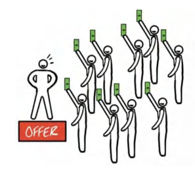
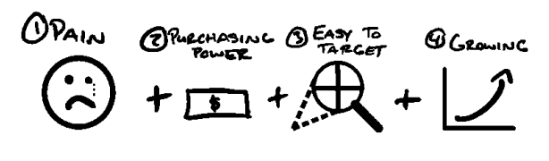
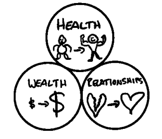
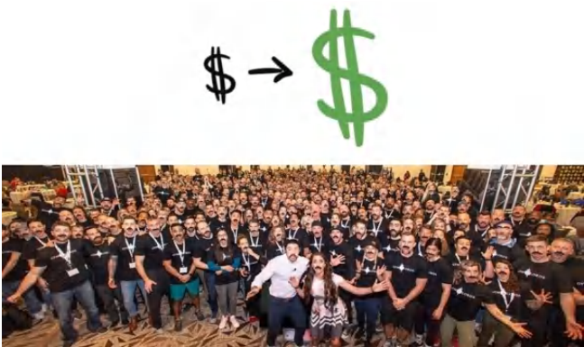
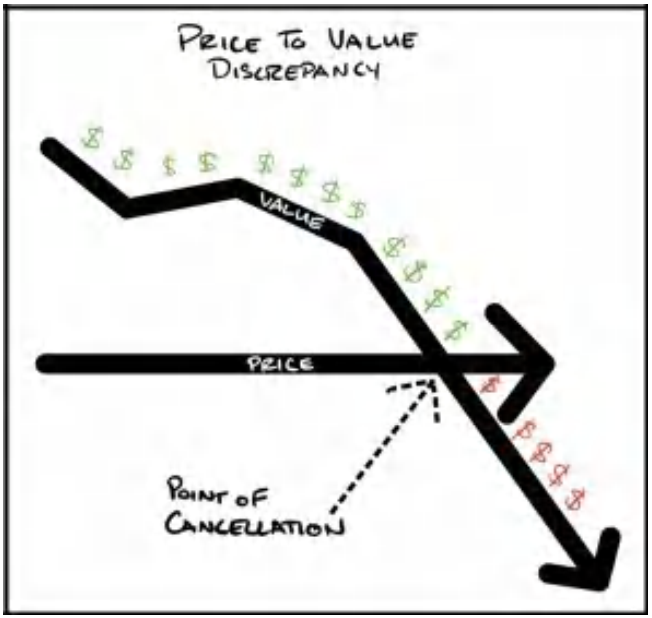
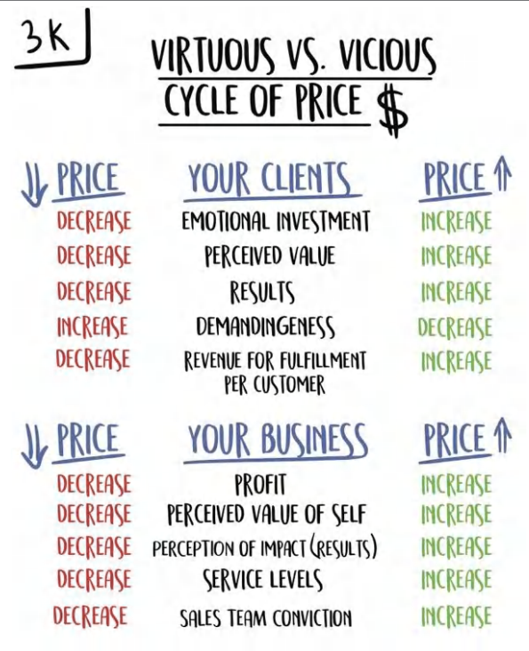

# **PHẦN II: ĐỊNH GIÁ** *Cách định giá cao cho sản phẩm*

## **3. ĐỊNH GIÁ: Bẫy đại trà hóa**

> **Chú thích người dịch** 
> Trong giới kinh doanh, từ "Bẫy đại trà hóa" ám chỉ sự nguy hiểm của việc sản phẩm trở nên "thông thường/phổ biến" đến mức chỉ có thể cạnh tranh bằng cách hạ giá.

>*Nghĩ theo cách khác biệt* - Steve Jobs

"Phát triển hay là Chết" là nguyên tắc cốt lõi tại các công ty của chúng tôi. Chúng tôi tin rằng mỗi cá nhân, mỗi công ty và mỗi sinh vật đều đang trong quá trình phát triển hoặc đang lụi tàn. Khái niệm "duy trì" chỉ là một câu chuyện hoang đường.

Điều này có nghĩa là, nếu công ty của bạn không phát triển, nó đang chết dần. Đây là một thực tế thức tỉnh đối với nhiều người trong chúng ta. Tôi đã học được bài học này một cách cay đắng, và các doanh nghiệp của tôi đã phải chịu đựng trong một thời gian dài vì điều đó.

Để tôi giải thích rõ hơn. Thị trường liên tục tăng trưởng. Thị trường chứng khoán tăng trưởng 9% mỗi năm. Nếu chúng ta không tăng trưởng ở mức 9% mỗi năm, nghĩa là chúng ta đang tụt hậu. "Duy trì", theo nghĩa phổ quát nhất, thực chất phải là mức tăng trưởng 9% hàng năm.

Hơn nữa, nếu bạn đang ở trong một thị trường đang trên đà phát triển, bạn có thể phải tăng trưởng từ 20-30% mỗi năm chỉ để theo kịp, nếu không sẽ có nguy cơ bị bỏ lại phía sau. Vì vậy, bạn có thể thấy tại sao "duy trì" chỉ là một huyền thoại.

Vậy thì, cần những gì để phát triển? May mắn thay, chỉ cần ba điều đơn giản sau:

1. Có thêm nhiều khách hàng hơn.
2. Tăng giá trị mua hàng trung bình của họ.
3. Khiến họ quay lại mua hàng nhiều lần hơn.

Chỉ vậy thôi.

Chắc chắn là có vô vàn cách để thu hút khách hàng và hàng tỷ cách để tăng giá trị đơn hàng cũng như tần suất mua hàng, nhưng tóm gọn lại, chỉ có thế. Đó là ba cách duy nhất để phát triển.

Ví dụ: Nếu tôi bán hàng cho 10 khách hàng mỗi tháng, và mỗi khách hàng mang lại giá trị 1.000 USD cho tôi trong suốt vòng đời của họ (tính bằng giá trị giỏ hàng trung bình x số lần mua hàng trung bình), thì doanh thu doanh nghiệp của tôi sẽ chạm trần ở mức 10.000 USD/tháng (10 x 1.000 USD).

**10 Khách hàng mới/tháng x 1.000 USD Giá trị vòng đời = 10.000 USD/tháng Doanh thu tối đa.**

Nếu bạn muốn phát triển, bạn buộc phải bán được cho nhiều khách hàng hơn mỗi tháng (trong khi vẫn duy trì biên lợi nhuận phù hợp) hoặc khiến họ trở nên giá trị hơn (bằng cách tăng lợi nhuận trên mỗi lần mua hoặc tăng số lần họ mua hàng). Chỉ đơn giản vậy thôi.

>**Ghi chú của Tác giả - Chỉ có hai cách để tăng trưởng**
>
>Để đơn giản hóa khái niệm này hơn nữa: Thực tế chỉ có hai cách để tăng trưởng là có thêm khách hàng và tăng giá trị của mỗi khách hàng. "Tăng giá trị của mỗi khách hàng" bao gồm hai nhánh nhỏ: 1) Tăng lợi nhuận trên mỗi lần mua và 2) Tăng số lần khách hàng mua hàng. Trong phạm vi cuốn sách này, tôi sẽ nhấn mạnh cả hai nhánh nhỏ đó như những con đường tăng trưởng riêng biệt. Tôi làm điều này vì tin rằng nó sẽ giúp bạn dễ dàng hiểu các mô hình tiền tệ sẽ xuất hiện trong Quyển III. Cả ba yếu tố — có thêm khách hàng, tăng giá trị mua hàng trung bình và khiến họ mua nhiều lần hơn — là những chủ đề xuyên suốt trong cuốn sách này. Nhưng nếu bạn muốn sự đơn giản tối thượng, thì cả việc tăng giá trị mua hàng trung bình và tăng số lần mua hàng đều dẫn đến một kết quả duy nhất: tăng giá trị của mỗi khách hàng.

### Các thuật ngữ kinh doanh

Trước khi đi sâu hơn và để làm rõ các khái niệm tiếp theo, chúng ta nên dành chút thời gian để định nghĩa và hiểu rõ hơn về một số khái niệm kinh doanh cốt lõi. Khi tôi đứng trong căn hộ penthouse ở Las Vegas đó với chiếc áo thun "beast mode", tôi đã hoàn toàn mù tịt về những thuật ngữ này. Hãy để tôi giúp bạn hiểu rõ hơn về chúng so với tôi lúc bấy giờ.

**Lợi nhuận gộp (Gross Profit):** Là doanh thu trừ đi chi phí trực tiếp để phục vụ thêm MỘT khách hàng. Nếu tôi bán một lọ kem dưỡng da với giá 10 USD và tốn 2 USD chi phí sản xuất, lợi nhuận gộp của tôi là 8 USD hay 80%. Nếu tôi bán dịch vụ đại lý với giá 1.000 USD/tháng và tốn 100 USD/tháng tiền thuê nhân công để chạy quảng cáo cho khách hàng đó, thì lợi nhuận gộp của tôi là 900 USD hay 90%. *Lưu ý: Đây không phải là lợi nhuận ròng.* Lợi nhuận ròng là số tiền còn lại sau khi đã thanh toán TẤT CẢ các chi phí, chứ không chỉ riêng chi phí thực hiện dịch vụ trực tiếp.

**Giá trị vòng đời (Lifetime Value):** Là tổng lợi nhuận gộp tích lũy được trong suốt toàn bộ quãng thời gian khách hàng sử dụng dịch vụ. Đây là lợi nhuận gộp nhân với số lần mua hàng trung bình mà một khách hàng sẽ thực hiện trong suốt cuộc đời của họ. Sử dụng ví dụ trên, nếu một khách hàng trung bình ở lại trong năm tháng và họ trả 1.000 USD/tháng trong khi tôi tốn 100 USD/tháng để thực hiện dịch vụ, thì giá trị vòng đời của họ là 4.500 USD.

Dưới đây là bảng phân tích:
**Doanh thu: (1.000 USD/tháng * 90% Biên lợi nhuận gộp * 5 tháng) = 4.500 USD Giá trị vòng đời (LTV)**

*Lưu ý rằng các chi phí gián tiếp như quản lý, phần mềm, tiền thuê mặt bằng, v.v., không được tính vào LTV.*

**Ghi chú:** Bạn sẽ thấy các định nghĩa khác nhau về giá trị vòng đời tùy thuộc vào nguồn tài liệu. Sự khác biệt lớn nhất là một số nguồn chỉ tính tổng doanh thu, trong khi những nguồn khác tập trung vào lợi nhuận gộp trong suốt vòng đời. Tôi tập trung vào lợi nhuận gộp. Bạn cũng có thể thấy tôi gọi đây là **LTGP (Lifetime Gross Profit - Lợi nhuận gộp vòng đời)** trong các văn bản khác để cho rõ ràng.

### Mua hàng dựa trên Giá trị so với Mua hàng dựa trên Giá cả

Cuốn sách này được định hướng để trở thành một cuốn giáo trình cho bất kỳ doanh nghiệp nào muốn *tăng trưởng*. Tôi đã dành (và vẫn đang tiếp tục dành) hàng trăm giờ cho các cuộc gọi và gặp gỡ trực tiếp để tư vấn cho các doanh nhân về cách xây dựng lời chào hàng của họ. Tôi đã chứng kiến những lời chào hàng bay cao vút tận tầng bình lưu và cả những cái thất bại thảm hại.

Có một Lời chào hàng Grand Slam khiến bạn gần như không thể thua cuộc. Nhưng tại sao? Điều gì tạo nên tác động lớn đến vậy? Tóm lại, sở hữu một Lời chào hàng Grand Slam giúp giải quyết cả *ba* yêu cầu để tăng trưởng: có thêm nhiều khách hàng hơn, khiến họ trả nhiều tiền hơn và khiến họ mua hàng nhiều lần hơn.

Bằng cách nào? Nó cho phép bạn tạo ra sự khác biệt so với thị trường. Nói cách khác, nó cho phép bạn bán sản phẩm của mình dựa trên GIÁ TRỊ chứ không phải GIÁ CẢ.

* **Hàng hóa phổ thông (Commoditized) = Mua hàng dựa trên Giá cả (Cuộc đua xuống đáy)**
* **Sự khác biệt (Differentiated) = Mua hàng dựa trên Giá trị (Bán trong một phân khúc riêng không có sự so sánh. Đúng vậy, thị trường rất quan trọng, điều mà tôi sẽ trình bày kỹ hơn ở chương tiếp theo).**

Một hàng hóa phổ thông, theo định nghĩa của tôi, là một sản phẩm có thể tìm thấy ở nhiều nơi. Vì lý do đó, nó dễ dẫn đến việc mua hàng dựa trên "giá cả" thay vì "giá trị". Nếu tất cả các sản phẩm đều "như nhau", thì theo mặc định, cái rẻ nhất sẽ là cái có giá trị nhất. Nói cách khác, nếu một khách hàng tiềm năng so sánh sản phẩm của bạn với sản phẩm khác và nghĩ rằng "chúng cơ bản là giống nhau, mình sẽ mua cái rẻ hơn", thì họ đã coi bạn là hàng phổ thông rồi. Thật đáng xấu hổ! Nhưng thực sự... đó là một trong những trải nghiệm tồi tệ nhất mà một doanh nhân định hướng giá trị có thể gặp phải.

Đây là một vấn đề lớn đối với doanh nhân vì các hàng hóa phổ thông được định giá tại điểm hiệu quả của thị trường. Điều này có nghĩa là thị trường sẽ kéo giá xuống thông qua cạnh tranh cho đến khi biên lợi nhuận *vừa đủ* để duy trì hoạt động: "vừa đủ" để trở thành nô lệ cho chính doanh nghiệp của mình. Doanh nghiệp kiếm được "vừa đủ" để chủ sở hữu phải mòn mỏi chờ đợi mọi thứ "xoay chuyển", và đến khi sự thật đó được nhận ra... thì họ đã lún quá sâu để có thể xoay trục (ít nhất là cho đến tận bây giờ).

**Một Lời chào hàng Grand Slam sẽ giải quyết vấn đề này.**

### Vậy Một Lời chào hàng Grand Slam thực hiện điều gì?

Được rồi, hãy bắt đầu bằng việc định nghĩa một Lời chào hàng Grand Slam.
Đó là một lời chào hàng mà bạn trình bày với thị trường mà không thể so sánh được với bất kỳ sản phẩm hoặc dịch vụ nào khác hiện có, kết hợp giữa một chương trình khuyến mãi hấp dẫn, một lời đề nghị giá trị không đối thủ, một mức giá cao cấp và một sự đảm bảo không thể đánh bại cùng với một mô hình tiền tệ (điều khoản thanh toán) cho phép bạn *được trả tiền* để có thêm khách hàng mới... mãi mãi loại bỏ rào cản tiền mặt đối với sự tăng trưởng của doanh nghiệp.

Nói cách khác, nó cho phép bạn bán hàng trong một "phân khúc chỉ có mình bạn", hoặc dùng một cụm từ hay khác là "bán hàng trong môi trường chân không". Kết quả là quyết định mua hàng của khách hàng tiềm năng giờ đây chỉ là giữa sản phẩm của bạn và *con số không*. Nhờ vậy, bạn có thể bán với bất kỳ mức giá nào mà bạn khiến khách hàng cảm nhận được, thay vì so sánh với bất kỳ thứ gì khác. Kết quả là, bạn có thêm nhiều khách hàng hơn, với giá cao hơn, nhưng tốn ít tiền hơn. Nếu bạn thích những thuật ngữ marketing bóng bẩy, nó sẽ được phân tích như sau:

1.  **Tăng tỷ lệ phản hồi (Hãy nghĩ đến các lượt nhấp chuột)**
2.  **Tăng tỷ lệ chuyển đổi (Hãy nghĩ đến các đơn hàng thành công)**
3.  **Mức giá cao cấp (Hãy nghĩ đến việc thu được rất nhiều tiền)**

Sở hữu một Lời chào hàng Grand Slam giúp tăng tỷ lệ phản hồi đối với quảng cáo (tức là sẽ có nhiều người nhấp vào hoặc thực hiện hành động trên một quảng cáo mà họ thấy có chứa Lời chào hàng Grand Slam).

Nếu bạn trả cùng một số tiền để tiếp cận khách hàng nhưng 1) có nhiều người phản hồi hơn, 2) nhiều người trong số đó mua hàng hơn và 3) họ mua với giá cao hơn, doanh nghiệp của bạn sẽ tăng trưởng.

Tôi đã từng "trúng độc đắc" với không ít lời chào hàng. Không phải vì tôi có siêu năng lực nào đó, mà đơn giản vì tôi đã làm việc này rất nhiều lần (và thất bại còn nhiều hơn thế). Tôi đã sàng lọc qua những thứ rác rưởi luôn thất bại và giữ lại tất cả những gì có khả năng tái tạo thành công (và đưa chúng vào cuốn sách này).

Đây là bài học then chốt từ tất cả những điều này: Một doanh nghiệp đều phải thực hiện *cùng một khối lượng công việc* trong cả hai trường hợp (với một sản phẩm phổ thông hoặc một Lời chào hàng Grand Slam). Việc thực hiện dịch vụ là như nhau. Nhưng nếu một doanh nghiệp sử dụng Lời chào hàng Grand Slam và doanh nghiệp kia sử dụng một lời chào hàng "hàng phổ thông", thì Lời chào hàng Grand Slam làm cho doanh nghiệp đó xuất hiện như thể nó có một sản phẩm hoàn toàn khác biệt — và điều đó có nghĩa là việc mua hàng dựa trên giá trị thay vì dựa trên giá cả.

Nếu bạn có một lời chào hàng "hàng phổ thông", bạn sẽ cạnh tranh về giá (mua hàng dựa trên giá cả so với mua hàng dựa trên giá trị). Tuy nhiên, Lời chào hàng Grand Slam của bạn buộc khách hàng tiềm năng phải dừng lại và *suy nghĩ khác đi* để đánh giá giá trị của sản phẩm khác biệt của bạn. Việc này thiết lập bạn vào một phân khúc của riêng mình, điều đó có nghĩa là quá khó để so sánh giá cả, và cũng có nghĩa là bạn đã định chuẩn lại "thước đo giá trị" của khách hàng tiềm năng.

**Toán học về Tiền tệ của Lời chào hàng Grand Slam trong Đời thực: Trước và Sau**
Một câu chuyện ngắn... một trong những công ty của chúng tôi là một phần mềm mà các đại lý quảng cáo sử dụng để xử lý các khách hàng tiềm năng cho khách hàng của họ. Bằng cách sử dụng phần mềm này, các đại lý đã chuyển đổi lời chào hàng của họ từ một lời chào hàng phổ thông về dịch vụ tìm kiếm khách hàng tiềm năng sang một Lời chào hàng Grand Slam theo kiểu "trả phí dựa trên hiệu quả". Hãy để tôi cho bạn thấy hiệu ứng nhân lên của nó đối với doanh thu của doanh nghiệp.

***Mặc dù các con số được làm tròn để dễ hình dung, nhưng những giá trị này dựa trên những con số thực tế từ kinh nghiệm của một đại lý tìm kiếm khách hàng tiềm năng bán dịch vụ cho các doanh nghiệp truyền thống (offline).***

**Cách Phổ thông Cũ (Dựa trên Giá cả) — Cuộc đua xuống đáy**
**Lời chào hàng Phổ thông:** 1.000 USD trả trước, sau đó là 1.000 USD/tháng phí duy trì cho các dịch vụ của đại lý.

| Chỉ số | Mô hình Phổ thông | Grand Slam | Giải thích |
| :--- | :--- | :--- | :--- |
| **Chi phí Quảng cáo** | $10.000 | - | Số tiền chi cho quảng cáo |
| **Lượt tiếp cận** | 300.000 | - | Số lượng người tiếp cận từ quảng cáo |
| **Tỷ lệ phản hồi** | 0,00013 | - | Tỷ lệ người đặt lịch hẹn (CTR x % Optin) |
| **Số lịch hẹn đặt được** | 40 | - | Số lượng lịch hẹn được tạo ra |
| **Tỷ lệ có mặt** | 75% | - | Tỷ lệ phần trăm người thực sự đến cuộc hẹn |
| **Số khách có mặt** | 30 | &nbsp; | Số lượng người thực tế đến cuộc hẹn |
| **Tỷ lệ chốt đơn** | 16% | - | Tỷ lệ phần trăm số người mua hàng |
| **Số đơn đã chốt** | 5 | - | Tổng số khách hàng đã mua hàng |
| **Giá bán** | $1.000 | - | Số tiền khách trả trước để bắt đầu dịch vụ |
| **Tổng doanh thu** | $5.000 | - | Tổng số tiền mặt thu được ngay lập tức |
| **ROAS (Return on Ad Spend)** | 0,5 : 1 | - | Lợi nhuận trên tổng chi phí quảng cáo |

> *Chú thích người dịch* 
>  Commodity: Mô hình phổ thông (bình thường/tầm thường/đại trà)

**Phân tích:** Với tỷ lệ lợi nhuận trên chi phí quảng cáo là 0,5:1, bạn đang bị lỗ khi tìm kiếm khách hàng. Nhưng trong 30 ngày, 5 khách hàng đó sẽ trả thêm mỗi người 1.000 USD, mang lại cho bạn tổng cộng 10.000 USD và đạt mức hòa vốn. Tháng tiếp theo, khoản 5.000 USD thu về sẽ là tháng có lợi nhuận đầu tiên của bạn, và mỗi tháng sau đó đều sẽ có lãi (giả sử tất cả khách hàng đều ở lại).

Đây là một ví dụ về dịch vụ bị "hàng hóa hóa" (commoditized service) — kiểu làm việc đại lý thông thường. Có cả triệu đơn vị như vậy, và tất cả đều trông giống hệt nhau. Các doanh nghiệp và lời chào hàng bị hàng hóa hóa thường gặp khó khăn hơn trong việc nhận phản hồi từ quảng cáo vì mọi chiến dịch marketing của họ đều trông chẳng khác gì những người còn lại.

> **Lưu ý:** Tất cả trông giống nhau vì họ đều đưa ra cùng một lời chào hàng:
> *Bạn trả tiền để chúng tôi làm việc.*
> *Chúng tôi làm việc.*
> *Có thể bạn sẽ nhận được kết quả từ công việc đó. Mà cũng có thể là không.*

Điều này nghe có vẻ hợp lý, nhưng nó rất dễ bị sao chép (và dễ rơi vào tình trạng hàng hóa hóa). **Sự hàng hóa hóa này tạo ra một hành vi mua sắm bị dẫn dắt bởi giá cả...**

Bạn bị buộc phải định giá "cạnh tranh" để có khách hàng và phải giữ mức giá đó để giữ chân họ. Nếu khách hàng thấy một phiên bản rẻ hơn của cùng "một thứ giống vậy", thì sự chênh lệch về giá trị sẽ khiến họ đổi nhà cung cấp ngay lập tức... hoặc là mất khách hàng này (cùng toàn bộ khách hàng hiện tại và tiềm năng), hoặc là phải tiếp tục "cạnh tranh" về giá. Biên lợi nhuận của bạn sẽ mỏng đến mức biến mất.

Hơn nữa, rất khó để khiến khách hàng tiềm năng đồng ý (và duy trì sự đồng ý đó) trừ khi bạn cực kỳ cảnh giác về việc doanh nghiệp của mình bị hàng hóa hóa bằng cách cứ mãi "cạnh tranh giá". Và đó chính là vấn đề với cách làm cũ. Họ có thể so sánh bạn. Trừ khi bạn chuyển sang một **Lời chào hàng Grand Slam** (Grand Slam Offer), nếu không giá của bạn sẽ liên tục bị ép xuống. Doanh nghiệp cuối cùng sẽ lụi bại, hoặc người chủ sẽ phải bỏ cuộc. Chẳng tốt lành gì cả.

Chúng tôi muốn tạo ra một lời chào hàng khác biệt đến mức bạn có thể bỏ qua phần giải thích gượng gạo về việc tại sao sản phẩm của mình lại khác biệt với những người khác (vì nếu họ phải hỏi, thì có lẽ họ quá thiếu thông tin để hiểu được lời giải thích). Thay vào đó, hãy để chính lời chào hàng làm việc đó cho bạn. Đó chính là cách của Lời chào hàng Grand Slam.

Hãy cùng đi sâu vào để thấy sự tương phản trong các con số bán hàng.

**Cách làm mới với Lời chào hàng Grand Slam (Khác biệt, Không thể so sánh) (Dẫn dắt bởi giá trị)**

**Lời chào hàng Grand Slam:** Thanh toán một lần duy nhất. (Không phí duy trì hàng tháng. Không phí giữ chỗ.) Chỉ cần chi trả chi phí quảng cáo. Tôi sẽ tìm kiếm và chăm sóc khách hàng tiềm năng cho bạn. Và bạn chỉ trả tiền cho tôi nếu khách hàng thực sự xuất hiện. Tôi cam kết giúp bạn có 20 người trong tháng đầu tiên, nếu không tháng tiếp theo sẽ hoàn toàn miễn phí. Tôi cũng sẽ cung cấp tất cả các phương pháp hiệu quả nhất từ các doanh nghiệp khác giống như của bạn.

* Huấn luyện bán hàng hàng ngày cho nhân viên của bạn
* Các kịch bản đã qua kiểm chứng
* Các mức giá và lời chào hàng đã được thử nghiệm để bạn chỉ việc "sao chép và triển khai"
* Các bản ghi âm cuộc gọi bán hàng

... và mọi thứ khác bạn cần để bán hàng và đáp ứng nhu cầu khách hàng. Tôi sẽ đưa cho bạn toàn bộ "bí kíp" cho (tên ngành của bạn), hoàn toàn miễn phí chỉ vì bạn đã trở thành khách hàng của tôi.

Nói tóm lại, tôi đưa khách hàng vào doanh nghiệp của bạn, chỉ cho bạn chính xác cách bán hàng cho họ để bạn có thể đạt được mức giá cao nhất, đồng nghĩa với việc bạn kiếm được nhiều tiền nhất có thể... nghe đủ công bằng chứ?

Rõ ràng đây là những lời chào hàng khác biệt một trời một vực... nhưng thì sao nào? **Tiền nằm ở đâu!?** Hãy cùng so sánh cả hai trong bảng dưới đây.

| Chỉ số | Mô hình Phổ thông | Grand Slam | Khác biệt |
| :--- | :--- | :--- | :--- |
| Chi phí quảng cáo | 10.000 USD | 10.000 USD | Không đổi |
| Lượt hiển thị tiếp cận | 300.000 | 300.000 | Không đổi |
| Tỷ lệ phản hồi | 0,00013 | 0,00033 | **Gấp 2,5 lần** (Hấp dẫn hơn nên nhiều người phản hồi hơn) |
| Lịch hẹn đã đặt | 40 | 100 | Kết quả |
| Tỷ lệ khách đến | 75% | 75% | Không đổi |
| Lịch hẹn thực tế | 30 | 75 | Kết quả |
| Tỷ lệ chốt đơn | 16% | 37% | **Gấp 2,3 lần** (Giá trị cao hơn nên nhiều người mua hơn) |
| Đơn hàng đã chốt | 5 | 28 | Kết quả |
| Giá bán | 1.000 USD | 3.997 USD | **Gấp 4 lần** (Phí một lần so với phí duy trì) |
| **Tổng doanh thu** | **5.000 USD** | **112.000 USD** | **Gấp 22,4 lần tiền mặt thu ngay lập tức** |
| ROAS (Return on Ad Spend) | 0,5 : 1 | 11,2 : 1 | **Được trả tiền để có thêm khách hàng.** |

**Phân tích:** Bạn chi cùng một số tiền để tiếp cận cùng một lượng khách hàng mục tiêu. Sau đó, bạn nhận được số người phản hồi quảng cáo nhiều gấp 2,5 lần vì đó là một lời chào hàng hấp dẫn hơn. Từ đó, bạn chốt đơn được nhiều gấp 2,5 lần vì lời chào hàng quá đỗi thuyết phục. Tiếp theo, bạn có thể thu mức giá cao gấp 4 lần ngay từ đầu. Kết quả cuối cùng là $2,5 \times 2,5 \times 4 = 22,4$ lần lượng tiền mặt thu được ngay lập tức. Đúng vậy, bạn chi 10.000 USD để thu về 112.000 USD. Bạn vừa kiếm được tiền ngay trong quá trình tìm kiếm khách hàng mới.

**So sánh:** Bạn còn nhớ cách làm cũ, cái cách mà bạn mất trắng một nửa chi phí quảng cáo ngay từ đầu không? Với cách làm mới này, bạn đang kiếm được *nhiều tiền hơn* và có *nhiều khách hàng hơn*. Điều này có nghĩa là chi phí để có được một khách hàng rẻ đến mức (so với số tiền bạn kiếm được) yếu tố hạn chế duy nhất lúc này chỉ còn là khả năng thực hiện công việc mà bạn vốn đã yêu thích. Dòng tiền và việc tìm kiếm khách hàng không còn là nút thắt cổ chai nữa vì mô hình này mang lại lợi nhuận gấp 22,4 lần so với mô hình cũ. Chuẩn rồi đấy. Bạn không đọc nhầm đâu. Đây chính là đoạn trong phim hành động mà bạn lừng lững bước đi khỏi một vụ nổ trong cảnh quay chậm (slow motion).

Đây chính xác là Lời chào hàng Grand Slam mà chúng tôi đã sử dụng cho doanh nghiệp phần mềm chuyên phục vụ các đại lý (agency) của mình. Những con số có thể trở nên điên rồ... rất nhanh. Tôi biết con số hiệu quả hơn gấp 22,4 lần nghe có vẻ phi lý, nhưng đó mới chính là mấu chốt. Nếu bạn chơi cùng một trò chơi mà mọi người khác đang chơi, bạn sẽ nhận được kết quả giống như họ (tầm thường). Bạn chỉ đánh được những cú đơn, cú đôi, duy trì hoạt động cầm chừng nhưng không bao giờ bứt phá lên được. Nhưng hãy nhớ đoạn mở đầu của cuốn sách này: khi bạn sắp xếp mọi quân bài đúng vị trí, bạn có thể tung một cú "knock-out" hoàn hảo đến mức giành chiến thắng vĩnh viễn. Trong 18 tháng kinh doanh đầu tiên, chúng tôi đã đi từ doanh thu 500.000 USD/năm lên 28.000.000 USD/năm với chi phí quảng cáo chưa đầy 1 triệu USD. Vì vậy, khi tôi nói về tỷ lệ lợi nhuận 20:1... 50:1... hay 100:1, tôi hoàn toàn nghiêm túc. Khi bạn làm đúng, kết quả sẽ thực sự... không thể tin nổi.

**Các điểm tóm tắt**
Chương này đã minh họa vấn đề cơ bản của sự "hàng hóa hóa" và cách Lời chào hàng Grand Slam giải quyết vấn đề đó. Điều này giúp bạn thoát khỏi cuộc chiến về giá và bước vào một phân khúc của riêng mình (category of one). Chương tiếp theo sẽ tập trung vào việc tìm kiếm thị trường phù hợp để áp dụng các chiến lược giá của chúng ta. Đây là một trong những yếu tố quan trọng nhất cần phải làm đúng. Một lời chào hàng Grand Slam đưa ra sai đối tượng sẽ chỉ như "đàn gảy tai trâu". Chúng ta muốn tránh điều đó bằng mọi giá. Chúng ta phải tạm dừng việc định giá một chút để học cách tìm kiếm những gì cần thiết ở một thị trường. Đó là một "ô kiểm" thiết yếu cần tích vào trước khi tiếp tục hành trình của chúng ta.

>**QUÀ TẶNG MIỄN PHÍ #1 – HƯỚNG DẪN BỔ SUNG: "BẮT ĐẦU TẠI ĐÂY"** 
>Nếu bạn muốn tìm hiểu sâu hơn, hãy truy cập *[Acquisition.com/training/offers](https://Acquisition.com/training/offers)* và xem video đầu tiên trong khóa học miễn phí (do chính tôi trình bày) về cách tôi tạo sự khác biệt cho các lời chào hàng trong những doanh nghiệp mà tôi tư vấn và giúp họ thu mức giá cao cấp. Tôi cũng đã tạo ra một số Quy trình chuẩn (SOPs)/Mẹo thực hiện (Cheat Codes) miễn phí để bạn có thể triển khai nhanh hơn. Hoàn toàn miễn phí. Chúc bạn tận hưởng thành quả.

## **4. ĐỊNH GIÁ: TÌM KIẾM THỊ TRƯỜNG ĐÚNG ĐẮN — MỘT ĐÁM ĐÔNG ĐANG ĐÓI KHÁT**

*"Hạt giống rơi vào vùng đất tốt đại diện cho những người thực sự nghe, hiểu lời Chúa và tạo ra một mùa màng bội thu, gấp ba mươi, sáu mươi, hoặc thậm chí là một trăm lần so với những gì đã được gieo trồng!"*
— MATTHEW 13:23 (NLT)

---

Một giáo sư marketing đã hỏi các sinh viên của mình rằng: "Nếu các em chuẩn bị mở một quầy bán xúc xích nóng (hotdog), và các em chỉ có thể sở hữu một lợi thế duy nhất so với các đối thủ cạnh tranh... thì đó sẽ là lợi thế gì...?"

"Địa điểm!" .... "Chất lượng!" .... "Giá rẻ!" .... "Hương vị ngon nhất!"

Các sinh viên liên tục đưa ra câu trả lời cho đến khi cuối cùng họ không còn ý tưởng nào nữa. Họ nhìn nhau, chờ đợi vị giáo sư lên tiếng. Cả căn phòng cuối cùng cũng rơi vào im lặng.

Vị giáo sư mỉm cười và đáp lại: "Một đám đông đang đói khát."

Bạn có thể có những chiếc xúc xích tệ nhất, mức giá khủng khiếp và một địa điểm không thể xấu hơn, nhưng nếu bạn là quầy xúc xích duy nhất trong thị trấn và một trận bóng bầu dục của trường đại học địa phương vừa kết thúc, bạn chắc chắn sẽ cháy hàng. Đó chính là giá trị của "một đám đông đang đói khát".

Suy cho cùng, nếu có một nhu cầu khổng lồ cho một giải pháp, bạn có kỹ năng làm kinh doanh ở mức trung bình, có một lời chào hàng tệ hại và chẳng có khả năng thuyết phục ai, nhưng bạn vẫn có thể kiếm được tiền.

Một ví dụ điển hình cho điều này là tình trạng thiếu giấy vệ sinh vào thời điểm bắt đầu dịch Covid-19. Chẳng cần bản chào hàng nào cả. Giá cả thì cắt cổ. Và cũng không cần một lời chào mời bán hàng hấp dẫn nào. Nhưng vì đám đông quá lớn và quá "đói khát", những cuộn giấy vệ sinh đã được bán với giá 100 đô la hoặc hơn. Đó chính là giá trị của một đám đông đang đói khát.

**Bán báo**

Một người bạn thân của tôi, Lloyd, sở hữu một doanh nghiệp phần mềm chuyên phục vụ các tòa soạn báo trong gần một thập kỷ. Họ thiết lập các dịch vụ quảng cáo kỹ thuật số trên các trang web báo chí chỉ với vài cú nhấp chuột và ngay lập tức giúp các tòa soạn bán được một sản phẩm quảng cáo hoàn toàn mới. Anh ấy chỉ tính phí dựa trên phần trăm doanh thu mà anh ấy mang lại thêm cho họ. Vì vậy, nếu họ không kiếm được gì, anh ấy cũng chẳng có đồng nào. Điều đó hoàn toàn có lợi cho các tờ báo và là một bản chào hàng tuyệt vời.

Nhưng, dù có một bản chào hàng xuất sắc và khả năng bán hàng bẩm sinh, công việc kinh doanh của anh ấy bắt đầu sa sút. Là một doanh nhân đầy hoài bão, anh ấy đã thử mọi góc độ khác nhau để giải quyết vấn đề — nhưng không có gì hiệu quả. Anh ấy không thể tìm ra vấn đề nằm ở đâu. Thật khó khăn cho tôi khi chứng kiến anh ấy phải vật lộn như vậy, vì tôi nghĩ Lloyd thông minh hơn tôi nhiều, và câu trả lời dường như đã quá rõ ràng đối với tôi. Nhưng việc quan sát anh ấy trải qua giai đoạn này đã trở thành một bài học mà tôi mang theo suốt đời. Trước khi tôi tiết lộ nó, bạn nghĩ vấn đề nằm ở đâu? Sản phẩm? Bản chào hàng? Marketing và bán hàng? Hay đội ngũ của anh ấy?

Chúng ta hãy cùng phân tích nhé. Vấn đề không nằm ở sản phẩm — sản phẩm rất tuyệt vời. Cũng không phải bản chào hàng — anh ấy có một mô hình chia sẻ doanh thu không có rủi ro. Cũng không phải kỹ năng bán hàng — anh ấy là một người bán hàng bẩm sinh. Vậy thì, vấn đề là gì? Anh ấy đang bán hàng cho các tòa soạn báo! Thị trường của anh ấy đang sụt giảm 25% mỗi năm! Anh ấy đã nhìn vào mọi khía cạnh, ngoại trừ khía cạnh hiển nhiên nhất. Cuối cùng, sau nhiều năm chiến đấu trong một cuộc chiến đầy cam go trên thị trường của mình, anh ấy nhận ra thị trường chính là nguồn cơn của mọi vấn đề và quyết định thu nhỏ quy mô công ty.

Đừng lo lắng — câu chuyện này vẫn còn phần thứ hai. Để minh họa cho sức mạnh của thị trường, ngay khi COVID ập đến, Lloyd đã xoay trục. Anh ấy bắt đầu một công ty sản xuất khẩu trang tự động. Với công nghệ mới, anh ấy đã đưa chi phí sản xuất mỗi chiếc khẩu trang xuống thấp hơn mức giá mà mọi người có thể mua từ Trung Quốc. Trong vòng năm tháng, anh ấy đã đạt doanh thu hàng triệu đô la mỗi tháng. Vẫn là doanh nhân đó. Nhưng là một thị trường khác. Anh ấy đã áp dụng cùng một bộ kỹ năng của mình vào một lĩnh vực kinh doanh mà anh ấy chưa từng có kinh nghiệm và đã giành chiến thắng. Đó chính là sức mạnh của việc chọn đúng thị trường.

Tôi kể cho bạn câu chuyện đó như một lời cảnh báo. Thị trường của bạn rất quan trọng. Lloyd là một người rất thông minh. Anh ấy rõ ràng là một người đầy năng lực. Nhưng tất cả chúng ta đều có thể bị che mắt khi làm doanh nhân vì chúng ta không muốn bỏ cuộc. Chúng ta quá quen với việc giải quyết các vấn đề bất khả thi đến mức chúng ta cứ đâm đầu vào tường. Chúng ta ghét việc rút lui. Nhưng thực tế là mọi người đều bị ảnh hưởng bởi thị trường của họ.

Vậy làm thế nào để bạn chọn đúng thị trường?

**Cần tìm kiếm điều gì**

Luôn có một thị trường đang khao khát năng lực của bạn. Bạn cần tìm thấy nó. Và khi tìm thấy, bạn sẽ tận dụng được cơ hội, đồng thời tự hỏi tại sao mình lại mất nhiều thời gian đến thế để tìm ra. Đừng quá "mơ mộng" về khán giả của mình. Hãy phục vụ những người có khả năng chi trả cho bạn những gì bạn xứng đáng được nhận. Và hãy nhớ rằng việc chọn một thị trường, cũng giống như bất kỳ việc gì khác, luôn là sự lựa chọn của chúng ta, vì vậy hãy chọn lựa một cách khôn ngoan.

Để bán được bất cứ thứ gì, bạn cần có nhu cầu. Chúng ta không cố gắng tạo ra nhu cầu. Chúng ta đang cố gắng dẫn dắt nhu cầu đó. Đó là một sự khác biệt rất quan trọng. Nếu bạn không có thị trường cho lời chào hàng của mình, thì không một điều gì tiếp theo có tác dụng. Toàn bộ cuốn sách này dựa trên giả định rằng bạn có ít nhất một thị trường "bình thường", mà tôi định nghĩa là một thị trường đang tăng trưởng cùng tốc độ với mặt bằng chung và có những nhu cầu chưa được đáp ứng thuộc một trong ba nhóm: cải thiện sức khỏe, gia tăng tài sản, hoặc cải thiện các mối quan hệ. Ví dụ như Lloyd, trong câu chuyện bán báo ở trên, anh ấy có thể đọc hết cuốn sách này nhưng chẳng điều gì trong đây có tác dụng với anh ấy cả. Tại sao? Bởi vì anh ấy đang nhắm vào các tòa soạn báo, một thị trường đang chết dần.

Nói như vậy không có nghĩa là việc có một thị trường tuyệt vời là một lợi thế. Bạn có thể ở trong một thị trường bình thường đang tăng trưởng ở mức trung bình mà vẫn kiếm được số tiền khổng lồ. Mọi thị trường mà tôi từng tham gia đều là thị trường bình thường. Vấn đề chỉ là bạn thực sự đừng đi bán đá cho người Eskimo mà thôi.

>**Chú thích từ người dịch** 
> Người Eskimo: Họ được mệnh danh là những người chịu lạnh giỏi nhất hành tinh, có thể sinh tồn ở nhiệt độ thường xuyên xuống mức -40°C

Dưới đây là những nguyên tắc cơ bản về những gì tôi tìm kiếm ở các thị trường. Hãy cùng điểm qua chúng trước khi chúng ta quay lại với lời chào hàng.

**Khi chọn thị trường, tôi tìm kiếm bốn chỉ số:**

**1) Nỗi đau lớn**

Họ không chỉ đơn thuần là muốn, mà phải thực sự cần những gì tôi đang cung cấp. Nỗi đau có thể là bất cứ điều gì khiến mọi người cảm thấy thất vọng về cuộc sống của họ. Cháy túi là một nỗi đau. Một cuộc hôn nhân tồi tệ là một nỗi đau. Phải xếp hàng chờ đợi ở cửa hàng tạp hóa là một nỗi đau. Đau lưng... nỗi đau vì nụ cười không đẹp... nỗi đau vì quá cân... Con người chịu đựng rất nhiều nỗi đau. Vì vậy, đối với những doanh nhân như chúng ta, cơ hội là vô tận.

Mức độ của nỗi đau sẽ tỉ lệ thuận với mức giá mà bạn có thể tính (chúng ta sẽ nói kỹ hơn về điều này trong chương Phương trình Giá trị). Khi họ biết đến giải pháp cho nỗi đau của mình, và ngược lại, thấy được cuộc sống của họ sẽ ra sao nếu không còn nỗi đau đó, họ sẽ bị cuốn hút vào giải pháp của bạn.

Tôi có một câu nói hay dùng để đào tạo các đội ngũ bán hàng: "Gãi đúng chỗ ngứa là lời chào hàng hoàn hảo nhất." Nếu bạn có thể diễn đạt chính xác nỗi đau mà khách hàng tiềm năng đang cảm nhận, họ gần như luôn luôn sẽ mua những gì bạn cung cấp. Một khách hàng tiềm năng phải có một vấn đề đau đớn để chúng ta giải quyết và tính tiền cho giải pháp đó.

>**Mẹo chuyên gia (Pro Tip)**
>&emsp;Mục tiêu của việc viết lách giỏi là để người đọc hiểu.
>&emsp;Mục tiêu của việc thuyết phục giỏi là để khách hàng tiềm năng cảm thấy mình được thấu hiểu.

**2) Khả năng chi trả**

Một người bạn của tôi có một hệ thống rất tốt để giúp mọi người cải thiện sơ yếu lý lịch (CV) nhằm nhận được nhiều lời mời phỏng vấn hơn. Anh ấy làm rất giỏi. Nhưng dù đã cố gắng hết sức, anh ấy vẫn không thể khiến mọi người trả tiền cho dịch vụ của mình. Tại sao? Bởi vì tất cả họ đều đang thất nghiệp!

Điều này, một lần nữa, có vẻ hiển nhiên. Nhưng anh ấy đã nghĩ rằng: "Những người này rất dễ tiếp cận. Họ đang gặp nỗi đau lớn. Có rất nhiều người như vậy, và số lượng người thất nghiệp lại liên tục tăng thêm. Đây là một thị trường tuyệt vời!"

Anh ấy chỉ quên mất một điểm mấu chốt: đối tượng khách hàng của bạn cần có khả năng chi trả cho dịch vụ mà bạn đang tính phí. Hãy đảm bảo rằng các đối tượng mục tiêu của bạn có tiền, hoặc có quyền tiếp cận với số tiền cần thiết để mua dịch vụ của bạn với mức giá mà bạn yêu cầu để xứng đáng với thời gian bạn bỏ ra.

**3) Dễ dàng tiếp cận**

Giả sử bạn có một thị trường hoàn hảo, nhưng lại không có cách nào tìm thấy những người trong thị trường đó. Khi đó, việc tạo ra một Bản chào hàng Grand Slam sẽ rất khó khăn. Tôi giúp cuộc sống của mình dễ dàng hơn bằng cách tìm kiếm các thị trường dễ tiếp cận. Ví dụ cho điều này là các hình mẫu khách hàng tham gia vào các hiệp hội, các danh sách email, các nhóm trên mạng xã hội, các kênh mà tất cả họ đều theo dõi, v.v. Nếu khách hàng tiềm năng của chúng ta đều tập trung ở một nơi nào đó, thì chúng ta có thể tiếp thị họ. Tuy nhiên, nếu việc tìm kiếm họ giống như mò kim đáy bể, thì sẽ rất khó để đưa lời chào hàng của bạn đến trước mắt những người thực sự quan tâm.

Điểm này mang tính chiến thuật. Đó là thực tế, không phải lý thuyết. Chẳng hạn, bạn có thể muốn phục vụ các bác sĩ giàu có. Nhưng nếu quảng cáo của bạn lại hiển thị cho các sinh viên điều dưỡng, thì bản chào hàng của bạn sẽ không có ai thèm để tâm, cho dù nó có tốt đến đâu đi chăng nữa. Điểm mấu chốt: bạn muốn chắc chắn rằng mình có thể tiếp cận đối tượng lý tưởng một cách dễ dàng. (Điểm cần làm rõ - việc muốn phục vụ các bác sĩ giàu có không có vấn đề gì cả, họ rất dễ tìm. Đây chỉ là ví dụ minh họa rằng các chương trình khuyến mãi của bạn phải được phục vụ đúng đối tượng).

**4) Sự tăng trưởng**

Thị trường đang tăng trưởng giống như một cơn gió xuôi. Chúng giúp mọi thứ tiến về phía trước nhanh hơn. Những thị trường đang sụt giảm lại giống như gió ngược. Chúng khiến mọi nỗ lực trở nên khó khăn hơn. Đây là ví dụ về Lloyd. Các tòa soạn báo sở hữu ba trong số bốn yếu tố của một thị trường tuyệt vời: (1) nhiều nỗi đau, (2) có khả năng chi trả, (3) dễ tiếp cận. Nhưng họ lại đang thu hẹp quy mô (nhanh chóng). Cho dù anh ấy có cố gắng thế nào, toàn bộ thị trường vẫn chống lại anh ấy. Kinh doanh vốn đã đủ khó khăn, và các thị trường thì thay đổi rất nhanh. Vì vậy, tốt nhất là bạn nên tìm một thị trường tốt để có được "ngọn gió xuôi" giúp cho quá trình kinh doanh trở nên dễ dàng hơn.

**Hiện thực hóa điều này**

Có ba thị trường chính sẽ luôn tồn tại: Sức khỏe, Sự giàu có và Các mối quan hệ. Lý do khiến chúng luôn tồn tại là bởi luôn có những nỗi đau khủng khiếp khi bạn thiếu thốn chúng. Nhu cầu về các giải pháp cho những nỗi đau cốt lõi này của con người là vô tận. Mục tiêu là tìm ra một thị trường ngách nhỏ hơn bên trong một trong những "chiếc xô" lớn đó — một nhóm đang tăng trưởng, có khả năng chi trả và dễ tiếp cận (ba biến số còn lại).

Ví dụ, nếu tôi là một chuyên gia về mối quan hệ đang tìm kiếm hình mẫu khách hàng (avatar) của mình, tôi thà tập trung vào việc huấn luyện "mối quan hệ nửa sau cuộc đời" cho những người lớn tuổi hơn là giúp đỡ các sinh viên đại học đang yêu. Tại sao? Bởi vì những người cao tuổi đang cô đơn có khả năng chịu đựng nhiều nỗi đau hơn khi họ đang tiến gần đến cái chết (nỗi đau), họ có khả năng chi trả cao hơn (tiền bạc) và dễ tìm thấy hơn (tiếp cận). Cuối cùng, tại thời điểm viết cuốn sách này, số người bước sang tuổi 65 mỗi năm nhiều hơn số người bước sang tuổi 20 (tăng trưởng).

Đó chính là ý tưởng. Hãy nghĩ về những gì bạn giỏi liên quan đến sức khỏe, sự giàu có và các mối quan hệ. Sau đó, hãy nghĩ xem ai là người có thể coi trọng dịch vụ của bạn nhất (đang gặp nhiều nỗi đau nhất), có khả năng chi trả để trả mức giá bạn muốn (tiền bạc) và có thể tìm thấy dễ dàng (tiếp cận). Miễn là ba tiêu chí đó mạnh mẽ và thị trường không bị thu hẹp, bạn sẽ ổn.

Nhưng tầm quan trọng của việc tìm kiếm một "thị trường tuyệt vời" so với một "thị trường bình thường" hay một "thị trường tồi tệ" đối với thành công của bạn là như thế nào? Câu trả lời là: thực tế nó còn tùy. Hãy để tôi giải thích.

**Thứ tự ưu tiên: Ba đòn bẩy dẫn đến thành công**

Rất ít khả năng bạn sẽ rơi vào một thị trường đang chết dần như ví dụ về tòa soạn báo ở trên. Cũng xúi quẩy lắm thì bạn mới đi bán giấy vệ sinh trong thời kỳ COVID (cơn sốt mua sắm). Có khả năng cao là bạn sẽ ở trong một thị trường "bình thường". Và điều đó hoàn toàn ổn. Có cả một gia tài để kiếm trong các thị trường bình thường. Điểm duy nhất tôi muốn nhấn mạnh ở đây là bạn không được ở trong một thị trường "tồi tệ", nếu không thì chẳng có gì hiệu quả cả. Như đã nói, đây là minh họa đơn giản nhất về mức độ quan trọng giữa thị trường, lời chào hàng và kỹ năng thuyết phục:

**Đám đông đói khát (thị trường) > Sức mạnh của Lời chào hàng > Kỹ năng thuyết phục**

Giả sử bạn đánh giá các yếu tố này theo thang điểm: tuyệt vời, bình thường và tồi tệ. Về cơ bản, bạn có thể xét theo thứ tự từ trái sang phải theo tầm quan trọng. Một yếu tố được xếp hạng "tuyệt vời" ở thứ bậc cao hơn sẽ áp đảo bất kỳ yếu tố nào khác xếp sau nó. Một yếu tố ở mức "bình thường" sẽ đẩy trách nhiệm thành công sang phần tiếp theo của phương trình. Một yếu tố "tồi tệ" sẽ dừng phương trình ngay lập tức, trừ khi một yếu tố "tuyệt vời" từ cấp ưu tiên cao hơn vô hiệu hóa nó. Dưới đây là một vài ví dụ:

**Ví dụ số 1:** Ngay cả khi bạn có một bản chào hàng tồi tệ và kỹ năng thuyết phục kém, bạn vẫn sẽ kiếm được tiền nếu bạn ở trong một thị trường tuyệt vời. Nếu bạn đứng ở góc đường bán xúc xích lúc các quán bar đóng cửa vào 2 giờ sáng, với một đám đông những người say xỉn đang đói ngấu nghiến, bạn chắc chắn sẽ bán sạch xúc xích của mình.

**Ví dụ số 2 (hầu hết chúng ta):** Nếu bạn đang ở trong một thị trường bình thường và có một Lời chào hàng Grand Slam (tuyệt vời), bạn có thể kiếm được hàng tấn tiền ngay cả khi bạn thuyết phục kém. Đây là trường hợp của hầu hết những người đang đọc cuốn sách này. Đó là lý do tại sao tôi viết nó — để giúp bạn tối đa hóa thành công của mình bằng cách học cách thực sự xây dựng một Lời chào hàng Grand Slam.

**Ví dụ số 3:** Giả sử bạn đang ở trong một thị trường bình thường và có một bản chào hàng bình thường. Để đạt được thành công rực rỡ, bạn sẽ phải cực kỳ giỏi thuyết phục. Khi đó và chỉ khi đó, bạn mới thành công, với kỹ năng thuyết phục đóng vai trò là điểm tựa cho thành công của bạn. Này, nhiều đế chế đã được xây dựng bởi những người thuyết phục kiệt xuất đấy. Chỉ là đó là con đường khó khăn nhất để đi theo và đòi hỏi nhiều nỗ lực cũng như học hỏi nhất. Chốt được lời chào hàng giúp bạn đi đường tắt đến thành công. Nếu không, bạn sẽ chỉ có một công việc kinh doanh bình thường, đòi hỏi kỹ năng phi thường mới có thể thành công (điều đó chẳng có gì sai, nhưng có lẽ không phải là điều bạn mong đợi khi bắt đầu).

**Cam kết với Ngách (Niche)**

Tôi có một câu nói khi huấn luyện các doanh nhân về việc chọn thị trường mục tiêu của họ: "Đừng để tôi phải tặng bạn một 'cú tát ngách' (niche slap)."

Thường thì những doanh nhân mới chỉ thử nghiệm một lời chào hàng trong một thị trường một cách hời hợt, không kiếm được triệu đô, và rồi lầm tưởng rằng "đây là một thị trường tồi tệ". Phần lớn các trường hợp thực tế không phải vậy. Họ chỉ đơn giản là chưa tìm thấy một Lời chào hàng Grand Slam để áp dụng cho thị trường đó mà thôi.

Họ nghĩ: "Mình sẽ chuyển từ giúp đỡ nha sĩ sang giúp đỡ bác sĩ chỉnh xương — chính là nó!" Trong khi thực tế, cả hai đều là những thị trường bình thường và đại diện cho hàng tỷ đô la doanh thu. Cái nào cũng hiệu quả cả, chỉ là bạn không thể làm cả hai cùng lúc. Bạn phải chọn một. Không ai có thể phụng sự hai chủ.

Tôi đã đặt ra thuật ngữ "niche slap" để nhắc nhở các doanh nhân trong cộng đồng của mình phải cam kết một khi họ đã chọn. Mọi doanh nghiệp, mọi thị trường đều có những đặc điểm không mấy dễ chịu. Cỏ không bao giờ xanh hơn khi bạn sang phía bên kia đâu. Nếu bạn cứ nhảy từ ngách này sang ngách khác, hy vọng rằng thị trường sẽ giải quyết vấn đề của bạn, bạn xứng đáng nhận một "cú tát ngách".

Bạn phải kiên trì với bất cứ thứ gì bạn chọn đủ lâu để trải qua quá trình thử và sai. Bạn sẽ thất bại. Thực tế, bạn sẽ thất bại cho đến khi thành công. Nhưng bạn sẽ thất bại lâu hơn nhiều nếu cứ liên tục thay đổi đối tượng marketing của mình, bởi vì mỗi lần như vậy bạn phải bắt đầu lại từ đầu. Vì vậy, hãy chọn, sau đó hãy cam kết.

**Sự giàu có nằm ở trong các ngách**

Một lý do khác để cam kết với ngách là vì số tiền bạn sẽ kiếm được nhiều.
Nói một cách đơn giản, tập trung vào ngách sẽ giúp bạn kiếm được nhiều tiền hơn nhiều.

>*Ghi chú của tác giả - Khi nào nên mở rộng (Lời khuyên cho hầu hết mọi người)*
>
>Đối với hầu hết mọi người, nếu doanh thu của bạn dưới 10 triệu đô la/năm, việc tập trung vào ngách sẽ mang lại nhiều tiền hơn. Sau mức đó, nó sẽ phụ thuộc vào mức độ hẹp của ngách, hoặc cái được gọi là TAM (total addressable market - tổng thị trường có thể tiếp cận). Một doanh nghiệp thực sự chỉ có thể phát triển để đáp ứng tổng thị trường hiện có. Tuy nhiên, đối với hầu hết mọi người, đạt được mức 10 triệu đô la/năm đã là một thành tựu thuộc top 0,4% (khoảng 1 trong 250 doanh nghiệp đạt được điều này). Vì vậy, đối với 99,6% độc giả dưới mức 10 triệu đô la/năm, phục vụ ít khách hàng hơn một cách chuyên sâu hơn hầu như luôn dễ dàng hơn. Nhưng nếu bạn muốn đi xa hơn thế, bạn có thể (tùy thuộc vào quy mô TAM của mình) phải mở rộng đối tượng bằng cách tiến lên thị trường cao cấp (up market), xuống thị trường bình dân (down market), hoặc vào một thị trường lân cận nơi các dịch vụ hiện tại của bạn có thể cung cấp giá trị.
>
>Để tham khảo, nhiều công ty đã mở rộng lên mức hơn 30 triệu đô la mỗi năm chỉ phục vụ một ngách duy nhất: Bác sĩ chỉnh xương, Phòng gym, Thợ sửa ống nước, Điện mặt trời, Thợ lợp mái, Chủ tiệm tóc, v.v. Nếu bạn đang ở mức 1 triệu hoặc 3 triệu đô la mà nghĩ rằng mình đã chạm trần và phải mở rộng, bạn đã nhầm. Bạn chỉ cần làm tốt hơn thôi.

Khi tôi thực sự hiểu mình đã bỏ lỡ bao nhiêu lợi nhuận trên bàn đàm phán, nó đã thay đổi cuộc đời tôi. Đó chính là thứ đã đưa tôi từ việc làm dịch vụ thu hút khách hàng (acquisition) cho bất kỳ ai sang giảng dạy nó cho một hình mẫu (avatar) cụ thể. Trong trường hợp của mình, tôi quyết định chọn chủ phòng gym quy mô nhỏ với khoảng 100 thành viên, đã ký hợp đồng thuê mặt bằng, có ít nhất một nhân viên và muốn giúp khách hàng giảm cân. Điều đó cực kỳ cụ thể so với việc chọn "chủ doanh nghiệp nhỏ" hoặc "bất cứ ai trả tiền cho tôi" — những lựa chọn vốn rất phổ biến. Và tôi đã rất kiên định. Trong mô hình kinh doanh đó (Gym Launch) — chúng tôi đã từ chối — và vẫn đang từ chối — bất kỳ ai không phải là hình mẫu đó. Điều đó có nghĩa là không nhận huấn luyện viên cá nhân, không nhận huấn luyện viên online, v.v.

Tôi có thể giúp họ không? Tất nhiên là có chứ. Ý tôi là, phần lớn danh mục đầu tư của chúng tôi bao gồm các công ty không phải phòng gym. Nhưng để duy trì sự tập trung vào sản phẩm và thông điệp có tỷ lệ chuyển đổi cao, việc biết chính xác sản phẩm dành cho ai là một yếu tố thay đổi cuộc chơi.

Nó giúp chúng tôi biết chính xác mình đang nói chuyện với ai mọi lúc, và biết chính xác mình đang giải quyết vấn đề của ai.

Nhưng nếu sự đơn giản và dễ dàng là chưa đủ để thuyết phục bạn, hãy để tôi minh họa tại sao việc tập trung vào một ngách sẽ giúp bạn kiếm được nhiều tiền hơn.

**Lý do:** bạn có thể tính phí cao gấp 100 lần cho cùng một sản phẩm. Dan Kennedy là người đầu tiên minh họa điều này cho tôi, và tôi sẽ cố gắng hết sức để truyền lại ngọn đuốc đó cho bạn trong những trang sách này.

**<u>Ví dụ về Định giá Sản phẩm theo Ngách:</u>**

| Sản phẩm | Mức giá |
| :--- | :--- |
| Quản lý thời gian | 19 USD |
| Quản lý thời gian dành cho các chuyên gia bán hàng | 99 USD |
| Quản lý thời gian dành cho nhân viên bán hàng B2B Outbound | 499 USD |
| Quản lý thời gian dành cho nhân viên bán hàng B2B Outbound dụng cụ điện & thiết bị làm vườn | 1.997 USD |

Dan Kennedy đã dạy tôi điều này (và nó đã thay đổi cuộc đời tôi mãi mãi). Giả sử bạn bán một khóa học chung chung về Quản lý thời gian. Trừ khi bạn là một bậc thầy quản lý thời gian tên tuổi với một câu chuyện hấp dẫn hoặc độc đáo, nếu không thì rất khó để nó trở thành một thứ gì đó đáng kể. Bạn nghĩ "lại một khóa học khác" về quản lý thời gian sẽ có giá bao nhiêu? 19 đô, 29 đô? Chắc chắn rồi. Chẳng có gì đáng để khoe cả. Cứ cho là 19 đô để minh họa nhé.

*\*\*Bây giờ chúng ta sẽ giải phóng sức mạnh của việc định giá theo ngách thông qua các giai đoạn khác nhau trên sản phẩm của bạn.\*\**

Hãy tưởng tượng bạn làm cho sản phẩm cụ thể hơn, vẫn giữ nguyên các nguyên tắc đó, và gọi nó là "Quản lý thời gian dành cho các chuyên gia bán hàng". Ngay lập tức, khóa học này dành cho một nhóm người cụ thể hơn. Nếu việc tăng giá/chi phí này mang lại cho họ dù chỉ một khách hàng mới, thì con số đó vẫn là quá hời. Nhưng có rất nhiều nhân viên bán hàng, vì vậy đây có thể là một sản phẩm giá 99 đô la. Tuyệt đấy, nhưng chúng ta còn có thể làm tốt hơn.

Hãy đi xuống thêm một tầng ngách nữa và gọi sản phẩm của chúng ta là... "Quản lý thời gian dành cho nhân viên bán hàng B2B Outbound". Theo cùng nguyên tắc đặc thù đó, giờ đây chúng ta biết những người bán hàng này có lẽ có những thương vụ và hoa hồng rất lớn. Một lần bán hàng thành công có thể dễ dàng mang lại cho người này 500 đô la (hoặc hơn), vì vậy việc đưa ra mức giá 499 đô la là hoàn toàn hợp lý. Mức giá này đã tăng gấp 25 lần cho một sản phẩm gần như y hệt. Tôi có thể dừng lại ở đây, nhưng tôi sẽ đi thêm một bước nữa.

Hãy thu hẹp ngách thêm một tầng cuối cùng... "Quản lý thời gian dành cho nhân viên bán hàng B2B Outbound dụng cụ điện & thiết bị làm vườn". Bùm!

Hãy thử nghĩ xem, nếu bạn là một nhân viên bán dụng cụ điện outbound, bạn sẽ tự nhủ: "Cái này được làm ra chính xác là dành cho mình" và sẽ vui vẻ bỏ ra khoảng 1.000 đến 2.000 đô la cho một chương trình quản lý thời gian có thể giúp bạn đạt được mục tiêu.

Các phần thực tế của chương trình có thể giống hệt như khóa học 19 đô la chung chung kia, nhưng vì chúng đã được áp dụng cụ thể, và thông điệp bán hàng có thể chạm đến hình mẫu khách hàng này một cách sâu sắc, họ sẽ thấy nó hấp dẫn hơn và nhận được nhiều giá trị thực tế hơn từ nó. Khái niệm này áp dụng cho bất kỳ điều gì bạn quyết định làm. Bạn muốn trở thành "đúng người" phục vụ "đúng nhóm người này" hoặc giải quyết "đúng loại vấn đề này". Và thậm chí còn ngách hơn: "Tôi giải quyết loại vấn đề này cho nhóm người cụ thể này theo cách độc đáo, trái ngược với lẽ thường giúp đảo ngược nỗi sợ sâu sắc nhất của họ."

Đó là lý do tại sao một chương trình thể hình giảm cân chung chung có thể chỉ có giá 19 đô la, trong khi một chương trình thể hình được thiết kế và làm marketing chỉ dành riêng cho các y tá làm ca kíp lại có giá 1.997 đô la... (mặc dù cốt lõi của chương trình có lẽ là tương tự nhau — ăn ít đi, vận động nhiều hơn).

**Kết quả cuối cùng:** Thị trường rất quan trọng. Ngách của bạn rất quan trọng. Và nếu bạn có thể bán cùng một sản phẩm với mức giá gấp 100 lần, liệu bạn có nên làm thế không?

Tôi sẽ để bạn tự quyết định.

### **Các điểm tóm tắt**

Mục đích của chương này là để củng cố hai điều. Thứ nhất, đừng chọn một thị trường tồi tệ. Thị trường bình thường là ổn rồi. Thị trường tuyệt vời thì quá tốt. Thứ hai, một khi bạn đã chọn, hãy cam kết cho đến khi bạn tìm ra cách thực hiện thành công.

Nếu bạn thử một trăm lời chào hàng, tôi hứa là bạn sẽ thành công. Hầu hết mọi người chẳng bao giờ thử gì cả. Những người khác thất bại một lần rồi bỏ cuộc. Cần có sự kiên trì để thành công. Đừng cá nhân hóa vấn đề! Nó không phải là về bạn! Nếu lời chào hàng của bạn không hiệu quả, điều đó không có nghĩa là bạn tệ. Nó có nghĩa là lời chào hàng của bạn tệ. Có sự khác biệt lớn đấy. Bạn chỉ tệ nếu bạn ngừng cố gắng. Vì vậy, hãy thử lại đi. Bạn sẽ không bao giờ đạt được *đẳng cấp thế giới* nếu bạn dừng lại sau một lần thất bại.

Nếu bạn tìm thấy một thị trường cực kỳ tốt, hãy tận dụng nó, tận dụng triệt để. Và nếu bạn kết hợp một lời chào hàng Grand Slam với một thị trường điên rồ, bạn có thể sẽ chẳng bao giờ cần phải làm việc nữa (nghiêm túc đấy). Vì vậy, hãy luôn giữ bộ kỹ năng này — khả năng đánh giá chính xác các thị trường bằng cách tính đến nỗi đau, tiền bạc, khả năng tiếp cận và sự tăng trưởng — trong túi áo của mình để khi tia sét ấy đánh trúng, bạn có thể đảm bảo rằng nó sẽ đánh trúng lần thứ hai.

Sau khi đã xác định được cách chốt một thị trường, hãy quay lại với việc định giá. Bước đầu tiên để kiếm được số tiền khổng lồ là tính mức giá cao cấp.

>**QUÀ TẶNG MIỄN PHÍ #2 HƯỚNG DẪN BỔ SUNG: CHIẾN THẮNG TRÊN CÁC THỊ TRƯỜNG**
>
>Nếu bạn muốn biết thêm về cách tôi chọn thị trường và tìm các ngách mang lại lợi nhuận, hãy truy cập khóa học tại `Acquisition.com/training/offers` sau đó xem video "Winning Markets" để biết hướng dẫn ngắn gọn. Tôi cũng đã đính kèm một Bản danh sách kiểm tra (Checklist) miễn phí để xem thị trường hoặc ngách của bạn đạt điểm số thế nào. Hoàn toàn miễn phí, hãy tận hưởng nó nhé.

## **5. ĐỊNH GIÁ: HÃY TÍNH GIÁ THEO ĐÚNG GIÁ TRỊ**

*"Hãy tính mức giá cao nhất mà bạn có thể nói ra thành lời mà không làm bản thân phải bật cười."*
— DAN KENNEDY

 
*Ảnh chụp Hội nghị Thượng đỉnh Gym Lords 2019 dành cho những chủ phòng gym cấp cao nhất của chúng tôi, tất cả đều đang để kiểu ria mép thời thượng của tôi.*

Tháng 1 năm 2019.

Tất cả những gì tôi có thể thấy là một màu đen. Đôi mắt tôi cảm giác như bị dán chặt lại. Tôi đã tỉnh táo, nhưng sự mệt mỏi ở vùng thái dương giống như một quả tạ nặng 5 pound được dán chặt vào hộp sọ, kéo sụp mí mắt tôi xuống. Tôi đã phải cố gắng hết sức mới có thể mở mắt ra được.

Những chi tiết trong căn phòng khách sạn lờ mờ sáng hiện ra. Tôi lăn người ra mép giường, cảm nhận rõ rệt từng thớ cơ trong cơ thể khi trọng lượng thay đổi. Nằm co người lại, tôi thấy quần áo của mình vứt ngổn ngang trên sàn nhà. Đêm qua tôi đã kiệt sức đến nỗi không nhớ mình đã cởi chúng ra như thế nào.

Tôi vừa mới kết thúc một cuộc chạy đua 5 ngày liên tục với hàng loạt các bài thuyết trình chủ chốt (keynote). Hai ngày thuyết trình cho những khách hàng cấp cao nhất, ngay sau đó là hai ngày lập kế hoạch với toàn bộ công ty (hơn 135 nhân viên).

Tôi đã bỏ lỡ cuộc gọi FaceTime của bố vào ngày hôm trước. Sáng nay tôi không có lịch trình gì, vì vậy tôi uể oải ngồi dậy, xỏ tạm chiếc áo hoodie cùng quần nỉ rồi bước ra hành lang khách sạn để gọi lại cho ông. Sau vài lời chào hỏi ban đầu, ông đi thẳng vào lý do gọi điện — một sự lo lắng từ phía phụ huynh.

"Bố thấy bức ảnh con đăng về tất cả các khách hàng của con..." ông nói, nhưng với một giọng điệu lo lắng bất thường. "Bố tưởng sự kiện đó chỉ dành cho những khách hàng trả phí cao nhất thôi chứ? Bố không biết đó là một sự kiện lớn như vậy. Có vẻ như con có đến cả nghìn người ở đó!"

Đứng một mình ở hành lang và vẫn đang cố gắng rũ bỏ sự kiệt sức nặng nề, tôi đã cố tìm hiểu xem sự lo lắng của ông ấy bắt nguồn từ đâu và ông thực sự muốn ám chỉ điều gì. Dù trước đó tôi đã giải thích tất cả những chuyện này cho ông ấy rồi "Đó chỉ là những khách hàng cấp cao nhất thôi bố, đó không phải là tất cả khách hàng của con đâu," tôi nói. "Chỉ là những người trả 42.000 đô la mỗi năm... những 'Gym Lords' của con, như con đã kể với bố đấy."

"Mỗi một người trong bức ảnh đó đều trả cho con 42.000 đô la sao?" Giọng ông nghe như kiểu phát hoảng trước ý nghĩ đó.

"Vâng, thật điên rồ phải không bố?" Giọng tôi khản đặc sau nhiều ngày nói liên tục và hàng ngàn cuộc trò chuyện ngắn chừng 20 giây.

"Những gì con đang làm có hợp pháp không đấy?" ông hỏi. *Wow. Câu chuyện leo thang nhanh thật, tôi tự nhủ*. "Họ có biết là họ đang trả cho con nhiều tiền như thế không?"

"Có chứ bố, hợp pháp mà. Và tất nhiên là họ biết. Chẳng có phép màu nào tự nhiên rút tiền của họ cả." 

"Đó là một số tiền lớn. Bố hy vọng những gì con mang lại cho họ xứng đáng với số tiền đó."

Tôi tự hỏi liệu có đáng để đào sâu vào chuyện này hay cứ mặc kệ cho xong. Nhưng biết chắc đây sẽ là một vấn đề nan giải, tôi hít một hơi thật sâu rồi bắt đầu giải thích.

"Nếu con giúp bố kiếm thêm được 239.000 đô trong năm nay, bố có sẵn lòng trả con 42.000 đô không?" Tôi hỏi vậy và dùng con số "239.000 đô" vì đó là mức tăng doanh thu thuần trung bình của một phòng gym sau khi sử dụng hệ thống của chúng tôi trong 11 tháng.

"Chắc chắn rồi," ông ấy nói, "Ý bố là nếu bố biết chắc mình sẽ thu hồi được vốn. Nhưng bố sẽ phải làm những gì?"

"Khoảng 15 giờ làm việc mỗi tuần."

"Và mất bao lâu để bố kiếm được 239.000 đô la đó?"

"Mười một tháng."

"Và bố phải trả trước cho con bao nhiêu trong số 42.000 đô la đó?"

"Không đồng nào cả. Bố cứ trả cho con khi bắt đầu kiếm được tiền bằng hệ thống này thôi."

Tôi thấy mọi thứ bắt đầu sáng tỏ trong đầu ông. Bố tôi đã hiểu ra. "Ồ," ông nói, "vậy thì, bố sẽ làm."

"Và đó cũng chính là lý do tại sao họ làm điều đó."

---

Việc kiếm được một đống tiền khủng khiếp thường khiến tâm trí mọi người bị sốc. Nó thực sự kéo giãn suy nghĩ của họ ra xa khỏi những gì họ tin là khả thi, đến mức họ mặc định rằng bạn đang làm điều gì đó sai trái hoặc bất hợp pháp. Họ thực sự không thể nào giải thích nổi.

Tại sao ư? Bởi vì họ tự nhủ rằng... *họ không thể thông minh hơn mình hay làm việc chăm chỉ hơn mình đến mức đó được, vậy làm thế nào để họ có thể kiếm được số tiền gấp 1.000 lần mình? Số tiền đó lớn đến mức mình phải mất mười kiếp mới có thể kiếm được những gì họ kiếm được chỉ trong một năm.*

Trong ba năm trước khi tôi viết cuốn sách này, tôi đã bỏ túi hơn 1.200.000 đô la lợi nhuận mỗi tháng. Đều đặn. Mỗi. Tháng. Con số đó còn lớn hơn tổng thu nhập của các CEO Ford, McDonalds, Motorola và Yahoo... cộng lại... mỗi năm... khi tôi chỉ là một cậu nhóc ngoài 20 tuổi.

Nó làm những người tin rằng cuộc sống không công bằng cảm thấy tức giận. Nó làm những người không thể thấu hiểu bối rối và tin rằng chắc hẳn phải có một sai sót nào đó. Và nó truyền cảm hứng cho một số ít những người sinh ra để trở nên vĩ đại.

Tôi hy vọng bạn nằm trong nhóm cuối cùng, vì đó chính là đối tượng tôi hướng đến khi viết cuốn sách này.

Bạn có thể làm được điều đó. 
Bạn chỉ cần học cách thực hiện thôi. 
Và tôi sẽ chỉ cho bạn.

### **Sự chênh lệch giữa Giá cả và Giá trị**
*"Bố hy vọng những gì con mang lại cho họ xứng đáng với số tiền đó."*

Những lời đó có lẽ sẽ làm đau lòng hầu hết mọi người, nhưng khi bố nói thế với tôi, tôi chỉ biết rằng ông chưa hiểu hết giá trị mà chúng tôi đang mang lại. Những gì tôi muốn chỉ cho bạn là cách tạo ra và truyền tải giá trị, hay còn gọi là "tính-xứng-đáng" của một lời chào hàng.

Để hiểu cách tạo ra một bản chào hàng hấp dẫn, bạn phải hiểu về giá trị. Lý do mọi người mua bất cứ thứ gì là để có được một "món hời". Họ tin rằng những gì họ nhận được (GIÁ TRỊ) đáng giá hơn những gì họ bỏ ra (GIÁ CẢ). Khoảnh khắc giá trị họ nhận được thấp hơn mức giá họ đang trả, họ sẽ ngừng mua hàng của bạn. Sự chênh lệch giữa giá cả và giá trị này là điều bạn cần tránh bằng mọi giá.

Sau tất cả, đúng như Warren Buffet đã nói: "Giá cả là những gì bạn trả. Giá trị là những gì bạn nhận được."

Cách đơn giản nhất để gia tăng khoảng cách giữa giá cả và giá trị là giảm giá. Nhưng trong hầu hết thời gian, đó là quyết định sai lầm cho doanh nghiệp.

Mục tiêu của một doanh nghiệp KHÔNG PHẢI là khiến mọi người mua hàng. Mục tiêu là kiếm tiền. Và việc giảm giá là con đường một chiều dẫn đến sự hủy diệt cho hầu hết mọi người — bạn chỉ có thể giảm giá xuống đến mức 0 đô la, nhưng bạn có thể tăng giá lên cao vô tận theo hướng ngược lại. Vì vậy, trừ khi bạn có một cách cách mạng để giảm 1/10 chi phí so với đối thủ cạnh tranh, đừng bao giờ cạnh tranh bằng giá.

Như Dan Kennedy đã nói: "Chẳng có lợi ích chiến lược nào từ việc trở thành kẻ rẻ thứ hai trên thị trường, nhưng lại có lợi ích to lớn nếu bạn là người đắt nhất."

Vì vậy, mục tiêu của Lời chào hàng Grand Slam là khiến nhiều người nói "có" hơn ở một mức giá cao hơn bằng cách tăng sự chênh lệch giữa giá trị và giá cả. Nói cách khác, chúng ta chỉ tăng giá sau khi đã gia tăng giá trị một cách đáng kể. Bằng cách này, khách hàng vẫn nhận được một món hời (hãy tưởng tượng họ mua được một giá trị trị giá 100.000 đô la chỉ với 10.000 đô la). Đó là kiểu 'mua tiền với giá chiết khấu'.

>**QUÀ TẶNG MIỄN PHÍ #3: HƯỚNG DẪN BỔ SUNG & TÀI LIỆU MIỄN PHÍ: Hãy Tính Giá Theo Đúng Giá Trị**
>&emsp;Nếu bạn muốn biết cách tôi tạo ra sự chênh lệch giá trị cho các sản phẩm B2B hoặc B2C, hãy truy cập khóa học tại `Acquisition.com/training/offers` sau đó xem video "Charge What It's Worth" để có hướng dẫn ngắn gọn. Mục tiêu của tôi là giành được sự tin tưởng của bạn và trao giá trị trước. Hoàn toàn miễn phí, hãy tận hưởng nó nhé.

### **Tại sao bạn nên tính phí cao đến mức "đau đớn"**
Hầu hết các chủ doanh nghiệp không thực sự cạnh tranh về giá hay giá trị. Thực tế, họ chẳng cạnh tranh về bất cứ cái gì cả. Quy trình định giá của họ thường diễn ra theo kiểu như sau:

1. Nhìn vào thị trường
2. Xem những người khác đang cung cấp cái gì
3. Lấy mức giá trung bình
4. Đặt mức giá thấp hơn một chút để giữ tính "cạnh tranh"
5. Cung cấp những gì đối thủ cung cấp nhưng thêm vào "một chút nữa"
6. Kết thúc với một lời đề nghị giá trị kiểu "nhiều hơn với giá thấp hơn"

Và bí mật lớn ở đây là: những đối thủ mà họ đang sao chép cũng đang cháy túi. Vậy thì tại sao trên đời này bạn lại đi sao chép họ?

Định giá theo thị trường có nghĩa là bạn đang định giá cho hiệu quả thị trường. Theo thời gian, trong một thị trường hiệu quả, sẽ có thêm nhiều đối thủ bước vào và cung cấp "nhiều hơn một chút với giá rẻ hơn một chút", cho đến khi cuối cùng không ai có thể cung cấp thêm gì nữa với mức giá rẻ hơn nữa. Tại thời điểm này, thị trường đạt đến mức hiệu quả hoàn hảo, và các chủ doanh nghiệp tham gia chỉ kiếm đủ tiền vào cuối tháng để tiếp tục cầm cự. Nhóm 10-20% những người điều hành kém nhất sẽ bị đào thải hoặc mất đi ý chí chiến đấu. Sau đó, những chủ doanh nghiệp mới lại bước vào mà không biết gì và lặp lại quy trình của những người đi trước. Và cái vòng luẩn quẩn đó cứ thế tiếp tục.

Nói một cách dễ hiểu, định giá theo cách này có nghĩa là bạn đang cung cấp dịch vụ ở mức giá vừa đủ cao hơn chi phí để bạn không bị chìm nghỉm. Chúng ta không cố gắng để chỉ đủ "nổi trên mặt nước". Chúng ta đang cố gắng kiếm một số tiền khổng lồ khiến họ hàng của bạn phải hỏi liệu những gì bạn đang làm có hợp pháp hay không. Một lần nữa, chúng ta không cố gắng để có được nhiều khách hàng nhất. Chúng ta đang cố gắng để kiếm được nhiều tiền nhất.

Tuy nhiên, cần nhớ rằng việc định giá thấp thứ hai trong phân khúc hoàn toàn không mang lại lợi thế cạnh tranh nào cho doanh nghiệp. Hãy để tôi nói sơ qua lý do tại sao tôi lại xem mức giá cao cấp không chỉ là một chiến lược kinh doanh thông minh, mà còn là một nghĩa vụ đạo đức. Thêm vào đó, đây là con đường duy nhất giúp bạn tối ưu hóa giá trị cung cấp cho khách hàng, từ đó xác lập một vị thế khác biệt và mạnh mẽ so với các đối thủ. Hãy để tôi giới thiệu với bạn về vòng lặp tích cực của giá cả (The virtuous cycle of price).

### **Vòng lặp tích cực của giá cả**

Tôi đã sử dụng khung tư duy này trong hầu hết các tài liệu mà tôi phát hành vì nó cần được củng cố liên tục. Những áp lực từ thị trường sẽ mài mòn hệ thống niềm tin của bạn. Bạn phải giữ vững lập trường và phớt lờ chúng! Đây là những tiền đề cơ bản lý giải tại sao bạn cần tính mức giá cao cấp (premium) nếu muốn phục vụ khách hàng tốt nhất.

**Khi bạn giảm giá, bạn sẽ...**
* ... Giảm sự đầu tư về cảm xúc của khách hàng vì họ chẳng mất bao nhiêu tiền.
* ... Giảm giá trị cảm nhận của khách hàng về dịch vụ của bạn vì họ nghĩ nó không thể tốt đến thế nếu nó rẻ như vậy, hoặc có giá tương đương với những người khác.
* ... Giảm kết quả của khách hàng vì họ không coi trọng dịch vụ của bạn và không thực sự đầu tư vào đó.
* ... Thu hút những kiểu khách hàng tệ nhất, những người không bao giờ cảm thấy thỏa mãn cho đến khi dịch vụ của bạn trở nên miễn phí.
* ... Phá hủy mọi biên lợi nhuận (margin) mà bạn còn lại để có thể thực sự mang đến một trải nghiệm đặc biệt, thuê những người giỏi nhất, đầu tư vào nhân sự, chăm sóc khách hàng tận tình, đầu tư vào tăng trưởng, đầu tư thêm địa điểm hay mở rộng quy mô, và tất cả những điều khác mà bạn từng hy vọng trong mục tiêu giúp đỡ nhiều người giải quyết bất kể vấn đề gì mà bạn đang giải quyết.

Về cơ bản, thế giới của bạn trở nên thật tồi tệ. Và tệ hơn nữa, dịch vụ của bạn có lẽ cũng rất tệ vì bạn đang cố vắt cổ chày ra nước (squeezing blood from the proverbial stone). Chẳng còn đủ tiền dư dả để làm ra một thứ gì đó đặc biệt. Kết quả là bạn đứng chung hàng ngũ với đội quân những doanh nghiệp trung bình đang chạy đua xuống đáy. Tôi đã từng sống cuộc đời đó rồi. Nó thật kinh khủng. Nếu bạn yêu quý khách hàng và nhân viên của mình, làm ơn hãy ngừng đối xử tệ với họ khi vẫn còn một con đường tốt hơn.

Đây là điều ngược lại. Đây là những gì xảy ra khi bạn tăng giá.

**Khi bạn tăng giá, bạn sẽ...**
* ... Tăng sự đầu tư về cảm xúc của khách hàng.
* ... Tăng giá trị cảm nhận của khách hàng về dịch vụ của bạn.
* ... Tăng kết quả của khách hàng vì họ coi trọng dịch vụ của bạn và thực sự đầu tư vào nó.
* ... Thu hút những khách hàng tốt nhất, những người dễ thỏa mãn nhất, thực tế tiêu tốn ít chi phí hơn để phục vụ, và là những người có nhiều khả năng thực sự nhận được và cảm nhận được giá trị tương đối cao nhất.
* ... Nhân lên biên lợi nhuận của bạn vì bạn có tiền để đầu tư vào các hệ thống tạo ra hiệu quả; những người thông minh; cải thiện trải nghiệm khách hàng; mở rộng quy mô doanh nghiệp; và quan trọng nhất là được nhìn thấy con số trong tài khoản ngân hàng cá nhân của mình tăng lên, tháng này qua tháng khác, ngay cả khi đã tái đầu tư vào doanh nghiệp. Điều này cho phép bạn cuối cùng tận hưởng quá trình kinh doanh về lâu dài và giúp đỡ được nhiều người hơn khi bạn phát triển, thay vì bị kiệt sức và rơi vào quên lãng.

Để củng cố thêm lập luận ủng hộ mức giá cao hơn, đây là một vài khái niệm thú vị. Khi bạn tăng giá, bạn tăng giá trị mà người tiêu dùng nhận được mà không cần thay đổi bất cứ điều gì khác ở sản phẩm. Chờ đã, cái gì cơ? Đúng vậy.

**Giá cao hơn có nghĩa là Giá trị cao hơn (Theo nghĩa đen)**

Trong một cuộc thử nghiệm nếm thử mù (blind taste test), các nhà nghiên cứu yêu cầu người tiêu dùng đánh giá ba loại rượu: một loại rượu giá thấp, một loại rượu giá trung bình và một loại rượu đắt tiền. Trong suốt cuộc nghiên cứu, những người tham gia đánh giá các loại rượu với nhãn giá được hiển thị rõ ràng. Không có gì ngạc nhiên khi họ đánh giá chúng theo đúng thứ tự giá cả: loại đắt nhất là "ngon nhất", loại đắt thứ hai là "ngon thứ nhì" và loại rẻ nhất bị đánh giá là "rượu rẻ tiền".

Điều mà những người nếm thử không biết là các nhà nghiên cứu đã đưa cho họ cùng một loại rượu trong cả ba lần. Tuy nhiên, những người nếm thử đã báo cáo một sự chênh lệch lớn giữa rượu "giá cao" và rượu "rẻ tiền". Điều này có hàm ý sâu sắc về mối quan hệ trực tiếp giữa giá trị và giá cả.

Về bản chất, tăng giá có thể trực tiếp nâng cao giá trị mà bạn cung cấp. Hơn nữa, giá càng cao, sản phẩm hoặc dịch vụ của bạn càng có sức hút. Mọi người đều muốn mua những thứ đắt đỏ. Họ chỉ cần một lý do thôi. Và mục tiêu không chỉ là ở mức hơi cao hơn giá thị trường — mục tiêu là cao đến mức người tiêu dùng phải tự nhủ với bản thân: "Cái này đắt hơn nhiều thế này, chắc hẳn phải có điều gì đó hoàn toàn khác biệt ở đây."

Đó là cách bạn tạo ra một nhóm duy nhất (category of one). Trong thị trường mới được cảm nhận này, bạn là một kẻ độc quyền và có thể kiếm được lợi nhuận theo kiểu độc quyền. Đó chính là mấu chốt.

Một điểm cuối cùng tôi muốn nhấn mạnh: nếu bạn cung cấp một dịch vụ mà khách hàng phải làm một điều gì đó để đạt được kết quả, hoặc giải quyết vấn đề mà bạn cam kết, họ phải đầu tư vào đó. Họ càng đầu tư nhiều, họ càng có nhiều khả năng đạt được kết quả tích cực. Vì vậy, rõ ràng là nếu bạn quan tâm đến khách hàng của mình, bạn nên khiến họ đầu tư nhiều nhất có thể. Lý tưởng nhất, điều này có nghĩa là định giá dịch vụ hoặc sản phẩm của bạn sao cho khách hàng cảm thấy "hơi xót tiền" khi mua. Cái cảm giác "xót" đó sẽ buộc họ phải tập trung sự chú ý và sự đầu tư của mình vào sản phẩm hoặc dịch vụ của bạn. Những người trả nhiều nhất là những người chú ý nhiều nhất. Và nếu khách hàng của bạn kiên trì hơn, tuân thủ tốt hơn và đạt được kết quả tốt hơn những đối thủ cạnh tranh, thì theo một cách rất thực tế, bạn đang mang lại nhiều giá trị hơn bất kỳ ai khác. Đó là cách bạn chiến thắng.

Nhưng tôi biết điều này không dễ dàng, và thực tế nó vốn không nên dễ dàng. Sản phẩm của bạn phải thực sự mang lại kết quả. Có quá nhiều người muốn đi đường tắt. Làm như vậy và bạn sẽ thất bại. Trong thế giới thực, để có đủ "bản lĩnh" tính mức giá cao ngất ngưởng, bạn phải nỗ lực làm việc để vượt qua sự tự ti của chính mình. Bạn phải hoàn toàn tin tưởng vào khả năng mang lại kết quả của mình, vì bạn đã làm điều đó rất nhiều lần, đến mức bạn biết chắc chắn rằng người này sẽ thành công. Kinh nghiệm chính là thứ mang lại cho bạn sự quyết đoán để yêu cầu ai đó trả mức lương cả năm của họ cho bạn. Bạn phải tin tưởng sâu sắc vào giải pháp của mình đến mức khi tự soi gương vào ban đêm, khi chỉ có một mình, niềm tin của bạn vẫn không hề lay chuyển. Vì vậy, hãy để tôi kết thúc phần này bằng trải nghiệm cá nhân của mình.

**Trải nghiệm về mức giá cao cấp của tôi**

Trong doanh nghiệp tư vấn theo ngách đầu tiên của mình — Gym Launch — tôi dạy các chủ phòng gym một mô hình kinh doanh tốt hơn. Trước khi đóng gói các dịch vụ tư vấn của mình thành sản phẩm, tôi đã bay tới 33 phòng gym trong vòng 18 tháng để thực hiện các cuộc cải tổ toàn diện.

Chúng tôi sẽ bay đến tận nơi, chấn chỉnh lại toàn bộ phòng gym và tái khai trương chỉ trong vòng 21 ngày. Trung bình, chúng tôi giúp họ tăng thêm 42.000 đô doanh số chỉ trong 3 tuần đó. Thật là một con số điên rồ! Và thù lao của tôi chính là 100% doanh thu mà tôi mang về được.

Ở thời điểm đỉnh cao, chúng tôi vực dậy tám phòng gym mỗi tháng. Việc này nhanh chóng trở thành một cơn ác mộng về vận hành. Sau nhiều tháng trời ròng rã ăn chực nằm chờ ở các nhà nghỉ, tôi tự nhủ với bản thân rằng: chắc chắn phải có cách nào tốt hơn để làm việc này.

Có một tháng, chúng tôi đã lên lịch bay đến một phòng gym nọ. Nhưng thú thật là tôi chẳng còn tâm trí đâu mà đi nữa. Thế là tôi báo hủy kèo. Chủ phòng gym đó gần như đã đe dọa bắt tôi phải giúp ông ta bằng được. Vậy nên tôi bảo là tôi sẽ giúp, nhưng với điều kiện ông ta phải tự tay làm hết mọi việc, còn tôi chỉ hướng dẫn cách làm thôi.

Trong vòng ba mươi ngày, phòng gym này đã kiếm được gần 44.000 đô la tiền mặt trả trước (gấp 4 lần tháng trước của họ). Ngay khi tôi thấy quy trình của mình có thể được sao chép từ xa mà tôi không cần phải trực tiếp bay tới... doanh nghiệp của chúng tôi đã bùng nổ. Tôi đã tìm thấy mắt xích còn thiếu vì lịch trình đi lại không còn là rào cản nữa. Chúng tôi tiếp tục bán được cho hơn 4.000 phòng gym trong vài năm tiếp theo (và con số vẫn đang tiếp tục tăng) bằng mô hình "làm cùng bạn" (done-with-you) thay vì "làm hộ bạn" (done-for-you). Nhưng... hãy quay lại với việc định giá cao cấp.

Khi tôi gia nhập thị trường này, những đối thủ giá thấp cung cấp dịch vụ marketing trọn gói với giá 500 đô la mỗi tháng, còn một đối thủ giá cao duy nhất thì tính phí 5.000 đô la cho sản phẩm của anh ta.

Tôi muốn trở thành người dẫn đầu về mức giá cao cấp. Tôi muốn mình đắt đến mức nó tạo ra một sức hút kỳ bí xung quanh những gì chúng tôi đang làm. Vì vậy, chúng tôi thâm nhập với mức giá gấp ba lần đối thủ đắt nhất và gấp 32 lần đối thủ giá thấp nhất. Mức giá là 16.000 đô la cho một chương trình huấn luyện chuyên sâu "làm cùng bạn" trong 16 tuần. Sau đó, chúng tôi bán thêm (upsell) cho 35% trong số đó vào một thỏa thuận 3 năm với giá 42.000 đô la/năm để chúng tôi giúp họ phát triển phòng gym.

Hãy xét trong bối cảnh cụ thể: Chủ phòng gym trung bình kiếm được $35.280/năm để mang về nhà. Nếu đó là mức trung bình, có nghĩa là một nửa trong số họ kiếm được ít hơn thế. Vì vậy, với nhiều người trong số họ, họ đang cam kết bỏ ra một nửa thu nhập hàng năm hoặc hơn để mua chương trình của chúng tôi. Và tôi đã bán điều này cho những người đàn ông trưởng thành khi tôi chỉ là một cậu nhóc ngoài 20 tuổi, nói với họ rằng tôi sẽ giúp họ kiếm thêm tiền. Điều này khả thi vì niềm tin của tôi mạnh mẽ hơn sự hoài nghi của họ. Tại sao ư?

Dựa trên một cuộc khảo sát tự nguyện tại sự kiện nội bộ gần đây nhất của chúng tôi, với 158 phòng gym phản hồi, chúng tôi nhận thấy rằng một phòng gym tham gia chương trình Gym Launch trong 11 tháng sẽ có những cải thiện trung bình sau:
* Tăng trưởng Tổng doanh thu (Top Line): +19.932 đô/tháng (+239.000 đô/năm)
* Tăng trưởng Doanh thu định kỳ: +13.339 đô/tháng (+160.068 đô/năm)
* Tăng trưởng Lợi nhuận ròng (Bottom Line): Từ 2.943 đô/tháng lên 8.940 đô/tháng (gấp 3,1 lần!)
* Tăng trưởng số lượng khách hàng: +67 khách
* Tỷ lệ khách rời đi (Churn %): Từ 10,7% xuống còn 6,8%
* Doanh số bán lẻ: +4.400 đô/tháng doanh thu từ sản phẩm bán lẻ
* Giá cả: Từ 129 đô/tháng lên 167 đô/tháng

Cuộc khảo sát chỉ chứng minh những gì tôi đã biết. Tôi có niềm tin tuyệt đối vào sản phẩm của mình. Tôi biết nó hiệu quả. Tôi đã nỗ lực làm việc để vượt qua sự tự ti của chính mình.

### **Các điểm tóm tắt**
Bạn nên rút ra điều gì từ phần này?

Trước hết, hãy tính phí cao cấp. Nó sẽ cho phép bạn làm những điều mà không ai khác có thể làm để giúp khách hàng thành công. Chúng tôi có thể tính phí cao cấp vì chúng tôi cung cấp nhiều giá trị hơn bất kỳ ai khác trong ngành. Một cách thực tế, chúng tôi chỉ tính phí một phần nhỏ so với những gì khách hàng kiếm được khi sử dụng hệ thống của chúng tôi. Điều này rất quan trọng. Khách hàng của chúng tôi vẫn có được một món hời. Khoảng cách giữa những gì họ trả (giá cả) và những gì họ nhận được (giá trị) là rất lớn. Kết quả là, vòng lặp tích cực tiếp tục xoay vòng. Chúng tôi tính nhiều tiền nhất. Chúng tôi cung cấp giá trị nhiều nhất.

Các phòng gym của chúng tôi duy trì được khả năng cạnh tranh cao nhất, kiếm được nhiều tiền nhất, luôn có các hệ thống thu hút khách hàng mới nhất và tốt nhất, và được hỗ trợ để triển khai chúng với tốc độ ánh sáng.

Chúng tôi đã mắc nhiều sai lầm trong quá trình này, nhưng mô hình định giá thì không. Nó cho phép tôi có không gian để thực hiện những canh bạc lớn mà không lo bị mất trắng. Sự thật là 99% các doanh nghiệp cần tăng giá để phát triển, chứ không phải giảm giá. Lợi nhuận là oxy. Nó cung cấp nhiên liệu cho ngọn lửa tăng trưởng. Bạn cần nó nếu bạn muốn tiếp cận nhiều người hơn và tạo ra tác động lớn hơn.

Tuy nhiên, để tính phí cao như vậy, bạn phải học cách tạo ra giá trị khổng lồ. Hãy cùng đi đến phần tiếp theo.