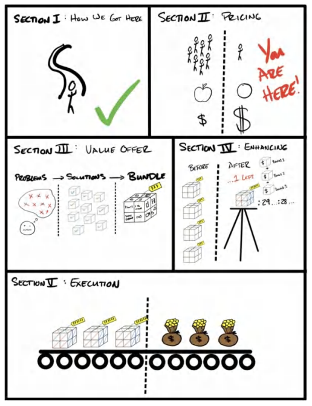
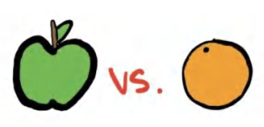

# **PHẦN II: ĐỊNH GIÁ** *Cách định giá cao cho sản phẩm*

## **3. ĐỊNH GIÁ: Bẫy đại trà hóa**

> **Chú thích người dịch** 
> Trong giới kinh doanh, từ "Bẫy đại trà hóa" ám chỉ sự nguy hiểm của việc sản phẩm trở nên "thông thường/phổ biến" đến mức chỉ có thể cạnh tranh bằng cách hạ giá.

>*Nghĩ theo cách khác biệt* - Steve Jobs

"Phát triển hay là Chết" là nguyên tắc cốt lõi tại các công ty của chúng tôi. Chúng tôi tin rằng mỗi cá nhân, mỗi công ty và mỗi sinh vật đều đang trong quá trình phát triển hoặc đang lụi tàn. Khái niệm "duy trì" chỉ là một câu chuyện hoang đường.

Điều này có nghĩa là, nếu công ty của bạn không phát triển, nó đang chết dần. Đây là một thực tế thức tỉnh đối với nhiều người trong chúng ta. Tôi đã học được bài học này một cách cay đắng, và các doanh nghiệp của tôi đã phải chịu đựng trong một thời gian dài vì điều đó.

Để tôi giải thích rõ hơn. Thị trường liên tục tăng trưởng. Thị trường chứng khoán tăng trưởng 9% mỗi năm. Nếu chúng ta không tăng trưởng ở mức 9% mỗi năm, nghĩa là chúng ta đang tụt hậu. "Duy trì", theo nghĩa phổ quát nhất, thực chất phải là mức tăng trưởng 9% hàng năm.

Hơn nữa, nếu bạn đang ở trong một thị trường đang trên đà phát triển, bạn có thể phải tăng trưởng từ 20-30% mỗi năm chỉ để theo kịp, nếu không sẽ có nguy cơ bị bỏ lại phía sau. Vì vậy, bạn có thể thấy tại sao "duy trì" chỉ là một huyền thoại.

Vậy thì, cần những gì để phát triển? May mắn thay, chỉ cần ba điều đơn giản sau:

1. Có thêm nhiều khách hàng hơn.
2. Tăng giá trị mua hàng trung bình của họ.
3. Khiến họ quay lại mua hàng nhiều lần hơn.

Chỉ vậy thôi.

Chắc chắn là có vô vàn cách để thu hút khách hàng và hàng tỷ cách để tăng giá trị đơn hàng cũng như tần suất mua hàng, nhưng tóm gọn lại, chỉ có thế. Đó là ba cách duy nhất để phát triển.

Ví dụ: Nếu tôi bán hàng cho 10 khách hàng mỗi tháng, và mỗi khách hàng mang lại giá trị 1.000 USD cho tôi trong suốt vòng đời của họ (tính bằng giá trị giỏ hàng trung bình x số lần mua hàng trung bình), thì doanh thu doanh nghiệp của tôi sẽ chạm trần ở mức 10.000 USD/tháng (10 x 1.000 USD).

**10 Khách hàng mới/tháng x 1.000 USD Giá trị vòng đời = 10.000 USD/tháng Doanh thu tối đa.**

Nếu bạn muốn phát triển, bạn buộc phải bán được cho nhiều khách hàng hơn mỗi tháng (trong khi vẫn duy trì biên lợi nhuận phù hợp) hoặc khiến họ trở nên giá trị hơn (bằng cách tăng lợi nhuận trên mỗi lần mua hoặc tăng số lần họ mua hàng). Chỉ đơn giản vậy thôi.

>**Ghi chú của Tác giả - Chỉ có hai cách để tăng trưởng**
>
>Để đơn giản hóa khái niệm này hơn nữa: Thực tế chỉ có hai cách để tăng trưởng là có thêm khách hàng và tăng giá trị của mỗi khách hàng. "Tăng giá trị của mỗi khách hàng" bao gồm hai nhánh nhỏ: 1) Tăng lợi nhuận trên mỗi lần mua và 2) Tăng số lần khách hàng mua hàng. Trong phạm vi cuốn sách này, tôi sẽ nhấn mạnh cả hai nhánh nhỏ đó như những con đường tăng trưởng riêng biệt. Tôi làm điều này vì tin rằng nó sẽ giúp bạn dễ dàng hiểu các mô hình tiền tệ sẽ xuất hiện trong Quyển III. Cả ba yếu tố — có thêm khách hàng, tăng giá trị mua hàng trung bình và khiến họ mua nhiều lần hơn — là những chủ đề xuyên suốt trong cuốn sách này. Nhưng nếu bạn muốn sự đơn giản tối thượng, thì cả việc tăng giá trị mua hàng trung bình và tăng số lần mua hàng đều dẫn đến một kết quả duy nhất: tăng giá trị của mỗi khách hàng.

### Các thuật ngữ kinh doanh

Trước khi đi sâu hơn và để làm rõ các khái niệm tiếp theo, chúng ta nên dành chút thời gian để định nghĩa và hiểu rõ hơn về một số khái niệm kinh doanh cốt lõi. Khi tôi đứng trong căn hộ penthouse ở Las Vegas đó với chiếc áo thun "beast mode", tôi đã hoàn toàn mù tịt về những thuật ngữ này. Hãy để tôi giúp bạn hiểu rõ hơn về chúng so với tôi lúc bấy giờ.

**Lợi nhuận gộp (Gross Profit):** Là doanh thu trừ đi chi phí trực tiếp để phục vụ thêm MỘT khách hàng. Nếu tôi bán một lọ kem dưỡng da với giá 10 USD và tốn 2 USD chi phí sản xuất, lợi nhuận gộp của tôi là 8 USD hay 80%. Nếu tôi bán dịch vụ đại lý với giá 1.000 USD/tháng và tốn 100 USD/tháng tiền thuê nhân công để chạy quảng cáo cho khách hàng đó, thì lợi nhuận gộp của tôi là 900 USD hay 90%. *Lưu ý: Đây không phải là lợi nhuận ròng.* Lợi nhuận ròng là số tiền còn lại sau khi đã thanh toán TẤT CẢ các chi phí, chứ không chỉ riêng chi phí thực hiện dịch vụ trực tiếp.

**Giá trị vòng đời (Lifetime Value):** Là tổng lợi nhuận gộp tích lũy được trong suốt toàn bộ quãng thời gian khách hàng sử dụng dịch vụ. Đây là lợi nhuận gộp nhân với số lần mua hàng trung bình mà một khách hàng sẽ thực hiện trong suốt cuộc đời của họ. Sử dụng ví dụ trên, nếu một khách hàng trung bình ở lại trong năm tháng và họ trả 1.000 USD/tháng trong khi tôi tốn 100 USD/tháng để thực hiện dịch vụ, thì giá trị vòng đời của họ là 4.500 USD.

Dưới đây là bảng phân tích:
**Doanh thu: (1.000 USD/tháng * 90% Biên lợi nhuận gộp * 5 tháng) = 4.500 USD Giá trị vòng đời (LTV)**

*Lưu ý rằng các chi phí gián tiếp như quản lý, phần mềm, tiền thuê mặt bằng, v.v., không được tính vào LTV.*

**Ghi chú:** Bạn sẽ thấy các định nghĩa khác nhau về giá trị vòng đời tùy thuộc vào nguồn tài liệu. Sự khác biệt lớn nhất là một số nguồn chỉ tính tổng doanh thu, trong khi những nguồn khác tập trung vào lợi nhuận gộp trong suốt vòng đời. Tôi tập trung vào lợi nhuận gộp. Bạn cũng có thể thấy tôi gọi đây là **LTGP (Lifetime Gross Profit - Lợi nhuận gộp vòng đời)** trong các văn bản khác để cho rõ ràng.

### Mua hàng dựa trên Giá trị so với Mua hàng dựa trên Giá cả

Cuốn sách này được định hướng để trở thành một cuốn giáo trình cho bất kỳ doanh nghiệp nào muốn *tăng trưởng*. Tôi đã dành (và vẫn đang tiếp tục dành) hàng trăm giờ cho các cuộc gọi và gặp gỡ trực tiếp để tư vấn cho các doanh nhân về cách xây dựng lời chào hàng của họ. Tôi đã chứng kiến những lời chào hàng bay cao vút tận tầng bình lưu và cả những cái thất bại thảm hại.

Có một Lời chào hàng Grand Slam khiến bạn gần như không thể thua cuộc. Nhưng tại sao? Điều gì tạo nên tác động lớn đến vậy? Tóm lại, sở hữu một Lời chào hàng Grand Slam giúp giải quyết cả *ba* yêu cầu để tăng trưởng: có thêm nhiều khách hàng hơn, khiến họ trả nhiều tiền hơn và khiến họ mua hàng nhiều lần hơn.

Bằng cách nào? Nó cho phép bạn tạo ra sự khác biệt so với thị trường. Nói cách khác, nó cho phép bạn bán sản phẩm của mình dựa trên GIÁ TRỊ chứ không phải GIÁ CẢ.

* **Hàng hóa phổ thông (Commoditized) = Mua hàng dựa trên Giá cả (Cuộc đua xuống đáy)**
* **Sự khác biệt (Differentiated) = Mua hàng dựa trên Giá trị (Bán trong một phân khúc riêng không có sự so sánh. Đúng vậy, thị trường rất quan trọng, điều mà tôi sẽ trình bày kỹ hơn ở chương tiếp theo).**

Một hàng hóa phổ thông, theo định nghĩa của tôi, là một sản phẩm có thể tìm thấy ở nhiều nơi. Vì lý do đó, nó dễ dẫn đến việc mua hàng dựa trên "giá cả" thay vì "giá trị". Nếu tất cả các sản phẩm đều "như nhau", thì theo mặc định, cái rẻ nhất sẽ là cái có giá trị nhất. Nói cách khác, nếu một khách hàng tiềm năng so sánh sản phẩm của bạn với sản phẩm khác và nghĩ rằng "chúng cơ bản là giống nhau, mình sẽ mua cái rẻ hơn", thì họ đã coi bạn là hàng phổ thông rồi. Thật đáng xấu hổ! Nhưng thực sự... đó là một trong những trải nghiệm tồi tệ nhất mà một doanh nhân định hướng giá trị có thể gặp phải.

Đây là một vấn đề lớn đối với doanh nhân vì các hàng hóa phổ thông được định giá tại điểm hiệu quả của thị trường. Điều này có nghĩa là thị trường sẽ kéo giá xuống thông qua cạnh tranh cho đến khi biên lợi nhuận *vừa đủ* để duy trì hoạt động: "vừa đủ" để trở thành nô lệ cho chính doanh nghiệp của mình. Doanh nghiệp kiếm được "vừa đủ" để chủ sở hữu phải mòn mỏi chờ đợi mọi thứ "xoay chuyển", và đến khi sự thật đó được nhận ra... thì họ đã lún quá sâu để có thể xoay trục (ít nhất là cho đến tận bây giờ).

**Một Lời chào hàng Grand Slam sẽ giải quyết vấn đề này.**

### Vậy Một Lời chào hàng Grand Slam thực hiện điều gì?

Được rồi, hãy bắt đầu bằng việc định nghĩa một Lời chào hàng Grand Slam.
Đó là một lời chào hàng mà bạn trình bày với thị trường mà không thể so sánh được với bất kỳ sản phẩm hoặc dịch vụ nào khác hiện có, kết hợp giữa một chương trình khuyến mãi hấp dẫn, một lời đề nghị giá trị không đối thủ, một mức giá cao cấp và một sự đảm bảo không thể đánh bại cùng với một mô hình tiền tệ (điều khoản thanh toán) cho phép bạn *được trả tiền* để có thêm khách hàng mới... mãi mãi loại bỏ rào cản tiền mặt đối với sự tăng trưởng của doanh nghiệp.

Nói cách khác, nó cho phép bạn bán hàng trong một "phân khúc chỉ có mình bạn", hoặc dùng một cụm từ hay khác là "bán hàng trong môi trường chân không". Kết quả là quyết định mua hàng của khách hàng tiềm năng giờ đây chỉ là giữa sản phẩm của bạn và *con số không*. Nhờ vậy, bạn có thể bán với bất kỳ mức giá nào mà bạn khiến khách hàng cảm nhận được, thay vì so sánh với bất kỳ thứ gì khác. Kết quả là, bạn có thêm nhiều khách hàng hơn, với giá cao hơn, nhưng tốn ít tiền hơn. Nếu bạn thích những thuật ngữ marketing bóng bẩy, nó sẽ được phân tích như sau:

1.  **Tăng tỷ lệ phản hồi (Hãy nghĩ đến các lượt nhấp chuột)**
2.  **Tăng tỷ lệ chuyển đổi (Hãy nghĩ đến các đơn hàng thành công)**
3.  **Mức giá cao cấp (Hãy nghĩ đến việc thu được rất nhiều tiền)**

Sở hữu một Lời chào hàng Grand Slam giúp tăng tỷ lệ phản hồi đối với quảng cáo (tức là sẽ có nhiều người nhấp vào hoặc thực hiện hành động trên một quảng cáo mà họ thấy có chứa Lời chào hàng Grand Slam).

Nếu bạn trả cùng một số tiền để tiếp cận khách hàng nhưng 1) có nhiều người phản hồi hơn, 2) nhiều người trong số đó mua hàng hơn và 3) họ mua với giá cao hơn, doanh nghiệp của bạn sẽ tăng trưởng.

Tôi đã từng "trúng độc đắc" với không ít lời chào hàng. Không phải vì tôi có siêu năng lực nào đó, mà đơn giản vì tôi đã làm việc này rất nhiều lần (và thất bại còn nhiều hơn thế). Tôi đã sàng lọc qua những thứ rác rưởi luôn thất bại và giữ lại tất cả những gì có khả năng tái tạo thành công (và đưa chúng vào cuốn sách này).

Đây là bài học then chốt từ tất cả những điều này: Một doanh nghiệp đều phải thực hiện *cùng một khối lượng công việc* trong cả hai trường hợp (với một sản phẩm phổ thông hoặc một Lời chào hàng Grand Slam). Việc thực hiện dịch vụ là như nhau. Nhưng nếu một doanh nghiệp sử dụng Lời chào hàng Grand Slam và doanh nghiệp kia sử dụng một lời chào hàng "hàng phổ thông", thì Lời chào hàng Grand Slam làm cho doanh nghiệp đó xuất hiện như thể nó có một sản phẩm hoàn toàn khác biệt — và điều đó có nghĩa là việc mua hàng dựa trên giá trị thay vì dựa trên giá cả.

Nếu bạn có một lời chào hàng "hàng phổ thông", bạn sẽ cạnh tranh về giá (mua hàng dựa trên giá cả so với mua hàng dựa trên giá trị). Tuy nhiên, Lời chào hàng Grand Slam của bạn buộc khách hàng tiềm năng phải dừng lại và *suy nghĩ khác đi* để đánh giá giá trị của sản phẩm khác biệt của bạn. Việc này thiết lập bạn vào một phân khúc của riêng mình, điều đó có nghĩa là quá khó để so sánh giá cả, và cũng có nghĩa là bạn đã định chuẩn lại "thước đo giá trị" của khách hàng tiềm năng.

**Toán học về Tiền tệ của Lời chào hàng Grand Slam trong Đời thực: Trước và Sau**
Một câu chuyện ngắn... một trong những công ty của chúng tôi là một phần mềm mà các đại lý quảng cáo sử dụng để xử lý các khách hàng tiềm năng cho khách hàng của họ. Bằng cách sử dụng phần mềm này, các đại lý đã chuyển đổi lời chào hàng của họ từ một lời chào hàng phổ thông về dịch vụ tìm kiếm khách hàng tiềm năng sang một Lời chào hàng Grand Slam theo kiểu "trả phí dựa trên hiệu quả". Hãy để tôi cho bạn thấy hiệu ứng nhân lên của nó đối với doanh thu của doanh nghiệp.

***Mặc dù các con số được làm tròn để dễ hình dung, nhưng những giá trị này dựa trên những con số thực tế từ kinh nghiệm của một đại lý tìm kiếm khách hàng tiềm năng bán dịch vụ cho các doanh nghiệp truyền thống (offline).***

**Cách Phổ thông Cũ (Dựa trên Giá cả) — Cuộc đua xuống đáy**
**Lời chào hàng Phổ thông:** 1.000 USD trả trước, sau đó là 1.000 USD/tháng phí duy trì cho các dịch vụ của đại lý.

| Chỉ số | Mô hình Phổ thông | Grand Slam | Giải thích |
| :--- | :--- | :--- | :--- |
| **Chi phí Quảng cáo** | $10.000 | - | Số tiền chi cho quảng cáo |
| **Lượt tiếp cận** | 300.000 | - | Số lượng người tiếp cận từ quảng cáo |
| **Tỷ lệ phản hồi** | 0,00013 | - | Tỷ lệ người đặt lịch hẹn (CTR x % Optin) |
| **Số lịch hẹn đặt được** | 40 | - | Số lượng lịch hẹn được tạo ra |
| **Tỷ lệ có mặt** | 75% | - | Tỷ lệ phần trăm người thực sự đến cuộc hẹn |
| **Số khách có mặt** | 30 | &nbsp; | Số lượng người thực tế đến cuộc hẹn |
| **Tỷ lệ chốt đơn** | 16% | - | Tỷ lệ phần trăm số người mua hàng |
| **Số đơn đã chốt** | 5 | - | Tổng số khách hàng đã mua hàng |
| **Giá bán** | $1.000 | - | Số tiền khách trả trước để bắt đầu dịch vụ |
| **Tổng doanh thu** | $5.000 | - | Tổng số tiền mặt thu được ngay lập tức |
| **ROAS (Return on Ad Spend)** | 0,5 : 1 | - | Lợi nhuận trên tổng chi phí quảng cáo |

> *Chú thích người dịch* 
>  Commodity: Mô hình phổ thông (bình thường/tầm thường/đại trà)

**Phân tích:** Với tỷ lệ lợi nhuận trên chi phí quảng cáo là 0,5:1, bạn đang bị lỗ khi tìm kiếm khách hàng. Nhưng trong 30 ngày, 5 khách hàng đó sẽ trả thêm mỗi người 1.000 USD, mang lại cho bạn tổng cộng 10.000 USD và đạt mức hòa vốn. Tháng tiếp theo, khoản 5.000 USD thu về sẽ là tháng có lợi nhuận đầu tiên của bạn, và mỗi tháng sau đó đều sẽ có lãi (giả sử tất cả khách hàng đều ở lại).

Đây là một ví dụ về dịch vụ bị "hàng hóa hóa" (commoditized service) — kiểu làm việc đại lý thông thường. Có cả triệu đơn vị như vậy, và tất cả đều trông giống hệt nhau. Các doanh nghiệp và lời chào hàng bị hàng hóa hóa thường gặp khó khăn hơn trong việc nhận phản hồi từ quảng cáo vì mọi chiến dịch marketing của họ đều trông chẳng khác gì những người còn lại.

> **Lưu ý:** Tất cả trông giống nhau vì họ đều đưa ra cùng một lời chào hàng:
> *Bạn trả tiền để chúng tôi làm việc.*
> *Chúng tôi làm việc.*
> *Có thể bạn sẽ nhận được kết quả từ công việc đó. Mà cũng có thể là không.*

Điều này nghe có vẻ hợp lý, nhưng nó rất dễ bị sao chép (và dễ rơi vào tình trạng hàng hóa hóa). **Sự hàng hóa hóa này tạo ra một hành vi mua sắm bị dẫn dắt bởi giá cả...**

Bạn bị buộc phải định giá "cạnh tranh" để có khách hàng và phải giữ mức giá đó để giữ chân họ. Nếu khách hàng thấy một phiên bản rẻ hơn của cùng "một thứ giống vậy", thì sự chênh lệch về giá trị sẽ khiến họ đổi nhà cung cấp ngay lập tức... hoặc là mất khách hàng này (cùng toàn bộ khách hàng hiện tại và tiềm năng), hoặc là phải tiếp tục "cạnh tranh" về giá. Biên lợi nhuận của bạn sẽ mỏng đến mức biến mất.

Hơn nữa, rất khó để khiến khách hàng tiềm năng đồng ý (và duy trì sự đồng ý đó) trừ khi bạn cực kỳ cảnh giác về việc doanh nghiệp của mình bị hàng hóa hóa bằng cách cứ mãi "cạnh tranh giá". Và đó chính là vấn đề với cách làm cũ. Họ có thể so sánh bạn. Trừ khi bạn chuyển sang một **Lời chào hàng Grand Slam** (Grand Slam Offer), nếu không giá của bạn sẽ liên tục bị ép xuống. Doanh nghiệp cuối cùng sẽ lụi bại, hoặc người chủ sẽ phải bỏ cuộc. Chẳng tốt lành gì cả.

Chúng tôi muốn tạo ra một lời chào hàng khác biệt đến mức bạn có thể bỏ qua phần giải thích gượng gạo về việc tại sao sản phẩm của mình lại khác biệt với những người khác (vì nếu họ phải hỏi, thì có lẽ họ quá thiếu thông tin để hiểu được lời giải thích). Thay vào đó, hãy để chính lời chào hàng làm việc đó cho bạn. Đó chính là cách của Lời chào hàng Grand Slam.

Hãy cùng đi sâu vào để thấy sự tương phản trong các con số bán hàng.

**Cách làm mới với Lời chào hàng Grand Slam (Khác biệt, Không thể so sánh) (Dẫn dắt bởi giá trị)**

**Lời chào hàng Grand Slam:** Thanh toán một lần duy nhất. (Không phí duy trì hàng tháng. Không phí giữ chỗ.) Chỉ cần chi trả chi phí quảng cáo. Tôi sẽ tìm kiếm và chăm sóc khách hàng tiềm năng cho bạn. Và bạn chỉ trả tiền cho tôi nếu khách hàng thực sự xuất hiện. Tôi cam kết giúp bạn có 20 người trong tháng đầu tiên, nếu không tháng tiếp theo sẽ hoàn toàn miễn phí. Tôi cũng sẽ cung cấp tất cả các phương pháp hiệu quả nhất từ các doanh nghiệp khác giống như của bạn.

* Huấn luyện bán hàng hàng ngày cho nhân viên của bạn
* Các kịch bản đã qua kiểm chứng
* Các mức giá và lời chào hàng đã được thử nghiệm để bạn chỉ việc "sao chép và triển khai"
* Các bản ghi âm cuộc gọi bán hàng

... và mọi thứ khác bạn cần để bán hàng và đáp ứng nhu cầu khách hàng. Tôi sẽ đưa cho bạn toàn bộ "bí kíp" cho (tên ngành của bạn), hoàn toàn miễn phí chỉ vì bạn đã trở thành khách hàng của tôi.

Nói tóm lại, tôi đưa khách hàng vào doanh nghiệp của bạn, chỉ cho bạn chính xác cách bán hàng cho họ để bạn có thể đạt được mức giá cao nhất, đồng nghĩa với việc bạn kiếm được nhiều tiền nhất có thể... nghe đủ công bằng chứ?

Rõ ràng đây là những lời chào hàng khác biệt một trời một vực... nhưng thì sao nào? **Tiền nằm ở đâu!?** Hãy cùng so sánh cả hai trong bảng dưới đây.

| Chỉ số | Mô hình Phổ thông | Grand Slam | Khác biệt |
| :--- | :--- | :--- | :--- |
| Chi phí quảng cáo | 10.000 USD | 10.000 USD | Không đổi |
| Lượt hiển thị tiếp cận | 300.000 | 300.000 | Không đổi |
| Tỷ lệ phản hồi | 0,00013 | 0,00033 | **Gấp 2,5 lần** (Hấp dẫn hơn nên nhiều người phản hồi hơn) |
| Lịch hẹn đã đặt | 40 | 100 | Kết quả |
| Tỷ lệ khách đến | 75% | 75% | Không đổi |
| Lịch hẹn thực tế | 30 | 75 | Kết quả |
| Tỷ lệ chốt đơn | 16% | 37% | **Gấp 2,3 lần** (Giá trị cao hơn nên nhiều người mua hơn) |
| Đơn hàng đã chốt | 5 | 28 | Kết quả |
| Giá bán | 1.000 USD | 3.997 USD | **Gấp 4 lần** (Phí một lần so với phí duy trì) |
| **Tổng doanh thu** | **5.000 USD** | **112.000 USD** | **Gấp 22,4 lần tiền mặt thu ngay lập tức** |
| ROAS (Return on Ad Spend) | 0,5 : 1 | 11,2 : 1 | **Được trả tiền để có thêm khách hàng.** |

**Phân tích:** Bạn chi cùng một số tiền để tiếp cận cùng một lượng khách hàng mục tiêu. Sau đó, bạn nhận được số người phản hồi quảng cáo nhiều gấp 2,5 lần vì đó là một lời chào hàng hấp dẫn hơn. Từ đó, bạn chốt đơn được nhiều gấp 2,5 lần vì lời chào hàng quá đỗi thuyết phục. Tiếp theo, bạn có thể thu mức giá cao gấp 4 lần ngay từ đầu. Kết quả cuối cùng là $2,5 \times 2,5 \times 4 = 22,4$ lần lượng tiền mặt thu được ngay lập tức. Đúng vậy, bạn chi 10.000 USD để thu về 112.000 USD. Bạn vừa kiếm được tiền ngay trong quá trình tìm kiếm khách hàng mới.

**So sánh:** Bạn còn nhớ cách làm cũ, cái cách mà bạn mất trắng một nửa chi phí quảng cáo ngay từ đầu không? Với cách làm mới này, bạn đang kiếm được *nhiều tiền hơn* và có *nhiều khách hàng hơn*. Điều này có nghĩa là chi phí để có được một khách hàng rẻ đến mức (so với số tiền bạn kiếm được) yếu tố hạn chế duy nhất lúc này chỉ còn là khả năng thực hiện công việc mà bạn vốn đã yêu thích. Dòng tiền và việc tìm kiếm khách hàng không còn là nút thắt cổ chai nữa vì mô hình này mang lại lợi nhuận gấp 22,4 lần so với mô hình cũ. Chuẩn rồi đấy. Bạn không đọc nhầm đâu. Đây chính là đoạn trong phim hành động mà bạn lừng lững bước đi khỏi một vụ nổ trong cảnh quay chậm (slow motion).

Đây chính xác là Lời chào hàng Grand Slam mà chúng tôi đã sử dụng cho doanh nghiệp phần mềm chuyên phục vụ các đại lý (agency) của mình. Những con số có thể trở nên điên rồ... rất nhanh. Tôi biết con số hiệu quả hơn gấp 22,4 lần nghe có vẻ phi lý, nhưng đó mới chính là mấu chốt. Nếu bạn chơi cùng một trò chơi mà mọi người khác đang chơi, bạn sẽ nhận được kết quả giống như họ (tầm thường). Bạn chỉ đánh được những cú đơn, cú đôi, duy trì hoạt động cầm chừng nhưng không bao giờ bứt phá lên được. Nhưng hãy nhớ đoạn mở đầu của cuốn sách này: khi bạn sắp xếp mọi quân bài đúng vị trí, bạn có thể tung một cú "knock-out" hoàn hảo đến mức giành chiến thắng vĩnh viễn. Trong 18 tháng kinh doanh đầu tiên, chúng tôi đã đi từ doanh thu 500.000 USD/năm lên 28.000.000 USD/năm với chi phí quảng cáo chưa đầy 1 triệu USD. Vì vậy, khi tôi nói về tỷ lệ lợi nhuận 20:1... 50:1... hay 100:1, tôi hoàn toàn nghiêm túc. Khi bạn làm đúng, kết quả sẽ thực sự... không thể tin nổi.

**Các điểm tóm tắt**
Chương này đã minh họa vấn đề cơ bản của sự "hàng hóa hóa" và cách Lời chào hàng Grand Slam giải quyết vấn đề đó. Điều này giúp bạn thoát khỏi cuộc chiến về giá và bước vào một phân khúc của riêng mình (category of one). Chương tiếp theo sẽ tập trung vào việc tìm kiếm thị trường phù hợp để áp dụng các chiến lược giá của chúng ta. Đây là một trong những yếu tố quan trọng nhất cần phải làm đúng. Một lời chào hàng Grand Slam đưa ra sai đối tượng sẽ chỉ như "đàn gảy tai trâu". Chúng ta muốn tránh điều đó bằng mọi giá. Chúng ta phải tạm dừng việc định giá một chút để học cách tìm kiếm những gì cần thiết ở một thị trường. Đó là một "ô kiểm" thiết yếu cần tích vào trước khi tiếp tục hành trình của chúng ta.

>**QUÀ TẶNG MIỄN PHÍ #1 – HƯỚNG DẪN BỔ SUNG: "BẮT ĐẦU TẠI ĐÂY"** 
>Nếu bạn muốn tìm hiểu sâu hơn, hãy truy cập *[Acquisition.com/training/offers](https://Acquisition.com/training/offers)* và xem video đầu tiên trong khóa học miễn phí (do chính tôi trình bày) về cách tôi tạo sự khác biệt cho các lời chào hàng trong những doanh nghiệp mà tôi tư vấn và giúp họ thu mức giá cao cấp. Tôi cũng đã tạo ra một số Quy trình chuẩn (SOPs)/Mẹo thực hiện (Cheat Codes) miễn phí để bạn có thể triển khai nhanh hơn. Hoàn toàn miễn phí. Chúc bạn tận hưởng thành quả.