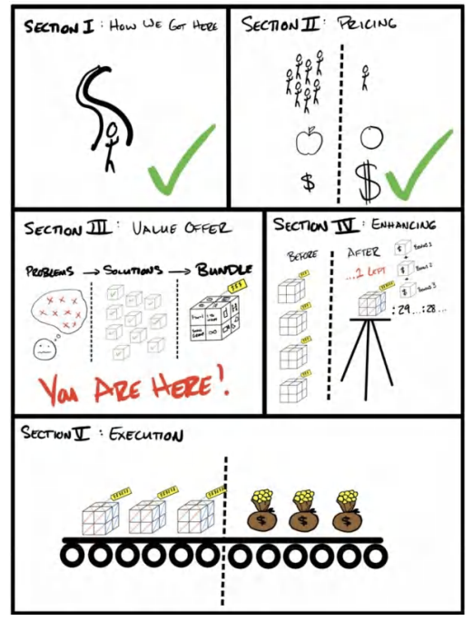
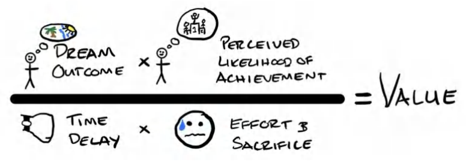
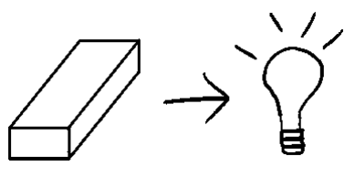
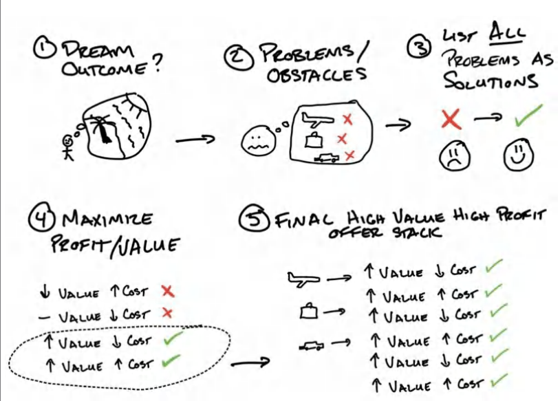
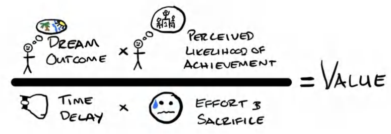
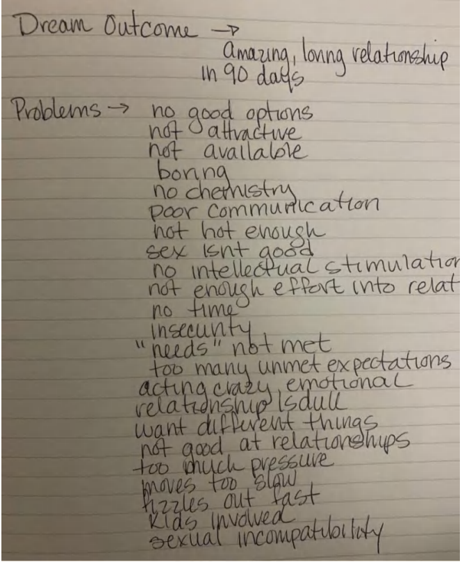
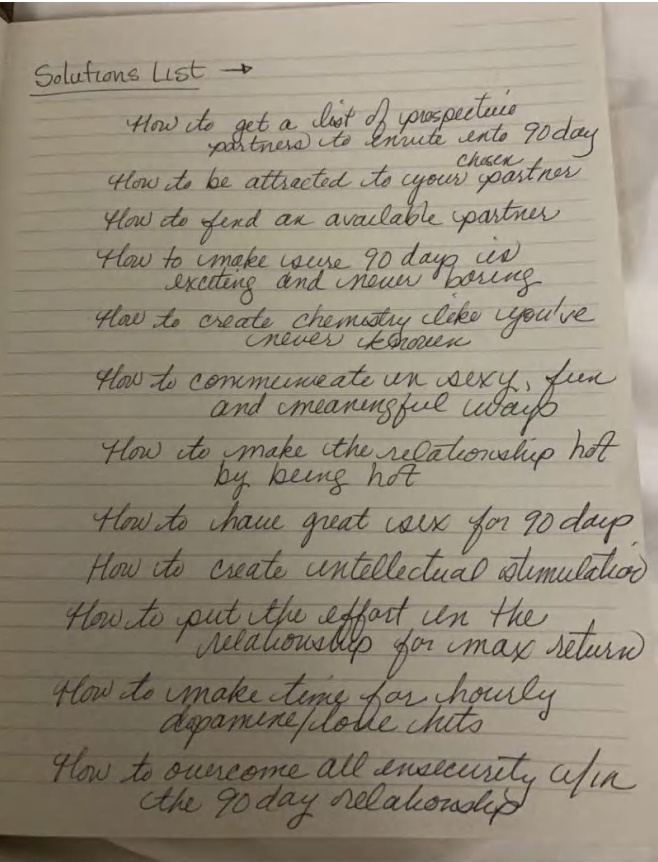
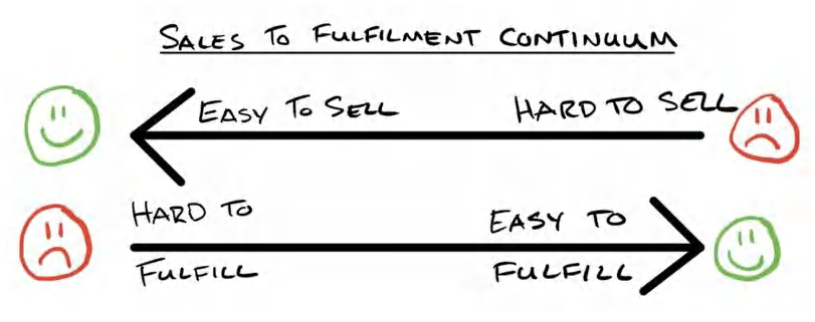
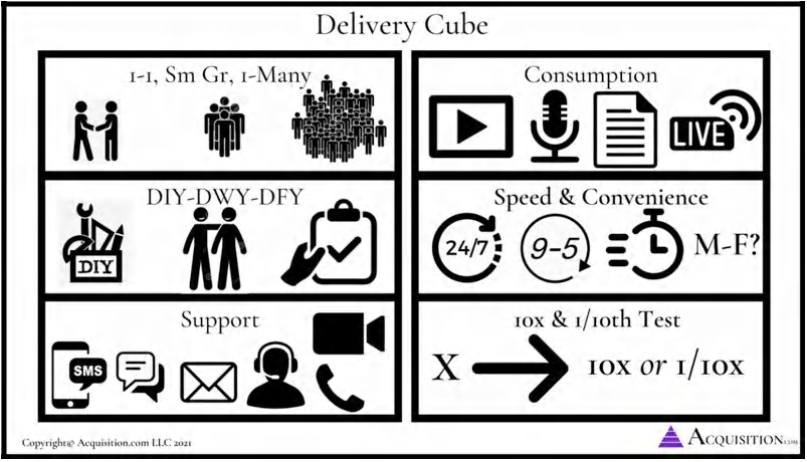

# **Phần III: Giá trị - Tạo lời chào hàng của bạn** **Cách tạo ra những lời chào hàng tuyệt vời đến mức người ta cảm thấy ngu ngốc nếu từ chối.**

## 6. LỜI CHÀO HÀNG GIÁ TRỊ: PHƯƠNG TRÌNH GIÁ TRỊ

>*Chúng ta nghi ngờ mọi niềm tin của mình, ngoại trừ những điều ta thực sự tin tưởng và những điều ta chưa bao giờ mảy may nghĩ đến việc sẽ đặt câu hỏi.* -- ORSON SCOTT CARD

Tôi muốn nói một cách cực kỳ rõ ràng: mục tiêu là tính nhiều tiền nhất có thể cho sản phẩm hoặc dịch vụ của bạn. Tôi đang nói đến những số tiền "khủng khiếp". Như đã nói, bất kỳ ai cũng có thể tăng giá, nhưng chỉ một số ít người có thể đưa ra mức giá đó mà vẫn khiến mọi người đồng ý.

Từ thời điểm này trở đi, bạn phải từ bỏ mọi ý niệm mà bạn có về "công bằng là gì". Mọi công ty khổng lồ trên thế giới đều thu tiền của bạn cho những thứ vốn chẳng tốn kém gì đối với họ. Những công ty điện thoại chỉ tốn vài xu để cho phép thêm một người dùng mới, nhưng họ không ngại tính phí hàng trăm đô la mỗi tháng cho quyền truy cập đó. Những loại thuốc dược phẩm chỉ tốn vài xu để sản xuất, nhưng họ không ngại tính phí hàng trăm đô la một tháng cho chúng. Các công ty truyền thông thu phí quảng cáo của bạn một số tiền cực lớn cho sự chú ý của bạn, trong khi họ chẳng mất gì để khiến bạn thích thú với những bức ảnh chó mèo trên mạng xã hội. Bạn *cần* có một sự chênh lệch lớn giữa chi phí sản xuất và mức giá bạn tính. Đó là cách duy nhất để đạt được thành công phi thường.

Nhiều doanh nhân tin rằng việc tính phí "quá nhiều" là xấu. Thực tế là, đúng vậy, bạn không bao giờ nên tính phí cao hơn giá trị mà sản phẩm mang lại. Nhưng bạn nên tính phí *nhiều hơn rất nhiều* so với chi phí bỏ ra để thực hiện dịch vụ đó. Hãy nghĩ đến con số hơn gấp 100 lần, chứ không chỉ là hai hay ba lần. Và nếu bạn cung cấp đủ *giá trị*, nó vẫn luôn là một món hời cho khách hàng tiềm năng. Đó chính là sức mạnh của giá trị. Nó giải phóng khả năng định giá và lợi nhuận không giới hạn để mở rộng quy mô công ty.

Ví dụ, một trong những khách hàng riêng của tôi (công ty mà tôi có cổ phần) làm trong lĩnh vực nhiếp ảnh. Trong hai năm, bằng cách triển khai các chiến thuật được nêu trong cuốn sách này, chủ sở hữu đã có thể tăng giá trị trung bình trên mỗi đơn hàng (average ticket) từ 300 đô la lên 1.500 đô la. Đó là mức tăng gấp 5 lần (không đùa đâu!). Thậm chí còn tuyệt vời hơn, giờ đây họ dành ít thời gian hơn cho mỗi khách hàng nhưng lại có mức độ hài lòng của khách hàng *cao hơn*. Mức tăng gấp 5 lần về giá trị đơn hàng trung bình đã làm lợi nhuận của doanh nghiệp tăng gấp 38 lần. Nó đi từ việc kiếm được 1.000 đô la/tuần lợi nhuận lên thành 38.000 đô la/tuần lợi nhuận, và vẫn tiếp tục tăng trưởng. Kết quả là, công ty cuối cùng đã có thể tiếp tục mở rộng quy mô sang nhiều địa điểm và cung cấp công việc ý nghĩa cho những nhân viên tuyệt vời. Và một lợi ích thú vị khác là chúng tôi đã có thể quyên góp nhiều tiền hơn cho các tổ chức từ thiện dành cho trẻ em (gần 500.000 đô la tại thời điểm viết cuốn sách này). Nhưng không điều nào trong số đó có thể thành hiện thực nếu không tìm ra điều mà mọi người coi trọng nhất, tập trung sâu vào nó và thẳng tay loại bỏ mọi thứ khác. Mức tăng giá gấp 5 lần có vẻ điên rồ đối với bạn, nhưng khách hàng đã "bình chọn" bằng tiền của họ rằng những gì công ty cung cấp hiện nay *tốt hơn rất nhiều* so với trước đây. Việc giải mã được giá trị sẽ mở ra một thế giới của lợi nhuận, tác động và khả năng không giới hạn.

Những người hiểu rõ về *giá trị* là những người có thể tính phí cao nhất cho dịch vụ của họ. Tin tốt là có một công thức lặp lại mà tôi đã tạo ra (tôi chưa từng thấy nó được trình bày ở đâu khác) để giúp định lượng các biến số tạo ra giá trị cho bất kỳ lời chào hàng nào. Tôi gọi nó là **Phương trình Giá trị**. Một khi bạn đã hiểu nó, bạn sẽ không bao giờ có thể "ngừng nhìn thấy" nó. Nó sẽ vận hành trong tiềm thức của bạn, chạy ngầm trong tâm trí và thôi thúc bạn. Đó là một lăng kính mới để bạn nhìn nhận thế giới.

### **Phương trình Giá trị**

>**QUÀ TẶNG MIỄN PHÍ #4: Video hướng dẫn bổ sung về Phương trình Giá trị & Tài liệu tải về miễn phí:** 
>Nếu bạn muốn biết cách tôi phân tích giá trị cốt lõi của một doanh nghiệp thành một thứ gì đó giá trị hơn, hãy truy cập `acquisition.com/offers` và chọn video "Value Equation" để xem hướng dẫn ngắn gọn. Tôi cũng đã đính kèm một bản danh sách kiểm tra có thể tải về. Mục tiêu của tôi là giành được sự tin tưởng của bạn và mang lại giá trị trước. Hoàn toàn miễn phí, hãy tận hưởng nó nhé.

Như bạn có thể thấy từ hình minh họa, có bốn động lực chính tạo nên giá trị. Hai động lực ở phía trên (tử số) là những gì bạn sẽ tìm cách gia tăng. Hai động lực khác ở phía dưới (mẫu số) là những gì bạn sẽ tìm cách giảm thiểu.

1. (Tuyệt!) Kết quả mơ ước (Mục tiêu: Tăng)
2. (Tuyệt!) Khả năng đạt được kết quả trong cảm nhận (Mục tiêu: Tăng)
3. (Tệ!) Thời gian chờ đợi từ khi bắt đầu đến khi đạt kết quả (Mục tiêu: Giảm)
4. (Tệ!) Công sức & Sự hy sinh phải bỏ ra (Mục tiêu: Giảm)

Nếu bạn chú ý đến những câu hỏi mà bố tôi đã hỏi tôi ở chương trước, bạn sẽ thấy chúng tương ứng với những trụ cột này:

* *Tôi sẽ kiếm được bao nhiêu tiền?* (Kết quả mơ ước)
* *Làm sao tôi biết chắc nó sẽ xảy ra?* (Khả năng đạt được kết quả trong cảm nhận)
* *Sẽ mất bao lâu?* (Thời gian chờ đợi)
* *Tôi phải làm những gì?* (Công sức & Sự hy sinh)

**Đưa phần Mẫu số về mức 0**

Vào thời điểm bắt đầu sự nghiệp, tôi tập trung toàn bộ sự chú ý vào kết quả mơ ước và khả năng đạt được kết quả (bằng chứng xã hội, sự chứng thực từ bên thứ ba, v.v.). Nói cách khác là phần tử số của phương trình. Đó là nơi những người làm marketing mới bắt đầu thường đưa ra những tuyên bố to tát hơn, mạnh mẽ hơn. Việc này rất dễ và thường mang tính lười biếng.

Nhưng thời gian trôi qua, tôi nhận ra rằng những tuyên bố "đao to búa lớn" (larger-than-life) này là dễ thiết lập nhất (và vì thế cũng ít độc đáo nhất). Suy cho cùng, bất kỳ ai cũng có thể đưa ra một lời hứa. Điều khó khăn hơn, và mang tính cạnh tranh cao hơn, chính là việc xử lý Thời gian chờ đợi và Công sức & Sự hy sinh. Những công ty tốt nhất thế giới tập trung toàn bộ sự chú ý của họ vào phần mẫu số của phương trình. Làm cho mọi thứ trở nên tức thì, liền mạch và không tốn sức. Apple đã làm cho việc sử dụng iPhone trở nên không tốn chút công sức nào so với các dòng điện thoại khác vào thời điểm đó. Amazon làm cho việc mua hàng chỉ bằng một cú nhấp chuột và hàng hóa sẽ đến nơi gần như ngay lập tức (có lẽ khi bạn đang đọc những dòng này, họ đã dùng máy bay không người lái để giao hàng đến tận cửa trong vòng 60 phút). Netflix giúp bạn tiêu thụ nội dung trên truyền hình một cách ngay lập tức và không tốn công sức. Vì vậy, tôi càng lớn tuổi, tôi càng chuyển sự tập trung của mình vào "những thứ khó khăn" — đó là giảm thiểu phần mẫu số của phương trình. Và tôi tin rằng bạn càng làm tốt điều này, bạn càng được thị trường trọng thưởng.

Lưu ý cuối cùng: Lý do đây là một phép chia chứ không phải phép cộng ("+") là vì tôi muốn truyền tải một điểm mấu chốt. Nếu bạn có thể khiến phần mẫu số của phương trình bằng không, bạn đã nắm trong tay "gà đẻ trứng vàng". Bất kể phần tử số nhỏ đến mức nào, bất kỳ thứ gì chia cho số không cũng bằng vô cực (về mặt kỹ thuật đối với những người giỏi toán thì đó là không xác định). Nói cách khác, nếu bạn có thể giảm thiểu thời gian chờ đợi để khách hàng nhận được giá trị thực tế về mức không (nghĩa là bạn hiện diện và họ đạt được kết quả mơ ước ngay lập tức), đồng thời công sức và sự hy sinh của họ cũng bằng không, bạn sẽ có một sản phẩm có giá trị vô hạn. Nếu làm được điều này, bạn sẽ chiến thắng cuộc chơi.

Hãy tưởng tượng việc nhấn nút mua một sản phẩm giảm cân và ngay lập tức thấy bụng mình biến thành 6 múi. Hay hãy tưởng tượng việc thuê một công ty marketing, và ngay sau khi bạn ký hợp đồng, điện thoại của bạn bắt đầu đổ chuông với vô số khách hàng tiềm năng chất lượng cao. Những sản phẩm/dịch vụ đó sẽ giá trị đến mức nào? Có giá trị vô hạn. Và đó chính là mấu chốt.

Tôi không biết liệu chúng ta, những doanh nhân, có bao giờ đạt được mức độ đó không, nhưng đó là giới hạn giả thuyết mà tất cả chúng ta nên nỗ lực hướng tới, và đó cũng là lý do tại sao tôi cấu trúc phương trình theo cách này.

**Cảm nhận chính là Thực tế**

Cảm nhận chính là thực tế. Vấn đề không nằm ở chỗ bạn gia tăng khả năng thành công của khách hàng lên bao nhiêu, hay giảm thời gian chờ đợi được bao nhiêu, hoặc giảm thiểu công sức và sự hy sinh của họ được bao nhiêu. Bản thân những điều đó *không* có giá trị. Nhiều lúc, họ sẽ chẳng biết gì về những nỗ lực đó. Lời chào hàng Grand Slam chỉ trở nên giá trị một khi khách hàng tiềm năng *cảm nhận được* (perceives) sự gia tăng trong khả năng thành công, *cảm nhận được* sự sụt giảm trong thời gian chờ đợi, và *cảm nhận được* sự giảm bớt trong công sức và sự hy sinh.

Một ví dụ điển hình cho điều này đã xảy ra trong hệ thống tàu đường hầm ở London. Sự gia tăng lớn nhất trong mức độ hài lòng của hành khách (hay còn gọi là giá trị) không đến từ việc làm cho tàu chạy nhanh hơn để giảm thời gian chờ đợi. Thay vào đó, nó đến từ một bản đồ in hình các dấu chấm đơn giản cho thấy khi nào đoàn tàu tiếp theo sẽ đến và họ phải đợi bao lâu. Bản đồ chỉ tốn vài triệu đô la đó đã làm giảm sự *cảm nhận* của hành khách về thời gian chờ đợi và sự hy sinh (việc phải chờ đợi trong vô định) hiệu quả hơn cả việc thực sự làm cho đoàn tàu chạy nhanh hơn (vốn tốn phí hàng tỷ đô la để thực hiện). Chẳng phải điều đó rất tuyệt sao? Đó chính là cách chúng ta cần tư duy về các sản phẩm của mình.

---

**Mẹo chuyên gia: Giải pháp Logic so với Giải pháp Tâm lý** 
Hầu hết mọi người thường cố gắng giải quyết các vấn đề bằng cách sử dụng các giải pháp *logic*. Nhưng các giải pháp logic thường đã được thử nghiệm rồi... vì chúng logic (đó là điều mà ai cũng sẽ nghĩ đến và thực hiện). Là những chủ doanh nghiệp và doanh nhân, tôi ngày càng tiếp cận các vấn đề để tìm kiếm các giải pháp *tâm lý*, thay vì các giải pháp logic. Bởi vì nếu có một giải pháp logic, có lẽ nó đã được giải quyết rồi, do đó loại bỏ được vấn đề. Tất cả những gì còn lại chính là các vấn đề mang tính tâm lý.

*Các ví dụ lấy cảm hứng từ Rory Sutherland, CMO của Ogilvy Advertising:*

*"Bất kỳ kẻ ngốc nào cũng có thể bán một sản phẩm bằng cách giảm giá, nhưng cần một chiến dịch marketing tuyệt vời để bán cùng sản phẩm đó với mức giá cao cấp."*

*   **Giải pháp Logic**: Làm cho tàu chạy nhanh hơn để tăng sự hài lòng.
*  **Giải pháp Tâm lý**: Giảm bớt nỗi đau của việc chờ đợi bằng cách thêm một bản đồ hiển thị thời gian.
*  **Giải pháp Tâm lý**: Trả tiền cho các người mẫu để họ đóng vai tiếp viên trên chuyến đi (mọi người sẽ ước chuyến đi kéo dài lâu hơn để đến đích!).
*  **Giải pháp Logic**: Làm cho thang máy chạy nhanh hơn.
*  **Giải pháp Tâm lý**: Lắp đặt gương từ sàn đến trần để mọi người bận rộn nhìn ngắm bản thân và quên mất họ đã ở trong thang máy bao lâu.
*  **Giải pháp Logic**: Làm cho nó rẻ hơn.
*  **Giải pháp Tâm lý**: Sản xuất ít hơn và tăng giá lên để khiến mọi người muốn sở hữu nó nhiều hơn.

Thông thường, hầu hết các giải pháp logic đều đã được thử nghiệm nhưng thất bại. Tại thời điểm này của lịch sử, chúng ta buộc phải thử sức với những giải pháp tâm lý để giải quyết vấn đề.

---

Vì vậy, với tư cách là những chủ doanh nghiệp, việc của chúng ta là truyền đạt những động lực tạo ra giá trị này một cách rõ ràng để gia tăng sự cảm nhận của khách hàng tiềm năng về những thực tế này. Mức độ mà bạn trả lời được những câu hỏi này trong tâm trí khách hàng tiềm năng sẽ quyết định giá trị mà bạn đang tạo ra. Chỉ khi đó, chúng ta mới thực sự có thể nhận ra giá trị thực sự của sản phẩm đối với thị trường, và bằng cách mở rộng, là những mức giá "khủng khiếp" mà chúng ta muốn tính.

Rất khó để tách biệt bốn động lực giá trị này ra khỏi nhau, vì hầu hết các phương thức truyền tải đều kết hợp nhiều yếu tố này lại với nhau, nhưng tôi sẽ cố gắng hết sức để phân lập và giải thích rõ ràng từng yếu tố dưới đây.

#### #1 Kết quả mơ ước (Mục tiêu = Gia tăng)

Con người có những khao khát sâu thẳm, không bao giờ thay đổi. Đây là lý do khiến các cuộc hôn nhân tan vỡ, những cuộc chiến tranh nổ ra, và là những điều mà mọi người sẵn lòng hy sinh tính mạng của mình vì nó. Mục tiêu của chúng ta không phải là để tạo ra ham muốn. Nhiệm vụ của chúng ta chỉ đơn giản là dẫn dắt (channel) những ham muốn đó thông qua lời chào hàng và phương tiện kiếm tiền của mình.

Kết quả mơ ước chính là sự thể hiện những cảm xúc và trải nghiệm mà khách hàng tiềm năng đã hình dung trong tâm trí họ. Đó là khoảng cách giữa hoàn cảnh hiện tại và ước mơ của họ. Mục tiêu của chúng ta là mô tả chính xác giấc mơ đó lại cho họ thấy, sao cho họ cảm thấy được thấu hiểu, và giải thích phương tiện (sản phẩm/dịch vụ) của chúng ta sẽ giúp họ đạt được điều đó như thế nào.

Kết quả mơ ước thường đơn giản thôi; đó là "cái đích cuối cùng" nơi giá trị được gia tăng hoặc giảm bớt. 

Mọi người nói chung, và khách hàng của chúng ta nói riêng, đều khao khát:
&emsp;...Được nhìn nhận là xinh đẹp
&emsp;...Được tôn trọng
&emsp;...Được nhìn nhận là có quyền lực
&emsp;...Được yêu thương
&emsp;...Được nâng cao vị thế của mình

Tất cả đều là những động lực mạnh mẽ. 

Nhưng nhiều phương tiện khác nhau có thể thực hiện cùng một việc. Hãy lấy một ví dụ là khao khát "được nhìn nhận là xinh đẹp", dưới đây là rất nhiều thứ tác động đến khao khát đó: 

&emsp;Đồ trang điểm 
&emsp;Kem/huyết thanh chống lão hóa 
&emsp;Thực phẩm bổ sung 
&emsp;Quần áo định hình 
&emsp;Phẫu thuật thẩm mỹ 
&emsp;Tập luyện thể hình 
&emsp;&rarr;Tất cả các phương tiện này đều dẫn dắt ham muốn được coi là xinh đẹp.

Và nếu chúng ta phân tích sâu hơn về ý tưởng khao khát được xinh đẹp, chúng ta sẽ thấy rằng đó có thể là một biểu hiện bên ngoài của một ham muốn sâu sắc hơn: đạt được vị thế cao hơn trong nhóm xã hội của mình.

Nhân tố thúc đẩy giá trị về kết quả mơ ước được sử dụng nổi bật nhất khi so sánh giá trị tương đối giữa *hai ham muốn khác nhau đang được thỏa mãn*. Nhìn chung, kết quả mơ ước nào trực tiếp làm gia tăng vị thế của khách hàng tiềm năng nhất sẽ là điều họ coi trọng nhất. Vì vậy, một khách hàng tiềm năng có thể coi trọng giá trị mà cả một nhóm phương tiện thỏa mãn được khao khát này hơn hẳn một nhóm phương tiện khác thỏa mãn một khao khát khác. Với nhiều người đàn ông, kiếm được nhiều tiền quan trọng hơn là đẹp trai. Tại sao? Bởi vì tiền mang lại vị thế cho họ nhiều hơn là sự điển trai. Vì vậy, nhìn chung, họ sẽ coi trọng tất cả các lời chào hàng giúp họ kiếm được nhiều tiền hơn, hơn là các lời chào hàng giúp họ có vẻ ngoài bảnh bao.

Tôi đã từng nghe Russell Brunson kể một câu chuyện về khái niệm này. Anh ấy giải thích rằng vợ anh ấy, Collette, khi mới nghe về khái niệm vị thế này đã lên tiếng bác bỏ. Cô ấy tuyên bố mình không bị dẫn dắt bởi vị thế và sẽ chẳng bao giờ muốn lái một chiếc Lamborghini cả. Thay vào đó, cô ấy thích chiếc xe minivan của mình hơn. Nhưng sau khi nói chuyện thêm, cô ấy tiết lộ rằng đó là vì lái một chiếc Lamborghini sẽ làm giảm vị thế của cô ấy giữa những người bạn làm mẹ của mình, trong khi lái một chiếc minivan sẽ cho thấy cô ấy là một người mẹ tốt (gia tăng vị thế). Vì vậy, vấn đề không phải là về tiền bạc, mà là về *vị thế* (là sự tăng hoặc giảm tương đối trong vị trí xã hội của một người so với những người khác về mặt xã hội hoặc nghề nghiệp). Hãy nói về những điều mà khách hàng tiềm năng tin rằng sẽ giúp họ nâng cao vị thế, và bạn sẽ thấy họ phải thèm khát (sản phẩm của mình).

>**Mẹo chuyên gia: Hãy trình bày lợi ích dưới góc độ vị thế có được từ cái nhìn của người khác.** 
>Khi viết nội dung quảng cáo (copywriting), bạn có thể làm cho nó mạnh mẽ hơn nhiều bằng cách nói về việc những người khác sẽ nhận thức như thế nào về thành tựu của khách hàng tiềm năng. Ví dụ: Nếu bạn mua cây gậy đánh golf này, cú đánh của bạn sẽ xa thêm 40 yard. Những người bạn chơi golf của bạn sẽ phải "há hốc mồm" khi nhìn thấy quả bóng của bạn bay vút qua họ thêm 40 yard... họ sẽ hỏi xem bạn đã thay đổi điều gì... và chỉ bạn mới biết câu trả lời thôi.

Nói như vậy, khi so sánh hai sản phẩm hoặc dịch vụ thỏa mãn *cùng một* khao khát, giá trị từ kết quả mơ ước sẽ bị triệt tiêu (vì chúng giống nhau). Lúc này, ba biến số còn lại sẽ tạo ra sự khác biệt về giá trị cảm nhận, và cuối cùng là về giá cả. Ví dụ, nếu chúng ta có hai sản phẩm hoặc dịch vụ đều giúp ai đó trở nên xinh đẹp, thì khả năng đạt được kết quả, thời gian chờ đợi và công sức bỏ ra sẽ là những yếu tố phân hóa giá trị cảm nhận của mỗi lời chào hàng.

Nói một cách đơn giản: nếu hai thứ đều làm cho một người đẹp lên, điều gì khiến một cái trị giá 50.000 đô la và cái kia chỉ 5 đô la? Trả lời: Mức độ ảnh hưởng của ba biến số giá trị còn lại.

### #2 Khả năng đạt được kết quả trong cảm nhận (Mục tiêu = Gia tăng)

Đây là biến số cuối cùng tôi thêm vào khi cố gắng suy nghĩ thấu đáo về khung tư duy này vài năm trước. Tôi cảm thấy dường như có điều gì đó còn thiếu nếu chỉ có ba yếu tố kia.

Sau đó, tôi nhận ra rằng mọi người trả tiền cho sự chắc chắn. Họ coi trọng sự chắc chắn. Tôi gọi đây là "khả năng đạt được kết quả trong cảm nhận". Nói cách khác, "Tôi tin rằng xác suất mình đạt được kết quả mình đang tìm kiếm là bao nhiêu nếu tôi thực hiện giao dịch này?"

Ví dụ, bạn sẵn lòng trả bao nhiêu cho ca phẫu thuật của bệnh nhân thứ 10.000 của một bác sĩ phẫu thuật thẩm mỹ so với bệnh nhân đầu tiên của họ? 

Nếu bạn là một người bình thường, lành mạnh: chắc chắn là nhiều hơn rất nhiều. Ý tôi là, bạn thậm chí có thể yêu cầu họ phải trả tiền cho bạn nếu bạn là bệnh nhân đầu tiên của họ.

Vì vậy, bạn có thể thấy ngay từ ví dụ đơn giản này rằng mặc dù dịch vụ bạn nhận được về mặt kỹ thuật là giống nhau, nhưng điều duy nhất thay đổi ở đây là niềm tin của bạn vào việc liệu mình có thực sự đạt được kết quả mong đợi hay không. 

>**Chú thích từ người dịch** 
>*"The only thing that changes is your perceived likelihood of getting what you want"* 
>Được dịch thành... 
>*"điều duy nhất thay đổi ở đây là niềm tin của bạn vào việc liệu mình có thực sự đạt được kết quả mong đợi hay không"* 
>&rarr;Nhấn mạnh rằng giá trị của một sản phẩm tăng lên không phải vì sản phẩm đó thay đổi, mà vì niềm tin của khách hàng vào việc sản phẩm đó sẽ giúp họ thành công đã tăng lên.

Cả hai bác sĩ phẫu thuật đều mất cùng một khoảng thời gian để thực hiện ca mổ (thậm chí, người đã làm 10.000 lần có lẽ sẽ làm nhanh hơn mà vẫn thu phí cao hơn). Vị bác sĩ giàu kinh nghiệm hơn có bản thành tích chứng minh kết quả thực tế, điều này làm tăng sức hấp dẫn của họ.

Mọi người coi trọng khả năng đạt được kết quả trong cảm nhận này. Việc tăng cường niềm tin của khách hàng tiềm năng rằng lời chào hàng của bạn sẽ "thực sự" hiệu quả đối với họ sẽ làm cho lời chào hàng của bạn giá trị hơn nhiều, ngay cả khi khối lượng công việc phía bạn vẫn giữ nguyên. Vì vậy, để gia tăng giá trị với tất cả các lời chào hàng, chúng ta phải truyền đạt khả năng đạt được kết quả trong cảm nhận thông qua thông điệp, các bằng chứng, những gì chúng ta chọn đưa vào hoặc loại bỏ trong bản chào hàng, và các cam kết bảo hành của chúng ta (chúng ta sẽ nói thêm về các phần này sau).

### #3 Thời gian chờ đợi (Mục tiêu = Giảm thiểu)

Thời gian chờ đợi là khoảng cách giữa thời điểm khách hàng mua hàng và thời điểm họ nhận được lợi ích đã hứa. Khoảng cách giữa việc họ mua và việc họ nhận được giá trị/kết quả càng ngắn, dịch vụ hoặc sản phẩm của bạn càng có giá trị.

Có hai khía cạnh của động lực giá trị này: kết quả dài hạn và trải nghiệm ngắn hạn. Thông thường, có những trải nghiệm ngắn hạn diễn ra khi đang trên con đường hướng tới kết quả dài hạn. Chúng xảy ra "trên đường đi" và mang lại giá trị.

Điều quan trọng là phải hiểu cả hai. Thứ mà mọi người *mua* chính là giá trị dài hạn, hay còn gọi là "kết quả mơ ước" của họ. Nhưng thứ khiến họ *ở lại* đủ lâu để đạt được nó chính là trải nghiệm ngắn hạn. Đây là những cột mốc nhỏ mà khách hàng tiềm năng nhìn thấy dọc đường đi để cho thấy họ đang đi đúng hướng. Chúng tôi cố gắng gán càng nhiều cột mốc này càng tốt vào bất kỳ dịch vụ nào mình cung cấp. Chúng tôi muốn khách hàng có được một chiến thắng lớn về mặt cảm nhận từ sớm (càng gần thời điểm mua hàng càng tốt). Điều này mang lại cho họ sự tin tưởng về mặt cảm xúc và động lực để "đi đến cùng" cho đến khi đạt được mục tiêu cuối cùng của họ.

Ví dụ, phải mất một thời gian để giúp một phòng gym kiếm thêm 239.000 đô la mỗi năm. Nhưng đó là thứ họ đang mua. Vì vậy, sau khi họ đã thanh toán, chúng tôi cần tạo ra những chiến thắng cảm xúc nhanh chóng. Một cách chúng tôi thực hiện là giúp quảng cáo của họ được tung ra và giúp họ chốt được đơn hàng 2.000 đô la đầu tiên ngay trong bảy ngày đầu tiên. Bằng cách làm này, quyết định làm việc với chúng tôi của họ được củng cố, và họ ngay lập tức tin tưởng chúng tôi hơn. Điều này khiến họ có nhiều khả năng tuân theo phần còn lại của hệ thống và tiến tới đích đến cuối cùng của mình.

>**Mẹo chuyên gia: Chiến thắng nhanh chóng** 
>Luôn cố gắng kết hợp các chiến thắng ngắn hạn, ngay lập tức cho khách hàng. Hãy sáng tạo. Họ chỉ cần biết rằng mình đang đi đúng hướng và đã đưa ra quyết định đúng đắn khi tin tưởng bạn và doanh nghiệp của bạn.

Hãy để tôi cho bạn một ví dụ khác. Nếu tôi bán cho ai đó một "thân hình bikini", thời gian chờ đợi để hiện thực hóa kết quả đó có thể là 12 tháng hoặc thậm chí lâu hơn. Tuy nhiên, trên con đường đó, khi họ thay đổi cơ thể, họ có thể cảm thấy nhu cầu tình dục cao hơn, nhiều năng lượng hơn và một cộng đồng bạn bè ngày càng tăng.

Ban đầu họ không *mua* những thứ đó, nhưng những thứ đó có thể trở thành những lợi ích ngắn hạn giúp họ tiếp tục tham gia cuộc chơi đủ lâu để đạt được kết quả cuối cùng. Họ mua ước mơ, nhưng họ ở lại vì những lợi ích họ khám phá ra trên đường đi. Bạn càng có thể chứng minh các lợi ích đó sớm hơn và rõ ràng hơn, dịch vụ của bạn sẽ càng giá trị hơn. Đối với một khách hàng giảm cân, chúng tôi sẽ giúp họ gặp gỡ một ai đó khác để họ nhận được các lợi ích xã hội ngay lập tức từ chương trình, đồng thời chúng tôi thường đưa ra một chế độ ăn uống khắt khe hơn lúc đầu. Tại sao ư? Bởi vì chúng tôi muốn họ có một chiến thắng lớn và nhanh chóng về mặt cảm xúc, nhờ đó chúng tôi có thể thuyết phục họ cam kết lâu dài. Điều này cũng dựa trên cơ sở khoa học. Những người trải nghiệm chiến thắng sớm sẽ có nhiều khả năng tiếp tục gắn bó hơn so với những người không có.

Nói như vậy, việc phải đợi từ 12 đến 24 tháng để đạt được điều bạn muốn là một khoảng thời gian *dài*, trong khi bạn có thể thực hiện phẫu thuật hút mỡ chỉ trong một buổi chiều. Đây chỉ là một trong những lý do tại sao mọi người sẵn lòng trả 25.000 đô la cho một ca phẫu thuật hút mỡ kèm căng da bụng, trong khi lại hầu như không muốn trả 100 đô la/tháng để tham gia một trại huấn luyện thể lực (bootcamp).

Nhưng đó không phải là lý do duy nhất, đúng không?

Điều đó dẫn chúng ta đến động lực cuối cùng của giá trị — công sức và sự hy sinh.

>**Mẹo chuyên gia: "Nhanh" chiến thắng "Miễn phí"** 
>Thứ duy nhất đánh bại được "miễn phí" chính là "nhanh". Mọi người sẽ trả tiền cho tốc độ. Nhiều công ty đã nhảy vào các lĩnh vực đang bỏ trống và làm cực kỳ tốt với chiến lược "tốc độ là trên hết". Một vài ví dụ điển hình: cơ quan đăng ký xe (MVD) so với DMV (nơi bạn phải đợi xếp hàng mãi mãi hoặc trả 50 đô la để được bỏ qua hàng và làm mới bằng lái một cách riêng tư). Fedex so với USPS (khi điều tối quan trọng là bưu phẩm phải đến đó qua đêm). Spotify so với Nhạc tải chậm miễn phí. Uber hoặc Đi bộ. "Nhanh" luôn đánh bại "Miễn phí". Nhiều người sẽ luôn sẵn lòng trả giá (trả tiền) cho (giá trị) của tốc độ. Vì vậy, nếu bạn thấy mình đang ở trong một thị trường cạnh tranh với những thứ miễn phí, hãy gấp đôi tốc độ lên.

### #4 Công sức & Sự hy sinh (Mục tiêu = Giảm thiểu)

Đây chính là những gì "tiêu tốn" của mọi người trong các chi phí phụ trợ, hay còn gọi là "những chi phí khác phát sinh trên đường đi". Những chi phí này có thể bao gồm cả hữu hình và vô hình.

Sử dụng ví dụ về fitness so với hút mỡ, hãy cùng nhìn vào sự khác biệt trong công sức và sự hy sinh:

| Công sức và Sự hy sinh khi tập Fitness: | Công sức và Sự hy sinh khi Hút mỡ: |
| :--- | :--- |
| Thức dậy sớm hơn 1-2 tiếng mỗi sáng | Chìm vào giấc ngủ |
| Mất 5-10 tiếng mỗi tuần | Tỉnh dậy và gầy đi, được đảm bảo |
| Ngừng ăn những món ăn bạn yêu thích | Bị đau trong 2-4 tuần |
| Luôn cảm thấy đói | |
| Đau nhức cơ bắp | |
| Cảm giác xấu hổ vì không biết cách tập | |
| Nguy cơ chấn thương | |
| Cảm thấy buồn nôn khi tập quá sức | |
| Đi chợ và chuẩn bị đồ ăn (Meal prepping) | |
| Phải mua thực phẩm mới/đắt đỏ hơn | |
| Mua quần áo mới (có thể là một lợi ích với một số người) | |
| Sợ rằng sẽ bị béo lại sau tất cả những nỗ lực này (sự không bền vững) | |
| v.v... | |

Sự khác biệt khổng lồ, đúng không?

Thực tế, khi nhìn vào marketing của các bác sĩ phẫu thuật thẩm mỹ, đó chính xác là những điểm đau mà họ đánh vào khi nói những câu như: *"Mệt mỏi vì tốn hàng giờ đồng hồ quý báu trong phòng gym... mệt mỏi vì thử những chế độ ăn kiêng chẳng bao giờ hiệu quả?"*

Đó là lý do tại sao khi bạn bán dịch vụ fitness, bạn phải bỏ ra cả giờ đồng hồ để thuyết phục khách hàng chi ra một số tiền bằng 1/10 đến 1/100 số tiền mà họ trả cho phẫu thuật. Đơn giản là không có nhiều giá trị cảm nhận ở đây, bởi vì khả năng đạt được kết quả thì thấp, mà độ trễ thời gian cùng với sự nỗ lực và hy sinh lại quá cao.

Vì vậy, dù kết quả cuối cùng là như nhau, nhưng giá trị của các phương tiện (giải pháp) lại khác biệt một trời một vực, dẫn đến sự chênh lệch lớn về mức giá.

Việc cắt giảm công sức và sự hy sinh, hoặc ít nhất là cảm giác về sự vất vả đó, có thể tạo ra cú hích cực lớn cho sức hấp dẫn của lời chào hàng.

Trong một thế giới lý tưởng, một khách hàng tiềm năng chỉ muốn nói "đồng ý" và kết quả mơ ước của họ sẽ xảy ra ngay lập tức mà không cần thêm bất kỳ nỗ lực nào từ phía họ.

Đây là lý do tại sao các "dịch vụ làm hộ bạn" (done for you services) luôn đắt hơn nhiều so với "tự mình làm" (do-it-yourself), bởi vì khách hàng không phải bỏ ra công sức và hy sinh. Ngoài ra còn có yếu tố khác biệt về "khả năng đạt được kết quả trong cảm nhận". Mọi người tin rằng nếu một chuyên gia thực hiện, họ sẽ có nhiều khả năng đạt được kết quả hơn là nếu họ tự mình thử.

Hy vọng là giờ đây bạn đã có một sự hiểu biết nền tảng về các thành phần của giá trị và cách thức tương tác giữa các thành phần đó tạo ra hoặc làm giảm giá trị mà một người sẵn lòng chi trả.

### **Tổng kết lại tất cả**
Như tôi đã nói ở trên, các yếu tố giá trị này không tồn tại riêng lẻ. Chúng xảy ra cùng nhau, trong một sự kết hợp. Vì vậy, hãy cùng nhìn vào một vài ví dụ sử dụng cả bốn thành phần giá trị cùng một lúc.

Để định lượng giá trị, tôi sẽ chấm điểm chúng trên thang điểm nhị phân là 0 hoặc 1. 1 là đạt được giá trị, 0 là thiếu sót. Sau đó, tôi sẽ cộng cả bốn yếu tố lại để đưa cho bạn một mức xếp hạng giá trị tương đối của một loại dịch vụ. Mục tiêu của chúng ta với tư cách là những nhà marketing và chủ doanh nghiệp là *gia tăng* giá trị của kết quả mơ ước và khả năng đạt được nó, đồng thời *giảm thiểu* thời gian chờ đợi và công sức mà khách hàng phải bỏ ra để đạt được điều đó.

Để bắt đầu, tôi sẽ thực hiện một so sánh song song giữa hai "phương tiện" có cùng kết quả mơ ước: Thiền và thuốc Xanax. Cả hai đều cung cấp cho người mua sự thư giãn, giảm lo âu và cảm giác hạnh phúc. Tôi sẽ chứng minh ba biến số còn lại thay đổi đáng kể giá trị của việc mang lại kết quả mơ ước đó và cuối cùng là mức giá như thế nào.

**Ví dụ:** Kết quả mơ ước: "Thư giãn", "Giảm lo âu", "Cảm giác hạnh phúc" - **Thiền so với Xanax**

| Thước đo giá trị | Thiền | Điểm | Xanax | Điểm |
| :--- | :--- | :---: | :--- | :---: |
| **Kết quả mơ ước** | "Thư giãn", "Giảm lo âu", "Hạnh phúc" | 1/1 | "Thư giãn", "Giảm lo âu", "Hạnh phúc" | 1/1 |
| **Khả năng đạt được** | Thấp, vì hầu hết mọi người đều bị xao nhãng và không duy trì được việc tập thiền hàng ngày | 0/1 | Cao, vì hầu hết mọi người tự tin rằng nếu họ uống thuốc, nó sẽ làm họ thấy thư giãn hơn | 1/1 |
| **Thời gian chờ đợi** | Mất nhiều thời gian để mang lại những kết quả dài hạn. Có một vài lợi ích tức thì sau 10-20 phút (giả sử bạn không cảm thấy bực bội khi tập) | 0.5/1 | 15 phút để cảm nhận tác dụng | 1/1 |
| **Công sức & Hy sinh** | Khó chịu về thể xác (thường bị tê chân tay). Khó chịu về tâm trí (liên tục cảm thấy mình như đang thất bại). Hy sinh thời gian (phải dành thời gian mỗi ngày để tập). | 0/1 | Chỉ việc nuốt một viên thuốc | 1/1 |
| **Giá trị tổng thể** | **Thấp** | **1.5/4** | **Cao** | **4/4** |

Và đó chính là lý do tại sao Xanax là một sản phẩm trị giá hàng tỷ đô la, trong khi tôi biết chẳng có doanh nghiệp thiền định nào trị giá hàng tỷ đô la cả... đó là do giá trị.

Tôi ở đây không phải để tranh luận xem liệu thiền có tốt hơn Xanax hay không (tất nhiên là có rồi), nhưng điều đó không có nghĩa là nó được *cảm nhận* là giá trị hơn.

Đây cũng là lý do tại sao ngành thực phẩm bổ sung (123 tỷ đô la, *Grandview Research*) có quy mô gấp đôi ngành câu lạc bộ sức khỏe (62 tỷ đô la, *IHRSA*). Cả hai đều đạt được cùng một mục tiêu cảm nhận — "trở nên khỏe mạnh hơn", "giảm cân", "vẻ ngoài ưa nhìn", "tăng cường năng lượng", v.v. — nhưng một bên được cảm nhận là giá trị hơn vì nó có các "chi phí" thấp hơn.

Mọi người sẵn lòng chi trả 200 đô la cho các thực phẩm bổ sung hơn là 29 đô la cho thẻ hội viên phòng gym. Việc uống một viên thuốc, hay uống một ly sữa shake, nhanh chóng và dễ dàng hơn nhiều so với việc đến phòng gym mỗi ngày. Do đó... nó được coi trọng hơn.

Thế giới chúng ta đang sống thật điên rồ phải không.

Và bạn có thể chọn ngồi đó rồi đăng những bài viết "than thở" về việc mọi người "đáng lẽ" phải sống thế này thế kia. Hoặc bạn có thể tận dụng cách mà mọi người *đang thực sự sống* và kiếm tiền từ đó. Cuốn sách này dành cho những người muốn trở thành người chiến thắng, chứ không phải nạn nhân của hoàn cảnh.

Bạn có thể chọn làm người đúng hoặc chọn làm người giàu. Cuốn sách này là để giúp bạn trở nên giàu có. Nếu điều đó làm bạn khó chịu, hãy cứ đặt nó xuống và tiếp tục tranh cãi chống lại bản năng con người. Gợi ý nhé: Bạn sẽ không bao giờ thay đổi được nó đâu.

Nói là vậy, nhưng việc phân biệt được giữa thứ người ta coi trọng và thứ thực sự tốt cho họ chính là chìa khóa. Điều đó có nghĩa là: bạn có thể tìm cách kiếm tiền từ những thứ mà khách hàng khao khát (coi trọng), để từ đó có nguồn lực cung cấp cho họ những thứ họ thực sự cần.

Đôi bên cùng có lợi.

Bạn có thể tạo ra dấu ấn của mình trong vũ trụ *trong khi* vẫn kiếm được lợi nhuận.

## **7. TRAO ĐI GIÁ TRỊ TRƯỚC**

>*"Ai nói tiền không mua được hạnh phúc, hẳn là họ chưa cho đi đủ nhiều."* — KHUYẾT DANH

**TODO - PAGE #72**

Những người giúp đỡ người khác (vô điều kiện) sẽ cảm nhận được sự mãn nguyện sâu sắc hơn, sống thọ hơn và kiếm được nhiều tiền hơn.

Tôi muốn tạo cơ hội để mang lại giá trị này cho bạn ngay trong quá trình bạn đọc hoặc nghe cuốn sách này. Để làm được điều đó, tôi có một câu hỏi đơn giản dành cho bạn...

*<u>Bạn có sẵn lòng giúp đỡ một người mà bạn chưa từng gặp, nếu việc đó không làm bạn tốn tiền, và bạn cũng chẳng bao giờ được ghi công không?</u>*

Nếu có, tôi có một lời "thỉnh cầu" thay mặt cho một người mà bạn không quen biết. Và có khả năng là sẽ không bao giờ quen.

Họ cũng giống như bạn, hoặc giống như bạn của vài năm trước: ít kinh nghiệm hơn, đầy khao khát muốn giúp ích cho đời, đang tìm kiếm thông tin nhưng không biết phải tìm ở đâu... và đây chính là lúc bạn xuất hiện.

Cách duy nhất để chúng tôi tại acquisition.com hoàn thành sứ mệnh giúp đỡ các doanh nhân là, trước hết, phải tiếp cận được họ. Và hầu hết mọi người, trên thực tế, vẫn thường "đánh giá một cuốn sách qua bìa của nó" (và qua những lời nhận xét về nó). Nếu bạn thấy cuốn sách này có giá trị cho đến thời điểm hiện tại, bạn có thể vui lòng dành một chút thời gian ngay bây giờ để lại một đánh giá chân thực về cuốn sách và nội dung của nó không? Bạn chẳng mất mát gì ngoại trừ nó sẽ tốn của bạn chưa đầy 60 giây.

&emsp;Đánh giá của bạn sẽ giúp cho...

&emsp;...thêm một doanh nhân nữa có thể nuôi sống gia đình của anh (hoặc cô) ấy. 
&emsp;...thêm một nhân viên nữa tìm được công việc mà họ thấy có ý nghĩa. 
&emsp;...thêm một khách hàng nữa có được sự thay đổi tích cực mà lẽ ra họ sẽ không bao giờ gặp được. 
&emsp;...thêm một cuộc đời nữa thay đổi theo hướng tốt đẹp hơn.

&emsp;**Để điều đó xảy ra... tất cả những gì bạn cần làm là... và việc này chỉ tốn chưa đầy 60 giây... hãy để lại một đánh giá.**

* **Nếu bạn đang nghe trên Audible**: hãy nhấn vào dấu ba chấm ở góc trên cùng bên phải thiết bị, chọn "rate & review", sau đó viết vài câu về cuốn sách cùng với số sao đánh giá.
* **Nếu bạn đang đọc trên Kindle hoặc các thiết bị đọc sách điện tử**: bạn có thể cuộn xuống cuối cuốn sách, sau đó vuốt lên và nó sẽ tự động hiện thông báo yêu cầu đánh giá.
* **Nếu vì lý do nào đó mà các chức năng trên thay đổi**: bạn có thể truy cập trang của cuốn sách trên Amazon (hoặc bất cứ nơi nào bạn đã mua) và để lại đánh giá trực tiếp trên trang đó.

**Tái bút (PS)** – Nếu bạn cảm thấy vui khi giúp đỡ một doanh nhân xa lạ, bạn chính là kiểu người mà tôi rất trân trọng. Tôi lại càng hào hứng hơn khi được giúp bạn giành thắng lợi rực rỡ trong các chương sắp tới (bạn sẽ yêu những chiến thuật mà tôi sắp trình bày cho mà xem).

**Tái bút thứ hai (PPS)** – Mẹo nhỏ cuộc sống: nếu bạn giới thiệu một thứ gì đó có giá trị cho ai đó, họ sẽ gắn liền giá trị đó với bạn. Nếu bạn muốn nhận được thiện chí trực tiếp từ một doanh nhân khác – hãy gửi cuốn sách này cho họ.

Cảm ơn bạn từ tận đáy lòng. Bây giờ, hãy quay lại với nội dung chính của chúng ta thôi nào.

- Người hâm mộ lớn nhất của bạn, Alex

## 8. LỜI CHÀO HÀNG GIÁ TRỊ: QUY TRÌNH TƯ DUY

>*"Nếu bạn không thành công ngay ở lần đầu tiên, hãy thử, thử, và thử lại lần nữa."* 
>\- THOMAS H. PALMER, SÁCH HƯỚNG DẪN CỦA GIÁO VIÊN

Tôi muốn cùng bạn thực hiện một bài tập ngay bây giờ. Tôi muốn chỉ cho bạn thấy sự khác biệt giữa việc giải quyết vấn đề bằng **tư duy hội tụ** và **tư duy phân kỳ**. Tại sao ư? Để bạn có thể thực sự tạo ra Bản chào hàng Grand Slam — thứ sẽ trở thành nền tảng cốt lõi cho doanh nghiệp của bạn.

**Tư duy Hội tụ & Tư duy Phân kỳ**

Nói một cách đơn giản, tư duy hội tụ là nơi bạn lấy rất nhiều biến số, tất cả đều đã biết, với các điều kiện không thay đổi và hội tụ lại một câu trả lời duy nhất. Hãy nghĩ về môn toán.

*Ví dụ:*

&emsp;Bạn có 3 nhân viên bán hàng, mỗi người có thể thực hiện 100 cuộc gọi mỗi tháng. 
&emsp;Cứ 4 cuộc gọi thì tạo ra một đơn hàng (bao gồm cả những trường hợp khách không đến/không nghe máy). 
&emsp;Bạn cần đạt được 110 đơn hàng...

&emsp;**Bạn phải thuê thêm bao nhiêu nhân viên bán hàng?** 
&emsp;Thông tin suy luận:

&emsp;1 nhân viên = 100 cuộc gọi 
&emsp;4 cuộc gọi = 1 đơn hàng 
&emsp;100 cuộc gọi / 4 cuộc gọi mỗi đơn = 25 đơn hàng trên mỗi nhân viên 
&emsp;25 đơn hàng/nhân viên

&emsp;*Mục tiêu:* 110 đơn hàng tổng cộng / 25 đơn hàng mỗi nhân viên = 4,4 nhân viên.

&emsp;Vì bạn không thể thuê 4,4 người, bạn quyết định phải có 5 người. 
&emsp;**CÂU TRẢ LỜI: Và vì bạn đã có 3 người, bạn thuê thêm 2 người nữa.**

Các bài toán thường mang tính hội tụ. Có rất nhiều biến số nhưng chỉ có một câu trả lời duy nhất. Suốt cuộc đời đi học, chúng ta được dạy để tư duy theo cách này. Đó là bởi vì nó rất dễ để chấm điểm.

Nhưng cuộc đời sẽ trả thưởng cho bạn dựa trên khả năng giải quyết vấn đề bằng **quy trình tư duy phân kỳ**. Nói cách khác, hãy nghĩ ra nhiều giải pháp cho một vấn đề duy nhất. Không chỉ vậy, các câu trả lời hội tụ thường mang tính nhị phân — chúng chỉ có đúng hoặc sai. Với tư duy phân kỳ, bạn có thể có nhiều câu trả lời đúng, và có một câu trả lời đúng hơn nhiều so với những câu trả lời còn lại. Nghe tuyệt phải không?

Đây là những gì cuộc sống đặt ra cho chúng ta đối với tư duy phân kỳ: Nhiều biến số, Cái đã biết & Cái chưa biết, Các điều kiện thay đổi liên tục, Nhiều câu trả lời.

Vì vậy, tôi muốn cùng bạn thực hiện một bài tập giúp kích hoạt phần não bộ mà bạn cần sử dụng để tạo ra một điều gì đó kỳ diệu.

Tôi gọi đó là bài tập "viên gạch". Đừng lo, nó chỉ tốn của bạn 120 giây thôi.

**Bài tập về Viên gạch**

Ngay bây giờ, tôi muốn bạn đặt đồng hồ hẹn giờ trên điện thoại trong 120 giây. Những gì bạn cần làm là: Nghĩ về một viên gạch.

Hãy viết ra càng nhiều công dụng *khác nhau* của một viên gạch mà bạn có thể nghĩ ra. Một viên gạch có thể được sử dụng theo bao nhiêu cách khác nhau để cung cấp giá trị cho cuộc sống?

Sẵn sàng chưa? Bắt đầu. Bạn có thể viết ngay vào sách.

> **Đáp án của người dịch**
>* Xây nhà
>* kê đồ
>* Làm đồ chơi bằng cách điêu khắc
>* làm vũ khí
>* làm công cụ đập phá

Được rồi — dừng lại. Bây giờ, trước khi tôi cho bạn xem danh sách của mình, bạn có cân nhắc đến những điều sau không...

... Viên gạch lớn cỡ nào? Một thỏi kẹo cao su, kích thước tiêu chuẩn 3.5 x 2.25 x 8 inch, hay 2 x 2 x 6 feet?
... Viên gạch được làm bằng gì? Nhựa, Vàng, Đất sét, Gỗ, Kim loại?
... Viên gạch có hình dáng như thế nào? Nó có lỗ không? Nó có các rãnh để lắp ghép không?

Bây giờ khi bạn nghĩ về điều đó, bạn có thể nghĩ ra thêm nhiều công dụng cho viên gạch hơn những gì bạn vừa viết xuống không?

Dưới đây là danh sách của tôi:
*   Chặn giấy
*   Chặn cửa
*   Xây dựng đồ vật
*   Nhà cho cá trong bể cá
*   Giá cắm cây (đổ đất vào lỗ của viên gạch có lỗ)
*   Làm cúp lưu niệm (viên gạch được sơn màu)
*   Trang trí phong cách mộc mạc (rustic)
*   Để đập vỡ cửa sổ
*   Làm tranh tường (sơn lên các viên gạch nhỏ)
*   Quả tạ để tập kháng lực
*   Cái chêm dưới sàn nhà không bằng phẳng
*   Ống cắm bút (viên gạch có lỗ)
*   Đồ chơi cho trẻ em (gạch lego)
*   Thiết bị nổi (với gạch nhựa)
*   Dùng để thanh toán hàng hóa (thỏi vàng)
*   Vật giữ thăng bằng để tựa đồ vật vào
*   Vật lưu trữ giá trị (thỏi vàng)
*   Giá cắm cột cờ (viên gạch có lỗ)
*   Cái ghế ngồi (viên gạch khổng lồ)

Mọi bản chào hàng đều có các "khối xây dựng" — những mảnh ghép mà khi kết hợp lại sẽ tạo thành một bản chào hàng không thể cưỡng lại. Mục tiêu của chúng ta là sử dụng quy trình tư duy phân kỳ để nghĩ ra càng nhiều cách kết hợp các yếu tố này một cách dễ dàng nhằm cung cấp giá trị.

Vì vậy, nếu tôi đang bán một viên gạch, tôi sẽ tìm hiểu xem khao khát của khách hàng là gì, sau đó nghĩ ra bao nhiêu cách tôi có thể tạo ra giá trị với "viên gạch" của mình.

Bây giờ, hãy bắt đầu thực hiện thật sự nào.

## 9. LỜI CHÀO HÀNG GIÁ TRỊ: TẠO RA LỜI CHÀO HÀNG GRAND SLAM   PHẦN I: VẤN ĐỀ & GIẢI PHÁP

>*"ABC, Dễ như 1 2 3, đơn giản như đồ rê mi"*
>— MICHAEL JACKSON, bài hát "ABC"

---
 
1. KẾT QUẢ MƠ ƯỚC? &rarr;
2. VẤN ĐỀ / TRỞ NGẠI &rarr;
3. LIỆT KÊ TẤT CẢ VẤN ĐỀ THÀNH GIẢI PHÁP &rarr;
4. TỐI ĐA HÓA LỢI NHUẬN / GIÁ TRỊ &rarr;
5. GÓI BẢN CHÀO HÀNG GIÁ TRỊ CAO LỢI NHUẬN CAO CUỐI CÙNG
---

Khi mới bắt đầu mở phòng tập gym, tôi đã gặp rất nhiều khó khăn. Tôi khao khát thành công đến mức muốn chứng minh rằng bố tôi đã sai khi phản đối quyết định tự kinh doanh của tôi, và để chứng minh cho chính mình thấy rằng tôi có giá trị. Nhưng dù cố gắng thế nào, tôi cũng không thể bán nổi gói tập bootcamp giá 99 đô la/tháng. Mọi người lại nói: "LA Fitness chỉ có 29 đô la/tháng. Chỗ này đắt quá." Thậm chí tôi đã thử cho mọi người tập miễn phí. Họ lại nói rằng họ không muốn bắt đầu vì sau đó mức phí 99 đô la vẫn là quá nhiều, và họ không muốn bắt đầu một thứ mà họ không thể duy trì lâu dài.

Đó là một cấp độ thất vọng mới khi bạn thậm chí không thể cho không dịch vụ của mình. Tôi cảm thấy mình thật vô dụng và không biết phải làm gì. Thật may mắn, trong thời gian đó, tôi được tham gia vào các nhóm chủ phòng gym khác và bắt đầu nghe nói về những người làm marketing và các cuốn sách. Tôi đã "ngấu nghiến" mọi thứ mình có thể tìm được. Và ngay khi tôi tình cờ đọc được những cuốn sách của Dan Kennedy, tôi đã bị cuốn hút hoàn toàn.

Trong các cuốn sách của mình, ông nói về việc tạo ra "những lời chào hàng không thể cưỡng lại". Một lần nữa, chủ đề "tạo ra một lời chào hàng tốt đến mức mọi người cảm thấy ngớ ngẩn khi từ chối" lại xuất hiện. Nhưng lần này, nhớ lại những gì TJ đã nói với mình, tôi quyết định dấn thân hoàn toàn vào khái niệm này, thay vì chỉ làm những gì người khác đang làm.

*Nhưng làm bằng cách nào?* Mọi người khác đều đang bán các gói bootcamp giá 99 đô la/tháng. Làm sao tôi có thể cạnh tranh được? Vì vậy, tôi quyết định xem xét những gì mình đã làm theo một cách khác. Tôi nghĩ — *khách hàng thực sự muốn gì?* Không ai thực sự muốn một cái "thẻ thành viên" cả; họ muốn giảm cân.

**Bước #1: Xác định Kết quả Mơ ước**

Tôi đã nghe nói về các thử thách giảm cân, vì vậy tôi bắt đầu từ đó.
* Giảm 20 pounds trong 6 tuần.
* Kết quả mơ ước lớn — giảm 20 lbs.
* Với thời gian chờ đợi được giảm xuống — 6 tuần.

*Lưu ý:* Tôi không còn bán thẻ thành viên nữa. Tôi không bán vé máy bay. Tôi đang bán **kỳ nghỉ**. Khi bạn nghĩ về kết quả mơ ước của khách hàng, nó phải là việc họ đến được đích và những gì họ muốn được trải nghiệm.

**Bước #2: Liệt kê các Vấn đề**

Tiếp theo, tôi viết ra tất cả những điều mà mọi người đang phải vật lộn và những suy nghĩ hạn hẹp bao quanh họ. Khi liệt kê các vấn đề, hãy nghĩ về những gì xảy ra ngay trước và ngay sau khi ai đó sử dụng sản phẩm/dịch vụ của bạn. Điều "tiếp theo" mà họ cần giúp đỡ là gì? Đây là tất cả các vấn đề. Hãy nghĩ về chúng thật kỹ, chi li đến từng chân tơ kẽ tóc. Nếu bạn làm được điều này, bạn sẽ tạo ra một lời chào hàng giá trị và thuyết phục hơn, vì bạn sẽ liên tục giải đáp được vấn đề tiếp theo của mọi người ngay khi nó xuất hiện.

Vì vậy, hãy bắt đầu liệt kê các vấn đề từ góc nhìn của khách hàng tiềm năng khi họ nghĩ về chúng. Những rào cản nào tồn tại đối với họ? Tôi muốn nghĩ theo trình tự mà khách hàng sẽ trải qua từng trở ngại này. Một lần nữa, hãy tập trung vào các chi tiết một cách điên rồ (càng nhiều vấn đề thì càng tốt!).

**Ví dụ danh sách Vấn đề: Giảm cân**

*Điều đầu tiên họ phải làm: Mua thực phẩm lành mạnh, đi siêu thị.*
1.  Mua thực phẩm lành mạnh rất khó, gây bối rối và tôi sẽ không thích nó.
2.  Mua thực phẩm lành mạnh sẽ mất quá nhiều thời gian.
3.  Mua thực phẩm lành mạnh rất đắt đỏ.
4.  Tôi sẽ không thể nấu đồ ăn lành mạnh mãi được. Gia đình tôi sẽ cản trở tôi. Nếu tôi đi du lịch, tôi sẽ không biết phải mua gì.

*Việc tiếp theo họ phải làm: Nấu đồ ăn lành mạnh.*
1.  Nấu đồ ăn lành mạnh rất khó và gây bối rối. Tôi sẽ không thích nó và tôi sẽ nấu dở tệ.
2.  Nấu đồ ăn lành mạnh sẽ mất quá nhiều thời gian.
3.  Nấu đồ ăn lành mạnh rất đắt đỏ. Nó không xứng đáng.
4.  Tôi sẽ không thể mua đồ ăn lành mạnh mãi được. Gia đình tôi sẽ cản trở tôi. Nếu tôi đi du lịch, tôi sẽ không biết làm sao để nấu đồ ăn lành mạnh.

*Việc tiếp theo họ phải làm: Ăn đồ ăn lành mạnh.*
1. v.v...
*Việc tiếp theo họ phải làm: Tập thể dục thường xuyên.*
1. v.v...

Bây giờ chúng ta sẽ đi trọn một vòng ở đây. Mỗi vấn đề trên đều có bốn yếu tố tiêu cực. Và bạn đoán đúng rồi đó, mỗi yếu tố đều tương ứng với bốn động lực giá trị.

1.  **Kết quả Mơ ước** &rarr; Việc này sẽ không đáng về mặt tài chính.
2.  **Khả năng đạt được** &rarr; Nó sẽ không hiệu quả với riêng tôi. Tôi sẽ không thể duy trì được. Các yếu tố bên ngoài sẽ cản trở tôi. (Đây là nhóm vấn đề độc đáo và đặc thù nhất của dịch vụ).
3.  **Công sức & Sự hy sinh** &rarr; Việc này sẽ quá khó, gây bối rối. Tôi sẽ không thích nó. Tôi sẽ làm hỏng bét.
4.  **Thời gian** &rarr; Việc này sẽ tốn quá nhiều thời gian để thực hiện. Tôi quá bận để làm việc này. Sẽ mất quá lâu để có kết quả. Nó sẽ không thuận tiện cho tôi.

Bây giờ, hãy tiếp tục và liệt kê *tất cả* các vấn đề mà khách hàng tiềm năng của bạn gặp phải. Đừng để những "nhóm vấn đề" này — vốn chỉ nhằm giúp não bộ của bạn hoạt động — hạn chế bạn. Nếu thấy dễ dàng hơn, cứ liệt kê ra mọi thứ bạn có thể nghĩ tới.

Những gì tôi trình bày ở đây không chỉ là bốn vấn đề. Chúng ta có 16 vấn đề cốt lõi với hai đến bốn vấn đề phụ bên dưới mỗi loại. Vậy là tổng cộng có từ 32 đến 64 vấn đề. Wow! Hèn gì hầu hết mọi người không đạt được mục tiêu của họ. Đừng để bị choáng ngợp. Đây là tin tốt nhất từ trước đến nay. Bạn càng nghĩ ra nhiều vấn đề, bạn càng có nhiều vấn đề để giải quyết.

Vì vậy, để tóm tắt, hãy liệt kê ra từng việc cốt lõi mà ai đó phải làm. Sau đó, hãy nghĩ về tất cả các lý do khiến họ không thể làm được, hoặc không thể duy trì việc đó (sử dụng bốn động lực giá trị làm hướng dẫn).

Bây giờ chúng ta đến với phần thú vị nhất: **Biến vấn đề thành giải pháp.**

**Bước #3: Danh sách Giải pháp**

Bây giờ chúng ta đã có kết quả mơ ước và tất cả những trở ngại sẽ cản đường ai đó, đã đến lúc xác định các giải pháp của chúng ta và liệt kê chúng ra.

Việc tạo danh sách giải pháp có hai bước. Đầu tiên, chúng ta sẽ chuyển đổi các vấn đề của mình thành các giải pháp. Thứ hai, chúng ta sẽ đặt tên cho các giải pháp này. Chỉ vậy thôi. Vì vậy, hãy cùng nhìn lại danh sách các vấn đề của chúng ta từ trước. Những gì chúng ta sẽ làm chỉ đơn giản là biến chúng thành các giải pháp bằng cách nghĩ: *"Tôi cần chỉ cho ai đó điều gì để giải quyết vấn đề này?"* Sau đó, chúng ta sẽ đảo ngược từng yếu tố của trở ngại thành ngôn ngữ hướng đến giải pháp. Đây là kỹ thuật Copywriting 101. Nó nằm ngoài phạm vi của cuốn sách này, nhưng chỉ cần thêm từ "cách làm" (how to) sau đó đảo ngược vấn đề sẽ mang lại cho những người mới bắt đầu một điểm khởi đầu tuyệt vời. Với mục đích của chúng ta, chúng ta đang lập cho mình một checklist của chính xác những gì chúng ta sẽ phải làm cho khách hàng tiềm năng và những gì chúng ta sẽ giải quyết cho họ.

Một khi chúng ta có danh sách các giải pháp, chúng ta sẽ vận hành cách chúng ta thực sự giải quyết các vấn đề này (tạo ra giá trị) trong bước tiếp theo. Và tôi muốn đảm bảo 100% rõ ràng: Bạn *sẽ* giải quyết mọi vấn đề. Chúng ta sẽ cùng nhau khám phá cách thực hiện trong bước tiếp theo.

**VẤN ĐỀ &rarr; GIẢI PHÁP**

*<u>VẤN ĐỀ: Mua thực phẩm lành mạnh, đi siêu thị</u>*

... là khó khăn, gây bối rối, tôi sẽ không thích nó. Tôi sẽ làm hỏng bét &rarr; Cách để việc mua thực phẩm lành mạnh trở nên dễ dàng và thú vị để bất kỳ ai cũng có thể làm được (đặc biệt là những bà mẹ bận rộn!) 
... tốn quá nhiều thời gian &rarr; Cách để mua thực phẩm lành mạnh một cách nhanh chóng. 
... đắt đỏ &rarr; Cách để mua thực phẩm lành mạnh với chi phí thấp hơn hóa đơn đi chợ hiện tại của bạn. 
... không bền vững &rarr; Cách để việc mua thực phẩm lành mạnh tốn ít công sức hơn là mua thực phẩm không lành mạnh. 
... không phải là ưu tiên của tôi. Nhu cầu của gia đình tôi sẽ cản trở tôi &rarr; Cách để mua thực phẩm lành mạnh cho bạn và gia đình bạn cùng một lúc. 
... không thể thực hiện được nếu tôi đi du lịch; tôi sẽ không biết phải mua gì &rarr; Cách để có thực phẩm lành mạnh khi đang đi du lịch.

*<u>VẤN ĐỀ: Nấu đồ ăn lành mạnh</u>*

... là khó khăn, gây bối rối. Tôi sẽ không thích nó, và tôi sẽ nấu dở tệ &rarr; Cách để bất kỳ ai cũng có thể tận hưởng việc nấu các bữa ăn lành mạnh một cách dễ dàng. 
... sẽ tốn quá nhiều thời gian &rarr; Cách để nấu bữa ăn trong vòng chưa đầy 5 phút. 
... đắt đỏ, không xứng đáng &rarr; Cách ăn uống lành mạnh thực tế lại rẻ hơn so với thực phẩm không lành mạnh. 
... không bền vững &rarr; Cách để việc ăn uống lành mạnh kéo dài mãi mãi. 
... không phải là ưu tiên của tôi, nhu cầu của gia đình tôi sẽ cản trở tôi &rarr; Cách nấu ăn này bất chấp những lo ngại của gia đình bạn. 
... không thể thực hiện được nếu tôi đi du lịch; tôi sẽ không biết cách nấu ăn lành mạnh &rarr; Cách để du lịch mà vẫn nấu ăn lành mạnh.

*<u>VẤN ĐỀ: Ăn đồ ăn lành mạnh</u>*

... là khó khăn, gây bối rối, và tôi sẽ không thích nó -> Cách để ăn những món ăn lành mạnh ngon miệng mà không cần tuân theo các hệ thống phức tạp... v.v.

*<u>VẤN ĐỀ: Tập thể dục thường xuyên</u>*

... là khó khăn, gây bối rối, và tôi sẽ nấu dở tệ -> Hệ thống tập luyện dễ dàng mà mọi người đều yêu thích... v.v.

Được rồi, hù! Đó là rất nhiều vấn đề (và rất nhiều giải pháp được trực giác hóa nhờ tư duy phân kỳ). Bạn cũng sẽ nhận thấy rằng rất nhiều trong số chúng bị lặp lại. Điều đó hoàn toàn bình thường. Các động lực giá trị là bốn lý do cốt lõi. Các vấn đề của chúng ta luôn liên quan đến những động lực đó, và các giải pháp của chúng ta cung cấp câu trả lời cần thiết để cho khách hàng tiềm năng sự cho phép để mua hàng. Điều điên rồ hơn nữa là: nếu *chỉ có một* trong những nhu cầu này bị thiếu trong một giải pháp, nó có thể khiến ai đó *không* mua hàng. Bạn sẽ phải ngạc nhiên trước những lý do mà mọi người không mua đấy. Vì vậy, đừng tự giới hạn mình ở đây.

Brooke Castillo là một người bạn điều hành một đế chế đào tạo kỹ năng sống khổng lồ. Để cho bạn một cái nhìn khác về danh sách vấn đề-giải pháp, Brooke đã gửi cho tôi danh sách của cô ấy khi cô ấy đang đọc cuốn sách này để tạo ra một Lời chào hàng Grand Slam cho khóa học "Mối quan hệ 90 ngày" (90-Day Relationship course). Hãy xem để thấy quy trình này thông qua một lăng kính hoàn toàn khác. Nhưng điểm mấu chốt là: Đừng làm phức tạp hóa. Chỉ cần liệt kê tất cả các vấn đề ra, sau đó biến chúng thành các giải pháp.

Bất kể lời chào hàng bạn đang tạo ra là về fitness (giống như ví dụ), một khóa học về mối quan hệ (giống như Brooke), hay một thứ gì đó hoàn toàn khác (như chữa đau tai), giờ đây chúng ta đã biết mình cần phải làm gì. Bước bốn là *cách thức* (và cách thực hiện mà không làm "cháy túi").

__________________________________________________________________
**QUÀ TẶNG MIỄN PHÍ #5 Video hướng dẫn bổ sung: Tạo Bản chào hàng Phần 1** 
&emsp;Nếu bạn muốn cùng tôi thực hiện quy trình này, hãy truy cập `Acquisition.com/training/offers` sau đó chọn "Offer Creation Part 1" để xem video hướng dẫn ngắn. Như mọi khi, nó hoàn toàn miễn phí. Tôi cũng có một **Bản danh sách kiểm tra Tạo Bản chào hàng Miễn phí** để bạn có thể áp dụng và triển khai ngay lập tức trong doanh nghiệp của mình. Hãy tận hưởng nhé.
__________________________________________________________________

---
 
**Kết quả Mơ ước** &rarr; Có một mối quan hệ tuyệt vời và yêu thương trong vòng 90 ngày.

**Các Vấn đề** &rarr;
*   Không có lựa chọn nào tốt
*   Không có sức hút (không hấp dẫn)
*   Đối phương không sẵn sàng (đã có chủ hoặc không muốn gắn bó)
*   Nhàm chán
*   Không có sự tương hợp/lôi cuốn (no chemistry)
*   Giao tiếp kém
*   Không đủ nóng bỏng/quyến rũ
*   Chuyện chăn gối không tốt
*   Không có sự kích thích về trí tuệ
*   Không nỗ lực đủ nhiều cho mối quan hệ
*   Không có thời gian
*   Cảm giác bất an/thiếu tự tin
*   Các "nhu cầu" không được đáp ứng
*   Có quá nhiều kỳ vọng không được thỏa mãn
*   Hành động điên rồ, quá cảm tính
*   Mối quan hệ tẻ nhạt
*   Muốn những thứ khác nhau (bất đồng quan điểm/mục tiêu)
*   Không giỏi trong việc duy trì các mối quan hệ
*   Quá nhiều áp lực
*   Tiến triển quá chậm
*   Nhanh chóng lụi tàn
*   Có con cái liên quan (ảnh hưởng đến mối quan hệ)
*   Không hòa hợp về tình dục
---

---
 
**Danh sách Giải pháp** &rarr;
*   Cách để có một danh sách các đối tác tiềm năng để mời vào mối quan hệ 90 ngày.
*   Cách để cảm thấy bị thu hút bởi đối tác mà bạn đã chọn.
*   Cách để tìm một đối tác đang sẵn sàng (available).
*   Cách để đảm bảo 90 ngày luôn thú vị và không bao giờ nhàm chán.
*   Cách để tạo ra sự tương hợp/lôi cuốn (chemistry) như bạn chưa từng biết đến.
*   Cách để giao tiếp theo những cách quyến rũ, vui vẻ và ý nghĩa.
*   Cách để làm cho mối quan hệ trở nên nóng bỏng bằng cách chính bạn trở nên nóng bỏng.
*   Cách để có chuyện chăn gối tuyệt vời trong suốt 90 ngày.
*   Cách để tạo ra sự kích thích về trí tuệ.
*   Cách để nỗ lực vào mối quan hệ để đạt được hiệu quả tối đa.
*   Cách để tạo ra thời gian cho những "cú hích" dopamine/tình yêu hàng giờ.
*   Cách để vượt qua mọi sự bất an trong mối quan hệ 90 ngày.
---

## 10. LỜI CHÀO HÀNG GIÁ TRỊ: TẠO RA LỜI CHÀO HÀNG GRAND SLAM   PHẦN II: CẮT TỈA & CHỒNG LỚP

>*"Cắt! Cắt! Cắt!"* — RACHEL GREEN TRONG PHIM "FRIENDS"

Tôi chia chương này thành hai phần vì đây là phần "đắt giá" nhất trong cuốn sách. Nó cũng là phần quan trọng nhất. Nếu không có một sản phẩm hoặc dịch vụ giá trị, phần còn lại của cuốn sách sẽ không có nhiều ý nghĩa thực tiễn. Chúng ta vừa đi qua tất cả các vấn đề mà chúng ta sẽ giải quyết. Phần thứ hai của việc tạo ra bản chào hàng của bạn là chia nhỏ về mặt chiến thuật những gì chúng ta sẽ làm/cung cấp cho khách hàng. Về lý thuyết, tất cả chúng ta đều muốn bay đến tận nơi và sống cùng khách hàng để giải quyết vấn đề của họ. Nhưng trên thực tế, điều đó sẽ không tạo ra một doanh nghiệp có khả năng mở rộng tốt. Lời chào hàng của chúng ta cần phải vừa cực kỳ hấp dẫn, vừa có lợi nhuận.

Như đã nói, nếu đây là Lời chào hàng Grand Slam đầu tiên của bạn, việc mang lại giá trị vượt xa mong đợi một cách điên rồ là cực kỳ quan trọng (*xem thêm chú thích người dịch bên dưới*). Có lẽ việc bay đến tận nơi không phải là một ý tưởng tồi lúc mới bắt đầu. Hãy chốt một vài đơn hàng, sau đó nghĩ cách làm cho việc đó trở nên dễ dàng hơn cho khách hàng của bạn. Bạn muốn họ nghĩ rằng: *"Mình nhận được tất cả những thứ này, chỉ với ngần ấy tiền sao?"* Về cốt lõi, bạn muốn họ cảm nhận được **giá trị khổng lồ**.

>**Chú thích người dịch** 
>*"it’s important to over-deliver like crazy."* &rarr;
>* Quan trọng là phải cung cấp dịch vụ vượt trên cả kỳ vọng của khách hàng.
>* Phải làm tốt hơn mong đợi một cách 'khủng khiếp' – đó mới là điều quan trọng.
>* Cứ làm lố hơn cả mức người ta yêu cầu đi, điều đó cực kỳ quan trọng đấy.

Mọi người đều thích những món hời. Một số người sẵn sàng mua những thứ trị giá 100.000 đô la chỉ với giá 10.000 đô la. Đó là nơi chúng ta muốn hướng tới: giá cao, nhưng là một "món hời" so với giá trị mang lại (giống như hy vọng của tôi về cuốn sách này cho đến nay).

**Dải liên tục giữa Bán hàng và Vận hành (Sales to Fulfillment Continuum)**

Để hấp thụ tốt nhất các khái niệm về cắt tỉa và chồng lớp, chúng ta cần một sự tái định khung về tư duy. 

Hãy làm quen với dải liên tục giữa bán hàng và vận hành.

Bất cứ khi nào bạn xây dựng một doanh nghiệp, bạn luôn có một dải liên tục giữa sự dễ dàng trong vận hành (fulfillment) và sự dễ dàng trong bán hàng. Nếu bạn giảm bớt những gì mình phải làm, nó sẽ làm tăng độ khó khi bán sản phẩm hoặc dịch vụ đó. Nếu bạn thực hiện tối đa các phần việc có thể, nó sẽ làm cho sản phẩm hoặc dịch vụ của bạn dễ bán hơn nhưng lại khó vận hành hơn vì yêu cầu sự đầu tư lớn về thời gian của bạn. Bí quyết, và cũng là mục tiêu cuối cùng, là tìm ra một "điểm vàng" (sweet spot) nơi bạn bán được thứ gì đó rất tốt và đồng thời cũng dễ vận hành.

Tôi luôn sống theo phương châm: "Tạo ra dòng chảy. Kiếm tiền từ dòng chảy. Sau đó mới thêm lực cản." Điều này có nghĩa là tôi tạo ra nhu cầu *trước tiên*. Sau đó, với bản chào hàng của mình, tôi khiến khách hàng nói "có". Một khi tôi đã có khách hàng đồng ý, lúc đó, và chỉ lúc đó, tôi mới thêm "lực cản" vào marketing của mình, hoặc quyết định cung cấp *ít hơn* với cùng một mức giá.

Tính thực tế dẫn dắt quy trình này. Nếu bạn không thể thu hút được nhu cầu, bạn sẽ chẳng biết liệu những gì mình có có thực sự tốt hay không. Tôi thà làm nhiều hơn cho mỗi khách hàng và có dòng tiền đổ vào, sau đó mới tối ưu hóa doanh nghiệp của mình nhưng vẫn có dòng tiền, còn hơn là không có xu nào (và chẳng biết mình cần điều chỉnh điều gì để phục vụ khách hàng tốt hơn).

Dưới đây là một ví dụ hoàn hảo để minh chứng cho điều này. Khi tôi bắt đầu Gym Launch, các chủ phòng gym đã tìm đến tôi để xin giúp đỡ. Họ cần sự giúp đỡ nhiều đến mức tôi không biết phải bắt đầu từ đâu. Nhưng tôi muốn đảm bảo họ nhận được nhiều hơn những gì họ đã trả cho tôi. Vì vậy, đây là những gì tôi đã làm để giúp họ lấp đầy phòng gym: Tôi sẽ bay đến phòng gym của họ trong 21 ngày, tự bỏ tiền túi cho khách sạn, thuê xe, ăn uống, quảng cáo, tìm kiếm khách hàng tiềm năng, chốt đơn hàng, sau đó bàn giao lại cho họ. Tôi sẽ tự mình thực hiện mọi công đoạn. Tôi chấp nhận mọi rủi ro.

Họ chỉ cần bỏ ra 500 đô la để "đặt chỗ", số tiền này tôi cam kết hoàn trả vào cuối đợt triển khai. Vì vậy, họ có 0 rủi ro tài chính, 0 rủi ro thời gian, 0 công sức, và thỏa thuận là, tôi được giữ lại toàn bộ số tiền mặt thu được từ việc bán dịch vụ của họ, và họ có được lượng khách hàng miễn phí. Bạn có thể hình dung ra bản chào hàng này hấp dẫn đến mức nào rồi đấy.

Một mình tôi đã có thể thu về khoảng 100.000 đô la/tháng tiền mặt trả trước cho bản thân. Vì vậy, những thương vụ này rất béo bở đối với tôi. Theo thời gian, tôi đã mở rộng quy mô lên một nhóm 8 người đi triển khai hàng tháng. Nhưng việc này bắt đầu khiến tôi và đội ngũ của mình kiệt sức. Chính tại thời điểm đó, tôi nhận ra rằng nếu tôi chỉ đơn giản dạy họ cách làm những gì tôi đã làm, tôi có thể tính phí bằng khoảng 1/3 những gì tôi thường kiếm được, nhưng tôi có thể giúp hàng trăm phòng gym mỗi tháng thay vì tám phòng. Và, tôi có thể làm tất cả những việc đó ngay tại chiếc giường của mình vào mỗi đêm.

Lời hứa của tôi về cơ bản vẫn giữ nguyên: Tôi sẽ lấp đầy phòng gym của bạn trong 30 ngày. Chỉ đơn giản là *cách thức* (how) và *những gì* (what) tôi làm đã thay đổi. "cách thức" và "những gì" chính là những thứ chúng ta sắp mổ xẻ.

Khi nói chuyện với các chủ doanh nghiệp về mô hình của họ, tôi bảo họ hãy tạo ra dòng tiền bằng cách cung cấp giá trị vượt trội (over-delivering) một cách điên rồ ngay từ đầu. Sau đó mới dùng dòng tiền đó để khắc phục khâu vận hành và làm cho doanh nghiệp hiệu quả hơn. Quy trình tinh chỉnh này có thể diễn ra rất mượt mà. Thậm chí bạn không cần phải thay đổi nội dung lời chào hàng. Có thể bạn chỉ cần tạo ra các hệ thống mang lại giá trị tương đương cho khách hàng nhưng tiêu tốn của bạn ít nguồn lực hơn đáng kể.

Cuối cùng, đây là cách các doanh nghiệp chiến thắng lẫn nhau. Hiểu rõ điều này sẽ rất quan trọng khi bạn mở rộng quy mô kinh doanh của mình.

Giờ đây, khi chúng ta đã xác định được tầm quan trọng của 'điểm tựa' và cách tiếp cận sự cân bằng giữa bán hàng - thực hiện cam kết ngay từ đầu, hãy cùng đi sâu vào hai bước cuối cùng để tạo nên một Lời chào hàng Grand Slam. Để tóm tắt nhanh, hãy nhớ rằng chúng ta đã đi qua việc xác định kết quả mơ ước (bước một), liệt kê các vấn đề (bước hai) và xác định các giải pháp (bước ba).

**Bước #4 Tạo các Phương thức Cung cấp Giải pháp ("Cách thức - The How")**

Bước tiếp theo là suy nghĩ về tất cả những thứ bạn *có thể làm* để giải quyết từng vấn đề mà bạn đã xác định. Đây là bước quan trọng nhất trong quy trình này. Đây là những gì bạn sẽ bàn giao. Đây là những gì bạn sẽ làm hoặc cung cấp để đổi lấy tiền.

Với mục tiêu duy trì sự sáng tạo ở mức cao (tư duy phân kỳ), hãy nghĩ về *bất cứ thứ gì bạn có khả năng thực hiện*. Hãy nghĩ về tất cả những thứ có thể gia tăng giá trị cho lời chào hàng của bạn. Nhiều đến mức họ sẽ cảm thấy thật ngớ ngẩn nếu từ chối.

Bạn có thể làm gì để ai đó lập tức nói: *"Tất cả những thứ đó sao? Thật á? Được rồi, tôi đồng ý."*

Thực hiện bài tập này sẽ giúp công việc bán hàng của bạn trở nên Dễ dàng. Hơn. Rất nhiều.

Thậm chí nếu bạn nghĩ ra điều gì đó mà thực tế bạn không sẵn lòng thực hiện, điều đó cũng không sao cả. Mục tiêu ở đây là đẩy bản thân đến giới hạn và kích hoạt não bộ tư duy về một phiên bản khác của giải pháp mà bình thường bạn vẫn mặc định làm theo. Đây là lúc bạn rèn luyện khả năng sáng tạo trong kinh doanh của mình.

**Lời nhắc:** Bạn chỉ cần thực hiện việc này **một lần duy nhất**. Theo đúng nghĩa đen là một lần cho một sản phẩm có thể tồn tại trong nhiều năm. Đây là công việc có giá trị cao, đòn bẩy cao. Cuối cùng, bạn đang được trả tiền cho **tư duy** của mình. Bạn có được điều này. Việc này sẽ rất thú vị. Hãy tiến tới và liệt kê ra mọi khả năng có thể. Sau đó, tôi sẽ hướng dẫn bạn qua ví dụ của tôi. Tôi sẽ sử dụng lại vấn đề về mua sắm thực phẩm từ trước để làm ví dụ. Tôi muốn nhóm các thứ lại theo số lượng người mà tôi sẽ cung cấp giải pháp đó cùng một lúc.

Danh sách của tôi nằm ở dưới. Và ở dưới cùng, tôi sẽ tặng bạn "mã gian lận" (cheat codes) của tôi về cách tôi nghĩ qua vấn đề này để bạn thậm chí còn sáng tạo hơn nữa.

**Vấn đề: Mua Thực phẩm Lành mạnh là Khó khăn, Gây bối rối, và Tôi Sẽ Không Thích**

*Nếu tôi muốn cung cấp giải pháp 1-kèm-1, tôi có thể cung cấp...*

1.  Trực tiếp đi siêu thị cùng nhau: tôi đưa khách hàng đến cửa hàng và dạy họ cách mua sắm.
2.  Danh sách thực phẩm cá nhân hóa: tôi dạy họ cách lập danh sách cho riêng mình.
3.  Dịch vụ mua sắm trọn gói: tôi tự đi mua đồ ăn cho họ. Chúng ta đang nói đến việc thực hiện hộ 100%.
4.  Buổi hướng dẫn trực tiếp (không phải ở cửa hàng): tôi dạy họ nên mua những gì.
5.  Hỗ trợ qua tin nhắn trong khi họ đang đi mua sắm: tôi giúp họ nếu họ bị lúng túng.
6.  Gọi điện hướng dẫn khi họ đang đi siêu thị: tôi lên kế hoạch gọi điện khi họ đi mua sắm để đưa ra chỉ dẫn và hỗ trợ.

*Nếu tôi muốn cung cấp giải pháp theo nhóm nhỏ, tôi có thể cung cấp...*

1.  Trực tiếp đi siêu thị cùng nhau: tôi gặp một nhóm khách hàng và đưa tất cả họ đi mua sắm cho chính họ.
2.  Danh sách thực phẩm cá nhân hóa: tôi dạy một nhóm cách tự lập danh sách hàng tuần. Tôi có thể làm việc này mỗi tuần một lần hoặc định kỳ nếu muốn.
3.  Mua đồ ăn cho họ: tôi mua thực phẩm cho cả nhóm và giao đến tận nơi cho họ.
4.  Buổi hướng dẫn tập trung: tôi dạy cả nhóm (tại một địa điểm bên ngoài) những việc cần làm (không phải tại cửa hàng).

*Nếu tôi muốn cung cấp giải pháp "một-cho-nhiều", tôi có thể cung cấp...*

1.  Chuyến đi siêu thị ảo trực tiếp: tôi có thể livestream cảnh mình đi siêu thị cho tất cả các khách hàng mới và cho họ đặt câu hỏi trực tiếp.
2.  Video quay sẵn chuyến đi siêu thị: tôi có thể đi siêu thị một lần, quay video lại, sau đó gửi cho khách hàng xem và tham khảo bất cứ khi nào họ muốn.
3.  Công cụ tự tính toán thực phẩm (DIY Grocery calculator): tôi tạo ra một công cụ có thể chia sẻ hoặc dạy họ cách sử dụng công cụ để tự tính danh sách thực phẩm cho mình.
4.  Các danh sách định sẵn: mỗi kế hoạch khách hàng nhận được đều đi kèm với danh sách thực phẩm tương ứng cho từng tuần. Tôi có thể chuẩn bị sẵn các danh sách này một lần duy nhất để họ sử dụng bất cứ lúc nào.
5.  Hệ thống đồng đội đi siêu thị: tôi ghép cặp các khách hàng với nhau, việc này chẳng tốn thời gian của tôi mấy, và để họ cùng nhau đi mua sắm.
6.  Giỏ hàng soạn sẵn trên Insta-cart để giao hàng: tôi có thể chuẩn bị sẵn các giỏ hàng trên Insta-cart để khách hàng có thể nhận thực phẩm được giao tận cửa chỉ với một cú nhấp chuột.

Như bạn thấy đấy, danh sách có thể kéo dài mãi mãi. Đây chỉ là ví dụ để minh họa cho nhiều cách giải quyết một **vấn đề duy nhất**. 

Bây giờ, hãy thực hiện việc này cho *tất cả* các vấn đề mà khách hàng của bạn gặp phải trước, trong và sau trải nghiệm với sản phẩm/dịch vụ của bạn. Bạn nên có một danh sách khổng lồ vào cuối quy trình này.

**"Mã gian lận" về Phương thức Cung cấp Sản phẩm**

Cái gì cơ? Bạn đang gặp khó khăn trong việc sáng tạo ư? Tôi sẽ đưa cho bạn các "mã gian lận" ngay bây giờ, giống như tôi đã làm với bài tập về viên gạch: "viên gạch có thể bằng vàng, hoặc nhựa, hoặc có lỗ, hoặc là một mảnh lego, v.v." Dưới đây là "mã gian lận" của tôi cho sự biến đổi/nâng cấp sản phẩm và một hình ảnh trực quan để chia nhỏ quy trình cho bạn lấy từ bộ tài liệu tư vấn của tôi:

---

KHỐI LẬP PHƯƠNG CUNG ỨNG (DELIVERY CUBE)
1. Mức độ phục vụ: 1-1, Nhóm nhỏ, Một-cho-nhiều
2. Mức độ nỗ lực: DIY (Tự làm) - DWY (Làm cùng bạn) - DFY (Làm hộ bạn)
3. Hình thức tiêu thụ: Video, Âm thanh, Văn bản, Trực tiếp
4. Hỗ trợ: Tin nhắn, Email, Điện thoại, Zoom
5. Tốc độ & Sự thuận tiện: 24/7, 9-5, Trong vòng 5 phút, Trong vòng 24 giờ
6. Bài kiểm tra 10x & 1/10: Nếu khách trả gấp 10 lần hoặc 1/10 giá hiện tại thì bạn sẽ làm gì?
---

### TODO - page 88

1.  **Tôi muốn cung cấp mức độ phục vụ cá nhân nào?** Một-kèm-một, nhóm nhỏ, hoặc một-cho-nhiều.
2.  **Mức độ nỗ lực nào được kỳ vọng từ họ?** Họ tự làm (DIY) - tìm cách tự thực hiện; làm cùng họ (DWY) - bạn dạy họ cách làm; làm hộ họ (DFY) - bạn làm cho họ hoàn toàn.
3.  **Nếu thực hiện trực tiếp (live), tôi muốn cung cấp qua môi trường hay kênh nào?** Gặp mặt trực tiếp, hỗ trợ điện thoại, hỗ trợ email, hỗ trợ tin nhắn, hỗ trợ Zoom, hỗ trợ chat.
4.  **Nếu thực hiện qua bản ghi (recording), tôi muốn họ tiêu thụ theo cách nào?** Âm thanh, video, hoặc văn bản.
5.  **Chúng ta muốn phản hồi nhanh đến mức nào?** Vào những ngày nào? Trong khung giờ nào? 24/7, 9-5, trong vòng 5 phút, trong vòng một giờ, trong vòng 24 giờ?
6.  **Bài kiểm tra 10x và 1/10:** Nếu khách hàng trả cho tôi mức giá gấp 10 lần (hoặc 100.000 đô la), tôi sẽ cung cấp những gì? Nếu họ chỉ trả 1/10 mức giá hiện tại và tôi phải làm cho sản phẩm của mình giá trị hơn hiện tại, tôi sẽ làm điều đó bằng cách nào? Làm sao tôi vẫn có thể giúp họ thành công với mức giá chỉ bằng 1/10? Hãy mở rộng tư duy của bạn theo cả hai hướng, bạn sẽ nảy ra những giải pháp vô cùng khác biệt.

Nói cách khác, làm thế nào tôi có thể thực sự **cung cấp** những giải pháp mà tôi tuyên bố mình sẽ mang lại? Hãy làm điều này cho từng vấn đề bởi vì những giải pháp từ một vấn đề sẽ gợi ý những ý tưởng cho các vấn đề khác mà bạn thường không nghĩ tới.
Hãy nhớ rằng, việc giải quyết **mọi** vấn đề là rất quan trọng. Tôi không thể nói cho bạn biết bao nhiêu lần một mục nhỏ lẻ lại trở thành lý do khiến ai đó không mua hàng.

---

**Giai thoại: Tại sao chúng ta phải giải quyết mọi vấn đề mà khách hàng cảm nhận được**
Khi tôi đang bán dịch vụ giảm cân, tôi nhấn mạnh rằng mọi người phải chuẩn bị toàn bộ đồ ăn tại nhà. Tôi thấy quá khó để giúp khách hàng giảm cân khi họ đi ăn ngoài vì họ luôn phá vỡ chế độ ăn uống của mình. Thay vì giải quyết vấn đề, tôi khăng khăng bắt họ làm theo cách của mình, nếu không thì thôi. Kết quả là, tôi đã mất rất nhiều đơn hàng.
Có một tháng tôi thực sự cần tiền để trả tiền thuê nhà. Một khách hàng tiếp theo bước vào là một quản lý doanh nghiệp đang tìm cách giảm cân. Khi chúng tôi đi vào phần trình bày doanh số, cô ấy bảo tôi rằng chương trình sẽ không hiệu quả với mình vì cô ấy phải đi ăn trưa bên ngoài hàng ngày với đối tác. Thông thường, tôi sẽ để mất đơn hàng này. Tôi là một người rất cứng nhắc trong việc ép khách hàng không được ăn ngoài. Nhưng tôi thực sự *cần* tiền. Không muốn để mất đơn hàng chỉ vì *một điều này*, tôi đã nhượng bộ: "Tôi sẽ làm cho cô một cuốn cẩm nang ăn uống khi đi nhà hàng để cô có thể ăn ngoài 100% thời gian mà vẫn đạt được mục tiêu. Cô thấy sao?" Cô ấy đồng ý, và tôi đã chốt được đơn hàng.

Tôi đã dành thời gian để lập ra một cuốn cẩm nang ăn uống ngoài cho cô ấy. Nhưng kể từ thời điểm đó trở đi, bất cứ khi nào ai đó nói "nhưng còn việc đi ăn ngoài thì sao??", tôi đã có sẵn giải pháp. Theo thời gian, tôi tiếp tục giải quyết các trở ngại bằng các biểu mẫu (templates) và các buổi hướng dẫn cho đến khi không còn "một điều này" nào ngăn cản việc bán hàng của tôi nữa. Bài học này vẫn khắc sâu trong tôi cho đến tận ngày nay. Đừng quá cứng nhắc về *cách* bạn muốn giải quyết vấn đề. Hãy tìm cách giải quyết mọi vấn đề mà khách hàng tiềm năng đưa ra. Khi bạn làm được điều đó, bạn sẽ tạo ra một bản chào hàng tốt đến mức mọi người đơn giản là không thể nói không. Và đó là những gì chúng ta đang xây dựng ở đây.
*Lưu ý: Bạn phải giải quyết mọi trở ngại mà người mua tin rằng họ sẽ gặp phải để chuyển đổi được số lượng người cao nhất. Điều đó không có nghĩa là nếu bạn không làm vậy, bạn sẽ không bán được hàng. Nhưng bạn sẽ không bán được cho **nhiều** người như lẽ ra bạn có thể làm. Và đó là mục tiêu, để bán được cho nhiều người nhất, ở mức giá cao nhất có thể, với biên lợi nhuận cao nhất.*

---

### Trang 89

**Bước #5: Cắt tỉa & Chồng lớp (Trim & Stack)**
Bây giờ chúng ta đã liệt kê ra các giải pháp tiềm năng của mình, chúng ta có một danh sách khổng lồ. Tiếp theo, tôi xem xét chi phí cung cung cấp các giải pháp này đối với tôi (doanh nghiệp). Tôi loại bỏ những thứ có chi phí cao nhưng giá trị thấp trước tiên. Sau đó, tôi loại bỏ những mục có chi phí thấp và giá trị thấp.

Nếu bạn không chắc điều gì là giá trị cao, hãy xem lại phương trình giá trị và tự hỏi xem những thứ này sẽ giúp khách hàng như thế nào để:

1.  Gia tăng giá trị tài chính.
2.  Khiến họ tin rằng họ sẽ có khả năng thành công cao hơn.
3.  Khiến họ cảm thấy mình có thể làm được với ít công sức và sự hy sinh hơn.
4.  Giúp họ đạt được mục tiêu và thấy kết quả họ mong muốn với ít thời gian đầu tư hơn.

Những gì còn lại nên là các mục của bản chào hàng mang tính chất: 1) chi phí thấp, giá trị cao và 2) chi phí cao, giá trị cao.
**Ví dụ:** Giả sử tôi chuyển đến ở cùng ai đó và đi siêu thị, tập thể dục, và nấu ăn cho họ. Chắc chắn họ sẽ tin rằng mình sẽ giảm cân. Nhưng tôi không sẵn lòng làm việc đó với bất kỳ số tiền nào ít hơn "một tỷ đô la".
Câu hỏi tiếp theo trở thành: liệu có một phiên bản tinh giản hơn của trải nghiệm này mà tôi có thể cung cấp ở quy mô lớn không?
Hãy lùi lại từng bước một cho đến khi bạn đạt đến mức cam kết thời gian hoặc chi phí mà bạn sẵn lòng chung sống (hoặc, rõ ràng là tăng giá của bạn lên đáng kể để việc đó trở nên xứng đáng cho bạn — ví dụ như "một tỷ đô la" để sống cùng ai đó).

Nếu có một loại phương thức cung cấp dịch vụ cần tập trung vào, đó là tạo ra các giải pháp giá trị cao, "một-cho-nhiều". Đây sẽ là những giải pháp thường có sự chênh lệch lớn nhất giữa chi phí và giá trị. Ví dụ, trước khi bắt đầu phòng gym đầu tiên, tôi đã làm kinh doanh đào tạo online. Tôi tạo ra một ứng dụng bảng tính Excel nhỏ, sau khi nhập tất cả các mục tiêu của một người, nó sẽ tự động tạo ra hơn 100 bữa ăn hoàn hảo phù hợp với nhu cầu dinh dưỡng và calo của họ. Thậm chí tuyệt vời hơn, tùy thuộc vào món ăn họ chọn, nó sẽ cho họ biết họ cần mua những gì ở siêu thị với số lượng chính xác, và cách chuẩn bị chúng hàng loạt theo đúng khối lượng đó. Tôi đã mất khoảng 100 giờ để tổng hợp mọi thứ lại với nhau. Nhưng kể từ đó trở đi, tôi đã bán các kế hoạch ăn uống cá nhân hóa với giá rất đắt, trong khi tôi chỉ tốn khoảng 15 phút để thực hiện chúng. Giá trị cao. Chi phí thấp.

Các loại giải pháp này yêu cầu một khoản chi phí tạo lập lớn một lần duy nhất, nhưng công sức bổ sung sau đó lại cực kỳ thấp. (Lưu ý: Đây chính xác là lý do tại sao phần mềm lại trở nên có giá trị như vậy).

Điều đó không có nghĩa là bạn không bao giờ muốn thực hiện giải pháp theo nhóm nhỏ hoặc mô hình một-kèm-một. Suy cho cùng, bản thân tôi vẫn làm việc 1-kèm-1 với tất cả các CEO của các công ty trong danh mục đầu tư mà chúng tôi giúp mở rộng quy mô vượt mức 30 triệu đô la trở lên. Bạn chỉ cần đảm bảo rằng mình dành những mục chi phí cao đó cho các bản chào hàng giá trị lớn mà thôi. Nếu bạn nghĩ rằng mình có thể cung cấp cùng một giá trị với một lựa chọn chi phí thấp hơn, hãy làm điều đó thay thế.

Khi tôi vận hành phòng gym của mình, tôi đã trải qua bài tập này và tạo ra: các bản thiết kế dự án (blueprints), một hệ thống ăn ngoài, một bản hướng dẫn tập luyện và ăn uống khi đi du lịch, các kế hoạch bữa ăn cho mọi mức cân nặng và giới tính, một công cụ tính toán danh sách đi chợ, các kế hoạch bữa ăn để vượt qua giai đoạn chững cân (cho những lúc họ bị kẹt), các bản hướng dẫn nấu ăn nhanh hợp tác với các dịch vụ chuẩn bị bữa ăn, và thực hiện hướng dẫn dinh dưỡng trực tiếp 1-kèm-1 cho từng khách hàng.

Nhiều giải pháp "một-cho-nhiều" đòi hỏi nhiều công sức chuẩn bị ban đầu hơn. Tuy nhiên, một khi đã được tạo ra, chúng trở thành những tài sản giá trị tạo ra giá trị bền vững. Việc bỏ thời gian để tạo ra những thứ này là rất xứng đáng vì chúng sẽ tạo ra lợi nhuận biên cao trong nhiều năm tới.

Sự thật là: các kế hoạch bữa ăn tôi lập cho phòng tập của mình hiện đã có hơn 4.000 phòng trà sử dụng và hàng trăm nghìn...

---

### Trang 90

... người dùng. Chúng đơn giản và dễ làm theo. Vì vậy, chúng đã mang lại lợi nhuận dồi dào so với một hoặc hai tuần dành thời gian tận tâm để tạo ra chúng.
Và nếu bạn có khao khát xây dựng một mô hình kinh doanh có thể lặp lại, một thứ có khả năng mở rộng, thì những tài sản bạn tạo ra này sẽ trở thành nền tảng. Cuốn sách này, chẳng hạn, là một tài sản giá trị cao nhưng có chi phí tổng thể thấp. Chắc chắn là tôi đã tốn rất nhiều công sức ban đầu, nhưng mỗi cuốn sách bổ sung mà tôi bán được sau cuốn đầu tiên thì chi phí cho tôi là rất ít và mang lại giá thực tế vô cùng lớn.

**Sản phẩm Giá trị Cao Cuối cùng**
Hãy cùng tóm tắt điều này trước khi chúng ta định hình sản phẩm giá trị cao cuối cùng của mình.

*   **Bước #1**: Chúng ta đã tìm ra kết quả mơ ước của khách hàng tiềm năng.
*   **Bước #2**: Chúng ta đã liệt kê tất cả những trở ngại mà họ có khả năng gặp phải trên đường đi (đây là những cơ hội tạo giá trị cho chúng ta).
*   **Bước #3**: Chúng ta đã liệt kê tất cả những trở ngại đó dưới dạng giải pháp.
*   **Bước #4**: Chúng ta đã tìm ra tất cả các cách thức khác nhau mà chúng ta có thể cung cấp/vận hành những giải pháp đó.
*   **Bước #5a**: Chúng ta đã cắt tỉa những cách thức đó để chỉ giữ lại những thứ có giá trị cao nhất và chi phí thấp nhất đối với chúng ta.
*   Giờ đây, tất cả những gì chúng ta phải làm là...
*   **Bước #5b**: Kết hợp tất cả các gói đó lại thành sản phẩm có giá trị cao nhất cuối cùng.

Vì vậy, hãy quay lại ví dụ. Chúng ta thấy khách hàng tiềm năng của mình chật vật với những điều sau:

**Lưu ý về định dạng**
Tôi sẽ trình bày từng cặp vấn đề-giải pháp dưới dạng:
Vấn đề -> Cách diễn đạt Giải pháp -> Tên gọi hấp dẫn cho Gói giải pháp.
Sau đó, ở dưới, bạn sẽ thấy phương thức cung cấp thực tế (những gì chúng ta sẽ thực sự làm cho họ/cung cấp).

*Mua thực phẩm* -> Làm sao để bất kỳ ai cũng có thể mua thực phẩm nhanh, dễ dàng, rẻ -> **Hệ thống Đi siêu thị Ưu đãi "Chẳng-thể-sai"** ... giúp tiết kiệm hàng trăm đô la mỗi tháng cho hóa đơn thực phẩm của bạn và tốn ít thời gian hơn lộ trình mua sắm hiện tại (giá trị 1.000 đô la cho số tiền mà nó tiết kiệm cho bạn từ nay về sau trong cuộc đời).

1.  Buổi hướng dẫn dinh dưỡng 1-kèm-1 nơi tôi giải thích cách sử dụng...
2.  Chuyến đi siêu thị đã được quay video lại.
3.  Công cụ tự tính toán thực phẩm.
4.  Mỗi kế hoạch đi kèm với danh sách đồ cần mua riêng cho từng tuần.
5.  Hướng dẫn đào tạo mua sắm ưu đãi.
6.  Hệ thống Đồng đội đi siêu thị.
7.  Giỏ hàng soạn sẵn trên Insta-cart để giao hàng tận nơi.
8.  Và buổi kiểm tra qua tin nhắn hàng tuần.

*Nấu ăn* -> Sẵn sàng trong 5 phút/Cẩm nang Nấu ăn cho Cha mẹ Bận rộn ... làm thế nào bất kỳ ai cũng có thể ăn uống lành mạnh ngay cả khi họ không có thời gian (giá trị 600 đô la từ việc có lại được 200 giờ mỗi năm — tương đương với bốn tuần làm việc!).

1.  Buổi hướng dẫn dinh dưỡng 1-kèm-1 nơi tôi giải thích cách sử dụng...
2.  Hướng dẫn chuẩn bị bữa ăn (Meal Prep Instructions).
3.  Công cụ tự tính toán chuẩn bị bữa ăn.
4.  Mỗi kế hoạch đi kèm với hướng dẫn chuẩn bị bữa ăn riêng cho từng tuần.
5.  Hệ thống Đồng đội chuẩn bị bữa ăn.
6.  Cẩm nang các món ăn nhẹ lành mạnh trong dưới 5 phút.
7.  Một bài đăng hàng tuần yêu cầu họ gắn thẻ tôi để lấy phản hồi.

---

### Trang 91

*Ăn uống* -> **Kế hoạch Ăn uống Cá nhân hóa "Ngon đến từng ngón tay"** ... ngon đến mức việc tuân theo nó còn dễ hơn cả việc ăn những món bạn thường dùng để "ăn gian" (cheat), mà chi phí lại rẻ hơn! (giá trị 500 đô la).

1.  Buổi hướng dẫn dinh dưỡng 1-kèm-1 nơi tôi giải thích cách sử dụng...
2.  Kế hoạch ăn uống cá nhân hóa.
3.  Hướng dẫn làm sinh tố buổi sáng trong 5 phút.
4.  Các bữa trưa tiết kiệm trong 5 phút.
5.  Các bữa tối tiết kiệm trong 5 phút.
6.  Các bữa ăn quy mô gia đình.
7.  Một bức ảnh chụp bữa ăn hàng ngày của họ.
8.  Một buổi gặp mặt phản hồi 1-kèm-1 để điều chỉnh kế hoạch (và bán thêm - upsell cho họ).

*Tập thể dục* -> **Các bài tập Đốt mỡ được Chứng minh là Đốt cháy nhiều mỡ hơn so với việc tự tập một mình** ... được điều chỉnh theo nhu cầu của bạn để bạn không bao giờ đi quá nhanh, bị chững lại, hoặc có nguy cơ chấn thương (giá trị 699 đô la).

*Du lịch* -> **Phác thảo Luyện tập & Ăn uống "Dành cho người hay Di chuyển"** ... để có được những buổi tập tuyệt vời mà không cần thiết bị, giúp bạn không cảm thấy tội lỗi khi tận hưởng chuyến đi (giá trị 199 đô la).

*Cách thực sự để duy trì* -> **Hệ thống Trách nhiệm "Không bao giờ bỏ cuộc"** ... một hệ thống không thể đánh bại, hoạt động mà không cần sự cho phép của bạn (nó thậm chí còn giúp những người ghét việc đến phòng gym cũng phải mong ngóng đến đó) (giá trị 1.000 đô la).

*Cách để hòa nhập xã hội* -> **Hệ thống Ăn ngoài "Tận hưởng cuộc sống trong khi đang giảm cân"** ... giúp bạn có sự tự do để đi ăn ngoài và tận hưởng cuộc sống mà không cảm thấy mình là "kẻ lạc loài" (giá trị 349 đô la).

**Tổng giá trị: 4.351 đô la (!) Tất cả chỉ với 599 đô la.**

---

**Ghi chú của Tác giả**
Hầu hết các cơ sở của chúng tôi hiện bán gói này với mức thời gian dài hơn với giá từ 2.400 đô la đến 5.200 đô la. Thật điên rồ. Khi chúng tôi giỏi hơn trong việc tạo ra và kiếm tiền từ giá trị, giá cả và lợi nhuận của các cơ sở của chúng tôi đã tăng vọt. Một khi bạn bắt đầu quy trình tạo giá trị này, mỗi mảnh giá trị bổ sung bạn tạo ra sẽ trở thành các lớp chồng lên nhau. Đây là lý do tại sao bắt đầu là điều quan trọng.

Bạn có thấy điều này giá trị hơn nhiều so với một chiếc "thẻ thành viên phòng gym" không? Gói sản phẩm này thực hiện ba điều cốt lõi:

1.  Giải quyết **tất cả** các vấn đề cảm nhận được (không chỉ là một số).
2.  Cho khách hàng niềm tin rằng những gì bạn đang bán là có một không hai (rất quan trọng).
3.  Làm cho việc so sánh hoặc gây nhầm lẫn giữa doanh nghiệp/bản chào hàng của bạn với doanh nghiệp đối diện trên cùng con phố là không thể.

Hù! Cuối cùng chúng ta cũng có những gì mình sẽ cung cấp trong tất cả vẻ lộng lẫy của nó. Tuy nhiên, không chắc là chúng ta sẽ trình bày nó theo cách này. Tùy thuộc vào việc chúng ta bán 1-kèm-1 hay một-cho-nhiều, chúng ta sẽ trình bày điều này theo cách khác nhau. Tôi sẽ giải quyết cách giới thiệu từng mục trong gói sản phẩm này trong phần chương bổ sung (chương tiếp theo).

**Các điểm tóm tắt**
Chúng ta đã đi qua toàn bộ quy trình này để hoàn thành một mục tiêu duy nhất: tạo ra một bản chào hàng giá trị, có sự khác biệt và không thể bị so sánh với bất kỳ thứ gì khác trên thị trường. Chúng ta đang bán một thứ gì đó độc bản. Vì vậy, chúng ta không còn bị ràng buộc bởi các lực lượng định giá thông thường của hàng hóa phổ thông (commoditization). Khách hàng tiềm năng lúc này sẽ chỉ đưa ra quyết định dựa trên **giá trị** thay vì quyết định dựa trên **giá cả** khi cân nhắc có mua của chúng ta hay không. Hoan hô!

Bây giờ chúng ta đã có bản chào hàng cốt lõi, phần tiếp theo sẽ dành riêng để **nâng cấp** (enhancing) nó. Chúng ta sẽ áp dụng sự kết hợp của các đòn bẩy tâm lý: quà tặng kèm, sự khẩn cấp, sự khan hiếm, bảo hành, và đặt tên.

---

### Trang 92

__________________________________________________________________
**QUÀ TẶNG MIỄN PHÍ #6: HƯỚNG DẪN BỔ SUNG: Tạo Bản chào hàng Phần II**
Nếu bạn muốn cùng tôi đi sâu vào quy trình tối ưu hóa lợi nhuận và chồng lớp bản chào hàng, hãy truy cập `Acquisition.com/training/offers` và chọn "Offer Creation Part 2". Bạn cũng sẽ tìm thấy một số danh sách kiểm tra tôi đã lập để giúp quy trình này trở nên trôi chảy hơn, nhờ đó bạn có thể tái sử dụng cho mỗi sản phẩm bạn tạo ra. Như mọi khi, nó hoàn toàn miễn phí. Hãy tận hưởng nhé.
__________________________________________________________________
