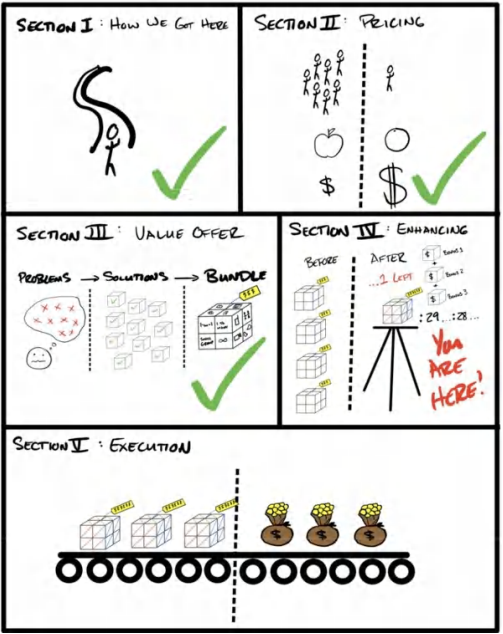
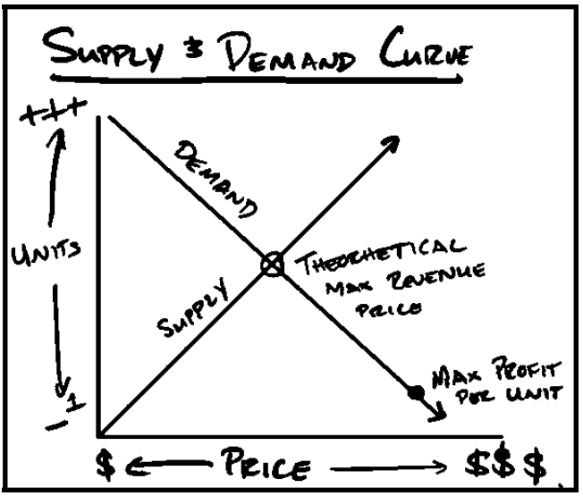
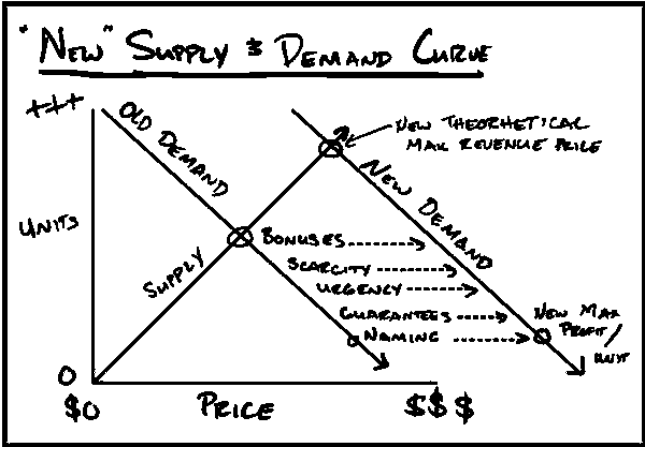
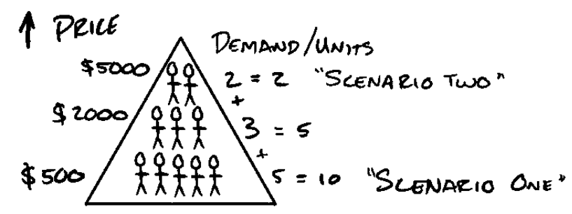
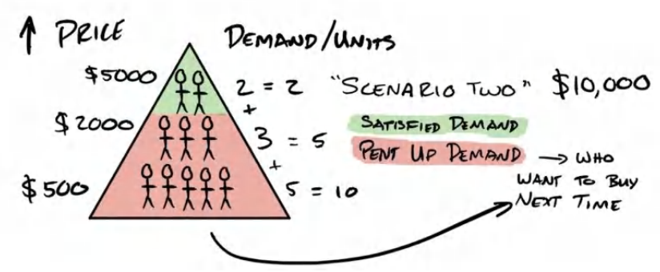
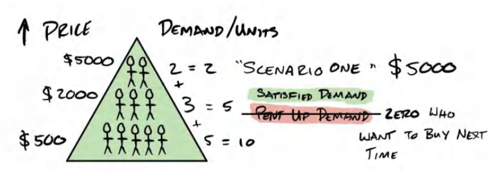
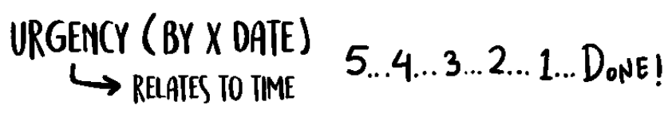
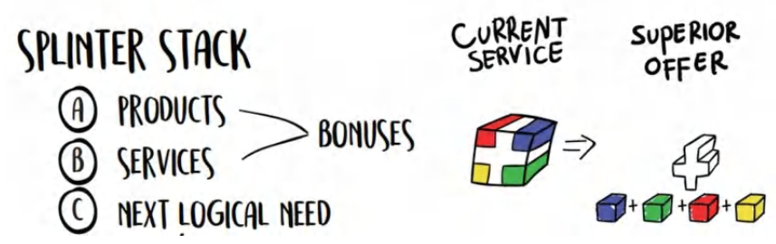

# **Phần IV: NÂNG CẤP LỜI CHÀO HÀNG CỦA BẠN   SỰ KHAN HIẾM, SỰ KHẨN CẤP, QUÀ TẶNG KÈM, CAM KẾT VÀ ĐẶT TÊN**

## 11. NÂNG CẤP LỜI CHÀO HÀNG CỦA BẠN: SỰ KHAN HIẾM, SỰ KHẨN CẤP, QUÀ TẶNG KÈM, CAM KẾT VÀ ĐẶT TÊN**

>*"Nhưng khoan... vẫn còn nữa, nếu bạn đặt hàng ngay hôm nay..."* — MỌI QUẢNG CÁO TRÊN TRUYỀN HÌNH NHỮNG NĂM 90

**Tháng 5 năm 2019. Nhà của Arnold Schwarzenegger.**

Đó là buổi gây quỹ cho tổ chức After School All Stars. Dòng xe ô tô bên ngoài nhà Arnold xếp dài quanh góc phố... và chúng tôi là một trong số đó. Chúng tôi đang ngồi trong chiếc Uber thì một nhân viên an ninh đeo tai nghe, mặc vest đen và đeo kính râm gõ vào cửa kính phía tài xế. Cảnh tượng giống hệt như trong một bộ phim.

Người tài xế hạ kính cửa sổ xuống. "Tên là gì?" "Alex và Leila Hormozi."

Anh ta lướt qua danh sách trên bảng kẹp hồ sơ, gật đầu, rồi đánh dấu vào tên chúng tôi. "Tuyệt," anh ta nói. Thái độ của anh ta từ nghiêm nghị chuyển sang chào đón. "Chào mừng đến với buổi gây quỹ. Hãy tiếp tục đi theo hàng này. Các bạn sẽ rẽ trái, sau đó an ninh sẽ hộ tống các bạn phần đường còn lại."

Nhân viên an ninh nói vào bộ đàm cho chốt tiếp theo ở phía cuối con đường, ra hiệu rằng xe của chúng tôi đã được thông qua.
Tiến vào phía trước dinh thự giống như bước vào một bộ phim về điệp viên Bond. Những chiếc Lamborghini, Bugatti, Ferrari và các thương hiệu xe hơi quá đắt đỏ để có thể nhắc tên. Những quý ông giàu có đi cùng những phụ nữ trẻ trung, quyến rũ. Các diễn viên điện ảnh hạng A. Những người nổi tiếng với hàng triệu người theo dõi đang tự quay phim khi họ vừa đến, nói chuyện qua iPhone với khán giả của họ. Và chúng tôi nữa.

Buổi gây quỹ có giá 25.000 đô la mỗi vé tham dự, có thảm đỏ và đầy đủ mọi thứ. Mỗi năm, buổi gây quỹ kết thúc bằng một cuộc đấu giá lớn các kỷ vật và một số vật phẩm mà chính các chủ doanh nghiệp trong khán giả đem tặng cho quỹ từ thiện.

Chúng tôi đi loanh quanh xem các khu vực giải trí được thiết kế riêng nhằm đưa các nhà hảo tâm vào "tâm thế cho đi". Chúng tôi thấy những chai rượu scotch giá 10.000 đô la... những điếu xì gà 500 đô la... những món đồ chưa từng công bố từ các thương hiệu lớn mà công chúng phải nhiều tháng sau mới có thể sở hữu. Và tất nhiên, là cả những món ăn tinh túy nhất mà bạn có thể tưởng tượng. Leila và tôi chỉ đơn giản là tận hưởng tất cả. Đó là một đêm tuyệt vời. Chúng tôi thực sự cảm thấy mình như những đứa trẻ sành điệu.

Ben, CEO của tổ chức từ thiện, thấy chúng tôi trông có vẻ hơi lạc lõng nên đã bước tới. Anh ấy nắm lấy tay tôi để giới thiệu tôi với một số nhà hảo tâm khác. Đây đều là những người đàn ông lớn tuổi hơn tôi và đang quyên góp 100.000 đô la một cách nhẹ nhàng mà không cần một giây suy nghĩ.

Người đàn ông mà anh ấy giới thiệu cho tôi là một trong những nhà hảo tâm lớn nhất của tổ chức này. Ông ấy đã xây dựng một doanh nghiệp trang sức và đồng hồ siêu cao cấp. Tôi đang nói đến những chiếc đồng hồ giá 100.000, 500.000, 2.000.000 đô la trở lên — những biểu tượng vị thế cực kỳ hiếm hoi mà chỉ 0,001% những người giàu nhất hành tinh mới có thể sở hữu. Ông ấy đã quyên góp hơn 700.000 đô la vật phẩm làm giải thưởng cho buổi gây quỹ tối hôm đó.

"Alex và Leila, làm quen với George nhé," Ben nói. "Ông ấy rất hào phóng với thời gian và tiền bạc của mình cho tổ chức này. George, đây là Alex và Leila Hormozi. Họ đang quyên góp 1.000.000 đô la đêm nay cho ASAS. Tôi thấy các bạn đều là những người tuyệt vời nên muốn kết nối các bạn với nhau."

"Rất vui được gặp hai bạn," George nói với đôi mắt điềm tĩnh, dày dạn sương gió. Ông ấy ngoài 60 tuổi, dáng người thấp nhưng đậm chắc. Bạn có thể nghe thấy nguồn gốc từ khối Đông Âu qua giọng nói của ông ấy. Ông ấy nghe có vẻ như một người đã phải chiến đấu hết mình để có được vị trí hiện tại, nhưng đã tiết chế sự gai góc của mình cho những buổi tụ họp như thế này. Nhưng con hổ với răng nanh và móng vuốt vẫn ẩn hiện bên dưới bề mặt, sẵn sàng xuất hiện bất cứ lúc nào. Tôi cảm thấy như mình hiểu được người đàn ông này.

Ben bắt đầu khơi mào câu chuyện: "Thực ra... George chính là người đã gợi ý tôi tăng giá vé từ 15.000 đô la lên 25.000 đô la. Chúng tôi có nhu cầu lớn hơn bao giờ hết trong năm nay. Nhưng tôi đã nghe theo lời khuyên của ông ấy. Tôi đã cắt giảm số lượng vé bán ra *và* tăng giá vé lên."

"Đúng vậy," George nói, hài lòng rằng lời khuyên kinh doanh sắc sảo của mình đã được thực hiện.

"Khi nhu cầu tăng lên, hãy cắt giảm nguồn cung." Ông ấy tươi tỉnh hơn hẳn khi chúng ta nói về tiền bạc.

Người đàn ông này đã gây dựng doanh nghiệp từ con số không và đã tìm ra cách bán những thứ với lợi nhuận phi thường bằng cách thấu hiểu tâm lý con người. Tôi đã học về cung và cầu từ lâu, nhưng người đàn ông này đang sử dụng những nền tảng tâm lý của nó để thúc đẩy một buổi gây quỹ. Bạn có thể đưa con hổ ra khỏi rừng rậm, nhưng không thể đưa rừng rậm ra khỏi con hổ.

*Mọi người muốn những gì họ không thể có. Mọi người muốn những gì người khác muốn. Mọi người muốn những thứ mà chỉ một số ít người chọn lọc mới có quyền tiếp cận.* Ông ấy đã hoàn toàn đúng. Họ đã quyên góp thêm được một triệu đô la ngay trong đêm đó trước khi sự kiện thực sự bắt đầu bằng cách cắt giảm số lượng vé *và* tăng giá vé. Trên hết, tất cả mọi người tham gia đều có khả năng cao hơn bao giờ hết để trở thành những nhà hảo tâm lớn. Đêm đó cuối cùng trở thành đêm thành công nhất trong lịch sử của tổ chức từ thiện, quyên góp được gần 5.400.000 đô la chỉ từ 100 người (tức là 54.000 đô la mỗi người!). Mỗi vật phẩm đều được đấu giá như một món đồ độc nhất vô nhị. Và nếu bạn bỏ lỡ nó, bạn sẽ không bao giờ có cơ hội mua lại nó lần nữa. Arnold thậm chí còn thêm vào một số phần quà tặng kèm khi có hai người đấu giá đủ cao để cả hai cùng nhận được, giúp tổ chức từ thiện nhận được cả hai khoản quyên góp.

Đó là một màn phô diễn bậc thầy về tâm lý con người trong một bối cảnh mà mọi người sẵn sàng trả giá quá cao cho các sản phẩm. *Bản thân các sản phẩm không thay đổi*, thế nhưng trong bối cảnh này, một món đồ vốn không thể bán nổi ở một nơi khác với giá 10.000 đô la lại được bán với giá 100.000 đô la. Đó chính là sức mạnh của sự khan hiếm, sự khẩn cấp và quà tặng kèm. Và việc phân tích cách sử dụng chúng để tăng thêm nhu cầu cho lời chào hàng của bạn, mà không cần thay đổi lời chào hàng, chính là mục tiêu của phần này.

__________________________________________________________________
**Ghi chú của Tác giả - Các sức mạnh thuyết phục khác đang hoạt động** 
Sự khan hiếm, sự khẩn cấp, quà tặng kèm và cam kết không phải là các công cụ thuyết phục *duy nhất* được sử dụng để đạt được mức giá kỷ lục tại buổi gây quỹ. Họ cũng sử dụng sự cam kết và nhất quán, vị thế, áp lực từ bạn bè, thiện chí, sự chứng thực từ người nổi tiếng, sự cạnh tranh, v.v. Tuy nhiên, sự khan hiếm, sự khẩn cấp và quà tặng kèm là ba yếu tố duy nhất tôi sẽ mổ xẻ trong cuốn sách này vì tôi tin rằng chúng thuộc về "lời chào hàng" nhiều hơn và ít liên quan đến việc "bán hàng" thực tế hơn, điều mà tôi sẽ nói sâu hơn trong cuốn *Acquisition: Volume IV $100M Sales*.
__________________________________________________________________

**Điệu Nhảy Tinh tế của Khao khát**

Về cơ bản, mọi hoạt động marketing đều tồn tại để gây ảnh hưởng đến đường cung và cầu. Chúng ta gia tăng nhu cầu cho các sản phẩm và dịch vụ của mình một cách nhân tạo thông qua một số hình thức giao tiếp thuyết phục. Khi chúng ta tăng nhu cầu, chúng ta có thể bán được nhiều đơn vị sản phẩm hơn.

Khi chúng ta giảm nguồn cung, chúng ta có thể bán những đơn vị đó với giá cao hơn. "Sự kết hợp hoàn hảo cho lợi nhuận" là có rất nhiều nhu cầu và rất ít nguồn cung, hoặc nguồn cung *trong cảm nhận* là rất ít. Quy trình nâng cấp lời chào hàng cốt lõi của bạn được thiết kế để thực hiện cả hai việc này: tăng nhu cầu và giảm nguồn cung *trong cảm nhận* để bạn có thể bán cùng một sản phẩm với *nhiều* tiền hơn so với bình thường, và với khối lượng *cao hơn* so với bình thường (trong một khoảng thời gian dài hơn).

>**Ghi chú từ tác giả** 
>Điều này được giả định đối với một doanh nghiệp cỡ trung bình – doanh nghiệp mà không cố gắng thâm nhập thị trường đại chúng nhằm đạt được một lợi thế chiến lược nào khác.

Khao khát đến từ việc không có được thứ bạn muốn. Thực tế, tôi từng nghe một câu trích dẫn rất hay từ Naval Ravikant: "Khao khát là một bản hợp đồng bạn tự ký với chính mình để chấp nhận bất hạnh cho đến khi đạt được điều mình muốn." Vì vậy, lẽ tự nhiên là chúng ta chỉ khao khát những thứ mình chưa có. Ngay khi sở hữu được chúng, sự khao khát sẽ biến mất. Do đó, nếu muốn tăng nhu cầu (hoặc sự khao khát), chúng ta phải cắt giảm hoặc trì hoãn việc thỏa mãn mong muốn của khách hàng tiềm năng. Chúng ta phải bán ít đi so với khả năng thực tế có thể bán. Hãy dành một chút thời gian để suy ngẫm về điều này.

Hãy xem xét ví dụ sau: Chúng ta quảng bá cho một buổi hội thảo hai ngày sắp tới. Đầu tiên, chúng ta *thì thầm* rằng nó sắp diễn ra. Sau đó, chúng ta hé lộ dần về những lợi ích. Tiếp đến, chúng ta thông báo rầm rộ rằng nó sẽ ra mắt trong một tuần nữa. Cuối cùng, khi ra mắt buổi hội thảo tuyệt vời này, chúng ta có hai kịch bản cung - cầu:
* *Kịch bản một:* Chúng ta bán được 10 suất với giá 500 đô mỗi suất. (Bán cho toàn bộ nhóm khách hàng ở đáy kim tự tháp – mức giá mà ai cũng đồng ý mua).
* *Kịch bản hai:* Chúng ta bán hai buổi hội thảo 1-1 trong một ngày với giá 5.000 đô mỗi suất. (Hớt phần ngọn của kim tự tháp, với 80% số người sẽ không mua hàng).

Đáng lưu ý rằng mỗi khách hàng tiềm năng đều có một ngưỡng mua hàng khác nhau. Theo kinh nghiệm của tôi, nhu cầu đối với các dịch vụ không phát triển theo đường thẳng. Thay vào đó, tôi thấy nhu cầu có tính phân mảnh (quy luật 80/20). Nói cách khác, một phần năm số khách hàng tiềm năng sẵn sàng trả mức giá gấp năm lần (hoặc hơn thế).

Trong ví dụ này, tôi có thể có mười người sẵn sàng trả 500 đô la, nhưng có hai người trong số đó sẵn sàng trả tới 5.000 đô la. Vì vậy, tôi sẽ kiếm được nhiều tiền hơn, có chi phí thấp hơn (lợi nhuận cao hơn), cung cấp nhiều giá trị hơn và làm tăng nhu cầu của nhóm khách hàng tiềm năng còn lại bằng cách bán ít suất hơn. Hãy thử nghĩ xem kịch bản một so với kịch bản hai sẽ mang lại cảm giác độc quyền như thế nào. Hãy nghĩ về tất cả những người muốn mua nhưng không thể mua được. Điều này sẽ làm tăng hay giảm khao khát của họ? Tất nhiên là nó sẽ tăng lên.

Trên hết, nếu mọi người thấy những người khác – những người 'đã có thể tham gia' – đang cực kỳ yêu thích dịch vụ đó, khao khát của họ sẽ càng tăng thêm. Và lần tới, họ sẽ hành động với sự thúc giục cao hơn, và sẵn sàng trả nhiều tiền hơn cho cùng một thứ so với dự định ban đầu. Như vậy, sau kịch bản thứ hai, chúng ta vẫn còn tám người chưa được thỏa mãn khao khát. Điều này càng đẩy khao khát của họ lên cao hơn. Và thêm vào đó, giờ đây chúng ta có thêm những khách hàng tiềm năng mới (những người vốn không nằm trong nhóm ban đầu) hiện cũng đang khao khát những gì chúng ta có.

Lần tới khi chúng ta quảng bá kịch bản hai, chúng ta sẽ mở ra ba suất với cùng mức giá đó và bán hết sạch (nhưng vẫn để lại một số khách hàng tiềm năng với nhu cầu bị dồn nén!). Đây là một chủ đề xuyên suốt.

Ngược lại, nếu chúng ta quảng bá kịch bản một lần nữa (mức giá 500 đô la), chúng ta có thể sẽ bán được ít suất hơn ở vòng thứ hai. Tại sao? Vì chúng ta không còn nhu cầu dồn nén nữa. Mọi khao khát đều đã được thỏa mãn. Khi bạn "bóp cò quá sớm", mỗi lần quảng bá tiếp theo, bạn sẽ càng bán được ít hơn. Cuối cùng, chúng ta cạn kiệt nhu cầu đến mức không thể thực hiện nổi một đơn hàng nào. Đây là tình trạng bi đát mà nhiều doanh nghiệp gặp phải khi *luôn cố gắng tạo ra thêm nhu cầu* chỉ để bán hàng nhanh.

<u>Định luật Hormozi:</u> Bạn trì hoãn việc đưa ra lời đề nghị càng lâu, bạn càng có thể đưa ra lời đề nghị lớn hơn. "Đường băng càng dài, chiếc máy bay cất cánh càng lớn."

Chúng ta phải nỗ lực để giữ cho nguồn cung (và việc thỏa mãn khao khát) luôn thấp hơn mức nhu cầu mà chúng ta có thể tạo ra. Điều này tối đa hóa lợi nhuận và giữ cho khao khát trong lòng khách hàng luôn mãnh liệt. Đây chính là chìa khóa thực sự để không bao giờ bị "đói" đơn hàng.

**Các điểm tóm tắt**

Lý do tôi đặt tiêu đề cho phần này là "Vũ điệu tinh tế của Khao khát" vì cung và cầu có mối tương quan nghịch (về mặt lý thuyết). Nếu bạn không thỏa mãn bất kỳ khao khát nào (không cung cấp gì cả), bạn sẽ không kiếm được tiền, và cuối cùng khiến mọi người cảm thấy bị từ chối (Lưu ý: quá trình này diễn ra lâu hơn bạn nghĩ).

Ngược lại, nếu bạn thỏa mãn toàn bộ nhu cầu, bạn sẽ giết chết "con ngỗng vàng" của chính mình và không biết bữa ăn tiếp theo sẽ đến từ đâu. Việc làm chủ cung và cầu đến từ sự uyển chuyển giữa cả hai. Nếu bạn ở bên người bạn đời mỗi ngày, khao khát của họ sẽ ít hơn so với việc bạn đi vắng một tuần. Chúng ta muốn một khách hàng tiềm năng đang khao khát mãnh liệt, chứ không chỉ dừng lại ở mức hứng thú.

Do đó, hiểu được sự tương tác giữa các biến số này là chìa khóa để nâng cấp lời chào hàng và số lợi nhuận bạn sẽ kiếm được theo thời gian. Đến đây, chúng ta đã bao quát toàn bộ những yếu tố bên trong lời chào hàng giúp nó không bị so sánh về giá và biến những dịch vụ/sản phẩm thông thường thành thứ mà mọi người sẽ tìm mọi cách để chi trả. Tiếp theo, biến số có thể làm lời chào hàng của bạn hấp dẫn hơn chính là cách nó được trình bày. Nói cách khác, đó là những biến số bên ngoài định vị sản phẩm trong tâm trí khách hàng. Những lực đẩy này thường mạnh mẽ hơn cả lời chào hàng cốt lõi của bạn. Trong phần tiếp theo "Nâng tầm lời chào hàng", tôi sẽ chỉ cho bạn cách tôi:
1. Sử dụng Sự khan hiếm (Scarcity) để giảm nguồn cung nhằm tăng giá (và gián tiếp tăng nhu cầu thông qua giá trị độc bản cảm nhận được).
2. Sử dụng Sự khẩn cấp (Urgency) để tăng nhu cầu bằng cách giảm ngưỡng hành động của khách hàng.
3. Sử dụng Quà tặng kèm (Bonuses) để tăng nhu cầu (và tăng giá trị độc bản cảm nhận được).
4. Sử dụng Cam kết (Guarantees) để tăng nhu cầu bằng cách đảo ngược rủi ro.
5. Sử dụng Đặt tên (Names) để kích thích lại nhu cầu và mở rộng nhận thức về lời chào hàng tới khách hàng mục tiêu.

Tôi sẽ định nghĩa từng yếu tố, sau đó đưa ra các ví dụ về cách sử dụng chúng. Chúng ta sẽ vận dụng tất cả các biến số này để nâng tầm lời chào hàng và chuyển dịch đường cong nhu cầu theo hướng có lợi cho mình, khiến khách hàng luôn khao khát nhiều hơn nữa. Chúng ta sẽ bắt đầu bằng việc kích thích tâm lý 'sợ bỏ lỡ' (fear of missing out) hay còn gọi là *FOMO* một cách có chiến thuật thông qua *sự khan hiếm.*

## **12: NÂNG CẤP LỜI CHÀO HÀNG CỦA BẠN: SỰ KHAN HIẾM**

Sự khan hiếm là một trong những thứ quyền lực nhất và ít được hiểu rõ nhất để giải phóng sức mạnh định giá không giới hạn. Nếu bạn muốn tìm hiểu cách bán "không khí" với giá hàng triệu đô la, hãy chú ý.

Lý do một chuyên gia được chứng thực (như bác sĩ), một người nổi tiếng (như Oprah), hoặc một chuyên gia nổi tiếng (như Dr. Oz hoặc Dr. Phil) có thể tính mức phí "cắt cổ" là vì **nhu cầu ngầm định** (implied demand). Mọi người mặc định rằng có rất nhiều nhu cầu đối với thời gian của họ, và do đó, nguồn cung không lớn. Kết quả là, nó phải đắt đỏ.

Tuy nhiên, hầu hết các chủ doanh nghiệp rất khó hiểu được cảm giác thực sự khi có một đường cung-cầu không cân xứng cho đến khi họ thực sự trải nghiệm nó. Tôi sẽ cố gắng dẫn dắt bạn qua những gì tôi đã cảm nhận lần đầu tiên trải nghiệm điều đó để bạn có thể nếm một chút hương vị của sức mạnh này.

Khi tôi mới bước chân vào thế giới M&A (mua bán & sáp nhập), tôi thấy những người cố vấn của mình bán một ngày làm việc của họ với giá hơn 50.000 đô la. Tôi đã cực kỳ kinh ngạc vì hai lý do. Thứ nhất, vì tôi không hiểu làm thế nào họ có thể kiếm được nhiều tiền như vậy chỉ trong một ngày. Thứ hai, vì tôi không hiểu ai trong trạng thái tỉnh táo lại đi mua nó. Theo thời gian, tôi đã hiểu ra.

Hãy bắt đầu với **người mua**. Nếu tôi có một vấn đề nan giải, và tôi *phải* giải quyết vấn đề này để tiếp tục theo đuổi hạnh phúc của mình, nó sẽ tiêu tốn toàn bộ sự chú ý của tôi. Do tính chất chuyên sâu của vấn đề, sẽ có rất ít người có thể giải quyết được nó. Điều này có nghĩa là nguồn cung của những người giải quyết vấn đề là không lớn. Trong nhiều trường hợp, tôi sẽ chỉ thấy duy nhất một "người giải quyết" khả dĩ (Cung = 1).

>**Nghiên cứu điển hình về Giá trị trong Đời thực** 
>&emsp;Có rất nhiều người có thể giải quyết vấn đề: *làm thế nào để tôi kiếm được 10.000 đô la mỗi tháng?* 
>&emsp;Nhưng có rất ít người có thể giải quyết: *Làm thế nào tôi có thể thêm 5 triệu đô la lợi nhuận mà không cần thêm bất kỳ dòng sản phẩm mới nào vào doanh nghiệp của mình?* (Đây là một dự án thực tế mà tôi chỉ mất 60 phút và mang lại chính xác 5 triệu đô la lợi nhuận ròng bằng cách thay đổi nhẹ mô hình định giá của doanh nghiệp đó). Bạn có thể đoán được chủ doanh nghiệp đó đã... "rất hạnh phúc" với kết quả của thương vụ.

Ngoài ra, nếu việc giải quyết vấn đề này giúp tôi đạt được mục tiêu sớm hơn một hoặc hai năm, hoặc ngay lập tức mang lại cho tôi hàng trăm nghìn hoặc hàng triệu đô la, thì giải pháp đó trở nên giá trị hơn nhiều, đúng không? Tất nhiên là có. Và vì vậy, theo lẽ tự nhiên, nếu tôi có thể trả cho ai đó 50.000 đô la cho một ngày làm việc của họ, và thấy doanh thu tăng thêm 500.000 đô la mỗi tháng trong vòng ba tháng nhờ những thông tin chi tiết và chiến lược được tiết lộ, thì đó là một mức tỷ suất hoàn vốn (ROI) cực kỳ tuyệt vời, đúng không?

Vì vậy, có hai thành phần tạo nên giá trị: thứ nhất, sự quý hiếm của nguồn lực; thứ hai, giá trị thực tế được cung cấp. Giá trị và sự quý hiếm kết hợp với nhau để tạo ra những khoản lợi nhuận thực sự đáng kinh ngạc.

Các tư vấn viên chuyên sâu được trả hàng triệu đô la để giải quyết các vấn đề trị giá hàng chục triệu đô la cho khách hàng. Khách hàng trả tiền cho tất cả kinh nghiệm và chuyên môn mà chuyên gia đó có, đồng thời tránh được chi phí của những sai lầm (thời gian và tiền bạc). Nói ngắn gọn, họ bỏ qua những thứ tồi tệ và đi thẳng đến những thứ tốt đẹp nhanh hơn và với ít tiền hơn so với việc họ tự mình tìm tòi... một sự trao đổi kinh tế tuyệt đẹp.

Cá nhân tôi đã trải nghiệm điều này lần đầu tiên khi có hai người *khác nhau* đề nghị trả tôi 50.000 đô la cho một ngày làm việc sau khi tôi phát biểu tại một sự kiện. Họ đang mở rộng quy mô một doanh nghiệp giáo dục trong một thị trường ngách (không quá khác biệt với doanh nghiệp của tôi) và không thể vượt qua mốc doanh thu 1 triệu đô la mỗi tháng. Với tư cách là một người đang kiếm được 1 triệu đô la mỗi *tuần* trong cùng loại hình kinh doanh (vào thời điểm đó), tôi là một người *rất cụ thể* nắm giữ chìa khóa cho vấn đề của họ.

Vậy chuyện gì đã xảy ra, bạn hỏi ư? *Hồi trống vang lên...* Tôi đã không chấp nhận lời đề nghị của họ. Tại sao? Bởi vì tôi đang kiếm được nhiều hơn 50.000 đô la lợi nhuận mỗi ngày từ doanh nghiệp của mình và không muốn bị xao nhãng.

>**Ghi chú của Tác giả:** 
>Nhiều năm sau đó, tôi mới thành lập Acquisition.com để giúp đỡ những người như vậy. Nhưng thay vì tính phí theo ngày, tôi đơn giản là trở thành một người nắm giữ cổ phần trong công ty để hoàn toàn thống nhất lợi ích trong ngắn hạn và dài hạn (và để tôi có thể thấy các đợt thực thi được triển khai trọn vẹn). Và vì thời gian của tôi bị giới hạn bởi các quy luật vật lý, đối với tất cả những ai ở dưới mức 3 triệu - 10 triệu đô la lợi nhuận mỗi năm, tôi cung cấp toàn bộ các tài liệu này miễn phí :)

Sau khi sự kiện kết thúc và tôi đang nói chuyện với Leila, tôi nhận ra rằng bằng cách nào đó tôi đã trở thành *một trong những người mà tôi luôn thắc mắc về họ*. Đó là một trải nghiệm rất kỳ lạ đối với tôi. Cuối cùng tôi đã hiểu cái giá cao thực sự được tạo ra như thế nào... đơn giản là cung và cầu. Chẳng có gì có thể thay thế được một nhu cầu (thị trường) khổng lồ. Bạn có thể cố giả vờ, nhưng có một loại phong thái 'bất cần đời' rất khó để sao chép khi bạn thực sự không cần tiền của họ (hoặc thậm chí là chẳng thèm muốn nó).

*Đó là cách những người này có thể tính phí cao như vậy... bởi vì họ không cần nó.* Người không cần sự trao đổi luôn nắm thế thượng phong. Tôi luôn cố gắng ghi nhớ điều đó. Đó là một trong những nguyên tắc đàm phán và định giá đã phục vụ tôi tốt nhất trong đời.

"Nhưng Alex, làm thế nào bạn có thể chỉ cho tôi cách sử dụng sự khan hiếm để tăng lượng người muốn lời chào hàng của tôi khi hiện nay không có ai muốn nó?" Câu hỏi hay. Hãy cùng bắt tay vào thực hiện những chiến lược thực chiến, lăn lộn thực tế để tạo ra sự khan hiếm một cách đáng tin cậy.

**Tạo ra Sự khan hiếm**

Khi có một nguồn cung hoặc số lượng sản phẩm/dịch vụ cố định có sẵn để mua, nó sẽ tạo ra "sự khan hiếm" hoặc "nỗi sợ bị bỏ lỡ" (fear of missing out - FOMO). Nó làm tăng nhu cầu thực hiện hành động, và mở rộng ra là việc mua lời chào hàng của bạn. Đây là lúc bạn công khai chia sẻ rằng bạn chỉ đang cho đi X lượng sản phẩm hoặc chỉ có thể phục vụ Y lượng khách hàng mới.

Ví dụ, nếu một nhạc sĩ tung ra một chiếc áo hoodie phiên bản giới hạn và nói rằng họ chỉ sản xuất 100 chiếc và sẽ không bao giờ sản xuất lại nữa, bạn có khả năng mua nó cao hơn hay thấp hơn so với một chiếc áo luôn có sẵn? Nhiều khả năng hơn, như một lẽ thông thường. Ý tưởng rằng bạn *không bao giờ có thể có được nó nữa* khiến nó trở nên đáng thèm khát hơn.

Đây là một ví dụ về sự khan hiếm. Đó là nỗi sợ bị bỏ lỡ một thứ gì đó. Nó tác động vào tâm lý sợ mất mát của chúng ta để thúc đẩy hành động. Con người có động lực hành động để tích trữ một nguồn lực khan hiếm mạnh mẽ hơn là hành động để đạt được thứ gì đó có thể giúp họ. *Nỗi sợ mất mát mạnh hơn khao khát đạt được lợi ích.* Chúng ta sẽ sử dụng đòn bẩy tâm lý này để khiến khách hàng mua hàng một cách điên cuồng, tất cả cùng một lúc, cho đến khi bạn "hết hàng".

**Ba loại Khan hiếm**
1. Giới hạn số lượng Ghế/Suất: nói chung hoặc trong một khoảng thời gian nhất định.
2. Giới hạn số lượng Quà tặng kèm (Bonuses).
3. Không bao giờ có lại lần nữa.

Nhưng làm thế nào để bạn sử dụng điều này một cách đúng đắn mà không tỏ ra giả tạo? Tôi sẽ cố gắng đưa cho bạn một số ví dụ thực tế.

**Sản phẩm Vật lý**

Việc tung ra các đợt phát hành giới hạn (limited releases) là một phương pháp đã được kiểm chứng để sử dụng thiên kiến tâm lý này có lợi cho bạn. Bạn có thể có các đợt phát hành giới hạn cho hương vị, màu sắc, thiết kế, kích cỡ, v.v. "Tháng này, chúng tôi sẽ tung ra 100 hộp thanh protein hương vị bánh quy sô-cô-la bạc hà." Điểm quan trọng: để sử dụng phương pháp này một cách hiệu quả, bạn sẽ **luôn luôn bán hết hàng**.

Đây là lý do: việc bán hết hàng một cách nhất quán sẽ tốt hơn là đặt hàng quá nhiều và thất bại trong việc tạo ra sự khan hiếm đó. Phương pháp này sẽ gia tăng hiệu quả nếu nó được thực hiện lặp đi lặp lại theo thời gian (nhưng đừng quá thường xuyên). Mỗi tháng một lần dường như là "điểm vàng" cho hầu hết các công ty mà tôi biết đang thực hiện điều này với tính kỷ luật cao.

Lưu ý quan trọng thứ hai: Khi sử dụng chiến thuật này, bạn cũng phải cho mọi người biết rằng bạn đã bán hết hàng. Đó là một phần của những gì làm cho nó hoạt động tốt. Bằng cách này, ngay cả những người đang còn do dự, khi họ thấy rằng sản phẩm đã bán hết, nó sẽ đưa ra bằng chứng xã hội rằng *những người khác* nghĩ rằng nó xứng đáng. Và giờ đây khi sự lựa chọn đã được đưa ra thay cho họ, họ khao khát nó nhiều hơn bởi vì không còn cách nào để họ có được nó nữa. Vì vậy, lần tới khi bạn đưa ra lời chào hàng, họ sẽ có khả năng cao hơn nhiều là sẽ chốt đơn ngay lập tức.

Sự thật thú vị: Chanel, một thương hiệu đã duy trì mức lợi nhuận biên và mức giá điên rồ trong hơn một thế kỷ, là bậc thầy về sự khan hiếm. Họ chỉ gửi 1-2 chiếc cho mỗi món đồ đến mỗi cửa hàng, vì vậy mỗi cửa hàng có một sự lựa chọn khác nhau và mọi món đồ đều là món cuối cùng hoặc món thứ hai còn lại trong kho. Điều này cho phép họ định giá cao hơn hẳn thị trường và biến các xung động mua hàng thành việc mua sắm thực sự.

**Dịch vụ**

Với các dịch vụ, đặc biệt nếu bạn muốn có khách hàng một cách nhất quán, việc sử dụng sự khan hiếm có thể khó léo hơn một chút. Nhưng tôi sẽ chỉ cho bạn một vài cách đơn giản để áp dụng sự khan hiếm một cách có đạo đức nhằm tăng tỷ lệ chốt đơn của bạn. Tất cả những cách này đều có những yếu tố tương tự với những thay đổi rất nhỏ. Tôi liệt kê những cách này vì một trong số chúng có thể phù hợp với mô hình kinh doanh của bạn hơn những cách khác.

1.  **Giới hạn Tổng lượng Khách hàng (Total Business Cap) - Chỉ chấp nhận... X khách hàng.** Chỉ chấp nhận X khách hàng ở mức dịch vụ này (đang diễn ra). Điều này đặt ra một mức trần cho số lượng khách hàng bạn phục vụ nhưng cũng giữ chân họ ở lại. Bạn tạo ra một danh sách chờ cho các khách hàng tiềm năng mới. Khoảnh khắc cánh cửa mở ra, họ sẽ nhảy ngay vào và sự kháng cự về giá biến mất. Định kỳ, bạn có thể tăng công suất thêm 10-20% sau đó lại đóng giới hạn. Cách này hoạt động tốt cho các cấp độ dịch vụ cao nhất của bạn.
    * Việc này giống như nói rằng: "Agency của tôi sẽ chỉ phục vụ tổng cộng 25 khách hàng. Chấm hết." Theo thời gian, bạn có thể tăng giá và loại bỏ những tài khoản hiệu quả thấp để thay thế bằng những tài khoản mới mang lại lợi nhuận cao hơn, hoặc bạn có thể định kỳ mở thêm các "suất trống" khi khả năng cung ứng của bạn cho phép (luôn luôn để lại một phần nhu cầu không được đáp ứng).
2.  **Giới hạn Tốc độ Tăng trưởng (Growth Rate Cap) - Chỉ chấp nhận X khách hàng mỗi tuần (đang diễn ra).** "Chúng tôi chỉ chấp nhận 5 khách hàng mới mỗi tuần và chúng tôi đã có 3 suất đầu tiên được đặt chỗ. Tôi còn 6 cuộc gọi nữa trong tuần này, nên bạn có thể chốt suất này ngay bây giờ, hoặc để nó cho một trong những người tôi sẽ gọi tiếp theo và bạn có thể chờ cho đến khi chúng tôi mở cửa trở lại." Tôi đã sử dụng phương pháp này ngay từ khi mới bắt đầu kinh doanh. Tôi luôn biết khả năng cung ứng mỗi tuần của mình là bao nhiêu, và chỉ đơn giản là để khách hàng tiềm năng biết còn bao nhiêu suất trống. Điều này dựa trên thực tế là bạn dù sao cũng chỉ có thể xử lý một lượng khách hàng mới nhất định một cách ổn định, vì vậy bạn nên nói cho họ biết điều đó.
3.  **Giới hạn theo Nhóm/Khóa (Cohort Cap) - Chỉ chấp nhận... X khách hàng cho mỗi khóa hoặc nhóm.** Tương tự như trên, ngoại trừ việc được thực hiện theo bất kỳ nhịp độ nào bạn mong muốn. Chỉ chấp nhận X lượng khách hàng cho mỗi lớp hoặc nhóm trong một thời gian nhất định là một cách suy nghĩ khác về vấn đề này. Hãy tưởng tượng bạn chỉ bắt đầu nhận khách hàng hàng tháng hoặc hàng quý. Điều này giúp bạn có được nhịp độ vận hành doanh nghiệp nhất định trong khi vẫn cho phép đội ngũ bán hàng của bạn có được sự khan hiếm thực thụ. Ví dụ: "Chúng tôi nhận 100 khách hàng 4 lần một năm. Chúng tôi mở cửa và sau đó đóng lại." V.v.

>**Mẹo chuyên gia - Cung cấp Quyền tiếp cận Giới hạn cho các Dịch vụ Giá cao** 
>&emsp;Những chiến thuật khan hiếm này hoạt động đặc biệt hiệu quả đối với việc bán thêm (upsell) các dịch vụ giá cao. Nếu bạn muốn tạo ra các buổi workshop, đào tạo, sự kiện, hội thảo, tư vấn một lần, v.v. Bản chất của những việc này là tốn thời gian và cung cấp nhiều quyền tiếp cận hơn. Việc ghép chúng với sự khan hiếm rõ rệt hoặc số lượng ghế/suất cố định sẽ nhanh chóng thúc đẩy nhu cầu. Nhưng hãy luôn ghi nhớ: **hãy có ít suất trống hơn mức bạn nghĩ mình có thể bán được**... để khi bạn muốn làm lại việc đó trong tương lai, mọi người sẽ nhớ rằng bạn đã *bán hết hàng... rất nhanh*. Đây là một chiến lược cộng dồn sức mạnh theo thời gian. Một trong những "vũ khí" lợi hại nhất trong kho vũ khí marketing.

Để tôi đưa cho bạn một ví dụ thực tế về việc dùng sự khan hiếm để nâng tầm giá trị của một mồi thu hút khách hàng miễn phí. Nếu bây giờ tôi nói với bạn rằng tôi có một bản danh sách kiểm tra (checklist) cho phép tải xuống miễn phí, trong đó chứa toàn bộ tài liệu của cuốn sách này dưới dạng gạch đầu dòng súc tích, có lẽ bạn sẽ muốn đặt cuốn sách này xuống và đi tải nó ngay lập tức.

**Nhưng**, nếu tôi nói với bạn rằng tôi đã thiết lập trang web sao cho mỗi tuần chỉ cho phép **hai mươi** người mới tải xuống, bạn sẽ có khả năng cao hơn nhiều trong việc đi xem liệu mình có thể lấy được nó hay không. Và thậm chí còn cao hơn thế nữa nếu khi bạn thử, bạn thấy rằng nó đã hết lượt trong tuần đó. Kết quả là gì? Bạn tham gia vào một danh sách thông báo cho bạn vào lần tới khi có thêm hai mươi danh sách kiểm tra nữa sẵn sàng để tải xuống. Chuyện gì xảy ra tiếp theo? Khi bạn nhận được thông báo đó, bạn sẽ nhấn vào liên kết trên điện thoại và truy cập trang ngay lập tức vì bạn không muốn bị lỡ hẹn một lần nữa.

Bằng cách áp dụng sự khan hiếm, chúng ta biến một thứ vốn dĩ chỉ là một "bản tải xuống miễn phí nhạt nhẽo" thành một thứ đáng khao khát mà không phải ai cũng có quyền truy cập. Như một hệ quả tất yếu, bạn sẽ có khả năng cao hơn nhiều trong việc thực sự sử dụng nó khi bạn cầm được nó trong tay... tất cả là vì chúng ta đã kiểm soát nguồn cung. Tuyệt đúng không?

**Sự khan hiếm Trung thực (Sự khan hiếm Đạo đức nhất)**

Chiến lược khan hiếm dễ dàng nhất chính là **sự trung thực**. Chờ đã, cái gì cơ? Hãy để tôi giải thích.

Tôi chắc chắn ngay bây giờ, bạn có lẽ không thể xử lý nổi 1.000 khách hàng vào ngày mai, đúng không? Vậy bạn có thể xử lý bao nhiêu? 5? 10? 25? Ổn thôi, bạn cũng có thể xác định một con số mà bạn sẵn lòng tiếp nhận trong một khoảng thời gian nhất định, sau đó quảng cáo điều đó. Chỉ đơn giản là cho mọi người biết rằng bạn đã đạt 3/4 công suất trong tuần này sẽ thúc đẩy mọi người vượt qua ranh giới để mua hàng của bạn. Việc để mọi người biết rằng bạn đã đạt 81% công suất trong toàn bộ doanh nghiệp của mình sẽ khiến mọi người có khả năng đăng ký với bạn cao hơn "trước khi họ bỏ lỡ cơ hội". Sự khan hiếm cũng bao hàm trong nó bằng chứng xã hội. Nếu bạn đã đạt 81% công suất thì có nghĩa là một lượng lớn người đã quyết định làm việc với bạn, và bạn càng tiến gần đến giới hạn mà bạn tự đặt ra, các suất trống sẽ biến mất càng nhanh. Nhưng chỉ có bạn mới có quyền quyết định đường kẻ "đầy" đó nằm ở đâu. Thú vị đúng không?

**Các điểm Tóm tắt**

Hãy áp dụng một hoặc nhiều phương pháp khan hiếm trong doanh nghiệp của bạn. Bạn sẽ thúc đẩy quyết định mua hàng nhanh hơn từ các khách hàng tiềm năng của mình và để tâm lý thực hiện phần còn lại.

Bây giờ chúng ta đã đi qua một số chiến thuật khan hiếm yêu thích của tôi mà bạn có thể sử dụng quanh năm, còn điều gì khác bạn có thể làm để tăng nhu cầu *mà không cần* thay đổi bất cứ điều gì về lời chào hàng của mình không? Đó là Tăng sự Khẩn cấp. Chúng ta sẽ tìm hiểu về điều đó ở phần tiếp theo.

>**Mẹo chuyên gia - Sự khan hiếm Cực hạn** 
>Nếu bạn không ghét tiền, hãy bán quyền tiếp cận 1-1 với số lượng *cực kỳ giới hạn*. Bạn có thể làm điều đó thông qua bất kỳ phương tiện nào được mô tả trong "Khối lập phương Cung ứng". Quyền nhắn tin trực tiếp. Quyền truy cập email. Quyền gọi điện thoại. Quyền để lại tin nhắn thoại. Truy cập Zoom. V.v. Có rất nhiều cách bạn có thể thực hiện việc này. Nhưng tôi hứa với bạn điều này — nếu bạn muốn lập tức tạo ra rất nhiều tiền, hãy tạo ra một cấp độ dịch vụ cực kỳ độc quyền dựa trên quyền tiếp cận bạn (vâng, việc này không có quy mô mở rộng được), mà bạn giới hạn ở mức một con số **cực nhỏ**. Hãy định giá nó **cực kỳ** cao. Sau đó, hãy nói với mọi người. Bạn sẽ kiếm được nhiều tiền hơn bạn nghĩ đấy. Những suất này cũng có xu hướng là một trong những suất bán chạy nhất. Và hãy giới hạn việc cung cấp của bạn ở một mức độ mà bạn không cảm thấy ghét nó. Đối với tôi, tôi ghét email và tin nhắn nhưng không ngại các cuộc gọi Zoom. Hãy làm cho nó phù hợp với phong cách làm việc của bạn. Những người ưu tú nhất (nhóm 1% của 1%) sẽ điều chỉnh và hành động.

>**Mẹo chuyên gia - Một khi bạn đã Rời đi, Bạn không bao giờ có thể Quay lại** 
>Bạn có thể tạo ra sự khan hiếm bằng cách giới hạn cấp độ dịch vụ của mình *và* nói rằng nếu họ rời đi thì họ không bao giờ có thể quay lại. Loại khan hiếm này khiến mọi người suy nghĩ cực kỳ kỹ trước khi có ý định rời bỏ. Tôi bắt đầu làm điều này với các phòng gym của mình. Sau đó tôi tham gia một nhóm mastermind áp dụng quy trình này. Rồi tôi bắt đầu sử dụng nó ở các cấp độ cao hơn của tôi như Gym Lords. Cách này hoạt động tốt nhất với các nhóm nhỏ (giống như ví dụ trên). Khi các nhóm trở nên lớn hơn nhiều, chiến thuật này sẽ kém hiệu quả hơn (nói từ kinh nghiệm thực tế).

## **13. NÂNG CẤP LỜI CHÀO HÀNG: SỰ KHẨN CẤP**

> *"Thời hạn. Thúc đẩy. Quyết định."* — TÔI

Sự khan hiếm là một hàm số của *số lượng*. Sự khẩn cấp là một hàm số của *thời gian*.

Đây là lúc bạn chỉ giới hạn **thời điểm** mọi người có thể đăng ký, thay vì giới hạn *số lượng* người. Việc có một thời hạn (deadline) hoặc ngày chốt để một giao dịch mua hoặc một hành động diễn ra sẽ tạo ra sự khẩn cấp. Thông thường, sự khan hiếm và sự khẩn cấp được sử dụng cùng nhau, nhưng tôi sẽ tách riêng chúng ra để giúp bạn dễ hình dung các khái niệm.

Tôi sẽ chỉ cho bạn 4 cách yêu thích của tôi để áp dụng sự cấp bách vào doanh nghiệp một cách nhất quán và có đạo đức:
1. Các nhóm khách hàng cuốn chiếu (Rolling Cohorts): Chia khách hàng theo từng đợt tham gia.
2. Sự cấp bách theo mùa cuốn chiếu (Rolling Seasonal Urgency): Tận dụng các yếu tố thời điểm/mùa vụ lặp lại.
3. Sự cấp bách về Khuyến mãi hoặc Giá cả (Promotional or Pricing Urgency): Giới hạn thời gian ưu đãi hoặc lộ trình tăng giá.
4. Cơ hội bùng nổ (Exploding Opportunity): Những cơ hội chỉ xuất hiện trong thời gian ngắn và sẽ biến mất nếu không nắm bắt.

Những phương pháp này sẽ tạo ra sự thôi thúc khách hàng hành động mà không khiến bạn trở nên giả tạo.

Cách tôi thích nhất chính là cho từng nhóm khách hàng (cohorts) bắt đầu theo một nhịp độ đều đặn (cadence). Điều này mang lại một lợi ích vận hành cực lớn: Nó giúp bạn thiết kế được một trải nghiệm bắt đầu (onboarding) được dàn dựng tỉ mỉ và chuyên nghiệp cho khách hàng mới. Khi bạn bắt đầu mở rộng quy mô (scale), yếu tố này sẽ ngày càng trở nên quan trọng hơn bao giờ hết.

### **1) Sự khẩn cấp Cuốn chiếu dựa trên Nhóm (Cohort-Based Rolling Urgency)**
Ví dụ, nếu bạn bắt đầu nhận khách hàng mới hàng tuần (ngay cả với số lượng không giới hạn), bạn có thể nói:

*"Nếu bạn đăng ký ngay hôm nay, tôi có thể đưa bạn vào nhóm tiếp theo sẽ khởi động vào thứ Hai tới, nếu không bạn sẽ phải đợi đến ngày khởi động tiếp theo của chúng tôi."*

Nếu bạn muốn tăng thêm "nhiệt" một chút, bạn có thể nói:

*"Tôi thực sự vừa có một khách hàng mới đăng ký vài tuần trước nhưng lại xin rút, vì vậy tôi đang có một suất trống cho nhóm tiếp theo sẽ khởi động vào thứ Hai. Nếu bạn khá chắc chắn rằng mình sẽ thực hiện việc này sớm hay muộn, thì tốt nhất là nên tham gia ngay bây giờ để bắt đầu nhận được thành quả sớm hơn thay vì phải trả cùng một số tiền mà lại phải chờ đợi."*

Hai sự điều chỉnh nhỏ ở trên đã đẩy rất nhiều cuộc mua bán đang do dự vượt qua rào cản chỉ bằng cách nhắc nhở khách hàng tiềm năng rằng nếu họ đăng ký, họ sẽ bắt đầu vào thứ Hai, và nếu không, họ sẽ phải đợi một tuần. Những chi tiết nhỏ như vậy sẽ thúc đẩy mọi người thực hiện hành động mà họ biết rằng dù sao họ cũng nên làm.

Rõ ràng là nhịp độ bạn khởi động các nhóm khách hàng mới càng ít thường xuyên, thì đòn bẩy này càng mạnh mẽ. Ví dụ, nếu bạn chỉ bắt đầu nhóm khách hàng mới hai lần một năm, mọi người sẽ cực kỳ muốn đăng ký, đặc biệt là khi ngày khởi động cận kề. Thậm chí chỉ cần bắt đầu nhóm mới cách tuần cũng có thể mang lại cú hích khẩn cấp này.

>**Nếu tôi bị mất doanh số vì từ chối khách hàng thì sao?** 
>Giống như các cam kết bảo hành, luôn có một nỗi sợ rằng bạn sẽ kiếm được ít tiền hơn khi áp dụng chiến lược này. Chúng ta sợ rằng mình sẽ mất đi những đơn hàng mà lẽ ra chúng ta đã có thể chốt được. Mọi nhà marketing dày dạn kinh nghiệm trên hành tinh này sẽ nói với bạn rằng — đó là một nỗi sợ hãi không có căn cứ. Những đợt bán hàng lớn nhất trong một chiến dịch kéo dài một tuần hoặc một đợt ra mắt diễn ra trong 4 giờ cuối cùng của ngày cuối cùng (chiếm 50-60% tổng doanh số). Điều đó có nghĩa là 3% thời gian cuối cùng tạo ra 50-60% doanh số... điều đó hoàn toàn phi lý, nhưng lại mang đậm tính nhân văn của con người. Vì vậy, cũng giống như bảo hành, bạn sẽ kiếm được nhiều tiền hơn từ những người quyết định hành động thay vì những người thực sự bị bỏ lỡ — bởi vì thực tế là những người đó ngay từ đầu đã không định mua (họ thậm chí còn không mua khi bạn thúc giục họ thì tại sao họ lại mua nếu không có sự thúc giục đó?) Thật đáng để ghi nhớ.

>**Phải làm gì nếu bạn vừa bắt đầu một nhóm mới và có ai đó muốn mua...** 
>Bạn có hai lựa chọn: 
>1. Bạn có thể cung cấp cho họ một quá trình tiếp nhận (onboarding) cá nhân hóa nhanh chóng để giúp họ bắt kịp nhóm như một món "quà tặng kèm" vì đã đăng ký ngay hôm nay và vẫn đưa họ vào nhóm đó. Hoặc, sở thích của tôi là... 
>2. Bạn có thể giải thích với họ rằng vì nhóm tiếp theo sẽ khởi động sau một thời gian ngắn nữa, họ sẽ có lợi thế là có nhiều thời gian hơn để xem trước các tài liệu, nói chuyện với nhân viên của họ (đối với sản phẩm B2B) hoặc các thành viên gia đình (đối với sản phẩm B2C). Trên hết, họ có thể có một kế hoạch thanh toán kéo dài hơn mà hầu hết các khách hàng khác không có... đó là một lợi thế mà bạn dành cho họ. Sau cùng, hãy luôn nhớ rằng, bạn mới là người làm chủ cuộc chơi.

### **2) Sự khẩn cấp theo Mùa Cuốn chiếu (Rolling Seasonal Urgency)**

Trong môi trường kỹ thuật số, việc có các đồng hồ đếm ngược ngày đăng ký cuối cùng là rất hữu ích. Nhưng hãy đảm bảo rằng chúng là thật. Nếu không, bạn sẽ mất uy tín và trông giống như *mọi gã làm marketing nghiệp dư khác*. Điều này rất phổ biến với các doanh nghiệp internet sử dụng mô hình "ra mắt" (launch). Cá nhân tôi *thích* việc có các ngày kết thúc chương trình khuyến mãi trên trang bán hàng *và* trong nội dung quảng cáo của mình. Tôi muốn nó hiển thị ở khắp mọi nơi. Điểm tuyệt vời là bạn luôn có thể khởi động một chiến dịch quảng cáo khác và một trang bán hàng mới với các ngày mới và nó sẽ lại hiệu quả như bình thường. Bạn sẽ thấy tỷ lệ chuyển đổi của mình tăng vọt, và việc này có lẽ chỉ mất năm phút chỉnh sửa — hoàn toàn xứng đáng với thời gian bỏ ra.

&emsp;*Ví dụ: Khuyến mãi Năm mới kết thúc vào ngày 31/1!* 
&emsp;*Tháng tới: Khuyến mãi Mùa Valentine kết thúc vào ngày 14/2!* 
&emsp;*Tháng tới: Khuyến mãi Đặc biệt Mùa Xuân kết thúc vào ngày 31/3!* 
&emsp;*Tháng tới: Khuyến mãi Cá tháng Tư kết thúc vào ngày 30/4!*

Chương trình khuyến mãi thực tế có thể giống nhau, nhưng việc đặt tên nó theo mùa khác nhau mang lại cho bạn một sự khác biệt "thực tế", cho bạn một điểm bắt đầu và một điểm kết thúc. Các hạn chót sẽ thúc đẩy quyết định. Chỉ đơn giản là khi có những điều này, bạn có thể chỉ ra cho khách hàng thấy và để bản năng con người thúc đẩy họ vượt qua rào cản để không bị bỏ lỡ.

>**Mẹo chuyên gia - Các doanh nghiệp địa phương:** Đây là chiến lược số một của tôi dành cho các doanh nghiệp địa phương. Họ phải thay đổi nội dung marketing thường xuyên hơn các nhà quảng cáo toàn quốc. Việc khoác lên một "chiếc áo mới" với một ngày cụ thể cho cùng một dịch vụ cốt lõi sẽ mang lại cho bạn sự khẩn cấp và sự mới mẻ, giúp bạn liên tục vượt qua các chiến dịch kiểu "cũ rích" truyền thống.

### **3) Sự khẩn cấp dựa trên Định giá hoặc Quà tặng kèm (Pricing or Bonus-Based Urgency)**
Đây là một cách khác để tạo ra sự khẩn cấp bằng cách sử dụng chính lời chào hàng hoặc cấu trúc khuyến mãi/định giá làm thứ mà họ có thể bỏ lỡ (khá thông minh!). Nó cho phép các doanh nghiệp bán hàng cho khách hàng quanh năm mà vẫn sử dụng được sự khẩn cấp. Ví dụ: *"Đúng vậy, hãy để bạn bắt đầu ngay hôm nay để bạn có thể tận dụng mức giảm giá mà bạn đã được hưởng. Tôi không chắc chúng tôi sẽ chạy chương trình này trong bao lâu nữa vì chúng tôi thay đổi chúng khoảng 4 tuần một lần hoặc hơn, và đây là một trong những chương trình tốt nhất mà chúng tôi từng thực hiện trong một thời gian dài."*

Điều này tạo ra nỗi sợ bị bỏ lỡ chương trình khuyến mãi (hoặc đợt giảm giá/quà tặng kèm), thay vì sợ mất dịch vụ thực tế của bạn. Sẽ là nói dối nếu bạn nói rằng nếu họ sở hữu một doanh nghiệp lợp mái nhà mà bạn sẽ không phục vụ họ nếu họ mua sau ngày đó. Nhưng nếu bạn nói cụ thể về chương trình khuyến mãi, bạn thường có thể tạo ra sự khẩn cấp tương tự trong tâm trí khách hàng tiềm năng mà vẫn giữ vững được sự trung thực của mình — đây là kịch bản đôi bên cùng có lợi (win-win). Bạn có thể hoán đổi định giá khuyến mãi, giảm giá hoặc thêm các quà tặng kèm như lắp đặt miễn phí, quy trình tiếp nhận miễn phí hoặc một buổi workshop bổ sung (trị giá 1.000 đô la) nếu họ mua ngay bây giờ. Đây là tất cả những thứ bạn có thể xoay vòng xung quanh sản phẩm cốt lõi của mình để tạo ra sự khẩn cấp.

>**Mẹo chuyên gia - Dọn sạch danh sách chờ của bạn với mỗi lần thay đổi giá:** Nếu bạn thực sự có kế hoạch tăng giá (hy vọng là có nếu bạn đang đọc cuốn sách này!), thì bạn luôn có thể dọn sạch danh sách khách hàng đang do dự bằng cách cho họ biết: "Giá sắp tăng rồi! Hãy tham gia ngay đi!". Đừng bao giờ tăng giá mà không cho mọi người biết. Nó thể hiện một vị thế đầy sức mạnh *và* sẽ mang lại cho bạn một dòng tiền mặt tuyệt vời từ những người đang phân vân trong danh sách chờ của mình.

### **4) Cơ hội Bùng nổ (Exploding Opportunity)**
Đôi khi, bạn sẽ giới thiệu cho khách hàng tiềm năng một cơ hội kinh doanh chênh lệch giá (arbitrage). Bản thân cơ hội đó có một đồng hồ đếm ngược đang tích tắc, giống như tất cả các cơ hội lớn khác. Mỗi giây mà ai đó trì hoãn, họ đang tự đánh mất đi những nguồn lợi nhuận khổng lồ vượt xa mức bình thường.

Ví dụ:  
Nếu tôi đang giải thích về một cơ hội ăn chênh lệch giá (arbitrage) giữa việc mua hàng trên eBay và bán lại trên Amazon, thì sự thiếu hiệu quả này của thị trường theo thời gian sẽ tự điều chỉnh lại. Nghĩa là: Một người hành động càng sớm thì kết quả sẽ càng tốt cho họ. 
Điều này cũng hoàn toàn đúng khi bạn thuyết phục ai đó về các cơ hội như: Giao dịch tiền điện tử (crypto), mua một mã cổ phiếu, tham gia vào một nền tảng quảng cáo mới trước khi đối thủ kịp kéo nhau vào "chia phần". 
Trong những môi trường tuyển dụng cực kỳ cạnh tranh, người ta thường đưa ra những "lời đề nghị bùng nổ" (exploding offers): Cứ mỗi ngày ứng viên chần chừ không nhận việc, mức lương hoặc tiền thưởng khởi điểm của họ sẽ bị giảm xuống. 
Điều này ép các khách hàng tiềm năng phải đưa ra quyết định nhanh chóng, thay vì cứ ngồi đó "chờ đợi" để xem liệu họ có tìm được một kèo nào thơm hơn hay không.

Tất cả các ví dụ này đều cho thấy những cơ hội suy giảm theo thời gian, vì vậy nếu bạn thấy mình đang sở hữu một cơ hội như vậy, hãy nhớ nhấn mạnh nó!

### **Các điểm Tóm tắt**
Việc thêm một thời hạn và kết hợp một hoặc nhiều hình thức khẩn cấp sẽ khiến nhiều người thực hiện hành động hơn so với việc không có chúng. Tôi đã áp dụng cả bốn phương pháp này với hiệu quả rất cao. Tôi khuyên bạn cũng nên làm như vậy. Tiếp theo sẽ là... Quà tặng kèm (Bonuses)!

>**QUÀ TẶNG MIỄN PHÍ #7: Video hướng dẫn Quà tặng: Cách sử dụng Sự khan hiếm & Sự khẩn cấp một cách có đạo đức** 
>Nếu bạn muốn cùng tôi đi sâu vào một số ví dụ thực tế (có đạo đức) về sự khan hiếm & sự khẩn cấp, hãy truy cập `Acquisition.com/training/offers` và chọn "Scarcity & Urgency" để xem một video hướng dẫn ngắn. Bạn cũng có thể tải về **Danh sách kiểm tra Sự khan hiếm và Khẩn cấp** mà tôi sử dụng khi tạo ra các lời chào hàng. Như mọi khi, nó hoàn toàn miễn phí. Hãy tận hưởng nhé.

## *14. NÂNG CẤP LỜI CHÀO HÀNG: QUÀ TẶNG KÈM (BONUSES)*

>*"Tất cả đều là thêm thắt thôi mà"* — DỰA TRÊN MỘT CÂU NGÔN NGỮ TIẾNG ANH CỔ.

Tôi phải gửi lời cảm ơn đặc biệt đến Jason Fladlien vì đã giúp tôi có cái nhìn mới về giá trị của quà tặng kèm. Chúng mạnh mẽ đến nỗi đáng được dành riêng một chương. Trong chương này, tôi sẽ trình bày: nên tặng gì, cách chọn chúng, cách để làm chúng trở nên giá trị, cách trình bày chúng và cách chúng được định giá.

Điểm mấu chốt mà tôi muốn bạn rút ra là: **một lời chào hàng đơn lẻ sẽ kém giá trị hơn so với chính lời chào hàng đó được chia nhỏ thành các thành phần và xếp chồng lại dưới dạng quà tặng kèm** (xem hình ảnh). Toàn bộ nội dung lời chào hàng mà chúng ta đã xây dựng ở cuối phần trước sẽ được trình bày theo trình tự đó. Ví dụ, thực tế tôi có thể làm rất nhiều việc trong dịch vụ của mình, nhưng cho đến khi tôi liệt kê chúng ra từng cái một, khách hàng sẽ không biết tới chúng. Đây là lý do tại sao mọi quảng cáo trên truyền hình từ trước đến nay luôn tiếp tục với câu: "Nhưng khoan... vẫn còn nữa!"

Họ sẽ không sử dụng những kỹ thuật này trừ khi chúng hiệu quả, vì mỗi giây lên sóng đều tốn tiền và phải được chứng minh bằng tỷ suất hoàn vốn (ROI). Bạn cũng sẽ nhận thấy rằng nếu bạn xem những quảng cáo cũ đó, họ sẽ bán một con dao với giá 38,95 đô la, sau đó tặng kèm thêm 37 con dao khác, dụng cụ mài dao, chảo, và các cam kết bảo hành để khiến khách hàng phải "khuất phục". Họ thiết lập một mức giá, sau đó mở rộng thêm cho đến khi bạn cảm thấy *đây là một món hời đến mức nếu bỏ qua thì thật là ngớ ngẩn.*

Lý do điều này hiệu quả là vì chúng ta đang gia tăng sự chênh lệch giữa giá cả và giá trị của khách hàng tiềm năng bằng cách tăng giá trị mang lại thay vì giảm giá bán. Chúng ta "neo" giá vào lời chào hàng cốt lõi. Sau đó, với mỗi món quà tặng kèm ngày càng giá trị, sự chênh lệch đó ngày càng rộng ra cho đến khi nó trở nên quá lớn và chúng ta "bẻ gãy" sợi dây thun trong tâm trí khách hàng vốn đang giữ ví tiền của họ lại.

Bây giờ chúng ta sẽ trình bày "chồng lớp" của các hạng mục cung ứng mà chúng ta đã tập hợp từ trước theo một cách khiến chúng trở nên không thể cưỡng lại.

>**Mẹo chuyên gia: Thêm Quà tặng kèm thay vì Giảm giá bất cứ khi nào có thể cho Lời chào hàng Cốt lõi** 
>Bất cứ khi nào cố gắng chốt một thương vụ, đừng bao giờ giảm giá lời chào hàng chính. Nó dạy cho khách hàng rằng giá của bạn có thể thương lượng (điều đó thật tệ hại). Thêm quà tặng kèm để tăng giá trị nhằm chốt giao dịch là phương pháp vượt trội hơn nhiều so với việc cắt giảm giá. Nó đặt bạn vào vị thế của sức mạnh và thiện chí thay vì sự yếu đuối.

### **Trình bày Quà tặng kèm 1-kèm-1 so với Bán hàng theo Nhóm**
Có những sự khác biệt then chốt giữa việc thuyết phục một nhóm người so với một cá nhân duy nhất. Bán hàng theo nhóm nằm ngoài phạm vi của cuốn sách này. Nhưng tôi muốn ít nhất đề cập đến thời điểm đưa quà tặng kèm vào trong kịch bản bán hàng 1-kèm-1. Khi bán hàng 1-kèm-1, bạn hãy **hỏi mua hàng trước**, trước khi đưa ra các quà tặng kèm. Nếu họ nói có, thì sau đó, sau khi họ đã ký hợp đồng, bạn hãy cho họ biết về các món quà tặng kèm *bổ sung* mà họ sẽ nhận được. Điều này tạo ra một trải nghiệm "Wow" và củng cố quyết định mua hàng của họ.

Mặt khác, nếu người đó *không* mua sau lần hỏi đầu tiên, thì bạn hãy đưa ra một món quà tặng kèm phù hợp với trở ngại mà họ đang cảm thấy, sau đó hỏi mua hàng lại lần nữa. Đừng cảm thấy kỳ quặc khi hỏi lại. Bạn chỉ đơn giản là đồng ý với khách hàng tiềm năng, thêm quà tặng vào, và hỏi xem sự bù đắp này đã "đủ công bằng" chưa. Mọi người thường rất khó từ chối sự có đi có lại (reciprocity), vì vậy việc thêm một món quà tặng để điều chỉnh, sau đó là một món khác, rồi một món khác nữa, sẽ khiến khách hàng cảm thấy gần như có nghĩa vụ phải mua của bạn.

Nếu bạn xem lại chương "Cắt tỉa và Chồng lớp", mỗi hạng mục cung ứng giờ đây đang được "vũ khí hóa" và trình bày đúng thời điểm. Dù sao thì chúng ta cũng định đưa tất cả các quà tặng kèm này cho họ, nhưng việc làm này giúp khách hàng cảm nhận được giá trị lời chào hàng của chúng ta tăng lên bằng cách xếp chồng từng món quà một tại một thời điểm.

# TODO - 113

### **Các gạch đầu dòng Quà tặng kèm (Bonus Bullets)**
Có một vài điểm mấu chốt cần nhớ khi đưa ra quà tặng kèm:
1. Luôn đưa chúng ra (bạn có thể sử dụng danh sách các hạng mục mà chúng ta đã xây dựng ở cuối Phần III).
2. Đặt cho chúng một cái tên đặc biệt có chứa lợi ích ngay trong tiêu đề.
3. Nói cho họ biết:
    * a. Nó liên quan như thế nào đến vấn đề của họ.
    * b. Nó là cái gì.
    * c. Bạn đã khám phá ra nó như thế nào, hoặc bạn đã phải làm gì để tạo ra nó.
    * d. Nó cụ thể sẽ cải thiện cuộc sống hoặc trải nghiệm của họ như thế nào.
    * i. Nhanh hơn, dễ dàng hơn hoặc ít công sức/hy sinh hơn (phương trình giá trị).
4. Cung cấp một số bằng chứng (có thể là một con số thống kê, một khách hàng cũ, hoặc trải nghiệm cá nhân) để chứng minh rằng thứ này là giá trị.
5. Vẽ ra một hình ảnh sống động trong tâm trí về cuộc sống của họ sẽ như thế nào *khi giả định* rằng họ đã sử dụng nó và đang tận hưởng các lợi ích.
6. Luôn gắn một nhãn giá cho chúng và giải thích tại sao nó xứng đáng với giá đó.
7. Các công cụ & danh sách kiểm tra tốt hơn là các khóa đào tạo bổ sung (vì công sức và thời gian bỏ ra cho các công cụ này thấp hơn, nên giá trị cao hơn). Phương trình giá trị vẫn luôn là quy luật tối cao.
8. Mỗi quà tặng kèm nên giải quyết một lo ngại/trở ngại cụ thể trong tâm trí khách hàng tiềm năng về việc tại sao họ không thể hoặc sẽ không thành công (quà tặng kèm nên chứng minh rằng niềm tin của họ là sai).
9. Đây cũng có thể là những gì họ sẽ nhận ra một cách logic rằng họ sẽ cần tiếp theo. Bạn muốn giải quyết vấn đề tiếp theo của họ *trước khi* họ gặp phải nó.
10. Giá trị của các quà tặng kèm nên làm lu mờ giá trị của lời chào hàng cốt lõi. Về mặt tâm lý, khi bạn tiếp tục thêm các lời chào hàng, nó sẽ tiếp tục mở rộng sự chênh lệch giữa giá trị và giá cả. Nó cũng truyền đạt một cách tiềm thức rằng lời chào hàng cốt lõi *phải* thực sự giá trị bởi vì nếu đây là những món tặng kèm, thì món chính chắc chắn phải giá trị hơn quà tặng đúng không? (Không hẳn, nhưng bạn có thể sử dụng thiên kiến tâm lý này để làm cho lời chào hàng của mình trở nên vô cùng hấp dẫn).
11. Bạn có thể nâng cao hơn nữa giá trị của các quà tặng kèm bằng cách thêm chính sự khan hiếm và khẩn cấp vào các món quà đó (điều này giống như đưa kỹ thuật này lên tầm cao mới).

**a) Quà tặng kèm với Sự khan hiếm**
*Phiên bản 1:* Chỉ những người đăng ký chương trình XYZ mới có quyền truy cập vào Quà tặng #1, 2, 3 của tôi, vốn không bao giờ được bán lẻ hay có sẵn ở bất kỳ nơi nào khác ngoài chương trình này.
*Phiên bản 2:* Tôi còn 3 vé cuối cùng cho sự kiện ảo trị giá 5.000 đô la của mình, nếu bạn mua chương trình này, bạn có thể nhận được một trong 3 vé cuối cùng đó dưới dạng quà tặng kèm.

**b) Quà tặng kèm với Sự khẩn cấp**
*Phiên bản 1:* Nếu bạn mua ngay hôm nay, tôi sẽ tặng thêm quà tặng XYZ thường có giá 1.000 đô la, hoàn toàn miễn phí. Và tôi làm điều đó vì tôi muốn thưởng cho những người hành động nhanh.

c) Với hy vọng rằng bạn có thể thấy được những sự khác biệt tinh tế. Hai ví dụ đầu tiên không bị giới hạn bởi thời gian. Chúng tuyên bố rằng nếu bạn mua chương trình này, bạn sẽ nhận được những thứ mà bạn thường không thể có được. Quà tặng kèm với sự khẩn cấp là về việc mua *ngay hôm nay*, và nếu họ không mua hôm nay, họ sẽ mất những quà tặng đó. Khác biệt nhỏ, nhưng đáng để lưu tâm.

**Quà tặng kèm ở Cấp độ Nâng cao - Sản phẩm và Dịch vụ của Người khác**
Bạn có thể liên kết với các doanh nghiệp khác để họ cung cấp cho bạn dịch vụ và sản phẩm của họ dưới dạng một phần trong quà tặng kèm của bạn, đổi lại bạn sẽ giúp họ tiếp cận với các khách hàng của mình miễn phí. Đây là marketing miễn phí cho họ, và là những sản phẩm giá trị cao cho bạn với chi phí bằng không. Các doanh nghiệp sẽ làm điều này vì bạn đang cho họ quyền tiếp cận miễn phí với những khách hàng tiềm năng chất lượng cao nhất — chính là khách hàng của bạn. Miễn là họ không phải là đối thủ cạnh tranh trực tiếp, bạn có thể nhận được một số "điểm cộng", đảm bảo các quyền lợi giới thiệu trong tương lai, và làm cho lời chào hàng của mình giá trị hơn vào cùng một thời điểm. Nếu bạn đảm bảo đủ các mối quan hệ này, bạn có thể thực sự chứng minh toàn bộ mức giá của mình chỉ bằng số tiền tiết kiệm được và các quà tặng thêm có giá trị tương ứng thực tế.

*Ví dụ:* Nếu tôi sở hữu một phòng khám giảm đau, tôi có thể mời một chuyên viên massage tặng cho tôi 1-2 buổi massage miễn phí để đưa vào lời chào hàng của mình. Thêm vào đó, tôi có thể nhận được:
- ...một bác sĩ chỉnh nắn cột sống tặng cho khách hàng hai buổi căn chỉnh miễn phí. (Trị giá: 100 đô la)
- ...một công ty thực phẩm thực dưỡng tặng mã giảm giá cho các sản phẩm của họ (Tiết kiệm được 50 đô la)
- ...giảm giá cho các dịch vụ niềng răng và chỉnh hình răng (Tiết kiệm được 150 đô la)
- ...một câu lạc bộ sức khỏe địa phương ngay dưới phố tặng một buổi tập cá nhân miễn phí và một tháng thành viên miễn phí tại hồ bơi của họ (Trị giá 100 đô la)
- ...giảm giá dược phẩm từ hiệu thuốc địa phương (Tiết kiệm được 100 đô la/tháng)
- ...lặp lại những điều trên cho nhiều nhà cung cấp dịch vụ khác (ví dụ tôi có mười bác sĩ chỉnh nắn cột sống, mỗi người tặng một buổi điều chỉnh miễn phí, giờ đây tôi có mười buổi điều chỉnh miễn phí trong gói quà tặng của mình).
- ...v.v.

Bây giờ nếu lời chào hàng của tôi là 400 đô la, thì chỉ riêng giá trị của những quà tặng kèm miễn phí này đã cao hơn mức giá 400 đô la đó rồi.
Nếu điều đó vẫn chưa đủ tuyệt vời, nếu bạn thực sự muốn trở thành một bậc thầy, hãy thương lượng một mức giảm giá cho nhóm *và* một khoản hoa hồng cho chính bạn. Đây chính xác là những gì chúng tôi đã làm với công ty thực phẩm bổ sung của mình. Những khách hàng là chủ phòng gym sử dụng công ty thực phẩm bổ sung Prestige Labs của chúng tôi sẽ được giảm giá 30% cho các sản phẩm, đồng thời chủ phòng gym đó còn được nhận 40% doanh số được chuyển khoản sau khi đã áp dụng giảm giá.

Vì vậy, đây là kịch bản đôi bên cùng có lợi cho tất cả mọi người. Khách hàng của họ mua được hàng với giá rẻ hơn 30% so với trang web chính. Chủ phòng gym được trả tiền vì đã trao đi các mức giảm giá độc quyền. Và chúng tôi có thêm khách hàng để đổi lấy khoản hoa hồng đã chi trả. Mọi người đều thắng.
Nếu bạn đang làm theo, mỗi món quà tặng kèm này có thể trở thành dòng doanh thu gián tiếp cho bạn bằng cách khiến khách hàng nói "CÓ" dễ dàng hơn, và trực tiếp vì bạn có thể thương lượng để mỗi doanh nghiệp này trả tiền cho bạn vì những người bạn đã gửi đến cho họ.

Giả sử chúng ta cũng đã thương lượng được các "hoa hồng chuyển đổi" (affiliate commissions) sau đây khi giới thiệu khách hàng đến các doanh nghiệp này:
- ...bác sĩ chỉnh cột sống trả cho bạn 100 đô la cho mỗi người đến phòng khám của họ.
- ...công ty thực phẩm tặng bạn đồ ăn miễn phí (Ngon!).
- ...công ty chỉnh hình răng trả cho bạn 100 đô la cho mỗi người được giới thiệu.
- ...câu lạc bộ sức khỏe tặng bạn tư cách thành viên miễn phí HOẶC 50 đô la cho mỗi người đăng ký.
- ...hiệu thuốc trả cho bạn 100 đô la cho mỗi người.

Bây giờ hãy nhìn vào số tiền mà chúng ta đã kiếm được... lời chào hàng 400 đô la của chúng ta hiện có khả năng mang về thêm 350 đô la... **lợi nhuận thuần túy!** Đó chính là vẻ đẹp của những mối quan hệ này. Các doanh nghiệp khác sẽ trả tiền cho bạn và bạn không phải làm *bất cứ điều gì* ngoài việc giới thiệu

---

### Trang 115

khách hàng cho họ — chính là những khách hàng mà bạn đã tốn tiền để có được.
Và nếu bạn thực sự muốn trở nên "điên rồ" hơn, hãy tạo ra một lời chào hàng Grand Slam với những doanh nghiệp đối tác này bằng cách sử dụng chính các khái niệm trong cuốn sách để làm cho quà tặng kèm trờ nên giá trị hơn nhiều so với một dịch vụ phổ thông bình thường.

---
**QUÀ TẶNG MIỄN PHÍ #8: QUÀ TẶNG KÈM... TRÊN CÁC QUÀ TẶNG KÈM**
Có hàng triệu cách để sử dụng quà tặng kèm trong lời chào hàng của bạn. Bạn có thể khiến mọi người hành động nhanh hơn. Bạn có thể neo giá và neo sản phẩm (những điều ít được biết tới). Bạn có thể thu hút được nhiều người nói có hơn nếu không thì họ đã nói không. Nếu bạn muốn cùng tôi đi sâu vào chủ đề này, hãy truy cập `Acquisition.com/training/offers` và chọn "Bonus Creation" để xem một video hướng dẫn ngắn. Tôi cũng có một **Bản danh sách kiểm tra Quà tặng kèm Miễn phí** mà tôi thường dùng khi tạo lời chào hàng. Hãy áp dụng nó cho doanh nghiệp của bạn nhé!
---

**Tóm tắt**
Chúng ta muốn áp dụng quà tặng kèm bởi vì chúng mở rộng sự chênh lệch giữa giá cả và giá trị, đồng thời thúc đẩy những người vốn dĩ sẽ không mua hàng phải thực hiện việc mua hàng. Chúng làm gia tăng đáng kể nhận thức của khách hàng tiềm năng về giá trị lời chào hàng của chúng ta. Vì vậy, đây là những gì cần làm:

1. Tạo ra các danh sách kiểm tra (checklists), công cụ, kịch bản mẫu (scripts), biểu mẫu (templates) và bất cứ thứ gì khác có thể tốn nhiều thời gian và công sức để khách hàng tự tạo ra, nhưng lại dễ dàng sử dụng sau khi đã được tạo xong. Bất cứ thứ gì bạn có thể đầu tư một lần mà rõ ràng là tiết kiệm thời gian hoặc tiền lãi cho khách hàng, nhưng có thể cho đi mãi mãi, đều là ứng cử viên hoàn hảo cho một món quà tặng kèm.
2. Ngoài ra, hãy tập thói quen ghi lại mọi buổi workshop, mọi buổi webinar, mọi sự kiện, mọi cuộc phỏng vấn và sử dụng chúng thành các quà tặng kèm bổ sung (khi cần thiết để dập tắt một trở ngại cảm nhận được).
3. Chủ động thương lượng mức giảm giá nhóm và hoa hồng giới thiệu với các doanh nghiệp phụ trợ mà khách hàng của bạn sẽ cần tới nhờ việc bắt đầu quy trình này với bạn. Điều tiếp theo mà họ khao khát một cách tự nhiên là gì? Hãy kết nối với các doanh nghiệp đó, giành lấy một thỏa thuận cho khách hàng mà họ không bao giờ có thể tự mình đạt được (vì bạn đang thương lượng với sức mạnh mua hàng của tất cả khách hàng cùng một lúc, điều này rất quyền lực).

---
**Ghi chú của Tác giả:** Càng kinh doanh lâu, bạn càng có nhiều tài sản giá trị này để sử dụng. Tất cả chúng đều giá trị. Hãy cất chúng vào một "kho báu" và sẵn sàng lấy ra để đưa vào một lời chào hàng nhằm chốt giao dịch. Các sản phẩm thông tin hoạt động rất tốt ở đây vì chúng có giá trị cảm nhận cao, chi phí thấp và không tốn công sức vận hành ngoài việc cung cấp thêm một tài khoản đăng nhập. Vé đi xem các sự kiện trải nghiệm hoặc sự kiện ảo cũng rất hiệu quả. Điều tương tự cũng xảy ra đối với các cấp độ dịch vụ cao hơn có chi phí cố định thấp như việc tặng cho ai đó một tháng dịch vụ VIP (vốn cũng đóng vai trò là một cách để bán thêm họ vào cấp độ dịch vụ đó để giữ chân họ ở lại... chúng ta sẽ nói thêm về điều đó trong Cuốn II).
---

**Điều gì nên là quà tặng kèm so với điều gì là một phần của lời chào hàng cốt lõi nếu tôi là người trực tiếp vận hành?**
Câu trả lời ngắn gọn: Yếu tố "Wow" - nói cách khác là thứ mà bạn không muốn khách hàng bỏ lỡ. Nhiều khi bạn có quá nhiều "thứ tốt" đến nỗi bạn sẽ cung cấp cho khách hàng (thứ giá trị) nhưng những mẩu giá trị nhỏ đó có thể bị lẫn lộn trong tổng thể. Bạn muốn chọn ra những thứ thực sự nổi bật nhất mà có thể đứng độc lập và tách chúng ra để làm nổi bật chúng. Điều này đặc biệt đúng đối với những thứ có dung lượng ngắn nhưng chất lượng cao hoặc giá trị lớn. Các danh sách kiểm tra hoặc infographic có thể cô đọng rất nhiều thông tin vào một không gian nhỏ. Ai đó có thể không cảm thấy thỏa đáng khi trả nhiều tiền cho một bản đồ ra mắt sản phẩm (ví dụ), nhưng dưới dạng một món quà tặng kèm, nó sẽ được cảm nhận là rất giá trị.

**Tiếp theo...**
Chúng ta đã có lời chào hàng cốt lõi. Chúng ta đang trình bày nó theo cách để tăng sự khan hiếm và khẩn cấp nhằm tăng khả năng họ khao khát nó hơn nữa. Chúng ta đã chồng các quà tặng kèm vào lời chào hàng để làm cho sự chênh lệch giữa giá và giá trị trở nên không tưởng và "bẻ gãy" tâm trí khách hàng. Bước tiếp theo trên hành trình kỳ diệu này sẽ là đối mặt với một "con voi khổng lồ" trong phòng... **rủi ro** (risk). Chúng ta sẽ hoàn toàn xóa bỏ nó bằng cách sử dụng kết hợp các phương thức cam kết bảo hành để họ không còn lý do gì để không mua hàng.

### Trang 117

# NÂNG CẤP LỜI CHÀO HÀNG: CÁC CAM KẾT (GUARANTEES)

*"Những lời cam kết đáng giá bằng vàng"*

---

Trở ngại lớn nhất đối với bất kỳ sản phẩm hoặc dịch vụ nào đang được bán chính là... *hồi trống vang lên*... **rủi ro**. Rủi ro rằng nó không mang lại đúng những gì nó được cho là sẽ mang lại. Do đó, đảo ngược rủi ro là một cách ngay lập tức để làm cho bất kỳ lời chào hàng nào trở nên hấp dẫn hơn. Bạn sẽ muốn dành một lượng thời gian đáng kể để tìm ra cách bạn muốn đảo ngược rủi ro đó. Như đã nói, một lời cam kết có thể làm cho lời chào hàng hấp dẫn hơn bao nhiêu?

Jason Fladlien, người mà tôi đã đề cập trước đó, từng tuyên bố rằng ông đã thấy tỷ lệ chuyển đổi của một lời chào hàng tăng gấp 2-4 lần chỉ bằng cách thay đổi chất lượng của lời cam kết. Nó quan trọng đến mức đó đấy.

Xét từ góc độ tổng quát, có bốn loại cam kết:
1. Không điều kiện (Unconditional)
2. Có điều kiện (Conditional)
3. Nghịch-cam kết (Anti-Guarantee)
4. Cam kết ngầm định (Implied Guarantees)

Bạn phải *luôn luôn* nhấn mạnh lời cam kết của mình, ngay cả khi bạn không có một lời cam kết chính thức nào. Hãy tuyên bố nó một cách táo bạo và đưa ra lý do tại sao.
**Nhưng liệu mọi người có lợi dụng một lời cam kết "điên rồ" không?**
Đôi khi, nhưng thường là không. Như đã nói, bạn phải hiểu các con số toán học. Nếu bạn chốt được thêm 30% khách hàng, và tỷ lệ hoàn tiền của bạn *tăng gấp đôi* từ 5% lên 10%, bạn vẫn kiếm được nhiều tiền hơn 1,23 lần, tương đương với mức tăng 23% lợi nhuận ròng.

*Ví dụ:*
Hiện tại: 100 đơn hàng, 5 hoàn tiền (5%) = 95 đơn hàng thực tế
Có cam kết: 130 đơn hàng, 13 hoàn tiền (10%) = 117 đơn hàng thực tế
117 / 95 = 1,23 lần (tăng 23%)

Đừng để cảm xúc chi phối, hãy tính toán các con số. Để một lời cam kết *không* mang lại giá trị, thì mức tăng doanh số phải bị bù trừ hoàn toàn bởi những người yêu cầu hoàn tiền. Như vậy, mức tăng doanh số tuyệt đối 5% sẽ cần bị bù trừ bởi một mức tăng hoàn tiền tuyệt đối là 5% (điều này rất khó xảy ra). Vì vậy, phần lớn, lời cam kết càng mạnh mẽ, thì mức tăng thực tế trong tổng doanh số càng cao, ngay cả khi tỷ lệ hoàn tiền tăng lên tương ứng.

**Cảnh báo:** Mặc dù cam kết có thể là "người bán hàng" hiệu quả, nhưng những người mua *chỉ vì* có cam kết đôi khi lại là những khách hàng rất tệ. Một người chỉ mua hàng vì có cam kết hoàn tiền có thể là người không sẵn lòng nỗ lực cần thiết để đạt tới thành công với sản phẩm hoặc dịch vụ của bạn. Trong một thế giới nơi bạn muốn đảo ngược rủi ro *và* giúp khách hàng đạt được kết quả tốt nhất có thể, hãy gắn lời cam kết của bạn với những việc họ cần làm để thành công, điều này sẽ mang lại lợi ích cho cả hai bên.

---
**Mẹo chuyên gia: Cảnh báo cho các Dịch vụ Chi phí Cao**
Nếu bạn có một lượng lớn chi phí gắn liền với sản phẩm hoặc dịch vụ của mình, bạn có thể sẽ muốn áp dụng một lời cam kết có điều kiện hoặc một NGHỊCH-CAM KẾT, vì bạn sẽ phải chịu cả chi phí hoàn tiền VÀ chi phí vận hành dịch vụ đó.
---

**Các loại Cam kết**

# "NẾU BẠN KHÔNG ĐẠT ĐƯỢC X TRONG THỜI GIAN Y, CHÚNG TÔI SẼ..."

Điều làm cho một lời cam kết có sức mạnh là một câu khẳng định có điều kiện: Nếu bạn không đạt được kết quả X trong khoảng thời gian Y, chúng tôi sẽ thực hiện Z.
Để lời cam kết có "răng" (sức nặng), bạn phải quyết định mình sẽ làm gì nếu họ *không* đạt được kết quả.
Nếu không có phần "hoặc là cái gì" của lời cam kết, nó sẽ nghe rất yếu ớt và mờ nhạt.

---

### Trang 118

**Lưu ý:** Đây là lỗi mà hầu hết các nhà marketing mắc phải.
*Ví dụ tồi:* Chúng tôi sẽ cam kết cho bạn có được 20 khách hàng.
*Ví dụ tốt hơn:* Bạn sẽ nhận được 20 khách hàng trong 30 ngày đầu tiên, nếu không chúng tôi sẽ hoàn tiền cho bạn + trả lại toàn bộ số tiền quảng cáo bạn đã chi cùng chúng tôi.
Đây là một lời cam kết đơn giản nhưng mạnh mẽ.

Dưới đây là bốn loại cam kết. Tôi sẽ đi qua lý thuyết trước, sau đó chúng ta sẽ áp dụng chúng.

**1) Cam kết Không điều kiện (Unconditional Guarantees)**
Như đã nói ở trên, đây là loại cam kết mạnh mẽ nhất. Về cơ bản chúng giống như một đợt dùng thử nơi khách hàng trả tiền trước sau đó xem họ có thích hay không. Loại này thu hút rất nhiều người mua, nhưng bạn *sẽ* gặp phải một số người yêu cầu hoàn tiền, đặc biệt là khi văn hóa tiêu dùng đang có xu hướng đòi hỏi quyền lợi và thiếu trách nhiệm cá nhân.

**2) Cam kết Có điều kiện (Conditional Guarantees)**
Cam kết có điều kiện bao gồm các "điều khoản và điều kiện" đi kèm. Đây là lúc bạn có thể cực kỳ sáng tạo. Nhìn chung, bạn muốn đây là những lời cam kết "tốt hơn cả hoàn tiền". Bởi vì đó là một cam kết có điều kiện, đối với một khách hàng sắp đầu tư, bạn muốn họ có sự cam kết tương xứng về mặt tâm lý. Những điều này cũng có tác dụng rất mạnh mẽ trong việc thúc đẩy khách hàng đạt kết quả. Nếu bạn biết những hành động then chốt mà ai đó phải thực hiện để thành công, hãy biến chúng thành một phần của cam kết có điều kiện. Trong một thế giới hoàn hảo, 100% khách hàng của bạn sẽ đủ điều kiện nhận cam kết, nhưng họ sẽ đạt được kết quả cá nhân và do đó không muốn nhận lại tiền. Đó là lý tưởng mà tất cả chúng ta đều hướng tới. Và bạn hãy lưu ý — nếu được lựa chọn giữa việc nhận lại tiền hoặc nhận được kết quả như đã hứa, đại đa số mọi người sẽ chọn kết quả.

**3) Nghịch-cam kết (Anti-Guarantees)**
Nghịch-cam kết là khi bạn tuyên bố rõ ràng rằng "mọi giao dịch mua bán là cuối cùng và không hoàn lại". Bạn sẽ muốn khẳng định vị thế này một cách mạnh mẽ. Bạn phải đưa ra một lý do sáng tạo tại sao việc bán hàng lại không được hoàn lại. Thông thường, bạn muốn thể hiện một sự rủi ro lớn đối với chính bạn mà khách hàng có thể hiểu ngay lập tức và nghĩ là "Vâng, điều đó có lý." Các loại cam kết này đặc biệt quan trọng với những mặt hàng tiêu hao hoặc giảm mạnh giá trị sau khi đã được trao đi.

**4) Cam kết Ngầm định (Implied Guarantees)**
Cam kết ngầm định là bất kỳ lời chào hàng nào dựa trên hiệu suất (performance-based). Có rất nhiều hình thức: Chia sẻ doanh thu (Revshare), chia sẻ lợi nhuận, các mốc nâng bậc (ratchets), quà tặng bằng tiền khi đạt mục tiêu, v.v. Tất cả đều là ví dụ. Khái niệm cốt lõi là: nếu tôi không làm được, tôi không được trả tiền. Điểm độc đáo của cấu trúc này là nó cũng mang lại lợi ích cho bạn: "Nếu tôi làm xuất sắc, tôi sẽ được đền đáp xứng đáng." Những điều này chỉ hiệu quả trong những tình huống mà bạn có sự minh bạch trong việc đo lường kết quả và sự tin tưởng (hoặc quyền kiểm soát) rằng bạn sẽ được trả tiền khi bạn thực hiện tốt.

**Chồng lớp các Cam kết (Stacking Guarantees)**
Một người bán hàng kinh nghiệm hiểu rằng, giống như quà tặng kèm, bạn thực sự có thể **chồng lớp** các cam kết. Ví dụ, bạn có thể đưa ra một cam kết không điều kiện trong 30 ngày "không cần lý do", sau đó chồng lên trên một cam kết có điều kiện hoàn tiền gấp ba sau 90 ngày. Đó sẽ là một ví dụ về việc chồng lớp một cam kết không điều kiện với một cam kết có điều kiện.

---

### Trang 119

Bạn cũng có thể chồng lớp hai cam kết có điều kiện xung quanh các kết quả khác nhau (hoặc tuần tự). Ví dụ, bạn cam kết kiếm được 10.000 đô la sau 60 ngày, 30.000 đô la sau 90 ngày miễn là khách hàng thực hiện các bước 1, 2 và 3. Điều này dẫn dắt khách hàng tiềm năng tới một kết quả mà giờ đây họ tin là khả thi hơn nhiều (vì bạn đang trình bày rõ ràng điều đó trong một cam kết có điều kiện với lộ trình thực hiện). Việc làm này cho thấy bạn cực kỳ nghiêm túc trong việc giúp họ đạt kết quả và thuyết phục họ rằng họ sẽ đạt được những gì họ muốn. Điều này giúp chuyển gánh nặng rủi ro từ họ sang chúng ta... một chiến lược vô cùng mạnh mẽ.

Hãy cùng đi qua một số ví dụ về các loại cam kết khác nhau:

**Cam kết: Nếu bạn không đạt được X, trong thời gian Y, chúng tôi sẽ [chèn lời chào hàng]...**

**[Không điều kiện] Cam kết Hoàn tiền "Không cần lý do"**
*Khách hàng nhận được gì:* A) Hoàn tiền toàn bộ, B) Hoàn tiền 50%, C) Hoàn tiền chi phí quảng cáo và bất kỳ chi phí phát sinh nào, D) Bạn trả tiền cho chương trình của đối thủ cạnh tranh để họ tham gia, E) Bạn trả lại tiền cho họ cộng thêm 1.000 đô la (hoặc một số tiền lớn hơn nhiều so với số tiền họ đã trả).

*Nhận định của tôi:* Đây là loại cam kết đơn giản nhất. Nó cũng cực kỳ rủi ro. Bạn đặt mình vào thế bị động nếu ai đó không đạt được kết quả, dù lỗi là của bạn hay không, bạn vẫn phải chịu trách nhiệm. Rõ ràng đây là một cam kết mạnh mẽ, nhưng thiếu sự độc đáo. Bạn có thể thêm các điều kiện, nhưng càng nhiều điều kiện, cam kết càng mất đi sức mạnh.
*Cách diễn đạt:* Tôi nghe Jason Fladlien trình bày lời cam kết không điều kiện của anh ấy trong một buổi webinar và tôi thấy nó thật không thể tin nổi. Đây là 100% lời lẽ của anh ấy chứ không phải của tôi. Tôi trích dẫn ở đây để giúp nội dung hoàn thiện hơn:

*"Tôi không yêu cầu bạn phải quyết định ngay hôm nay... Tôi chỉ yêu cầu bạn đưa ra một quyết định có đầy đủ thông tin, vậy thôi. Cách duy nhất bạn có thể đưa ra quyết định đầy đủ thông tin là từ bên trong, không phải từ bên ngoài. Vì vậy, bạn hãy tham gia và xem liệu tất cả những gì chúng tôi nói trong buổi webinar này có đúng và giá trị với bạn không. Sau đó, nếu đúng, đó là lúc bạn quyết định giữ nó lại. Nếu nó không dành cho bạn, không sao cả. Bạn có thể, sau khi đăng ký tại [URL], đưa ra quyết định hoàn toàn có đầy đủ thông tin rằng cái này không dành cho bạn. Nhưng bạn không thể đưa ra quyết định đó ngay bây giờ vì cùng một lý do bạn không mua một ngôi nhà mà không xem xét bên trong trước. Và hãy biết điều này... dù là sau 29 phút hay 29 ngày kể từ bây giờ... nếu bạn không thấy hạnh phúc, tôi cũng không thấy hạnh phúc. Vì bất kỳ lý do gì, nếu bạn muốn nhận lại tiền, bạn có thể lấy lại vì tôi chỉ muốn giữ tiền của bạn nếu bạn thấy hài lòng. Tất cả những gì bạn phải làm là truy cập support@xyz.com và nói 'trả lại tiền cho tôi' và bạn sẽ nhận được — thời gian phản hồi trung bình của chúng tôi là 61 phút trong khung giờ 24/7. Bạn chỉ có thể đưa ra một lời cam kết như vậy khi bạn tự tin rằng những gì mình có là hàng thật và tôi khá tự tin rằng khi bạn đăng ký tại [URL], bạn sẽ nhận được chính xác những gì bạn cần để đạt được LỢI ÍCH."*

---
**Mẹo chuyên gia: Đặt tên cho Cam kết của bạn một cái tên thật ngầu**
Nếu bạn định đưa ra một lời cam kết, hãy làm cho nó hấp dẫn hơn. Thay vì dùng từ "hài lòng" hoặc những từ ngữ "nhạt nhẽo" khác, hãy mô tả nó mạnh mẽ hơn.
*Ví dụ phổ thông (Tệ):* Cam kết hoàn tiền trong 30 ngày nếu không hài lòng.
*Ví dụ Hình ảnh Sáng tạo #1 (Tốt):* Trong 30 ngày, nếu bạn không sẵn lòng nhảy xuống vùng nước đầy cá mập để lấy lại sản phẩm của chúng tôi, chúng tôi sẽ hoàn lại từng xu bạn đã trả.
*Ví dụ Hình ảnh Sáng tạo #2 (Tuyệt vời):* Bạn sẽ nhận được cam kết "Câu lạc bộ Chăm sóc Hải cẩu con" của chúng tôi — Sau 30 ngày sử dụng dịch vụ, nếu bạn không thấy yêu mến nó đến mức muốn che chở cho nó như một chú hải cẩu con, bạn không cần phải trả một xu nào.
---

---

### Trang 120

**[Không điều kiện] Cam kết Hoàn tiền dựa trên Sự hài lòng (Mở rộng từ trên):**
*Khách hàng nhận được gì:* Bất cứ lúc nào họ không hài lòng với mức độ dịch vụ mà họ nhận được từ bạn, họ có thể yêu cầu hoàn tiền (vào bất kỳ lúc nào) cho chương trình.
*Nhận định của tôi:* Tin hay không tùy bạn, đây là lời cam kết của tôi khi tôi bán các chương trình giảm cân. Bên cạnh việc là một lời chào hàng không thể cưỡng lại, tôi đã cam kết sự hài lòng. Tôi đã sử dụng sức mạnh của lời cam kết để chốt rất nhiều thương vụ. "Bạn nghĩ tôi vẫn có thể kinh doanh nếu tôi đưa ra một lời cam kết điên rồ như vậy và không thực tế làm tốt những gì tôi nói sao? Giờ đây tôi không cam kết bạn sẽ đạt mục tiêu này sau sáu tuần đâu, vì tôi đâu thể ăn hộ bạn được. Nhưng tôi cam kết rằng bạn sẽ nhận được giá trị và dịch vụ trị giá 500 đô la từ chúng tôi để hỗ trợ bạn. Nếu bạn không cảm thấy chúng tôi đã mang lại mức độ dịch vụ đó, tôi sẽ ký cho bạn một tấm séc ngay ngày bạn bảo chúng tôi làm tệ."

Cách tiếp cận này hoạt động hoàn hảo với kiểu chốt đơn "kịch bản tốt nhất/tệ nhất". "Kịch bản tốt nhất bạn có được thân hình mơ ước và chúng tôi dành toàn bộ số tiền đó để bạn tiếp tục đồng hành cùng chúng tôi hướng tới mục tiêu dài hạn. Kịch bản tệ nhất bạn bảo tôi làm dở tệ, tôi ký cho bạn một tấm séc, và bạn có sáu tuần tập luyện miễn phí. Cả hai lựa chọn đều không có rủi ro. Nhưng điều duy nhất được cam kết là *không* giúp ích gì cho bạn là nếu bạn bước ra khỏi phòng này hôm nay mà không đăng ký." Nếu bạn giỏi những gì mình làm, bạn có thể sử dụng một lời cam kết như thế này để thúc đẩy rất nhiều người đang do dự. Dòng chữ đó đã giúp tôi có được rất nhiều khách hàng. Tôi đã có hai người yêu cầu hoàn tiền trong số 4.000 đơn hàng được bán ra trong ba năm rưỡi.

Sự hài lòng/Không cần lý do là hình thức cao nhất của cam kết. Nó có nghĩa là chúng ta có thể làm mọi thứ đúng nhưng bạn vẫn có thể yêu cầu trả lại tiền. Miễn là bạn nắm rõ các con số, bạn thường sẽ bù đắp được các khoản hoàn tiền nhờ việc chốt được nhiều đơn hơn và nhanh hơn ở khâu bán hàng. Nhưng bạn *phải* giỏi trong việc thực hiện lời hứa của mình. Nếu không, hãy tránh xa. Tôi tin rằng lời chào hàng này hoạt động tốt hơn trong các tình huống giá thấp (lower-ticket). Nó trở nên rất rủi ro khi bạn chuyển sang các dịch vụ giá cao (higher-ticket) với chi phí vận hành lớn.

---
**Mẹo chuyên gia: Cam kết Không điều kiện vs Có điều kiện dựa trên Loại hình doanh nghiệp**
Các lời cam kết rộng hơn, không điều kiện sẽ hoạt động tốt hơn với các doanh nghiệp B2C giá thấp (nhiều người sẽ chẳng buồn mất công đòi tiền). Giá càng cao và càng mang tính chất định hướng kinh doanh (B2B), bạn càng nên hướng tới các lời cam kết cụ thể. Chúng có thể có hoặc không kèm theo hoàn tiền, và có thể có hoặc không có các điều kiện đi kèm.
---

**[Có điều kiện] Cam kết Hoàn tiền "Khủng"**
*Khách hàng nhận được gì:* Hoàn lại gấp đôi hoặc gấp ba số tiền họ đã trả, hoặc một khoản thanh toán không ràng buộc trị giá $X.XXX (hoặc một số tiền lớn hơn nhiều so với những gì họ đã trả).
*Nhận định của tôi:* Cách này áp dụng khi bạn bán thứ gì đó có biên lợi nhuận cao. Và đây là một lời cam kết đi kèm với một điều kiện tiêu dùng. Điều đó có nghĩa là họ phải làm một danh sách các việc nhất định để đủ điều kiện nhận cam kết này. Một nhà marketing liên kết đẳng cấp thế giới là Jason Fladlien (người đạt doanh số 27 triệu đô la trong một ngày duy nhất) gần đây đã sử dụng một lời cam kết kinh ngạc cho một khóa học mà anh ấy đã bán. Anh ấy nói: "nếu bạn mua khóa học này và chi tiêu $X cho quảng cáo cho cửa hàng thương mại điện tử của bạn bằng các phương pháp trong này mà không kiếm được tiền, tôi không chỉ hoàn trả lại tiền khóa học cho bạn mà còn trả cho bạn 25.000 đô la không cần hỏi lý do." Anh ấy tuyên bố rằng có thêm 3 triệu đô la doanh thu từ lời cam kết điên rồ này cho một khóa học giá 2.997 đô la. Hơn thế nữa, anh ấy chỉ phải hoàn trả 10 suất trong số 25.000 đô la đó. Vì vậy, lời cam kết đã mang lại thêm 2,75 triệu đô la doanh thu ròng. Đó là sức mạnh của một lời cam kết "điên rồ" mang lại cho bạn.

Nhìn chung, một lời cam kết cực kỳ mạnh mẽ như thế này chắc chắn sẽ thúc đẩy doanh số. Nó thực sự phục vụ tốt khi mục đích của bạn là cần khách hàng thực hiện *rất nhiều việc*, và giả sử những việc đó được hoàn thành, thì khả năng không đạt kết quả là rất thấp. Đôi khi một lời cam kết như thế này thực sự có thể giúp khách hàng đạt kết quả tốt hơn. Lời cam kết này thường sẽ vượt xa một lời cam kết hoàn trả 30 ngày truyền thống xét về lượng chuyển đổi ròng (doanh số trừ đi hoàn tiền).

**[Có điều kiện] Cam kết Dịch vụ**
*Khách hàng nhận được gì:* Bạn tiếp tục làm việc cho họ miễn phí cho đến khi đạt được mục tiêu X.
*Nhận định của tôi:* Đây có lẽ là lời cam kết yêu thích nhất mọi thời đại của cá nhân tôi. Nó về cơ bản cam kết rằng họ sẽ đạt được mục tiêu, nhưng loại bỏ yếu tố thời gian. Bạn không bao giờ gặp rủi ro bị mất tiền. Lời cam kết nằm ở kết quả cuối cùng. Để thêm "gia vị" cho nó, bạn có thể biến lời cam kết này thành có điều kiện dựa trên việc họ thực hiện các hành động then chốt gắn liền với thành công: thiết lập trang web, tham gia các buổi gọi, thực hiện các bài tập, báo cáo dữ liệu, v.v.
*Sự thật là:* Kể từ khi tôi tư vấn cho các doanh nghiệp sử dụng lời cam kết cụ thể này, tôi chưa thấy một người nào nói rằng khách hàng đã yêu cầu thực hiện nó. Thực tế, nếu một người thực sự làm mọi thứ bạn yêu cầu và không đạt được kết quả vào thời điểm bạn đã nói, một trong hai điều thường xảy ra:
1. Thấy được sự cam kết của bạn, họ vui vẻ tiếp tục làm việc với bạn cho đến khi đạt được kết quả mong muốn.
2. Họ bỏ cuộc. Khách hàng của bạn có lẽ đã rất gần với mục tiêu rồi, nghĩa là họ đã thấy hài lòng.
Ngoài ra, cuộc trò chuyện bán hàng với lời cam kết đó có lẽ đã diễn ra từ nhiều tháng trước. Những gì quan trọng trong buổi chốt đơn giờ chỉ còn là một kỷ niệm xa xăm, được thay thế bằng tình cảm của họ dành cho bạn/doanh nghiệp của bạn.

---

### Trang 121

**[Có điều kiện] Cam kết Dịch vụ có Chỉnh sửa**
*Khách hàng nhận được gì:* Bạn tặng họ một khoảng thời gian phục vụ hoặc quyền truy cập vào sản phẩm/dịch vụ của bạn miễn phí thêm một khoảng thời gian Y nữa. Thông thường, Y nên có thời lượng ít nhất gấp đôi thời lượng ban đầu.
*Nhận định của tôi:* Loại này tương tự như cam kết dịch vụ, nhưng nó gắn một mốc thời gian cụ thể cho sự tham gia/làm việc thêm của bạn. Vì vậy, thay vì bị "mắc kẹt" mãi mãi, bạn chỉ phải làm thêm trong một khoảng thời gian Y nhất định. Tôi đã thấy nó hoạt động rất kỳ diệu và giữ cho doanh nghiệp ở trong một khoảng thời gian hữu hạn hơn, điều này có thể giúp bạn dễ thở hơn một chút so với cam kết dịch vụ "làm cho đến khi đạt được" ở trên.

**[Có điều kiện] Cam kết dựa trên Tín dụng (Credit-based Guarantee)**
*Khách hàng nhận được gì:* Bạn trả lại cho họ những gì họ đã đóng nhưng dưới dạng tín dụng (credit) để sử dụng cho bất kỳ dịch vụ nào bạn cung cấp.
*Nhận định của tôi:* Cách này tốt nhất nên sử dụng trong quy trình bán thêm (upsell) để chốt một thương vụ cho dịch vụ mà họ không chắc chắn là mình sẽ thích. Họ đã thích những gì họ đang có, bạn đang cố gắng bán cho họ *nhiều hơn* thứ đó. Trong trường hợp xấu nhất, họ có thể áp dụng số tiền đó vào thứ mà họ vốn đã thích rồi. Như vậy nó giúp duy trì thiện chí của khách hàng.

**[Có điều kiện] Cam kết Dịch vụ Cá nhân**
*Khách hàng nhận được gì:* Bạn làm việc trực tiếp 1-kèm-1 với họ, miễn phí, cho đến khi họ đạt được mục tiêu hoặc kết quả X.
*Nhận định của tôi:* Đây hoàn toàn là một trong những lời cam kết mạnh mẽ nhất từng tồn tại. Nó giống như một bản cam kết dịch vụ "nâng cấp". Chắc chắn bạn sẽ muốn thêm các điều kiện: họ phải phản hồi trong vòng 24 giờ, họ phải sử dụng sản phẩm bạn yêu cầu, họ phải làm XYZ. Chỉ khi họ làm đúng như vậy, bạn mới tiếp tục làm việc 1-kèm-1 với họ.
Điều này đặc biệt quyền năng khi bạn mở rộng quy mô và trở nên có vị thế hơn trong mắt khách hàng. Bạn có thể tưởng tượng một trong những nhân viên bán hàng của tôi nói rằng: "Alex sẽ đích thân làm việc với bạn cho đến khi lời chào hàng của bạn có chuyển đổi" không? Đúng vậy, nó chắc chắn sẽ hiệu quả. Nhưng nó có thể là một cơn ác mộng. Vì vậy tôi có thể sẽ đặt những điều kiện ràng buộc như: "Miễn là bạn đã chi 10.000 đô la cho lời chào hàng hiện tại của mình bằng cấu trúc của chúng tôi, lời chào hàng bạn chạy là để tìm kiếm khách hàng tiềm năng, và đó là một lời chào hàng miễn phí." Đây là những thứ khiến cho việc họ không thành công là rất khó xảy ra. Nếu vì lý do nào đó họ *không* thành công với những ràng buộc đó, tôi có lẽ có thể sửa vấn đề của họ chỉ trong mười phút nhìn qua nó.

---

### Trang 122

**[Có điều kiện] Cam kết Chi phí Doanh nghiệp**
*Khách hàng nhận được gì:* Nếu không nhận được giá trị, chúng tôi sẽ hoàn trả tiền sản phẩm CỘNG VỚI chi phí khách sạn + vé máy bay của bạn.
*Nhận định của tôi:* Về kỹ thuật, đây là một dạng "hoàn trả chi phí phụ trợ" từ ví dụ đầu tiên của chúng ta. Tôi rất thích loại này cho các buổi workshop và trải nghiệm trực tiếp. Thông thường sự kiện sẽ tốn tiền hơn cả khách sạn và vé máy bay, vì vậy nó giống như việc thêm 1.000 đô la vào một lời cam kết nhưng theo cách hữu hình hơn nhiều. Nó đủ độc đáo để mọi người thích thú.

**[Có điều kiện] Cam kết Trả lương (Wage-Payment Guarantee)**
*Khách hàng nhận được gì:* Bạn trả cho họ mức thù lao theo giờ, bất kể là bao nhiêu, nếu họ không thấy buổi gọi/phiên làm việc đó là giá trị.
*Nhận định của tôi:* Đây cũng là một loại cam kết chi phí phụ trợ, một cách làm rất độc bản. Nếu ai đó thực sự yêu cầu trả lương, chỉ cần yêu cầu họ gửi tờ khai thuế và chia nó cho 1.960 (số giờ làm việc trung bình tại 40 giờ/tuần trong một năm). Nhưng chưa có ai yêu cầu hoàn tiền kiểu này cả. Chưa bao giờ.

**[Có điều kiện] Cam kết Giải phóng Dịch vụ (Release of Service Guarantee)**
*Khách hàng nhận được gì:* Bạn để họ hủy hợp đồng miễn phí.
*Nhận định của tôi:* Loại này xóa bỏ một cam kết hoặc phí hủy hợp đồng. Nếu bạn có một doanh nghiệp có các cam kết, hợp đồng hay điều khoản ràng buộc chặt chẽ, đây có thể là một lời cam kết mạnh mẽ. Tốt hơn nữa, nếu bạn đang kinh doanh trong một lĩnh vực mà các đối thủ không ép buộc thực hiện hợp đồng, thì bạn chẳng mất gì khi thêm lời cam kết này.

**[Có điều kiện] Cam kết Trì hoãn Thanh toán đợt hai**
*Khách hàng nhận được gì:* Bạn sẽ không lập hóa đơn cho họ một lần nữa cho đến *sau khi* họ đạt được kết quả đầu tiên. Ví dụ: Giảm 5 pound đầu tiên... có đơn hàng đầu tiên... website được lên sóng, v.v.
*Nhận định của tôi:* Tôi rất thích loại này, đặc biệt nếu bạn có một quy trình rất hệ thống hóa để đạt được kết quả đầu tiên. Nó khiến khách hàng suy nghĩ theo hướng hành động nhanh và khiến họ bắt tay vào thực hiện ngay. Nó cũng buộc đội ngũ của bạn phải tập trung vào việc kích hoạt khách hàng. Đây là một thang đo hoặc hành động thúc đẩy sự kích hoạt (chỉ số dự báo khả năng giữ chân khách hàng dài hạn). Tôi đã áp dụng thành công lời cam kết này rất nhiều lần.

**[Có điều kiện] Cam kết Kết quả đầu tiên**
*Khách hàng nhận được gì:* Bạn tiếp tục trả các chi phí phụ trợ (tiền quảng cáo, khách sạn, v.v.) cho đến khi họ đạt được kết quả đầu tiên. Ví dụ: Nếu bạn không chốt được đơn hàng đầu tiên trong 14 ngày, chúng tôi sẽ trả tiền quảng cáo cho bạn cho đến khi bạn làm được.
*Nhận định của tôi:* Tương tự như cam kết trì hoãn thanh toán, chỉ tập trung vào một loại chi phí khác. Cá nhân tôi rất thích thiết lập này. Nó giữ cho mọi người tập trung vào việc kiếm được "đồng đô la đầu tiên". Một khi đã vượt qua rào cản đó, đồng đô la thứ hai sẽ sớm đến ngay sau đó.

**[Nghịch-cam kết] Mọi giao dịch là cuối cùng**
*Khách hàng nhận được gì:* Quyền tiếp cận vào dịch vụ/sản phẩm siêu độc quyền và vô cùng giá trị. Thường thì đây là một thứ quyền năng đến mức một khi đã thấy thì không thể "chưa thấy", hoặc một khi đã sử dụng thì không thể thu hồi lại. Ví dụ: Một dòng mã code để cải thiện trải nghiệm thanh toán trên website. Một khi ai đó nhận được mã này, họ có thể thử dùng nó mà không cần trả tiền cho bạn. Hay một loạt các tin nhắn mở đầu để làm quen với phụ nữ, hoặc các câu mở đầu để nhắn tin cho khách hàng tiềm năng. Những thứ này rất giá trị nhưng lại cực kỳ dễ bị đánh cắp sau khi khách đã nắm được chúng.
*Nhận định của tôi:* Điều này có thể gia tăng tính thuyết phục của cuộc bán hàng và giá trị của sản phẩm hoặc dịch vụ. Nó về cơ bản *ngầm định* rằng khách hàng sẽ thấy nó và sẽ có một cái lợi to lớn từ đó, do đó doanh nghiệp phải tự bảo vệ mình. Nó đóng vai trò như một lời khẳng định về tính độc quyền: "Chính sách của chúng tôi là mọi giao dịch là cuối cùng, bởi vì sản phẩm của chúng tôi quá độc quyền và mạnh mẽ đến mức một khi đã dùng nó không thể bị coi là chưa dùng." Nghe vị thế như vậy có vẻ sẽ được chú ý hơn.
Vì vậy, thay vì tỏ ra không chắc chắn, hãy dựa vào sự thật rằng thứ này hoạt động quá tốt và quá dễ bị sao chép, nên bạn *phải* thực hiện mọi giao dịch là cuối cùng. Họ sẽ tin tưởng bạn nhiều hơn nếu bạn chọn vị thế này. "Chúng tôi sẽ cho bạn thấy quy trình độc quyền mà chúng tôi đang sử dụng ngay bây giờ để tạo ra khách hàng tiềm năng trong doanh nghiệp của mình. Các phễu, quảng cáo và số liệu của chúng tôi. Chúng tôi sẽ phơi bày toàn bộ cơ chế vận hành bên trong của doanh nghiệp mình, do đó, mọi đơn hàng là không thể hoàn lại." Lưu ý: Cần đưa ra lý do mạnh mẽ tại sao ở đây. Hãy chọn một lý do nghe thật xứng đáng.

---

### Trang 123

Nghịch-cam kết cũng có thể hoạt động rất tốt với các sản phẩm và dịch vụ giá cao yêu cầu nhiều công sức thực hiện hoặc cá nhân hóa. "Nếu bạn là kiểu khách hàng cần một lời cam kết trước khi dấn thân, thì bạn không phải kiểu người chúng tôi muốn làm việc cùng. Chúng tôi muốn những người tự tin, có động lực, sẵn lòng làm theo hướng dẫn và không tìm kiếm lối thoát ngay cả khi chưa bắt đầu. Nếu bạn không nghiêm túc, đừng mua. Nhưng nếu bạn nghiêm túc, bạn chắc chắn sẽ tạo nên kỳ tích đấy." Từ những ví dụ này, bạn có thể nắm được ý tưởng.

**Cam kết Ngầm định: Mô hình hiệu suất, Chia sẻ doanh thu (Revshares) và Chia sẻ lợi nhuận**

*   **Hiệu suất:** A) ...Chỉ trả cho tôi $XXX trên mỗi đơn hàng / $XXX trên mỗi khách tham gia B) $XX trên mỗi cân nặng giảm được
*   **Chia sẻ doanh thu (Revshare):** A) 10% doanh thu tổng B) 20% lợi nhuận chia sẻ C) 25% tăng trưởng doanh thu so với mức cơ sở
*   **Chia sẻ lợi nhuận:** A) X% lợi nhuận B B) X% lợi nhuận gộp
*   **Nâng bậc (Ratchets):** 10% nếu vượt X, 20% nếu vượt Y, 30% nếu vượt Z
*   **Quà tặng/Kích hoạt:** Tôi nhận được X khi Y xảy ra.

*Cái khách hàng nhận được:* Nếu bạn không thực hiện được, họ không phải trả tiền. Nếu bạn làm được, thù lao của bạn đã được xác định dựa trên một thỏa thuận đã được thống nhất *trước khi* bạn bắt đầu làm việc.
*Nhận định của tôi:* Bản chất của Hiệu suất, Chia sẻ doanh thu và Chia sẻ lợi nhuận không hẳn là "cam kết", mà về mọi khía cạnh, chúng chính là cam kết đó. Có một sự cam kết ngầm định bất cứ khi nào bạn bước vào một mối quan hệ đối tác chia sẻ doanh thu hoặc hiệu suất: nếu bạn không kiếm được tiền, họ không phải trả tiền cho bạn. Theo ý kiến của tôi, đây là một trong những, nếu không muốn nói là kiểu thiết lập đáng mơ ước nhất. Thứ nhất, vì nó khiến bạn có trách nhiệm với kết quả của khách hàng. Thứ hai, nó giúp loại bỏ những người có hiệu suất kém. Sự thống nhất hoàn hảo giữa khách hàng và nhà cung cấp dịch vụ thúc đẩy sự hợp tác và một mối quan hệ lâu dài. Tôi là một fan lớn của kiểu này. Nhược điểm duy nhất là việc theo dõi và thu hộ. Nếu bạn có thể tìm ra cách tự động hóa điều đó... bạn đã sở hữu một mỏ vàng rồi. Đây là một phần của lời chào hàng mà chúng tôi dạy cho các agency sử dụng phần mềm của mình. Chúng tôi giúp họ chuyển đổi từ mô hình thu phí hàng tháng (retainer) sang mô hình hiệu suất và gói gọn nó vào Lời chào hàng Grand Slam mà tôi đã trình bày ở trên. Tôi đã thấy vô số agency từ mức doanh thu 20.000 đô la/tháng lên tới 200.000 đô la+/tháng chỉ trong vài tháng ngắn ngủi.

Bạn cũng có thể kết hợp mô hình chia sẻ doanh thu hoặc hiệu suất với một mức phí tối thiểu (minimum). Nó giống như nói rằng: "chúng tôi sẽ nhận mức nào cao hơn giữa 1.000 đô la hoặc 10% doanh thu tạo ra." Như vậy nếu khách hàng không tạo ra tiền vì bất kỳ lý do gì, ít nhất mức phí này cũng bù đắp được chi phí dịch vụ của bạn, v.v.
Hoặc nói rằng chúng tôi nhận giá 1.000 đô la/tháng trong 3 tháng đầu tiên, sau đó sẽ chuyển sang 100% dựa trên hiệu suất. Điều này sẽ rất lý tưởng cho một quy trình thiết lập tốn nhiều thời gian ban đầu.
Các loại lời chào hàng này hoạt động tốt nhất khi bạn có những kết quả có thể định lượng được. Kết quả càng rõ ràng, thì việc không cần cam kết thanh toán mà vẫn có khách chấp nhận càng cao.

**Tự tạo lời cam kết chiến thắng cho riêng bạn**
Đảo ngược rủi ro là cách số một để tăng tỷ lệ chuyển đổi của một lời chào hàng. Những nhà marketing giàu kinh nghiệm dành nhiều thời gian để xây dựng lời cam kết của họ như cách họ xây dựng các hạng mục cung ứng dịch vụ. Nó quan trọng đến mức đó.
Tôi đã trực tiếp áp dụng mọi lời cam kết được liệt kê ở trên (ngoại trừ cái liên quan đến khách sạn và cuộc gọi điện thoại, cái mà tôi mới thấy và rất thích). Nhưng bạn hoàn toàn có thể tự nghĩ ra lời cam kết của riêng mình! Chìa khóa là xác định những nỗi sợ lớn nhất, sự đau đớn và những trở ngại mà khách hàng cảm nhận được. "Họ *không* muốn điều gì xảy ra nếu họ trả tiền cho bạn? Họ sợ điều gì nhất?" Hãy đảo ngược những nỗi sợ đó thành lời cam kết. Hãy nghĩ về thời gian, cảm xúc và các chi phí phát sinh gắn liền với bất kỳ chương trình hay dịch vụ nào. Lời cam kết càng cụ thể và sáng tạo thì càng tốt.

Như đã nói, cam kết là chất xúc tác. Chúng có thể tăng cường sức hút của bất kỳ lời chào hàng nào, nhưng chúng không thể cứu vãn được một doanh nghiệp tồi. Nếu lời cam kết được sử dụng để che đậy một đội ngũ bán hàng kém cỏi hoặc một sản phẩm tồi tệ, nó sẽ phản tác dụng và mang lại vô số yêu cầu hoàn tiền. Không tốt chút nào.
Lời khuyên của tôi: Hãy bắt đầu bằng việc bán các cam kết dựa trên dịch vụ hoặc thiết lập các mối quan hệ hiệu suất. Điều này sẽ khiến mọi giao dịch bán hàng trở nên chắc chắn (vì không sợ hoàn tiền). Quan trọng nhất, nó sẽ buộc bạn phải cam kết với kết quả của khách hàng và giữ cho bạn luôn trung thực. Từ đó, bạn có thể giữ nguyên lời cam kết đó và mở rộng quy mô (hoàn toàn ổn), hoặc nâng cấp lên các hình thức cam kết ít ràng buộc hơn để tăng khối lượng khách hàng.

Chúng ta hiện đã có Lời chào hàng cốt lõi và các Cam kết đã được chọn.
**Tiếp theo...**
Giờ đây tất cả những gì chúng ta cần làm là thắt một chiếc nơ lên "chú cún" này và thực sự Đặt tên cho nó. Việc đặt tên một lời chào hàng chính xác sẽ quyết định việc các email/cuộc gọi lạnh/tin nhắn của bạn nhận được phản hồi tốt đến mức nào, và bạn nhận được bao nhiêu lượt phản hồi từ các bình luận tự nhiên.
Điều đó thực sự quan trọng.
Như đã nói, tôi sẽ chỉ cho bạn cách tạo ra vô số cái tên hoặc "giấy gói quà" cho lời chào hàng của mình. Theo cách đó, nó sẽ không bao giờ trở nên cũ kỹ, bất kể thị trường của bạn nhỏ đến mức nào. Đây là chìa khóa để tạo ra khách hàng tiềm năng bền vững.

---

### Trang 124

__________________________________________________________________
**QUÀ TẶNG MIỄN PHÍ #9: Video quà tặng: Cùng tôi tạo một Lời cam kết Chiến thắng**
Cam kết bảo hành có thể xây dựng hoặc phá hủy một doanh nghiệp. Chúng giống như thuốc nổ, chúng có sức mạnh khủng khiếp nếu nằm trong tay một chuyên gia. Hãy truy cập `Acquisition.com/training/offers` và chọn "Creating Guarantees" để xem một video hướng dẫn ngắn để bạn có thể bắt đầu áp dụng trong doanh nghiệp của mình và tạo ra doanh số ngay lập tức. Tôi cũng đã lập một **Bản danh sách kiểm tra Cam kết Miễn phí** để bạn sử dụng khi suy nghĩ qua tất cả các biến số. Như mọi khi, nó hoàn toàn miễn phí. Hãy tận hưởng nhé.
__________________________________________________________________

### Trang 126

# NÂNG CẤP LỜI CHÀO HÀNG: ĐẶT TÊN (NAMING)

*Hieu ứng Tự tôn ngầm định (Implicit-egotism effect): chúng ta thường bị thu hút bởi những thứ và những người giống chúng ta nhất.*

---

[Hình ảnh: CÔNG THỨC TIÊU ĐỀ M-A-G-I-C]

Giống như cái cây đổ trong rừng mà không có ai nghe thấy, việc sở hữu một Lời chào hàng Grand Slam sẽ không giúp bạn kiếm được tiền nếu không có ai biết về nó. Mục tiêu phải là khi nghe về lời chào hàng của bạn, các khách hàng tiềm năng lý tưởng sẽ cảm thấy đủ hứng thú để thực hiện hành động. Đặt tên đúng cách là một phần không thể thiếu của quy trình này.

Đây là một ví dụ. Giả sử bạn thấy "Thử thách giải tỏa căng thẳng trong sáu tuần miễn phí" và "Buổi trị liệu tại Trung tâm bể cách ly (Float Tank)". Mặc dù chúng có thể là cùng một thứ, chỉ được đặt tên khác nhau, nhưng bạn có nhiều khả năng phản hồi hơn với cái tên đầu tiên.

Và đây là mấu chốt: theo thời gian, các lời chào hàng sẽ trở nên "mệt mỏi" (fatigue). Và ở các thị trường địa phương, chúng còn mệt mỏi nhanh hơn. Tại sao? Ở thị trường địa phương, chi phí để tiếp cận toàn bộ dân số là tương đối thấp. Trên hầu hết các nền tảng, bạn có thể tiếp cận 1.000 người với giá khoảng 20 đô la. Vì vậy, nếu có 200.000 người trong khu vực mục tiêu của bạn, bạn chỉ tốn 10.000 đô la để tiếp cận tất cả họ một lần.

**Lưu ý quan trọng:** việc tiếp cận khán giả một lần hoàn toàn không có nghĩa là lời chào hàng đã bị bão hòa. Hầu hết mọi người thậm chí còn không nhận thấy một lời chào hàng trong lần đầu tiên nhìn thấy. Đó là lý do tại sao bạn cần tạo ra các nội dung sáng tạo mới (video, hình ảnh) và những "lưỡi câu" (hooks), câu chuyện và lời văn mới xoay quanh cùng một lời chào hàng đó. Bạn có thể sử dụng các lời chào hàng trong một thời gian dài. Nhưng khi chúng ta nói về việc sử dụng trong *nhiều năm*, chứ không phải *nhiều tháng*, các lời chào hàng cuối cùng cũng sẽ bão hòa.

Theo thời gian, bạn có thể đổi tên lời chào hàng để làm mới nó. Khái niệm duy nhất này sẽ giúp bạn có được khách hàng tiềm năng mãi mãi. Tôi thực sự nghiêm túc đấy. Vì vậy hãy chú ý. **Chúng ta KHÔNG thay đổi lời chào hàng thực tế. Chúng ta chỉ thay đổi "giấy gói quà" (wrapping paper).**

[Hình ảnh: CÙNG MỘT GÓI SẢN PHẨM, GIẤY GÓI KHÁC NHAU
LỜI CHÀO HÀNG GỐC (#1) -> THỬ THÁCH 6 TUẦN MÙA THU (#2) -> LỘ TRÌNH 28 NGÀY CHO CỘT SỐNG (#3)]

Nếu bạn đã xây dựng một lời chào hàng trọn gói (bundled offering), cuối cùng bạn vẫn sẽ thực hiện cùng một công việc, cung cấp cùng một dịch vụ và các sản phẩm bạn cung cấp vẫn không thay đổi khi tên gọi thay đổi. Nhắc lại lần nữa, chúng ta chỉ đơn giản là thay đổi "giấy gói quà".

---

### Trang 127

Dưới đây là công thức đơn giản nhất mà tôi đã nghĩ ra cho quy trình này:

# CÔNG THỨC TIÊU ĐỀ M-A-G-I-C

**M** - **Magnet** (Nam châm): Tạo ra một Lý do có sức hút mạnh mẽ.
**A** - **Avatar** (Hình mẫu): Công bố Đối tượng mục tiêu.
**G** - **Goal** (Mục tiêu): Trao cho họ một Mục tiêu (Kết quả mơ ước).
**I** - **Interval** (Khoảng thời gian): Chỉ định một Khoảng thời gian.
**C** - **Container** (Vật chứa): Hoàn thiện với một "từ ngữ định danh".

Hãy cùng đi sâu vào từng thành phần:

**1) Magnet (Nam châm): Tạo ra một Lý do có sức hút**
Tại sao bạn lại làm điều này? Tại sao họ nên chú ý ngay bây giờ? Một số từ ngữ nam châm phổ biến bao gồm: Miễn phí, Giảm giá 80%, Thử thách, Giải thưởng, Đợt ra mắt, v.v. Lý do có thể là bất cứ điều gì: Khai trương, Kỷ niệm, Tri ân khách hàng, v.v. Một lý do tốt sẽ dập tắt sự hoài nghi của khách hàng về việc tại sao bạn lại đưa ra một thỏa thuận tốt như vậy.

**2) Avatar (Hình mẫu khách hàng): Công bố Đối tượng**
Bạn đang nói chuyện với ai? Lời chào hàng này dành riêng cho ai? Khi bạn gọi tên đối tượng của mình, bạn đang sử dụng hiệu ứng "tự tôn ngầm định". Mọi người sẽ chú ý khi họ cảm thấy thứ gì đó được thiết kế "chỉ dành cho mình". Ví dụ: "Dành cho các bà mẹ bận rộn", "Dành cho các nha sĩ tại Chicago", "Dành cho những người mới bắt đầu tập gym".

**3) Goal (Mục tiêu): Trao cho họ một Kết quả mơ ước**
Họ sẽ nhận được gì? Kết quả cuối cùng là gì? Đây chính là phần "Kết quả mơ ước" trong Phương trình giá trị. Hãy làm cho nó cụ thể và đáng khao khát. Ví dụ: "Giảm 5kg mỡ bụng", "Có thêm 10 lịch hẹn mỗi tuần", "Xây dựng hệ thống vận hành tự động".

**4) Interval (Khoảng thời gian): Chỉ định Thời gian**
Sẽ mất bao lâu để đạt được kết quả đó? Con người thích sự nhanh chóng. Việc có một mốc thời gian cụ thể làm cho lời hứa trở nên thực tế và cấp bách hơn. Ví dụ: "Trong 21 ngày", "Trong 6 tuần", "Trước khi mùa hè đến".

**5) Container (Vật chứa): Hoàn thiện với từ ngữ định danh**
Đây là hình thức mà lời chào hàng được gói gọn bên trong. Nó tạo ra cảm giác về một hệ thống hoặc một quy trình hoàn chỉnh. Ví dụ: Thử thách (Challenge), Lộ trình (Blueprint), Hệ thống (System), Khóa học chuyên sâu (Masterclass), Gói khởi động (Starter Kit).

---

### Trang 128

Hãy cùng xem một số ví dụ cho từng thành phần của công thức **M-A-G-I-C**:

**Magnet (Nam châm):**
- Thử thách 6 tuần
- Miễn phí
- Giảm giá 80%
- Đợt ra mắt đặc biệt
- Chương trình học bổng

**Avatar (Đối tượng):**
- Các bà mẹ bận rộn
- Nha sĩ
- Chủ phòng tập gym
- Người mới bắt đầu
- Cư dân tại [Tên thành phố]

**Goal (Mục tiêu):**
- Giảm mỡ bụng
- 10 cuộc hẹn mới
- Doanh thu 100.000 đô la
- Tự động hóa quy trình
- Phục hồi cột sống

**Interval (Thời gian):**
- Trong 21 ngày
- 6 tuần
- 30 ngày
- Ngay lập tức
- Trong mùa hè này

**Container (Vật chứa):**
- Lộ trình (Blueprint)
- Khóa học chuyên sâu (Masterclass)
- Thử thách (Challenge)
- Hệ thống (System)
- Chương trình tăng tốc (Accelerator)

**Hãy thử ghép chúng lại:**
*"Thử thách (Magnet) giảm mỡ bụng (Goal) trong 6 tuần (Interval) dành cho các bà mẹ bận rộn (Avatar)"* -> Đây chính là cái tên "Thử thách 6 tuần" nổi tiếng mà tôi đã sử dụng để gây dựng sự nghiệp của mình.

Hoặc một ví dụ khác dành cho B2B:
*"Hệ thống (Container) tạo 10 cuộc hẹn (Goal) mỗi tuần (Interval) dành cho các nha sĩ (Avatar) - Đợt ra mắt đặc biệt (Magnet)"*

---

### Trang 129

Bạn có thấy cách các thành phần này kết hợp lại để tạo ra một cái tên mạnh mẽ không? Dưới đây là quy trình 5 bước để bạn bắt đầu đặt tên hoặc đổi tên cho lời chào hàng của mình:

1. **Magnet**: Xác định lý do tại sao bạn làm điều này.
2. **Avatar**: Xác định chính xác khách hàng lý tưởng của bạn là ai.
3. **Goal**: Xác định kết quả mơ ước lớn nhất của họ.
4. **Interval**: Xác định khoảng thời gian để đạt được kết quả đó.
5. **Container**: Chọn một từ ngữ định danh để gói gọn mọi thứ.

**Sức mạnh của việc Đổi tên**
Bản thân lời chào hàng cốt lõi của bạn có thể không đổi trong 5 năm. Nhưng bạn có thể đổi tên nó 20 lần.
- Tháng 1: "Thử thách Năm mới rực rỡ"
- Tháng 2: "Lộ trình Trái tim khỏe mạnh"
- Tháng 5: "Chương trình Tăng tốc Đón hè"
- Tháng 9: "Thử thách Quay lại trường học"

Mỗi lần bạn đổi tên, nó lại trở thành một lời chào hàng "mới" trong mắt thị trường. Nó giúp bạn tránh được sự bão hòa của quảng cáo (ad fatigue) và liên tục thu hút được những nhóm khách hàng mới vốn trước đó có thể đã bỏ qua cái tên cũ.

---

### Trang 130

Dưới đây là một số ví dụ về những cái tên cuối cùng sau khi đã được tinh chỉnh:

- "Khóa học chuyên sâu (Masterclass) về Thực hành Nha khoa rực rỡ trong 6 tuần miễn phí"
- "Hệ thống Tăng tốc Doanh thu trong 30 ngày dành cho các nhà môi giới bất động sản tại Miami"
- "Lộ trình Phục hồi Cột sống trong 21 ngày dành cho những người làm việc văn phòng"

**Sử dụng Vần và Điệp âm (Rhyme and Alliteration)**
Nếu bạn có thể làm cho cái tên bắt tai hơn bằng cách sử dụng vần điệu hoặc các chữ cái bắt đầu giống nhau, nó sẽ càng dễ nhớ hơn. Ví dụ: "Diet for Dentists" (Chế độ ăn cho Nha sĩ), "Marketing for Moms" (Marketing cho Mẹ).

**Khái niệm "Giấy gói quà" (Wrapping Paper)**
Hãy nhớ rằng, chúng ta không thay đổi những gì chúng ta *làm* (giao hàng). Chúng ta chỉ thay đổi cách chúng ta *nói* về nó. Bạn vẫn cung cấp cùng một giá trị, cùng một sự hỗ trợ, cùng một sản phẩm. Nhưng cái tên chính là thứ mở cửa trái tim và trí óc của khách hàng.

Nếu một tiêu đề (header) không mang lại kết quả như mong đợi sau một thời gian, đừng vội nản lòng hay thay đổi toàn bộ sản phẩm. Hãy thử thay đổi "giấy gói quà". Đây là cách bạn giữ cho công việc kinh doanh luôn tươi mới và tràn đầy khách hàng tiềm năng.

---

### Trang 131

__________________________________________________________________
**QUÀ TẶNG MIỄN PHÍ #10: Video quà tặng: Tạo cái tên hoàn hảo cho sản phẩm của bạn**
Đặt tên đúng cách giúp đối tượng mục tiêu nhận ra ngay sản phẩm này dành cho họ, thấy nó giá trị và sẽ giải quyết được vấn đề của họ. Nếu bạn muốn cùng tôi thực hiện việc này trực tiếp, hãy truy cập `Acquisition.com/training/offers` và chọn "Naming Products" để xem một video hướng dẫn ngắn. Tôi cũng có một **Bản danh sách kiểm tra Công thức Đặt tên Miễn phí** để bạn và đội ngũ của mình sử dụng và tái sử dụng. Nó cũng hiệu quả cho cả việc đặt tên cho các chương trình khuyến mãi. Như mọi khi, nó hoàn toàn miễn phí. Hãy tận hưởng nhé.
__________________________________________________________________

**Tóm tắt Phần IV**
Chúng ta đã hoàn thành hành trình nâng cấp lời chào hàng. Bằng cách áp dụng **Sự khan hiếm**, **Sự khẩn cấp**, thêm vào các **Quà tặng kèm** giá trị, đảo ngược rủi ro bằng các **Cam kết** mạnh mẽ, và cuối cùng là khoác lên một cái tên **M-A-G-I-C**, bạn đã biến một dịch vụ bình thường thành một Lời chào hàng Grand Slam không thể cưỡng lại.

Bây giờ, bạn không còn phải cạnh tranh về giá nữa. Bạn đang đứng trong thị trường của riêng mình (a Category of One). Bạn có sức mạnh định giá, bạn có nhu cầu cao, và bạn có một hệ thống để liên tục làm mới lời chào hàng trong mắt khách hàng.

Chúc mừng bạn đã hoàn thành một trong những phần quan trọng nhất của cuốn sách này. Hãy bắt tay vào thực hiện và biến lời chào hàng của bạn thành một cỗ máy in tiền thực thụ!
