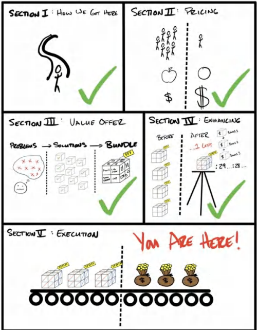

# **Phần V: Thực thi**

**LÀM SAO ĐỂ BIẾN ĐIỀU NÀY THÀNH HIỆN THỰC TRONG THẾ GIỚI THỰC**

## **$100.000 ĐẦU TIÊN CỦA BẠN**

>*"Kiếm 100.000 đô la đầu tiên là một việc cực kỳ khốn nạn, nhưng bạn phải làm điều đó. Tôi không quan tâm bạn phải làm gì—kể cả việc phải đi bộ khắp nơi và không ăn bất cứ thứ gì không được mua bằng phiếu giảm giá, hãy tìm cách để có được 100.000 đô la. Sau đó, bạn có thể nhả chân ga ra một chút."* 
>— CHARLIE MUNGER, PHÓ CHỦ TỊCH BERKSHIRE HATHAWAY

**Tháng 3 năm 2017.**

Tim tôi đập loạn nhịp. Tôi có thể cảm nhận rõ ràng từng nhịp đập thình thịch trong lồng ngực. Tôi nghiến chặt hàm để ngăn cái cục nghẹn ở cổ họng mà tôi biết sẽ dẫn đến những giọt nước mắt. Tôi muốn buông xuôi. Sau nhiều năm dồn nén cảm xúc của mình.

Nhiều năm phớt lờ thực tại và sự thiếu vắng thành công của bản thân. Nhiều năm kìm nén cảm xúc để chỉ tập trung vào việc tiến về phía trước. Áp lực đang trào dâng lên tận cổ. Tôi có thể cảm nhận được nó.

"Chúng ta làm được rồi," tôi nói.

Leila, bây giờ là vợ tôi, ngước lên nhìn tôi. Cô ấy đang nấu bữa tối trong bếp và dừng lại, tay vẫn cầm cái phới lật. "Ý anh là sao?"

"Chúng ta làm được rồi. Chúng ta đã đạt 100 nghìn đô la." Tôi gần như không thể thốt nên lời vì tôi không muốn những giọt nước mắt phá vỡ giọng nói đang run rẩy của mình.

"Ý anh là doanh thu sao?"

"Không. Ý anh là trong tài khoản ngân hàng cá nhân của chúng ta."

"Trời đất ơi, thật sao?! Tuyệt quá đi!!"

Cô ấy chạy về phía tôi, bỏ mặc đồ ăn trên bếp, vòng tay qua cổ tôi, tay vẫn cầm cái phới lật.

"Em rất tự hào về anh"

Cô ấy ôm chặt lấy tôi. Tôi gục vào vòng tay cô ấy. Cảm giác như mọi nút thắt trong cơ thể mà tôi đang gồng gánh đều tan chảy biến mất cùng một lúc. Tôi gần như không thể kiềm chế được bản thân. Nhưng khi tôi nghĩ lại, cảm giác lúc đó không phải là hạnh phúc. Nó là sự giải thoát. Tôi đã chuyển từ nỗi sợ hãi sang cảm giác an toàn. Tôi đã đánh đổi cảm giác như một kẻ thất bại mỗi ngày, nhìn công việc và nỗ lực của mình không mang lại kết quả gì, để nhận lại một giấc mơ thành hiện thực. Nỗi lo lắng và nỗi sợ hãi thường trực với câu hỏi "chúng ta sẽ làm gì đây" cuối cùng đã được thay thế bằng một điều gì đó khác. Cuối cùng, tôi cũng có thời gian để cho phép mình cảm nhận tâm trạng của chính mình.

Tôi cảm thấy như chương "đấu tranh" này của cuộc đời cuối cùng đã khép lại.

"Nhìn này," tôi nói. "Đó là sự thật."

Tôi rúc đầu ra khỏi vòng tay của Leila. Tôi không muốn nhìn vào mắt cô ấy vì tôi biết điều đó sẽ khiến tôi rơi nước mắt. Tôi rút điện thoại ra và đặt nó vào giữa hai chúng tôi. Cả hai đều chằm chằm vào màn hình bất động với số dư tài khoản ngân hàng cá nhân.

*$101.018*

Ánh mắt của chúng tôi vẫn không dời đi khi điều đó xác nhận một thực tại mới, chung của cả hai. Đó không phải là ảo ảnh. Không phải là doanh thu. Không phải là "lợi nhuận" vẫn còn nằm trong tài khoản kinh doanh, chỉ đợi bị rút ra bởi một trường hợp khẩn cấp nào đó. Không phải là số tiền được "đánh dấu" phải dùng để trả nợ. Nó là của chúng tôi. Thực sự là vậy.

"Babe này," tôi nói. "Chúng ta có thể làm hỏng chuyện và chẳng kiếm được thêm một đồng nào trong ba năm liên tiếp, mà vẫn ổn."

Vào thời điểm đó, $33.000 một năm là quá đủ để chúng tôi sống với mức chi tiêu hiện tại trong vòng ba năm và thêm một chút nữa.

Nhiều năm lên lên xuống xuống. Nhiều năm cày cấy tiền bạc vào công ty (hay các công ty) của mình chỉ để thấy nó bốc hơi vào các chi phí cố định (overhead), tiền lương, và những sai lầm. Nhiều năm hội thảo, khóa học, workshop, chương trình huấn luyện, nhóm mastermind . . . CUỐI CÙNG LÀ CŨNG ĐÃ chuyển hóa thành sự giàu có. Cảm giác như tôi đã đột phá vào một cảnh giới mới. Sự gia tăng tiền tài tương đối đó lớn hơn bất cứ sự gia tăng nào tôi từng cảm nhận được.

Hàng chục triệu đô la trong ngân hàng sau này, thì đó vẫn là, và hiện tại vẫn luôn là, cảm giác giàu có nhất mà tôi từng cảm thấy trong đời. Đó là khởi đầu cho chương tiếp theo trong cuộc đời tôi với tư cách là một doanh nhân và người làm kinh doanh.

Một số người đạt được điều đó rất nhanh. Một số người đạt được rất chậm. Nhưng cuối cùng thì mọi người cũng sẽ đạt được, miễn là bạn không từ bỏ. Hãy tiếp tục tiến lên. Hãy tiếp tục đứng dậy. Hãy tiếp tục tin tưởng rằng điều đó có thể xảy ra.

Thực sự, nó sẽ xảy ra.

**Tóm gọn lại (In A Nutshell)**

Chúng ta đã bao quát rất nhiều thứ. Và tôi nghĩ rằng để thông tin thực sự thấm vào, nó cần được củng cố và nhắc lại. Dưới đây là danh sách gạch đầu dòng kiểu "viết vội lên mặt sau tờ khăn giấy" để tóm tắt những gì chúng ta đã học được và tại sao.

1. Chúng ta đã đi qua bài học tại sao bạn **không được** là một món hàng đại trà (commodity) trong thị trường này.
2. Tại sao bạn nên chọn một thị trường bình thường hoặc đang phát triển, và tại sao việc đào sâu vào các ngách nhỏ (niches) sẽ mang lại cho bạn sự giàu có.
3. Tại sao bạn nên tính phí cực kỳ cao.
4. Cách để tính phí cao nhờ sử dụng bốn động lực giá trị cốt lõi.
5. Cách tạo ra Bản chào hàng Giá trị của bạn trong 5 bước.
6. Cách xếp chồng giá trị, cung cấp nó, và khiến nó sinh lời.
7. Cách dịch chuyển đường cầu có lợi cho bạn thông qua **Sự khan hiếm** (scarcity).
8. Cách sử dụng **Sự khẩn cấp** (urgency) để giảm ngưỡng hành động của người mua.
9. Cách sử dụng một cách chiến lược các **Quà tặng kèm** (bonuses) để tăng nhu cầu cho bản chào hàng của bạn.
10. Cách đảo ngược hoàn toàn rủi ro của người mua bằng một **Cam kết** (guarantee) sáng tạo.
11. Cách **Đặt tên** cho nó theo một cách cộng hưởng sâu sắc với tệp khách hàng lý tưởng (avatar) của bạn.

Bây giờ bạn đã có một Bản chào hàng Grand Slam giá trị cao, lợi nhuận lớn, và phi đại trà. Đây là viên gạch nền tảng đầu tiên của một doanh nghiệp tuyệt vời — một sản phẩm hoặc dịch vụ mà mọi người vô cùng khao khát và thực sự giải quyết được vấn đề của họ. Đối với nhiều người, như thế này là đủ để tạo ra nhiều đơn hàng hơn, ở mức giá cao hơn, với lợi nhuận biên lớn hơn. Bản chào hàng Grand Slam thực sự đầu tiên nên có khả năng đưa bạn đạt được $100.000 đầu tiên của mình. Đối với những người khác, bạn vẫn sẽ muốn nhiều hơn thế. Đó là 100% quyền của bạn với tư cách là một nhà tư bản.

Vẫn còn rất nhiều điều nữa để xây dựng một cỗ máy thâu tóm khách hàng (acquisition machine) sinh lời. Tôi không thể bao quát tất cả chỉ trong một cuốn sách. Vì tôn trọng bạn, tôi muốn cuốn sách này thật kỹ lưỡng nhưng cũng dễ quản lý để áp dụng thực tế. Dù vậy, cuốn sách tiếp theo sẽ dành riêng cho chính xác mục tiêu đó — đạt được nhiều khách hàng hơn — thông qua việc tạo ra khách hàng tiềm năng (generating leads). Trong cuốn sách đó, tôi sẽ phân tích *chính xác* cách thâu tóm khách hàng mà vẫn có lợi nhuận. Tức là, nếu bạn thiết lập các chương trình khuyến mãi của mình một cách chính xác, bạn sẽ không bao giờ phải bỏ tiền "mua" một khách hàng mới nào nữa. Đó sẽ là chủ đề của **Acquisition.com Volume II $100M: Lead Generation** (Tạo tệp khách hàng tiềm năng trăm triệu đô).

**Những Lời Khuyên Cuối Cùng (Final Thoughts)**

Khởi nghiệp là về việc tiếp thu các kỹ năng, niềm tin và những phẩm chất tính cách. Để thăng tiến, tôi nhận thấy rằng chúng ta phải xác định xem mình *còn thiếu* những kỹ năng, niềm tin và phẩm chất tính cách nào. Thường thì, chúng ta chỉ cần cải thiện bản thân. Và cách duy nhất để làm điều đó là thông qua việc học từ kinh nghiệm và/hoặc từ các nguồn chất lượng cao. Tôi từng nhận được những lời khuyên tồi tệ từ những người đi trước tôi ở thời điểm đó. Và mặc dù kinh nghiệm là một người thầy tuyệt vời nhất, nhưng bà ấy không phải là người hiền từ nhất.

Hy vọng chân thành nhất của tôi là những gì tôi tạo ra sẽ mang đến những sự hướng dẫn mà tôi đã vô cùng khao khát khi mới bắt đầu hành trình khởi nghiệp. Và tôi cũng ước mình có thể bao quát tất cả chỉ trong một cuốn sách (vì lợi ích của cả tôi và bạn). Nhưng, để làm được cái điều mà tôi ước tôi đã từng được nhận, tôi lại không thể làm như thế. Con quỷ luôn nằm trong chi tiết. Sự xuất chúng nằm sâu trong sự hiểu biết và những sắc thái nhỏ nhặt. Đó là điều chia tách những người vĩ đại ra khỏi phần còn lại. Tôi hy vọng rằng trong tất cả nội dung tôi tạo ra, bạn nhìn thấy sự cống hiến của tôi đối với từng chi tiết và sắc thái nhỏ bé đó, thứ đã làm nên *sự khác biệt*. Những bài học này đã được đánh đổi bằng máu và nước mắt.

Tôi hy vọng bạn đã tận hưởng cuốn sách đầu tiên này trong chuỗi sách về Các Bản Chào Hàng. Trước khi chúng ta tiến lên cuốn thứ hai, tập trung vào việc tạo khách hàng tiềm năng như đã đề cập ở trên, tôi muốn vòng lại nơi chúng ta đã bắt đầu. Sau khi đọc xong cuốn sách này, tôi hy vọng:
1. Bạn đang đi đúng hướng để tạo ra Bản chào hàng Grand Slam đầu tiên của mình. Hoặc chí ít, có thể lấy các yếu tố bạn còn thiếu trong bản chào hàng hiện tại để làm cho nó hấp dẫn hơn trước thị trường của mình.
2. Tôi đã giữ đúng lời hứa từ đầu cuốn sách: rằng việc đầu tư 2 đến 3 tiếng đồng hồ của bạn vào đây sẽ mang lại một tỷ suất lợi nhuận cao hơn bất cứ điều gì khác mà bạn có thể làm.
3. Đổi lại, tôi hy vọng mình đã đi được một bước nhỏ bé tiến tới đạt được thứ mà tôi trân trọng nhất từ bạn -- **Sự tin tưởng của bạn.**

Cuối cùng, tôi hy vọng cuốn sách này tạo ra một sự thay đổi nhỏ trong việc cải thiện thế giới, bởi vì tôi tin rằng không có ai đang đến để giải cứu chúng ta cả. Nó là trách nhiệm của chúng ta, với tư cách là các doanh nhân, phải tự mình đổi mới để tiến vào một thế giới tốt đẹp hơn. Và đó là điều mà tôi sẵn lòng cống hiến trọn đời mình. Tôi cũng hy vọng bạn cũng như vậy.

Tôi thực sự biết ơn sự chú ý của bạn. Bạn có thể dành điều đó cho bất kỳ điều gì, nhưng bạn đã chọn quyết định đầu tư nó cho tôi. Tôi rất trân trọng điều này. Trân trọng cảm ơn bạn.

Luôn giữ cho mình sự khao khát (Stay hungry),

Alex

PS - (Xem "vé vàng" bên dưới)

>**VÉ VÀNG: DÀNH CHO MỘT NGƯỜI (GOLDEN TICKET: ADMIT ONE)** 
>&emsp;Nếu bạn đang đạt doanh thu từ $3 triệu đến $50 triệu mỗi năm và bạn muốn tôi giúp tư vấn tỷ lệ 1-kèm-1 trong việc mở rộng doanh nghiệp, hãy truy cập Acquisition.com. Rõ ràng hơn, **chúng tôi giúp các công ty trong lĩnh vực dịch vụ, giáo dục, đào tạo, tư vấn, chuỗi cửa hàng vật lý, hoặc cấp quyền thương hiệu trong các thị trường ngách (niche licensing) mở rộng quy mô lợi nhuận với một sự chắc chắn rằng để họ chỉ phải kiếm được một đống tiền (get rich) đúng một lần.** Tôi không phải là kiểu người sẽ giúp bạn đi tìm "đồng đô la đầu tiên" của mình, tôi là kiểu người sẽ "làm ra đồng đô la cuối cùng bạn cần kiếm" trong đời. Nếu bạn thấy có vẻ giống bạn, thì bạn đã đủ minh mẫn và sự nhạy bén để biết mình sẽ làm thế nào để liên hệ lại với tôi và đặt lịch tư vấn. Tôi rất mong có thể được gặp bạn, lắng nghe về doanh nghiệp của bạn, và từ đó xem xem liệu chúng tôi có thể giúp được gì cho bạn không.

>**Bạn sẽ không phản đối việc phát triển kinh doanh nhanh hơn chứ? Nếu không thì . . .** 
>&emsp;**CUỐN SÁCH TIẾP THEO.** Bạn có thể xem ngay cuốn sách tiếp theo của tôi có tên vô cùng phù hợp **Acquisition.com Volume II Lead Generation**. Nó chuyên bao quát về... việc làm thế nào để tạo tệp khách hàng tiềm năng. Bạn sẽ không bao giờ cảm thấy thiếu các khách hàng mới nếu bạn theo đúng các bước ở trong cuốn sách đó (đặc biệt là nay bạn đã được trang bị xong xuôi Bản chào hàng để làm vũ khí). Tôi chưa chắc đó có phải là cái tên cuối cùng không (nếu nó vẫn còn đang trong quá trình chỉnh sửa), nhưng nếu bạn tìm kiếm tên tôi, bạn sẽ thấy nó. Bạn cũng rất có khả năng sẽ có thể tìm thấy nó trên trang web Acquisition.com (hi vọng vậy nhé). 
>&emsp;**AUDIOBOOK.** Nếu bạn thích việc vừa nghe vừa cầm tất cả các sách của mình mọi lúc mọi nơi để tiện tham khảo (đó là cách tôi làm), bạn có thể mua **bản audible & bản kindle của tất cả các cuốn sách của tôi trên amazon**. Tôi thích việc có thể vừa nghe vừa đọc trong cùng một lúc, từ đó có thể tăng tốc độ tiêu thụ và tiếp thu hiểu biết của mình từ những cuốn sách. Bạn cứ tra tên sách lên đó và chúng sẽ luôn hiện lên. 
>&emsp;**PODCAST.** Nếu bạn thích hình thức nghe, tôi cũng có một kênh **Podcast được gọi là "The Game"**, tại đó bạn có thể đón các bài nghe ngắn tập trung vào những bài học có tính thực thi cao (những bài học ngộ ra từ nhiều sự thất bại) để có thể có được các kết quả mà mình mong muốn một cách nhanh hơn. Nhớ check qua podcast ở đây nghen: alexspodcast.com 
>&emsp;**YOUTUBE.** Tôi có một kênh YouTube phát các bài học vài lần một tuần: bạn chỉ cần gõ **"Alex Hormozi"** và bạn sẽ tìm ra tôi. 
>&emsp;**IG.** Bạn có thể theo dõi tôi trên mạng xã hội Instagram nếu bạn thích các nội dung mang tính nhân văn và gần gũi nhé: **@hormozi**
